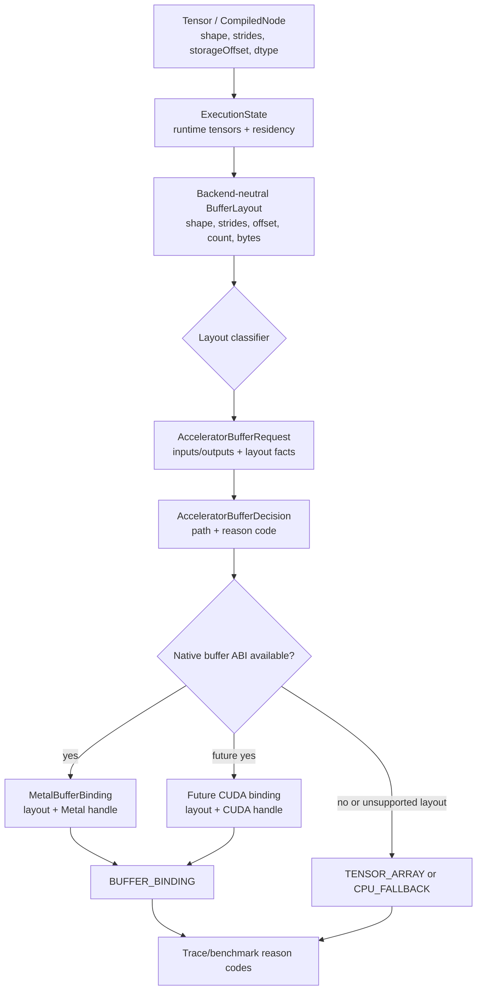

# Phase 1: Accelerator Buffer Layout ABI - Research

**Researched:** 2026-04-29 [VERIFIED: prompt current_date]
**Domain:** Java accelerator runtime buffer ABI, tensor layout metadata, Metal/CUDA backend seams [VERIFIED: .planning/ROADMAP.md; src/main/java/backend/accelerator/buffer; src/main/java/backend/metal/buffer; src/main/java/backend/cuda]
**Confidence:** HIGH for current code shape, MEDIUM for exact class names to add because the planner may choose equivalent names [VERIFIED: codebase inspection]

## User Constraints

No `001-CONTEXT.md` exists in `.planning/phases/001-accelerator-buffer-layout-abi`, so there are no discuss-phase locked decisions to copy verbatim. [VERIFIED: `test -f .planning/phases/001-accelerator-buffer-layout-abi/001-CONTEXT.md`]

Prompt constraints for this phase: extend the shared runtime device buffer model so Metal and future CUDA backends can describe logical tensor views, including strides and storage offsets, without baking Metal-specific assumptions into common code. [CITED: user prompt]

Phase requirements are ABI-01 through ABI-04 and cover binding metadata, backend neutrality, layout classification, and stable decision reason codes. [CITED: user prompt; .planning/REQUIREMENTS.md]

## Summary

The current common runtime buffer contract is too small for Phase 1: `DeviceBufferBinding` exposes only node id, backend id, logical byte length, availability, and a diagnostic string. [CITED: src/main/java/backend/memory/DeviceBufferBinding.java:11] Metal then carries dtype, shape, element count, native handle, and access in `MetalBufferBinding`, but it does not carry strides or storage offset. [CITED: src/main/java/backend/metal/buffer/MetalBufferBinding.java:25] Tensor and compile-time metadata already contain shape, strides, storage offset, contiguity, and dtype, so Phase 1 should lift those facts into a backend-neutral runtime layout descriptor instead of deriving them repeatedly inside Metal. [CITED: src/main/java/tensor/TensorMetadata.java:39; src/main/java/graph/CompiledNode.java:118]

Metal currently rejects buffer input and output layouts unless the runtime tensor is contiguous and has zero storage offset; this is enforced in `MetalAcceleratorBufferBinder` before allocation/reservation. [CITED: src/main/java/backend/metal/buffer/MetalAcceleratorBufferBinder.java:146; src/main/java/backend/metal/buffer/MetalAcceleratorBufferBinder.java:185] The tensor-array fallback path in `PreparedMetalExecutable` has the same layout restriction and separately rejects non-contiguous or offset tensors. [CITED: src/main/java/backend/metal/exec/PreparedMetalExecutable.java:380; src/main/java/backend/metal/exec/PreparedMetalExecutable.java:400]

**Primary recommendation:** Add a backend-neutral `AcceleratorBufferLayout`/`DeviceBufferLayout` value object plus `AcceleratorBufferLayoutClass` classification, attach it to `DeviceBufferBinding` and `AcceleratorBufferRequest`, and keep Metal execution conservative in Phase 1 by reporting exact layout reason codes without adding native strided execution yet. [VERIFIED: synthesis from ABI-01..ABI-04 and current code inspection]

## Project Constraints (from AGENTS.md)

- Keep public `Tensor` API logical; backend residency belongs in compile/prepare/execute runtime state. [CITED: AGENTS.md]
- Prefer backend-neutral accelerator abstractions over Metal-only or CUDA-only shortcuts. [CITED: AGENTS.md]
- Preserve CPU hot-path performance while improving accelerator execution. [CITED: AGENTS.md]
- Make fallback visible in traces and benchmark reports. [CITED: AGENTS.md]
- Do not commit local benchmark/calibration artifacts unless intentionally updating canonical profiles or fixtures. [CITED: AGENTS.md]
- Do not commit `.planning/tmp/` verification scratch files. [CITED: AGENTS.md]
- Before completing accelerator/runtime changes, run focused tests for the touched area; use targeted Gradle filters when full `./gradlew test` is too slow. [CITED: AGENTS.md]
- Common verification commands are `./gradlew classes`, `./gradlew test --tests <TestClassOrPattern>`, and `./gradlew metalTest`. [CITED: AGENTS.md]

<phase_requirements>

## Phase Requirements

| ID | Description | Research Support |
|----|-------------|------------------|
| ABI-01 | Runtime device buffer bindings can represent backend id, native handle identity, dtype, shape, strides, storage offset, logical element count, byte length, and access mode. | `DeviceBufferBinding` lacks dtype, shape, strides, storage offset, handle identity, and access; `MetalBufferBinding` has dtype/shape/count/handle/access but not strides/offset, so shared layout metadata must be added. [CITED: src/main/java/backend/memory/DeviceBufferBinding.java:11; src/main/java/backend/metal/buffer/MetalBufferBinding.java:25] |
| ABI-02 | The shared accelerator buffer model is backend-neutral and reusable by Metal now and CUDA later. | Shared records already exist in `backend.accelerator.buffer`; CUDA has a `CudaGraphBridge.supportsBufferBindings()` default false seam and `PreparedCudaExecutable` records buffer policy decisions without implementing native buffers. [CITED: src/main/java/backend/accelerator/buffer/AcceleratorBufferRequest.java:12; src/main/java/backend/cuda/bridge/CudaGraphBridge.java:54; src/main/java/backend/cuda/exec/PreparedCudaExecutable.java:84] |
| ABI-03 | Buffer compatibility checks distinguish dense contiguous tensors, zero-offset views, non-zero-offset views, permuted/strided views, broadcast/zero-stride views, and unsupported layouts. | Tensor metadata can already report contiguity, zero strides, broadcast views, and storage offsets; Metal currently collapses all non-contiguous/offset cases into "contiguous/zero-offset". [CITED: src/main/java/tensor/TensorMetadata.java:127; src/main/java/tensor/TensorMetadata.java:131; src/main/java/tensor/TensorMetadata.java:140; src/main/java/tensor/TensorMetadata.java:144; src/main/java/backend/metal/buffer/MetalAcceleratorBufferBinder.java:348] |
| ABI-04 | Buffer binding decisions expose stable reason codes for success, fallback, unsupported dtype, unsupported layout, unavailable native ABI, and required-but-unavailable buffer execution. | Stable decision records and reason codes already exist, but the enum has only generic `INPUT_NOT_CONTIGUOUS` and `OUTPUT_LAYOUT_UNSUPPORTED` layout codes and no explicit required-unavailable or layout-class-specific codes. [CITED: src/main/java/backend/accelerator/buffer/AcceleratorBufferDecision.java:22; src/main/java/backend/accelerator/buffer/AcceleratorBufferReasonCode.java:6] |

</phase_requirements>

## Architectural Responsibility Map

| Capability | Primary Tier | Secondary Tier | Rationale |
|------------|--------------|----------------|-----------|
| Logical tensor layout facts | Public Tensor API / Compile snapshot | Runtime state | Tensor and `CompiledNode` already own shape, strides, storage offset, dtype, and flat element count; runtime should copy these facts, not mutate public API. [CITED: src/main/java/tensor/TensorMetadata.java:39; src/main/java/graph/CompiledNode.java:118; src/main/java/graph/execution/ExecutionState.java:86] |
| Device buffer binding ABI | Backend-neutral runtime memory / accelerator buffer layer | Backend-specific Metal/CUDA packages | Common code should describe layout/dtype/access/bytes; backend packages should own native handles. [CITED: src/main/java/backend/memory/DeviceBufferBinding.java:4; src/main/java/backend/metal/buffer/MetalBufferBinding.java:25; src/main/java/backend/cuda/bridge/CudaGraphBridge.java:49] |
| Layout compatibility classification | Backend-neutral accelerator buffer layer | Metal binder for backend capabilities | ABI-03 requires shared categories, while each backend still decides whether a category is executable. [CITED: .planning/REQUIREMENTS.md; src/main/java/backend/metal/buffer/MetalAcceleratorBufferBinder.java:111] |
| Native handle lifetime | Backend-specific implementation | ExecutionState resources | Metal handles are wrapped by `MetalBufferHandle`/`MetalBufferResource`, and `ExecutionState` closes run resources in reverse allocation order. [CITED: src/main/java/backend/metal/buffer/MetalBufferBinding.java:25; src/main/java/graph/execution/ExecutionState.java:407] |
| Fallback observability | Prepared accelerator executable and traces | Buffer decision records | Metal publishes `lastAcceleratorBufferDecision` and converts failures to tensor-array or CPU fallback paths; CUDA already records a decision when buffers are required but unavailable. [CITED: src/main/java/backend/metal/exec/PreparedMetalExecutable.java:267; src/main/java/backend/cuda/exec/PreparedCudaExecutable.java:84] |

## Standard Stack

### Core

| Library / Layer | Version | Purpose | Why Standard |
|-----------------|---------|---------|--------------|
| Java | Toolchain target 25 in `build.gradle`; local launcher is Java 26 | Main implementation language and FFM/native-access host | Existing project is Java/Gradle and uses Java records/enums heavily in runtime contracts. [CITED: build.gradle:21; VERIFIED: `java -version`] |
| Gradle wrapper | 9.4.1 | Build and test orchestration | Existing repo wrapper and Metal test task are Gradle-based. [VERIFIED: `./gradlew --version`; CITED: build.gradle:123] |
| JUnit Jupiter | 5.11.2 | Focused unit/integration tests | Existing test suite uses JUnit Jupiter and Gradle `useJUnitPlatform()`. [CITED: build.gradle:17; build.gradle:37] |
| Existing `backend.accelerator.buffer` records | local source | Buffer policy request/decision/result records | This is the existing backend-neutral home for accelerator buffer policy. [CITED: src/main/java/backend/accelerator/buffer/AcceleratorBufferRequest.java:12; src/main/java/backend/accelerator/buffer/AcceleratorBufferDecision.java:22] |
| Existing `backend.memory` records | local source | Runtime residency and device binding integration | `ExecutionState` stores `DeviceBufferBinding` and residency state in this package. [CITED: src/main/java/graph/execution/ExecutionState.java:39] |

### Supporting

| Library / Layer | Version | Purpose | When to Use |
|-----------------|---------|---------|-------------|
| Metal native shim | local Objective-C source | Optional native Metal buffer execution | Run `metalTest` when touching Metal buffer binding or native buffer ABI behavior. [CITED: docs/metal-backend.md; build.gradle:123] |
| ASM | 9.6 | Existing CPU fused codegen dependency | Do not touch for Phase 1 unless tests reveal source hygiene/fused regressions. [CITED: build.gradle:14] |

### Alternatives Considered

| Instead of | Could Use | Tradeoff |
|------------|-----------|----------|
| Add layout fields directly to `MetalBufferBinding` only | Metal-only record expansion | Fails ABI-02 because CUDA and common decision logic cannot consume the same model. [CITED: .planning/REQUIREMENTS.md; src/main/java/backend/cuda/bridge/CudaGraphBridge.java:49] |
| Reuse `Tensor` directly in `DeviceBufferBinding` | Store runtime tensor references in binding | Violates project constraint to keep public tensors logical and would mix native residency with semantic API. [CITED: AGENTS.md; src/main/java/backend/memory/DeviceBufferBinding.java:4] |
| Native Metal strided ABI in Phase 1 | Pass strides/offset to Objective-C immediately | Phase 1 is the shared ABI; Phase 2 owns Metal layout-aware device flow and native capability expansion. [CITED: .planning/ROADMAP.md] |

**Installation:** No new package installation is recommended for Phase 1. [VERIFIED: build.gradle and source inspection]

## Architecture Patterns

### System Architecture Diagram



### Recommended Project Structure

```text
src/main/java/backend/
├── accelerator/buffer/
│   ├── AcceleratorBufferLayout.java          # backend-neutral logical layout descriptor [RECOMMENDED]
│   ├── AcceleratorBufferLayoutClass.java     # dense/offset/strided/broadcast/unsupported [RECOMMENDED]
│   ├── AcceleratorBufferLayoutClassifier.java# pure classification helper [RECOMMENDED]
│   └── existing request/decision records     # extend with layout facts/reason codes
├── memory/
│   └── DeviceBufferBinding.java              # expose layout(), dtype(), accessMode/native identity if common
├── metal/buffer/
│   └── MetalBufferBinding.java               # adapt to shared layout + Metal handle
└── cuda/
    └── bridge/exec seams                     # consume/record shared layout decisions, no native buffers yet
```

### Pattern 1: Put Layout Metadata In A Value Object

**What:** Add an immutable backend-neutral descriptor for dtype, shape, strides, storage offset, logical element count, logical byte length, and layout class. [VERIFIED: derived from ABI-01 and current missing fields]

**When to use:** Use it anywhere a buffer decision or binding needs layout facts without depending on `Tensor` or a backend handle. [CITED: src/main/java/backend/memory/DeviceBufferBinding.java:4]

**Example:**

```java
// Recommended shape; exact name can vary.
public record AcceleratorBufferLayout(
        DataType dataType,
        int[] shape,
        int[] strides,
        int storageOffset,
        long logicalElementCount,
        long logicalByteLength,
        AcceleratorBufferLayoutClass layoutClass
) {
    public static AcceleratorBufferLayout fromTensor(Tensor tensor) {
        return AcceleratorBufferLayoutClassifier.describe(
                tensor.getDataType(),
                tensor.getShape(),
                tensor.getStrides(),
                tensor.getStorageOffsetUnsafe(),
                tensor.getFlatDataSize()
        );
    }
}
```

### Pattern 2: Classify Layout Before Backend Capability Checks

**What:** First classify facts as `DENSE_CONTIGUOUS`, `ZERO_OFFSET_VIEW`, `NON_ZERO_OFFSET_VIEW`, `PERMUTED_OR_STRIDED_VIEW`, `BROADCAST_ZERO_STRIDE_VIEW`, or `UNSUPPORTED`; then let Metal/CUDA decide support. [VERIFIED: ABI-03 and current Tensor metadata capabilities]

**When to use:** Use this in `MetalAcceleratorBufferBinder.inputDecisions(...)` and `outputDecisions(...)`, and in tests that assert reason-code behavior. [CITED: src/main/java/backend/metal/buffer/MetalAcceleratorBufferBinder.java:111; src/main/java/backend/metal/buffer/MetalAcceleratorBufferBinder.java:179]

**Example:**

```java
AcceleratorBufferLayout layout = AcceleratorBufferLayout.fromTensor(tensor);
if (layout.layoutClass() != AcceleratorBufferLayoutClass.DENSE_CONTIGUOUS) {
    return new AcceleratorBufferOutputDecision(
            nodeId,
            false,
            AcceleratorBufferReasonCode.OUTPUT_LAYOUT_UNSUPPORTED,
            "layout=" + layout.layoutClass()
    );
}
```

### Pattern 3: Keep Native Handles Backend-Specific

**What:** Common layout objects should not know about `MTLBuffer`, CUDA device pointers, or Java FFM `MemorySegment` handles; backend bindings compose common layout plus native handle identity. [CITED: src/main/java/backend/memory/DeviceBufferBinding.java:6; src/main/java/backend/metal/buffer/MetalBufferBinding.java:25]

**When to use:** Use in `MetalBufferBinding` now and a future CUDA buffer binding later. [CITED: src/main/java/backend/cuda/bridge/CudaGraphBridge.java:49]

### Anti-Patterns to Avoid

- **Metal-only ABI fields in common code:** Common records should describe backend id, layout, dtype, byte length, access intent, and native identity string/object-independent facts; native handle classes stay under backend packages. [CITED: AGENTS.md; src/main/java/backend/metal/buffer/MetalBufferBinding.java:25]
- **Treating `isContiguous()` as enough:** A tensor can be contiguous but have non-zero `storageOffset`; current Metal rejects either condition, and ABI-03 requires distinguishing the cases. [CITED: src/main/java/tensor/TensorMetadata.java:127; src/main/java/tensor/TensorMetadata.java:144; src/main/java/backend/metal/buffer/MetalAcceleratorBufferBinder.java:352]
- **Promoting reserved output buffers before native success:** `ExecutionState.reserveDeviceBufferBinding(...)` intentionally does not mark data current; promotion belongs after successful native execution. [CITED: src/main/java/graph/execution/ExecutionState.java:246; src/main/java/backend/metal/exec/PreparedMetalExecutable.java:144]
- **Adding public device tensor API:** Project scope explicitly keeps backend residency in runtime state. [CITED: AGENTS.md; .planning/PROJECT.md]

## Current Implementation Findings

### Current Buffer Binding Data Model

`DeviceBufferBinding` is an interface with five methods: `nodeId()`, `backendId()`, `logicalByteLength()`, `available()`, and `describe()`. [CITED: src/main/java/backend/memory/DeviceBufferBinding.java:11] It does not expose dtype, shape, strides, storage offset, element count, access mode, or backend-neutral native handle identity. [VERIFIED: src/main/java/backend/memory/DeviceBufferBinding.java:11]

`MetalBufferBinding` implements `DeviceBufferBinding` and adds `DataType`, shape, element count, `MetalBufferHandle`, and `MetalBufferAccess`. [CITED: src/main/java/backend/metal/buffer/MetalBufferBinding.java:25] It still lacks strides and storage offset, so it cannot represent a logical view over a larger device buffer. [VERIFIED: src/main/java/backend/metal/buffer/MetalBufferBinding.java:25]

`ExecutionState` stores active and reserved `DeviceBufferBinding` maps by node id, and validates only node id and `available()` before accepting a binding. [CITED: src/main/java/graph/execution/ExecutionState.java:39; src/main/java/graph/execution/ExecutionState.java:527] This is the right attachment point for expanded shared metadata because it is already per-run runtime state. [VERIFIED: src/main/java/graph/execution/ExecutionState.java:25]

### Existing Layout Metadata Sources

`TensorMetadata` owns shape, strides, storage offset, contiguity, zero-stride detection, broadcast-view detection, and flat size calculation. [CITED: src/main/java/tensor/TensorMetadata.java:8; src/main/java/tensor/TensorMetadata.java:95; src/main/java/tensor/TensorMetadata.java:127] `Tensor` exposes defensive copies for shape/strides and unsafe accessors for runtime internals, including `getStorageOffsetUnsafe()`. [CITED: src/main/java/tensor/Tensor.java:554; src/main/java/tensor/Tensor.java:572; src/main/java/tensor/Tensor.java:714]

`CompiledNode.snapshot(...)` captures `shape`, `strides`, `storageOffset`, `dataType`, `contiguous`, `hasStorageOffset`, and `flatDataSize` from each semantic tensor. [CITED: src/main/java/graph/CompiledNode.java:118] `ExecutionState.create(...)` constructs runtime tensors from those captured shape/stride/offset facts. [CITED: src/main/java/graph/execution/ExecutionState.java:86]

Layout operations already create view-like tensors: `reshape` can preserve storage offset for contiguous inputs, `expand` builds zero strides, and `permute` reorders strides. [CITED: src/main/java/tensor/ops/layout/TensorLayoutOps.java:55; src/main/java/tensor/ops/layout/TensorLayoutOps.java:87; src/main/java/tensor/ops/layout/TensorLayoutOps.java:118]

### Metal Rejection Points

Metal buffer preflight rejects input tensors when `!tensor.isContiguous()` or `tensor.hasStorageOffset()`, returning `INPUT_NOT_CONTIGUOUS` with a generic "contiguous/zero-offset" reason. [CITED: src/main/java/backend/metal/buffer/MetalAcceleratorBufferBinder.java:146; src/main/java/backend/metal/buffer/MetalAcceleratorBufferBinder.java:348]

Metal buffer preflight rejects output tensors with the same `!isContiguous()` or `hasStorageOffset()` check, returning `OUTPUT_LAYOUT_UNSUPPORTED`. [CITED: src/main/java/backend/metal/buffer/MetalAcceleratorBufferBinder.java:185; src/main/java/backend/metal/buffer/MetalAcceleratorBufferBinder.java:358]

Metal tensor-array fallback also rejects non-contiguous and offset inputs/outputs before bridge execution. [CITED: src/main/java/backend/metal/exec/PreparedMetalExecutable.java:380; src/main/java/backend/metal/exec/PreparedMetalExecutable.java:400]

Tests already assert the current coarse fallback behavior for non-contiguous output and adjacent buffer reuse. [CITED: src/test/java/backend/metal/exec/PreparedMetalExecutableBufferBindingTest.java:261; src/test/java/backend/metal/exec/PreparedMetalExecutableBufferBindingTest.java:299]

## Recommended Phase 1 Boundaries

1. Add backend-neutral layout descriptors and classifiers; do not add native Metal stride/offset execution yet. [VERIFIED: roadmap Phase 1 vs Phase 2 split in .planning/ROADMAP.md]
2. Extend `DeviceBufferBinding` to expose shared layout, dtype, access mode, byte length, and a backend-neutral native handle identity string or stable diagnostic token. [VERIFIED: ABI-01 vs current interface]
3. Extend `AcceleratorBufferRequest` to carry per-input and per-output layout descriptors, not only node ids and dtypes. [CITED: src/main/java/backend/accelerator/buffer/AcceleratorBufferRequest.java:12]
4. Extend `AcceleratorBufferReasonCode` only with stable categories needed by ABI-04, preferably without deleting or renaming existing enum constants used by tests/traces. [CITED: src/main/java/backend/accelerator/buffer/AcceleratorBufferReasonCode.java:6; src/test/java/backend/cuda/exec/PreparedCudaExecutableBufferPolicyTest.java:41]
5. Adapt `MetalBufferBinding` and `MetalAcceleratorBufferBinder` to use the shared layout descriptor while preserving current conservative accept/reject behavior. [CITED: src/main/java/backend/metal/buffer/MetalBufferBinding.java:25; src/main/java/backend/metal/buffer/MetalAcceleratorBufferBinder.java:41]
6. Update CUDA policy seams to record the shared reason code for required-but-unavailable buffer execution without implementing native CUDA buffers. [CITED: src/main/java/backend/cuda/exec/PreparedCudaExecutable.java:84; src/main/java/backend/cuda/bridge/CudaGraphBridge.java:54]
7. Add focused tests for layout classification and decision reason codes; defer native Metal view execution tests to Phase 2. [VERIFIED: roadmap Phase 2 ownership]

## Don't Hand-Roll

| Problem | Don't Build | Use Instead | Why |
|---------|-------------|-------------|-----|
| Tensor layout inference | New ad hoc stride math inside Metal | `TensorMetadata`, `Tensor` accessors, and `CompiledNode` snapshots | These already hold the authoritative shape/stride/offset facts. [CITED: src/main/java/tensor/TensorMetadata.java:39; src/main/java/graph/CompiledNode.java:118] |
| Runtime residency map | Backend-specific maps outside `ExecutionState` | Existing `ExecutionState` active/reserved binding maps | Existing lifecycle closes resources and clears bindings per run. [CITED: src/main/java/graph/execution/ExecutionState.java:39; src/main/java/graph/execution/ExecutionState.java:417] |
| Fallback diagnostics | Free-form strings only | `AcceleratorBufferDecision` plus stable `AcceleratorBufferReasonCode` | Tests and traces already consume stable decision codes. [CITED: src/main/java/backend/accelerator/buffer/AcceleratorBufferDecision.java:22; src/test/java/backend/cuda/exec/PreparedCudaExecutableBufferPolicyTest.java:41] |
| Native handle abstraction | Common `Object`/`MemorySegment` handle in shared code | Backend-specific handle records plus common native identity diagnostics | Metal owns `MetalBufferHandle`; CUDA has not defined a native buffer lifetime contract yet. [CITED: src/main/java/backend/metal/buffer/MetalBufferBinding.java:25; src/main/java/backend/cuda/bridge/CudaGraphBridge.java:49] |
| Full CUDA native buffer support | A placeholder CUDA device pointer ABI | Keep CUDA `supportsBufferBindings()` false and consume shared decision contracts | Requirements say CUDA-ready, not production CUDA native implementation in Phase 1. [CITED: .planning/PROJECT.md; .planning/ROADMAP.md] |

**Key insight:** Phase 1 should standardize what a runtime buffer *means*; later phases decide which backend can execute which layout classes natively. [VERIFIED: roadmap phase split]

## Common Pitfalls

### Pitfall 1: Conflating Contiguity With Zero Offset

**What goes wrong:** A contiguous view with `storageOffset != 0` is treated the same as dense storage starting at byte zero. [VERIFIED: current Metal checks combine the conditions]

**Why it happens:** Current preflight returns a single "contiguous/zero-offset" reason for both non-contiguous strides and non-zero offset. [CITED: src/main/java/backend/metal/buffer/MetalAcceleratorBufferBinder.java:352]

**How to avoid:** Add explicit layout classes and reason details for `DENSE_CONTIGUOUS`, `ZERO_OFFSET_VIEW`, and `NON_ZERO_OFFSET_VIEW`. [VERIFIED: ABI-03]

**Warning signs:** Tests assert only `OUTPUT_LAYOUT_UNSUPPORTED` but not the actual layout class. [CITED: src/test/java/backend/metal/exec/PreparedMetalExecutableBufferBindingTest.java:261]

### Pitfall 2: Breaking Existing Enum Consumers

**What goes wrong:** Renaming existing reason codes breaks tests and trace/report consumers that compare enum names. [CITED: src/test/java/backend/cuda/exec/PreparedCudaExecutableBufferPolicyTest.java:41]

**Why it happens:** `AcceleratorBufferReasonCode` is already used as a stable output contract. [CITED: src/main/java/backend/accelerator/buffer/AcceleratorBufferReasonCode.java:4]

**How to avoid:** Add new enum constants instead of renaming/removing current ones; map old broad conditions to richer details where backwards compatibility matters. [VERIFIED: codebase compatibility requirement]

**Warning signs:** Existing tests fail because messages no longer contain `BACKEND_BUFFER_NOT_IMPLEMENTED` or current fallback strings. [CITED: src/test/java/backend/cuda/exec/PreparedCudaExecutableBufferPolicyTest.java:43; src/test/java/backend/metal/exec/PreparedMetalExecutableBufferBindingTest.java:273]

### Pitfall 3: Leaking Backend Handles Into Common ABI

**What goes wrong:** Shared code begins depending on Metal FFM handle classes or CUDA pointer types. [VERIFIED: risk from target design]

**Why it happens:** `MetalBufferBinding` currently owns both common facts and `MetalBufferHandle`, making it tempting to copy the same shape into common interfaces. [CITED: src/main/java/backend/metal/buffer/MetalBufferBinding.java:25]

**How to avoid:** Put logical layout/access/native identity diagnostics in common records; keep concrete handles under backend packages. [CITED: src/main/java/backend/memory/DeviceBufferBinding.java:6]

**Warning signs:** `backend.memory` or `backend.accelerator.buffer` imports `backend.metal.*`, `backend.cuda.*`, or `java.lang.foreign.MemorySegment` for native buffer handles. [VERIFIED: architecture boundary]

### Pitfall 4: Promoting Output Bindings Too Early

**What goes wrong:** Runtime marks a reserved output buffer as current before native execution succeeds, allowing stale or unwritten data to flow. [CITED: src/main/java/graph/execution/ExecutionState.java:246]

**Why it happens:** Active and reserved binding maps are both queryable through `writableDeviceBufferBindingForNodeId(...)`. [CITED: src/main/java/graph/execution/ExecutionState.java:316]

**How to avoid:** Preserve the current reserve/promote flow; attach only after `executeBuffers(...)` succeeds and does not report CPU fallback. [CITED: src/main/java/backend/metal/exec/PreparedMetalExecutable.java:135; src/main/java/backend/metal/exec/PreparedMetalExecutable.java:144]

**Warning signs:** A failed buffer execution leaves `deviceBufferBindingForNodeId(output)` non-null. [CITED: src/test/java/backend/metal/exec/PreparedMetalExecutableBufferBindingTest.java:347]

### Pitfall 5: Accidentally Running The Slow Full Test Suite For Every Iteration

**What goes wrong:** `./gradlew test` can include debug/benchmark-style tests and take too long for fast feedback. [CITED: .planning/codebase/CONCERNS.md; .planning/codebase/TESTING.md]

**Why it happens:** `build.gradle` uses `useJUnitPlatform()` but does not exclude benchmark tags from the default `test` task. [CITED: build.gradle:37]

**How to avoid:** Use targeted `--tests` filters during Phase 1 and reserve `metalTest` for Metal-native validation. [CITED: AGENTS.md; build.gradle:123]

## Code Examples

### Layout Classifier Shape

```java
public enum AcceleratorBufferLayoutClass {
    DENSE_CONTIGUOUS,
    ZERO_OFFSET_VIEW,
    NON_ZERO_OFFSET_VIEW,
    PERMUTED_OR_STRIDED_VIEW,
    BROADCAST_ZERO_STRIDE_VIEW,
    UNSUPPORTED
}
```

### Binding Interface Shape

```java
public interface DeviceBufferBinding {
    int nodeId();
    String backendId();
    AcceleratorBufferLayout layout();
    AcceleratorBufferAccessMode accessMode();
    String nativeHandleIdentity();
    boolean available();
    String describe();

    default long logicalByteLength() {
        return layout().logicalByteLength();
    }
}
```

### Metal Adapter Shape

```java
public record MetalBufferBinding(
        int nodeId,
        AcceleratorBufferLayout layout,
        MetalBufferHandle handle,
        MetalBufferAccess access
) implements DeviceBufferBinding {
    @Override
    public String backendId() {
        return ComputeBackend.GPU_METAL.name();
    }

    @Override
    public boolean available() {
        return handle.available() && handle.byteLength() >= layout.logicalByteLength();
    }
}
```

## State Of The Art

| Old / Current Approach | Phase 1 Approach | When Changed | Impact |
|------------------------|------------------|--------------|--------|
| `DeviceBufferBinding` exposes only node/backend/bytes/availability/description. [CITED: src/main/java/backend/memory/DeviceBufferBinding.java:11] | Expose backend-neutral layout and access metadata while keeping native handles backend-specific. [VERIFIED: ABI-01/ABI-02] | Phase 1 | Planner can reason about view layouts without Metal-specific classes. |
| Metal classifies layout with `isContiguous || storageOffset` checks only. [CITED: src/main/java/backend/metal/buffer/MetalAcceleratorBufferBinder.java:348] | Shared classifier distinguishes dense, offset, strided/permuted, zero-stride broadcast, and unsupported. [VERIFIED: ABI-03] | Phase 1 | Traces can explain fallback precisely. |
| CUDA buffer bindings are not implemented and required mode fails with `BACKEND_BUFFER_NOT_IMPLEMENTED`. [CITED: src/main/java/backend/cuda/exec/PreparedCudaExecutable.java:84] | CUDA keeps native buffers unavailable but consumes the same reason-code taxonomy. [VERIFIED: Phase 1 scope] | Phase 1 | Future CUDA can implement the same ABI without redesign. |

**Deprecated/outdated:** None detected for this phase; current code is intentionally narrow rather than deprecated. [VERIFIED: codebase inspection]

## Exact Files Likely Affected

| File | Expected Change |
|------|-----------------|
| `src/main/java/backend/memory/DeviceBufferBinding.java` | Add common layout/access/native identity methods or delegate to a new adjacent common record. [VERIFIED: ABI gap] |
| `src/main/java/backend/accelerator/buffer/AcceleratorBufferRequest.java` | Add per-input and per-output layout descriptors. [VERIFIED: current request has only ids and dtypes] |
| `src/main/java/backend/accelerator/buffer/AcceleratorBufferReasonCode.java` | Add layout-class and required-unavailable codes without removing existing constants. [VERIFIED: ABI-04] |
| `src/main/java/backend/accelerator/buffer/AcceleratorBufferInputDecision.java` | Optionally include layout class/details for diagnostics. [VERIFIED: current record has reason only] |
| `src/main/java/backend/accelerator/buffer/AcceleratorBufferOutputDecision.java` | Optionally include layout class/details for diagnostics. [VERIFIED: current record has reason only] |
| `src/main/java/backend/accelerator/buffer/AcceleratorBufferLayout*.java` | New value object/classifier files. [RECOMMENDED] |
| `src/main/java/backend/metal/buffer/MetalBufferBinding.java` | Replace duplicated dtype/shape/count fields with shared layout or add layout while preserving access/handle. [VERIFIED: current record fields] |
| `src/main/java/backend/metal/buffer/MetalAcceleratorBufferBinder.java` | Use shared layout descriptors and emit exact layout reason details while preserving conservative execution. [VERIFIED: current preflight location] |
| `src/main/java/backend/metal/buffer/MetalBufferAllocator.java` | Create bindings using shared layout from tensor/shape/count. [VERIFIED: current factory methods] |
| `src/main/java/backend/metal/buffer/MetalDeviceToCpuMaterializer.java` | Compare target tensor to binding layout, including shape/count and eventually offset/stride constraints. [VERIFIED: current materializer checks shape/count] |
| `src/main/java/backend/metal/exec/PreparedMetalExecutable.java` | Build buffer requests with layout metadata and preserve required-mode failure behavior. [VERIFIED: current request construction] |
| `src/main/java/backend/cuda/exec/PreparedCudaExecutable.java` | Keep required unavailable decision aligned with new reason taxonomy. [VERIFIED: CUDA policy seam] |
| `src/main/java/backend/cuda/bridge/CudaGraphBridge.java` | No native implementation needed; possibly document default buffer-binding contract. [VERIFIED: default false seam] |
| `src/test/java/backend/metal/exec/PreparedMetalExecutableBufferBindingTest.java` | Update existing assertions and add exact layout-class cases. [VERIFIED: existing buffer tests] |
| `src/test/java/backend/metal/buffer/MetalBufferAllocatorTest.java` | Update binding construction and materialization shape/layout assertions. [VERIFIED: existing allocator test] |
| `src/test/java/graph/execution/ExecutionStateResidencyTest.java` | Update fake binding implementations for new interface methods. [VERIFIED: fake `DeviceBufferBinding`] |
| `src/test/java/backend/cuda/exec/PreparedCudaExecutableBufferPolicyTest.java` | Assert required-unavailable CUDA reason remains stable. [VERIFIED: existing CUDA test] |

## Assumptions Log

| # | Claim | Section | Risk if Wrong |
|---|-------|---------|---------------|
| A1 | Exact new class names such as `AcceleratorBufferLayout` and `AcceleratorBufferLayoutClass` are recommended names, not existing locked names. | Architecture Patterns / Code Examples | Low; planner can choose equivalent names if package ownership and behavior stay consistent. |
| A2 | Native handle identity is a diagnostic token for the current run/report, not a persistent cross-run key or ownership handle. | Open Questions (RESOLVED) | Low; the common ABI avoids native handle ownership and leaves backend handles backend-owned. |
| A3 | The research validity window of 30 days is an estimate, not a project policy. | Metadata | Low; planner can refresh research if implementation changes first. |

## Open Questions (RESOLVED)

1. **RESOLVED: `logicalElementCount` stays `long` in the accelerator buffer ABI while tensor flat size remains `int` in Phase 1.** [VERIFIED: current `TensorMetadata.getFlatSize()` returns `int`]
   - What we know: ABI-01 asks for logical element count, and `MetalBufferBinding.elementCount` is already `long`. [CITED: src/main/java/backend/metal/buffer/MetalBufferBinding.java:25]
   - Decision: Use `long` in the ABI descriptor while deriving from current `int` flat sizes for Phase 1. A broader long-shape/storage migration remains v2 scaling work. [VERIFIED: minimal ABI expansion; CITED: .planning/REQUIREMENTS.md]

2. **RESOLVED: access mode is a shared accelerator enum mapped from backend-specific enums.** [VERIFIED: current Metal has `MetalBufferAccess`]
   - What we know: ABI-01 requires access mode, and Metal already has backend-specific `MetalBufferAccess`. [CITED: src/main/java/backend/metal/buffer/MetalBufferBinding.java:25]
   - Decision: Add a common `AcceleratorBufferAccessMode` and map Metal access to it. CUDA can later map its own access semantics to the same shared enum without importing CUDA classes into common ABI code. [RECOMMENDED]

3. **RESOLVED: common code exposes only a diagnostic native handle identity string, not a native handle object.** [VERIFIED: ABI-01 says native handle identity]
   - What we know: Common code should not dereference native handles, and Metal handles are opaque backend values. [CITED: src/main/java/backend/memory/DeviceBufferBinding.java:6; src/main/java/backend/metal/buffer/MetalBufferBinding.java:25]
   - Decision: Use a backend-neutral `nativeHandleIdentity()` string/diagnostic token for traces and reports. It is stable enough to identify a binding within a run/report, but it is not a persistent cross-run key and must not be used for ownership, equality, or native dereference. [RECOMMENDED]

## Environment Availability

| Dependency | Required By | Available | Version | Fallback |
|------------|-------------|-----------|---------|----------|
| Java runtime | Compile/test execution | Yes | Local launcher Java 26; project target Java 25 | Use configured Gradle toolchain if available. [VERIFIED: `java -version`; CITED: build.gradle:21] |
| Gradle wrapper | Build/test commands | Yes | Gradle 9.4.1 | None needed. [VERIFIED: `./gradlew --version`] |
| Xcode tools / `xcrun` | Metal native shim build for `metalTest` | Yes | `xcrun version 72` | Java-only tests can run without native Metal. [VERIFIED: `xcrun --version`; CITED: build.gradle:123] |
| Native CUDA shim | CUDA buffer implementation | No checked-in native shim needed for Phase 1 | N/A | Keep CUDA buffer bindings unavailable with stable decisions. [CITED: .planning/codebase/CONCERNS.md; src/main/java/backend/cuda/bridge/CudaGraphBridge.java:54] |

**Missing dependencies with no fallback:** None for Phase 1 planning. [VERIFIED: environment audit]

**Missing dependencies with fallback:** Native CUDA buffer implementation is absent; fallback is existing CUDA unavailable/buffer-not-implemented policy. [CITED: src/main/java/backend/cuda/exec/PreparedCudaExecutable.java:84]

## Validation Architecture

### Test Framework

| Property | Value |
|----------|-------|
| Framework | JUnit Jupiter 5.11.2 [CITED: build.gradle:17] |
| Config file | `build.gradle` [CITED: build.gradle:37] |
| Quick run command | `./gradlew test --tests backend.metal.exec.PreparedMetalExecutableBufferBindingTest --tests backend.metal.buffer.MetalBufferAllocatorTest --tests graph.execution.ExecutionStateResidencyTest --tests backend.cuda.exec.PreparedCudaExecutableBufferPolicyTest` [VERIFIED: existing test files] |
| Full relevant command | `./gradlew classes && ./gradlew metalTest` [CITED: AGENTS.md; build.gradle:123] |

### Phase Requirements -> Test Map

| Req ID | Behavior | Test Type | Automated Command | File Exists? |
|--------|----------|-----------|-------------------|--------------|
| ABI-01 | Binding exposes dtype, shape, strides, storage offset, count, bytes, access, backend id, and native identity. | Unit | `./gradlew test --tests graph.execution.ExecutionStateResidencyTest` plus new binding layout tests | Partial; add Wave 0 tests. [VERIFIED: existing fake bindings need updates] |
| ABI-02 | Metal and CUDA consume backend-neutral layout/decision records without common native handle leakage. | Unit | `./gradlew test --tests backend.cuda.exec.PreparedCudaExecutableBufferPolicyTest --tests backend.metal.exec.PreparedMetalExecutableBufferBindingTest` | Partial. [VERIFIED: existing files] |
| ABI-03 | Classifier distinguishes dense, zero-offset view, non-zero-offset view, strided/permuted, broadcast/zero-stride, unsupported. | Unit | `./gradlew test --tests backend.accelerator.buffer.AcceleratorBufferLayoutClassifierTest` | No; Wave 0. [VERIFIED: no file found by rg] |
| ABI-04 | Decisions expose stable reason codes for success/fallback/dtype/layout/native ABI/required unavailable. | Unit | `./gradlew test --tests backend.metal.exec.PreparedMetalExecutableBufferBindingTest --tests backend.cuda.exec.PreparedCudaExecutableBufferPolicyTest` | Partial. [VERIFIED: existing tests assert reason names] |

### Sampling Rate

- **Per task commit:** Run targeted tests for touched records/backends. [CITED: AGENTS.md]
- **Per wave merge:** Run `./gradlew classes` and the four focused test classes listed above. [VERIFIED: project verification pattern]
- **Phase gate:** Run `./gradlew metalTest` on macOS when Metal binding behavior changes. [CITED: build.gradle:123]

### Wave 0 Gaps

- [ ] `src/test/java/backend/accelerator/buffer/AcceleratorBufferLayoutClassifierTest.java` - covers ABI-03 layout categories. [VERIFIED: missing by codebase grep]
- [ ] Update fake `DeviceBufferBinding` implementations in `ExecutionStateResidencyTest` and `PreparedMetalExecutableBufferBindingTest` after interface expansion. [CITED: src/test/java/graph/execution/ExecutionStateResidencyTest.java:280; src/test/java/backend/metal/exec/PreparedMetalExecutableBufferBindingTest.java:645]
- [ ] Add Metal decision tests for non-zero-offset contiguous view, permuted view, and broadcast zero-stride view. [VERIFIED: current tests cover non-contiguous output broadly only]

## Security Domain

### Applicable ASVS Categories

| ASVS Category | Applies | Standard Control |
|---------------|---------|------------------|
| V2 Authentication | No | No authentication surface in this phase. [CITED: .planning/codebase/ARCHITECTURE.md] |
| V3 Session Management | No | No session surface in this phase. [CITED: .planning/codebase/ARCHITECTURE.md] |
| V4 Access Control | No | Local runtime library, not multi-user authorization. [VERIFIED: codebase architecture] |
| V5 Input Validation | Yes | Validate dtype, shape, strides length, storage offset, byte length, access mode, and backend id before accepting bindings. [CITED: src/main/java/tensor/TensorMetadata.java:39; src/main/java/graph/execution/ExecutionState.java:527] |
| V6 Cryptography | No | No cryptographic behavior in this phase. [VERIFIED: codebase inspection] |

### Known Threat Patterns for Native Buffer ABI

| Pattern | STRIDE | Standard Mitigation |
|---------|--------|---------------------|
| Native handle misuse or stale closed handle | Tampering / Denial of Service | Keep concrete native handles backend-specific and run-scoped; close resources through `ExecutionState.closeResources()`. [CITED: src/main/java/graph/execution/ExecutionState.java:407] |
| ABI mismatch hidden as fallback | Repudiation / Tampering | Keep native ABI availability explicit through reason codes and required-mode failures. [CITED: src/main/java/backend/metal/exec/PreparedMetalExecutable.java:291; src/main/java/backend/cuda/exec/PreparedCudaExecutable.java:84] |
| Out-of-bounds logical byte length | Tampering / Denial of Service | Validate `handle.byteLength() >= layout.logicalByteLength()` before accepting a binding. [CITED: src/main/java/backend/metal/buffer/MetalBufferBinding.java:75] |

## Sources

### Primary (HIGH confidence)

- `.planning/PROJECT.md` - project goals, active accelerator ABI requirements, constraints, and phase scope. [VERIFIED: file read]
- `.planning/ROADMAP.md` - Phase 1/2/3 boundaries and success criteria. [VERIFIED: file read]
- `.planning/REQUIREMENTS.md` - ABI-01 through ABI-04 and out-of-scope CUDA/native decisions. [VERIFIED: file read]
- `AGENTS.md` - project-specific engineering and verification rules. [VERIFIED: file read]
- `src/main/java/backend/memory/DeviceBufferBinding.java` - current shared binding contract. [VERIFIED: file read]
- `src/main/java/backend/memory/TensorResidencyState.java` and `src/main/java/graph/execution/ExecutionState.java` - runtime residency and binding lifecycle. [VERIFIED: file read]
- `src/main/java/backend/accelerator/buffer/*.java` - current request/decision/reason-code records. [VERIFIED: file read]
- `src/main/java/backend/metal/buffer/*.java` and `src/main/java/backend/metal/exec/PreparedMetalExecutable.java` - current Metal buffer behavior. [VERIFIED: file read]
- `src/main/java/backend/cuda/exec/PreparedCudaExecutable.java` and `src/main/java/backend/cuda/bridge/CudaGraphBridge.java` - CUDA buffer policy seam. [VERIFIED: file read]
- `src/main/java/tensor/TensorMetadata.java`, `src/main/java/tensor/Tensor.java`, and `src/main/java/graph/CompiledNode.java` - existing layout metadata sources. [VERIFIED: file read]

### Secondary (MEDIUM confidence)

- `docs/compute-flow.md` - generated lifecycle and runtime-state documentation. [VERIFIED: file read]
- `docs/metal-backend.md` - generated Metal buffer path, native ABI, fallback, and tests documentation. [VERIFIED: file read]
- `.planning/codebase/ARCHITECTURE.md`, `.planning/codebase/STRUCTURE.md`, `.planning/codebase/CONCERNS.md`, `.planning/codebase/TESTING.md` - codebase map and caveats. [VERIFIED: file read]

### Tertiary (LOW confidence)

- None. [VERIFIED: no web or unverified ecosystem sources used]

## Metadata

**Confidence breakdown:**
- Standard stack: HIGH - verified from `build.gradle`, Gradle wrapper, and local version commands. [VERIFIED: build.gradle; `./gradlew --version`; `java -version`]
- Architecture: HIGH - verified from current source files and docs. [VERIFIED: codebase inspection]
- Pitfalls: HIGH for current Metal/runtime pitfalls; MEDIUM for new class naming. [VERIFIED: tests and code inspection]

**Research date:** 2026-04-29 [VERIFIED: prompt current_date]
**Valid until:** 2026-05-29 or until Phase 1 implementation materially changes the buffer ABI. [ASSUMED]
