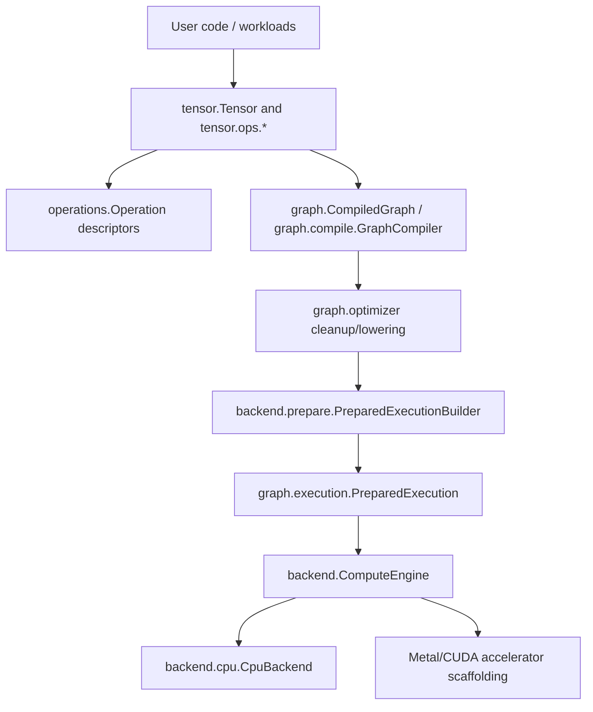
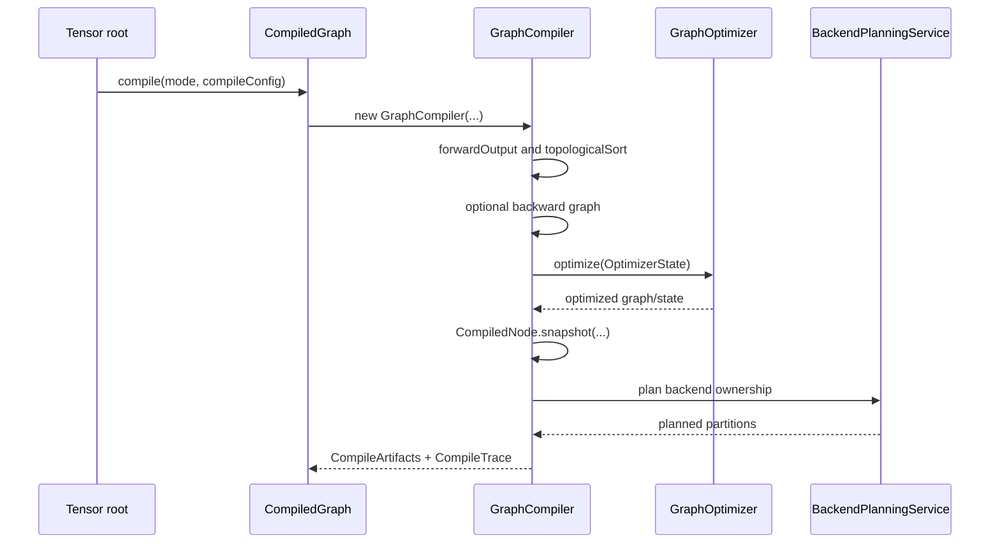
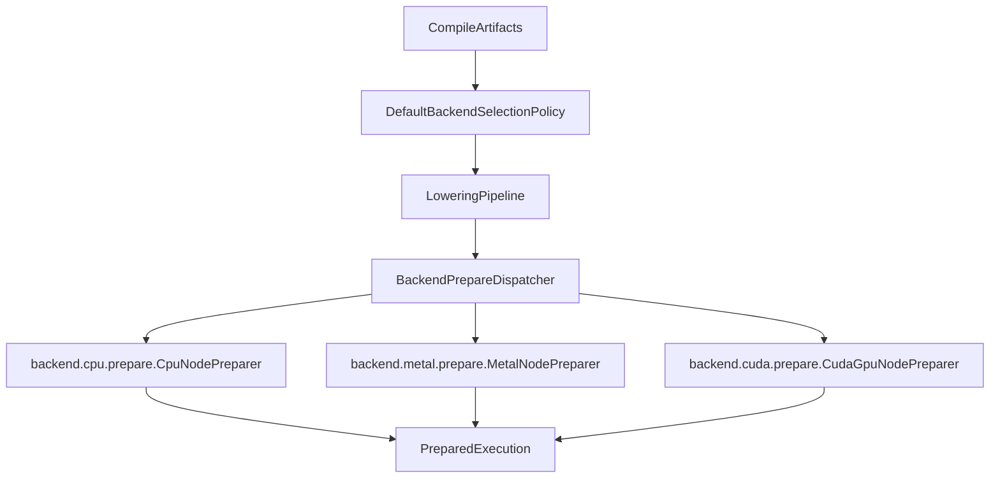
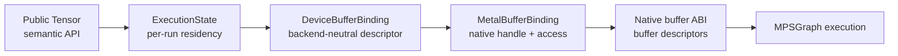
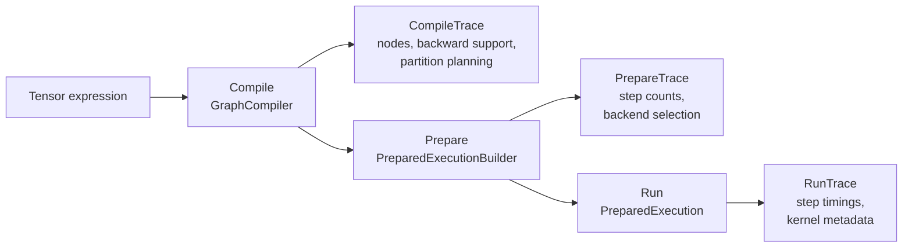
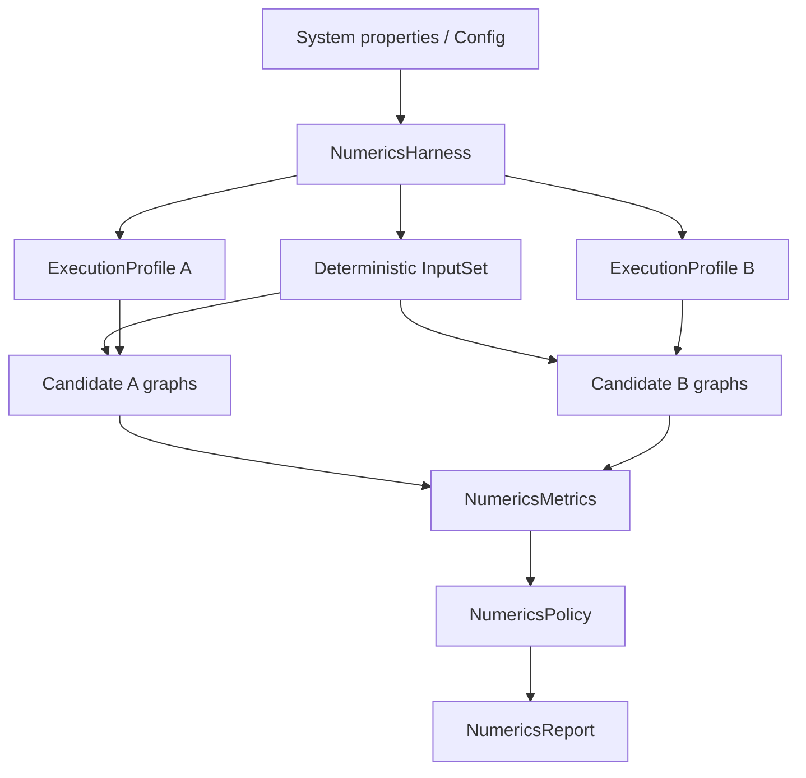

<!-- generated-by: gsd-doc-writer -->
# Synaptik Architecture

Navigation: [Index](index.md#recommended-reading-paths) | [Tensor API](tensor-api.md#graph-lifecycle-and-execution) | [Compute Flow](compute-flow.md#lifecycle-map) | [Graph Optimizer](graph-optimizer.md#graph-optimizer) | [Backend Planning](backend-planning-and-regions.md#backend-planning-and-regions) | [Native Bridges & BLAS](native-bridges-and-blas.md#term-map-at-a-glance) | [Metal Backend](metal-backend.md#end-to-end-flow) | [Calibration & Autotune](calibration-autotune.md#runtime-and-graph-artifacts) | [Modules](modules.md#package-map)

Chapters: [System Overview](#system-overview) | [Core Artifact Boundaries](#core-artifact-boundaries) | [Graph Construction](#graph-construction) | [Compile Pipeline](#compile-pipeline) | [Optimizer And Partitioning](#optimizer-and-partitioning) | [Prepare Pipeline](#prepare-pipeline) | [Execution Pipeline](#execution-pipeline) | [CPU Backend](#cpu-backend) | [Accelerator Scaffolding](#accelerator-scaffolding) | [Configuration, Profiles, And Tuning](#configuration-profiles-and-tuning) | [Memory And Layout Model](#memory-and-layout-model) | [Tracing And Observability](#tracing-and-observability) | [Numerics Harness](#numerics-harness) | [Verification Anchors](#verification-anchors)

Synaptik is a layered Java tensor runtime built around a compiled graph lifecycle rather than eager-only execution. User code builds semantic `Tensor` graphs, `CompiledGraph` snapshots and optimizes those graphs, `PreparedExecution` attaches runtime/backend metadata, and `ComputeEngine` dispatches prepared steps to backend implementations. CPU is the broadest backend. Metal has a real MPSGraph FFM path for a tested operation-scoped subset, including native buffer binding between adjacent Metal regions, BF16 parity for Metal-supported floating operation families, scoped BOOL/index support, direct SDPA, and dense FLOAT32/BFLOAT16 conv/pool execution; CUDA has a narrow dense `FLOAT32` native-buffer path with explicit fallback, trace, and benchmark-report evidence; OpenCL currently exposes only a minimal no-op registry path.

## Table Of Contents

- [System Overview](#system-overview)
- [Core Artifact Boundaries](#core-artifact-boundaries)
- [Graph Construction](#graph-construction)
- [Compile Pipeline](#compile-pipeline)
- [Optimizer And Partitioning](#optimizer-and-partitioning)
- [Prepare Pipeline](#prepare-pipeline)
- [Execution Pipeline](#execution-pipeline)
- [CPU Backend](#cpu-backend)
- [Accelerator Scaffolding](#accelerator-scaffolding)
- [Configuration, Profiles, And Tuning](#configuration-profiles-and-tuning)
- [Memory And Layout Model](#memory-and-layout-model)
- [Tracing And Observability](#tracing-and-observability)
- [Numerics Harness](#numerics-harness)
- [Verification Anchors](#verification-anchors)

## System Overview

The primary input is a graph rooted at `tensor.Tensor`. Each graph node carries shape, dtype, storage/layout metadata, an optional `operations.Operation` descriptor, predecessor edges, and backward construction logic. The primary output is either published tensor data after forward execution or detached gradient tensors after forward/backward execution. The architecture is intentionally staged:

1. `tensor` builds semantic graph nodes.
2. `operations` describes primitive semantics.
3. `graph` compiles, optimizes, partitions, and prepares executable artifacts.
4. `backend` resolves concrete kernels and executes prepared node steps.
5. `config` and `tuning` control compile/runtime policy and persist measured profiles.



## Core Artifact Boundaries

The most important architectural rule is that each lifecycle artifact owns different information.

| Artifact | Main files | Owns | Must not own |
|---|---|---|---|
| Semantic tensor graph | `src/main/java/tensor/Tensor.java`, `src/main/java/tensor/ops/*` | Shape, dtype, storage, operation descriptor, predecessor edges, public API, backward builders | CPU dispatch hints, compiled node ids, runtime workspaces |
| Primitive descriptor | `src/main/java/operations/Operation.java`, `src/main/java/operations/**` | Immutable operation identity and semantic parameters | Kernel code, mutable runtime state, compile/runtime policy |
| Compile artifact | `src/main/java/graph/CompiledGraph.java`, `src/main/java/graph/compile/CompileArtifacts.java` | Compiled node snapshots, forward/backward boundary, optimizer state, memory plan, partition plans | Per-run execution state |
| Prepared artifact | `src/main/java/graph/execution/PreparedExecution.java`, `src/main/java/graph/execution/plan/CompiledNodeExecutionMetadata.java` | Ordered execution steps, prepared backend metadata, prepared fused/accelerator executables | Graph rewriting |
| Runtime context | `src/main/java/backend/runtime/ExecutionContext.java`, `src/main/java/graph/execution/state/ExecutionState.java` | Per-run tensors, metadata index, workspaces, residency/storage bindings, auxiliary runtime caches | Semantic graph ownership |

## Graph Construction

Public graph construction starts in `src/main/java/tensor/Tensor.java` and delegates family-specific work into `src/main/java/tensor/ops/*`. For example, binary operations are implemented by concrete classes such as `tensor.ops.binary.AddOp`, reductions by classes such as `tensor.ops.reduction.SumOp`, layout by classes such as `tensor.ops.layout.ReshapeOp`, and linalg through `tensor.ops.linalg.*`.

The public convenience execution methods are centralized in `src/main/java/tensor/internal/TensorExecutionSupport.java`:

- `Tensor.compile()` and `Tensor.compile(CompileMode)` call `CompiledGraph.compile(...)`.
- `Tensor.compute()` defaults to `CompileMode.INFERENCE_ONLY`.
- `Tensor.compute(CompileMode.TRAINING)` selects training compile/runtime defaults and runs backward only when trainable leaf inputs exist.
- `Tensor.compute(ComputeOptions)` may resolve a persisted or newly autotuned profile when `AutotunePolicy.IF_MISSING` is used.

Example:

```java
Tensor x = new Tensor(new double[]{1.0, -2.0, 3.0}, new int[]{3}, null, "x", DataType.FLOAT64);
x.setRequiresGrad(true);

Tensor loss = x.mul(x).sum();
loss.compute(CompileMode.TRAINING);

double[] gradient = x.getGradient().toDoubleArrayCopy();
```

`CompileMode.TRAINING` is an intent, not a forced backward graph. `GraphCompiler` checks for trainable leaf tensors and compiles backward only when they exist.

## Compile Pipeline

`src/main/java/graph/CompiledGraph.java` is the facade. It creates `graph.compile.GraphCompiler` with:

- a semantic forward canonicalizer from `graph.optimizer.OptimizerFactory.createSemanticForwardCanonicalizer(...)`
- a backend-neutral `GraphOptimizer` built from `config.compile.GraphOptimizationConfig`
- a `CompileConfig` that also owns backend planning, region optimization, and memory planning
- a `CompileMode`

The actual compile session in `src/main/java/graph/compile/GraphCompiler.java` performs these steps:

1. Resolve the semantic forward output with `rootTensor.forwardOutput()`.
2. Optionally canonicalize the forward graph through `SemanticForwardCanonicalizer`.
3. Detect trainable leaf inputs.
4. Decide whether backward should be compiled from `CompileMode`.
5. Build the backward graph through `BackwardGraphBuilder` when needed.
6. Capture an `OptimizerGraphSnapshot`.
7. Run backend-neutral graph optimization.
8. Rebuild `CompiledNode` snapshots.
9. Capture gradient bindings through `GradientBindingCollector`.
10. Run backend planning through `BackendPlanningService`.
11. Run region optimization and memory planning from the compile policy.
12. Return immutable `CompileArtifacts`.



## Optimizer And Backend Planning

The current architecture deliberately separates graph optimization from execution planning.

Graph optimization is backend-neutral and lives behind `GraphOptimizationConfig` and `OptimizerFactory.create(...)`. The concrete graph optimizer pipeline is:

```text
CLEANUP_FIXPOINT(AR -> CF -> CSE -> DCE) -> optional LOWER
```

Meanings:

| Stage | Implementation | Responsibility |
|---|---|---|
| `AR` | `graph.optimizer.rewrite.canonical.PiecewiseCanonicalizationRule`, `graph.optimizer.rewrite.algebraic.AlgebraicSimplificationRule` | Algebraic simplification and light canonical rewrites. |
| `CF` | `graph.optimizer.cleanup.ConstantFoldingRule` | Conservative constant-only graph folding. |
| `CSE` | `graph.optimizer.cleanup.CommonSubexpressionEliminationRule` | Structural common-subexpression elimination. |
| `DCE` | `graph.optimizer.cleanup.DeadCodeEliminationRule` | Remove nodes not reachable from observable roots. |
| `LOWER` | `graph.optimizer.rewrite.lowering.*Rule` | Optional backend-neutral graph lowering. |

Execution planning is separate:

| Phase | Owner | Responsibility |
|---|---|---|
| Backend planning | `BackendPlanningConfig`, `BackendPlanningService`, `BackendPlanningJobResolver` | CPU-only, explicit accelerator, or automatic accelerator ownership regions. |
| Region optimization | `RegionOptimizationConfig`, `DefaultRegionOptimizer` | Fused/unit execution units inside owned regions. |
| Memory planning | `MemoryPlanningConfig`, `MemoryPlanner` | Lifetimes, reusable slots, and region handoff bindings. |
| Runtime selection | `RuntimeConfig`, backend preparers | Runtime availability, BLAS/vector/parallel thresholds, buffer binding, fallback. |

This split is the reason `CompileConfig.noGraphOptimization()` disables graph cleanup only. It does not mean "skip backend planning", "ignore explicit accelerator intent", or "disable runtime backend selection." For detailed examples, see [Graph Optimizer](graph-optimizer.md#graph-optimizer) and [Backend Planning And Regions](backend-planning-and-regions.md#backend-planning-and-regions).

Backend planning bridges graph optimization and backend preparation. `src/main/java/graph/compile/planning/BackendPlanningService.java` creates backend candidate regions from `BackendPlanningConfig`, and backend descriptors are registered in `src/main/java/backend/partition/BackendPartitionDescriptorRegistry.java`. The default registry includes CPU plus Metal and CUDA accelerator partition descriptors.

### Materialization-aware region planning

Phase 3 uses static named presets only. The accelerator planner scores candidate regions with boundary count, estimated transfer bytes, estimated compute work, avoided intermediate bytes, dispatch cost, fallback mode, layout class, final score, and a stable reason code. These values are internal static constants selected through named presets, not profile- or calibration-derived runtime evidence.

Planner summaries live in compile partition traces. `CompileTrace.partitionPlanning()` exposes selected candidates and bounded top rejected finalists through `PartitionDecisionTrace` cost summaries, so planner acceptance, rejection, split, and CPU fallback decisions can be diagnosed without replaying the graph.

Backend selection summaries live in prepare traces. `PrepareTrace.backendSelection()` carries the selected backend candidate, the selected static cost summary, and bounded rejected finalists through `BackendSelectionDecisionTrace`; `PrepareTrace.backendDiagnostics()` carries backend contributor summaries.

Benchmark reports summarize selected candidates and top rejected finalists. Text reports print a compact `backendSelectionCost:` section, and JSON reports expose `trace.backendSelectionCost.selected` plus `trace.backendSelectionCost.rejectedFinalists`.

Runtime step traces remain execution-focused. `ExecutionStepTrace` continues to describe the prepared step that actually ran, including backend, kernel, dispatch, layout, copy/materialization attributes, and duration; planner cost fields are not duplicated onto every runtime step.

Profile-derived accelerator costs now enter prepare-time backend selection through audited `RuntimeConfig` values, not direct profile file reads. Graph autotune remains workload policy; platform calibration remains the owner of hardware, dtype, execution-mode, and runtime thresholds.

## Prepare Pipeline

`src/main/java/backend/prepare/PreparedExecutionBuilder.java` turns compile artifacts into a `PreparedExecution`. Prepare is where runtime policy becomes concrete backend metadata. It does not rewrite graph semantics.

Prepare performs these main steps:

1. Build a consumer map for compiled nodes.
2. Create `BackendPrepareContext`.
3. Select backend plans with `backend.select.DefaultBackendSelectionPolicy`.
4. Lower selected regions through `backend.lowering.LoweringPipeline`.
5. Create `BackendPrepareDispatcher` from `RuntimeConfig`.
6. Prepare each executable node into `CompiledNodeExecutionMetadata`.
7. Split prepared steps into forward and backward lists.
8. Return `PreparedExecution` with a `PrepareTrace`.



`BackendPrepareDispatcher` switches by `CompiledNode.backend()`. CPU nodes go to `CpuNodePreparer`. Metal and CUDA nodes go to accelerator preparers. OpenCL currently receives metadata without a prepared kernel or executable in the dispatcher.

## Execution Pipeline

`src/main/java/graph/execution/PreparedExecution.java` owns runtime execution. For each run it:

1. Creates an `ExecutionState`.
2. Binds memory through `RuntimeMemoryBinder`.
3. Creates an `ExecutionContext` from `RuntimeConfig`, `ExecutionMode`, prepared metadata, and execution state.
4. Executes forward steps, or full forward/backward steps.
5. Publishes output data back to the semantic root.
6. Publishes detached gradients back to semantic tensors when running backward.

Step execution is intentionally simple:

```java
ComputeEngine.compute(step.compiledNode(), step.metadata(), context);
```

`src/main/java/backend/ComputeEngine.java` switches on prepared backend metadata:

- `CPU` -> `backend.cpu.CpuBackend`
- `GPU_CUDA` -> `backend.cuda.CudaGpuBackend` when an accelerator executable exists, otherwise `backend.cuda.CudaBackend`
- `GPU_OPENCL` -> `backend.opencl.OpenClBackend`
- `GPU_METAL` -> `backend.metal.MetalBackend`

This is why backend selection and metadata preparation must be complete before execution begins.

## CPU Backend

The CPU implementation is rooted at `src/main/java/backend/cpu`. Its package README documents the ownership rule: CPU implementation belongs under `backend.cpu`, not root `backend`.

CPU preparation happens in `src/main/java/backend/cpu/prepare/CpuNodePreparer.java`. It resolves:

- `CpuKernel` from `backend.cpu.registry.CpuKernelResolver`
- `CpuNodeExecutionPlan` from `backend.cpu.kernels.plan.CpuExecutionPlanner` and `CpuPlanAssembler`
- dtype compute/storage/accumulation contracts
- elementwise dispatch hints
- fused dispatch and prepared fused executables
- matmul, conv2d, reduction, layout, and workspace requirements

CPU execution happens in `src/main/java/backend/cpu/CpuBackend.java`. It receives the prepared kernel and CPU plan from metadata, resolves runtime tensors from `ExecutionContext`, applies prepared input/layout policy, and calls dtype-specific kernel methods such as `forwardF64`, `forwardF32`, `forwardBF16`, `forwardI32`, or `forwardBOOL`.

The CPU kernel tree mirrors operation families:

```text
src/main/java/backend/cpu/kernels/
  elementwise/
  fused/
  grad/
  index/
  layout/
  linalg/
  nn/
  plan/
  reduction/
```

Important specialized subareas include:

- elementwise scalar/vector/parallel dispatch in `backend.cpu.kernels.elementwise`
- strided elementwise execution in `backend.cpu.kernels.elementwise.strided`
- matmul Java and BLAS paths in `backend.cpu.kernels.linalg.matmul`
- attention execution and runtime cache in `backend.cpu.kernels.linalg`
- conv2d and pool2d in `backend.cpu.kernels.nn`
- fused runtime kernels in `backend.cpu.kernels.fused`
- generated/ASM fused preparation in `backend.cpu.fused`

The Gradle build adds `jdk.incubator.vector` for compile, test, and run tasks in `build.gradle`, so CPU vectorized code can rely on the Vector API module being available when run through the Gradle wrapper.

The BLAS path is an optional CPU acceleration path, not a separate backend. `BlasConfig` selects `NONE` or
`OPENBLAS_FFM`; `MatMulPlanner` decides whether a particular matmul is large, contiguous, and shape-compatible enough
to call OpenBLAS; `MatMulBlasBackend` invokes `OpenBlasFfmBridge`; and failed or unavailable matmul calls fall back to
Java CPU kernels. GEMM-lowered convolution can also use the same OpenBLAS bridge when its prepared plan requires it.
The full BLAS/GEMM and Java FFM explanation is in [Native Bridges & BLAS: Matmul Dispatch Flow](native-bridges-and-blas.md#matmul-dispatch-flow).

## Accelerator Scaffolding

Accelerator support is present but not equivalent to the CPU backend.

| Area | Files | Verified status |
|---|---|---|
| Shared accelerator DAG/lowering contracts | `src/main/java/backend/accelerator/**` | Shared specs for accelerator subgraphs, post-ops, prepared executable support, runtime availability, and cost modeling |
| Metal | `src/main/java/backend/metal/**` | Has region legality, lowering, prepare, prepared executable, and FFM bridge classes |
| CUDA | `src/main/java/backend/cuda/**` | Has region legality, lowering, prepare, prepared executable, and FFM bridge classes |
| OpenCL | `src/main/java/backend/opencl/**` | Has backend and registry classes, but the registry currently exposes only `NOOP` |

Needs verification: native Metal/CUDA runtime availability depends on machine-specific bridge loading and external native libraries, which cannot be proven from Java source alone. The source-level integration points are `backend.metal.bridge.*`, `backend.cuda.bridge.*`, and `backend.accelerator.select.AcceleratorRuntimeAvailability`.

CUDA capability probe layers are represented by `CudaBridgeCapabilities`: native library discovery, CUDA runtime availability, context availability, graph execution ABI availability, and buffer execution support. CUDA dense FLOAT32 buffer execution is capability-gated: `CudaFfmBridge.supportsBufferBindings()` reports support only when the loaded shim exports create, read, destroy, and execute-buffer symbols.

For the general Java FFM bridge model and the CPU OpenBLAS bridge, see [Native Bridges & BLAS: Java FFM Step-By-Step](native-bridges-and-blas.md#java-ffm-step-by-step).
For the detailed Metal runtime, Java FFM, Objective-C shim, buffer ABI, and fallback mechanics, see [Metal Backend: End-To-End Flow](metal-backend.md#end-to-end-flow), [Metal Backend: Objective-C Native Shim](metal-backend.md#objective-c-native-shim), and [Metal Backend: Native Buffer ABI](metal-backend.md#native-buffer-abi). This architecture document keeps the high-level boundaries; the Metal document follows the native call path in detail.
For accelerator ABI, runtime residency, and CPU materialization boundaries, see [Metal Backend: Native Buffer ABI](metal-backend.md#native-buffer-abi), [Metal Backend: Buffer Residency And Materialization](metal-backend.md#buffer-residency-and-materialization), and [Metal Backend: Trace Reading](metal-backend.md#trace-reading).

### Metal MPS Capability Boundary

The current Metal path is intentionally narrower than the full tensor dtype model. `src/main/java/backend/metal/MetalMpsCapabilities.java` centralizes the Java-side contract for the native MPS bridge:

- `FLOAT32` is the broad native compute/output dtype.
- `BFLOAT16` is native only for scoped matmul/linear, elementwise, softmax, reduction, and normalization families.
- `BOOL` is native only for scoped compare/logical/reduction outputs and predicate-style consumers such as `WHERE`.
- `INT32` is legal as an external index input for supported forward `GATHER` / `TAKE_ALONG_AXIS`, not generic INT32 compute/output.
- `INT64` is legal only for scoped public index outputs such as `ARGMAX`, not generic INT64 compute/output.
- Dense `FLOAT32` `CONV2D`, `CONV2D_GEMM`, `MAX_POOL2D`, and `AVG_POOL2D` forward paths are supported through MPSGraph when their operation-specific rank, layout, stride/padding, group/dilation, and divisor gates pass.
- `FLOAT64`, generic `INT32`/`INT64` compute/output, unsupported `BOOL` consumers, grouped/dilated conv, dtype-mismatched floating inputs, and `AVG_POOL2D countIncludePad=true` remain explicit rejection/fallback cases.

That boundary is checked in two places for different reasons. `MetalRegionLegalityAdapter` and `MetalPartitionSupport` reject illegal candidates during partition planning so traces do not claim a Metal region for a dtype the bridge cannot execute. `PreparedMetalExecutable` repeats cheap runtime checks for contiguity, storage offset, and direct Java array availability because legal compile-time dtype does not guarantee that a particular runtime tensor layout can be handed to the FFM bridge.

Direct FLOAT32/BFLOAT16 rank-3/4 `SCALED_DOT_PRODUCT_ATTENTION` can be selected for Metal partitions after native scale and mask parity verification. The lowerer encodes the operation scale into the accelerator DAG scalar bits and the native bridge executes the SDPA node as a primitive MPSGraph DAG: `Q * K^T`, scale, optional BOOL mask select using public mask polarity, softmax, and `* V`. External BOOL masks, causal masks, and external+causal effective masks use SDPA input 3 when the effective mask layout is dense.

The source-level SDPA support matrix is:

| Attention form | Planner status | Reason |
|---|---|---|
| Direct unmasked forward `SCALED_DOT_PRODUCT_ATTENTION` | Supported for legal FLOAT32/BFLOAT16 rank-3/4 inputs | The native MPSGraph primitive DAG has scale parity evidence for the admitted contract. |
| Direct masked/causal forward SDPA | Supported for dense effective BOOL masks | External BOOL masks, causal masks, and external+causal masks feed SDPA input 3 and are applied before softmax with CPU-compatible polarity. |
| Generic lowered attention-like `matmul -> scale -> softmax -> matmul` fragments | Legal only for operations already in the Metal allowlist | This keeps tested primitive pieces available without pretending native direct SDPA is equivalent. |
| `SCALED_DOT_PRODUCT_ATTENTION_BACKWARD` fragments | Present in the backward allowlist | Metal buffer execution can now attempt the native MPSGraph SDPA backward DAG in training flow; runtime fallback remains explicit when another transport or layout gate fails. |

This remains intentionally conservative. The planner can explain why direct SDPA did not enter a Metal region, while
`AcceleratorSubgraphLowerer` contains the DAG encoding path used by the verified native primitive implementation without
redesigning the accelerator DAG format.

### Metal MPS Buffer Execution And Copy Chain

The Metal bridge now has two execution paths. The legacy path is still available as a fallback. A float32 legacy
execution moves data through these ownership domains:

1. Java `float[]` or `byte[]` tensor storage is copied into a confined FFM arena in `MetalMpsFfmBridge.execute(...)`.
2. The Objective-C shim creates Metal buffers from those bytes.
3. MPSGraph executes and the shim materializes native output buffers owned by the bridge call.
4. Java copies the native output memory back into the destination tensor `float[]`.
5. The tensor marks its data view stale so later Java reads see the updated storage state.

The native buffer-binding path avoids that Java-array round-trip between adjacent Metal regions. `MetalMpsFfmBridge`
discovers `synaptik_apple_mps_create_buffer`, `synaptik_apple_mps_read_buffer`,
`synaptik_apple_mps_destroy_buffer`, and `synaptik_apple_mps_execute_partition_f32_buffers` before reporting
`supportsBufferBindings() == true`. `PreparedMetalExecutable` then allocates run-scoped shared `MTLBuffer` handles for
missing inputs and outputs, executes MPSGraph with those handles, copies any returned MPSGraph result storage into the
caller-provided output buffers inside the native shim, marks outputs as `DEVICE_OWNED`, and materializes back into
Java `float[]` only at a true CPU boundary such as graph output or gradient publication.

This is deliberately not long-lived public GPU tensor storage. Public tensors are still CPU-readable when
`compute()` or `PreparedExecution.execute(...)` returns. The native buffers are owned by the execution run and closed
by `ExecutionState.closeResources()`.

The copy chain is now measured explicitly. `src/main/java/backend/metal/bridge/MetalMpsBridgeExecutionStats.java`
is returned from `MetalMpsGraphBridge.execute(...)` and records logical input/output byte counts plus timing
buckets around the bridge boundary:

| Stat | Meaning |
|---|---|
| `inputBytes`, `outputBytes` | Logical payload volume crossing the Metal bridge boundary. These are derived from tensor dtype and element count, not from native allocator bookkeeping. |
| `javaToNativeCopyNs` | Java-side time spent copying CPU tensor arrays into FFM/native input memory. |
| `outputAllocationNs` | Java-side time spent allocating temporary native output memory for the current bridge call. |
| `nativeExecuteNs` | Wall time observed around the native execute function call. This includes native MPSGraph work and any synchronization hidden by the native shim. |
| `nativeCopyStrategy` | Stable classification of native-side output behavior: `MPSGRAPH_RESULT_COPY`, `TRUE_OUTPUT_BUFFER_WRITE`, or `UNKNOWN_OR_UNPROVEN`. |
| `nativeDeviceCopyNs` | Native shim time spent copying MPSGraph result storage into caller-provided output buffers. The current conservative buffer path records this copy instead of assuming MPSGraph wrote directly into supplied output storage. |
| `nativeToJavaCopyNs` | Java-side time spent copying native output memory back into Java tensor arrays. |
| `usedCpuFallback`, `fallbackReason` | Whether `PreparedMetalExecutable` served the step through CPU fallback and the backend-local reason. `PreparedExecution` also publishes backend-neutral trace fields such as `fallbackOccurred`, `fallbackKind`, `fallbackReasonCode`, and `fallbackReason` so tooling can read fallback evidence without knowing whether it originated in shared accelerator-buffer policy, Metal routing, or CUDA execution stats. |
| `executionPath` | One of `CPU_FALLBACK`, `TENSOR_ARRAY_COPY`, or `BUFFER_BINDING`. Current buffer-capable FFM executions report `BUFFER_BINDING`; fallback paths remain explicit. |

`PreparedMetalExecutable` publishes those stats into run trace attributes through
`src/main/java/graph/execution/PreparedExecution.java`. Benchmark reports can therefore answer the
question "did this step actually run through Metal, and how much of its time was boundary transfer?"
without guessing from the selected backend label alone.

### Metal Buffer Binding Contract

This section is about the contract that allows Metal execution to move from "copy tensor arrays into native code"
toward "execute over explicit buffers". It is deliberately split into API and ABI concepts because the two are easy to
confuse.

**API** is the source-level Java contract. Examples in this repository are `Tensor.add(...)`,
`CompiledGraph.prepare(...)`, `ExecutionState.attachDeviceBufferBinding(...)`, and the `MetalBufferBinding` record. Java
callers and Java tests compile against those names and signatures.

**ABI** means application binary interface: the binary/runtime contract at the Java-to-native boundary. In this project
that boundary is Java FFM calling a symbol exported by the Objective-C Metal shim in
`src/main/native/apple/synaptik_apple_mps_stub.m`. The ABI answers questions that a Java method signature cannot answer
by itself:

| ABI question | Why it matters for Metal |
|---|---|
| What native symbol is called? | Java FFM needs an exact function name in the loaded `.dylib`. |
| What primitive argument layout is used? | A pointer, `int`, `long`, and shape array must be interpreted identically by Java and Objective-C. |
| Who owns a native handle? | A `MTLBuffer` must not be released while MPSGraph still needs it, and it must not leak forever. |
| What does a pointer mean? | A raw pointer could mean CPU bytes, an array of pointers, or an opaque `id<MTLBuffer>` handle. |
| What synchronization has happened? | A host-visible buffer can still need command-buffer completion or CPU/GPU visibility rules before the bytes are safe to read. |

The current copy-based ABI is array-oriented. Its mental model is:

```text
Java tensor arrays
  -> FFM native memory segments
  -> Objective-C creates MTLBuffer objects from those bytes
  -> MPSGraph executes
  -> Objective-C reads result bytes
  -> Java copies result bytes into tensor arrays
```

That ABI is simple and safe because the Java side always ends with CPU-current arrays. It is also expensive because
every Metal region pays input upload and output download costs.

The shared-buffer ABI is buffer-oriented:

```text
Java execution state owns or references a Metal-compatible buffer
  -> Java passes buffer descriptors / handles to native code
  -> Objective-C wraps those handles as MPSGraphTensorData inputs/outputs
  -> MPSGraph reads input buffers and returns result storage
  -> Objective-C copies result storage into caller output buffers
  -> Java records residency instead of immediately copying bytes back
```

The repository has the Java-side pieces of that contract under `src/main/java/backend/memory` and
`src/main/java/backend/metal/buffer`:

- `MetalBufferHandle` is an opaque native handle plus byte length, storage mode, owner label, and lifetime flag. Only
  an explicit `shared` storage mode is treated as host-shared; private, managed, blank, or unknown modes are
  conservatively treated as device-owned until a materializer synchronizes CPU storage.
- `MetalBufferAccess` distinguishes `READ`, `WRITE`, and `READ_WRITE` intent.
- `MetalBufferBinding` ties a compiled node id, dtype, shape, element count, handle, and access mode together.
- `MetalBufferAllocator` creates shared `MTLBuffer` handles through the active bridge context and reads them back
  through the native `read_buffer` ABI.
- `MetalDeviceToCpuMaterializer` is registered per run and copies device-current Metal output buffers into the
  destination runtime tensor's Java `float[]` when CPU publication requires it.
- `DeviceBufferBinding` is the backend-neutral view used by `ExecutionState`. It exposes only node id, backend id,
  logical byte length, availability, and a diagnostic description.

`MetalMpsGraphBridge.supportsBufferBindings()` still defaults to `false` for unavailable bridges, but the production
FFM bridge returns `true` when all buffer ABI symbols are present. The bridge receives only explicit buffer bindings;
it does not pull arrays out of semantic `Tensor` objects.

CUDA consumes the same shared accelerator buffer ABI as Metal while CUDA-specific native handles and lifetimes stay
under `backend.cuda.*`. The Java-side policy uses `AcceleratorBufferLayout`, `AcceleratorBufferRequest`, and
`AcceleratorBufferDecision` metadata for dense `FLOAT32` layout preflight. Phase 7 adds a narrow CUDA dense FLOAT32 buffer execution path: `CudaBufferAllocator` creates
run-scoped native CUDA buffers, `PreparedCudaExecutable` calls `CudaGraphBridge.executeBuffers(...)`, successful
outputs are attached as `StorageResidency.DEVICE_OWNED`, and `CudaDeviceToCpuMaterializer` reads graph-output or
CPU-consumer values back through `ExecutionState.requireCpuReadable(...)`. Adjacent CUDA handoff reuses a compatible
`CudaBufferBinding` when backend id, dtype, shape, strides, storage offset, logical element count, handle
availability, and access mode match. Unsupported paths are explicit: unsupported CUDA buffer layouts and dtypes fall back visibly. This is not broad CUDA operation coverage, and CPU remains the correctness oracle.

CUDA trace and benchmark reports now expose the same accelerator evidence contract as Metal for this narrow path.
`PreparedExecution` emits `GPU_CUDA`, `cudaExecutionPath`, `cudaFallbackReason`, `acceleratorBufferReasonCode`,
`acceleratorInputBytes`, `acceleratorNativeDeviceCopyNs`, and `StorageResidency.DEVICE_OWNED` when the run records
device-owned CUDA output. CUDA timing fields are Java-observed boundary timings; native device sub-timers can be `0`
when the shim does not expose them. `RunTrace.cpuMaterializations()` remains the source for graph-output and
CPU-consumer materialization reasons, and benchmark reports summarize `cpuMaterializationCount`.

The important ownership split is:

| Layer | Knows about | Does not know about |
|---|---|---|
| Public `Tensor` | Semantic value, dtype, shape, Java storage arrays | Metal buffer lifetime, native ownership, graph node ids |
| `ExecutionState` | Runtime node id, runtime tensor lookup, residency, optional `DeviceBufferBinding` | Objective-C object model, MPSGraph encoding details |
| `MetalBufferBinding` | Node id, dtype, shape, byte count, access intent, opaque handle | Public graph semantics, compile policy |
| Native Metal shim | Native handles, MPSGraphTensorData construction, command execution | Java `Tensor` object graph |

Worked example:

```text
Compiled node:
  nodeId = 42
  dtype = FLOAT32
  shape = [128, 128]
  elementCount = 16384
  logical bytes = 16384 * 4 = 65536

Shared-buffer binding:
  MetalBufferBinding(
    nodeId = 42,
    dataType = FLOAT32,
    shape = [128, 128],
    elementCount = 16384,
    handle.byteLength = 65536,
    access = READ_WRITE
  )

ExecutionState records after a Metal output write:
  TensorResidencyState = DEVICE_OWNED
  cpuCurrent = false
  deviceCurrent = true
  deviceBackend = GPU_METAL
  DeviceBufferBinding = the binding above
```

The output reservation is writable before native execution, but the active binding is promoted as readable after the
write succeeds. This matters for adjacent Metal regions: region A writes node `42`, region B can then consume node `42`
as a Metal input without first materializing the value into a Java array.

Even if the underlying `MTLBuffer` uses shared storage, the Java tensor's `float[]` is not automatically current.
Graph output publication therefore calls the Metal materializer, reads the buffer into the Java array, records a
`CpuMaterializationTrace`, and only then marks CPU storage current.



The Java execution side now has a production selector for this path. `PreparedMetalExecutable.execute(...)` checks
native buffer capability before it validates the old tensor-array copy contract.

1. The normal Metal bridge readiness gates pass: bridge, context, executable, and training-SDPA safety gates.
2. `MetalMpsGraphBridge.supportsBufferBindings()` returns `true`.
3. A `MetalBufferAllocator` is available from the bridge context.
4. Existing Metal input bindings are reused, or CPU-current inputs are uploaded into shared buffers.
5. Output buffers are allocated and reserved, then promoted only after native execution succeeds.
6. Each binding matches the runtime tensor's compiled node id, dtype, logical shape, and element count.

If all six conditions hold, it calls `MetalMpsGraphBridge.executeBuffers(...)` and expects the returned
`MetalMpsBridgeExecutionStats` to report `MetalMpsBridgeExecutionPath.BUFFER_BINDING`. If any binding condition is
missing, the executable tries the tensor-array copy path. Only that fallback path requires contiguous CPU-visible tensor
arrays with no storage offset and dtypes supported by the current FFM bridge. If the tensor-array contract also fails,
the selected Metal region is replayed through CPU fallback with explicit trace reasons. Runtime bridge exceptions are
also converted into explicit CPU fallback diagnostics, and failed buffer execution does not promote reserved output
buffers to current residency.

## Configuration, Profiles, And Tuning

Configuration is split by lifecycle ownership:

- `src/main/java/config/compile` controls semantic canonicalization, graph optimization, backend planning, region optimization, and memory planning.
- `src/main/java/config/optimizer` contains lower-level graph, CPU-region, fusion, memory, and cost helper configs consumed by compile policies.
- `src/main/java/config/runtime` controls execution-time policy such as CPU kernel tuning, approximation, BLAS, conv2d, fused execution, and accelerators.
- `src/main/java/config/profile` combines compile and runtime policy into executable/profile artifacts.

`config.profile.ExecutionProfile` is the runnable unit for benchmark and autotune. It contains:

- profile and candidate names
- dtype
- `backend.runtime.ExecutionMode`
- `CompileConfig`
- `RuntimeConfig`
- workload metadata

The tuning package at `src/main/java/tuning` measures and persists those real execution profiles. The main workflows are:

- benchmark explicit candidates through `tuning.benchmark`
- autotune a graph/workload through `tuning.autotune`
- calibrate platform runtime defaults through `tuning.calibration`
- persist winners and histories through `tuning.store`

### Tuning Ownership And Persistence Boundaries

The detailed tuning ownership matrix lives in `src/main/java/tuning/ARCHITECTURE.md`, and the persistence/read-only
boundary lives in `src/main/java/tuning/PERSISTENCE.md`. In short, graph autotune owns graph/workload policy, platform
calibration owns platform/dtype runtime thresholds, benchmark commands are profile-read-only, and reports are explain
artifacts rather than runtime sources of truth.

The CLI in `src/main/java/synaptik/app/TuningCli.java` wires these flows. The
`src/main/java/synaptik/app/Main.java` entry point shows the same calibration and benchmark building
blocks configured directly from Java code through `src/main/java/tuning/api/Synaptik.java`.

```bash
./gradlew run --args="full f64"
./gradlew run --args="calibrate --dtype f64 --families all"
./gradlew run --args="autotune f64"
./gradlew run --args="benchmark-winner f64"
./gradlew run --args="benchmark-graph-space f64"
```

The no-argument CLI default is `full f64`.

## Memory And Layout Model

Layout is first-class in both semantic tensors and runtime execution. `TensorMetadata` stores shape, strides, storage offset, dtype, and label. Layout operations such as reshape, permute, expand, squeeze, select, and contiguous are explicit operation descriptors under `src/main/java/operations/layout` and public builders under `src/main/java/tensor/ops/layout`.

The memory planning compile phase produces a `MemoryPlan` under `src/main/java/graph/compile/planning/memory`. `PreparedExecution` passes that plan to `RuntimeMemoryBinder` before running steps. This keeps allocation/reuse decisions tied to compile artifacts while per-run storage lives behind `ExecutionState`.

`ExecutionState` is the public per-run entrypoint; it does not keep every runtime concern inline. Runtime tensor identity and input rewiring live in `RuntimeTensorStore`, CPU workspaces and prepared inputs live in `RuntimeWorkspaceStore`, CPU/native/device materialization lives in `RuntimeMaterializationService`, run-owned resources and native CPU allocation live in `RuntimeResourceRegistry`, and residency/binding state is split between `RuntimeResidencyStore`, `DeviceBindingRegistry`, and `NativeCpuStorageRegistry`. These concrete run-scoped classes are not new lifecycle artifacts, not public user API, and not places to store compile-time topology or optimizer decisions.

The architecture supports view-like behavior without treating every layout operation as a dense copy. The CPU layout kernels under `src/main/java/backend/cpu/kernels/layout` include alias/view, expand, permute, contiguous, reshape-like, and noop paths.

Runtime storage residency is represented separately from semantic tensor storage. `ExecutionState` creates a
`backend.memory.TensorResidencyState` for each compiled node. That state records whether the CPU array representation
is current, whether a device representation is current, which backend owns the device representation, and why the last
transition happened. The residency enum is:

| Residency | Meaning today | Runtime role |
|---|---|---|
| `CPU_ARRAY` | The current value is in normal typed Java tensor storage. This is the state produced by CPU kernels and by the legacy Metal copy-back path. | Baseline representation and materialization target for public tensor reads. |
| `HOST_SHARED_DEVICE_BUFFER` | A host-visible buffer and Java CPU storage are both current. Metal uses this for uploaded inputs whose Java arrays are already current. | Shared input representation where the CPU representation is genuinely current. |
| `DEVICE_OWNED` | The newest value is in a device/backend buffer and Java CPU arrays are stale. Metal and CUDA buffer outputs use this state even when the underlying native buffer may be host-visible. | Device residency with explicit CPU materialization. |

The important design point is that residency is per execution run, not part of the semantic graph. A `Tensor` still
means "this value in the user's graph"; residency means "where this run currently has the newest materialized bytes for
compiled node N." In the current implementation, `PreparedExecution` marks each executed step as CPU-current after the
step completes. For the legacy Metal path this is honest because outputs are copied back into Java arrays. For the
buffer-binding Metal path, `PreparedMetalExecutable` attaches a device binding and marks the output
`DEVICE_OWNED`; root publication or gradient publication then invokes the registered Metal materializer.

CPU publication points now check residency before reading runtime tensor arrays. The relevant reasons are encoded in
`CpuMaterializationReason`: `GRAPH_OUTPUT`, `GRADIENT_PUBLICATION`, `CPU_CONSUMER`, `PUBLIC_DATA_ACCESS`, and
`CPU_FALLBACK`. This is now both a guardrail and a transfer engine for native buffer paths: if a Metal or CUDA buffer
output is `DEVICE_OWNED` and CPU-stale, `PreparedExecution` asks the registered backend materializer to read the native
buffer into the runtime tensor's Java array before publishing the root tensor or gradients. If the materializer is
absent or rejects the binding, execution throws rather than publishing stale CPU data.

Those guardrails now feed run-level observability. `RunTrace.cpuMaterializations()` returns `CpuMaterializationTrace`
entries for failed CPU-read requests and completed device-to-CPU synchronizations. A failed entry records the requested
node id, reason, source backend, source residency, logical bytes, zero duration, and a diagnostic saying what piece of
the materialization contract was missing. A completed entry records the same site with `completed=true` and the measured
materialization duration.

`DeviceToCpuMaterializer` is the per-run hook that turns the guardrail into a real lazy materialization path. A backend
registers it on `ExecutionState` or `ExecutionContext` for a backend id such as `GPU_METAL`. When a CPU publication
point asks for a `DEVICE_OWNED` value and an active `DeviceBufferBinding` exists, execution state calls the registered
materializer with the binding, target runtime tensor, and materialization reason. The materializer must synchronize
bytes into CPU-visible tensor storage before returning `CpuMaterializationResult`; execution state then records the
trace and marks CPU storage current. The Metal implementation is `MetalDeviceToCpuMaterializer`, backed by
`MetalBufferAllocator.readToCpu(...)` and the native `synaptik_apple_mps_read_buffer(...)` ABI.
The CUDA implementation is `CudaDeviceToCpuMaterializer`, backed by `CudaBufferAllocator.readToCpu(...)` and the native
`synaptik_cuda_graph_read_buffer(...)` ABI.

The next Java-side contract is `DeviceBufferBinding`. It is backend-neutral and deliberately small: node id, backend
id, logical byte length, availability, and a diagnostic description. `MetalBufferBinding` implements that contract and
keeps Metal-specific native handle details in `backend.metal.buffer`; `CudaBufferBinding` does the same for CUDA under
`backend.cuda.buffer`. `ExecutionState` can now register such a binding per compiled node. Reserving a binding only
says that a writable backend buffer exists for a future output; it does not change residency and cannot be read as
current data. Attaching a `HOST_SHARED_DEVICE_BUFFER` binding after execution marks both CPU and device representations
current; attaching a `DEVICE_OWNED` binding marks CPU stale and device current. Metal and CUDA output promotion use
`DEVICE_OWNED` because the Java tensor array is not updated until materialization.
A later CPU write or completed CPU materialization clears the active/reserved binding, because the previous device
handle can no longer be treated as the active value.

This also changes the default post-step residency rule. CPU backend steps are still marked CPU-current after execution.
Accelerator steps are marked CPU-current only when they did not publish any residency state themselves. That preserves
legacy copy-back behavior while letting buffer-binding Metal and CUDA executables keep their outputs device-resident.

## Tracing And Observability

Synaptik's observability model follows the same three-stage lifecycle as compute itself: compile,
prepare, and run. Traces are plain Java records returned by the framework; they are not global logs,
not automatically persisted, and not part of numerical execution semantics. This matters because the
same graph can be compiled once, prepared with a specific runtime configuration, and executed many
times. Each trace answers a different question:

| Trace | Produced by | Main question | Access path |
|---|---|---|---|
| `CompileTrace` | `GraphCompiler.compile()` through `CompiledGraph.compile()` | What graph did compilation produce? | `CompiledGraph.compileTrace()` |
| `PrepareTrace` | `PreparedExecutionBuilder.prepare(...)` | How did compile artifacts become executable steps? | `PreparedExecution.prepareTrace()` |
| `RunTrace` | `PreparedExecution.executeTraced(...)` or `CompiledGraph.executeTraced(...)` | What actually ran in this execution? | returned from traced execution |
| `ExecutionTrace` | caller-assembled lifecycle record | How do compile, prepare, and one run relate? | `new ExecutionTrace(compile, prepare, run)` |



- `CompileTrace` in `src/main/java/graph/execution/trace/CompileTrace.java`
- `PrepareTrace` in `src/main/java/graph/execution/trace/PrepareTrace.java`
- `RunTrace` in `src/main/java/graph/execution/trace/RunTrace.java`
- `ExecutionTrace` in `src/main/java/graph/execution/trace/ExecutionTrace.java`

For a step-by-step trace walkthrough, see [compute-flow.md#traces](compute-flow.md#traces). That
document expands the field-level schema and shows example access code. This architecture section
focuses on where trace data enters the system and what ownership boundary each trace represents.

### Compile-Time Trace

`CompileTrace` is created in `src/main/java/graph/compile/GraphCompiler.java` after a compile
session finishes. It records:

- whether compile timing was measured
- compile duration in nanoseconds
- final compiled node count
- forward node count
- whether backward artifacts were produced
- `PartitionCompileTrace`, which summarizes partition planning

`PartitionCompileTrace` is the architecture-level bridge from optimizer to observability. It reports
the partition planner strategy, target backend, number of candidate starts considered, accepted and
rejected candidate counts, and detailed `PartitionDecisionTrace` rows. A partition decision records
which seed node was considered, whether it was accepted, selected node ids, structural candidate node
ids, operation types, estimated work, score values, search count, whether search budget was hit, and
which node caused rejection when applicable.

Concrete mental model:

```text
Tensor graph
  -> GraphCompiler
  -> OptimizerState
  -> partition planner
  -> CompileArtifacts
  -> CompileTrace(partitionPlanning=...)
```

If an accelerator region is not selected, compile trace can explain whether there were no candidates,
whether candidate legality failed, or whether search/cost scoring rejected the region. It does not say
which CPU kernel eventually ran; that belongs to prepare/run tracing.

### Prepare-Time Trace

`PrepareTrace` is produced by `src/main/java/backend/prepare/PreparedExecutionBuilder.java`. Prepare
is the point where runtime policy becomes concrete executable metadata. The trace records:

- preparation duration
- prepared forward step count
- prepared backward step count
- `BackendSelectionTrace`

`BackendSelectionTrace` summarizes accelerator/backend candidate selection. Its
`BackendSelectionDecisionTrace` entries include the candidate anchor node, node ids covered by the
candidate, compatible backend list, whether the candidate was selected, selected backend, rejection or
acceptance reason, and estimated work.

This means prepare trace is the right artifact when debugging questions such as:

- "Why did this region stay on CPU even though Metal/CUDA support exists?"
- "How many forward and backward steps will execute after partition interiors are hidden behind anchors?"
- "Did runtime config reject a backend because availability or minimum-work policy failed?"

Prepare trace deliberately stops before per-kernel timing. It describes the executable plan, not the
actual latency of a run.

### Run-Time Trace

`RunTrace` is produced only by traced execution. `PreparedExecution.execute(...)` and
`PreparedExecution.executeTraced(...)` share the same execution path, but the traced variant records
one `ExecutionStepTrace` per executed prepared step. Each step trace is built in
`PreparedExecution.toStepTrace(...)` and contains:

- step index within the run
- compiled node label
- operation type
- output shape
- dtype
- selected backend
- CPU kernel class name when a CPU kernel is present
- step duration in nanoseconds
- structured `StepExecutionMetadata`

`StepExecutionMetadata` is intentionally sparse: only metadata relevant to a step is populated. The
record can carry:

| Metadata section | Source | What it explains |
|---|---|---|
| `compute` | CPU execution plan compute contract | storage dtype, compute dtype, accumulation dtype, backend |
| `layout` | compiled node layout and CPU plan | storage offset, contiguity, strided path, target type |
| `dispatch` | CPU dispatch hints | scalar/vector mode, vector width, planned workers, chunk sizes |
| `reduction` | CPU reduction hints | reduction mode, worker count, chunk size, vector width, accuracy mode |
| `matMul` | CPU matmul hints | BLAS use, batched BLAS use, parallelism, tiles, work estimate, micro-kernel |
| `conv` | `ExecutionContext.publishConvTrace(...)` side channel | conv lowering kind, BLAS provider, GEMM dimensions, Java/BLAS call counts |
| `fused` | `operations.FusedOperation` and prepared fused executable | fused precision, dispatch family, scheduler signature, backend, node/input counts |
| `attributes` | accelerator prepared executables and runtime storage state | Metal bridge availability, executable cache status, subgraph op list, estimated work, Metal transfer timings, storage residency |

The convolution metadata path is worth calling out because it is not known completely at prepare
time. Kernels can publish per-run convolution details into `ExecutionContext` via
`publishConvTrace(nodeId, trace)`. Later, while building the `ExecutionStepTrace`,
`PreparedExecution` reads that side channel with `context.convTraceForNodeId(node.id())`.

### Runtime State Side Channels

`ExecutionContext` in `src/main/java/backend/runtime/ExecutionContext.java` carries synchronized
side maps plus per-node residency state:

- `runtimeStateIndex`, keyed by tensor identity, for backend-specific temporary state
- `convTraceIndex`, keyed by compiled node id, for convolution trace metadata
- storage residency state, keyed by compiled node id through `ExecutionState`

These maps are per-run context, not shared global state. They let backend helpers exchange prepared
state and diagnostics without mutating compile artifacts. The execution scheduler still controls the
ordered prepared steps, runtime tensors, workspaces, and residency records through `ExecutionState`.

The important ownership rule is that traces describe decisions already made elsewhere:

- optimizer and partition rules make compile-time decisions; `CompileTrace` exposes the result
- prepare policies choose concrete executable steps; `PrepareTrace` exposes the result
- kernels and backend executables perform the work; `RunTrace` records timing and step metadata

That separation is why tracing has low architectural risk. Adding a new metadata field should not
change graph semantics. Conversely, a correctness fix should not rely on a trace side effect being
present.

### What Tracing Does Not Do

Tracing is diagnostic. It does not:

- persist records to disk automatically
- decide compile or runtime policy
- change backend selection
- include every intermediate tensor value
- replace benchmark measurement or the numerics harness

Use tracing when you need to understand a single lifecycle path. Use benchmark/autotune when you need
latency comparisons. Use the numerics harness when you need output and gradient drift comparison.

### Small Trace Example

```java
Tensor x = new Tensor(new double[]{1.0, 2.0, 3.0}, new int[]{3}, null, "x", DataType.FLOAT64);
Tensor y = x.mul(2.0).sum();

CompiledGraph compiled = CompiledGraph.compile(y, CompileConfig.inference());
// compiled.compileTrace().totalNodeCount() describes the optimized compiled graph.
// compiled.compileTrace().partitionPlanning() explains partition candidate decisions.

PreparedExecution prepared = compiled.prepare(RuntimeConfig.inferenceDefaults());
// prepared.prepareTrace().forwardStepCount() is the number of forward executable steps.
// prepared.prepareTrace().backendSelection() explains backend candidate selection.

RunTrace run = prepared.executeTraced(ExecutionMode.FORWARD);
// run.steps() contains one ExecutionStepTrace per executed prepared step.
// Each step may carry compute/layout/dispatch/matmul/reduction/fused metadata.
```

## Numerics Harness

`src/main/java/numerics` is a standalone A/B drift harness, not a performance benchmark. It answers a
different question from tracing:

```text
Tracing:   Which path did one execution take?
Numerics:  Did two execution profiles produce materially equivalent values?
Benchmark: Which candidate is faster under a measurement policy?
```

The harness compares two `ExecutionProfile` values on identical deterministic inputs. Each profile
may use a different optimizer stage list, runtime config, dtype, approximation policy, or backend
policy. The harness then reports output and gradient drift across several signals.

Primary files:

- `src/main/java/numerics/NumericsCli.java`
- `src/main/java/numerics/NumericsHarness.java`
- `src/main/java/numerics/NumericsGraphFactory.java`
- `src/main/java/numerics/NumericsMetrics.java`
- `src/main/java/numerics/NumericsPolicy.java`
- `src/main/java/numerics/NumericsReport.java`

Module-level package notes are in [modules.md#numerics-numerical-drift-harness](modules.md#numerics-numerical-drift-harness).
System-property configuration keys are listed in [configuration.md#diagnostic-and-benchmark-cli-properties](configuration.md#diagnostic-and-benchmark-cli-properties).

### What The Harness Builds

`NumericsHarness.Config` controls the deterministic workload:

| Field | Default | Meaning |
|---|---:|---|
| `dtype` | `FLOAT32` | dtype used to construct compared tensors |
| `size` | `200000` | number of flat scalar elements in the optimizer-like workload |
| `graphBlocks` | `6` | repeated arithmetic block count |
| `b0` | `128` | broadcast graph first batch dimension |
| `b1` | `8` | broadcast graph second batch dimension |
| `f` | `128` | broadcast feature dimension |
| `seed` | `42` | random seed shared by both candidates |

The run has two graph families:

1. **Optimizer-like training graph** from `NumericsGraphFactory.buildOptimizerLikeGraph(...)`.
   It creates trainable flat tensors `A`, `B`, and `C`, mixes repeated arithmetic blocks, and adds
   a small stack of `linear(...)` operations. The graph is compiled and executed in
   `ExecutionMode.FORWARD_BACKWARD` twice for each candidate. The report compares:
   - final output signal `out`
   - gradient of `A`
   - gradient of `B`
   - gradient of `C`
2. **Broadcast/layout graph** from `NumericsGraphFactory.buildBroadcastGraph(...)`.
   It creates tensors with shapes `[b0, 1, f]`, `[1, b1, f]`, and `[b0, b1, f]`, then computes
   `a.add(b).mul(c).add(a).sigmoid()`. This graph is executed in forward mode and catches drift in
   broadcasting, layout, sigmoid approximation, and elementwise dispatch.

The candidate executions use separate tensor instances but the same generated `double[]` inputs.
That keeps input data identical while allowing each profile to compile, prepare, and execute through
its own compile/runtime policy.

### Lifecycle



Step by step:

1. `NumericsCli` reads `numerics.*` system properties and builds `NumericsHarness.Config`.
2. It parses graph optimization stage lists with `NumericsHarness.parseStages(...)`.
3. `NumericsHarness.profile(...)` creates two training `ExecutionProfile` values with the same dtype
   and runtime defaults but different graph optimization stage sets.
4. `NumericsHarness.run(...)` creates one deterministic `InputSet`.
5. Candidate A runs on a fresh graph built from that input.
6. Candidate B runs on another fresh graph built from the same input.
7. `NumericsMetrics.compare(...)` compares each signal pair.
8. `NumericsMetrics.aggregate(...)` collapses the five signal metrics into maximum drift and invalid
   counts.
9. `NumericsPolicy.evaluate(...)` assigns `SAFE`, `BORDERLINE`, or `UNSAFE`.
10. `NumericsReport.toPrettyString()` formats the result for CLI/log output.

### Metrics

For each signal, `NumericsMetrics.SignalMetrics` records:

| Metric | Meaning |
|---|---|
| `maxAbs` | maximum absolute difference over finite positions |
| `avgAbs` | mean absolute difference over finite positions |
| `maxRel` | maximum relative difference using `abs / max(1, abs(reference))` |
| `maxUlp` | maximum ULP distance after dtype-aware conversion |
| `p50Ulp` | median observed ULP distance |
| `p95Ulp` | 95th percentile ULP distance |
| `finiteCount` | positions where both values were finite |
| `invalidCount` | positions where either value was NaN or infinite |

ULP comparison is dtype-aware. `FLOAT32` values are converted to `float` before ULP distance is
computed. `FLOAT64` uses double ULP distance. `BOOL` is explicitly unsupported by numerics policy
and ULP metrics. `BFLOAT16` currently follows the non-`FLOAT32` branch in
`NumericsMetrics.toDTypeUlpDistance(...)`, so its ULP metric is computed on the double values exposed
by tensor copies; absolute and relative tolerances are therefore especially important for BF16 drift
interpretation.

The aggregate metric keeps the maximum absolute, relative, and ULP drift across:

- `out`
- `gradA`
- `gradB`
- `gradC`
- `broadcast`

It also sums invalid counts across all five signals.

### Verdict Policy

`NumericsPolicy.defaultsFor(dtype)` uses:

| Dtype | Absolute tolerance | Relative tolerance | ULP tolerance |
|---|---:|---:|---:|
| `FLOAT64` | `1e-12` | `1e-12` | `16` |
| `FLOAT32` / `BFLOAT16` | `1e-5` | `1e-5` | `128` |

Evaluation order:

1. Any invalid value makes the report `UNSAFE`.
2. If `maxAbs` exceeds `absTol + relTol * max(1, maxAbs)` and `maxUlp` is also above tolerance, the
   report is `UNSAFE`.
3. If `maxAbs` exceeds tolerance but `maxUlp` is still within tolerance, the report is `BORDERLINE`.
4. If absolute/relative drift is within tolerance but ULP drift exceeds tolerance, the report is
   `BORDERLINE`.
5. Otherwise the report is `SAFE`.

### CLI Usage

`NumericsCli` is system-property driven, but it is a standalone main class. The Gradle
`application.run` task in `build.gradle` is wired to `synaptik.app.TuningCli`, whose command router covers
calibration, autotune, and benchmark flows, not `numerics.NumericsCli`. In other words,
`./gradlew run --args="..."` is the ergonomic tuning CLI, while numerics diagnostics must be launched
as `numerics.NumericsCli` from an IDE, a dedicated JavaExec launcher, or another Java launcher with
the project runtime classpath.

The CLI properties are:

```text
-Dnumerics.dtype=FLOAT32
-Dnumerics.stageA=NONE
-Dnumerics.stageB=AR,CF,CSE,DCE,LOWER
-Dnumerics.nameA=baseline
-Dnumerics.nameB=optimized
-Dnumerics.size=200000
-Dnumerics.graphBlocks=6
-Dnumerics.broadcastB0=128
-Dnumerics.broadcastB1=8
-Dnumerics.broadcastF=128
-Dnumerics.seed=42
```

The same comparison can be run directly from Java:

```java
NumericsHarness.Config cfg = new NumericsHarness.Config();
cfg.dtype = DataType.FLOAT32;
cfg.size = 200_000;
cfg.graphBlocks = 6;

NumericsHarness harness = new NumericsHarness(cfg);
ExecutionProfile baseline = harness.profile("baseline", NumericsHarness.parseStages("NONE"));
ExecutionProfile optimized = harness.profile("optimized", NumericsHarness.parseStages("AR,CF,CSE,DCE,LOWER"));

NumericsReport report = harness.run(
        baseline,
        optimized,
        NumericsPolicy.defaultsFor(DataType.FLOAT32)
);

System.out.print(report.toPrettyString());
```

Expected report shape:

```text
Numerics Report
scenario=benchmark-like, A=baseline, B=optimized
out: maxAbs=..., avgAbs=..., maxRel=..., maxUlp=..., p50Ulp=..., p95Ulp=..., invalid=...
gradA: ...
gradB: ...
gradC: ...
broadcast: ...
aggregate: maxAbs=..., maxRel=..., maxUlp=..., invalid=...
verdict=SAFE (...)
```

### When To Use It

Use the numerics harness when changing anything that could preserve speed but alter floating-point
results:

- optimizer rewrites
- CSE safety policy
- partition/fusion policy
- BF16/F32/F64 compute contracts
- fast transcendental approximation policy
- vectorized vs scalar CPU paths
- BLAS or fused backend dispatch
- broadcast/layout execution paths

Do not use it as a latency benchmark. It intentionally runs deterministic comparison workloads and
reports drift, not median/p95 runtime. Use `tuning.benchmark` for performance measurement and
`tuning.autotune` or `tuning.calibration` for search/persistence workflows.

## Verification Anchors

The claims in this document were checked against source files and tests including:

- lifecycle: `src/main/java/tensor/internal/TensorExecutionSupport.java`, `src/main/java/graph/CompiledGraph.java`, `src/main/java/graph/compile/GraphCompiler.java`, `src/main/java/backend/prepare/PreparedExecutionBuilder.java`, `src/main/java/graph/execution/PreparedExecution.java`
- graph optimization and compile planning: `src/main/java/config/compile/CompileConfig.java`, `src/main/java/config/compile/GraphOptimizationConfig.java`, `src/main/java/config/compile/BackendPlanningConfig.java`, `src/main/java/graph/optimizer/OptimizerFactory.java`, `src/main/java/graph/compile/planning/BackendPlanningService.java`
- backend dispatch: `src/main/java/backend/ComputeEngine.java`, `src/main/java/backend/cpu/CpuBackend.java`, `src/main/java/backend/cpu/prepare/CpuNodePreparer.java`, `src/main/java/backend/cpu/registry/CpuKernelResolver.java`
- tracing: `src/main/java/graph/execution/trace/*.java`, `src/main/java/backend/runtime/ExecutionContext.java`, `src/main/java/graph/execution/PreparedExecution.java`
- numerics: `src/main/java/numerics/NumericsCli.java`, `src/main/java/numerics/NumericsHarness.java`, `src/main/java/numerics/NumericsGraphFactory.java`, `src/main/java/numerics/NumericsMetrics.java`, `src/main/java/numerics/NumericsPolicy.java`, `src/main/java/numerics/NumericsReport.java`
- CLI and build: `src/main/java/synaptik/app/TuningCli.java`, `src/main/java/synaptik/app/Main.java`, `build.gradle`, `settings.gradle`
- representative tests: `src/test/java/PreparedExecutionBuildTest.java`, `src/test/java/CompiledGraphTraceTest.java`, `src/test/java/TensorComputeConvenienceApiTest.java`, `src/test/java/CpuKernelFamilyArchitectureTest.java`, `src/test/java/SourceTreeHygieneTest.java`
