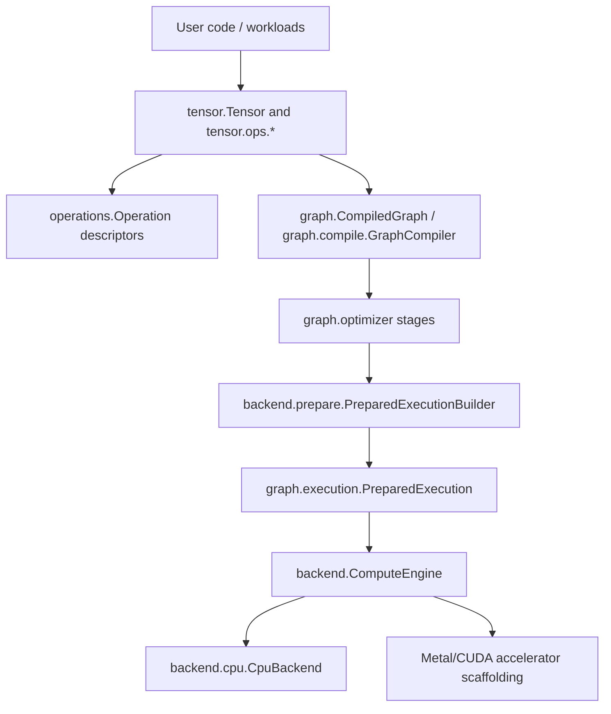
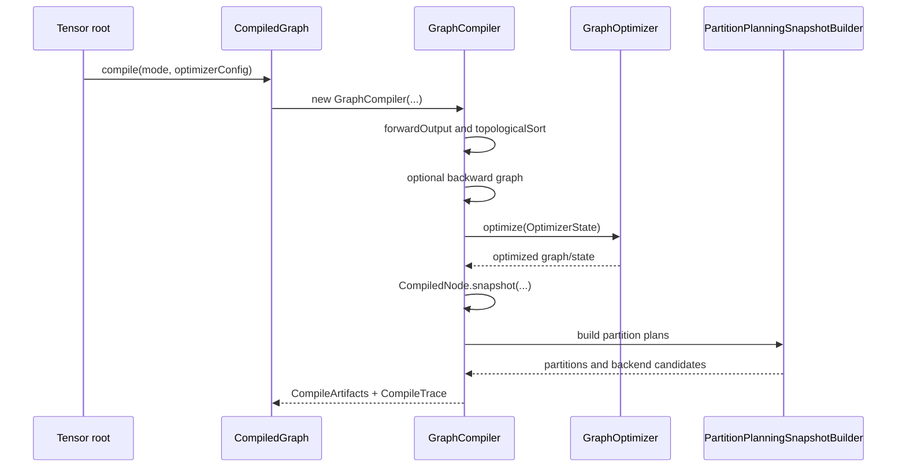
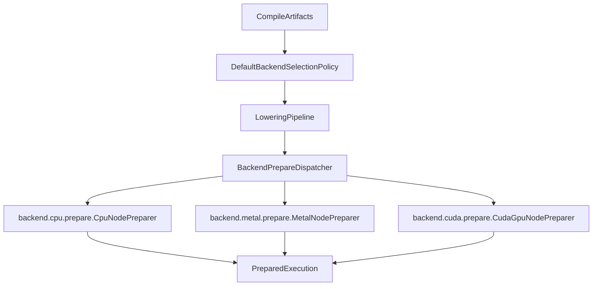

<!-- generated-by: gsd-doc-writer -->
# Synaptik Architecture

Navigation: [Index](index.md) | [Tensor API](tensor-api.md) | [Compute Flow](compute-flow.md) | [Graph Optimizer](graph-optimizer.md) | [Calibration & Autotune](calibration-autotune.md) | [Modules](modules.md)

Chapters: [System Overview](#system-overview) | [Core Artifact Boundaries](#core-artifact-boundaries) | [Graph Construction](#graph-construction) | [Compile Pipeline](#compile-pipeline) | [Optimizer And Partitioning](#optimizer-and-partitioning) | [Prepare Pipeline](#prepare-pipeline) | [Execution Pipeline](#execution-pipeline) | [CPU Backend](#cpu-backend) | [Accelerator Scaffolding](#accelerator-scaffolding) | [Configuration, Profiles, And Tuning](#configuration-profiles-and-tuning) | [Memory And Layout Model](#memory-and-layout-model) | [Tracing And Observability](#tracing-and-observability) | [Numerics Harness](#numerics-harness) | [Verification Anchors](#verification-anchors)

Synaptik is a layered Java tensor runtime built around a compiled graph lifecycle rather than eager-only execution. User code builds semantic `Tensor` graphs, `CompiledGraph` snapshots and optimizes those graphs, `PreparedExecution` attaches runtime/backend metadata, and `ComputeEngine` dispatches prepared steps to backend implementations. The fully implemented execution backend is CPU; Metal and CUDA have region lowering and executable scaffolding, while OpenCL currently exposes only a minimal no-op registry path.

## System Overview

The primary input is a graph rooted at `tensor.Tensor`. Each graph node carries shape, dtype, storage/layout metadata, an optional `operations.Operation` descriptor, predecessor edges, and backward construction logic. The primary output is either published tensor data after forward execution or detached gradient tensors after forward/backward execution. The architecture is intentionally staged:

1. `tensor` builds semantic graph nodes.
2. `operations` describes primitive semantics.
3. `graph` compiles, optimizes, partitions, and prepares executable artifacts.
4. `backend` resolves concrete kernels and executes prepared node steps.
5. `config` and `tuning` control optimizer/runtime policy and persist measured profiles.



## Core Artifact Boundaries

The most important architectural rule is that each lifecycle artifact owns different information.

| Artifact | Main files | Owns | Must not own |
|---|---|---|---|
| Semantic tensor graph | `src/main/java/tensor/Tensor.java`, `src/main/java/tensor/ops/*` | Shape, dtype, storage, operation descriptor, predecessor edges, public API, backward builders | CPU dispatch hints, compiled node ids, runtime workspaces |
| Primitive descriptor | `src/main/java/operations/Operation.java`, `src/main/java/operations/**` | Immutable operation identity and semantic parameters | Kernel code, mutable runtime state, optimizer policy |
| Compile artifact | `src/main/java/graph/CompiledGraph.java`, `src/main/java/graph/compile/CompileArtifacts.java` | Compiled node snapshots, forward/backward boundary, optimizer state, memory plan, partition plans | Per-run execution state |
| Prepared artifact | `src/main/java/graph/execution/PreparedExecution.java`, `src/main/java/graph/execution/CompiledNodeExecutionMetadata.java` | Ordered execution steps, prepared backend metadata, prepared fused/accelerator executables | Graph rewriting |
| Runtime context | `src/main/java/backend/runtime/ExecutionContext.java`, `src/main/java/graph/execution/ExecutionState.java` | Per-run tensors, metadata index, workspaces, auxiliary runtime caches | Semantic graph ownership |

## Graph Construction

Public graph construction starts in `src/main/java/tensor/Tensor.java` and delegates family-specific work into `src/main/java/tensor/ops/*`. For example, binary operations are implemented through `tensor.ops.binary.TensorBinaryOps`, reductions through `tensor.ops.reduction.TensorReduceOps`, layout through `tensor.ops.layout.TensorLayoutOps`, and linalg through `tensor.ops.linalg.*`.

The public convenience execution methods are centralized in `src/main/java/tensor/TensorExecutionSupport.java`:

- `Tensor.compile()` and `Tensor.compile(CompileMode)` call `CompiledGraph.compile(...)`.
- `Tensor.compute()` defaults to `CompileMode.INFERENCE_ONLY`.
- `Tensor.compute(CompileMode.TRAINING)` selects training optimizer/runtime defaults and runs backward only when trainable leaf inputs exist.
- `Tensor.compute(ComputeOptions)` may resolve a persisted or newly autotuned profile when `AutotunePolicy.IF_MISSING` is used.

Example:

```java
Tensor x = new Tensor(new double[]{1.0, -2.0, 3.0}, new int[]{3}, null, "x", DataType.FLOAT64);
x.setRequiresGrad(true);

Tensor loss = x.mul(x).sum();
loss.compute(CompileMode.TRAINING);

double[] gradient = x.getGradient().toDoubleArrayCopy();
```

`CompileMode.TRAINING` is an intent, not a forced backward graph. `GraphCompiler` checks for trainable leaf tensors and compiles backward only when they exist.

## Compile Pipeline

`src/main/java/graph/CompiledGraph.java` is the facade. It creates `graph.compile.GraphCompiler` with:

- a semantic forward canonicalizer from `graph.optimizer.OptimizerFactory.createSemanticForwardCanonicalizer(...)`
- a `GraphOptimizer` built from `config.optimizer.OptimizerConfig`
- a `PartitionConfig`
- a `CompileMode`

The actual compile session in `src/main/java/graph/compile/GraphCompiler.java` performs these steps:

1. Resolve the semantic forward output with `rootTensor.forwardOutput()`.
2. Optionally canonicalize the forward graph through `SemanticForwardCanonicalizer`.
3. Detect trainable leaf inputs.
4. Decide whether backward should be compiled from `CompileMode`.
5. Build the backward graph through `BackwardGraphBuilder` when needed.
6. Capture an `OptimizerGraphSnapshot`.
7. Run the ordered optimizer pipeline.
8. Rebuild `CompiledNode` snapshots.
9. Capture gradient bindings through `GradientBindingCollector`.
10. Build partition planning snapshots through `PartitionPlanningSnapshotBuilder`.
11. Return immutable `CompileArtifacts`.



## Optimizer And Partitioning

Optimizer configuration lives under `src/main/java/config/optimizer`. The concrete stage enum in `OptimizerStage.java` is:

```text
AR, CSE, PART, FUSE, MEM
```

`OptimizerConfig.inferenceDefaults()` and `OptimizerConfig.trainingDefaults()` both currently use:

```text
AR -> CSE -> PART -> FUSE -> MEM
```

The stages map through `src/main/java/graph/optimizer/OptimizerFactory.java`:

| Stage | Implementation | Responsibility |
|---|---|---|
| `AR` | `graph.optimizer.rewrite.RewriteRule` | Algebraic simplification and semantic lowerings such as linear, loss, attention, reduction, and optional conv2d lowerings |
| `CSE` | `graph.optimizer.cse.CommonSubexpressionEliminationRule` | Structural common-subexpression elimination |
| `PART` | `graph.optimizer.partition.PartitionIntentRule` | Backend partition intent and region candidate planning |
| `FUSE` | `graph.optimizer.region.RegionOptimizationRule` | Region optimization and elementwise/fused execution-unit decisions |
| `MEM` | `graph.optimizer.memory.MemoryOptimizerRule` | Memory planning, alias handling, and reusable runtime slots |

`config.optimizer.OptimizerConfig` validates stage order: `FUSE` requires `PART`, `PART` must run before `FUSE`, and `MEM` requires `FUSE`. That validation means downstream docs or examples should not present `AR -> CSE -> FUSE -> MEM` as the full default stage order without `PART`.

Partition planning bridges graph optimization and backend preparation. `src/main/java/graph/compile/PartitionPlanningSnapshotBuilder.java` creates backend candidate partitions, and backend descriptors are registered in `src/main/java/backend/partition/BackendPartitionDescriptorRegistry.java`. The default registry includes CPU plus Metal and CUDA accelerator partition descriptors.

## Prepare Pipeline

`src/main/java/backend/prepare/PreparedExecutionBuilder.java` turns compile artifacts into a `PreparedExecution`. Prepare is where runtime policy becomes concrete backend metadata. It does not rewrite graph semantics.

Prepare performs these main steps:

1. Build a consumer map for compiled nodes.
2. Create `BackendPrepareContext`.
3. Select backend plans with `backend.select.DefaultBackendSelectionPolicy`.
4. Lower selected regions through `backend.lowering.LoweringPipeline`.
5. Create `BackendPrepareDispatcher` from `RuntimeConfig`.
6. Prepare each executable node into `CompiledNodeExecutionMetadata`.
7. Split prepared steps into forward and backward lists.
8. Return `PreparedExecution` with a `PrepareTrace`.



`BackendPrepareDispatcher` switches by `CompiledNode.backend()`. CPU nodes go to `CpuNodePreparer`. Metal and CUDA nodes go to accelerator preparers. OpenCL currently receives metadata without a prepared kernel or executable in the dispatcher.

## Execution Pipeline

`src/main/java/graph/execution/PreparedExecution.java` owns runtime execution. For each run it:

1. Creates an `ExecutionState`.
2. Binds memory through `RuntimeMemoryBinder`.
3. Creates an `ExecutionContext` from `RuntimeConfig`, `ExecutionMode`, prepared metadata, and execution state.
4. Executes forward steps, or full forward/backward steps.
5. Publishes output data back to the semantic root.
6. Publishes detached gradients back to semantic tensors when running backward.

Step execution is intentionally simple:

```java
ComputeEngine.compute(step.compiledNode(), step.metadata(), context);
```

`src/main/java/backend/ComputeEngine.java` switches on prepared backend metadata:

- `CPU` -> `backend.cpu.CpuBackend`
- `GPU_CUDA` -> `backend.cuda.CudaGpuBackend` when an accelerator executable exists, otherwise `backend.cuda.CudaBackend`
- `GPU_OPENCL` -> `backend.opencl.OpenClBackend`
- `GPU_METAL` -> `backend.metal.MetalBackend`

This is why backend selection and metadata preparation must be complete before execution begins.

## CPU Backend

The CPU implementation is rooted at `src/main/java/backend/cpu`. Its package README documents the ownership rule: CPU implementation belongs under `backend.cpu`, not root `backend`.

CPU preparation happens in `src/main/java/backend/cpu/prepare/CpuNodePreparer.java`. It resolves:

- `CpuKernel` from `backend.cpu.registry.CpuKernelResolver`
- `CpuNodeExecutionPlan` from `backend.cpu.kernels.plan.CpuExecutionPlanner` and `CpuPlanAssembler`
- dtype compute/storage/accumulation contracts
- elementwise dispatch hints
- fused dispatch and prepared fused executables
- matmul, conv2d, reduction, layout, and workspace requirements

CPU execution happens in `src/main/java/backend/cpu/CpuBackend.java`. It receives the prepared kernel and CPU plan from metadata, resolves runtime tensors from `ExecutionContext`, applies prepared input/layout policy, and calls dtype-specific kernel methods such as `forwardF64`, `forwardF32`, `forwardBF16`, `forwardI32`, or `forwardBOOL`.

The CPU kernel tree mirrors operation families:

```text
src/main/java/backend/cpu/kernels/
  elementwise/
  fused/
  grad/
  index/
  layout/
  linalg/
  nn/
  plan/
  reduction/
```

Important specialized subareas include:

- elementwise scalar/vector/parallel dispatch in `backend.cpu.kernels.elementwise`
- strided elementwise execution in `backend.cpu.kernels.elementwise.strided`
- matmul Java and BLAS paths in `backend.cpu.kernels.linalg.matmul`
- attention execution and runtime cache in `backend.cpu.kernels.linalg`
- conv2d and pool2d in `backend.cpu.kernels.nn`
- fused runtime kernels in `backend.cpu.kernels.fused`
- generated/ASM fused preparation in `backend.cpu.fused`

The Gradle build adds `jdk.incubator.vector` for compile, test, and run tasks in `build.gradle`, so CPU vectorized code can rely on the Vector API module being available when run through the Gradle wrapper.

## Accelerator Scaffolding

Accelerator support is present but not equivalent to the CPU backend.

| Area | Files | Verified status |
|---|---|---|
| Shared accelerator DAG/lowering contracts | `src/main/java/backend/accelerator/**` | Shared specs for accelerator subgraphs, post-ops, prepared executable support, runtime availability, and cost modeling |
| Metal | `src/main/java/backend/metal/**` | Has region legality, lowering, prepare, prepared executable, and FFM bridge classes |
| CUDA | `src/main/java/backend/cuda/**` | Has region legality, lowering, prepare, prepared executable, and FFM bridge classes |
| OpenCL | `src/main/java/backend/opencl/**` | Has backend and registry classes, but the registry currently exposes only `NOOP` |

Needs verification: native Metal/CUDA runtime availability depends on machine-specific bridge loading and external native libraries, which cannot be proven from Java source alone. The source-level integration points are `backend.metal.bridge.*`, `backend.cuda.bridge.*`, and `backend.accelerator.select.AcceleratorRuntimeAvailability`.

## Configuration, Profiles, And Tuning

Configuration is split by lifecycle ownership:

- `src/main/java/config/optimizer` controls graph optimizer stage order and rewrite/fusion/memory/partition policy.
- `src/main/java/config/runtime` controls execution-time policy such as CPU kernel tuning, approximation, BLAS, conv2d, fused execution, and accelerators.
- `src/main/java/config/profile` combines optimizer and runtime policy into executable/profile artifacts.

`config.profile.ExecutionProfile` is the runnable unit for benchmark and autotune. It contains:

- profile and candidate names
- dtype
- `backend.runtime.ExecutionMode`
- `OptimizerConfig`
- `RuntimeConfig`
- workload metadata

The tuning package at `src/main/java/tuning` measures and persists those real execution profiles. The main workflows are:

- benchmark explicit candidates through `tuning.benchmark`
- autotune a graph/workload through `tuning.autotune`
- calibrate platform runtime defaults through `tuning.calibration`
- persist winners and histories through `tuning.store`

The CLI in `src/main/java/synaptik/app/Main.java` wires these flows:

```bash
./gradlew run --args="full f64"
./gradlew run --args="calibrate --dtype f64 --families all"
./gradlew run --args="autotune f64"
./gradlew run --args="benchmark-winner f64"
./gradlew run --args="benchmark-graph-space f64"
```

The no-argument CLI default is `full f64`.

## Memory And Layout Model

Layout is first-class in both semantic tensors and runtime execution. `TensorMetadata` stores shape, strides, storage offset, dtype, and label. Layout operations such as reshape, permute, expand, squeeze, select, and contiguous are explicit operation descriptors under `src/main/java/operations/layout` and public builders under `src/main/java/tensor/ops/layout`.

The `MEM` optimizer stage produces a `MemoryPlan` under `src/main/java/graph/optimizer/memory`. `PreparedExecution` passes that plan to `RuntimeMemoryBinder` before running steps. This keeps allocation/reuse decisions tied to compile artifacts while per-run storage lives in `ExecutionState`.

The architecture supports view-like behavior without treating every layout operation as a dense copy. The CPU layout kernels under `src/main/java/backend/cpu/kernels/layout` include alias/view, expand, permute, contiguous, reshape-like, and noop paths.

## Tracing And Observability

Synaptik has three trace levels:

- `CompileTrace` in `src/main/java/graph/execution/trace/CompileTrace.java`
- `PrepareTrace` in `src/main/java/graph/execution/trace/PrepareTrace.java`
- `RunTrace` in `src/main/java/graph/execution/trace/RunTrace.java`

`PreparedExecution.executeTraced(...)` captures per-step execution metadata. CPU step traces may include compute contract, layout metadata, dispatch hints, reduction hints, matmul hints, conv trace metadata, and fused metadata. These are built in `PreparedExecution.toStepTrace(...)`.

## Numerics Harness

`src/main/java/numerics` is a standalone A/B drift harness, not a performance benchmark. It compares deterministic graph executions across profile variants and reports metrics such as max absolute error, relative error, ULP drift, invalid counts, and verdicts. See `src/main/java/numerics/README.md` for the CLI and tolerance policy.

## Verification Anchors

The claims in this document were checked against source files and tests including:

- lifecycle: `src/main/java/tensor/TensorExecutionSupport.java`, `src/main/java/graph/CompiledGraph.java`, `src/main/java/graph/compile/GraphCompiler.java`, `src/main/java/backend/prepare/PreparedExecutionBuilder.java`, `src/main/java/graph/execution/PreparedExecution.java`
- optimizer stages: `src/main/java/config/optimizer/OptimizerStage.java`, `src/main/java/config/optimizer/OptimizerConfig.java`, `src/main/java/graph/optimizer/OptimizerFactory.java`
- backend dispatch: `src/main/java/backend/ComputeEngine.java`, `src/main/java/backend/cpu/CpuBackend.java`, `src/main/java/backend/cpu/prepare/CpuNodePreparer.java`, `src/main/java/backend/cpu/registry/CpuKernelResolver.java`
- CLI and build: `src/main/java/synaptik/app/Main.java`, `build.gradle`, `settings.gradle`
- representative tests: `src/test/java/PreparedExecutionBuildTest.java`, `src/test/java/CompiledGraphTraceTest.java`, `src/test/java/TensorComputeConvenienceApiTest.java`, `src/test/java/CpuKernelFamilyArchitectureTest.java`, `src/test/java/SourceTreeHygieneTest.java`
