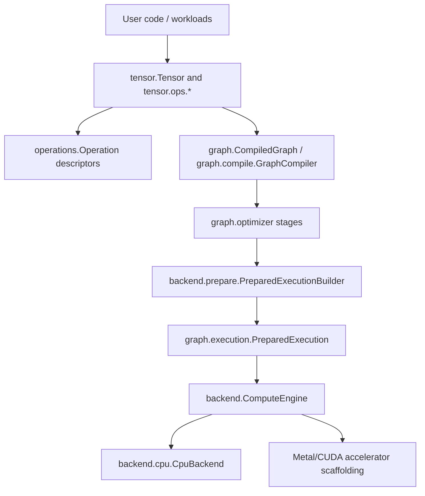
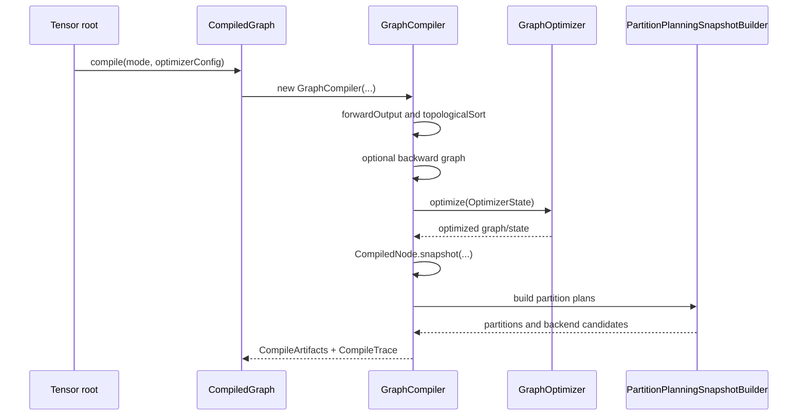
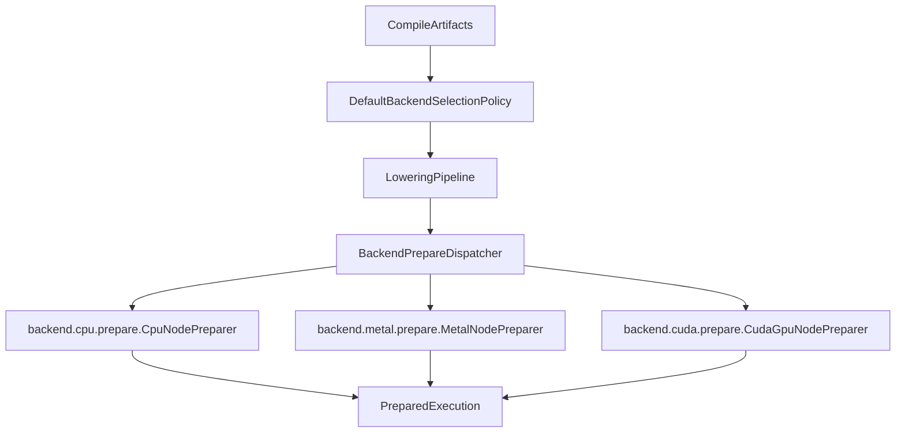
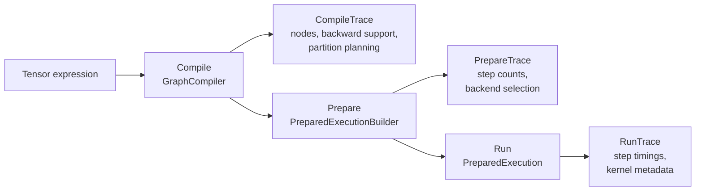
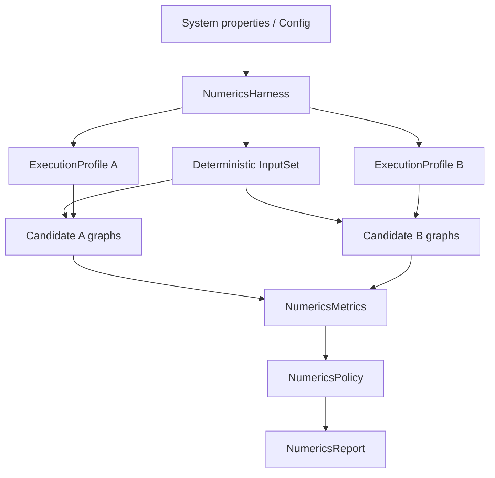

<!-- generated-by: gsd-doc-writer -->
# Synaptik Architecture

Navigation: [Index](index.md) | [Tensor API](tensor-api.md) | [Compute Flow](compute-flow.md) | [Graph Optimizer](graph-optimizer.md) | [Calibration & Autotune](calibration-autotune.md) | [Modules](modules.md)

Chapters: [System Overview](#system-overview) | [Core Artifact Boundaries](#core-artifact-boundaries) | [Graph Construction](#graph-construction) | [Compile Pipeline](#compile-pipeline) | [Optimizer And Partitioning](#optimizer-and-partitioning) | [Prepare Pipeline](#prepare-pipeline) | [Execution Pipeline](#execution-pipeline) | [CPU Backend](#cpu-backend) | [Accelerator Scaffolding](#accelerator-scaffolding) | [Configuration, Profiles, And Tuning](#configuration-profiles-and-tuning) | [Memory And Layout Model](#memory-and-layout-model) | [Tracing And Observability](#tracing-and-observability) | [Numerics Harness](#numerics-harness) | [Verification Anchors](#verification-anchors)

Synaptik is a layered Java tensor runtime built around a compiled graph lifecycle rather than eager-only execution. User code builds semantic `Tensor` graphs, `CompiledGraph` snapshots and optimizes those graphs, `PreparedExecution` attaches runtime/backend metadata, and `ComputeEngine` dispatches prepared steps to backend implementations. The fully implemented execution backend is CPU; Metal and CUDA have region lowering and executable scaffolding, while OpenCL currently exposes only a minimal no-op registry path.

## Table Of Contents

- [System Overview](#system-overview)
- [Core Artifact Boundaries](#core-artifact-boundaries)
- [Graph Construction](#graph-construction)
- [Compile Pipeline](#compile-pipeline)
- [Optimizer And Partitioning](#optimizer-and-partitioning)
- [Prepare Pipeline](#prepare-pipeline)
- [Execution Pipeline](#execution-pipeline)
- [CPU Backend](#cpu-backend)
- [Accelerator Scaffolding](#accelerator-scaffolding)
- [Configuration, Profiles, And Tuning](#configuration-profiles-and-tuning)
- [Memory And Layout Model](#memory-and-layout-model)
- [Tracing And Observability](#tracing-and-observability)
- [Numerics Harness](#numerics-harness)
- [Verification Anchors](#verification-anchors)

## System Overview

The primary input is a graph rooted at `tensor.Tensor`. Each graph node carries shape, dtype, storage/layout metadata, an optional `operations.Operation` descriptor, predecessor edges, and backward construction logic. The primary output is either published tensor data after forward execution or detached gradient tensors after forward/backward execution. The architecture is intentionally staged:

1. `tensor` builds semantic graph nodes.
2. `operations` describes primitive semantics.
3. `graph` compiles, optimizes, partitions, and prepares executable artifacts.
4. `backend` resolves concrete kernels and executes prepared node steps.
5. `config` and `tuning` control optimizer/runtime policy and persist measured profiles.



## Core Artifact Boundaries

The most important architectural rule is that each lifecycle artifact owns different information.

| Artifact | Main files | Owns | Must not own |
|---|---|---|---|
| Semantic tensor graph | `src/main/java/tensor/Tensor.java`, `src/main/java/tensor/ops/*` | Shape, dtype, storage, operation descriptor, predecessor edges, public API, backward builders | CPU dispatch hints, compiled node ids, runtime workspaces |
| Primitive descriptor | `src/main/java/operations/Operation.java`, `src/main/java/operations/**` | Immutable operation identity and semantic parameters | Kernel code, mutable runtime state, optimizer policy |
| Compile artifact | `src/main/java/graph/CompiledGraph.java`, `src/main/java/graph/compile/CompileArtifacts.java` | Compiled node snapshots, forward/backward boundary, optimizer state, memory plan, partition plans | Per-run execution state |
| Prepared artifact | `src/main/java/graph/execution/PreparedExecution.java`, `src/main/java/graph/execution/CompiledNodeExecutionMetadata.java` | Ordered execution steps, prepared backend metadata, prepared fused/accelerator executables | Graph rewriting |
| Runtime context | `src/main/java/backend/runtime/ExecutionContext.java`, `src/main/java/graph/execution/ExecutionState.java` | Per-run tensors, metadata index, workspaces, auxiliary runtime caches | Semantic graph ownership |

## Graph Construction

Public graph construction starts in `src/main/java/tensor/Tensor.java` and delegates family-specific work into `src/main/java/tensor/ops/*`. For example, binary operations are implemented through `tensor.ops.binary.TensorBinaryOps`, reductions through `tensor.ops.reduction.TensorReduceOps`, layout through `tensor.ops.layout.TensorLayoutOps`, and linalg through `tensor.ops.linalg.*`.

The public convenience execution methods are centralized in `src/main/java/tensor/TensorExecutionSupport.java`:

- `Tensor.compile()` and `Tensor.compile(CompileMode)` call `CompiledGraph.compile(...)`.
- `Tensor.compute()` defaults to `CompileMode.INFERENCE_ONLY`.
- `Tensor.compute(CompileMode.TRAINING)` selects training optimizer/runtime defaults and runs backward only when trainable leaf inputs exist.
- `Tensor.compute(ComputeOptions)` may resolve a persisted or newly autotuned profile when `AutotunePolicy.IF_MISSING` is used.

Example:

```java
Tensor x = new Tensor(new double[]{1.0, -2.0, 3.0}, new int[]{3}, null, "x", DataType.FLOAT64);
x.setRequiresGrad(true);

Tensor loss = x.mul(x).sum();
loss.compute(CompileMode.TRAINING);

double[] gradient = x.getGradient().toDoubleArrayCopy();
```

`CompileMode.TRAINING` is an intent, not a forced backward graph. `GraphCompiler` checks for trainable leaf tensors and compiles backward only when they exist.

## Compile Pipeline

`src/main/java/graph/CompiledGraph.java` is the facade. It creates `graph.compile.GraphCompiler` with:

- a semantic forward canonicalizer from `graph.optimizer.OptimizerFactory.createSemanticForwardCanonicalizer(...)`
- a `GraphOptimizer` built from `config.optimizer.OptimizerConfig`
- a `PartitionConfig`
- a `CompileMode`

The actual compile session in `src/main/java/graph/compile/GraphCompiler.java` performs these steps:

1. Resolve the semantic forward output with `rootTensor.forwardOutput()`.
2. Optionally canonicalize the forward graph through `SemanticForwardCanonicalizer`.
3. Detect trainable leaf inputs.
4. Decide whether backward should be compiled from `CompileMode`.
5. Build the backward graph through `BackwardGraphBuilder` when needed.
6. Capture an `OptimizerGraphSnapshot`.
7. Run the ordered optimizer pipeline.
8. Rebuild `CompiledNode` snapshots.
9. Capture gradient bindings through `GradientBindingCollector`.
10. Build partition planning snapshots through `PartitionPlanningSnapshotBuilder`.
11. Return immutable `CompileArtifacts`.



## Optimizer And Partitioning

Optimizer configuration lives under `src/main/java/config/optimizer`. The concrete stage enum in `OptimizerStage.java` is:

```text
AR, CSE, PART, FUSE, MEM
```

`OptimizerConfig.inferenceDefaults()` and `OptimizerConfig.trainingDefaults()` both currently use:

```text
AR -> CSE -> PART -> FUSE -> MEM
```

The stages map through `src/main/java/graph/optimizer/OptimizerFactory.java`:

| Stage | Implementation | Responsibility |
|---|---|---|
| `AR` | `graph.optimizer.rewrite.RewriteRule` | Algebraic simplification and semantic lowerings such as linear, loss, attention, reduction, and optional conv2d lowerings |
| `CSE` | `graph.optimizer.cse.CommonSubexpressionEliminationRule` | Structural common-subexpression elimination |
| `PART` | `graph.optimizer.partition.PartitionIntentRule` | Backend partition intent and region candidate planning |
| `FUSE` | `graph.optimizer.region.RegionOptimizationRule` | Region optimization and elementwise/fused execution-unit decisions |
| `MEM` | `graph.optimizer.memory.MemoryOptimizerRule` | Memory planning, alias handling, and reusable runtime slots |

`config.optimizer.OptimizerConfig` validates stage order: `FUSE` requires `PART`, `PART` must run before `FUSE`, and `MEM` requires `FUSE`. That validation means downstream docs or examples should not present `AR -> CSE -> FUSE -> MEM` as the full default stage order without `PART`.

Partition planning bridges graph optimization and backend preparation. `src/main/java/graph/compile/PartitionPlanningSnapshotBuilder.java` creates backend candidate partitions, and backend descriptors are registered in `src/main/java/backend/partition/BackendPartitionDescriptorRegistry.java`. The default registry includes CPU plus Metal and CUDA accelerator partition descriptors.

## Prepare Pipeline

`src/main/java/backend/prepare/PreparedExecutionBuilder.java` turns compile artifacts into a `PreparedExecution`. Prepare is where runtime policy becomes concrete backend metadata. It does not rewrite graph semantics.

Prepare performs these main steps:

1. Build a consumer map for compiled nodes.
2. Create `BackendPrepareContext`.
3. Select backend plans with `backend.select.DefaultBackendSelectionPolicy`.
4. Lower selected regions through `backend.lowering.LoweringPipeline`.
5. Create `BackendPrepareDispatcher` from `RuntimeConfig`.
6. Prepare each executable node into `CompiledNodeExecutionMetadata`.
7. Split prepared steps into forward and backward lists.
8. Return `PreparedExecution` with a `PrepareTrace`.



`BackendPrepareDispatcher` switches by `CompiledNode.backend()`. CPU nodes go to `CpuNodePreparer`. Metal and CUDA nodes go to accelerator preparers. OpenCL currently receives metadata without a prepared kernel or executable in the dispatcher.

## Execution Pipeline

`src/main/java/graph/execution/PreparedExecution.java` owns runtime execution. For each run it:

1. Creates an `ExecutionState`.
2. Binds memory through `RuntimeMemoryBinder`.
3. Creates an `ExecutionContext` from `RuntimeConfig`, `ExecutionMode`, prepared metadata, and execution state.
4. Executes forward steps, or full forward/backward steps.
5. Publishes output data back to the semantic root.
6. Publishes detached gradients back to semantic tensors when running backward.

Step execution is intentionally simple:

```java
ComputeEngine.compute(step.compiledNode(), step.metadata(), context);
```

`src/main/java/backend/ComputeEngine.java` switches on prepared backend metadata:

- `CPU` -> `backend.cpu.CpuBackend`
- `GPU_CUDA` -> `backend.cuda.CudaGpuBackend` when an accelerator executable exists, otherwise `backend.cuda.CudaBackend`
- `GPU_OPENCL` -> `backend.opencl.OpenClBackend`
- `GPU_METAL` -> `backend.metal.MetalBackend`

This is why backend selection and metadata preparation must be complete before execution begins.

## CPU Backend

The CPU implementation is rooted at `src/main/java/backend/cpu`. Its package README documents the ownership rule: CPU implementation belongs under `backend.cpu`, not root `backend`.

CPU preparation happens in `src/main/java/backend/cpu/prepare/CpuNodePreparer.java`. It resolves:

- `CpuKernel` from `backend.cpu.registry.CpuKernelResolver`
- `CpuNodeExecutionPlan` from `backend.cpu.kernels.plan.CpuExecutionPlanner` and `CpuPlanAssembler`
- dtype compute/storage/accumulation contracts
- elementwise dispatch hints
- fused dispatch and prepared fused executables
- matmul, conv2d, reduction, layout, and workspace requirements

CPU execution happens in `src/main/java/backend/cpu/CpuBackend.java`. It receives the prepared kernel and CPU plan from metadata, resolves runtime tensors from `ExecutionContext`, applies prepared input/layout policy, and calls dtype-specific kernel methods such as `forwardF64`, `forwardF32`, `forwardBF16`, `forwardI32`, or `forwardBOOL`.

The CPU kernel tree mirrors operation families:

```text
src/main/java/backend/cpu/kernels/
  elementwise/
  fused/
  grad/
  index/
  layout/
  linalg/
  nn/
  plan/
  reduction/
```

Important specialized subareas include:

- elementwise scalar/vector/parallel dispatch in `backend.cpu.kernels.elementwise`
- strided elementwise execution in `backend.cpu.kernels.elementwise.strided`
- matmul Java and BLAS paths in `backend.cpu.kernels.linalg.matmul`
- attention execution and runtime cache in `backend.cpu.kernels.linalg`
- conv2d and pool2d in `backend.cpu.kernels.nn`
- fused runtime kernels in `backend.cpu.kernels.fused`
- generated/ASM fused preparation in `backend.cpu.fused`

The Gradle build adds `jdk.incubator.vector` for compile, test, and run tasks in `build.gradle`, so CPU vectorized code can rely on the Vector API module being available when run through the Gradle wrapper.

## Accelerator Scaffolding

Accelerator support is present but not equivalent to the CPU backend.

| Area | Files | Verified status |
|---|---|---|
| Shared accelerator DAG/lowering contracts | `src/main/java/backend/accelerator/**` | Shared specs for accelerator subgraphs, post-ops, prepared executable support, runtime availability, and cost modeling |
| Metal | `src/main/java/backend/metal/**` | Has region legality, lowering, prepare, prepared executable, and FFM bridge classes |
| CUDA | `src/main/java/backend/cuda/**` | Has region legality, lowering, prepare, prepared executable, and FFM bridge classes |
| OpenCL | `src/main/java/backend/opencl/**` | Has backend and registry classes, but the registry currently exposes only `NOOP` |

Needs verification: native Metal/CUDA runtime availability depends on machine-specific bridge loading and external native libraries, which cannot be proven from Java source alone. The source-level integration points are `backend.metal.bridge.*`, `backend.cuda.bridge.*`, and `backend.accelerator.select.AcceleratorRuntimeAvailability`.

## Configuration, Profiles, And Tuning

Configuration is split by lifecycle ownership:

- `src/main/java/config/optimizer` controls graph optimizer stage order and rewrite/fusion/memory/partition policy.
- `src/main/java/config/runtime` controls execution-time policy such as CPU kernel tuning, approximation, BLAS, conv2d, fused execution, and accelerators.
- `src/main/java/config/profile` combines optimizer and runtime policy into executable/profile artifacts.

`config.profile.ExecutionProfile` is the runnable unit for benchmark and autotune. It contains:

- profile and candidate names
- dtype
- `backend.runtime.ExecutionMode`
- `OptimizerConfig`
- `RuntimeConfig`
- workload metadata

The tuning package at `src/main/java/tuning` measures and persists those real execution profiles. The main workflows are:

- benchmark explicit candidates through `tuning.benchmark`
- autotune a graph/workload through `tuning.autotune`
- calibrate platform runtime defaults through `tuning.calibration`
- persist winners and histories through `tuning.store`

The CLI in `src/main/java/synaptik/app/TuningCli.java` wires these flows. The
`src/main/java/synaptik/app/Main.java` entry point shows the same calibration and benchmark building
blocks configured directly from Java code through `src/main/java/tuning/api/Synaptik.java`.

```bash
./gradlew run --args="full f64"
./gradlew run --args="calibrate --dtype f64 --families all"
./gradlew run --args="autotune f64"
./gradlew run --args="benchmark-winner f64"
./gradlew run --args="benchmark-graph-space f64"
```

The no-argument CLI default is `full f64`.

## Memory And Layout Model

Layout is first-class in both semantic tensors and runtime execution. `TensorMetadata` stores shape, strides, storage offset, dtype, and label. Layout operations such as reshape, permute, expand, squeeze, select, and contiguous are explicit operation descriptors under `src/main/java/operations/layout` and public builders under `src/main/java/tensor/ops/layout`.

The `MEM` optimizer stage produces a `MemoryPlan` under `src/main/java/graph/optimizer/memory`. `PreparedExecution` passes that plan to `RuntimeMemoryBinder` before running steps. This keeps allocation/reuse decisions tied to compile artifacts while per-run storage lives in `ExecutionState`.

The architecture supports view-like behavior without treating every layout operation as a dense copy. The CPU layout kernels under `src/main/java/backend/cpu/kernels/layout` include alias/view, expand, permute, contiguous, reshape-like, and noop paths.

## Tracing And Observability

Synaptik's observability model follows the same three-stage lifecycle as compute itself: compile,
prepare, and run. Traces are plain Java records returned by the framework; they are not global logs,
not automatically persisted, and not part of numerical execution semantics. This matters because the
same graph can be compiled once, prepared with a specific runtime configuration, and executed many
times. Each trace answers a different question:

| Trace | Produced by | Main question | Access path |
|---|---|---|---|
| `CompileTrace` | `GraphCompiler.compile()` through `CompiledGraph.compile()` | What graph did compilation produce? | `CompiledGraph.compileTrace()` |
| `PrepareTrace` | `PreparedExecutionBuilder.prepare(...)` | How did compile artifacts become executable steps? | `PreparedExecution.prepareTrace()` |
| `RunTrace` | `PreparedExecution.executeTraced(...)` or `CompiledGraph.executeTraced(...)` | What actually ran in this execution? | returned from traced execution |
| `ExecutionTrace` | caller-assembled lifecycle record | How do compile, prepare, and one run relate? | `new ExecutionTrace(compile, prepare, run)` |



- `CompileTrace` in `src/main/java/graph/execution/trace/CompileTrace.java`
- `PrepareTrace` in `src/main/java/graph/execution/trace/PrepareTrace.java`
- `RunTrace` in `src/main/java/graph/execution/trace/RunTrace.java`
- `ExecutionTrace` in `src/main/java/graph/execution/trace/ExecutionTrace.java`

For a step-by-step trace walkthrough, see [compute-flow.md#traces](compute-flow.md#traces). That
document expands the field-level schema and shows example access code. This architecture section
focuses on where trace data enters the system and what ownership boundary each trace represents.

### Compile-Time Trace

`CompileTrace` is created in `src/main/java/graph/compile/GraphCompiler.java` after a compile
session finishes. It records:

- whether compile timing was measured
- compile duration in nanoseconds
- final compiled node count
- forward node count
- whether backward artifacts were produced
- `PartitionCompileTrace`, which summarizes partition planning

`PartitionCompileTrace` is the architecture-level bridge from optimizer to observability. It reports
the partition planner strategy, target backend, number of candidate starts considered, accepted and
rejected candidate counts, and detailed `PartitionDecisionTrace` rows. A partition decision records
which seed node was considered, whether it was accepted, selected node ids, structural candidate node
ids, operation types, estimated work, score values, search count, whether search budget was hit, and
which node caused rejection when applicable.

Concrete mental model:

```text
Tensor graph
  -> GraphCompiler
  -> OptimizerState
  -> partition planner
  -> CompileArtifacts
  -> CompileTrace(partitionPlanning=...)
```

If an accelerator region is not selected, compile trace can explain whether there were no candidates,
whether candidate legality failed, or whether search/cost scoring rejected the region. It does not say
which CPU kernel eventually ran; that belongs to prepare/run tracing.

### Prepare-Time Trace

`PrepareTrace` is produced by `src/main/java/backend/prepare/PreparedExecutionBuilder.java`. Prepare
is the point where runtime policy becomes concrete executable metadata. The trace records:

- preparation duration
- prepared forward step count
- prepared backward step count
- `BackendSelectionTrace`

`BackendSelectionTrace` summarizes accelerator/backend candidate selection. Its
`BackendSelectionDecisionTrace` entries include the candidate anchor node, node ids covered by the
candidate, compatible backend list, whether the candidate was selected, selected backend, rejection or
acceptance reason, and estimated work.

This means prepare trace is the right artifact when debugging questions such as:

- "Why did this region stay on CPU even though Metal/CUDA support exists?"
- "How many forward and backward steps will execute after partition interiors are hidden behind anchors?"
- "Did runtime config reject a backend because availability or minimum-work policy failed?"

Prepare trace deliberately stops before per-kernel timing. It describes the executable plan, not the
actual latency of a run.

### Run-Time Trace

`RunTrace` is produced only by traced execution. `PreparedExecution.execute(...)` and
`PreparedExecution.executeTraced(...)` share the same execution path, but the traced variant records
one `ExecutionStepTrace` per executed prepared step. Each step trace is built in
`PreparedExecution.toStepTrace(...)` and contains:

- step index within the run
- compiled node label
- operation type
- output shape
- dtype
- selected backend
- CPU kernel class name when a CPU kernel is present
- step duration in nanoseconds
- structured `StepExecutionMetadata`

`StepExecutionMetadata` is intentionally sparse: only metadata relevant to a step is populated. The
record can carry:

| Metadata section | Source | What it explains |
|---|---|---|
| `compute` | CPU execution plan compute contract | storage dtype, compute dtype, accumulation dtype, backend |
| `layout` | compiled node layout and CPU plan | storage offset, contiguity, strided path, target type |
| `dispatch` | CPU dispatch hints | scalar/vector mode, vector width, planned workers, chunk sizes |
| `reduction` | CPU reduction hints | reduction mode, worker count, chunk size, vector width, accuracy mode |
| `matMul` | CPU matmul hints | BLAS use, batched BLAS use, parallelism, tiles, work estimate, micro-kernel |
| `conv` | `ExecutionContext.publishConvTrace(...)` side channel | conv lowering kind, BLAS provider, GEMM dimensions, Java/BLAS call counts |
| `fused` | `operations.FusedOperation` and prepared fused executable | fused precision, dispatch family, scheduler signature, backend, node/input counts |
| `attributes` | accelerator prepared executables | Metal bridge availability, executable cache status, subgraph op list, estimated work |

The convolution metadata path is worth calling out because it is not known completely at prepare
time. Kernels can publish per-run convolution details into `ExecutionContext` via
`publishConvTrace(nodeId, trace)`. Later, while building the `ExecutionStepTrace`,
`PreparedExecution` reads that side channel with `context.convTraceForNodeId(node.id())`.

### Runtime State Side Channels

`ExecutionContext` in `src/main/java/backend/runtime/ExecutionContext.java` carries two synchronized
side maps:

- `runtimeStateIndex`, keyed by tensor identity, for backend-specific temporary state
- `convTraceIndex`, keyed by compiled node id, for convolution trace metadata

These maps are per-run context, not shared global state. They let backend helpers exchange prepared
state and diagnostics without mutating compile artifacts. The execution scheduler still controls the
ordered prepared steps, runtime tensors, and workspaces through `ExecutionState`.

The important ownership rule is that traces describe decisions already made elsewhere:

- optimizer and partition rules make compile-time decisions; `CompileTrace` exposes the result
- prepare policies choose concrete executable steps; `PrepareTrace` exposes the result
- kernels and backend executables perform the work; `RunTrace` records timing and step metadata

That separation is why tracing has low architectural risk. Adding a new metadata field should not
change graph semantics. Conversely, a correctness fix should not rely on a trace side effect being
present.

### What Tracing Does Not Do

Tracing is diagnostic. It does not:

- persist records to disk automatically
- decide optimizer policy
- change backend selection
- include every intermediate tensor value
- replace benchmark measurement or the numerics harness

Use tracing when you need to understand a single lifecycle path. Use benchmark/autotune when you need
latency comparisons. Use the numerics harness when you need output and gradient drift comparison.

### Small Trace Example

```java
Tensor x = new Tensor(new double[]{1.0, 2.0, 3.0}, new int[]{3}, null, "x", DataType.FLOAT64);
Tensor y = x.mul(2.0).sum();

CompiledGraph compiled = CompiledGraph.compile(y, OptimizerConfig.inferenceDefaults());
// compiled.compileTrace().totalNodeCount() describes the optimized compiled graph.
// compiled.compileTrace().partitionPlanning() explains partition candidate decisions.

PreparedExecution prepared = compiled.prepare(RuntimeConfig.inferenceDefaults());
// prepared.prepareTrace().forwardStepCount() is the number of forward executable steps.
// prepared.prepareTrace().backendSelection() explains backend candidate selection.

RunTrace run = prepared.executeTraced(ExecutionMode.FORWARD);
// run.steps() contains one ExecutionStepTrace per executed prepared step.
// Each step may carry compute/layout/dispatch/matmul/reduction/fused metadata.
```

## Numerics Harness

`src/main/java/numerics` is a standalone A/B drift harness, not a performance benchmark. It answers a
different question from tracing:

```text
Tracing:   Which path did one execution take?
Numerics:  Did two execution profiles produce materially equivalent values?
Benchmark: Which candidate is faster under a measurement policy?
```

The harness compares two `ExecutionProfile` values on identical deterministic inputs. Each profile
may use a different optimizer stage list, runtime config, dtype, approximation policy, or backend
policy. The harness then reports output and gradient drift across several signals.

Primary files:

- `src/main/java/numerics/NumericsCli.java`
- `src/main/java/numerics/NumericsHarness.java`
- `src/main/java/numerics/NumericsGraphFactory.java`
- `src/main/java/numerics/NumericsMetrics.java`
- `src/main/java/numerics/NumericsPolicy.java`
- `src/main/java/numerics/NumericsReport.java`

Module-level package notes are in [modules.md#numerics-numerical-drift-harness](modules.md#numerics-numerical-drift-harness).
System-property configuration keys are listed in [configuration.md#diagnostic-and-benchmark-cli-properties](configuration.md#diagnostic-and-benchmark-cli-properties).

### What The Harness Builds

`NumericsHarness.Config` controls the deterministic workload:

| Field | Default | Meaning |
|---|---:|---|
| `dtype` | `FLOAT32` | dtype used to construct compared tensors |
| `size` | `200000` | number of flat scalar elements in the optimizer-like workload |
| `graphBlocks` | `6` | repeated arithmetic block count |
| `b0` | `128` | broadcast graph first batch dimension |
| `b1` | `8` | broadcast graph second batch dimension |
| `f` | `128` | broadcast feature dimension |
| `seed` | `42` | random seed shared by both candidates |

The run has two graph families:

1. **Optimizer-like training graph** from `NumericsGraphFactory.buildOptimizerLikeGraph(...)`.
   It creates trainable flat tensors `A`, `B`, and `C`, mixes repeated arithmetic blocks, and adds
   a small stack of `linear(...)` operations. The graph is compiled and executed in
   `ExecutionMode.FORWARD_BACKWARD` twice for each candidate. The report compares:
   - final output signal `out`
   - gradient of `A`
   - gradient of `B`
   - gradient of `C`
2. **Broadcast/layout graph** from `NumericsGraphFactory.buildBroadcastGraph(...)`.
   It creates tensors with shapes `[b0, 1, f]`, `[1, b1, f]`, and `[b0, b1, f]`, then computes
   `a.add(b).mul(c).add(a).sigmoid()`. This graph is executed in forward mode and catches drift in
   broadcasting, layout, sigmoid approximation, and elementwise dispatch.

The candidate executions use separate tensor instances but the same generated `double[]` inputs.
That keeps input data identical while allowing each profile to compile, prepare, and execute through
its own optimizer/runtime policy.

### Lifecycle



Step by step:

1. `NumericsCli` reads `numerics.*` system properties and builds `NumericsHarness.Config`.
2. It parses optimizer stage lists with `NumericsHarness.parseStages(...)`.
3. `NumericsHarness.profile(...)` creates two training `ExecutionProfile` values with the same dtype
   and runtime defaults but different stage orders.
4. `NumericsHarness.run(...)` creates one deterministic `InputSet`.
5. Candidate A runs on a fresh graph built from that input.
6. Candidate B runs on another fresh graph built from the same input.
7. `NumericsMetrics.compare(...)` compares each signal pair.
8. `NumericsMetrics.aggregate(...)` collapses the five signal metrics into maximum drift and invalid
   counts.
9. `NumericsPolicy.evaluate(...)` assigns `SAFE`, `BORDERLINE`, or `UNSAFE`.
10. `NumericsReport.toPrettyString()` formats the result for CLI/log output.

### Metrics

For each signal, `NumericsMetrics.SignalMetrics` records:

| Metric | Meaning |
|---|---|
| `maxAbs` | maximum absolute difference over finite positions |
| `avgAbs` | mean absolute difference over finite positions |
| `maxRel` | maximum relative difference using `abs / max(1, abs(reference))` |
| `maxUlp` | maximum ULP distance after dtype-aware conversion |
| `p50Ulp` | median observed ULP distance |
| `p95Ulp` | 95th percentile ULP distance |
| `finiteCount` | positions where both values were finite |
| `invalidCount` | positions where either value was NaN or infinite |

ULP comparison is dtype-aware. `FLOAT32` values are converted to `float` before ULP distance is
computed. `FLOAT64` uses double ULP distance. `BOOL` is explicitly unsupported by numerics policy
and ULP metrics. `BFLOAT16` currently follows the non-`FLOAT32` branch in
`NumericsMetrics.toDTypeUlpDistance(...)`, so its ULP metric is computed on the double values exposed
by tensor copies; absolute and relative tolerances are therefore especially important for BF16 drift
interpretation.

The aggregate metric keeps the maximum absolute, relative, and ULP drift across:

- `out`
- `gradA`
- `gradB`
- `gradC`
- `broadcast`

It also sums invalid counts across all five signals.

### Verdict Policy

`NumericsPolicy.defaultsFor(dtype)` uses:

| Dtype | Absolute tolerance | Relative tolerance | ULP tolerance |
|---|---:|---:|---:|
| `FLOAT64` | `1e-12` | `1e-12` | `16` |
| `FLOAT32` / `BFLOAT16` | `1e-5` | `1e-5` | `128` |

Evaluation order:

1. Any invalid value makes the report `UNSAFE`.
2. If `maxAbs` exceeds `absTol + relTol * max(1, maxAbs)` and `maxUlp` is also above tolerance, the
   report is `UNSAFE`.
3. If `maxAbs` exceeds tolerance but `maxUlp` is still within tolerance, the report is `BORDERLINE`.
4. If absolute/relative drift is within tolerance but ULP drift exceeds tolerance, the report is
   `BORDERLINE`.
5. Otherwise the report is `SAFE`.

### CLI Usage

`NumericsCli` is system-property driven, but it is a standalone main class. The Gradle
`application.run` task in `build.gradle` is wired to `synaptik.app.TuningCli`, whose command router covers
calibration, autotune, and benchmark flows, not `numerics.NumericsCli`. In other words,
`./gradlew run --args="..."` is the ergonomic tuning CLI, while numerics diagnostics must be launched
as `numerics.NumericsCli` from an IDE, a dedicated JavaExec launcher, or another Java launcher with
the project runtime classpath.

The CLI properties are:

```text
-Dnumerics.dtype=FLOAT32
-Dnumerics.stageA=NONE
-Dnumerics.stageB=AR,CSE,PART,FUSE,MEM
-Dnumerics.nameA=baseline
-Dnumerics.nameB=optimized
-Dnumerics.size=200000
-Dnumerics.graphBlocks=6
-Dnumerics.broadcastB0=128
-Dnumerics.broadcastB1=8
-Dnumerics.broadcastF=128
-Dnumerics.seed=42
```

The same comparison can be run directly from Java:

```java
NumericsHarness.Config cfg = new NumericsHarness.Config();
cfg.dtype = DataType.FLOAT32;
cfg.size = 200_000;
cfg.graphBlocks = 6;

NumericsHarness harness = new NumericsHarness(cfg);
ExecutionProfile baseline = harness.profile("baseline", NumericsHarness.parseStages("NONE"));
ExecutionProfile optimized = harness.profile("optimized", NumericsHarness.parseStages("AR,CSE,PART,FUSE,MEM"));

NumericsReport report = harness.run(
        baseline,
        optimized,
        NumericsPolicy.defaultsFor(DataType.FLOAT32)
);

System.out.print(report.toPrettyString());
```

Expected report shape:

```text
Numerics Report
scenario=benchmark-like, A=baseline, B=optimized
out: maxAbs=..., avgAbs=..., maxRel=..., maxUlp=..., p50Ulp=..., p95Ulp=..., invalid=...
gradA: ...
gradB: ...
gradC: ...
broadcast: ...
aggregate: maxAbs=..., maxRel=..., maxUlp=..., invalid=...
verdict=SAFE (...)
```

### When To Use It

Use the numerics harness when changing anything that could preserve speed but alter floating-point
results:

- optimizer rewrites
- CSE safety policy
- partition/fusion policy
- BF16/F32/F64 compute contracts
- fast transcendental approximation policy
- vectorized vs scalar CPU paths
- BLAS or fused backend dispatch
- broadcast/layout execution paths

Do not use it as a latency benchmark. It intentionally runs deterministic comparison workloads and
reports drift, not median/p95 runtime. Use `tuning.benchmark` for performance measurement and
`tuning.autotune` or `tuning.calibration` for search/persistence workflows.

## Verification Anchors

The claims in this document were checked against source files and tests including:

- lifecycle: `src/main/java/tensor/TensorExecutionSupport.java`, `src/main/java/graph/CompiledGraph.java`, `src/main/java/graph/compile/GraphCompiler.java`, `src/main/java/backend/prepare/PreparedExecutionBuilder.java`, `src/main/java/graph/execution/PreparedExecution.java`
- optimizer stages: `src/main/java/config/optimizer/OptimizerStage.java`, `src/main/java/config/optimizer/OptimizerConfig.java`, `src/main/java/graph/optimizer/OptimizerFactory.java`
- backend dispatch: `src/main/java/backend/ComputeEngine.java`, `src/main/java/backend/cpu/CpuBackend.java`, `src/main/java/backend/cpu/prepare/CpuNodePreparer.java`, `src/main/java/backend/cpu/registry/CpuKernelResolver.java`
- tracing: `src/main/java/graph/execution/trace/*.java`, `src/main/java/backend/runtime/ExecutionContext.java`, `src/main/java/graph/execution/PreparedExecution.java`
- numerics: `src/main/java/numerics/NumericsCli.java`, `src/main/java/numerics/NumericsHarness.java`, `src/main/java/numerics/NumericsGraphFactory.java`, `src/main/java/numerics/NumericsMetrics.java`, `src/main/java/numerics/NumericsPolicy.java`, `src/main/java/numerics/NumericsReport.java`
- CLI and build: `src/main/java/synaptik/app/TuningCli.java`, `src/main/java/synaptik/app/Main.java`, `build.gradle`, `settings.gradle`
- representative tests: `src/test/java/PreparedExecutionBuildTest.java`, `src/test/java/CompiledGraphTraceTest.java`, `src/test/java/TensorComputeConvenienceApiTest.java`, `src/test/java/CpuKernelFamilyArchitectureTest.java`, `src/test/java/SourceTreeHygieneTest.java`
