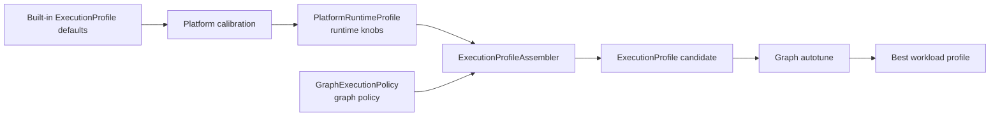
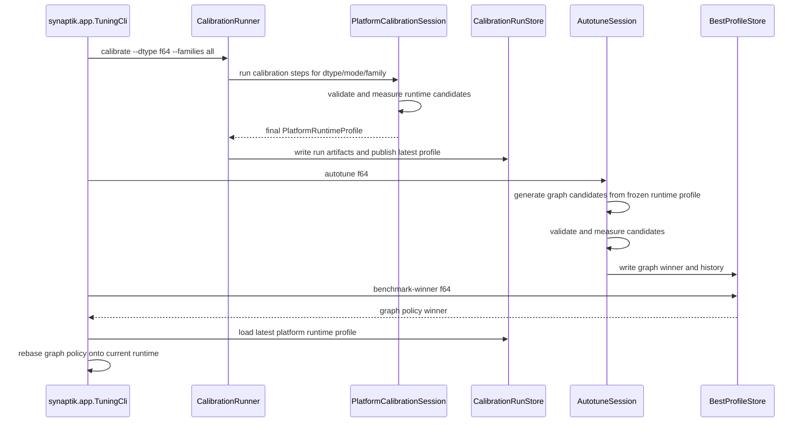
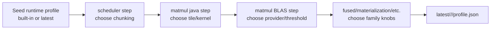
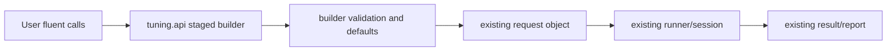
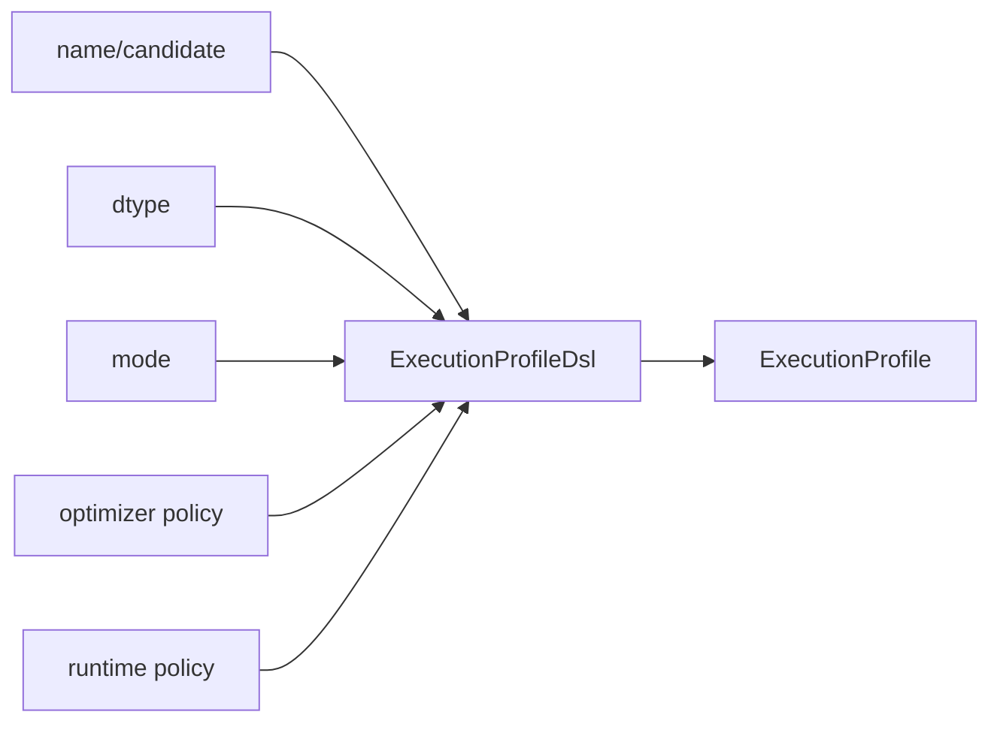
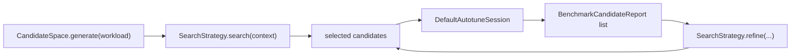

<!-- generated-by: gsd-doc-writer -->
# Calibration And Graph Autotune

Navigation: [Index](index.md#recommended-reading-paths) | [Configuration](configuration.md#tuning-and-calibration-persistence) | [Testing](testing.md#targeted-test-patterns) | [Examples](examples.md#programmatic-tuning-api) | [Graph Optimizer](graph-optimizer.md#graph-autotune-policy-candidates) | [Metal Backend](metal-backend.md#performance-model) | [Compute Flow](compute-flow.md#explicit-executionprofile)

Chapters: [Core Distinction](#core-distinction) | [Runtime And Graph Artifacts](#runtime-and-graph-artifacts) | [End-To-End Flow](#end-to-end-flow) | [Detailed Calibration Lifecycle](#detailed-calibration-lifecycle) | [Detailed Graph Autotune Lifecycle](#detailed-graph-autotune-lifecycle) | [CLI Entry Points](#cli-entry-points) | [Scenario Catalog And Configuration](#scenario-catalog-and-configuration) | [Ergonomic Fluent API](#ergonomic-fluent-api) | [Presets](#presets) | [Measurement Policy](#measurement-policy) | [Validation Policy](#validation-policy) | [Calibration Families](#calibration-families) | [Graph Autotune Parameters](#graph-autotune-parameters) | [Search Strategy](#search-strategy) | [Persistence And History Layout](#persistence-and-history-layout) | [Progress Rendering](#progress-rendering) | [Reports](#reports) | [Worked Example: Matmul Calibration](#worked-example-matmul-calibration) | [Worked Example: Graph Autotune Research Run](#worked-example-graph-autotune-research-run) | [Failure Modes](#failure-modes) | [Source Map](#source-map)

This guide explains how Synaptik tunes runtime behavior for a hardware/JDK platform and how it explores graph policy variants for one workload.

## Table Of Contents

- [Core Distinction](#core-distinction)
- [Runtime And Graph Artifacts](#runtime-and-graph-artifacts)
- [End-To-End Flow](#end-to-end-flow)
- [Detailed Calibration Lifecycle](#detailed-calibration-lifecycle)
- [Detailed Graph Autotune Lifecycle](#detailed-graph-autotune-lifecycle)
- [CLI Entry Points](#cli-entry-points)
- [Scenario Catalog And Configuration](#scenario-catalog-and-configuration)
- [Ergonomic Fluent API](#ergonomic-fluent-api)
- [Presets](#presets)
- [Measurement Policy](#measurement-policy)
- [Validation Policy](#validation-policy)
- [Calibration Families](#calibration-families)
- [Graph Autotune Parameters](#graph-autotune-parameters)
- [Search Strategy](#search-strategy)
- [Persistence And History Layout](#persistence-and-history-layout)
- [Progress Rendering](#progress-rendering)
- [Reports](#reports)
- [Worked Example: Matmul Calibration](#worked-example-matmul-calibration)
- [Worked Example: Graph Autotune Research Run](#worked-example-graph-autotune-research-run)
- [Failure Modes](#failure-modes)
- [Source Map](#source-map)

## Core Distinction

Calibration and graph autotune solve different problems. The easiest way to reason about the split is:

- Calibration teaches Synaptik what this machine is good at. It produces reusable runtime defaults for a platform, dtype, execution mode, and calibration family.
- Graph autotune asks whether a concrete workload should use a particular graph policy when the runtime defaults are already fixed.

The split exists because runtime parameters and graph parameters age differently. A matmul tile or fused vector width depends on CPU, JDK Vector API behavior, BLAS availability, and dtype. A CSE or memory-lifetime policy depends more on graph structure and correctness risk. Mixing these into one "autotune everything" surface would make winners hard to reuse safely: a profile that is optimal for `abc_sequence_matmul_f64` might accidentally overwrite runtime defaults needed by unrelated conv2d, reduction, or fused workloads.

| Workflow | Tunes | Scope | Output | Production role |
|---|---|---|---|---|
| Platform calibration | Platform/runtime/hardware-sensitive `PlatformRuntimeProfile` knobs | Per platform, dtype, execution mode, and calibration family | Latest platform runtime profile plus per-family run artifacts | Provides reusable runtime defaults for later profile assembly |
| Graph autotune | `GraphExecutionPolicy` only | One concrete workload with a frozen runtime profile during measurement | Best graph-policy record and append-only history | Standard mode persists a production-eligible graph winner; winner benchmark rebases that graph policy onto the current platform runtime profile |

Calibration answers questions such as "what matmul tile, BLAS threshold, fused width, or scheduler chunking policy is best on this machine for `f64` forward-backward?" Graph autotune answers "which graph policy candidate should this workload use when the runtime defaults are already fixed?"



The important boundary is that the runtime executes only real `ExecutionProfile` objects. Calibration mutates runtime defaults, graph autotune mutates or reuses graph policy, and `ExecutionProfileAssembler` combines those layers into runnable candidates. There is no special benchmark-only execution path: each measured candidate goes through `CompiledGraph.compile(...)`, `compiled.prepare(...)`, and `prepared.execute(...)` like normal framework execution.

## Runtime And Graph Artifacts

`PlatformRuntimeProfile` is the machine-oriented artifact. It contains runtime families such as matmul, conv2d dispatch, fused dispatch, elementwise dispatch, reduction, scheduler, materialization, numerics, and accelerator selection.

`GraphExecutionPolicy` is the graph-side layer. In the current code it wraps `OptimizerConfig` and carries optimizer rewrite, CSE, memory, fuse, and related graph settings.

`ExecutionProfile` is the runnable artifact passed to compile, prepare, and execute. Calibration and autotune both end up measuring candidates by compiling a fresh workload root, preparing it with the candidate runtime config, and executing it through the normal backend path.

| Artifact | Source class | Contains | Does not contain | Why it matters |
|---|---|---|---|---|
| `PlatformRuntimeProfile` | `src/main/java/config/profile/PlatformRuntimeProfile.java` | Runtime defaults: CPU kernel thresholds, matmul tiles, BLAS provider/min-work, fused widths, materialization thresholds, accelerator selection. | Optimizer stage order, CSE strictness, workload-specific best profile. | Can be reused across workloads on the same platform/dtype/mode. |
| `GraphExecutionPolicy` | `src/main/java/config/profile/GraphExecutionPolicy.java` | `OptimizerConfig`-backed graph policy: rewrite, CSE, fuse, memory, partition-related optimizer settings. | Hardware runtime thresholds and calibrated runtime family winners. | Lets graph policy be varied without contaminating calibrated runtime defaults. |
| `ExecutionProfile` | `src/main/java/config/profile/ExecutionProfile.java` | Dtype, execution mode, optimizer config, runtime config, workload profile, profile/candidate names. | Search history and report-only diagnostic data. | This is the only thing measured by compile/prepare/execute. |
| `BestProfileRecord` | `src/main/java/tuning/store/BestProfileRecord.java` | A persisted winning graph policy embedded in a measured `ExecutionProfile`, score, hardware/workload fingerprint, candidate metadata, and the runtime profile id used during measurement. | It is not a global platform default and its embedded runtime snapshot is not authoritative for future runs. | Used by workload-specific winner loading and history-aware ordering; graph winners are reassembled with current calibration before execution. |

Concrete assembly example:

```text
PlatformRuntimeProfile:
  dtype=f64
  mode=forward-backward
  cpu.matMulTileM/N/K=32/64/64
  cpu.matMulMicroKernel=F64_2X2
  runtime.blas.provider=OPENBLAS_FFM

GraphExecutionPolicy:
  optimizer.cse.strictSafety=true
  optimizer.memory.separateForwardBackwardPools=true

ExecutionProfileAssembler.assemble(...)
  -> ExecutionProfile(candidateName="graphPolicy=current")
     optimizer = graph policy optimizer config
     runtime = platform runtime profile converted to RuntimeConfig
     dtype = FLOAT64
     mode = FORWARD_BACKWARD
```

The assembled `ExecutionProfile` is what `DefaultMeasurementEngine` measures. The profile is intentionally explicit, so reports and history can point back to the exact runtime and graph policy that were benchmarked. For graph-autotune best profiles, that measured runtime is evidence, not ownership: `BestProfileRecord.graphPolicy()` extracts the graph side, and `BestProfileRecord.rebaseOnRuntime(...)` rebuilds a runnable profile from the current `PlatformRuntimeProfile`.

## End-To-End Flow



The fresh-graph rule matters for both workflows: each candidate measurement instantiates a fresh `WorkloadInstance`. The workload layer treats graph construction, validation target, validation reference, and metadata as one reproducible contract.

## Detailed Calibration Lifecycle

### What problem this solves

Calibration avoids hardcoding one universal runtime policy. A tile size, parallel threshold, or vector width that helps on one machine can be neutral or harmful on another. Calibration gives each platform a measured `PlatformRuntimeProfile` instead of assuming that built-in defaults are always best.

### Mental model

Think of calibration as a staged relay. Each family receives the current runtime profile, tries a bounded set of family-owned mutations, picks a winner, and passes that winner forward as the seed for the next family. The order matters because later families should tune on top of earlier runtime decisions rather than repeatedly returning to built-in defaults.



### Where it lives in the code

- CLI parsing: `src/main/java/tuning/calibration/run/CalibrationCommand.java`
- Run orchestration: `src/main/java/tuning/calibration/run/CalibrationRunner.java`
- Step execution: `src/main/java/tuning/calibration/DefaultPlatformCalibrationSession.java`
- Family registry and ownership: `src/main/java/tuning/calibration/family/CalibrationFamilyRegistry.java`
- Step definitions and candidate spaces: `src/main/java/tuning/calibration/PlatformCalibrationDefaults.java`
- Artifact layout: `src/main/java/tuning/calibration/store/CalibrationArtifactLayout.java`
- Artifact writing: `src/main/java/tuning/calibration/store/CalibrationRunStore.java`

### Step-by-step walkthrough

1. `CalibrationCommand` parses the request: dtype set, family set, preset, execution mode, output root, color/progress mode, and optional measurement override.
2. `CalibrationRunner.run(...)` captures `HardwareFingerprint`, derives a platform id, creates a schema-v2 artifact layout, and writes a started run manifest.
3. For each dtype, the runner loads the latest existing profile for that dtype/mode if present. If no latest profile exists, it builds a seed `ExecutionProfile` from training or inference defaults and converts it into a `PlatformRuntimeProfile`.
4. `CalibrationPlan.build(...)` expands the selected families into concrete `PlatformCalibrationStep` objects. Some public families produce multiple steps: `matmul` has Java, BLAS, and wide-BLAS steps; `materialization` has strided elementwise and `where` steps.
5. `DefaultPlatformCalibrationSession` creates the candidate space for the current step by passing the current runtime profile to the step's `candidateSpaceFactory`.
6. The generated candidates are checked with `CalibrationFamilyRegistry.validateCandidateChanges(...)`. A candidate for `REDUCTION`, for example, may change `cpu.reductionVectorMinSize` and `cpu.reductionParallelMinSize`, but not `cpu.matMulTileM`.
7. Each runtime candidate is assembled into a real `ExecutionProfile` using `ExecutionProfileAssembler`.
8. For each workload in the step, every candidate is validated and measured on a fresh workload instance.
9. The step score policy reduces all workload measurements into one candidate score.
10. The lowest valid score wins. Its `PlatformRuntimeProfile` becomes the current profile for the next step.
11. `CalibrationRunStore.saveStep(...)` writes reports, selected profile, candidate summaries, and an append-only family history record.
12. After all requested dtypes and passes complete, `CalibrationRunStore.publishLatest(...)` atomically publishes the final profile under `latest/<dtype>/<mode>/profile.json`.

### Worked example with concrete values

Suppose the seed `FLOAT64` runtime profile has:

```text
cpu.matMulMicroKernel=AUTO
cpu.matMulTileM=32
cpu.matMulTileN=32
cpu.matMulTileK=32
cpu.matMulParallelMinSize=500000
```

The Java matmul step can generate candidates such as:

```text
c0: base+matmulMicroKernel=F64_2X1+matmulTiles=16x64x32+matmulParallel=100000
c1: base+matmulMicroKernel=F64_4X1+matmulTiles=32x64x32+matmulParallel=500000
c2: base+matmulMicroKernel=F64_2X2+matmulTiles=32x64x64+matmulParallel=2000000
```

If the step workloads produce these median times:

| Candidate | `matmul_128` | `matmul_256` | `wide_256x256x2048` | `averageMedianMs` |
|---|---:|---:|---:|---:|
| `c0` | `0.80 ms` | `5.10 ms` | `19.00 ms` | `8.30 ms` |
| `c1` | `0.76 ms` | `4.70 ms` | `17.20 ms` | `7.55 ms` |
| `c2` | `0.90 ms` | `4.55 ms` | `15.60 ms` | `7.02 ms` |

`c2` wins even though it is not fastest on the smallest workload. The point of the score policy is to choose a family default that performs well across that family workload suite, not just on one shape.

### Why family ownership exists

Candidate ownership protects architectural clarity. Without it, a "matmul" candidate could quietly change scheduler, materialization, or fused thresholds, then appear faster for reasons unrelated to matmul. The registry makes every family accountable for its own knob set and rejects off-family mutations before measurement.

### Edge cases and failure modes

- If a family generates no candidates, the session cannot produce a meaningful winner for that step.
- If every candidate is invalid or fails measurement, the implementation falls back to the first candidate summary when selecting a step result, with the invalid score preserved in reports.
- Multi-step families save reports by family path. For `matmul`, the Java, BLAS, and wide-BLAS steps all write under the same family directory within a run; the family history JSONL preserves per-step records.
- Calibration does not automatically include accelerator families. `metal-selection` requires `--include-accelerators`, `FLOAT32`, and an available Metal runtime.

## Detailed Graph Autotune Lifecycle

### What problem this solves

Graph autotune measures graph-policy variants for one named workload while keeping calibrated runtime defaults frozen. This prevents a workload-specific graph experiment from rewriting global runtime defaults.

### Mental model

Graph autotune is a candidate filter around the normal execution pipeline:

```mermaid
flowchart LR
    Request["GraphAutotuneRequest"]
    Space["GraphAutotuneCandidateSpace"]
    Strategy["SearchStrategy"]
    Validate["DefaultValidationEngine"]
    Measure["DefaultMeasurementEngine"]
    Winner["Best graph-policy profile"]
    Store["Best graph policy + history"]

    Request --> Space --> Strategy --> Validate --> Measure --> Winner --> Store
```



The candidate space creates `Candidate` objects. The strategy decides which candidates to evaluate and in what order. Validation decides whether a candidate is semantically acceptable. Measurement decides how fast it is. Persistence records evidence and, when enabled, the best profile.

### Step-by-step walkthrough

1. `GraphAutotuneRequest` receives workload, dtype, mode, base `GraphExecutionPolicy`, frozen `PlatformRuntimeProfile`, graph autotune mode, measurement policy, validation policy, search policy, persistence policy, and progress listener.
2. `GraphAutotuneCandidateSpace.generate(...)` asks `GraphPolicyMutators` for variants.
3. In `STANDARD` mode, the candidate space returns production-eligible graph-policy candidates such as the current policy, CPU region policy variants, CPU fusion variants, and accelerator ownership policy variants. These candidates still keep the supplied runtime profile frozen.
4. In `RESEARCH` mode, the candidate space returns CSE, piecewise-lowering, and memory-lifetime variants. They are marked `CandidateKind.GRAPH_RESEARCH` and `productionEligible=false`.
5. `AutotuneDefaultStrategySelector` chooses a search strategy from candidate count, whether the candidate space is refinable, and the search policy.
6. `DefaultAutotuneSession.run()` asks the strategy for an initial search batch and evaluates each candidate fingerprint only once.
7. For each candidate, the session instantiates a fresh workload for validation.
8. If validation passes or is skipped, the session instantiates another fresh workload for measurement.
9. If the strategy supports refinement, the session calls `refine(...)` for additional rounds until `maxRounds` is reached or the strategy returns no candidates.
10. Finalists are successful measured candidates sorted by median steady-state milliseconds. The session keeps up to `beamWidth` finalists and treats the first as the best graph policy.
11. If persistence is enabled, the session appends every evaluated candidate to history and saves the winning best-profile record. The saved record includes the measured `ExecutionProfile`, but graph execution should later extract its graph policy and rebase it onto the current platform calibration.

### Worked example with concrete values

Production ABC graph autotune uses:

```text
mode=STANDARD
search=SearchPolicy(maxCandidates=16, beamWidth=4, maxRounds=1, allowPruning=false)
generated candidates:
  graphPolicy=current
  offload=cpu-only+cpuRegion=natural+cpuFusion=balanced
  offload=cpu-only+cpuRegion=elementwise-islands+cpuFusion=balanced
  offload=cpu-only+cpuRegion=natural+cpuFusion=aggressive
  offload=accelerator-profitable+accelRegion=greedy+cpuRegion=natural+cpuFusion=balanced
  offload=accelerator-profitable+accelRegion=scored+cpuRegion=natural+cpuFusion=balanced
```

The session validates and measures the generated production graph candidates with the same calibrated runtime profile. The useful persisted payload is the graph policy winner for this workload. The runtime profile id and embedded runtime config explain what was measured, but they do not become a graph-specific runtime override.

Research mode for the same workload can generate:

```text
cse=strict
cse=aggressive
piecewise=current
piecewise=off
piecewise=canonical
memory=current
memory=phase-isolated
memory=cross-phase-lifetime
```

If a research run measures:

| Candidate | Median | Production eligible |
|---|---:|---|
| `graphPolicy=current` | not generated in research mode | n/a |
| `cse=strict` | `8.4 ms` | false |
| `cse=aggressive` | `7.9 ms` | false |
| `memory=cross-phase-lifetime` | `7.7 ms` | false |

`memory=cross-phase-lifetime` can be saved as the winner for that explicit research path, but production history-aware lookup filters history to `productionEligible=true`. That separation is why research exploration does not silently become a production default.

## CLI Entry Points

The tuning CLI entry point is `src/main/java/synaptik/app/TuningCli.java`. The
`src/main/java/synaptik/app/Main.java` entry point demonstrates programmatic calibration and
benchmarking without CLI parsing.

```bash
./gradlew run --args="full <f64|f32|bf16>"
./gradlew run --args="calibrate --dtype <f64|f32|bf16> --family <family-id>"
./gradlew run --args="calibrate --dtype <f64|f32|bf16> --families all"
./gradlew run --args="calibrate --dtypes all --families all"
./gradlew run --args="autotune <f64|f32|bf16>"
./gradlew run --args="autotune --dtype <f64|f32|bf16> --workload <abc|transformer-block> --shape <shape>"
./gradlew run --args="benchmark-winner <f64|f32|bf16>"
./gradlew run --args="benchmark-winner --dtype <f64|f32|bf16> --workload <abc|transformer-block> --shape <shape>"
./gradlew run --args="benchmark-graph-space <f64|f32|bf16>"
```

Calibration-specific options are parsed by `CalibrationCommand`:

| Option | Values | Meaning |
|---|---|---|
| `--dtype` | `f64`, `f32`, `bf16` | Calibrate one dtype. |
| `--dtypes` | `all` | Calibrate `FLOAT64`, `FLOAT32`, and `BFLOAT16`. |
| `--family` | Any registry CLI name such as `matmul` | Calibrate one family. |
| `--families` | `all` | Run the full registry suite. |
| `--preset` | `quick`, `balanced`, `thorough` | Select measurement, validation, search, and report defaults. |
| `--mode` | `forward`, `forward-backward`, `forward_backward`, `training` | Select execution mode. Default is `FORWARD_BACKWARD`. |
| `--measurement` | `warmup:measure:repeats` | Override measurement loop counts while keeping the preset's trace flags. |
| `--color` | `auto`, `always`, `never` | Control terminal color. |
| `--progress` | `live`, `lines`, `quiet` | Control calibration progress rendering. |
| `--output-root` | Path | Root for calibration artifacts. Default is `profiles`. |
| `--include-accelerators` | Flag | Adds accelerator opt-in families such as `metal-selection`. |

Production CLI graph autotune defaults to `GraphAutotuneMode.STANDARD`. `TuningCli` also exposes
`--graph-mode research` for explicit research-mode runs.

Autotune and benchmark share these workload options:

| Option | Values | Meaning |
|---|---|---|
| `--workload` | `abc`, `transformer-block`, `transformer-hot-path` | Selects the workload factory used to build the measured graph. `abc` remains the default. |
| `--shape` | `medium`, `large`, `long-seq`, `ffn-heavy`, `attention-heavy` | Selects a named transformer shape preset. Ignored for `abc`. |
| `--graph-mode` | `standard`, `research` | Selects the graph candidate space for autotune or graph-space benchmark. |
| `--profile-root` | path | Root for calibration and graph winner artifacts. Default is `profiles`. |
| `--measurement` | `warmup:measure:repeats` | Overrides benchmark/autotune measurement loop counts while preserving preset trace flags. |

The shape option changes both the generated workload dimensions and the persistence namespace for transformer workloads.
For example:

```bash
./gradlew run --args="autotune.run --dtype f32 --workload transformer-block --shape large --measurement 10:100:2"
./gradlew run --args="benchmark.winner --dtype f32 --workload transformer-block --shape large --measurement 10:100:2"
```

This writes and reads the best graph profile under:

```text
profiles/platform/<platform-id>/tuning/transformer_block_hot_path_large/f32-best-profile.json
profiles/platform/<platform-id>/tuning/transformer_block_hot_path_large/f32-history.jsonl
```

The default `medium` transformer shape keeps the original namespace:

```text
profiles/platform/<platform-id>/tuning/transformer_block_hot_path/f32-best-profile.json
```

That separation is important because a winner for a medium sequence length should not overwrite a winner measured on a
larger attention-heavy shape.

## Scenario Catalog And Configuration

This section is the practical "how do I run this?" map for the calibration, autotune, and benchmark code. The important rule is that Synaptik has several scenario types, but they all converge on the same measurement primitives:

1. A scenario chooses a `WorkloadSpec`.
2. It chooses one or more `ExecutionProfile` candidates.
3. Each candidate is validated by `DefaultValidationEngine` when validation is enabled.
4. Each candidate is measured by `DefaultMeasurementEngine`.
5. Calibration scenarios persist platform runtime profiles; graph autotune scenarios persist workload-specific best profiles and history.

The code deliberately keeps those concerns separate. Calibration is configured by `CalibrationCommand`. Graph autotune is configured by `GraphAutotuneRequest`. Benchmark comparison is configured by `BenchmarkRequest` and `BenchmarkEntry`.

### Scenario map

| Scenario | CLI entry | Main code path | Configuration object | Measures | Persists |
|---|---|---|---|---|---|
| Full local iteration | `full <dtype>` or no args for `full f64` | `TuningCli.runFull(...)` | Internally builds `CalibrationCommand`, `GraphAutotuneRequest`, then `BenchmarkRequest` | Balanced all-family calibration, standard ABC graph autotune, winner benchmark | Calibration latest profile, ABC best profile, ABC history |
| Single-family calibration | `calibrate --dtype f64 --family matmul` | `CalibrationCommand.parse(...)` then `CalibrationRunner.create().run(...)` | `CalibrationCommand` | Runtime candidates owned by one calibration family | Calibration run artifacts and latest profile for the dtype/mode |
| All-family calibration | `calibrate --dtype f64 --families all` | Same as above | `CalibrationCommand` | Standard family suite in registry order | Calibration run artifacts, family history, latest profile |
| All-dtype calibration | `calibrate --dtypes all --families all` | Same as above | `CalibrationCommand` | Standard family suite for `FLOAT64`, `FLOAT32`, and `BFLOAT16` | Separate latest profile per dtype/mode |
| Standard graph autotune | `autotune f64` or `autotune --dtype f32 --workload transformer-block --shape large` | `TuningCli.runAutotune(...)` | `GraphAutotuneRequest` | Production graph-policy candidates for one workload namespace with calibrated runtime profile | `profiles/platform/<platform-id>/tuning/<namespace>/<dtype>-best-profile.json` and `<dtype>-history.jsonl` |
| Winner benchmark | `benchmark-winner f64` or `benchmark-winner --dtype f32 --workload transformer-block --shape large` | `TuningCli.runWinnerBenchmark(...)` | `BenchmarkRequest` from `TuningDefaults.benchmark(...)` | Baseline profile versus saved best graph profile for the same namespace | No best-profile update; prints benchmark report |
| Graph-space benchmark | `benchmark-graph-space f64` or `benchmark-graph-space --dtype f32 --workload transformer-block --shape large` | `TuningCli.runGraphSpaceBenchmark(...)` | `BenchmarkRequest` with entries from `GraphAutotuneCandidateSpace` | Baseline plus graph candidate space for one workload namespace | No best-profile update; prints benchmark report |
| Programmatic custom workload | No direct CLI command | Caller builds request in Java | `TensorRootWorkloadSpec`, `GraphAutotuneRequest`, `BenchmarkRequest`, or `CalibrationCommand` | Whatever workload and candidate set the caller supplies | Depends on supplied `PersistencePolicy` or calibration output root |

`benchmark-graph-space` is easy to misread. In the default `TuningCli` path it creates
`GraphAutotuneCandidateSpace(..., GraphAutotuneMode.STANDARD)`, so it benchmarks
`graphPolicy=current`, not the research variants. Pass `--graph-mode research` for the research
candidate space.

### CLI launch examples

Use Gradle's application runner for the built-in CLI scenarios:

```bash
# Convenience local run. Equivalent to balanced all-family calibration, ABC autotune,
# and a baseline-vs-winner benchmark for f64.
./gradlew run --args="full f64"
```

Expected behavior:

- Runs `CalibrationCommand` with `dataTypes=[FLOAT64]`, `scope=ALL_FAMILIES`, `preset=BALANCED`, `mode=FORWARD_BACKWARD`, `progress=live`, `color=auto`, `outputRoot=profiles`.
- Then runs standard ABC graph autotune for `FLOAT64`.
- Then benchmarks `abc-baseline-no-opt-f64` against the persisted ABC winner.
- Prints a note that separate phase commands produce cleaner performance numbers because one JVM process can carry warmup effects from one phase into the next.

```bash
# Fast sanity check of one family and one dtype.
./gradlew run --args="calibrate --dtype f64 --family matmul --preset quick --mode forward-backward"
```

Expected configuration:

```text
dataTypes=[FLOAT64]
family=MATMUL
scope=SINGLE_FAMILY
preset=QUICK
mode=FORWARD_BACKWARD
measurement=null, so QUICK benchmark measurement is used
passCount=1 because single-family calibration always runs one pass
```

This is the right scenario when changing matmul candidate generation or matmul runtime config mapping. It avoids spending time on scheduler, fused, reduction, materialization, and other unrelated families.

```bash
# Production-like CPU platform calibration for one dtype.
./gradlew run --args="calibrate --dtype f64 --families all --preset balanced"
```

Expected configuration:

```text
dataTypes=[FLOAT64]
scope=ALL_FAMILIES
preset=BALANCED
mode=FORWARD_BACKWARD
passCount=2
families=CalibrationFamilyRegistry.standardSuite()
```

The second pass is intentional. Earlier families can change the runtime seed seen by later families. A second all-family pass gives early families one more chance to tune against the runtime profile that already contains later-family choices from pass 1.

```bash
# Full supported dtype sweep.
./gradlew run --args="calibrate --dtypes all --families all --preset thorough --progress lines --color never"
```

Expected configuration:

```text
dataTypes=[FLOAT64, FLOAT32, BFLOAT16]
scope=ALL_FAMILIES
preset=THOROUGH
mode=FORWARD_BACKWARD
passCount=2
progress=lines
color=never
```

This is useful for CI logs or long-running calibration where live terminal repainting is not desirable. `--progress lines` prints append-only progress lines; `--color never` removes ANSI color escape sequences.

```bash
# Standard graph autotune for the ABC workload.
./gradlew run --args="autotune f64"
```

Prerequisite:

```bash
./gradlew run --args="calibrate --dtype f64 --families all"
```

`TuningCli.loadCalibrationProfile(...)` expects a latest calibration profile under the current platform id:

```text
profiles/platform/<platform-id>/calibration/schema-v2/latest/f64/forward-backward/profile.json
```

The exact `<platform-id>` is derived from `HardwareFingerprint.capture()` and `PlatformCalibrationPaths.platformId(...)`. If the profile is missing, `TuningCli.loadCalibrationProfile(...)` throws an `IllegalStateException` telling the user to run calibration first.

```bash
# Compare no-optimization baseline with the persisted ABC winner.
./gradlew run --args="benchmark-winner f64"
```

Prerequisite:

```bash
./gradlew run --args="autotune f64"
```

This command loads:

```text
profiles/platform/<platform-id>/tuning/abc/f64-best-profile.json
```

and compares it with an explicit no-optimization baseline profile:

```text
profileName=abc-baseline-no-opt-f64
optimizer=OptimizerConfig.noOptimization()
runtime=RuntimeConfig.noOptNoVecNoPar()
mode=FORWARD_BACKWARD
```

```bash
# Compare baseline with the current standard graph candidate space.
./gradlew run --args="benchmark-graph-space f64"
```

This measures the baseline plus the generated standard graph candidate space using the current calibrated runtime profile. It does not load or update the persisted best profile. Use `--graph-mode research` when invoking `TuningCli` to include the research graph candidate space.

### Calibration command option catalog

`CalibrationCommand.parse(...)` accepts only the options below. Unknown options fail fast with `IllegalArgumentException`.

| Option | Accepted values | Default | Affects | Concrete effect |
|---|---|---:|---|---|
| `--dtype` | `f64`, `f32`, `bf16` | none | `dataTypes` | Selects exactly one calibration dtype. Cannot be combined with `--dtypes all`. |
| `--dtypes` | `all` only | none | `dataTypes` | Expands to `FLOAT64`, `FLOAT32`, `BFLOAT16`. `--dtypes f64` is invalid; use `--dtype f64`. |
| `--family` | Registry CLI names such as `matmul`, `scheduler`, `reduction` | none | `family`, `scope` | Runs one family. Cannot be combined with `--families all`. |
| `--families` | `all` only | none | `scope` | Runs `CalibrationFamilyRegistry.standardSuite()` unless accelerators are included. |
| `--preset` | `quick`, `balanced`, `thorough` | `balanced` | Measurement, validation, search defaults, pass count | Chooses loop counts and validation strictness through `TuningPreset`. |
| `--mode` | `forward`, `forward-backward`, `forward_backward`, `training` | `forward-backward` | `ExecutionMode` | `training` is an alias for `FORWARD_BACKWARD`. |
| `--measurement` | `warmup:measure:repeats`, for example `30:100:2` | preset measurement | Measurement loop counts | Overrides only iteration counts. Compile/prepare/cold/steady/trace flags come from the selected preset's benchmark measurement. |
| `--color` | `auto`, `always`, `never` | `auto` | Progress renderer | Controls ANSI color usage in the calibration UI. |
| `--progress` | `live`, `lines`, `quiet` | `live` | Progress renderer | `live` repaints a small terminal area, `lines` appends log lines, `quiet` suppresses progress UI. |
| `--output-root` | Any path | `profiles` | `CalibrationArtifactLayout` root | Writes calibration artifacts under `<output-root>/platform/<platform-id>/calibration/schema-v2`. |
| `--include-accelerators` | flag | `false` | Family suite | Adds accelerator opt-in families such as `metal-selection`; without this flag, accelerator selection is not calibrated. |

Required combinations:

- Use exactly one of `--dtype <dtype>` or `--dtypes all`.
- Use exactly one of `--family <family-id>` or `--families all`.
- Do not pass unsupported calibration dtypes such as `i32`, `int32`, or `bool`; calibration currently supports only `FLOAT64`, `FLOAT32`, and `BFLOAT16`.

### Calibration family catalog

The supported family names are defined in `CalibrationFamilyRegistry`. Each family owns a specific set of runtime knobs. Ownership is enforced so that a candidate from one family cannot secretly change knobs from another family.

| CLI family | Included in standard suite | Dtypes | What it calibrates |
|---|---|---|---|
| `scheduler` | yes | `f64`, `f32`, `bf16` | Chunk sizing and work-per-worker thresholds for low, medium, high, scalar, vector, reduction, and common-pool work. |
| `matmul` | yes | `f64`, `f32`, `bf16` | Java matmul tiles/micro-kernel, matmul parallel threshold, BLAS provider, and BLAS dispatch thresholds. |
| `attention-matmul` | yes | `f64`, `f32`, `bf16` | Attention-specific matmul tiles and micro-kernel. |
| `conv2d-gemm-dispatch` | yes | `f64`, `f32`, `bf16` | Conv2d BLAS provider and dtype-specific GEMM dispatch thresholds. |
| `elementwise-dispatch` | yes | `f64`, `f32`, `bf16` | Vector and parallel thresholds for cheap and transcendental elementwise kernels. |
| `fused-dispatch` | yes | `f64`, `f32`, `bf16` | Vector and parallel thresholds for fused cheap and fused transcendental loops. |
| `fused-cheap-contiguous-width` | yes | `f64`, `f32`, `bf16` | ASM vector width for cheap contiguous fused loops. |
| `fused-cheap-strided-width` | yes | `f64`, `f32`, `bf16` | ASM vector width for cheap strided fused loops. |
| `fused-noncheap-contiguous-width` | yes | `f64`, `f32`, `bf16` | ASM vector width for non-cheap contiguous fused loops. |
| `fused-noncheap-strided-width` | yes | `f64`, `f32`, `bf16` | ASM vector width for non-cheap strided fused loops. |
| `reduction` | yes | `f64`, `f32`, `bf16` | Reduction vector and parallel thresholds. |
| `attention-thresholds` | yes | `f64`, `f32`, `bf16` | Attention vector and parallel thresholds. |
| `materialization` | yes | `f64`, `f32`, `bf16` | Contiguous and dtype-specific materialization thresholds, plus `where` materialization threshold. |
| `metal-selection` | no, opt-in only | `f32` | Metal accelerator enablement, runtime-availability requirement, and minimum estimated work. |

Concrete family selection examples:

```bash
# Only scheduler thresholds for BF16.
./gradlew run --args="calibrate --dtype bf16 --family scheduler --preset quick"

# Only materialization thresholds for F32 with live terminal progress.
./gradlew run --args="calibrate --dtype f32 --family materialization --preset balanced --progress live"

# Include Metal selection in addition to the standard families.
./gradlew run --args="calibrate --dtype f32 --families all --include-accelerators"
```

If `--include-accelerators` is omitted, `CalibrationFamilyRegistry.fullSuite(false)` returns only the CPU-oriented standard suite. If it is present, `fullSuite(true)` appends `METAL_SELECTION`. `METAL_SELECTION` supports only `FLOAT32`, so trying to run it for `f64` or `bf16` fails through `CalibrationPlan.build(...)`.

### Programmatic calibration scenario

The CLI is only a thin wrapper. Java code can build the same calibration command directly:

```java
import backend.runtime.ExecutionMode;
import tensor.DataType;
import tuning.calibration.run.CalibrationCommand;
import tuning.calibration.run.CalibrationRunner;
import tuning.calibration.run.CalibrationScope;
import tuning.preset.TuningPreset;

import java.nio.file.Path;
import java.util.List;

CalibrationCommand command = new CalibrationCommand(
        List.of(DataType.FLOAT64),      // dataTypes
        null,                           // family is null because scope is ALL_FAMILIES
        CalibrationScope.ALL_FAMILIES,  // run the full standard family suite
        TuningPreset.BALANCED,          // warmup=4, measure=8, repeats=3
        ExecutionMode.FORWARD_BACKWARD, // forward plus backward graph behavior
        null,                           // use preset measurement policy
        "auto",                         // color mode
        "live",                         // progress mode
        Path.of("profiles"),            // output root
        false                           // do not include accelerator opt-in families
);

CalibrationRunner.create().run(command);
```

This creates the same logical plan as:

```bash
./gradlew run --args="calibrate --dtype f64 --families all --preset balanced --mode forward-backward"
```

Important constructor details:

| Constructor field | Example | Meaning |
|---|---|---|
| `dataTypes` | `List.of(DataType.FLOAT64)` | Must contain at least one supported calibration dtype. |
| `family` | `CalibrationFamilyId.MATMUL` | Required when `scope=SINGLE_FAMILY`; ignored when all families are selected. |
| `scope` | `CalibrationScope.ALL_FAMILIES` | Chooses one family versus the registry suite. If null, it is inferred from `family`. |
| `preset` | `TuningPreset.BALANCED` | Null defaults to `BALANCED`. |
| `mode` | `ExecutionMode.FORWARD_BACKWARD` | Null defaults to `FORWARD_BACKWARD`. |
| `measurement` | `new MeasurementPolicy(...)` or `null` | Null uses the preset's benchmark measurement. |
| `colorMode` | `"auto"` | Blank or null defaults to `"auto"`. |
| `progressMode` | `"live"` | Blank or null defaults to `"live"`. |
| `outputRoot` | `Path.of("profiles")` | Null defaults to `profiles`. |
| `includeAccelerators` | `false` | `true` appends opt-in accelerator families to the all-family suite. |

For a single-family programmatic run:

```java
import tuning.calibration.family.CalibrationFamilyId;

CalibrationCommand command = new CalibrationCommand(
        List.of(DataType.FLOAT32),
        CalibrationFamilyId.FUSED_DISPATCH,
        CalibrationScope.SINGLE_FAMILY,
        TuningPreset.QUICK,
        ExecutionMode.FORWARD,
        null,
        "never",
        "lines",
        Path.of("profiles"),
        false
);

CalibrationRunner.create().run(command);
```

Equivalent CLI:

```bash
./gradlew run --args="calibrate --dtype f32 --family fused-dispatch --preset quick --mode forward --color never --progress lines"
```

### Graph autotune configuration

Graph autotune is configured by `GraphAutotuneRequest`. The record requires the caller to pass a graph policy and a runtime profile explicitly:

```java
GraphAutotuneRequest(
        WorkloadSpec workload,
        String profileName,
        DataType dataType,
        ExecutionMode executionMode,
        GraphExecutionPolicy graphPolicy,
        PlatformRuntimeProfile runtimeProfile,
        GraphAutotuneMode mode,
        MeasurementPolicy measurement,
        ValidationPolicy validation,
        SearchPolicy search,
        PersistencePolicy persistence,
        AutotuneProgressListener progressListener
)
```

Why explicit graph and runtime profiles matter:

- `GraphExecutionPolicy` is the only layer graph autotune is allowed to vary.
- `PlatformRuntimeProfile` is already calibrated and should stay fixed during graph autotune.
- `ExecutionProfileAssembler` combines both layers into real runnable candidates.
- This prevents graph autotune from becoming a hidden hardware/runtime tuning path.

The built-in ABC CLI autotune uses this configuration:

```java
var graphRequest = new GraphAutotuneRequest(
        StandardWorkloads.abcSequenceMatmulBlasBenchmark("abc_sequence_matmul_f64"),
        "abc-f64-graph-autotune",
        DataType.FLOAT64,
        ExecutionMode.FORWARD_BACKWARD,
        GraphExecutionPolicy.trainingDefaults(),
        runtimeProfile,                         // loaded from calibration latest profile
        GraphAutotuneMode.STANDARD,
        TuningPreset.BALANCED.autotuneMeasurement(),
        TuningPreset.BALANCED.autotuneValidation(),
        new SearchPolicy(16, 4, 1, false),      // production graph-policy candidates
        new PersistencePolicy(
                true,
                true,
                Path.of("profiles/platform/<platform-id>/tuning/abc/f64-best-profile.json"),
                Path.of("profiles/platform/<platform-id>/tuning/abc/f64-history.jsonl")
        ),
        null                                    // null becomes AutotuneProgressListener.noop()
);

var result = AutotuneSession.create(graphRequest.toAutotuneRequest()).run();
```

The actual `TuningCli.runAutotune(...)` relies on the default strategy selector. Standard graph autotune now emits a small production candidate set, so the selector normally evaluates the generated candidates within the `SearchPolicy(16, 4, 1, false)` budget:

```text
candidate.name=graphPolicy=current
candidate.name=offload=cpu-only+cpuRegion=natural+cpuFusion=balanced
candidate.name=offload=cpu-only+cpuRegion=elementwise-islands+cpuFusion=balanced
candidate.name=offload=cpu-only+cpuRegion=natural+cpuFusion=aggressive
candidate.kind=GRAPH_STANDARD
candidate.metadata.graphParameter=CURRENT_GRAPH_POLICY | CPU_REGION_POLICY | CPU_FUSION_POLICY | OFFLOAD_POLICY | ACCELERATOR_REGION_POLICY
candidate.profile.runtime=<calibrated runtime profile>
candidate.profile.optimizer=<candidate graph policy optimizer config>
```

Expected output artifacts when persistence is enabled:

```text
profiles/platform/<platform-id>/tuning/abc/f64-best-profile.json
profiles/platform/<platform-id>/tuning/abc/f64-history.jsonl
```

### Research graph autotune scenario

Research mode is intentionally not wired to the production CLI. To explore graph policy variants, build a request with `GraphAutotuneMode.RESEARCH` in Java or a dedicated test/tool:

```java
GraphAutotuneRequest request = new GraphAutotuneRequest(
        StandardWorkloads.abcSequenceMatmulBlasBenchmark("abc_sequence_matmul_f64_research"),
        "abc-f64-research-graph-autotune",
        DataType.FLOAT64,
        ExecutionMode.FORWARD_BACKWARD,
        GraphExecutionPolicy.trainingDefaults(),
        runtimeProfile,
        GraphAutotuneMode.RESEARCH,
        TuningPreset.BALANCED.autotuneMeasurement(),
        TuningPreset.BALANCED.autotuneValidation(),
        TuningPreset.BALANCED.autotuneSearch(),
        PersistencePolicy.disabled(),
        null
);

var result = AutotuneSession.create(request.toAutotuneRequest()).run();
```

Research mode generates these candidate families from `GraphPolicyMutators.research(...)`:

| Candidate name | Graph autotune parameter | What changes |
|---|---|---|
| `cse=strict` | `CSE_STRICT_SAFETY` | Uses `CseConfig.strictDefaults()`. |
| `cse=aggressive` | `CSE_STRICT_SAFETY` | Uses `CseConfig.aggressiveDefaults()`. |
| `piecewise=current` | `PIECEWISE_LOWERING` | Keeps the base graph policy. |
| `piecewise=off` | `PIECEWISE_LOWERING` | Uses `PiecewiseLoweringConfig.defaults()`. |
| `piecewise=canonical` | `PIECEWISE_LOWERING` | Uses `PiecewiseLoweringConfig.aggressiveDefaults()`. |
| `memory=current` | `MEMORY_LIFETIME` | Keeps the base graph policy. |
| `memory=phase-isolated` | `MEMORY_LIFETIME` | Uses `new MemoryConfig(true, false, false, 1)`. |
| `memory=cross-phase-lifetime` | `MEMORY_LIFETIME` | Uses `new MemoryConfig(false, true, false, 1)`. |

Research candidates are useful for experiments and regression investigation. They should not be treated as calibrated platform defaults. Production lookup and history-aware ordering distinguish standard graph candidates from research candidates using candidate kind and metadata.

### Benchmark scenario configuration

Benchmarks compare named `BenchmarkEntry` objects over one workload. `TuningCli.runWinnerBenchmark(...)` constructs a baseline and a persisted winner:

```java
ExecutionProfile baseline = new ExecutionProfile(
        "abc-baseline-no-opt-f64",
        "abc-baseline-no-opt-f64",
        DataType.FLOAT64,
        ExecutionMode.FORWARD_BACKWARD,
        OptimizerConfig.noOptimization(),
        RuntimeConfig.noOptNoVecNoPar(),
        WorkloadProfile.none()
);

ExecutionProfile winner = new JsonFileBestProfileStore()
        .load(Path.of("profiles/platform/<platform-id>/tuning/abc/f64-best-profile.json"))
        .orElseThrow()
        .profile();

var request = TuningDefaults.benchmark(
        TuningPreset.BALANCED,
        StandardWorkloads.abcSequenceMatmulBlasBenchmark("abc_sequence_matmul_f64"),
        List.of(
                BenchmarkEntry.baseline("baseline-no-opt", baseline),
                BenchmarkEntry.candidate("best-profile", winner)
        )
);

var report = BenchmarkSession.create(request).run();
```

The benchmark uses the preset's benchmark measurement and validation policies. It does not write a new best profile. Its purpose is comparative reporting: "how does this candidate perform against this baseline under the same workload and measurement policy?"

### Custom workload scenario

Custom workloads use `WorkloadSpec`. The simplest flexible implementation is `TensorRootWorkloadSpec`, which accepts a root factory. The root factory receives a `WorkloadEnvironment`, so it can inspect the candidate profile's dtype and execution mode.

```java
import backend.runtime.ExecutionMode;
import tensor.DataType;
import tensor.Tensor;
import tuning.validate.ValidationReference;
import tuning.workload.TensorRootWorkloadSpec;
import tuning.workload.WorkloadKind;
import tuning.workload.WorkloadMetadata;

TensorRootWorkloadSpec workload = new TensorRootWorkloadSpec(
        "tiny_affine_sum",
        WorkloadKind.GENERIC,
        environment -> {
            DataType dtype = environment.profile().dataType();
            boolean training = environment.profile().mode() == ExecutionMode.FORWARD_BACKWARD;

            Tensor x = new Tensor(
                    new double[]{1.0, 2.0, 3.0, 4.0},
                    new int[]{2, 2},
                    null,
                    "x",
                    dtype
            );
            // x = [[1, 2],
            //      [3, 4]]

            Tensor w = Tensor.scalar(2.0, dtype);
            // w = 2

            Tensor b = Tensor.scalar(10.0, dtype);
            // b = 10

            if (training) {
                x.setRequiresGrad(true);
            }

            Tensor y = x.mul(w).add(b).sum();
            // x.mul(w) = [[2, 4],
            //             [6, 8]]
            // x.mul(w).add(b) = [[12, 14],
            //                    [16, 18]]
            // y = 60

            return y;
        },
        environment -> ValidationReference.none(),
        environment -> WorkloadMetadata.of("tiny_affine_sum", WorkloadKind.GENERIC)
);
```

What happens internally:

1. Measurement creates a candidate-specific `WorkloadEnvironment`.
2. `TensorRootWorkloadSpec.instantiate(...)` calls the root factory.
3. The returned `Tensor` is used as the root graph for compile/prepare/execute.
4. `ValidationTarget.root()` is used unless a custom validation target factory is supplied.
5. `ValidationReference.none()` means validation can still check runtime failures, but there is no external numerical reference for this workload.

For production-quality tuning, prefer deterministic input data. The built-in calibration workloads use fixed pseudo-random seeds so that candidate comparisons measure runtime behavior rather than changing data.

### Built-in workload catalogs

There are two main workload catalogs:

| Catalog | Source | Used by | Purpose |
|---|---|---|---|
| `CalibrationWorkloads.defaultCatalog()` | `src/main/java/tuning/workload/CalibrationWorkloads.java` | Calibration suites | Representative family-owned workloads, such as matmul shapes, fused elementwise chains, reductions, scheduler workloads, materialization workloads, and conv2d dispatch shapes. |
| `StandardWorkloads.defaultCatalog()` | `src/main/java/tuning/workload/StandardWorkloads.java` | Benchmarks, examples, general autotune helpers | Named user-facing workloads such as small matmul, attention-like matmul, ABC sequence matmul, conv2d, MLP, normalization, pooling, indexed loss, and transformer hot path. |

`StandardWorkloads.defaultCatalog()` currently registers:

| Workload name | Kind of workload | Concrete shape or role |
|---|---|---|
| `matmul_small` | Matmul | Batch `1`, `64 x 64` by `64 x 64`. |
| `matmul_batched_attention_like` | Batched matmul | Batch `8`, `128 x 64` by `64 x 64`. |
| `abc_sequence_matmul_small` | ABC sequence matmul | Batch `64`, features `256`. |
| `conv2d_resnet_3x3` | Conv2d | Batch `2`, input channels `64`, output channels `128`, `56 x 56`, `3 x 3`, padding `1`, with bias. |
| `mlp_classifier_small` | MLP plus indexed loss | Batch `16`, input `32`, hidden `48` and `24`, classes `6`, mean reduction. |
| `mlp_classifier_blas_heavy` | Larger MLP | Batch `64`, input `256`, hidden `512` and `256`, classes `32`, mean reduction. |
| `layer_norm_small` | Normalization | Batch `4`, channels `64`, height `8`, width `1`, epsilon `1e-5`. |
| `max_pool2d_small` | Pooling | Batch `2`, channels `8`, `16 x 16`, square `2`. |
| `cross_entropy_small` | Indexed loss | Batch `8`, classes `16`, mean reduction. |
| `transformer_hot_path` | Transformer-like hot path | Constructed by `TransformerHotPathWorkloadSpec`. |

Transformer workloads can now be generated from named shape presets through `WorkloadProfile` and the CLI `--shape`
option. `StandardWorkloads.defaultCatalog()` registers separate built-in names for the larger presets, and
`TuningCli` also creates shape-specific names dynamically for command-line runs:

| Shape id | WorkloadProfile factory | Batch | Heads | Seq len | Head dim | Value dim | FFN hidden | Intended stress |
|---|---|---:|---:|---:|---:|---:|---:|---|
| `medium` | `transformerHotPathMedium()` | 8 | 8 | 128 | 64 | 64 | 2048 | Continuity baseline and default transformer hot path. |
| `large` | `transformerHotPathLarge()` | 8 | 12 | 256 | 64 | 64 | 3072 | Larger mixed transformer block with more matmul and attention work. |
| `long_seq` / CLI `long-seq` | `transformerHotPathLongSeq()` | 4 | 8 | 512 | 64 | 64 | 2048 | Attention, softmax, layout, and SDPA-like sequence pressure. |
| `ffn_heavy` / CLI `ffn-heavy` | `transformerHotPathFfnHeavy()` | 8 | 8 | 128 | 64 | 64 | 4096 | Feed-forward projection and BLAS/matmul pressure. |
| `attention_heavy` / CLI `attention-heavy` | `transformerHotPathAttentionHeavy()` | 8 | 16 | 256 | 64 | 64 | 2048 | More heads and wider model dimension for attention-heavy graphs. |

Example namespace mapping:

```text
--workload transformer-block --shape medium
  namespace = transformer_block_hot_path
  workload name = transformer_block_hot_path_medium_f32

--workload transformer-block --shape large
  namespace = transformer_block_hot_path_large
  workload name = transformer_block_hot_path_large_f32

--workload transformer-hot-path --shape long-seq
  namespace = transformer_hot_path_long_seq
  workload name = transformer_hot_path_long_seq_f32
```

The workload profile becomes part of the `ExecutionProfile` metadata. That lets benchmark and history records show
whether a profile was measured on the generic ABC path, the medium transformer path, or a larger transformer stress
shape. Calibration remains per platform/dtype/mode; graph autotune winners remain per workload namespace.

The ABC BLAS benchmark helper used by `Main` is:

```java
StandardWorkloads.abcSequenceMatmulBlasBenchmark("abc_sequence_matmul_f64")
```

It expands to:

```text
StandardWorkloads.abcSequenceMatmul(name, batch=256, features=2048)
```

### Preset and policy catalog

`TuningPreset` is shared across calibration, autotune, and benchmark scenarios, but each scenario may use only part of the preset:

| Preset | Measurement loop | Validation | Search policy | Calibration pass behavior |
|---|---|---|---|---|
| `QUICK` | `warmup=0`, `measure=3`, `repeats=1` | dtype-aware quick, no gradient match | `maxCandidates=16`, `beamWidth=2`, `maxRounds=2`, pruning on | One pass |
| `BALANCED` | `warmup=4`, `measure=8`, `repeats=3` | dtype-aware balanced, no gradient match | `maxCandidates=32`, `beamWidth=4`, `maxRounds=4`, pruning on | Two passes for all-family calibration, one for single-family |
| `THOROUGH` | `warmup=4`, `measure=16`, `repeats=5` | dtype-aware thorough, gradient match required | `maxCandidates=96`, `beamWidth=8`, `maxRounds=6`, pruning on | Two passes for all-family calibration, one for single-family |

When `--measurement warmup:measure:repeats` is supplied to calibration, the command creates a new `MeasurementPolicy` with those three numbers and copies the compile/prepare/cold/steady/trace booleans from the selected preset. For example:

```bash
./gradlew run --args="calibrate --dtype f64 --family reduction --preset thorough --measurement 2:20:4"
```

has:

```text
warmupIters=2
measureIters=20
repeats=4
measureCompile=true
measurePrepare=true
measureColdRun=true
measureSteadyState=true
captureStepTrace=true     # inherited from thorough
```

### Progress and output configuration

Calibration has terminal UI controls because long calibration runs should remain readable:

| Option | Best for | Behavior |
|---|---|---|
| `--progress live` | Local terminal, including Gradle-launched runs and fluent Java API runs | Forces ANSI redraw of the same fixed eight-line panel with current phase, step, ETA, and status instead of appending one line per event. |
| `--progress lines` | CI logs, redirected output | Prints append-only progress lines that survive non-interactive log capture. |
| `--progress quiet` | Scripts that only need artifacts | Suppresses progress UI. |
| `--color auto` | Default | Uses color only when the renderer decides it is appropriate. |
| `--color always` | Local terminal demos | Forces color output. |
| `--color never` | CI, plain logs | Disables ANSI color output. |

Output root controls only calibration artifacts:

```bash
./gradlew run --args="calibrate --dtype f64 --families all --output-root /tmp/synaptik-profiles"
```

Artifact root:

```text
/tmp/synaptik-profiles/platform/<platform-id>/calibration/schema-v2/
```

Graph autotune CLI persistence uses the shared profile root. The default root is `profiles`; pass
`--profile-root <path>` to use a different root for autotune and benchmark winner lookup. `TuningCli.tuningPersistence(...)`
writes results to the selected workload namespace:

```text
<profile-root>/platform/<platform-id>/tuning/<workload-namespace>/<dtype>-best-profile.json
<profile-root>/platform/<platform-id>/tuning/<workload-namespace>/<dtype>-history.jsonl
```

For default ABC runs, `<workload-namespace>` is `abc`. For transformer shape runs, examples include
`transformer_block_hot_path_large`, `transformer_hot_path_long_seq`, and `transformer_block_hot_path_attention_heavy`.

Programmatic callers can choose any `PersistencePolicy`:

```java
PersistencePolicy persistence = new PersistencePolicy(
        true,
        true,
        Path.of("profiles/custom/tiny-affine-best.json"),
        Path.of("profiles/custom/tiny-affine-history.jsonl")
);
```

Set `PersistencePolicy.disabled()` for throwaway experiments.

### Scenario selection guide

| Goal | Recommended scenario | Command or code |
|---|---|---|
| Check one changed family quickly | Single-family quick calibration | `./gradlew run --args="calibrate --dtype f64 --family matmul --preset quick"` |
| Rebuild CPU runtime profile for one dtype | All-family balanced calibration | `./gradlew run --args="calibrate --dtype f64 --families all --preset balanced"` |
| Rebuild all supported dtype profiles | All-dtype all-family calibration | `./gradlew run --args="calibrate --dtypes all --families all --preset balanced"` |
| Produce clean performance numbers | Run phases separately | `calibrate`, then `autotune`, then `benchmark-winner` in separate commands |
| Explore graph policy variants | Programmatic research graph autotune | `new GraphAutotuneRequest(..., GraphAutotuneMode.RESEARCH, ...)` |
| Compare a saved winner to no-opt baseline | Winner benchmark | `./gradlew run --args="benchmark-winner f64"` |
| Make logs readable in CI | Lines plus no color | `--progress lines --color never` |
| Tune accelerator selection | Accelerator opt-in calibration | `./gradlew run --args="calibrate --dtype f32 --families all --include-accelerators"` |

### Common mistakes

| Mistake | What happens | Correct approach |
|---|---|---|
| Running `autotune f64` before calibration | `TuningCli.loadCalibrationProfile(...)` throws because latest calibration profile is missing. | Run `calibrate --dtype f64 --families all` first. |
| Using `--dtypes f64` | `CalibrationCommand.parse(...)` rejects it because `--dtypes` only supports `all`. | Use `--dtype f64`. |
| Mixing `--family matmul` and `--families all` | Parser rejects the combination. | Choose exactly one family selector. |
| Expecting `benchmark-graph-space` to run research variants | Current CLI uses `GraphAutotuneMode.STANDARD`. | Use programmatic `GraphAutotuneMode.RESEARCH`. |
| Expecting accelerator calibration by default | `CalibrationFamilyRegistry.standardSuite()` omits accelerator opt-in families. | Pass `--include-accelerators`; currently `metal-selection` is `FLOAT32` only. |
| Treating a research graph winner as a platform default | Research candidates are workload-specific graph policy experiments. | Keep platform runtime defaults in calibration; persist production best profiles only through standard graph autotune. |

## Ergonomic Fluent API

This section documents the public fluent API for tuning. The implemented layer is intentionally thin:
it builds the same command, request, profile, and policy objects used by the lower-level calibration,
benchmark, and execution paths. It does not introduce a second tuning engine and it does not hide the
architectural boundary between runtime calibration, graph autotune, and benchmark comparison.

The current implementation includes:

- Calibration fluent API: `CalibrationDsl` -> `CalibrationCommand` -> `CalibrationRunner.create().run(command)`
- Execution-profile fluent API: `ExecutionProfileDsl` -> immutable `ExecutionProfile`
- Benchmark fluent API: `BenchmarkDsl` -> `BenchmarkRequest` -> `BenchmarkSession.create(request).run()`
- Benchmark report fluent API: `BenchmarkDsl.report()` -> immutable `ReportPolicy`

Graph autotune and benchmark-suite fluent builders are still planned extension points. Their
low-level APIs remain available through `GraphAutotuneRequest`, `AutotuneSession`,
`BenchmarkSuiteRequest`, and `BenchmarkSuiteSession`.

### Design goals

The API optimizes for these properties:

| Goal | Meaning | Why it matters |
|---|---|---|
| Dot-oriented ergonomics | Common tuning flows read left-to-right as chained method calls. | Users should not have to remember long record constructors for everyday scenarios. |
| Explicit workflow boundaries | Calibration, graph autotune, and benchmark have separate entry points. | Calibration tunes runtime/hardware-sensitive knobs; graph autotune tunes graph policy; benchmark only compares profiles. |
| Staged validation | `.run()` becomes available only after required choices are made. | This prevents invalid combinations such as "calibration without dtype" or "autotune without workload". |
| Current defaults preserved | Shortcuts expand to the same defaults as `TuningCli.java`, `TuningPreset`, and current request constructors. | Ergonomics should not change performance behavior silently. |
| Escape hatches | Advanced callers can still pass explicit `MeasurementPolicy`, `ValidationPolicy`, `SearchPolicy`, `PersistencePolicy`, runtime profiles, graph policies, and listeners. | The fluent layer should be convenient, not restrictive. |
| No compatibility layer clutter | The fluent API should build current request objects directly. | Keeps the design clean and avoids parallel configuration models. |

### Package and entry point

Implemented fluent API files:

```text
src/main/java/tuning/api/Synaptik.java
src/main/java/tuning/api/SynaptikTuning.java
src/main/java/tuning/api/CalibrationDsl.java
src/main/java/tuning/api/ExecutionProfileDsl.java
src/main/java/tuning/api/BenchmarkDsl.java
```

The top-level entry point is `tuning.api.Synaptik`. The current implementation covers calibration
execution-profile construction, explicit benchmark requests, and benchmark report policy
configuration. Graph autotune and benchmark-suite fluent builders are documented below as intended
extension points; their low-level APIs remain available through `GraphAutotuneRequest`,
`AutotuneSession`, `BenchmarkSuiteRequest`, and `BenchmarkSuiteSession`.

The user-facing calibration shape is:

```java
Synaptik.tuning()
        .calibration()
        .dtype(DataType.FLOAT64)
        .allFamilies()
        .balanced()
        .run();
```

Implemented top-level facade:

```java
public final class Synaptik {
    private Synaptik() {
    }

    public static SynaptikTuning tuning() {
        return SynaptikTuning.create();
    }
}
```

`SynaptikTuning` exposes workflow entry points and safe shortcuts:

```java
public final class SynaptikTuning {
    public CalibrationDsl calibration();
    public ExecutionProfileDsl profile();
    public BenchmarkDsl benchmark();
    public CalibrationDsl calibrate(DataType dtype);
}
```

The shortcut methods should not do hidden work. For example, `calibrate(DataType.FLOAT64)` should only preselect dtype and return the next builder stage. It should not start a calibration run until `.run()` is called.

### Core mental model

The fluent layer should be only an adapter:



Mapping:

| Fluent workflow | Existing object built at `.run()` | Existing executor | Return type |
|---|---|---|---|
| `calibration()` | `CalibrationCommand` | `CalibrationRunner.create().run(...)` | `List<PlatformCalibrationResult>` |
| `profile()` | `ExecutionProfile` | none; builder returns value object | `ExecutionProfile` |
| `autotune().graph()` | `GraphAutotuneRequest` then `AutotuneRequest` | `AutotuneSession.create(...).run()` | `TuningResult` |
| `benchmark()` | `BenchmarkRequest` | `BenchmarkSession.create(...).run()` | `BenchmarkReport` |
| `benchmarkSuite()` | `BenchmarkSuiteRequest` | `BenchmarkSuiteSession.create(...).run()` | `BenchmarkSuiteReport` |

This means reports, validation behavior, measurement behavior, persistence format, and runtime execution paths remain the same as today.

### Execution profile fluent API

`ExecutionProfileDsl` is the dot-style replacement for repeatedly writing long
`new ExecutionProfile(...)` constructor calls in application code. It does not replace the
`ExecutionProfile` record. The builder collects readable choices and produces the same immutable
record consumed by `Tensor.compute(ExecutionProfile)`, `CompiledGraph.prepare(...)`, benchmark
entries, and autotune candidates.

Mental model:



Baseline profile with graph optimization, vectorization, parallelism, and BLAS effectively disabled:

```java
ExecutionProfile baseline = Synaptik.tuning()
        .profile()
        .name("main-baseline-no-opt-f64")
        .candidate("baseline-no-opt")
        .dtype(DataType.FLOAT64)
        .mode().training()
        .optimizer().noOptimization()
        .runtime().noOptNoVecNoPar()
        .build();

// baseline.profileName() = "main-baseline-no-opt-f64"
// baseline.candidateName() = "baseline-no-opt"
// baseline.dataType() = FLOAT64
// baseline.mode() = FORWARD_BACKWARD
// baseline.optimizer() = OptimizerConfig.noOptimization()
// baseline.runtime() = RuntimeConfig.noOptNoVecNoPar()
```

Calibrated runtime profile using graph optimizer training defaults:

```java
PlatformRuntimeProfile calibratedRuntime = results.getLast().finalRuntimeProfile();

ExecutionProfile calibrated = Synaptik.tuning()
        .profile()
        .name("main-calibrated-runtime-f64")
        .candidate("calibrated-runtime")
        .dtype(DataType.FLOAT64)
        .mode().training()
        .optimizer().trainingDefaults()
        .runtime().fromPlatformProfile(calibratedRuntime)
        .build();

// calibrated.optimizer() = OptimizerConfig.trainingDefaults()
// calibrated.runtime() = calibratedRuntime.toRuntimeConfig()
```

Configuration catalog:

| Fluent method | Accepted values | Default | Maps to | Notes |
|---|---|---:|---|---|
| `.name(String)` | any string, including null | `"default"` | `ExecutionProfile.profileName` | `ExecutionProfile` normalizes null to `"default"`. |
| `.candidate(String)` | any string, including blank/null | profile name | `ExecutionProfile.candidateName` | Blank and null candidate names fall back to profile name. |
| `.dtype(DataType)` | non-null dtype | none | `ExecutionProfile.dataType` | Required before `.build()`. |
| `.mode().forward()` | no args | `FORWARD_BACKWARD` | `ExecutionMode.FORWARD` | Forward-only profile, usually inference. |
| `.mode().forwardBackward()` | no args | `FORWARD_BACKWARD` | `ExecutionMode.FORWARD_BACKWARD` | Explicit training-capable mode. |
| `.mode().training()` | no args | `FORWARD_BACKWARD` | `ExecutionMode.FORWARD_BACKWARD` | Readable alias for forward/backward. |
| `.mode(ExecutionMode)` | explicit mode, null allowed | `FORWARD_BACKWARD` | `ExecutionProfile.mode` | Null falls back to forward/backward. |
| `.optimizer().noOptimization()` | no args | none | `OptimizerConfig.noOptimization()` | Use for baseline comparisons. Required unless `.optimizer(...)` is used. |
| `.optimizer().inferenceDefaults()` | no args | none | `OptimizerConfig.inferenceDefaults()` | Uses inference optimizer defaults. |
| `.optimizer().trainingDefaults()` | no args | none | `OptimizerConfig.trainingDefaults()` | Uses training optimizer defaults. |
| `.optimizer(OptimizerConfig)` / `.optimizer().config(...)` | non-null config | none | `ExecutionProfile.optimizer` | Advanced escape hatch. |
| `.runtime().noOptNoVecNoPar()` | no args | none | `RuntimeConfig.noOptNoVecNoPar()` | Conservative scalar-ish baseline for comparison. |
| `.runtime().inferenceDefaults()` | no args | none | `RuntimeConfig.inferenceDefaults()` | Built-in inference runtime defaults. |
| `.runtime().trainingDefaults()` | no args | none | `RuntimeConfig.trainingDefaults()` | Built-in training runtime defaults. |
| `.runtime().fromPlatformProfile(PlatformRuntimeProfile)` | non-null profile | none | `profile.toRuntimeConfig()` | Main path after calibration. |
| `.runtime(RuntimeConfig)` / `.runtime().config(...)` | non-null config | none | `ExecutionProfile.runtime` | Advanced escape hatch. |
| `.workload(WorkloadProfile)` | profile descriptor or null | `WorkloadProfile.none()` | `ExecutionProfile.workload` | Optional metadata for specialized tuning decisions. |
| `.build()` / `.toExecutionProfile()` | no args | n/a | `new ExecutionProfile(...)` | Throws if dtype, optimizer, or runtime was not selected. |

The builder itself is mutable and not thread-safe. That is deliberate: it is a short-lived assembly
object for one profile. The output record is immutable and is the only value passed into execution.

### Calibration fluent API

Canonical all-family calibration:

```java
List<PlatformCalibrationResult> results = Synaptik.tuning()
        .calibration()
        .dtypes().single(DataType.FLOAT64)
        .families().all()
        .balanced()
        .mode().training()
        .progress().live()
        .color().auto()
        .outputRoot(Path.of("profiles"))
        .run();
```

Equivalent current low-level API:

```java
CalibrationCommand command = new CalibrationCommand(
        List.of(DataType.FLOAT64),
        null,
        CalibrationScope.ALL_FAMILIES,
        TuningPreset.BALANCED,
        ExecutionMode.FORWARD_BACKWARD,
        null,
        "auto",
        "live",
        Path.of("profiles"),
        false
);

List<PlatformCalibrationResult> results = CalibrationRunner.create().run(command);
```

Single-family calibration:

```java
Synaptik.tuning()
        .calibration()
        .dtype(DataType.FLOAT32)
        .family(CalibrationFamilyId.MATMUL)
        .quick()
        .forward()
        .progress().lines()
        .colorNever()
        .run();
```

All supported dtypes:

```java
Synaptik.tuning()
        .calibration()
        .allDTypes()
        .allFamilies()
        .thorough()
        .training()
        .measurement(4, 16, 5)
        .includeAccelerators()
        .run();
```

The calibration builder should be staged roughly like this:

```java
calibration()
  -> dtype(...) or allDTypes()
  -> family(...) or allFamilies()
  -> optional configuration
  -> run()
```

Required stages:

| Stage | Required choice | Valid methods | Maps to |
|---|---|---|---|
| Start | Dtype selection | `.dtype(DataType)`, `.dtype(String)`, `.allDTypes()` | `CalibrationCommand.dataTypes` |
| Dtype selected | Family scope | `.family(CalibrationFamilyId)`, `.family(String)`, `.allFamilies()` | `CalibrationCommand.family`, `CalibrationCommand.scope` |
| Runnable | Optional configuration and execution | `.preset(...)`, `.quick()`, `.balanced()`, `.thorough()`, `.mode(...)`, `.run()` | Remaining `CalibrationCommand` fields |

Calibration configuration catalog:

| Fluent method | Accepted values | Default | Maps to | Notes |
|---|---|---:|---|---|
| `.dtype(DataType.FLOAT64)` | `FLOAT64`, `FLOAT32`, `BFLOAT16` | none | `dataTypes=List.of(dtype)` | Reject `INT32` and `BOOL`, matching current calibration support. |
| `.dtype("f64")` | `f64`, `f32`, `bf16` | none | `dataTypes=List.of(parsed)` | String convenience should use the same aliases as CLI. |
| `.allDTypes()` | no args | none | `dataTypes=[FLOAT64, FLOAT32, BFLOAT16]` | Equivalent to CLI `--dtypes all`. |
| `.family(CalibrationFamilyId.MATMUL)` | Any registry family | none | `family=id`, `scope=SINGLE_FAMILY` | Should validate dtype support before running. |
| `.family("matmul")` | Registry CLI name | none | `CalibrationFamilyRegistry.parse(name)` | Same names as CLI: `matmul`, `scheduler`, `materialization`, etc. |
| `.allFamilies()` | no args | none | `scope=ALL_FAMILIES` | Uses standard suite unless accelerators are included. |
| `.includeAccelerators()` | no args | `false` | `includeAccelerators=true` | Adds opt-in accelerator families such as `metal-selection`. |
| `.preset(TuningPreset.BALANCED)` | `QUICK`, `BALANCED`, `THOROUGH` | `BALANCED` | `preset` | Same semantics as current `TuningPreset`. |
| `.quick()` | no args | n/a | `preset=QUICK` | Convenience alias. |
| `.balanced()` | no args | n/a | `preset=BALANCED` | Convenience alias. |
| `.thorough()` | no args | n/a | `preset=THOROUGH` | Convenience alias. |
| `.mode(ExecutionMode.FORWARD)` | `FORWARD`, `FORWARD_BACKWARD` | `FORWARD_BACKWARD` | `mode` | Direct enum version. |
| `.forward()` | no args | n/a | `mode=FORWARD` | Convenience alias. |
| `.forwardBackward()` | no args | n/a | `mode=FORWARD_BACKWARD` | Convenience alias. |
| `.training()` | no args | n/a | `mode=FORWARD_BACKWARD` | Matches CLI `training` alias. |
| `.measurement(int warmup, int measure, int repeats)` | integers, each non-negative except effective measure/repeats should be positive | preset policy | `measurement` | Builds `MeasurementPolicy` by overriding loop counts and copying preset flags, like CLI `--measurement`. |
| `.measurement(MeasurementPolicy)` | explicit policy | preset policy | `measurement` | Escape hatch for advanced callers. |
| `.progress().live()` | no args | `live` | `progressMode="live"` | Live terminal panel. |
| `.progress().lines()` | no args | n/a | `progressMode="lines"` | CI-friendly append-only progress. |
| `.progress().quiet()` | no args | n/a | `progressMode="quiet"` | No progress UI. |
| `.colorAuto()` | no args | `auto` | `colorMode="auto"` | Default terminal color behavior. |
| `.colorAlways()` | no args | n/a | `colorMode="always"` | Force color. |
| `.colorNever()` | no args | n/a | `colorMode="never"` | Disable ANSI color. |
| `.outputRoot(Path.of("profiles"))` | path | `profiles` | `outputRoot` | Root for schema-v2 calibration artifacts. |
| `.runner(CalibrationRunner)` | explicit runner | `CalibrationRunner.create()` | executor | Optional test hook; does not change request semantics. |

Validation rules:

- `.run()` must not be visible before dtype and family scope are selected.
- `.dtype(...)` and `.allDTypes()` are mutually exclusive by construction.
- `.family(...)` and `.allFamilies()` are mutually exclusive by construction.
- `INT32` and `BOOL` should fail at builder validation time, before constructing `CalibrationCommand`.
- `metal-selection` should fail for `FLOAT64` and `BFLOAT16`, matching `CalibrationFamilyRegistry.supportsDType(...)`.
- All-family `QUICK` runs one pass; all-family `BALANCED` and `THOROUGH` run two passes; single-family calibration runs one pass.

Recommended builder return shape:

```java
public interface CalibrationRunnable {
    CalibrationRunnable preset(TuningPreset preset);
    CalibrationRunnable quick();
    CalibrationRunnable balanced();
    CalibrationRunnable thorough();
    CalibrationRunnable mode(ExecutionMode mode);
    CalibrationRunnable forward();
    CalibrationRunnable forwardBackward();
    CalibrationRunnable training();
    CalibrationRunnable measurement(int warmupIters, int measureIters, int repeats);
    CalibrationRunnable measurement(MeasurementPolicy policy);
    CalibrationRunnable outputRoot(Path root);
    CalibrationRunnable includeAccelerators();
    CalibrationProgressDsl progress();
    CalibrationRunnable colorAuto();
    CalibrationRunnable colorAlways();
    CalibrationRunnable colorNever();
    CalibrationCommand toCommand();
    List<PlatformCalibrationResult> run();
}
```

`toCommand()` is important. It lets tests assert exactly which low-level request will be run without launching a benchmark.

### Graph autotune fluent API

Canonical production graph autotune:

```java
TuningResult result = Synaptik.tuning()
        .autotune()
        .graph()
        .dtype(DataType.FLOAT64)
        .workload(StandardWorkloads.abcSequenceMatmulBlasBenchmark("abc_sequence_matmul_f64"))
        .mode(ExecutionMode.FORWARD_BACKWARD)
        .runtime()
        .fromLatestCalibration(Path.of("profiles"))
        .graphPolicy(GraphExecutionPolicy.trainingDefaults())
        .standard()
        .balanced()
        .search()
        .singleCandidate()
        .persist()
        .defaultPlatformTuning("abc")
        .run();
```

Equivalent current low-level API:

```java
GraphAutotuneRequest request = new GraphAutotuneRequest(
        StandardWorkloads.abcSequenceMatmulBlasBenchmark("abc_sequence_matmul_f64"),
        "abc-f64-graph-autotune",
        DataType.FLOAT64,
        ExecutionMode.FORWARD_BACKWARD,
        GraphExecutionPolicy.trainingDefaults(),
        runtimeProfile,
        GraphAutotuneMode.STANDARD,
        TuningPreset.BALANCED.autotuneMeasurement(),
        TuningPreset.BALANCED.autotuneValidation(),
        new SearchPolicy(16, 4, 1, false),
        persistence,
        null
);

TuningResult result = AutotuneSession.create(request.toAutotuneRequest()).run();
```

Research graph autotune:

```java
TuningResult result = Synaptik.tuning()
        .autotune()
        .graph()
        .dtype(DataType.FLOAT64)
        .workload(StandardWorkloads.abcSequenceMatmulBlasBenchmark("abc_sequence_matmul_f64_research"))
        .training()
        .runtime()
        .fromLatestCalibration(Path.of("profiles"))
        .graphPolicy(GraphExecutionPolicy.trainingDefaults())
        .research()
        .balanced()
        .search()
        .policy(new SearchPolicy(32, 4, 4, true))
        .persist()
        .disabled()
        .run();
```

Shortcut for the current ABC production flow:

```java
Synaptik.tuning()
        .autotuneGraph(DataType.FLOAT64)
        .abcBlasBenchmark()
        .usingLatestCalibration()
        .standard()
        .balanced()
        .persistToDefaultLocation()
        .run();
```

The graph autotune builder should be staged roughly like this:

```java
autotune().graph()
  -> dtype(...)
  -> workload(...)
  -> runtime profile source
  -> optional graph policy / mode / measurement / validation / search / persistence
  -> run()
```

Required graph autotune choices:

| Stage | Required choice | Valid methods | Maps to |
|---|---|---|---|
| Start | Graph autotune kind | `.graph()` | Creates graph-autotune builder, not legacy seed-profile autotune. |
| Dtype | Data type | `.dtype(DataType)`, `.dtype(String)` | `GraphAutotuneRequest.dataType` |
| Workload | Workload | `.workload(WorkloadSpec)`, `.workload(String)`, shortcuts such as `.abcBlasBenchmark()` | `GraphAutotuneRequest.workload` |
| Runtime | Frozen runtime profile | `.runtime().profile(...)`, `.runtime().fromLatestCalibration(...)` | `GraphAutotuneRequest.runtimeProfile` |
| Runnable | Optional graph/search/persistence config | `.standard()`, `.research()`, `.graphPolicy(...)`, `.run()` | Remaining fields |

Graph autotune configuration catalog:

| Fluent method | Accepted values | Default | Maps to | Notes |
|---|---|---:|---|---|
| `.dtype(DataType.FLOAT64)` | `FLOAT64`, `FLOAT32`, `BFLOAT16` | none | `dataType` | Should also support graph workloads that are valid for those dtypes. |
| `.dtype("f64")` | `f64`, `f32`, `bf16` | none | parsed `dataType` | String convenience should match CLI dtype aliases. |
| `.workload(WorkloadSpec)` | any workload spec | none | `workload` | Primary explicit path. |
| `.workload("matmul_small")` | name in `StandardWorkloads.defaultCatalog()` | none | catalog lookup | Convenience path for built-in standard workloads. |
| `.abcBlasBenchmark()` | no args | none | `StandardWorkloads.abcSequenceMatmulBlasBenchmark(...)` | Uses batch `256`, features `2048`; profile name should include dtype. |
| `.profileName(String)` | non-blank string | `graph-autotune` or derived workload name | `profileName` | Used in candidate profile naming and persistence metadata. |
| `.mode(ExecutionMode)` | `FORWARD`, `FORWARD_BACKWARD` | `FORWARD_BACKWARD` | `executionMode` | Direct enum version. |
| `.forward()` | no args | n/a | `executionMode=FORWARD` | Convenience alias. |
| `.training()` / `.forwardBackward()` | no args | n/a | `executionMode=FORWARD_BACKWARD` | Training alias. |
| `.graphPolicy(GraphExecutionPolicy)` | explicit policy | `GraphExecutionPolicy.trainingDefaults()` for training shortcuts | `graphPolicy` | This is the only policy graph autotune should vary. |
| `.runtime().profile(PlatformRuntimeProfile)` | explicit runtime profile | none | `runtimeProfile` | Best for tests or custom profile loading. |
| `.runtime().fromLatestCalibration(Path root)` | output root such as `profiles` | none | load `latest/<dtype>/<mode>/profile.json` | Should use the same platform id derivation as `TuningCli.loadCalibrationProfile(...)`. |
| `.runtime().fromLatestCalibration()` | no args | `profiles` | same as above | Convenience default root. |
| `.standard()` | no args | `STANDARD` | `mode=GraphAutotuneMode.STANDARD` | Generates production graph-policy candidates with runtime frozen. |
| `.research()` | no args | n/a | `mode=GraphAutotuneMode.RESEARCH` | Generates CSE, piecewise, and memory research variants. |
| `.preset(TuningPreset)` | `QUICK`, `BALANCED`, `THOROUGH` | `BALANCED` for production shortcuts | measurement, validation, maybe search | Expands through `TuningPreset.autotuneMeasurement()`, `.autotuneValidation()`, `.autotuneSearch()`. |
| `.quick()` | no args | n/a | quick measurement/validation/search | Convenience alias. |
| `.balanced()` | no args | n/a | balanced measurement/validation/search | Convenience alias. |
| `.thorough()` | no args | n/a | thorough measurement/validation/search | Convenience alias. |
| `.measurement(MeasurementPolicy)` | explicit policy | preset policy | `measurement` | Escape hatch. |
| `.measurement(int warmup, int measure, int repeats)` | integer loop counts | preset policy | `measurement` | Same loop-count semantics as calibration. |
| `.validation(ValidationPolicy)` | explicit policy | preset policy or disabled if explicitly chosen | `validation` | Escape hatch. |
| `.validationDisabled()` | no args | n/a | `ValidationPolicy.disabled()` | Useful for unsafe local microbenchmarks only. |
| `.search().policy(SearchPolicy)` | explicit policy | `new SearchPolicy(16, 4, 1, false)` for standard, preset for research | `search` | Budget: max candidates, beam width, rounds, pruning. |
| `.search().singleCandidate()` | no args | n/a | `SearchPolicy(1, 1, 1, false)` plus `SingleCandidateSearchStrategy` | Diagnostic shortcut for measuring only the first generated candidate. |
| `.search().strategy(SearchStrategy)` | explicit strategy | selector default | `AutotuneSession.create(request, strategy, ...)` | Advanced hook; should not be needed for normal use. |
| `.persist().disabled()` | no args | disabled | `PersistencePolicy.disabled()` | Throwaway run. |
| `.persist().to(Path best, Path history)` | two paths | disabled | `PersistencePolicy(true, true, best, history)` | Explicit artifact paths. |
| `.persist().bestOnly(Path best)` | one path | disabled | `persistBestProfile=true`, `persistHistory=false` | Optional convenience if implemented. |
| `.persist().historyOnly(Path history)` | one path | disabled | `persistBestProfile=false`, `persistHistory=true` | Optional convenience if implemented. |
| `.persist().defaultPlatformTuning("abc")` | namespace string | current ABC default for shortcuts | current `profiles/platform/<platform-id>/tuning/<namespace>/<dtype>-...` | Mirrors `TuningCli.tuningPersistence(...)`. |
| `.progress(AutotuneProgressListener)` | listener | no-op | `progressListener` | Escape hatch. |
| `.progress().lines()` | no args | no-op in current CLI | `LoggingAutotuneProgressListener.defaults()` | If exposed, gives line-oriented autotune events. |
| `.sessionFactory(...)` | custom executor factory | default session | executor | Test hook for injecting measurement/validation/store components. |

Validation rules:

- `.run()` must not be visible before dtype, workload, and runtime profile source are selected.
- Runtime profile loading must use the selected dtype and execution mode.
- `STANDARD` mode should default to `SearchPolicy(16, 4, 1, false)` because it generates a small production candidate set.
- `RESEARCH` mode should default to the selected preset's search policy because it can generate multiple candidates.
- `GraphAutotuneMode.RESEARCH` candidates should be clearly marked as research/non-production in reports and persistence metadata.
- Graph autotune must not mutate `PlatformRuntimeProfile`; it receives a frozen runtime profile and varies only `GraphExecutionPolicy`.

Recommended graph autotune builder return shape:

```java
public interface GraphAutotuneRunnable {
    GraphAutotuneRunnable profileName(String profileName);
    GraphAutotuneRunnable mode(ExecutionMode mode);
    GraphAutotuneRunnable forward();
    GraphAutotuneRunnable forwardBackward();
    GraphAutotuneRunnable training();
    GraphAutotuneRunnable graphPolicy(GraphExecutionPolicy policy);
    GraphAutotuneRunnable standard();
    GraphAutotuneRunnable research();
    GraphAutotuneRunnable preset(TuningPreset preset);
    GraphAutotuneRunnable quick();
    GraphAutotuneRunnable balanced();
    GraphAutotuneRunnable thorough();
    GraphAutotuneRunnable measurement(MeasurementPolicy policy);
    GraphAutotuneRunnable validation(ValidationPolicy policy);
    GraphAutotuneRunnable validationDisabled();
    GraphAutotuneSearchDsl search();
    GraphAutotunePersistenceDsl persist();
    GraphAutotuneRunnable progress(AutotuneProgressListener listener);
    GraphAutotuneRequest toGraphRequest();
    AutotuneRequest toAutotuneRequest();
    TuningResult run();
}
```

### Benchmark fluent API

Benchmarking should read as comparison, not tuning:

```java
BenchmarkReport report = Synaptik.tuning()
        .benchmark()
        .workload(StandardWorkloads.abcSequenceMatmulBlasBenchmark("abc_sequence_matmul_f64"))
        .balanced()
        .report().hotStepLimit(5).includeTrace().includeFailedCandidates().done()
        .compare()
        .baseline("baseline-no-opt", baselineProfile)
        .candidate("best-profile", winnerProfile)
        .run();
```

Equivalent current low-level API:

```java
BenchmarkRequest request = TuningDefaults.benchmark(
        TuningPreset.BALANCED,
        StandardWorkloads.abcSequenceMatmulBlasBenchmark("abc_sequence_matmul_f64"),
        List.of(
                BenchmarkEntry.baseline("baseline-no-opt", baseline),
                BenchmarkEntry.candidate("best-profile", winner)
        )
);

BenchmarkReport report = BenchmarkSession.create(request).run();
```

Graph-space benchmark shortcut:

```java
Synaptik.tuning()
        .benchmark()
        .graphSpace()
        .dtype(DataType.FLOAT64)
        .abcBlasBenchmark()
        .usingLatestCalibration()
        .standard()
        .againstNoOptBaseline()
        .balanced()
        .run();
```

Winner benchmark shortcut:

```java
Synaptik.tuning()
        .benchmarkWinner(DataType.FLOAT64)
        .abcBlasBenchmark()
        .againstNoOptBaseline()
        .fromDefaultBestProfile("abc")
        .balanced()
        .run();
```

Implemented benchmark configuration catalog:

| Fluent method | Accepted values | Default | Maps to | Notes |
|---|---|---:|---|---|
| `.workload(WorkloadSpec)` | explicit workload | none | `BenchmarkRequest.workload` | Primary path. |
| `.workload("matmul_small")` | standard workload catalog name | none | catalog lookup | Convenience for `StandardWorkloads.defaultCatalog()`. |
| `.abcBlasBenchmark(String)` | workload name | none | ABC workload helper | Same workload shape as CLI ABC flows. |
| `.preset(TuningPreset)` | `QUICK`, `BALANCED`, `THOROUGH` | `QUICK` in `TuningDefaults.benchmark(...)` if null, but fluent shortcuts should usually choose `BALANCED` explicitly | measurement/validation/report policies | Prefer explicit preset in public examples. |
| `.quick()` | no args | n/a | quick benchmark policies | Convenience alias. |
| `.balanced()` | no args | n/a | balanced benchmark policies | Convenience alias. |
| `.thorough()` | no args | n/a | thorough benchmark policies | Convenience alias. |
| `.measurement(MeasurementPolicy)` | explicit policy | preset policy | `BenchmarkRequest.measurement` | Advanced override. |
| `.validation(ValidationPolicy)` | explicit policy | preset policy | `BenchmarkRequest.validation` | Advanced override. |
| `.report()` | no args | preset report policy | grouped report selector | Opens dot-style report configuration. |
| `.report(ReportPolicy)` | explicit policy | preset report policy | `BenchmarkRequest.report` | Direct advanced override. |
| `.report().defaults()` | no args | n/a | `ReportPolicy.defaults()` | Uses the repository default report policy. |
| `.report().compact()` | no args | n/a | `ReportPolicy(0, false, true)` | Omits hot-step and trace detail. |
| `.report().detailed()` | no args | n/a | `ReportPolicy.defaults()` | Explicit readable alias for default detailed reporting. |
| `.report().hotStepLimit(int)` | non-negative integer | current policy value | `ReportPolicy.hotStepLimit` | Can be chained with `.includeTrace()` and `.done()`. |
| `.report().includeTrace()` / `.excludeTrace()` | no args | current policy value | `ReportPolicy.includeTrace` | Controls trace detail in rendered reports. |
| `.report().includeFailedCandidates()` / `.excludeFailedCandidates()` | no args | current policy value | `ReportPolicy.includeFailedCandidates` | Controls whether failed candidates are retained in reports. |
| `.report().done()` | no args | n/a | returns to `BenchmarkDsl` | Use after field-by-field report configuration. |
| `.compare()` | no args | none | entry builder | Starts benchmark entry collection. |
| `.baseline(String, ExecutionProfile)` | entry name and profile | none | `BenchmarkEntry.baseline(...)` | Baseline is excluded from best-candidate selection. |
| `.candidate(String, ExecutionProfile)` | entry name and profile | none | `BenchmarkEntry.candidate(...)` | Candidate participates in best-candidate selection. |
| `.run()` | no args | n/a | `BenchmarkSession.create(request).run()` | Returns `BenchmarkReport`. |
| `.toRequest()` | no args | n/a | `BenchmarkRequest` | Test and inspection hook. |

Planned but not yet implemented benchmark conveniences include `.fromBestProfile(Path)`,
`.fromDefaultBestProfile(...)`, and `.againstNoOptBaseline()`. Current code should load/create
`ExecutionProfile` instances explicitly and pass them to `.baseline(...)` or `.candidate(...)`.

Validation rules:

- `.run()` must not be visible until a workload and at least one benchmark entry are selected.
- A benchmark with only baseline entries is allowed for diagnostics, but `BenchmarkReport.bestCandidateName` may be empty.
- A benchmark should not persist a best profile; persistence belongs to autotune.
- Baseline and candidate profile dtypes should match the workload dtype expectations.

When trace reporting is enabled, the benchmark report includes both per-step execution diagnostics
and run-level CPU materialization diagnostics. The materialization section is especially important
for accelerator work because a benchmark can otherwise look like it ran on Metal while silently
forcing graph outputs, gradients, or CPU consumers back into Java arrays.

Text report example:

```text
cpuMaterializationCount=1
cpuMaterializations:
  - nodeId=42 reason=GRAPH_OUTPUT from=GPU_METAL residency=DEVICE_OWNED bytes=4096 durationMs=0.250000 completed=true detail=device value synchronized to CPU storage
```

JSON report example:

```json
"cpuMaterializations": [
  {
    "nodeId": 42,
    "reason": "GRAPH_OUTPUT",
    "materializedFrom": "GPU_METAL",
    "sourceResidency": "DEVICE_OWNED",
    "bytes": 4096,
    "durationMs": 0.250000,
    "durationNs": 250000,
    "completed": true,
    "detail": "device value synchronized to CPU storage"
  }
]
```

Interpretation:

- `completed=true` means some materializer already synchronized the device value into CPU-readable
  storage before the trace entry was recorded.
- `completed=false` means execution discovered a required CPU read but no materializer could safely
  make CPU storage current. That is a correctness guard, not a performance optimization.
- `bytes` is logical tensor payload size. It does not include native buffer metadata, padding, allocator
  overhead, or command queue synchronization cost.

### Benchmark suite fluent API

Benchmark suites should be a sibling workflow rather than a flag on single-workload benchmark:

```java
BenchmarkSuiteReport report = Synaptik.tuning()
        .benchmarkSuite()
        .workloads("matmul_small", "mlp_classifier_small", "transformer_hot_path")
        .balanced()
        .compare()
        .baseline("baseline-no-opt", baselineProfile)
        .candidate("candidate-profile", candidateProfile)
        .run();
```

Suite configuration should mirror single benchmark configuration:

| Fluent method | Meaning | Maps to |
|---|---|---|
| `.workload(WorkloadSpec)` | Add one workload. | `BenchmarkSuiteRequest.workloads` |
| `.workloads(List<WorkloadSpec>)` | Set or add many workloads. | `BenchmarkSuiteRequest.workloads` |
| `.workloads(String...)` | Resolve names from `StandardWorkloads.defaultCatalog()`. | Catalog lookup |
| `.compare().baseline(...)` | Add baseline entry shared across suite workloads. | `BenchmarkEntry.baseline(...)` |
| `.compare().candidate(...)` | Add candidate entry shared across suite workloads. | `BenchmarkEntry.candidate(...)` |
| `.preset(...)`, `.quick()`, `.balanced()`, `.thorough()` | Measurement/validation/report defaults. | `TuningPreset` |
| `.toRequest()` | Build request without running. | `BenchmarkSuiteRequest` |
| `.run()` | Execute suite. | `BenchmarkSuiteSession` |

### Profile source and sink helpers

The fluent API should centralize common profile loading paths so callers do not reimplement artifact layout logic.

Runtime profile sources:

```java
.runtime().profile(runtimeProfile)
.runtime().fromLatestCalibration()
.runtime().fromLatestCalibration(Path.of("profiles"))
.runtime().fromLatestCalibration(Path.of("profiles"), platformId)
.runtime().fromJson(Path.of("profile.json"))
```

Best-profile sources:

```java
.fromBestProfile(Path.of("profiles/platform/<platform-id>/tuning/abc/f64-best-profile.json"))
.fromDefaultBestProfile("abc")
.fromBestProfileStore(store, path)
```

Persistence sinks:

```java
.persist().disabled()
.persist().to(bestProfilePath, historyPath)
.persist().defaultPlatformTuning("abc")
.persist().underPlatformTuning(Path.of("profiles"), "abc")
```

Mapping to current artifact layout:

| Helper | Current path pattern |
|---|---|
| `.runtime().fromLatestCalibration(Path.of("profiles"))` | `profiles/platform/<platform-id>/calibration/schema-v2/latest/<dtype>/<mode>/profile.json` |
| `.persist().defaultPlatformTuning("abc")` | `profiles/platform/<platform-id>/tuning/abc/<dtype>-best-profile.json` and `<dtype>-history.jsonl` |
| `.fromDefaultBestProfile("abc")` | `profiles/platform/<platform-id>/tuning/abc/<dtype>-best-profile.json` |

The helper should derive `<platform-id>` from `HardwareFingerprint.capture()` and `PlatformCalibrationPaths.platformId(...)`, matching the CLI.

### Workload shortcuts

The API should support explicit workloads first and shortcuts second:

```java
.workload(StandardWorkloads.matmul("matmul_128", 1, 128, 128, 128))
.workload("matmul_small")
.abcBlasBenchmark()
.standardWorkload("transformer_hot_path")
```

Recommended shortcut catalog:

| Shortcut | Expands to | Use case |
|---|---|---|
| `.abcBlasBenchmark()` | `StandardWorkloads.abcSequenceMatmulBlasBenchmark("abc_sequence_matmul_" + dtypeId)` | Current CLI autotune and benchmark scenario. |
| `.standardWorkload("matmul_small")` | `StandardWorkloads.defaultCatalog().require("matmul_small")` | Named built-in workload. |
| `.matmul(name, batch, m, k, n)` | `StandardWorkloads.matmul(...)` | Small custom matmul benchmark without writing a full workload spec. |
| `.conv2d(...)` | `StandardWorkloads.conv2d(...)` | Conv2d benchmark setup. |
| `.custom(WorkloadSpec)` | exact workload | Escape hatch. |

Avoid hiding calibration workloads behind general user shortcuts. Calibration workloads are family-specific and should remain part of calibration suite construction unless there is a clear advanced API for building custom calibration families.

### End-to-end fluent examples

Full local flow, equivalent to current CLI `full f64`:

```java
SynaptikTuning tuning = Synaptik.tuning();

tuning.calibration()
        .dtype(DataType.FLOAT64)
        .allFamilies()
        .balanced()
        .training()
        .run();

tuning.autotuneGraph(DataType.FLOAT64)
        .abcBlasBenchmark()
        .usingLatestCalibration()
        .standard()
        .balanced()
        .persistToDefaultLocation()
        .run();

tuning.benchmarkWinner(DataType.FLOAT64)
        .abcBlasBenchmark()
        .againstNoOptBaseline()
        .fromDefaultBestProfile("abc")
        .balanced()
        .run();
```

Single family calibration before investigating a regression:

```java
Synaptik.tuning()
        .calibration()
        .dtype("bf16")
        .family("materialization")
        .quick()
        .training()
        .progress()
        .lines()
        .colorNever()
        .run();
```

Custom graph autotune with explicit runtime profile:

```java
PlatformRuntimeProfile runtimeProfile = PlatformRuntimeProfileIO.loadOrDefault(
        Path.of("profiles/platform/my-platform/calibration/schema-v2/latest/f32/forward-backward/profile.json"),
        fallbackRuntimeProfile
);

TuningResult result = Synaptik.tuning()
        .autotune()
        .graph()
        .dtype(DataType.FLOAT32)
        .workload(StandardWorkloads.transformerHotPath("transformer_hot_path_f32"))
        .training()
        .runtime()
        .profile(runtimeProfile)
        .graphPolicy(GraphExecutionPolicy.trainingDefaults())
        .research()
        .thorough()
        .search()
        .policy(new SearchPolicy(96, 8, 6, true))
        .persist()
        .to(
                Path.of("profiles/research/transformer-f32-best.json"),
                Path.of("profiles/research/transformer-f32-history.jsonl")
        )
        .run();
```

Benchmark two explicit profiles:

```java
BenchmarkReport report = Synaptik.tuning()
        .benchmark()
        .workload("mlp_classifier_blas_heavy")
        .balanced()
        .compare()
        .baseline("no-opt", noOptProfile)
        .candidate("calibrated-current", calibratedProfile)
        .candidate("research-memory", researchProfile)
        .run();
```

### Naming and return-value conventions

Use verbs for actions and nouns for configuration:

| Method shape | Meaning |
|---|---|
| `.dtype(...)`, `.workload(...)`, `.profileName(...)` | Assign required or optional data. |
| `.quick()`, `.balanced()`, `.thorough()` | Preset shortcuts. |
| `.standard()`, `.research()` | Graph autotune mode selection. |
| `.runtime()`, `.persist()`, `.progress()`, `.search()`, `.compare()` | Enter a nested configuration namespace. |
| `.toCommand()`, `.toGraphRequest()`, `.toRequest()` | Build without executing. |
| `.run()` | Execute the current workflow. |

Return values should be the existing result types where possible:

| Fluent call | Return type |
|---|---|
| `calibration(). ... .run()` | `List<PlatformCalibrationResult>` |
| `autotune().graph(). ... .run()` | `TuningResult` |
| `benchmark(). ... .run()` | `BenchmarkReport` |
| `benchmarkSuite(). ... .run()` | `BenchmarkSuiteReport` |

### Implementation notes for remaining fluent API work

The implemented calibration, execution-profile, benchmark, and report-policy builders already follow
this strategy. Remaining graph-autotune and benchmark-suite builders should keep the same rules:

1. Add `tuning.api` builders with private mutable builder state.
2. Keep current records immutable, including `ExecutionProfile`.
3. Validate required staged fields before building current request objects.
4. Provide `toCommand()` / `toGraphRequest()` / `toRequest()` methods for tests.
5. Make `.run()` call the existing runner/session.
6. Add focused tests that assert fluent calls produce the same low-level objects as current manual construction.
7. Avoid compatibility shims and deprecated aliases in the first version; expose only the clean fluent names.

Suggested test examples:

```java
@Test
void calibrationDslBuildsBalancedAllFamilyCommand() {
    CalibrationCommand command = Synaptik.tuning()
            .calibration()
            .dtype(DataType.FLOAT64)
            .allFamilies()
            .balanced()
            .training()
            .toCommand();

    assertEquals(List.of(DataType.FLOAT64), command.dataTypes());
    assertEquals(CalibrationScope.ALL_FAMILIES, command.scope());
    assertEquals(TuningPreset.BALANCED, command.preset());
    assertEquals(ExecutionMode.FORWARD_BACKWARD, command.mode());
}

@Test
void graphAutotuneDslKeepsRuntimeProfileExplicit() {
    GraphAutotuneRequest request = Synaptik.tuning()
            .autotune()
            .graph()
            .dtype(DataType.FLOAT64)
            .workload(StandardWorkloads.abcSequenceMatmulBlasBenchmark("abc_sequence_matmul_f64"))
            .runtime()
            .profile(runtimeProfile)
            .graphPolicy(GraphExecutionPolicy.trainingDefaults())
            .standard()
            .toGraphRequest();

    assertSame(runtimeProfile, request.runtimeProfile());
    assertEquals(GraphAutotuneMode.STANDARD, request.mode());
}
```

The important invariant is that the fluent layer stays boring internally. It should make the public API pleasant while preserving the same measured behavior, artifact layout, and architectural boundaries described throughout this document.

## Presets

`TuningPreset` exposes `QUICK`, `BALANCED`, and `THOROUGH`.

| Preset | Measurement | Validation | Search policy | Calibration pass count |
|---|---|---|---|---|
| `QUICK` | `warmup=0`, `measure=3`, `repeats=1`, compile/prepare/cold/steady measured, no step trace | dtype-aware quick tolerances, no gradient match | `maxCandidates=16`, `beamWidth=2`, `maxRounds=2`, pruning enabled | 1 |
| `BALANCED` | `warmup=4`, `measure=8`, `repeats=3`, compile/prepare/cold/steady measured, no step trace | dtype-aware balanced tolerances, no gradient match | `maxCandidates=32`, `beamWidth=4`, `maxRounds=4`, pruning enabled | 2 for all-family calibration, 1 for single-family calibration |
| `THOROUGH` | `warmup=4`, `measure=16`, `repeats=5`, compile/prepare/cold/steady measured, step trace captured | dtype-aware thorough tolerances, gradient match required | `maxCandidates=96`, `beamWidth=8`, `maxRounds=6`, pruning enabled | 2 for all-family calibration, 1 for single-family calibration |

Calibration uses the preset's benchmark measurement and validation policies. Graph autotune uses the preset's autotune measurement and validation policies. In `TuningCli.runAutotune`, the ABC graph autotune command uses `TuningPreset.BALANCED` and overrides standard-mode search to `SearchPolicy(16, 4, 1, false)` so the production graph-policy candidate set is covered in one round.

## Measurement Policy

`DefaultMeasurementEngine` measures a candidate by:

1. Compiling the workload root with `candidate.profile().optimizer()`.
2. Preparing the compiled graph with `candidate.profile().runtime()`.
3. Optionally running a cold traced execution.
4. Running warmup iterations.
5. Measuring `repeats` samples, each averaging `measureIters` executions.
6. Reporting mean, median, and p90 steady-state milliseconds.

The engine can include compile trace, prepare trace, cold run trace, steady-state timing, and optional step trace depending on `MeasurementPolicy`.

The measurement loop deliberately separates one-time costs from steady-state cost:

| Phase | Code path | Meaning | Why it is separated |
|---|---|---|---|
| Compile | `CompiledGraph.compile(workload.root(), candidate.profile().optimizer())` | Converts tensor graph into a compiled graph using candidate graph policy. | Graph policy variants may change compile-time structure. |
| Prepare | `compiled.prepare(candidate.profile().runtime())` | Builds backend execution plan from compiled graph and runtime config. | Runtime knobs such as fused width, materialization threshold, scheduler thresholds, or BLAS dispatch affect prepared execution. |
| Cold traced run | `prepared.executeTraced(mode)` | Optional first traced execution. | Useful for diagnosing execution path without folding it into steady-state by accident. |
| Warmup | `prepared.execute(mode)` repeated `warmupIters` times | Gives JIT/runtime caches a chance to settle. | Reduces noise from first-use behavior. |
| Measured repeats | `measureIters` executions inside each repeat | Produces per-execution milliseconds for each repeat. | Averaging inside a repeat reduces timer noise; repeats let the engine report mean/median/p90. |

Concrete example for `MeasurementPolicy(warmup=4, measure=8, repeats=3)`:

```text
compile once
prepare once
warmup:
  execute 4 times, not timed
repeat 1:
  execute 8 times, total=24.0 ms, sample=3.0 ms/execution
repeat 2:
  execute 8 times, total=23.2 ms, sample=2.9 ms/execution
repeat 3:
  execute 8 times, total=24.8 ms, sample=3.1 ms/execution
summary:
  mean=3.0 ms
  median=3.0 ms
  p90=3.08 ms
```

The session generally ranks candidates by median steady-state milliseconds because median is less sensitive to one slow repeat than mean. Reports can still expose mean and p90 for diagnosis.

The score used by calibration is not necessarily the raw median from one workload. Family steps choose either:

| Score policy | Meaning | Used by |
|---|---|---|
| `averageMedianMs` | Average median milliseconds across all workloads in the step; invalid if any workload fails. | Scheduler, matmul Java, matmul BLAS dispatch, fused dispatch, fused width families, elementwise dispatch, reduction, materialization |
| `weightedGeometricMeanWithWorstBucketPenalty(0.25)` | Geometric mean plus a worst-bucket penalty; invalid if any workload fails. | Matmul wide BLAS heuristic, attention matmul, conv2d GEMM dispatch, attention thresholds, Metal selection |

Example `averageMedianMs` score:

```text
candidate=base+reductionThresholds=2048/32768
workload medians:
  reduction_medium = 0.42 ms
  reduction_large  = 1.80 ms
score = (0.42 + 1.80) / 2 = 1.11 ms
```

Example intuition for weighted geometric mean with a worst-bucket penalty:

```text
candidate A medians: pointwise=1.0 ms, resnet3x3=4.0 ms
candidate B medians: pointwise=1.4 ms, resnet3x3=2.2 ms
```

Candidate A is excellent on the first bucket but much worse on the second. The worst-bucket penalty exists so calibration does not choose a candidate that wins one tiny shape but regresses a representative larger bucket. This matters for dispatch policies such as conv2d GEMM or attention thresholds, where the useful default should cover a shape family rather than one exact shape.

## Validation Policy

Validation is handled by `DefaultValidationEngine`. If validation is disabled or a workload has `ValidationReference.none()`, validation is skipped. Otherwise, the engine compares the candidate output against either a snapshot reference or a baseline-profile reference.

| Profile | `FLOAT64` tolerance | `FLOAT32` tolerance | `BFLOAT16` tolerance | Gradient requirement |
|---|---:|---:|---:|---|
| Quick dtype-aware | `1e-8` abs/rel | `1e-5` abs/rel | `5e-3` abs/rel | false |
| Balanced dtype-aware | `1e-9` abs/rel | `3e-6` abs/rel | `2e-3` abs/rel | false |
| Thorough dtype-aware | `1e-9` abs/rel | `5e-7` abs/rel | `1e-3` abs/rel | true |

Many calibration workloads currently use `ValidationReference.none()`, so they still pass through validation events but return `skipped`. Workloads with snapshot or baseline references also validate shapes, dtype, numeric max absolute/relative error, and gradients when requested.

Validation has two important reference modes:

| Reference kind | How it works | Typical use |
|---|---|---|
| `SNAPSHOT` | Execute candidate, resolve the validation target, compare it against stored tensor snapshots. | Stable examples where expected output and optional gradients are known ahead of time. |
| `BASELINE_PROFILE` | Execute candidate and execute a baseline profile on a fresh instance of the same workload, then compare output and optional gradients. | Cases where the expected output should be generated by a trusted profile rather than embedded as static values. |

Concrete numeric comparison example:

```text
expected output = [1.0, 2.0, 3.0]
candidate output = [1.0, 2.000002, 2.999999]
dtype = FLOAT32
balanced tolerance = abs<=3e-6 or rel<=3e-6

index 1:
  abs = |2.000002 - 2.0| = 0.000002
  rel = 0.000002 / 2.0 = 0.000001
  valid because abs and rel are both within tolerance
```

Failure example:

```text
expected shape = [2, 3]
candidate shape = [3, 2]
result = failure("output shape mismatch: actual=[3, 2], expected=[2, 3]")
```

When `requireGradientMatch=true`, validation also walks labeled tensors reachable from the root and compares `Tensor.getGradient()` for requested labels. This is why thorough validation is more expensive and stricter: it checks that a graph policy did not merely preserve the forward output while changing backward behavior.

## Calibration Families

`CalibrationFamilyRegistry` is the source of truth for public family ids, CLI names, dtype support, accelerator opt-in state, and owned knobs. The standard suite order is deterministic:

1. `scheduler`
2. `matmul`
3. `attention-matmul`
4. `conv2d-gemm-dispatch`
5. `elementwise-dispatch`
6. `fused-dispatch`
7. `fused-cheap-contiguous-width`
8. `fused-cheap-strided-width`
9. `fused-noncheap-contiguous-width`
10. `fused-noncheap-strided-width`
11. `reduction`
12. `attention-thresholds`
13. `materialization`

`metal-selection` is added only by `fullSuite(true)` or CLI `--include-accelerators`.

Each family section below has the same basic meaning:

- **Owned knobs** are the only runtime fields that the family is allowed to change. Ownership is enforced before measurement.
- **Candidate values** define the bounded search space for that family. Some are fixed lists; others are generated around the current seed profile.
- **Workloads** are representative graphs used to score the family. They are intentionally small enough to run during calibration but shaped to exercise the path being tuned.
- **Winner propagation** means the selected runtime profile becomes the seed for the next step.

The important design choice is that calibration tunes families, not arbitrary global profiles. A profile produced by `matmul` should be explainable as "the matmul family changed these matmul knobs and won on these matmul workloads." That makes reports actionable and prevents hidden cross-family coupling.

### Family Summary

| Family id | CLI name | Supported dtypes | Accelerator opt-in | Meaning |
|---|---|---|---|---|
| `SCHEDULER` | `scheduler` | `FLOAT64`, `FLOAT32`, `BFLOAT16` | No | Tunes CPU chunking targets and minimum chunk sizes. |
| `MATMUL` | `matmul` | `FLOAT64`, `FLOAT32`, `BFLOAT16` | No | Tunes Java matmul microkernels/tiles/parallel threshold plus BLAS provider and shape dispatch thresholds. |
| `ATTENTION_MATMUL` | `attention-matmul` | `FLOAT64`, `FLOAT32`, `BFLOAT16` | No | Tunes attention-specific matmul tiles and microkernel. |
| `CONV2D_GEMM_DISPATCH` | `conv2d-gemm-dispatch` | `FLOAT64`, `FLOAT32`, `BFLOAT16` | No | Tunes lowered conv2d GEMM dispatch to Java or BLAS and dtype-specific shape heuristics. |
| `ELEMENTWISE_DISPATCH` | `elementwise-dispatch` | `FLOAT64`, `FLOAT32`, `BFLOAT16` | No | Tunes non-fused elementwise vector and parallel thresholds. |
| `FUSED_DISPATCH` | `fused-dispatch` | `FLOAT64`, `FLOAT32`, `BFLOAT16` | No | Tunes fused cheap/transcendental vector and parallel thresholds. |
| `FUSED_CHEAP_CONTIGUOUS_WIDTH` | `fused-cheap-contiguous-width` | `FLOAT64`, `FLOAT32`, `BFLOAT16` | No | Tunes ASM vector width for cheap contiguous fused nodes. |
| `FUSED_CHEAP_STRIDED_WIDTH` | `fused-cheap-strided-width` | `FLOAT64`, `FLOAT32`, `BFLOAT16` | No | Tunes ASM vector width for cheap strided fused nodes. |
| `FUSED_NON_CHEAP_CONTIGUOUS_WIDTH` | `fused-noncheap-contiguous-width` | `FLOAT64`, `FLOAT32`, `BFLOAT16` | No | Tunes ASM vector width for non-cheap contiguous fused nodes. |
| `FUSED_NON_CHEAP_STRIDED_WIDTH` | `fused-noncheap-strided-width` | `FLOAT64`, `FLOAT32`, `BFLOAT16` | No | Tunes ASM vector width for non-cheap strided fused nodes. |
| `REDUCTION` | `reduction` | `FLOAT64`, `FLOAT32`, `BFLOAT16` | No | Tunes generic reduction vector and parallel thresholds. |
| `ATTENTION_THRESHOLDS` | `attention-thresholds` | `FLOAT64`, `FLOAT32`, `BFLOAT16` | No | Tunes attention vector and parallel thresholds. |
| `MATERIALIZATION` | `materialization` | `FLOAT64`, `FLOAT32`, `BFLOAT16` | No | Tunes contiguous, dtype-specific cheap, and `where` materialization thresholds. |
| `METAL_SELECTION` | `metal-selection` | `FLOAT32` only | Yes | Tunes Metal accelerator enablement and minimum estimated work. Requires available Metal runtime. |

### Scheduler

Owned knobs:

- `cpu.lowCostTargetChunksPerWorker`
- `cpu.mediumCostTargetChunksPerWorker`
- `cpu.highCostTargetChunksPerWorker`
- `cpu.minScalarChunkSize`
- `cpu.minVectorChunkSize`
- `cpu.minReductionChunkSize`
- `cpu.commonPoolLowCostMaxWorkPerWorker`

Candidate values are generated around the current seed profile, not from a fixed universal list:

| Knob group | Candidate rule |
|---|---|
| Low-cost target chunks per worker | Current value plus one lower and one higher, clamped to `1..8`. |
| Medium-cost target chunks per worker | Current value plus one lower and one higher, clamped to `1..4`. |
| High-cost target chunks per worker | Current value plus one lower and one higher, clamped to `1..2`. |
| Min scalar chunk size | Current value, half, and double, clamped to `512..8192`. |
| Min vector chunk size | Current value, half, and double, clamped to `1024..16384`. |
| Min reduction chunk size | Current value, half, and double, clamped to `2048..32768`. |
| Common-pool low-cost max work per worker | Current value, half, and double, clamped to `4096..65536`. |

Default training seed values come from `CpuKernelConfig.defaultsTraining()`: low/medium/high targets `4/2/1`, min scalar/vector/reduction chunks `4096/8192/16384`, and common-pool limit `16384`.

Workloads:

- `schedulerCheapParallel(<name>_workload_medium, 65536)`
- `schedulerCheapParallel(<name>_workload_large, 262144)`

### Matmul

Owned knobs:

- `runtime.blas.provider`
- `runtime.blas.matmulMinWork`
- `runtime.blas.f32RequireMgeK`
- `runtime.blas.f32MaxNOverK`
- `runtime.blas.f32WideRequireMgeK`
- `runtime.blas.f32WideMaxNOverK`
- `cpu.matMulParallelMinSize`
- `cpu.matMulTileM`
- `cpu.matMulTileN`
- `cpu.matMulTileK`
- `cpu.matMulMicroKernel`

The suite creates three steps for the same `MATMUL` family.

| Step | Candidate names | Candidate values |
|---|---|---|
| Java matmul | `base+matmulMicroKernel=...+matmulTiles=...+matmulParallel=...` | Microkernels by dtype; tiles by dtype; parallel thresholds `100000`, `500000`, `2000000`. |
| BLAS dispatch | `base+blasProvider=...+matmulShape=...` | Providers `NONE`, `OPENBLAS_FFM`; BLAS min work `1000000`, `2000000`, `4000000`; shape heuristic `requireMgeK` `true/false`; `maxNOverK` `1.5`, `2.0`, `3.0`, `4.0`, `6.0`. |
| Wide BLAS dispatch | `base+matmulWideShape=...` | Wide `requireMgeK` `true/false`; wide `maxNOverK`: `4.0`, `6.0`, `8.0` for `FLOAT64`/`FLOAT32`, and `4.0`, `6.0`, `8.0`, `12.0` for `BFLOAT16`. |

Microkernel candidates:

| DType | Candidates |
|---|---|
| `FLOAT64` | `F64_2X1`, `F64_4X1`, `F64_2X2` |
| `FLOAT32` | `F32_2X4`, `F32_2X8`, `F32_4X2`, `F32_4X4` |
| `BFLOAT16` | `BF16_2X4`, `BF16_4X2`, `BF16_4X4` |

Tile candidates:

| DType | Candidates |
|---|---|
| `FLOAT64` | `16x64x32`, `32x64x32`, `32x64x64`, `32x128x64` |
| `FLOAT32` | `32x64x64`, `32x128x64`, `64x128x64`, `64x128x128`, `64x256x128` |
| `BFLOAT16` | `16x64x64`, `16x128x64`, `32x64x64`, `32x128x64`, `64x128x64` |

Workloads:

- Java step: square matmul `128`, square matmul `256`, wide projection `256x256x2048`, tall projection `2048x256x256`, batched attention-like matmul `8x128x64x64`.
- BLAS dispatch step: square matmul `64`, square matmul `128`, tall-skinny `256x64x64`, batched attention-like `8x128x64x64`.
- Wide BLAS step: wide ratios `128x128x768`, `128x128x1024`, `256x256x2048`, `128x128x1536`.

`runtime.blas.threads` exists in the runtime config surface but `BlasConfig` canonicalizes it to `0`, meaning provider-managed auto behavior. It is not an active calibration knob.

### Attention Matmul

Owned knobs:

- `cpu.attentionMatMulTileM`
- `cpu.attentionMatMulTileN`
- `cpu.attentionMatMulTileK`
- `cpu.attentionMatMulMicroKernel`

Candidate names:

- `base+attentionMatmulMicroKernel=<kernel>+attentionMatmulTiles=<MxNxK>`

Candidate values:

| DType | Microkernels | Tile candidates |
|---|---|---|
| `FLOAT64` | `F64_2X1`, `F64_4X1`, `F64_2X2` | `16x64x32`, `32x64x32`, `32x128x64` |
| `FLOAT32` | `F32_2X4`, `F32_2X8`, `F32_4X2`, `F32_4X4` | `32x64x64`, `32x128x64`, `64x128x64`, `64x128x128`, `64x256x128` |
| `BFLOAT16` | `BF16_2X4`, `BF16_4X2`, `BF16_4X4` | Default CPU matmul tile `32x64x64` |

Workloads:

- `maskedAttention(<name>_workload_medium, 4, 8, 64, 32, 32)`
- `maskedAttention(<name>_workload_large, 4, 8, 128, 32, 32)`

### Conv2d GEMM Dispatch

Owned knobs:

- `runtime.conv2d.blasProvider`
- `runtime.conv2d.f64MinWork`
- `runtime.conv2d.f32MinWork`
- `runtime.conv2d.f32RequireMgeK`
- `runtime.conv2d.f32MaxNOverK`
- `runtime.conv2d.bf16MinWork`
- `runtime.conv2d.bf16RequireMgeK`
- `runtime.conv2d.bf16MaxNOverK`

Candidate names:

- `base+conv2dBlasProvider=NONE`
- `base+conv2dBlasProvider=OPENBLAS_FFM:minWork=<value>`
- `base+conv2dBlasProvider=...+conv2dShape=<requireMgeK>/<maxNOverK>` for `FLOAT32` and `BFLOAT16`

Candidate values:

| DType | Provider candidates | Min-work candidates | Shape heuristic candidates |
|---|---|---|---|
| `FLOAT64` | `NONE`, `OPENBLAS_FFM` | `50000`, `100000`, `250000`, `1000000`, `4000000` for `runtime.conv2d.f64MinWork` | None |
| `FLOAT32` | `NONE`, `OPENBLAS_FFM` | `50000`, `100000`, `250000`, `1000000`, `4000000` for `runtime.conv2d.f32MinWork` | `requireMgeK` `true/false`; `maxNOverK` `1.5`, `2.0`, `3.0`, `4.0`, `6.0`, `100.0` |
| `BFLOAT16` | `NONE`, `OPENBLAS_FFM` | `50000`, `100000`, `250000`, `1000000`, `4000000` for `runtime.conv2d.bf16MinWork` | `requireMgeK` `true/false`; `maxNOverK` `1.5`, `2.0`, `3.0`, `4.0`, `6.0`, `100.0` |

Workloads:

- Pointwise projection: `4x128x64x8x8`, `4x128x128x8x8`, `4x128x256x8x8`, `1x128x128x16x16`, `2x128x256x56x56`.
- ResNet-style 3x3: `8x64x64x8x8`, `8x64x128x8x8`, `2x64x128x28x28`.

This family tunes runtime dispatch for lowered conv2d GEMM execution. It does not decide whether semantic conv2d is lowered in the optimizer.

### Elementwise Dispatch

Owned knobs:

- `cpu.cheapVectorMinSize`
- `cpu.transcendentalVectorMinSize`
- `cpu.cheapParallelMinSize`
- `cpu.transcendentalParallelMinSize`

Candidate names:

- `base+elementwiseDispatch=<cheapVec>/<transVec>/<cheapPar>/<transPar>`

Candidate values:

| Knob | Candidates |
|---|---|
| `cpu.cheapVectorMinSize` | `128`, `256`, `512`, `1024`, `2048` |
| `cpu.transcendentalVectorMinSize` | `32`, `64`, `128`, `256`, `512` |
| `cpu.cheapParallelMinSize` | `8192`, `16384`, `32768`, `65536` |
| `cpu.transcendentalParallelMinSize` | `2048`, `4096`, `8192`, `16384` |

Workloads:

- `schedulerCheapParallel(<name>_workload_medium, 65536)`
- `schedulerCheapParallel(<name>_workload_large, 262144)`

### Fused Dispatch

Owned knobs:

- `cpu.fusedCheapVectorMinSize`
- `cpu.fusedTranscendentalVectorMinSize`
- `cpu.fusedCheapParallelMinSize`
- `cpu.fusedTranscendentalParallelMinSize`

Candidate names:

- `base+fusedDispatch=<cheapVec>/<transVec>/<cheapPar>/<transPar>`

Candidate values:

| Knob | Candidates |
|---|---|
| `cpu.fusedCheapVectorMinSize` | `64`, `128`, `256`, `512`, `1024` |
| `cpu.fusedTranscendentalVectorMinSize` | `16`, `32`, `64`, `128`, `256` |
| `cpu.fusedCheapParallelMinSize` | `4096`, `8192`, `16384`, `32768` |
| `cpu.fusedTranscendentalParallelMinSize` | `1024`, `2048`, `4096`, `8192` |

Workloads:

- `fusedCheapElementwise(<name>_workload_cheap, 65536)`
- `fusedTranscendental(<name>_workload_trans, 65536)`

### Fused Width Families

The four fused width families have one owned knob each.

| Family | Owned knob | Candidate name pattern | Workloads |
|---|---|---|---|
| `FUSED_CHEAP_CONTIGUOUS_WIDTH` | `cpu.fusedCheapContiguousAsmVectorWidth` | `base+fusedAsmVectorWidth[cheap-contiguous]=<width>` | `fusedCheapElementwise(<name>_workload, 65536)` |
| `FUSED_CHEAP_STRIDED_WIDTH` | `cpu.fusedCheapStridedAsmVectorWidth` | `base+fusedAsmVectorWidth[cheap-strided]=<width>` | `fusedCheapStridedElementwise(<name>_workload, 256, 256)` |
| `FUSED_NON_CHEAP_CONTIGUOUS_WIDTH` | `cpu.fusedNonCheapContiguousAsmVectorWidth` | `base+fusedAsmVectorWidth[noncheap-contiguous]=<width>` | `fusedTranscendental(<name>_workload, 65536)` |
| `FUSED_NON_CHEAP_STRIDED_WIDTH` | `cpu.fusedNonCheapStridedAsmVectorWidth` | `base+fusedAsmVectorWidth[noncheap-strided]=<width>` | `fusedTranscendentalStrided(<name>_transcendental_workload, 256, 256)` and `fusedAffineRationalStrided(<name>_affine_rational_workload, 256, 2048)` |

Candidate widths are generated from JDK Vector API preferred species length:

- Always include `1`.
- Include `2` if preferred lane count is at least `2`.
- Include `4` if preferred lane count is at least `4`.
- Include `8` if preferred lane count is at least `8`.
- Additionally include `8` for cheap-contiguous `FLOAT32` and `BFLOAT16`.

The exact width list is intentionally runtime/JDK/CPU dependent because it uses `DoubleVector.SPECIES_PREFERRED.length()` or `FloatVector.SPECIES_PREFERRED.length()`. A common current shape is `FLOAT64: 1, 2, 4` and `FLOAT32`/`BFLOAT16: 1, 2, 4, 8`, but a platform with eight preferred double lanes can also include `8` for `FLOAT64`.

Why split fused width into four families instead of one combined family:

- Cheap contiguous expressions usually benefit from wider vector lanes earlier because memory access is simple and the operation is inexpensive.
- Cheap strided expressions can lose more to address calculation and cache behavior, so their best width can differ.
- Non-cheap contiguous expressions include transcendental or otherwise heavier operations where vector width is not only a memory question.
- Non-cheap strided expressions combine both risks, so the best width can be lower than cheap contiguous.

Example:

```text
cheap contiguous workload:
  y = ((x + 1) * 0.5) - bias
  shape = [65536]
  candidates = width 1, 2, 4, 8

measured median:
  width 1 = 0.90 ms
  width 2 = 0.62 ms
  width 4 = 0.48 ms
  width 8 = 0.47 ms
winner = cpu.fusedCheapContiguousAsmVectorWidth=8

non-cheap strided workload:
  y = tanh(x[::2]) + sin(z[::2])
  candidates = width 1, 2, 4

measured median:
  width 1 = 1.40 ms
  width 2 = 1.12 ms
  width 4 = 1.18 ms
winner = cpu.fusedNonCheapStridedAsmVectorWidth=2
```

This is why a single global fused width would be too coarse: it could overfit to cheap contiguous arithmetic and slow down strided transcendental workloads.

### Reduction

Owned knobs:

- `cpu.reductionVectorMinSize`
- `cpu.reductionParallelMinSize`

Candidate names:

- `base+reductionThresholds=<vector>/<parallel>`

Candidate values:

| Knob | Candidates |
|---|---|
| `cpu.reductionVectorMinSize` | `512`, `2048`, `8192`, `16384` |
| `cpu.reductionParallelMinSize` | `8192`, `16384`, `32768`, `65536` |

Workloads:

- `reductionSum(<name>_workload_medium, 65536)`
- `reductionSum(<name>_workload_large, 262144)`

`cpu.sumAccuracyMode` exists in the runtime profile surface, but the current `REDUCTION` calibration family does not own it and `PlatformCalibrationDefaults.reductionStep(...)` does not generate sum-accuracy candidates. Current reduction calibration is therefore about dispatch thresholds, not changing numeric accumulation policy.

Example threshold interpretation:

```text
candidate=base+reductionThresholds=2048/32768
cpu.reductionVectorMinSize=2048
cpu.reductionParallelMinSize=32768
```

For a reduction with `65536` elements, the candidate says "the work is large enough to consider vector reduction and also large enough to consider parallel reduction." For a reduction with `4096` elements, it says "vector reduction may be useful, but parallel reduction is below the candidate's parallel threshold."

### Attention Thresholds

Owned knobs:

- `cpu.attentionVectorMinSize`
- `cpu.attentionParallelMinSize`

Candidate names:

- `base+attentionThresholds=<vector>/<parallel>`

Candidate values:

| Knob | Candidates |
|---|---|
| `cpu.attentionVectorMinSize` | `512`, `2048`, `8192`, `16384` |
| `cpu.attentionParallelMinSize` | `2048`, `8192`, `16384`, `32768` |

Workloads:

- `maskedAttention(<name>_workload_medium, 4, 8, 64, 32, 32)`
- `maskedAttention(<name>_workload_large, 4, 8, 128, 32, 32)`

### Materialization

Owned knobs:

- `cpu.contiguousMaterializeThreshold`
- `cpu.cheapF64MaterializeThreshold`
- `cpu.cheapF32MaterializeThreshold`
- `cpu.cheapBF16MaterializeThreshold`
- `cpu.whereMaterializeThreshold`

The suite creates two steps for the same `MATERIALIZATION` family.

| Step | Candidate name pattern | Candidate values |
|---|---|---|
| Strided elementwise materialization | `base+contiguous-materialization=<threshold>+materialization=<threshold>` | For contiguous and dtype-specific cheap threshold: current seed value clamped to `4096..1048576`, half, double, plus `262144`, `524288`, `1048576`. |
| `where` materialization | `base+where-materialization=<threshold>` | For `cpu.whereMaterializeThreshold`: same threshold generation rule. |

Workloads:

- Strided elementwise: `128x128`, `256x256`, `512x1024`, `1024x1024`.
- Strided `where`: `128x128`, `256x256`, `512x1024`, `1024x1024`.

The dtype-specific cheap threshold written by `materializationThresholds` depends on the runtime profile dtype: `FLOAT64` writes `cpu.cheapF64MaterializeThreshold`, `FLOAT32` writes `cpu.cheapF32MaterializeThreshold`, and `BFLOAT16` writes `cpu.cheapBF16MaterializeThreshold`.

### Metal Selection

Owned knobs:

- `runtime.accelerator.metal.enabled`
- `runtime.accelerator.metal.requireRuntimeAvailability`
- `runtime.accelerator.metal.minimumEstimatedWork`

Supported dtype is `FLOAT32` only. The family is not in the standard suite and requires `--include-accelerators`. `CalibrationSuite` also checks `AcceleratorRuntimeAvailability.isAvailable(ComputeBackend.GPU_METAL)` before building the step.

Candidate names:

- `base+metalSelection=<enabled>/<requireRuntimeAvailability>/<minimumEstimatedWork>`

Candidate values:

| Knob | Candidates |
|---|---|
| `runtime.accelerator.metal.enabled` | `true`, `false` |
| `runtime.accelerator.metal.requireRuntimeAvailability` | `false`, `true` |
| `runtime.accelerator.metal.minimumEstimatedWork` | `0`, `8000000`, `64000000`, `256000000` |

Workloads:

- `appleMetalMatmulAddTanh(<name>_workload_medium, 128, 256, 256)`
- `appleMetalMatmulAddTanh(<name>_workload_large, 512, 1024, 1024)`

Repository code can describe the gating rule, but only the local machine can satisfy it: the family runs only when the Metal runtime availability check returns true. On a machine without that runtime, `CalibrationSuite.stepsFor(METAL_SELECTION, ...)` throws before constructing the calibration step.

Example candidate interpretation:

```text
base+metalSelection=true/true/64000000
  runtime.accelerator.metal.enabled=true
  runtime.accelerator.metal.requireRuntimeAvailability=true
  runtime.accelerator.metal.minimumEstimatedWork=64000000
```

This candidate means "use Metal only when the runtime is available and the estimated work is at least 64 million units." A lower minimum work can move more operations to Metal but risks launch/transfer overhead dominating smaller graphs.

## Graph Autotune Parameters

`GraphAutotuneParameter` exposes graph-side parameter groups. `GraphPolicyMutators` defines standard and research candidate names.

| Parameter | Mode | Candidate names | What changes |
|---|---|---|---|
| `CURRENT_GRAPH_POLICY` | Standard | `graphPolicy=current` | Reuses the supplied `GraphExecutionPolicy` without mutating optimizer config. Runtime is frozen from the supplied `PlatformRuntimeProfile`. |
| `CPU_REGION_POLICY` | Standard | `offload=cpu-only+cpuRegion=natural+cpuFusion=balanced`, `offload=cpu-only+cpuRegion=elementwise-islands+cpuFusion=balanced` | Compares the default natural CPU region policy with an elementwise-islands policy while keeping runtime fixed. |
| `CPU_FUSION_POLICY` | Standard | `offload=cpu-only+cpuRegion=natural+cpuFusion=aggressive` | Compares a more aggressive CPU fusion policy against the balanced default while keeping runtime fixed. |
| `OFFLOAD_POLICY` | Standard | `offload=accelerator-profitable+accelRegion=greedy+cpuRegion=natural+cpuFusion=balanced` | Enables accelerator ownership only when the graph policy says it should be profitable. |
| `ACCELERATOR_REGION_POLICY` | Standard | `offload=accelerator-profitable+accelRegion=scored+cpuRegion=natural+cpuFusion=balanced` | Uses a scored accelerator region policy instead of the greedy accelerator region policy. |
| `RESEARCH_METAL_TRANSFER_MODEL` | Research | `metalTransfer=measured+accelRegion=scored`, `metalTransfer=aggressive+accelRegion=scored` | Changes `PartitionConfig.metalTransferModel()` for scored Metal region profitability. It does not change Metal legality or runtime capability. |
| `CSE_STRICT_SAFETY` | Research | `cse=strict`, `cse=aggressive` | Replaces CSE config with `CseConfig.strictDefaults()` (`strictSafety=true`) or `CseConfig.aggressiveDefaults()` (`strictSafety=false`). |
| `PIECEWISE_LOWERING` | Research | `piecewise=current`, `piecewise=off`, `piecewise=canonical` | Keeps current policy, disables piecewise lowering with `PiecewiseLoweringConfig.defaults()` (`canonicalSigmoid=false`, `reluLikeWhere=false`, `clampLikeWhere=false`), or enables aggressive piecewise lowering with all three booleans true. |
| `MEMORY_LIFETIME` | Research | `memory=current`, `memory=phase-isolated`, `memory=cross-phase-lifetime` | Keeps current memory policy, uses separated forward/backward pools with no cross-phase reuse, or allows cross-phase lifetime reuse by setting `separateForwardBackwardPools=false` and `allowCrossPhaseReuse=true`. |

Standard mode generates production-eligible `CandidateKind.GRAPH_STANDARD` candidates for the current graph policy, CPU region policy, CPU fusion policy, and accelerator ownership policy. Research mode generates graph research candidates that are marked not production-eligible. Tests assert that research graph autotune does not include stage-order, conv2d-lowering, or unsafe production promotion of research policies.

### Why these graph parameters and not every optimizer field

Current graph autotune is deliberately small. It does not tune hardware proxy fields such as conv2d BLAS dispatch,
fused scoring knobs, arbitrary partition structural weights, or arbitrary optimizer stage order. Those are either
runtime-facing, architectural pipeline contracts, or too broad to promote safely. `MetalTransferModel` is different:
it is a graph-level profitability assumption for scored Metal ownership regions. It is still research-only today
because the current Metal bridge has real buffer binding but still pays first-input, CPU-boundary, and native
result-copy costs; the conservative model is the production default. See [Metal Backend: Performance Model](metal-backend.md#performance-model).

### `CURRENT_GRAPH_POLICY`

`graphPolicy=current` is the production candidate. It means "assemble the supplied graph policy with the supplied frozen runtime profile and measure that exact runnable profile."

Example:

```text
input:
  graphPolicy = GraphExecutionPolicy.trainingDefaults()
  runtimeProfile = latest f64 forward-backward platform profile
  mode = STANDARD

generated:
  candidateName = graphPolicy=current
  candidateKind = GRAPH_STANDARD
  productionEligible = true
  runtimeFrozen = true
```

This candidate is useful even though it does not mutate graph policy: it is the control point that tells you whether any other production graph-policy variant actually improves the workload.

### `CSE_STRICT_SAFETY`

CSE means common subexpression elimination. It tries to reuse equivalent graph subexpressions instead of evaluating duplicate nodes. The strictness flag controls how conservative that reuse should be:

```text
cse=strict:
  CseConfig.strictDefaults()
  strictSafety=true

cse=aggressive:
  CseConfig.aggressiveDefaults()
  strictSafety=false
```

Mental model:

```text
a = x + y
b = x + y
z = a * b
```

Strict CSE can replace duplicate safe expressions so `x + y` is computed once and reused. Aggressive CSE may consider a broader set of expressions equivalent. That can improve speed and memory use, but it is research-only because the safety boundary is a correctness policy, not just a timing threshold.

### `PIECEWISE_LOWERING`

Piecewise lowering controls whether high-level piecewise expressions are canonicalized into simpler graph forms. Research candidates are:

```text
piecewise=current:
  keep supplied policy

piecewise=off:
  canonicalSigmoid=false
  reluLikeWhere=false
  clampLikeWhere=false

piecewise=canonical:
  canonicalSigmoid=true
  reluLikeWhere=true
  clampLikeWhere=true
```

Example transformation intent:

```text
relu-like expression:
  y = where(x > 0, x, 0)

canonical lowered shape:
  y = relu(x)
```

The exact optimizer behavior depends on the graph and rewrite stage, but the tuning parameter is clear: research mode can compare "leave these forms alone" against "canonicalize common piecewise forms." This matters for imported or manually constructed graphs where equivalent math can arrive in different syntactic shapes.

### `MEMORY_LIFETIME`

Memory lifetime candidates change how optimizer memory planning treats forward and backward temporary buffers:

```text
memory=current:
  keep supplied policy

memory=phase-isolated:
  separateForwardBackwardPools=true
  allowCrossPhaseReuse=false
  allowLargerBufferReuse=false
  minReusableBufferSize=1

memory=cross-phase-lifetime:
  separateForwardBackwardPools=false
  allowCrossPhaseReuse=true
  allowLargerBufferReuse=false
  minReusableBufferSize=1
```

Mental model:

```text
forward temporaries:
  f_tmp0 [1024]
  f_tmp1 [4096]

backward temporaries:
  b_tmp0 [1024]
  b_tmp1 [4096]
```

With phase isolation, forward and backward pools are separated. A backward temporary does not reuse a forward buffer even if lifetimes do not overlap. With cross-phase lifetime reuse, the planner may reuse buffers across the phase boundary when lifetimes allow it. That can reduce memory pressure but is research-only because memory reuse policies are easy to get subtly wrong if graph lifetime information is incomplete.

### Metadata written for graph candidates

Graph candidates carry structured metadata so reports and stores can distinguish production and research artifacts:

```text
standard candidate:
  kind=GRAPH_STANDARD
  graphAutotuneMode=STANDARD
  productionEligible=true
  runtimeFrozen=true
  graphPolicyMutated=false for graphPolicy=current, true for changed policy variants
  graphParameter=CURRENT_GRAPH_POLICY | CPU_REGION_POLICY | CPU_FUSION_POLICY | OFFLOAD_POLICY | ACCELERATOR_REGION_POLICY

research candidate:
  kind=GRAPH_RESEARCH
  graphAutotuneMode=RESEARCH
  productionEligible=false
  graphParameter=CSE_STRICT_SAFETY | PIECEWISE_LOWERING | MEMORY_LIFETIME
```

This metadata is used later by persistence and history-aware search. In particular, production history lookup ignores research-only entries.

## Search Strategy

Search is intentionally separate from measurement and validation. It selects which candidates to evaluate, then `DefaultAutotuneSession` validates and measures them. Search does not compile graphs, does not execute tensors, and does not decide whether a candidate is valid. Its job is candidate ordering and bounded exploration.

### Core contracts

| Contract | Source file | Responsibility |
|---|---|---|
| `SearchStrategy` | `src/main/java/tuning/search/SearchStrategy.java` | Select an initial candidate batch and optionally produce refinement batches. |
| `SearchContext` | `src/main/java/tuning/search/SearchContext.java` | Carries the `AutotuneRequest` and `CandidateSpace`. |
| `SearchResult` | `src/main/java/tuning/search/SearchResult.java` | Returns selected candidates plus an optional preferred candidate hint. |
| `SearchPolicy` | `src/main/java/tuning/search/SearchPolicy.java` | Carries `maxCandidates`, `beamWidth`, `maxRounds`, and `allowPruning`. |
| `CandidateSpace` | `src/main/java/tuning/candidate/CandidateSpace.java` | Generates initial candidates for a workload. |
| `RefinableCandidateSpace` | `src/main/java/tuning/candidate/RefinableCandidateSpace.java` | Can generate neighbors around a measured candidate. |

Mental model:



The session deduplicates candidates by executable-profile fingerprint, so a strategy can safely return a candidate already seen in a prior round; the session will skip it.

Default strategy selection:

| Candidate space shape | Strategy |
|---|---|
| One generated candidate | `SingleCandidateSearchStrategy` |
| Multiple candidates, not refinable | `ExhaustiveSearchStrategy` |
| Refinable and `candidateCount >= max(8, beamWidth * 3)` | `BranchAndBoundSearchStrategy` seeded with `FirstKSearchStrategy(min(beamWidth, candidateCount))` |
| Refinable and `candidateCount > beamWidth` | `TreeBeamSearchStrategy` seeded with `FirstKSearchStrategy(min(beamWidth, candidateCount))` |
| Otherwise | `ExhaustiveSearchStrategy` |

If persistence is enabled, the selected strategy is wrapped by `HistoryAwareSearchStrategy`. The wrapper reorders candidates using matching best-profile and history records for the current hardware/workload, ignores non-production-eligible history entries, and can skip previously invalid candidates when pruning is allowed.

Search policies carry budget only:

- `maxCandidates`
- `beamWidth`
- `maxRounds`
- `allowPruning`

### `SingleCandidateSearchStrategy`

What problem this solves:

This is the minimal strategy for a candidate space that generates zero or one candidate. It avoids pretending there is a search problem when a caller intentionally provides only one runnable profile.

How it works:

1. Generate candidates from the candidate space.
2. If the list is empty, return no selected candidates and no preferred candidate.
3. Otherwise return the first candidate as both selected and preferred.

Example:

```text
generated candidates:
  [graphPolicy=current]

selected:
  [graphPolicy=current]
preferred:
  graphPolicy=current
```

Why it exists:

This remains useful for diagnostic candidate spaces and for explicit `.search().singleCandidate()` style runs. The production ABC graph autotune command currently uses a multi-candidate standard graph space with `SearchPolicy(16, 4, 1, false)`, so it normally goes through the exhaustive/default strategy path instead.

### `ExhaustiveSearchStrategy`

What problem this solves:

Exhaustive search is the correct baseline when the candidate space is small or not refinable. It gives complete coverage up to `maxCandidates`.

How it works:

1. Generate all candidates.
2. Select `generated.subList(0, min(maxCandidates, generated.size()))`.
3. Use the first selected candidate as the preferred hint.

Concrete example:

```text
maxCandidates=4
generated:
  c0 = cse=strict
  c1 = cse=aggressive
  c2 = piecewise=current
  c3 = piecewise=off
  c4 = piecewise=canonical

selected:
  c0, c1, c2, c3

not measured in this run:
  c4
```

Common misconception:

`ExhaustiveSearchStrategy` is exhaustive only within the configured budget. If `maxCandidates` is smaller than the generated space, it intentionally truncates the candidate list.

### `FirstKSearchStrategy`

What problem this solves:

`FirstKSearchStrategy` is a small budgeted selector. It is most useful as the seed strategy for tree/branch strategies, where the first round should measure a small initial frontier instead of the whole space.

How it works:

```text
limit = min(k, search.maxCandidates, generated.size)
selected = generated[0:limit]
```

Example:

```text
k=2
maxCandidates=8
generated:
  c0, c1, c2, c3, c4

selected:
  c0, c1
```

The strategy does not know whether `c0` or `c1` is good. It only creates the initial sample. Later refinement strategies use measured reports to decide which branches deserve expansion.

### `RefinementSearchStrategy`

What problem this solves:

Refinement search is for candidate spaces where "nearby" candidates are meaningful. Instead of measuring every combination, it starts with a seed batch, then expands neighbors around the best measured candidates.

How it works:

1. Initial search delegates to a seed strategy.
2. On each refinement round, sort successful measured reports by median steady-state milliseconds.
3. Keep the best `beamWidth` reports as seeds.
4. For each seed, ask `RefinableCandidateSpace.neighbors(seed.candidate(), workload)` for neighboring candidates.
5. Skip seen fingerprints and duplicates inside the next batch.
6. Take up to `maxNeighborsPerSeed` per seed and up to `search.maxCandidates` total for the round.

Concrete example:

```text
seed strategy = FirstKSearchStrategy(2)
beamWidth=1
maxNeighborsPerSeed=3

round 0 selected:
  c0: conv2dLowering=HEURISTIC
  c1: conv2dLowering=OFF

round 0 measured:
  c0 median=1.20 ms
  c1 median=2.00 ms

best seed:
  c0

neighbors(c0):
  c2: conv2dLowering=ALWAYS
  c3: conv2dLowering=HEURISTIC + altered profile field

round 1 selected:
  c2, c3
```

Why this can be better than exhaustive search:

If the space has hundreds of combinations but good candidates cluster around a few dimensions, refinement can spend measurements near promising profiles instead of spending the same budget on unrelated combinations.

### `TreeBeamSearchStrategy`

What problem this solves:

Tree beam search keeps explicit lineage between rounds. It is useful when you want bounded exploration plus a reportable tree showing which measured candidates produced which neighbors.

How it works:

1. Initial search delegates to the seed strategy and registers each selected candidate as a root node.
2. The current frontier is the set of candidate fingerprints selected in the previous round.
3. During refinement, look up reports for the current frontier only.
4. Sort successful frontier reports by median.
5. Keep the best `beamWidth` frontier nodes.
6. Expand each kept node with up to `maxNeighborsPerNode` neighbors.
7. Register child nodes with parent fingerprint, depth, and round.
8. The children become the next frontier.

Concrete example:

```text
beamWidth=2
maxNeighborsPerNode=2

round 0 frontier:
  c0 median=4.0 ms
  c1 median=2.0 ms
  c2 median=3.0 ms

kept by beam:
  c1, c2

neighbors(c1):
  c1a, c1b

neighbors(c2):
  c2a, c2b

round 1 selected:
  c1a, c1b, c2a, c2b

tree:
  c1
    c1a
    c1b
  c2
    c2a
    c2b
```

Common misconception:

Beam search does not guarantee the global optimum. It intentionally discards lower-ranked frontier nodes to stay within budget. That is a performance tradeoff: fewer measurements, less complete coverage.

### `BranchAndBoundSearchStrategy`

What problem this solves:

Branch-and-bound search tries to avoid measuring branches that are unlikely to beat the current best candidate. It is used by default for large refinable spaces.

How it works:

1. Initial search delegates to a seed strategy and registers tree roots.
2. On refinement, compute the current `bestScore` from all successful measured candidates using `CandidateScoreModel`.
3. For each frontier node, compute an optimistic bound with `CandidateBoundModel`.
4. Expand only nodes where `optimisticBound <= bestScore`.
5. Record frontier nodes with worse bounds as pruned.
6. Sort expandable nodes by score, keep up to `beamWidth`, and expand neighbors.

Concrete example using lower-is-better median scores:

```text
best measured score so far = 1.00 ms

frontier:
  c0 measured=1.20 ms, optimisticBound=0.96 ms
  c1 measured=1.80 ms, optimisticBound=1.80 ms
  c2 measured=1.05 ms, optimisticBound=1.02 ms

expand:
  c0 because 0.96 <= 1.00

prune:
  c1 because 1.80 > 1.00
  c2 because 1.02 > 1.00
```

The bound is not a proof of correctness. In the current code, `WorkloadAwareBoundModel` routes to heuristic models:

| Workload kind | Bound model | Example heuristic |
|---|---|---|
| `MATMUL` | `MatMulBoundModel` | `OPENBLAS_FFM` candidates get a slightly more optimistic bound, `NONE` candidates slightly less optimistic. |
| `CONV2D` | `Conv2dBoundModel` | `HEURISTIC` conv2d lowering is treated more optimistically than `ALWAYS` or `OFF`. |
| `TRANSFORMER_HOT_PATH` | `TransformerHotPathBoundModel` | Attention matmul, BLAS provider, vector policy, and search-tree depth influence the bound. |
| Other | `ParentScoreBoundModel` | Bound equals measured parent score. |

Why this design is pragmatic:

Branch-and-bound reduces wasted measurements in large spaces, but its bound models are deliberately heuristic. The implementation treats them as pruning aids, not mathematical guarantees. If `allowPruning` or budget settings are too aggressive, a run can miss a candidate that exhaustive search would have measured.

### `HistoryAwareSearchStrategy`

What problem this solves:

History-aware search uses previous evidence to order the next run. It does not replace measurement; it only changes which candidates get measured first and can skip previously invalid candidates when pruning is allowed.

How it works:

1. Generate the current candidate list.
2. Capture current hardware fingerprint.
3. Build a workload fingerprint from workload name/kind and the first generated profile.
4. Try to resolve an existing best profile for the same hardware and workload.
5. If the best profile matches a current candidate by executable fingerprint or candidate name, put it first.
6. Load history entries from the history JSONL path.
7. Keep entries matching current hardware key and workload key.
8. Keep only `productionEligible=true` entries.
9. Sort history by score and append matching current candidates.
10. Append remaining generated candidates.
11. If `allowPruning=true`, skip candidates with invalid matching history.
12. Delegate to the wrapped strategy using a `ListCandidateSpace` in the new order.

Concrete example:

```text
current generated candidates:
  c0 fingerprint=f0
  c1 fingerprint=f1
  c2 fingerprint=f2
  c3 fingerprint=f3

best-profile record:
  fingerprint=f2

history:
  f1 valid=true  score=1.40 productionEligible=true
  f3 valid=false score=inf  productionEligible=true
  f0 valid=true  score=1.80 productionEligible=false

allowPruning=true

history-aware order before delegate:
  c2      # previous best profile
  c1      # valid production history
  c0      # appended later; research/non-production history was ignored

skipped:
  c3      # invalid history and pruning allowed
```

Why production eligibility matters:

Research graph candidates can be intentionally unsafe for default production loading. History-aware ordering filters to production-eligible history so a fast research candidate does not become a hidden production prior.

### `CompositeSearchStrategy`

What problem this solves:

Composite search merges selections from several strategies while preserving order and deduplicating by candidate name. It is useful for tooling or experiments where you want a curated candidate plus a broader fallback batch.

How it works:

1. Run delegates in order.
2. Keep the first non-null preferred candidate as the composite preferred candidate.
3. Add selected candidates by name into an ordered map.
4. Stop once `search.maxCandidates` candidates have been collected.

Example:

```text
maxCandidates=3
delegates:
  FirstKSearchStrategy(1) -> [c0]
  ExhaustiveSearchStrategy() -> [c0, c1, c2, c3]

merged:
  c0, c1, c2
preferred:
  c0
```

### How `DefaultAutotuneSession` uses search results

Search result selection is only the first half of a round. The session then applies the execution guardrails:

1. Compute candidate executable fingerprint.
2. Skip if the fingerprint has already been seen.
3. Instantiate a fresh workload for validation.
4. Validate output and optional gradients.
5. Instantiate a fresh workload for measurement.
6. Measure compile/prepare/cold/steady behavior according to `MeasurementPolicy`.
7. Store a `BenchmarkCandidateReport` for success, invalid result, or exception.
8. Use measured reports as input to the next refinement round.

Finalists are successful measured reports sorted by median steady-state milliseconds. The session keeps at most `beamWidth` finalists and saves the first as the best profile when persistence is enabled.

Calibration steps do not use this graph-autotune strategy selector. Calibration candidate spaces are expanded by runtime mutators, then each step benchmarks its generated candidates across that step's workload suite.

## Persistence And History Layout

### Platform Calibration

Current calibration writes schema-v2 artifacts under:

```text
profiles/
  platform/
    <platform-id>/
      calibration/
        schema-v2/
          manifest.json
          runs/
            <run-id>/
              manifest.json
              <dtype>/
                <mode>/
                  <family-id>/
                    result.json
                    result.txt
                    selected-profile.json
                    candidates.jsonl
          history/
            <dtype>/
              <mode>/
                <family-id>.jsonl
          latest/
            <dtype>/
              <mode>/
                profile.json
                manifest.json
```

`CalibrationRunner` publishes only the latest profile to the runtime loading path after the run manifest is completed. Reports and history are diagnostic. Runtime loading uses:

```text
profiles/platform/<platform-id>/calibration/schema-v2/latest/<dtype>/<mode>/profile.json
```

The platform id is derived from `HardwareFingerprint` as:

```text
<normalized-os>-<normalized-arch>-<normalized-vendor>-<cores>c
```

Why schema-v2 separates `runs`, `history`, and `latest`:

| Area | Meaning | Mutability | Runtime role |
|---|---|---|---|
| `runs/<run-id>/...` | Human-readable evidence for one calibration invocation. | New run directory per invocation; per-family files can be overwritten inside a multi-step family path during that run. | Diagnostic only. |
| `history/<dtype>/<mode>/<family>.jsonl` | Append-only family evidence across runs. | Appended per saved step. | Search/diagnosis source, not direct runtime source. |
| `latest/<dtype>/<mode>/profile.json` | Final runtime profile after a completed run. | Atomically replaced after the run manifest is completed. | Runtime loading path. |

Example:

```text
run id = 20260427T120000-1a2b3c4d
dtype = f64
mode = forward-backward
family = matmul

run report:
  profiles/platform/<platform-id>/calibration/schema-v2/runs/20260427T120000-1a2b3c4d/f64/forward-backward/matmul/result.txt

append-only evidence:
  profiles/platform/<platform-id>/calibration/schema-v2/history/f64/forward-backward/matmul.jsonl

runtime source of truth after success:
  profiles/platform/<platform-id>/calibration/schema-v2/latest/f64/forward-backward/profile.json
```

The runner publishes `latest` only after all requested dtype/pass work completes and the run manifest is marked completed. If a run throws, the manifest is marked failed and no completed latest profile is published from that failed path.

### Graph Autotune

The CLI stores graph autotune artifacts under the workload namespace selected by `--workload` and `--shape`:

```text
profiles/platform/<platform-id>/tuning/<workload-namespace>/<dtype>-best-profile.json
profiles/platform/<platform-id>/tuning/<workload-namespace>/<dtype>-history.jsonl
```

For `autotune f64`, the namespace is `abc`. For
`autotune.run --dtype f32 --workload transformer-block --shape large`, the namespace is
`transformer_block_hot_path_large`.

Best-profile records include score, hardware key, workload key, autotune kind, graph autotune mode, candidate kind, runtime profile id, production eligibility, candidate metadata, and the measured `ExecutionProfile`.

For graph autotune, the measured `ExecutionProfile` must be read carefully:

- The optimizer section is the graph/workload winner.
- The runtime section is the calibrated platform runtime that happened to be used during measurement.
- Future winner benchmarks should not treat that embedded runtime as an override. `TuningCli.loadWinnerProfile(...)` loads the best record, calls `BestProfileRecord.rebaseOnRuntime(currentRuntimeProfile)`, and creates a fresh `ExecutionProfile` from the saved graph policy plus the latest `profiles/platform/<platform-id>/calibration/schema-v2/latest/<dtype>/<mode>/profile.json`.

This is the practical rule:

```text
calibration latest profile = source of truth for runtime knobs
graph best profile         = source of truth for workload graph policy
benchmark winner           = graph policy + current runtime calibration
```

History is append-only JSONL. Each entry includes fingerprint, candidate name, validity, median/mean/score, failure reason, summary, timestamp, hardware/workload keys, candidate kind, runtime profile id, production eligibility, and candidate metadata.

Why both best profile and history exist:

- The best profile is the direct workload winner. It answers "what should I run for this workload?"
- History is evidence. It answers "what have we already measured, what failed, and what should a future search try first?"

Example history entry semantics:

```text
candidateName=cse=aggressive
valid=true
medianMs=7.9
score=7.9
candidateKind=GRAPH_RESEARCH
productionEligible=false
runtimeProfileId=macos-aarch64-apple-10c/f64/forward-backward
```

This entry is useful research evidence but should not be used as a production prior because `productionEligible=false`.

## Progress Rendering

Calibration progress uses `PlatformCalibrationProgressEvent` phases:

- `STARTED`
- `FAMILY_STARTED`
- `WORKLOAD_STARTED`
- `CANDIDATE_VALIDATING`
- `CANDIDATE_INVALID`
- `CANDIDATE_MEASURING`
- `CANDIDATE_MEASURED`
- `CANDIDATE_FAILED`
- `CANDIDATE_SCORED`
- `FAMILY_COMPLETED`
- `COMPLETED`
- `FAILED`

`TerminalCalibrationProgressRenderer` renders an eight-line terminal panel with current phase, family position, workload position, candidate position, current best candidate, elapsed time, ETA for the current candidate set, ETA for total family progress, and message. In `live` mode it emits ANSI cursor-up and clear-line sequences so the same panel rows are rewritten on each refresh. Long field values are shortened before rendering so candidate ids do not wrap and break the fixed panel height. `--progress lines` uses `LoggingPlatformCalibrationProgressListener`; `--progress quiet` uses a no-op listener.

The live calibration renderer is designed to rewrite the same small terminal panel instead of printing one line per event. The event stream still contains granular lifecycle phases, but the UI keeps the screen readable during long calibration runs.

Example conceptual panel:

```text
Synaptik Calibration
phase: CANDIDATE_MEASURING
family: MATMUL 2/13
workload: matmul_square_256 2/5
candidate: base+matmulMicroKernel=F64_2X2+matmulTiles=32x64x64+matmulParallel=500000 17/36
best: base+matmulMicroKernel=F64_4X1+matmulTiles=32x64x32+matmulParallel=500000 4.70 ms
elapsed: 00:01:42
eta: family 00:03:10, total 00:31:20
```

`--progress lines` is better for CI logs because every important event becomes an append-only line. `--progress live` is better for local terminal use because it gives a dashboard-like view without flooding scrollback. Explicit live mode attempts ANSI redraw even when the process was launched through Gradle or the Java API and `System.console()` is unavailable. If an IDE run console still shows appended lines, run from a terminal that supports ANSI cursor movement or enable terminal emulation in the IDE.

Graph autotune progress uses `AutotuneProgressPhase`:

- `STARTED`
- `SEARCH_BATCH`
- `CANDIDATE_VALIDATING`
- `CANDIDATE_INVALID`
- `CANDIDATE_MEASURING`
- `CANDIDATE_MEASURED`
- `CANDIDATE_FAILED`
- `ROUND_COMPLETED`
- `COMPLETED`

`LoggingAutotuneProgressListener` prints line-oriented events for lifecycle transitions, invalid/failed candidates, and measured candidates according to its throttle settings. The production CLI currently passes `null`, so graph autotune progress defaults to no-op in `GraphAutotuneRequest`.

Graph autotune progress is simpler than calibration progress because it has no family/workload suite nesting. The main changing dimensions are search round, selected batch size, evaluated count, valid count, current candidate, and best candidate so far.

## Reports

Calibration run storage writes both text and JSON reports for each saved family step:

- `result.txt` from `TextPlatformCalibrationResultRenderer`
- `result.json` from `JsonPlatformCalibrationResultRenderer`
- `selected-profile.json` for the step winner's runtime profile
- `candidates.jsonl` with candidate id, validity, and score

Autotune report renderers are available in code:

- `TextTuningResultRenderer`
- `JsonTuningResultRenderer`
- `TextTuningResultDiffRenderer`
- `JsonTuningResultDiffRenderer`

The ABC CLI prints the text tuning result to stdout and writes best-profile/history artifacts through the stores. It does not write a separate tuning report file in `TuningCli.runAutotune`.

Benchmark report renderers are separate:

- `TextBenchmarkReportRenderer`
- `JsonBenchmarkReportRenderer`
- suite-level text/json renderers

Search tree-capable strategies can expose tree reports through `TextSearchTreeReportRenderer` and `JsonSearchTreeReportRenderer`.

## Worked Example: Matmul Calibration

Goal: tune the `MATMUL` family for `FLOAT64` forward-backward execution on the current platform.

Command:

```bash
./gradlew run --args="calibrate --dtype f64 --family matmul --preset balanced --mode forward-backward"
```

Plan shape:

- DType: `FLOAT64`
- Mode: `FORWARD_BACKWARD`
- Scope: single family
- Passes: `1`
- Step names:
  - `calib-f64-matmul-p1-java`
  - `calib-f64-matmul-p1-blas`
  - `calib-f64-matmul-p1-blas-wide`

The Java matmul step evaluates combinations of:

- `cpu.matMulMicroKernel`: `F64_2X1`, `F64_4X1`, `F64_2X2`
- `cpu.matMulTileM/N/K`: `16x64x32`, `32x64x32`, `32x64x64`, `32x128x64`
- `cpu.matMulParallelMinSize`: `100000`, `500000`, `2000000`

Example candidate names include:

```text
base+matmulMicroKernel=F64_2X1+matmulTiles=16x64x32+matmulParallel=100000
base+matmulMicroKernel=F64_4X1+matmulTiles=32x64x64+matmulParallel=500000
base+matmulMicroKernel=F64_2X2+matmulTiles=32x128x64+matmulParallel=2000000
```

The BLAS dispatch step evaluates:

- `runtime.blas.provider`: `NONE`, `OPENBLAS_FFM`
- `runtime.blas.matmulMinWork`: `1000000`, `2000000`, `4000000` when provider is `OPENBLAS_FFM`
- `runtime.blas.f32RequireMgeK`: `true`, `false`
- `runtime.blas.f32MaxNOverK`: `1.5`, `2.0`, `3.0`, `4.0`, `6.0`

Its workload suite includes small/medium square matmuls, a small tall-skinny matmul, an attention-like batched matmul, and an ABC backward-like large matmul with `M=2048`, `K=256`, `N=256`. The last case is important because the ABC training hot path can benefit from BLAS in backward-like projection shapes even if small forward-like shapes do not.

Even in an `f64` run, the f32 shape heuristic fields are present in `MatmulPlatformProfile`; they are part of the owned knob set and candidate map for this step.

The wide BLAS step evaluates:

- `runtime.blas.provider`: `NONE`, `OPENBLAS_FFM`
- `runtime.blas.matmulMinWork`: `1000000`, `2000000`, `4000000` when provider is `OPENBLAS_FFM`
- `runtime.blas.f32WideRequireMgeK`: `true`, `false`
- `runtime.blas.f32WideMaxNOverK`: `4.0`, `6.0`, `8.0`

The provider is included in the wide step deliberately. If the normal BLAS dispatch step chooses `NONE` because its mixed workload set favors Java matmul, the wide step still gets a chance to re-enable `OPENBLAS_FFM` for large wide shapes where BLAS is actually profitable.

Expected artifact paths:

```text
profiles/platform/<platform-id>/calibration/schema-v2/runs/<run-id>/f64/forward-backward/matmul/result.json
profiles/platform/<platform-id>/calibration/schema-v2/runs/<run-id>/f64/forward-backward/matmul/result.txt
profiles/platform/<platform-id>/calibration/schema-v2/runs/<run-id>/f64/forward-backward/matmul/selected-profile.json
profiles/platform/<platform-id>/calibration/schema-v2/runs/<run-id>/f64/forward-backward/matmul/candidates.jsonl
profiles/platform/<platform-id>/calibration/schema-v2/history/f64/forward-backward/matmul.jsonl
profiles/platform/<platform-id>/calibration/schema-v2/latest/f64/forward-backward/profile.json
profiles/platform/<platform-id>/calibration/schema-v2/latest/f64/forward-backward/manifest.json
```

The `result.json` and `result.txt` files are overwritten for the `matmul` family path within the same run when the three matmul steps are saved, because the schema-v2 family path is keyed by family id rather than individual step name. The append-only history file still receives a `CalibrationRunRecord` per saved step, so history is the reliable per-step evidence stream for multi-step families.

## Worked Example: Graph Autotune Research Run

Production CLI graph autotune for ABC uses standard mode:

```bash
./gradlew run --args="autotune f64"
```

That evaluates only:

```text
graphPolicy=current
```

A research run can be invoked through `TuningCli` with `--graph-mode research`; the important pieces are:

```java
var request = new GraphAutotuneRequest(
        StandardWorkloads.abcSequenceMatmulBlasBenchmark("abc_sequence_matmul_f64"),
        "abc-f64-graph-research",
        DataType.FLOAT64,
        ExecutionMode.FORWARD_BACKWARD,
        GraphExecutionPolicy.trainingDefaults(),
        runtimeProfile,
        GraphAutotuneMode.RESEARCH,
        TuningPreset.BALANCED.autotuneMeasurement(),
        TuningPreset.BALANCED.autotuneValidation(),
        new SearchPolicy(8, 4, 1, false),
        new PersistencePolicy(
                true,
                true,
                Path.of("profiles", "platform", platformId, "tuning", "abc-research", "f64-best-profile.json"),
                Path.of("profiles", "platform", platformId, "tuning", "abc-research", "f64-history.jsonl")
        ),
        LoggingAutotuneProgressListener.defaults()
);

var result = AutotuneSession.create(request.toAutotuneRequest()).run();
```

Candidate names generated in research mode:

```text
cse=strict
cse=aggressive
piecewise=current
piecewise=off
piecewise=canonical
memory=current
memory=phase-isolated
memory=cross-phase-lifetime
```

Expected artifact paths for the example:

```text
profiles/platform/<platform-id>/tuning/abc-research/f64-best-profile.json
profiles/platform/<platform-id>/tuning/abc-research/f64-history.jsonl
```

Expected metadata behavior:

- Candidate kind is `GRAPH_RESEARCH`.
- `productionEligible` is `false`.
- `graphParameter` is set to the parameter enum name such as `CSE_STRICT_SAFETY`.
- `runtimeFrozen` remains true because graph autotune receives an already calibrated `PlatformRuntimeProfile`.

If persistence is enabled, `DefaultAutotuneSession` can write a best-profile record for the winning research candidate even though the candidate is not production-eligible. Production best-profile resolution filters history by `productionEligible`, but direct loading of a research best-profile path is still possible if the caller intentionally points at that path.

## Failure Modes

| Failure | Where it comes from | Typical fix |
|---|---|---|
| Unknown calibration family | `CalibrationFamilyRegistry.parse` rejects names outside registry CLI names. | Use `CalibrationFamilyRegistry.supportedCliNames()` output or `--families all`. |
| Unsupported dtype | `CalibrationCommand` allows only `f64`, `f32`, and `bf16`; `metal-selection` supports only `FLOAT32`. | Select a supported dtype or omit accelerator family. |
| Metal unavailable | `CalibrationSuite` checks Metal runtime availability before creating `METAL_SELECTION`. | Run without `--include-accelerators` or configure a machine/runtime with Metal support. |
| Candidate changes an unowned knob | `CalibrationFamilyRegistry.validateCandidateChanges` rejects off-family knob assignments. | Fix the mutator or registry ownership before running the family. |
| Missing calibration profile before autotune | `TuningCli.loadCalibrationProfile` expects latest schema-v2 profile under `profiles/platform/<platform-id>/calibration/schema-v2/latest/<dtype>/forward-backward/profile.json`. | Run calibration first for that dtype and mode. |
| Missing best profile before winner benchmark | `TuningCli.loadWinnerProfile` expects `profiles/platform/<platform-id>/tuning/<workload-namespace>/<dtype>-best-profile.json`. | Run autotune first with the same `--dtype`, `--workload`, `--shape`, and `--profile-root` that the benchmark will use. |
| Validation mismatch | `DefaultValidationEngine` detects dtype, shape, output, or gradient mismatch. | Inspect validation target/reference and candidate policy; use thorough mode only when gradients are expected. |
| Candidate exception during validation or measurement | Sessions catch exceptions and record candidate failure. | Check candidate runtime/profile compatibility and workload construction. |
| Search budget truncates research candidates | `ExhaustiveSearchStrategy` limits selection to `SearchPolicy.maxCandidates`. | Set `maxCandidates` at least to the generated candidate count for full research coverage. |
| Progress panel not redrawing | `TerminalCapabilities.detect` enables ANSI redraw whenever progress mode is explicitly `live`; some IDE consoles still do not interpret cursor movement. | Use `--progress live` / `.progress().live()` in a terminal with ANSI cursor support, enable terminal emulation in the IDE, or use `--progress lines --color never` for plain logs. |

## Source Map

Key implementation files:

| Area | Files |
|---|---|
| CLI | `src/main/java/synaptik/app/TuningCli.java`, `src/main/java/synaptik/app/Main.java`, `src/main/java/tuning/calibration/run/CalibrationCommand.java`, `src/main/java/tuning/calibration/run/CalibrationRunner.java` |
| Calibration registry and suite | `src/main/java/tuning/calibration/family/CalibrationFamilyRegistry.java`, `src/main/java/tuning/calibration/run/CalibrationSuite.java`, `src/main/java/tuning/calibration/PlatformCalibrationDefaults.java` |
| Runtime candidate generation | `src/main/java/tuning/calibration/runtime/PlatformRuntimeProfileGridCandidateSpace.java`, `src/main/java/tuning/calibration/runtime/PlatformRuntimeProfileMutators.java`, `src/main/java/tuning/calibration/runtime/RuntimeProfileCandidate.java` |
| Graph candidate generation | `src/main/java/tuning/candidate/graph/GraphAutotuneParameter.java`, `src/main/java/tuning/candidate/graph/GraphPolicyMutators.java`, `src/main/java/tuning/candidate/graph/GraphAutotuneCandidateSpace.java`, `src/main/java/tuning/candidate/graph/GraphPolicyCandidateAssembler.java` |
| Measurement and validation | `src/main/java/tuning/measure/DefaultMeasurementEngine.java`, `src/main/java/tuning/measure/MeasurementPolicy.java`, `src/main/java/tuning/validate/DefaultValidationEngine.java`, `src/main/java/tuning/validate/ValidationPolicy.java` |
| Search | `src/main/java/tuning/search/SearchStrategy.java`, `src/main/java/tuning/search/SearchPolicy.java`, `src/main/java/tuning/autotune/AutotuneDefaultStrategySelector.java`, `src/main/java/tuning/search/HistoryAwareSearchStrategy.java` |
| Persistence | `src/main/java/tuning/calibration/store/CalibrationArtifactLayout.java`, `src/main/java/tuning/calibration/store/CalibrationRunStore.java`, `src/main/java/tuning/store/JsonFileBestProfileStore.java`, `src/main/java/tuning/store/JsonFileTuningHistoryStore.java` |
| Progress and reports | `src/main/java/tuning/calibration/progress/TerminalCalibrationProgressRenderer.java`, `src/main/java/tuning/autotune/LoggingAutotuneProgressListener.java`, `src/main/java/tuning/calibration/report/*`, `src/main/java/tuning/autotune/report/*` |
| Workloads | `src/main/java/tuning/workload/CalibrationWorkloads.java`, `src/main/java/tuning/workload/StandardWorkloads.java` |

Relevant tests:

- `src/test/java/CalibrationFamilyRegistryTest.java`
- `src/test/java/CalibrationCandidateOwnershipTest.java`
- `src/test/java/GraphAutotuneCandidateSpaceTest.java`
- `src/test/java/CalibrationArtifactLayoutTest.java`
- `src/test/java/PlatformCalibrationSessionTest.java`
- `src/test/java/PlatformCalibrationProgressListenerTest.java`
- `src/test/java/AutotuneSessionTest.java`
- `src/test/java/AutotuneDefaultStrategySelectorTest.java`
- `src/test/java/SearchStrategiesTest.java`
