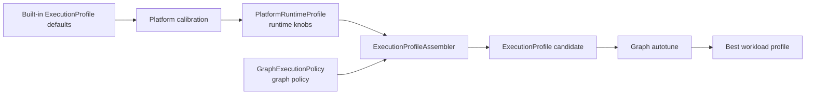
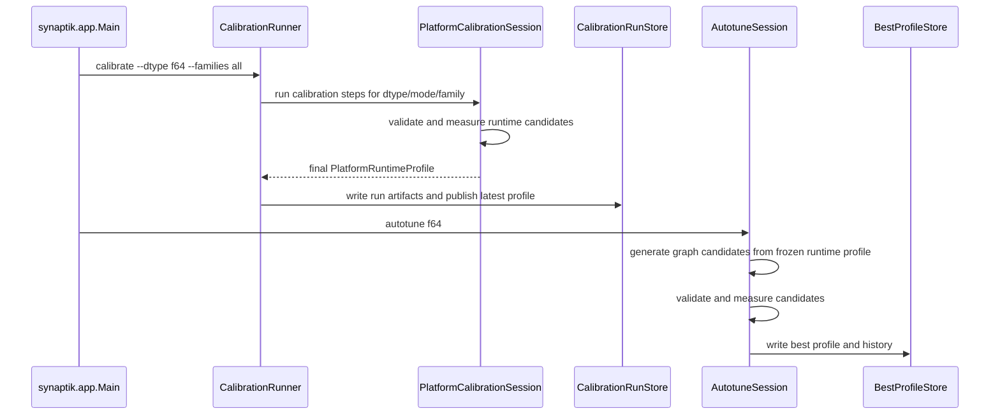

<!-- generated-by: gsd-doc-writer -->
# Calibration And Graph Autotune

Navigation: [Index](index.md) | [Configuration](configuration.md) | [Testing](testing.md) | [Examples](examples.md) | [Graph Optimizer](graph-optimizer.md) | [Compute Flow](compute-flow.md)

This guide explains how Synaptik tunes runtime behavior for a hardware/JDK platform and how it explores graph policy variants for one workload.

## Table Of Contents

- [Core Distinction](#core-distinction)
- [Runtime And Graph Artifacts](#runtime-and-graph-artifacts)
- [End-To-End Flow](#end-to-end-flow)
- [CLI Entry Points](#cli-entry-points)
- [Presets](#presets)
- [Measurement Policy](#measurement-policy)
- [Validation Policy](#validation-policy)
- [Calibration Families](#calibration-families)
- [Graph Autotune Parameters](#graph-autotune-parameters)
- [Search Strategy](#search-strategy)
- [Persistence And History Layout](#persistence-and-history-layout)
- [Progress Rendering](#progress-rendering)
- [Reports](#reports)
- [Worked Example: Matmul Calibration](#worked-example-matmul-calibration)
- [Worked Example: Graph Autotune Research Run](#worked-example-graph-autotune-research-run)
- [Failure Modes](#failure-modes)
- [Source Map](#source-map)

## Core Distinction

Calibration and graph autotune solve different problems.

| Workflow | Tunes | Scope | Output | Production role |
|---|---|---|---|---|
| Platform calibration | Platform/runtime/hardware-sensitive `PlatformRuntimeProfile` knobs | Per platform, dtype, execution mode, and calibration family | Latest platform runtime profile plus per-family run artifacts | Provides reusable runtime defaults for later profile assembly |
| Graph autotune | `GraphExecutionPolicy` only | One concrete workload with a frozen runtime profile | Best `ExecutionProfile` and append-only history | Standard mode persists production-eligible `graphPolicy=current`; research mode is explicit opt-in |

Calibration answers questions such as "what matmul tile, BLAS threshold, fused width, or scheduler chunking policy is best on this machine for `f64` forward-backward?" Graph autotune answers "which graph policy candidate should this workload use when the runtime defaults are already fixed?"



The important boundary is that the runtime executes only real `ExecutionProfile` objects. Calibration mutates runtime defaults, graph autotune mutates or reuses graph policy, and `ExecutionProfileAssembler` combines those layers into runnable candidates.

## Runtime And Graph Artifacts

`PlatformRuntimeProfile` is the machine-oriented artifact. It contains runtime families such as matmul, conv2d dispatch, fused dispatch, elementwise dispatch, reduction, scheduler, materialization, numerics, and accelerator selection.

`GraphExecutionPolicy` is the graph-side layer. In the current code it wraps `OptimizerConfig` and carries optimizer rewrite, CSE, memory, fuse, and related graph settings.

`ExecutionProfile` is the runnable artifact passed to compile, prepare, and execute. Calibration and autotune both end up measuring candidates by compiling a fresh workload root, preparing it with the candidate runtime config, and executing it through the normal backend path.

## End-To-End Flow



The fresh-graph rule matters for both workflows: each candidate measurement instantiates a fresh `WorkloadInstance`. The workload layer treats graph construction, validation target, validation reference, and metadata as one reproducible contract.

## CLI Entry Points

The main application entry point is `src/main/java/synaptik/app/Main.java`.

```bash
./gradlew run --args="full <f64|f32|bf16>"
./gradlew run --args="calibrate --dtype <f64|f32|bf16> --family <family-id>"
./gradlew run --args="calibrate --dtype <f64|f32|bf16> --families all"
./gradlew run --args="calibrate --dtypes all --families all"
./gradlew run --args="autotune <f64|f32|bf16>"
./gradlew run --args="benchmark-winner <f64|f32|bf16>"
./gradlew run --args="benchmark-graph-space <f64|f32|bf16>"
```

Calibration-specific options are parsed by `CalibrationCommand`:

| Option | Values | Meaning |
|---|---|---|
| `--dtype` | `f64`, `f32`, `bf16` | Calibrate one dtype. |
| `--dtypes` | `all` | Calibrate `FLOAT64`, `FLOAT32`, and `BFLOAT16`. |
| `--family` | Any registry CLI name such as `matmul` | Calibrate one family. |
| `--families` | `all` | Run the full registry suite. |
| `--preset` | `quick`, `balanced`, `thorough` | Select measurement, validation, search, and report defaults. |
| `--mode` | `forward`, `forward-backward`, `forward_backward`, `training` | Select execution mode. Default is `FORWARD_BACKWARD`. |
| `--measurement` | `warmup:measure:repeats` | Override measurement loop counts while keeping the preset's trace flags. |
| `--color` | `auto`, `always`, `never` | Control terminal color. |
| `--progress` | `live`, `lines`, `quiet` | Control calibration progress rendering. |
| `--output-root` | Path | Root for calibration artifacts. Default is `profiles`. |
| `--include-accelerators` | Flag | Adds accelerator opt-in families such as `metal-selection`. |

Production CLI graph autotune uses `GraphAutotuneMode.STANDARD`. Research graph policy candidates exist in code but are not exposed as a dedicated CLI mode in `Main.java`. Needs verification before documenting a stable command-line interface for research graph autotune.

## Presets

`TuningPreset` exposes `QUICK`, `BALANCED`, and `THOROUGH`.

| Preset | Measurement | Validation | Search policy | Calibration pass count |
|---|---|---|---|---|
| `QUICK` | `warmup=0`, `measure=3`, `repeats=1`, compile/prepare/cold/steady measured, no step trace | dtype-aware quick tolerances, no gradient match | `maxCandidates=16`, `beamWidth=2`, `maxRounds=2`, pruning enabled | 1 |
| `BALANCED` | `warmup=4`, `measure=8`, `repeats=3`, compile/prepare/cold/steady measured, no step trace | dtype-aware balanced tolerances, no gradient match | `maxCandidates=32`, `beamWidth=4`, `maxRounds=4`, pruning enabled | 2 for all-family calibration, 1 for single-family calibration |
| `THOROUGH` | `warmup=4`, `measure=16`, `repeats=5`, compile/prepare/cold/steady measured, step trace captured | dtype-aware thorough tolerances, gradient match required | `maxCandidates=96`, `beamWidth=8`, `maxRounds=6`, pruning enabled | 2 for all-family calibration, 1 for single-family calibration |

Calibration uses the preset's benchmark measurement and validation policies. Graph autotune uses the preset's autotune measurement and validation policies. In `Main.runAutotune`, the ABC graph autotune command uses `TuningPreset.BALANCED` and overrides search to `SearchPolicy(1, 1, 1, false)` because standard graph autotune has one production candidate.

## Measurement Policy

`DefaultMeasurementEngine` measures a candidate by:

1. Compiling the workload root with `candidate.profile().optimizer()`.
2. Preparing the compiled graph with `candidate.profile().runtime()`.
3. Optionally running a cold traced execution.
4. Running warmup iterations.
5. Measuring `repeats` samples, each averaging `measureIters` executions.
6. Reporting mean, median, and p90 steady-state milliseconds.

The engine can include compile trace, prepare trace, cold run trace, steady-state timing, and optional step trace depending on `MeasurementPolicy`.

The score used by calibration is not necessarily the raw median from one workload. Family steps choose either:

| Score policy | Meaning | Used by |
|---|---|---|
| `averageMedianMs` | Average median milliseconds across all workloads in the step; invalid if any workload fails. | Scheduler, matmul Java, matmul BLAS dispatch, fused dispatch, fused width families, elementwise dispatch, reduction, materialization |
| `weightedGeometricMeanWithWorstBucketPenalty(0.25)` | Geometric mean plus a worst-bucket penalty; invalid if any workload fails. | Matmul wide BLAS heuristic, attention matmul, conv2d GEMM dispatch, attention thresholds, Metal selection |

## Validation Policy

Validation is handled by `DefaultValidationEngine`. If validation is disabled or a workload has `ValidationReference.none()`, validation is skipped. Otherwise, the engine compares the candidate output against either a snapshot reference or a baseline-profile reference.

| Profile | `FLOAT64` tolerance | `FLOAT32` tolerance | `BFLOAT16` tolerance | Gradient requirement |
|---|---:|---:|---:|---|
| Quick dtype-aware | `1e-8` abs/rel | `1e-5` abs/rel | `5e-3` abs/rel | false |
| Balanced dtype-aware | `1e-9` abs/rel | `3e-6` abs/rel | `2e-3` abs/rel | false |
| Thorough dtype-aware | `1e-9` abs/rel | `5e-7` abs/rel | `1e-3` abs/rel | true |

Many calibration workloads currently use `ValidationReference.none()`, so they still pass through validation events but return `skipped`. Workloads with snapshot or baseline references also validate shapes, dtype, numeric max absolute/relative error, and gradients when requested.

## Calibration Families

`CalibrationFamilyRegistry` is the source of truth for public family ids, CLI names, dtype support, accelerator opt-in state, and owned knobs. The standard suite order is deterministic:

1. `scheduler`
2. `matmul`
3. `attention-matmul`
4. `conv2d-gemm-dispatch`
5. `elementwise-dispatch`
6. `fused-dispatch`
7. `fused-cheap-contiguous-width`
8. `fused-cheap-strided-width`
9. `fused-noncheap-contiguous-width`
10. `fused-noncheap-strided-width`
11. `reduction`
12. `attention-thresholds`
13. `materialization`

`metal-selection` is added only by `fullSuite(true)` or CLI `--include-accelerators`.

### Family Summary

| Family id | CLI name | Supported dtypes | Accelerator opt-in | Meaning |
|---|---|---|---|---|
| `SCHEDULER` | `scheduler` | `FLOAT64`, `FLOAT32`, `BFLOAT16` | No | Tunes CPU chunking targets and minimum chunk sizes. |
| `MATMUL` | `matmul` | `FLOAT64`, `FLOAT32`, `BFLOAT16` | No | Tunes Java matmul microkernels/tiles/parallel threshold plus BLAS provider and shape dispatch thresholds. |
| `ATTENTION_MATMUL` | `attention-matmul` | `FLOAT64`, `FLOAT32`, `BFLOAT16` | No | Tunes attention-specific matmul tiles and microkernel. |
| `CONV2D_GEMM_DISPATCH` | `conv2d-gemm-dispatch` | `FLOAT64`, `FLOAT32`, `BFLOAT16` | No | Tunes lowered conv2d GEMM dispatch to Java or BLAS and dtype-specific shape heuristics. |
| `ELEMENTWISE_DISPATCH` | `elementwise-dispatch` | `FLOAT64`, `FLOAT32`, `BFLOAT16` | No | Tunes non-fused elementwise vector and parallel thresholds. |
| `FUSED_DISPATCH` | `fused-dispatch` | `FLOAT64`, `FLOAT32`, `BFLOAT16` | No | Tunes fused cheap/transcendental vector and parallel thresholds. |
| `FUSED_CHEAP_CONTIGUOUS_WIDTH` | `fused-cheap-contiguous-width` | `FLOAT64`, `FLOAT32`, `BFLOAT16` | No | Tunes ASM vector width for cheap contiguous fused nodes. |
| `FUSED_CHEAP_STRIDED_WIDTH` | `fused-cheap-strided-width` | `FLOAT64`, `FLOAT32`, `BFLOAT16` | No | Tunes ASM vector width for cheap strided fused nodes. |
| `FUSED_NON_CHEAP_CONTIGUOUS_WIDTH` | `fused-noncheap-contiguous-width` | `FLOAT64`, `FLOAT32`, `BFLOAT16` | No | Tunes ASM vector width for non-cheap contiguous fused nodes. |
| `FUSED_NON_CHEAP_STRIDED_WIDTH` | `fused-noncheap-strided-width` | `FLOAT64`, `FLOAT32`, `BFLOAT16` | No | Tunes ASM vector width for non-cheap strided fused nodes. |
| `REDUCTION` | `reduction` | `FLOAT64`, `FLOAT32`, `BFLOAT16` | No | Tunes generic reduction vector and parallel thresholds. |
| `ATTENTION_THRESHOLDS` | `attention-thresholds` | `FLOAT64`, `FLOAT32`, `BFLOAT16` | No | Tunes attention vector and parallel thresholds. |
| `MATERIALIZATION` | `materialization` | `FLOAT64`, `FLOAT32`, `BFLOAT16` | No | Tunes contiguous, dtype-specific cheap, and `where` materialization thresholds. |
| `METAL_SELECTION` | `metal-selection` | `FLOAT32` only | Yes | Tunes Metal accelerator enablement and minimum estimated work. Requires available Metal runtime. |

### Scheduler

Owned knobs:

- `cpu.lowCostTargetChunksPerWorker`
- `cpu.mediumCostTargetChunksPerWorker`
- `cpu.highCostTargetChunksPerWorker`
- `cpu.minScalarChunkSize`
- `cpu.minVectorChunkSize`
- `cpu.minReductionChunkSize`
- `cpu.commonPoolLowCostMaxWorkPerWorker`

Candidate values are generated around the current seed profile, not from a fixed universal list:

| Knob group | Candidate rule |
|---|---|
| Low-cost target chunks per worker | Current value plus one lower and one higher, clamped to `1..8`. |
| Medium-cost target chunks per worker | Current value plus one lower and one higher, clamped to `1..4`. |
| High-cost target chunks per worker | Current value plus one lower and one higher, clamped to `1..2`. |
| Min scalar chunk size | Current value, half, and double, clamped to `512..8192`. |
| Min vector chunk size | Current value, half, and double, clamped to `1024..16384`. |
| Min reduction chunk size | Current value, half, and double, clamped to `2048..32768`. |
| Common-pool low-cost max work per worker | Current value, half, and double, clamped to `4096..65536`. |

Default training seed values come from `CpuKernelConfig.defaultsTraining()`: low/medium/high targets `4/2/1`, min scalar/vector/reduction chunks `4096/8192/16384`, and common-pool limit `16384`.

Workloads:

- `schedulerCheapParallel(<name>_workload_medium, 65536)`
- `schedulerCheapParallel(<name>_workload_large, 262144)`

### Matmul

Owned knobs:

- `runtime.blas.provider`
- `runtime.blas.matmulMinWork`
- `runtime.blas.f32RequireMgeK`
- `runtime.blas.f32MaxNOverK`
- `runtime.blas.f32WideRequireMgeK`
- `runtime.blas.f32WideMaxNOverK`
- `cpu.matMulParallelMinSize`
- `cpu.matMulTileM`
- `cpu.matMulTileN`
- `cpu.matMulTileK`
- `cpu.matMulMicroKernel`

The suite creates three steps for the same `MATMUL` family.

| Step | Candidate names | Candidate values |
|---|---|---|
| Java matmul | `base+matmulMicroKernel=...+matmulTiles=...+matmulParallel=...` | Microkernels by dtype; tiles by dtype; parallel thresholds `100000`, `500000`, `2000000`. |
| BLAS dispatch | `base+blasProvider=...+matmulShape=...` | Providers `NONE`, `OPENBLAS_FFM`; BLAS min work `1000000`, `2000000`, `4000000`; shape heuristic `requireMgeK` `true/false`; `maxNOverK` `1.5`, `2.0`, `3.0`, `4.0`, `6.0`. |
| Wide BLAS dispatch | `base+matmulWideShape=...` | Wide `requireMgeK` `true/false`; wide `maxNOverK`: `4.0`, `6.0`, `8.0` for `FLOAT64`/`FLOAT32`, and `4.0`, `6.0`, `8.0`, `12.0` for `BFLOAT16`. |

Microkernel candidates:

| DType | Candidates |
|---|---|
| `FLOAT64` | `F64_2X1`, `F64_4X1`, `F64_2X2` |
| `FLOAT32` | `F32_2X4`, `F32_2X8`, `F32_4X2`, `F32_4X4` |
| `BFLOAT16` | `BF16_2X4`, `BF16_4X2`, `BF16_4X4` |

Tile candidates:

| DType | Candidates |
|---|---|
| `FLOAT64` | `16x64x32`, `32x64x32`, `32x64x64`, `32x128x64` |
| `FLOAT32` | `32x64x64`, `32x128x64`, `64x128x64`, `64x128x128`, `64x256x128` |
| `BFLOAT16` | `16x64x64`, `16x128x64`, `32x64x64`, `32x128x64`, `64x128x64` |

Workloads:

- Java step: square matmul `128`, square matmul `256`, wide projection `256x256x2048`, tall projection `2048x256x256`, batched attention-like matmul `8x128x64x64`.
- BLAS dispatch step: square matmul `64`, square matmul `128`, tall-skinny `256x64x64`, batched attention-like `8x128x64x64`.
- Wide BLAS step: wide ratios `128x128x768`, `128x128x1024`, `256x256x2048`, `128x128x1536`.

`runtime.blas.threads` exists in the runtime config surface but `BlasConfig` canonicalizes it to `0`, meaning provider-managed auto behavior. It is not an active calibration knob.

### Attention Matmul

Owned knobs:

- `cpu.attentionMatMulTileM`
- `cpu.attentionMatMulTileN`
- `cpu.attentionMatMulTileK`
- `cpu.attentionMatMulMicroKernel`

Candidate names:

- `base+attentionMatmulMicroKernel=<kernel>+attentionMatmulTiles=<MxNxK>`

Candidate values:

| DType | Microkernels | Tile candidates |
|---|---|---|
| `FLOAT64` | `F64_2X1`, `F64_4X1`, `F64_2X2` | `16x64x32`, `32x64x32`, `32x128x64` |
| `FLOAT32` | `F32_2X4`, `F32_2X8`, `F32_4X2`, `F32_4X4` | `32x64x64`, `32x128x64`, `64x128x64`, `64x128x128`, `64x256x128` |
| `BFLOAT16` | `BF16_2X4`, `BF16_4X2`, `BF16_4X4` | Default CPU matmul tile `32x64x64` |

Workloads:

- `maskedAttention(<name>_workload_medium, 4, 8, 64, 32, 32)`
- `maskedAttention(<name>_workload_large, 4, 8, 128, 32, 32)`

### Conv2d GEMM Dispatch

Owned knobs:

- `runtime.conv2d.blasProvider`
- `runtime.conv2d.f64MinWork`
- `runtime.conv2d.f32MinWork`
- `runtime.conv2d.f32RequireMgeK`
- `runtime.conv2d.f32MaxNOverK`
- `runtime.conv2d.bf16MinWork`
- `runtime.conv2d.bf16RequireMgeK`
- `runtime.conv2d.bf16MaxNOverK`

Candidate names:

- `base+conv2dBlasProvider=NONE`
- `base+conv2dBlasProvider=OPENBLAS_FFM:minWork=<value>`
- `base+conv2dBlasProvider=...+conv2dShape=<requireMgeK>/<maxNOverK>` for `FLOAT32` and `BFLOAT16`

Candidate values:

| DType | Provider candidates | Min-work candidates | Shape heuristic candidates |
|---|---|---|---|
| `FLOAT64` | `NONE`, `OPENBLAS_FFM` | `50000`, `100000`, `250000`, `1000000`, `4000000` for `runtime.conv2d.f64MinWork` | None |
| `FLOAT32` | `NONE`, `OPENBLAS_FFM` | `50000`, `100000`, `250000`, `1000000`, `4000000` for `runtime.conv2d.f32MinWork` | `requireMgeK` `true/false`; `maxNOverK` `1.5`, `2.0`, `3.0`, `4.0`, `6.0`, `100.0` |
| `BFLOAT16` | `NONE`, `OPENBLAS_FFM` | `50000`, `100000`, `250000`, `1000000`, `4000000` for `runtime.conv2d.bf16MinWork` | `requireMgeK` `true/false`; `maxNOverK` `1.5`, `2.0`, `3.0`, `4.0`, `6.0`, `100.0` |

Workloads:

- Pointwise projection: `4x128x64x8x8`, `4x128x128x8x8`, `4x128x256x8x8`, `1x128x128x16x16`, `2x128x256x56x56`.
- ResNet-style 3x3: `8x64x64x8x8`, `8x64x128x8x8`, `2x64x128x28x28`.

This family tunes runtime dispatch for lowered conv2d GEMM execution. It does not decide whether semantic conv2d is lowered in the optimizer.

### Elementwise Dispatch

Owned knobs:

- `cpu.cheapVectorMinSize`
- `cpu.transcendentalVectorMinSize`
- `cpu.cheapParallelMinSize`
- `cpu.transcendentalParallelMinSize`

Candidate names:

- `base+elementwiseDispatch=<cheapVec>/<transVec>/<cheapPar>/<transPar>`

Candidate values:

| Knob | Candidates |
|---|---|
| `cpu.cheapVectorMinSize` | `128`, `256`, `512`, `1024`, `2048` |
| `cpu.transcendentalVectorMinSize` | `32`, `64`, `128`, `256`, `512` |
| `cpu.cheapParallelMinSize` | `8192`, `16384`, `32768`, `65536` |
| `cpu.transcendentalParallelMinSize` | `2048`, `4096`, `8192`, `16384` |

Workloads:

- `schedulerCheapParallel(<name>_workload_medium, 65536)`
- `schedulerCheapParallel(<name>_workload_large, 262144)`

### Fused Dispatch

Owned knobs:

- `cpu.fusedCheapVectorMinSize`
- `cpu.fusedTranscendentalVectorMinSize`
- `cpu.fusedCheapParallelMinSize`
- `cpu.fusedTranscendentalParallelMinSize`

Candidate names:

- `base+fusedDispatch=<cheapVec>/<transVec>/<cheapPar>/<transPar>`

Candidate values:

| Knob | Candidates |
|---|---|
| `cpu.fusedCheapVectorMinSize` | `64`, `128`, `256`, `512`, `1024` |
| `cpu.fusedTranscendentalVectorMinSize` | `16`, `32`, `64`, `128`, `256` |
| `cpu.fusedCheapParallelMinSize` | `4096`, `8192`, `16384`, `32768` |
| `cpu.fusedTranscendentalParallelMinSize` | `1024`, `2048`, `4096`, `8192` |

Workloads:

- `fusedCheapElementwise(<name>_workload_cheap, 65536)`
- `fusedTranscendental(<name>_workload_trans, 65536)`

### Fused Width Families

The four fused width families have one owned knob each.

| Family | Owned knob | Candidate name pattern | Workloads |
|---|---|---|---|
| `FUSED_CHEAP_CONTIGUOUS_WIDTH` | `cpu.fusedCheapContiguousAsmVectorWidth` | `base+fusedAsmVectorWidth[cheap-contiguous]=<width>` | `fusedCheapElementwise(<name>_workload, 65536)` |
| `FUSED_CHEAP_STRIDED_WIDTH` | `cpu.fusedCheapStridedAsmVectorWidth` | `base+fusedAsmVectorWidth[cheap-strided]=<width>` | `fusedCheapStridedElementwise(<name>_workload, 256, 256)` |
| `FUSED_NON_CHEAP_CONTIGUOUS_WIDTH` | `cpu.fusedNonCheapContiguousAsmVectorWidth` | `base+fusedAsmVectorWidth[noncheap-contiguous]=<width>` | `fusedTranscendental(<name>_workload, 65536)` |
| `FUSED_NON_CHEAP_STRIDED_WIDTH` | `cpu.fusedNonCheapStridedAsmVectorWidth` | `base+fusedAsmVectorWidth[noncheap-strided]=<width>` | `fusedTranscendentalStrided(<name>_transcendental_workload, 256, 256)` and `fusedAffineRationalStrided(<name>_affine_rational_workload, 256, 2048)` |

Candidate widths are generated from JDK Vector API preferred species length:

- Always include `1`.
- Include `2` if preferred lane count is at least `2`.
- Include `4` if preferred lane count is at least `4`.
- Include `8` if preferred lane count is at least `8`.
- Additionally include `8` for cheap-contiguous `FLOAT32` and `BFLOAT16`.

Needs verification: the exact width list is runtime/JDK/CPU dependent because it uses `DoubleVector.SPECIES_PREFERRED.length()` or `FloatVector.SPECIES_PREFERRED.length()`. Existing tuning docs describe the common current set as `FLOAT64: 1, 2, 4` and `FLOAT32`/`BFLOAT16: 1, 2, 4, 8`, but the generator can include `8` for `FLOAT64` on platforms where the preferred double species has at least eight lanes.

### Reduction

Owned knobs:

- `cpu.reductionVectorMinSize`
- `cpu.reductionParallelMinSize`

Candidate names:

- `base+reductionThresholds=<vector>/<parallel>`

Candidate values:

| Knob | Candidates |
|---|---|
| `cpu.reductionVectorMinSize` | `512`, `2048`, `8192`, `16384` |
| `cpu.reductionParallelMinSize` | `8192`, `16384`, `32768`, `65536` |

Workloads:

- `reductionSum(<name>_workload_medium, 65536)`
- `reductionSum(<name>_workload_large, 262144)`

Needs verification: `cpu.sumAccuracyMode` exists in `ReductionPlatformProfile`, but `CalibrationFamilyRegistry` does not list it as owned by `REDUCTION`, and `PlatformCalibrationDefaults.reductionStep` does not generate sum-accuracy candidates.

### Attention Thresholds

Owned knobs:

- `cpu.attentionVectorMinSize`
- `cpu.attentionParallelMinSize`

Candidate names:

- `base+attentionThresholds=<vector>/<parallel>`

Candidate values:

| Knob | Candidates |
|---|---|
| `cpu.attentionVectorMinSize` | `512`, `2048`, `8192`, `16384` |
| `cpu.attentionParallelMinSize` | `2048`, `8192`, `16384`, `32768` |

Workloads:

- `maskedAttention(<name>_workload_medium, 4, 8, 64, 32, 32)`
- `maskedAttention(<name>_workload_large, 4, 8, 128, 32, 32)`

### Materialization

Owned knobs:

- `cpu.contiguousMaterializeThreshold`
- `cpu.cheapF64MaterializeThreshold`
- `cpu.cheapF32MaterializeThreshold`
- `cpu.cheapBF16MaterializeThreshold`
- `cpu.whereMaterializeThreshold`

The suite creates two steps for the same `MATERIALIZATION` family.

| Step | Candidate name pattern | Candidate values |
|---|---|---|
| Strided elementwise materialization | `base+contiguous-materialization=<threshold>+materialization=<threshold>` | For contiguous and dtype-specific cheap threshold: current seed value clamped to `4096..1048576`, half, double, plus `262144`, `524288`, `1048576`. |
| `where` materialization | `base+where-materialization=<threshold>` | For `cpu.whereMaterializeThreshold`: same threshold generation rule. |

Workloads:

- Strided elementwise: `128x128`, `256x256`, `512x1024`, `1024x1024`.
- Strided `where`: `128x128`, `256x256`, `512x1024`, `1024x1024`.

The dtype-specific cheap threshold written by `materializationThresholds` depends on the runtime profile dtype: `FLOAT64` writes `cpu.cheapF64MaterializeThreshold`, `FLOAT32` writes `cpu.cheapF32MaterializeThreshold`, and `BFLOAT16` writes `cpu.cheapBF16MaterializeThreshold`.

### Metal Selection

Owned knobs:

- `runtime.accelerator.metal.enabled`
- `runtime.accelerator.metal.requireRuntimeAvailability`
- `runtime.accelerator.metal.minimumEstimatedWork`

Supported dtype is `FLOAT32` only. The family is not in the standard suite and requires `--include-accelerators`. `CalibrationSuite` also checks `AcceleratorRuntimeAvailability.isAvailable(ComputeBackend.GPU_METAL)` before building the step.

Candidate names:

- `base+metalSelection=<enabled>/<requireRuntimeAvailability>/<minimumEstimatedWork>`

Candidate values:

| Knob | Candidates |
|---|---|
| `runtime.accelerator.metal.enabled` | `true`, `false` |
| `runtime.accelerator.metal.requireRuntimeAvailability` | `false`, `true` |
| `runtime.accelerator.metal.minimumEstimatedWork` | `0`, `8000000`, `64000000`, `256000000` |

Workloads:

- `appleMetalMatmulAddTanh(<name>_workload_medium, 128, 256, 256)`
- `appleMetalMatmulAddTanh(<name>_workload_large, 512, 1024, 1024)`

Needs verification: Metal runtime availability depends on the local platform and native bridge setup, so a repository-only read cannot guarantee this family is runnable on a given machine.

## Graph Autotune Parameters

`GraphAutotuneParameter` exposes four graph-side parameter groups. `GraphPolicyMutators` defines standard and research candidate names.

| Parameter | Mode | Candidate names | What changes |
|---|---|---|---|
| `CURRENT_GRAPH_POLICY` | Standard | `graphPolicy=current` | Reuses the supplied `GraphExecutionPolicy` without mutating optimizer config. Runtime is frozen from the supplied `PlatformRuntimeProfile`. |
| `CSE_STRICT_SAFETY` | Research | `cse=strict`, `cse=aggressive` | Replaces CSE config with `CseConfig.strictDefaults()` (`strictSafety=true`) or `CseConfig.aggressiveDefaults()` (`strictSafety=false`). |
| `PIECEWISE_LOWERING` | Research | `piecewise=current`, `piecewise=off`, `piecewise=canonical` | Keeps current policy, disables piecewise lowering with `PiecewiseLoweringConfig.defaults()` (`canonicalSigmoid=false`, `reluLikeWhere=false`, `clampLikeWhere=false`), or enables aggressive piecewise lowering with all three booleans true. |
| `MEMORY_LIFETIME` | Research | `memory=current`, `memory=phase-isolated`, `memory=cross-phase-lifetime` | Keeps current memory policy, uses separated forward/backward pools with no cross-phase reuse, or allows cross-phase lifetime reuse by setting `separateForwardBackwardPools=false` and `allowCrossPhaseReuse=true`. |

Standard mode generates one production-eligible `CandidateKind.GRAPH_STANDARD` candidate. Research mode generates graph research candidates that are marked not production-eligible. Tests assert that research graph autotune does not include stage-order, conv2d-lowering, or partition-scoring candidates.

## Search Strategy

Search is intentionally separate from measurement and validation. It selects which candidates to evaluate, then `DefaultAutotuneSession` validates and measures them.

Default strategy selection:

| Candidate space shape | Strategy |
|---|---|
| One generated candidate | `SingleCandidateSearchStrategy` |
| Multiple candidates, not refinable | `ExhaustiveSearchStrategy` |
| Refinable and candidate count is large enough | `BranchAndBoundSearchStrategy` |
| Refinable and candidate count exceeds beam width | `TreeBeamSearchStrategy` |
| Otherwise | `ExhaustiveSearchStrategy` |

If persistence is enabled, the selected strategy is wrapped by `HistoryAwareSearchStrategy`. The wrapper reorders candidates using matching best-profile and history records for the current hardware/workload, ignores non-production-eligible history entries, and can skip previously invalid candidates when pruning is allowed.

Search policies carry budget only:

- `maxCandidates`
- `beamWidth`
- `maxRounds`
- `allowPruning`

Calibration steps do not use this graph-autotune strategy selector. Calibration candidate spaces are expanded by runtime mutators, then each step benchmarks its generated candidates across that step's workload suite.

## Persistence And History Layout

### Platform Calibration

Current calibration writes schema-v2 artifacts under:

```text
profiles/
  platform/
    <platform-id>/
      calibration/
        schema-v2/
          manifest.json
          runs/
            <run-id>/
              manifest.json
              <dtype>/
                <mode>/
                  <family-id>/
                    result.json
                    result.txt
                    selected-profile.json
                    candidates.jsonl
          history/
            <dtype>/
              <mode>/
                <family-id>.jsonl
          latest/
            <dtype>/
              <mode>/
                profile.json
                manifest.json
```

`CalibrationRunner` publishes only the latest profile to the runtime loading path after the run manifest is completed. Reports and history are diagnostic. Runtime loading uses:

```text
profiles/platform/<platform-id>/calibration/schema-v2/latest/<dtype>/<mode>/profile.json
```

The platform id is derived from `HardwareFingerprint` as:

```text
<normalized-os>-<normalized-arch>-<normalized-vendor>-<cores>c
```

### Graph Autotune

The ABC CLI stores graph autotune artifacts under:

```text
profiles/platform/<platform-id>/tuning/abc/<dtype>-best-profile.json
profiles/platform/<platform-id>/tuning/abc/<dtype>-history.jsonl
```

Best-profile records include score, hardware key, workload key, autotune kind, graph autotune mode, candidate kind, runtime profile id, production eligibility, candidate metadata, and the full `ExecutionProfile`.

History is append-only JSONL. Each entry includes fingerprint, candidate name, validity, median/mean/score, failure reason, summary, timestamp, hardware/workload keys, candidate kind, runtime profile id, production eligibility, and candidate metadata.

## Progress Rendering

Calibration progress uses `PlatformCalibrationProgressEvent` phases:

- `STARTED`
- `FAMILY_STARTED`
- `WORKLOAD_STARTED`
- `CANDIDATE_VALIDATING`
- `CANDIDATE_INVALID`
- `CANDIDATE_MEASURING`
- `CANDIDATE_MEASURED`
- `CANDIDATE_FAILED`
- `CANDIDATE_SCORED`
- `FAMILY_COMPLETED`
- `COMPLETED`
- `FAILED`

`TerminalCalibrationProgressRenderer` renders an eight-line terminal panel with current phase, family position, workload position, candidate position, current best candidate, elapsed time, ETA for the current candidate set, ETA for total family progress, and message. `--progress lines` uses `LoggingPlatformCalibrationProgressListener`; `--progress quiet` uses a no-op listener.

Graph autotune progress uses `AutotuneProgressPhase`:

- `STARTED`
- `SEARCH_BATCH`
- `CANDIDATE_VALIDATING`
- `CANDIDATE_INVALID`
- `CANDIDATE_MEASURING`
- `CANDIDATE_MEASURED`
- `CANDIDATE_FAILED`
- `ROUND_COMPLETED`
- `COMPLETED`

`LoggingAutotuneProgressListener` prints line-oriented events for lifecycle transitions, invalid/failed candidates, and measured candidates according to its throttle settings. The production CLI currently passes `null`, so graph autotune progress defaults to no-op in `GraphAutotuneRequest`.

## Reports

Calibration run storage writes both text and JSON reports for each saved family step:

- `result.txt` from `TextPlatformCalibrationResultRenderer`
- `result.json` from `JsonPlatformCalibrationResultRenderer`
- `selected-profile.json` for the step winner's runtime profile
- `candidates.jsonl` with candidate id, validity, and score

Autotune report renderers are available in code:

- `TextTuningResultRenderer`
- `JsonTuningResultRenderer`
- `TextTuningResultDiffRenderer`
- `JsonTuningResultDiffRenderer`

The ABC CLI prints the text tuning result to stdout and writes best-profile/history artifacts through the stores. It does not write a separate tuning report file in `Main.runAutotune`.

Benchmark report renderers are separate:

- `TextBenchmarkReportRenderer`
- `JsonBenchmarkReportRenderer`
- suite-level text/json renderers

Search tree-capable strategies can expose tree reports through `TextSearchTreeReportRenderer` and `JsonSearchTreeReportRenderer`.

## Worked Example: Matmul Calibration

Goal: tune the `MATMUL` family for `FLOAT64` forward-backward execution on the current platform.

Command:

```bash
./gradlew run --args="calibrate --dtype f64 --family matmul --preset balanced --mode forward-backward"
```

Plan shape:

- DType: `FLOAT64`
- Mode: `FORWARD_BACKWARD`
- Scope: single family
- Passes: `1`
- Step names:
  - `calib-f64-matmul-p1-java`
  - `calib-f64-matmul-p1-blas`
  - `calib-f64-matmul-p1-blas-wide`

The Java matmul step evaluates combinations of:

- `cpu.matMulMicroKernel`: `F64_2X1`, `F64_4X1`, `F64_2X2`
- `cpu.matMulTileM/N/K`: `16x64x32`, `32x64x32`, `32x64x64`, `32x128x64`
- `cpu.matMulParallelMinSize`: `100000`, `500000`, `2000000`

Example candidate names include:

```text
base+matmulMicroKernel=F64_2X1+matmulTiles=16x64x32+matmulParallel=100000
base+matmulMicroKernel=F64_4X1+matmulTiles=32x64x64+matmulParallel=500000
base+matmulMicroKernel=F64_2X2+matmulTiles=32x128x64+matmulParallel=2000000
```

The BLAS dispatch step evaluates:

- `runtime.blas.provider`: `NONE`, `OPENBLAS_FFM`
- `runtime.blas.matmulMinWork`: `1000000`, `2000000`, `4000000` when provider is `OPENBLAS_FFM`
- `runtime.blas.f32RequireMgeK`: `true`, `false`
- `runtime.blas.f32MaxNOverK`: `1.5`, `2.0`, `3.0`, `4.0`, `6.0`

Even in an `f64` run, the f32 shape heuristic fields are present in `MatmulPlatformProfile`; they are part of the owned knob set and candidate map for this step.

The wide BLAS step evaluates:

- `runtime.blas.f32WideRequireMgeK`: `true`, `false`
- `runtime.blas.f32WideMaxNOverK`: `4.0`, `6.0`, `8.0`

Expected artifact paths:

```text
profiles/platform/<platform-id>/calibration/schema-v2/runs/<run-id>/f64/forward-backward/matmul/result.json
profiles/platform/<platform-id>/calibration/schema-v2/runs/<run-id>/f64/forward-backward/matmul/result.txt
profiles/platform/<platform-id>/calibration/schema-v2/runs/<run-id>/f64/forward-backward/matmul/selected-profile.json
profiles/platform/<platform-id>/calibration/schema-v2/runs/<run-id>/f64/forward-backward/matmul/candidates.jsonl
profiles/platform/<platform-id>/calibration/schema-v2/history/f64/forward-backward/matmul.jsonl
profiles/platform/<platform-id>/calibration/schema-v2/latest/f64/forward-backward/profile.json
profiles/platform/<platform-id>/calibration/schema-v2/latest/f64/forward-backward/manifest.json
```

The `result.json` and `result.txt` files are overwritten for the `matmul` family path within the same run when the three matmul steps are saved, because the schema-v2 family path is keyed by family id rather than individual step name. The append-only history file still receives a `CalibrationRunRecord` per saved step. Needs verification before relying on per-step report files for multiple steps in the same family.

## Worked Example: Graph Autotune Research Run

Production CLI graph autotune for ABC uses standard mode:

```bash
./gradlew run --args="autotune f64"
```

That evaluates only:

```text
graphPolicy=current
```

A research run must currently be built programmatically because `Main.java` does not parse a research-mode autotune command. The important pieces are:

```java
var request = new GraphAutotuneRequest(
        StandardWorkloads.abcSequenceMatmulBlasBenchmark("abc_sequence_matmul_f64"),
        "abc-f64-graph-research",
        DataType.FLOAT64,
        ExecutionMode.FORWARD_BACKWARD,
        GraphExecutionPolicy.trainingDefaults(),
        runtimeProfile,
        GraphAutotuneMode.RESEARCH,
        TuningPreset.BALANCED.autotuneMeasurement(),
        TuningPreset.BALANCED.autotuneValidation(),
        new SearchPolicy(8, 4, 1, false),
        new PersistencePolicy(
                true,
                true,
                Path.of("profiles", "platform", platformId, "tuning", "abc-research", "f64-best-profile.json"),
                Path.of("profiles", "platform", platformId, "tuning", "abc-research", "f64-history.jsonl")
        ),
        LoggingAutotuneProgressListener.defaults()
);

var result = AutotuneSession.create(request.toAutotuneRequest()).run();
```

Candidate names generated in research mode:

```text
cse=strict
cse=aggressive
piecewise=current
piecewise=off
piecewise=canonical
memory=current
memory=phase-isolated
memory=cross-phase-lifetime
```

Expected artifact paths for the example:

```text
profiles/platform/<platform-id>/tuning/abc-research/f64-best-profile.json
profiles/platform/<platform-id>/tuning/abc-research/f64-history.jsonl
```

Expected metadata behavior:

- Candidate kind is `GRAPH_RESEARCH`.
- `productionEligible` is `false`.
- `graphParameter` is set to the parameter enum name such as `CSE_STRICT_SAFETY`.
- `runtimeFrozen` remains true because graph autotune receives an already calibrated `PlatformRuntimeProfile`.

Needs verification: if persistence is enabled, `DefaultAutotuneSession` can write a best-profile record for the winning research candidate even though the candidate is not production-eligible. Production best-profile resolution filters history by `productionEligible`, but direct loading of a research best-profile path is still possible if the caller points at that path intentionally.

## Failure Modes

| Failure | Where it comes from | Typical fix |
|---|---|---|
| Unknown calibration family | `CalibrationFamilyRegistry.parse` rejects names outside registry CLI names. | Use `CalibrationFamilyRegistry.supportedCliNames()` output or `--families all`. |
| Unsupported dtype | `CalibrationCommand` allows only `f64`, `f32`, and `bf16`; `metal-selection` supports only `FLOAT32`. | Select a supported dtype or omit accelerator family. |
| Metal unavailable | `CalibrationSuite` checks Metal runtime availability before creating `METAL_SELECTION`. | Run without `--include-accelerators` or configure a machine/runtime with Metal support. |
| Candidate changes an unowned knob | `CalibrationFamilyRegistry.validateCandidateChanges` rejects off-family knob assignments. | Fix the mutator or registry ownership before running the family. |
| Missing calibration profile before autotune | `Main.loadCalibrationProfile` expects latest schema-v2 profile under `profiles/platform/<platform-id>/calibration/schema-v2/latest/<dtype>/forward-backward/profile.json`. | Run calibration first for that dtype and mode. |
| Missing best profile before winner benchmark | `Main.loadWinnerProfile` expects `profiles/platform/<platform-id>/tuning/abc/<dtype>-best-profile.json`. | Run `autotune <dtype>` first. |
| Validation mismatch | `DefaultValidationEngine` detects dtype, shape, output, or gradient mismatch. | Inspect validation target/reference and candidate policy; use thorough mode only when gradients are expected. |
| Candidate exception during validation or measurement | Sessions catch exceptions and record candidate failure. | Check candidate runtime/profile compatibility and workload construction. |
| Search budget truncates research candidates | `ExhaustiveSearchStrategy` limits selection to `SearchPolicy.maxCandidates`. | Set `maxCandidates` at least to the generated candidate count for full research coverage. |
| Progress panel not redrawing | `TerminalCapabilities.detect` depends on terminal capabilities and progress/color mode. | Use `--progress lines` for plain logs or `--progress live --color always` when the terminal supports it. |

## Source Map

Key implementation files:

| Area | Files |
|---|---|
| CLI | `src/main/java/synaptik/app/Main.java`, `src/main/java/tuning/calibration/run/CalibrationCommand.java`, `src/main/java/tuning/calibration/run/CalibrationRunner.java` |
| Calibration registry and suite | `src/main/java/tuning/calibration/family/CalibrationFamilyRegistry.java`, `src/main/java/tuning/calibration/run/CalibrationSuite.java`, `src/main/java/tuning/calibration/PlatformCalibrationDefaults.java` |
| Runtime candidate generation | `src/main/java/tuning/calibration/runtime/PlatformRuntimeProfileGridCandidateSpace.java`, `src/main/java/tuning/calibration/runtime/PlatformRuntimeProfileMutators.java`, `src/main/java/tuning/calibration/runtime/RuntimeProfileCandidate.java` |
| Graph candidate generation | `src/main/java/tuning/candidate/graph/GraphAutotuneParameter.java`, `src/main/java/tuning/candidate/graph/GraphPolicyMutators.java`, `src/main/java/tuning/candidate/graph/GraphAutotuneCandidateSpace.java`, `src/main/java/tuning/candidate/graph/GraphPolicyCandidateAssembler.java` |
| Measurement and validation | `src/main/java/tuning/measure/DefaultMeasurementEngine.java`, `src/main/java/tuning/measure/MeasurementPolicy.java`, `src/main/java/tuning/validate/DefaultValidationEngine.java`, `src/main/java/tuning/validate/ValidationPolicy.java` |
| Search | `src/main/java/tuning/search/SearchStrategy.java`, `src/main/java/tuning/search/SearchPolicy.java`, `src/main/java/tuning/autotune/AutotuneDefaultStrategySelector.java`, `src/main/java/tuning/search/HistoryAwareSearchStrategy.java` |
| Persistence | `src/main/java/tuning/calibration/store/CalibrationArtifactLayout.java`, `src/main/java/tuning/calibration/store/CalibrationRunStore.java`, `src/main/java/tuning/store/JsonFileBestProfileStore.java`, `src/main/java/tuning/store/JsonFileTuningHistoryStore.java` |
| Progress and reports | `src/main/java/tuning/calibration/progress/TerminalCalibrationProgressRenderer.java`, `src/main/java/tuning/autotune/LoggingAutotuneProgressListener.java`, `src/main/java/tuning/calibration/report/*`, `src/main/java/tuning/autotune/report/*` |
| Workloads | `src/main/java/tuning/workload/CalibrationWorkloads.java`, `src/main/java/tuning/workload/StandardWorkloads.java` |

Relevant tests:

- `src/test/java/CalibrationFamilyRegistryTest.java`
- `src/test/java/CalibrationCandidateOwnershipTest.java`
- `src/test/java/GraphAutotuneCandidateSpaceTest.java`
- `src/test/java/CalibrationArtifactLayoutTest.java`
- `src/test/java/PlatformCalibrationSessionTest.java`
- `src/test/java/PlatformCalibrationProgressListenerTest.java`
- `src/test/java/AutotuneSessionTest.java`
- `src/test/java/AutotuneDefaultStrategySelectorTest.java`
- `src/test/java/SearchStrategiesTest.java`
