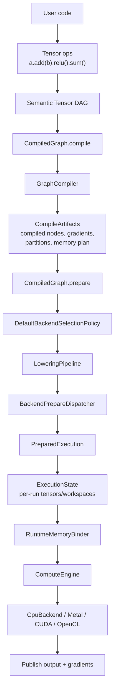
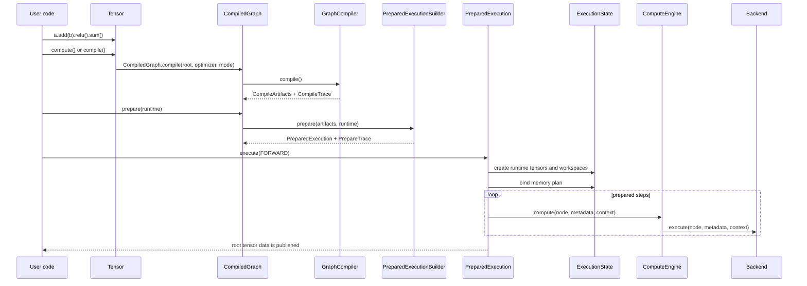
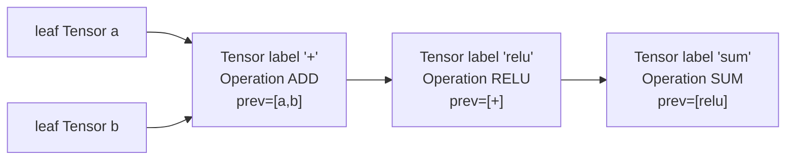
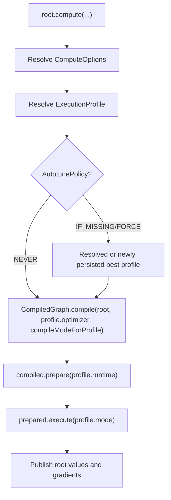
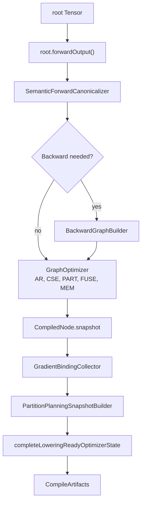
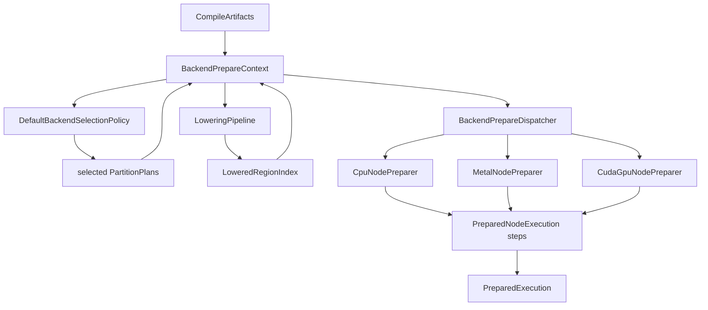
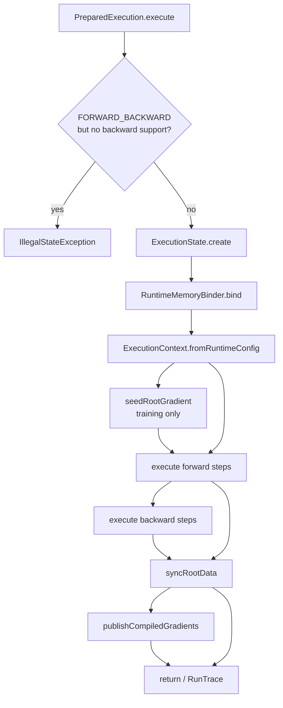
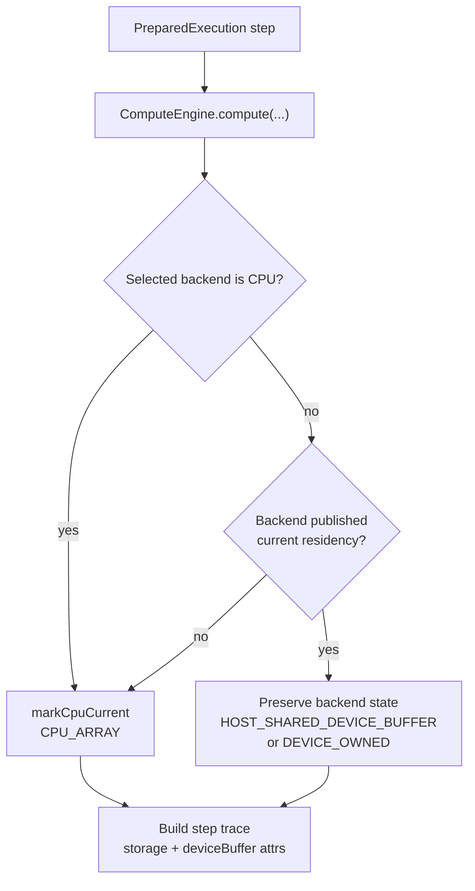

<!-- generated-by: gsd-doc-writer -->
# Compute Flow

Navigation: [Index](index.md#recommended-reading-paths) | [Architecture](architecture.md#execution-pipeline) | [Tensor API](tensor-api.md#compute-convenience-api) | [Graph Optimizer](graph-optimizer.md#how-the-stages-work-together) | [Native Bridges & BLAS](native-bridges-and-blas.md#matmul-dispatch-flow) | [Metal Backend](metal-backend.md#buffer-residency-and-materialization) | [Mechanisms](mechanisms.md#prepared-execution) | [Troubleshooting](troubleshooting.md#performance-regressions)

Chapters: [Lifecycle Map](#lifecycle-map) | [Primary Artifacts](#primary-artifacts) | [Artifact Lifetimes And Storage](#artifact-lifetimes-and-storage) | [Graph Building](#graph-building) | [Tensor Compute API](#tensor-compute-api) | [Compile](#compile) | [Prepare](#prepare) | [Execution](#execution) | [Runtime State And Tracking](#runtime-state-and-tracking) | [Worked Example](#worked-example) | [Reuse Rules](#reuse-rules) | [Traces](#traces) | [Failure Modes](#failure-modes) | [Source Map](#source-map)

This guide follows a tensor graph from user code through graph construction, compilation, backend preparation, execution, memory binding, and traces.

## Table Of Contents

- [Lifecycle Map](#lifecycle-map)
- [Primary Artifacts](#primary-artifacts)
- [Artifact Lifetimes And Storage](#artifact-lifetimes-and-storage)
- [Graph Building](#graph-building)
- [Tensor Compute API](#tensor-compute-api)
- [Compile](#compile)
- [Prepare](#prepare)
- [Execution](#execution)
- [Runtime State And Tracking](#runtime-state-and-tracking)
- [Worked Example](#worked-example)
- [Reuse Rules](#reuse-rules)
- [Traces](#traces)
- [Failure Modes](#failure-modes)
- [Source Map](#source-map)

## Lifecycle Map

The compute path is staged. `Tensor` builds a semantic graph, `CompiledGraph` freezes and optimizes it, `PreparedExecution` attaches runtime/backend metadata, and `ComputeEngine` dispatches prepared steps against per-run state.





## Primary Artifacts

| Artifact | Created by | Main files | Owns | Reusable? |
|---|---|---|---|---|
| Semantic tensor graph | `Tensor` constructors and `tensor.ops.*` builders | [`Tensor.java`](../src/main/java/tensor/Tensor.java), [`TensorPrimitiveBuilder.java`](../src/main/java/tensor/TensorPrimitiveBuilder.java) | Shape, dtype, storage/layout, operation descriptor, predecessor tensors, backward lambda | User-owned mutable graph |
| Compile artifact | `CompiledGraph.compile(...)` and `GraphCompiler.compile()` | [`CompiledGraph.java`](../src/main/java/graph/CompiledGraph.java), [`GraphCompiler.java`](../src/main/java/graph/compile/GraphCompiler.java), [`CompileArtifacts.java`](../src/main/java/graph/compile/CompileArtifacts.java) | Immutable `CompiledNode` snapshots, final graph order, gradient bindings, partition plans, optimizer state, memory plan | Reusable for prepares with compatible runtime configs |
| Prepared artifact | `CompiledGraph.prepare(...)` | [`PreparedExecutionBuilder.java`](../src/main/java/backend/prepare/PreparedExecutionBuilder.java), [`PreparedExecution.java`](../src/main/java/graph/execution/PreparedExecution.java) | Ordered executable steps, backend metadata, CPU plans, fused/accelerator executables, prepare trace | Reusable for repeated runs with the same graph contract |
| Per-run state | `PreparedExecution.execute(...)` | [`ExecutionState.java`](../src/main/java/graph/execution/ExecutionState.java), [`ExecutionContext.java`](../src/main/java/backend/runtime/ExecutionContext.java) | Runtime tensors, runtime input links, forked workspaces, prepared input tensors, runtime trace side channels | New for each execute call |
| Backend dispatch | `ComputeEngine.compute(...)` | [`ComputeEngine.java`](../src/main/java/backend/ComputeEngine.java), [`CpuBackend.java`](../src/main/java/backend/cpu/CpuBackend.java) | Backend selection at execution time from prepared metadata | Stateless dispatcher |

## Artifact Lifetimes And Storage

The compute flow has several kinds of "storage". Some are Java objects kept in memory, some are tensor data buffers, some are trace records returned to the caller, and one convenience path can write tuning profiles to disk. Keeping those categories separate prevents a common misunderstanding: `compute()` normally does not save a compiled graph or run trace to disk. It builds in-memory artifacts, executes them, and publishes values back into the semantic tensors.

### Storage map

| Thing | Stored where | Lifetime | Created by | Why it exists |
|---|---|---|---|---|
| Semantic graph | User-owned `Tensor` objects and their `prevTensors` links | Until user code drops references or mutates graph objects | Tensor constructors and operation methods | Represents the mathematical expression the user built. |
| Leaf tensor data | Storage arrays inside user `Tensor` objects | User-controlled | Tensor constructors, `setData`, `copyDataFrom`, runtime publish | Provides inputs and receives output/gradient publications. |
| Compile artifacts | Fields inside a `CompiledGraph` instance | As long as the `CompiledGraph` object is retained | `GraphCompiler.compile()` | Freezes graph topology, optimizer products, compiled nodes, partitions, memory plan, and gradient bindings. |
| Prepare artifacts | Fields inside a `PreparedExecution` instance | As long as the `PreparedExecution` object is retained | `PreparedExecutionBuilder.prepare(...)` | Stores executable step order, backend metadata, prepared kernels/executables, workspaces templates, and prepare trace. |
| Per-run tensors | `ExecutionState.runtimeTensorByNodeId` | One `execute(...)` call | `ExecutionState.create(...)` | Isolates runtime mutation from reusable prepared metadata. |
| Per-run workspaces | Forked `CpuNodeWorkspace` objects in `ExecutionState` | One `execute(...)` call | `ExecutionState.create(...)` | Prevents repeated runs from sharing mutable workspace buffers. |
| Memory-plan slot buffers | Local maps inside `RuntimeMemoryBinder.bind(...)`, then attached to runtime tensors | One `execute(...)` call | `RuntimeMemoryBinder` | Reuses storage across compatible optimized-region intermediates. |
| Execution context side state | `ExecutionContext.runtimeStateIndex` and `convTraceIndex` | One `execute(...)` call | `ExecutionContext.fromRuntimeConfig(...)`, kernels | Lets kernels publish runtime state and trace metadata while the run is in progress. |
| Compile/prepare/run traces | `CompileTrace`, `PrepareTrace`, `RunTrace` objects | Returned or accessible through graph/prepared objects | Compile, prepare, `executeTraced(...)` | Explains what happened without changing execution semantics. |
| Generic tensor autotune profiles | Files under `build/tuning/tensor/...` | Until build directory is cleaned | `compute(new ComputeOptions().autotune(...))` | Caches graph-specific best profiles for convenience `compute(...)` autotune. |
| Platform calibration profiles | Files under `profiles/platform/...` | User-managed | Calibration package, not normal compute | Stores reusable hardware/runtime defaults for tuning workflows. |

### What is in memory only

These objects are not automatically persisted:

- `CompiledGraph`
- `CompileArtifacts`
- `PreparedExecution`
- `ExecutionState`
- `ExecutionContext`
- `RunTrace`
- runtime tensors and workspaces

For example:

```java
Tensor x = Tensor.scalar(2.0, DataType.FLOAT64);
Tensor y = x.mul(5.0);
// y is a semantic graph node in memory.

Tensor result = y.compute();
// A CompiledGraph is created internally.
// A PreparedExecution is created internally.
// An ExecutionState is created for this run.
// None of those objects are returned by compute().
// None are written to disk.
// result == y.
// y = 10.
```

If the caller wants reusable compile/prepare artifacts, the caller must keep them explicitly:

```java
Tensor x = Tensor.scalar(2.0, DataType.FLOAT64);
Tensor y = x.mul(5.0);
// y = 10 after execution

CompiledGraph compiled = y.compile(CompileMode.INFERENCE_ONLY);
// compiled stores CompileArtifacts and CompileTrace in memory.

PreparedExecution prepared = compiled.prepare(RuntimeConfig.inferenceDefaults());
// prepared stores executable steps, metadata, runtime config, and PrepareTrace in memory.

prepared.execute(ExecutionMode.FORWARD);
// execute creates a fresh ExecutionState for this call.
// y is updated to 10 through syncRootData(...).
```

### What can be written to disk

Normal `compute()` does not write files. The convenience autotune path can write graph-specific tuning artifacts when `AutotunePolicy.IF_MISSING` or `AutotunePolicy.FORCE` is used:

```java
Tensor y = x.matmul(x);

y.compute(new ComputeOptions()
        .compileMode(CompileMode.INFERENCE_ONLY)
        .autotune(AutotunePolicy.IF_MISSING));
// If no matching cached profile exists, this writes:
// build/tuning/tensor/<platform-id>/<graph-signature>/<seed-signature>/f64-forward-best-profile.json
// build/tuning/tensor/<platform-id>/<graph-signature>/<seed-signature>/f64-forward-history.jsonl
```

Those files are not compile artifacts. They are tuning records containing the best `ExecutionProfile` and measurement history for a generic tensor workload. On the next `IF_MISSING` run with the same hardware, graph signature, and seed profile signature, `FileBestProfileResolver` can reuse the persisted best profile before execution.

Platform calibration writes to a different tree:

```text
profiles/platform/<platform-id>/calibration/schema-v2/latest/<dtype>/<mode>/profile.json
```

That path belongs to calibration and graph autotune workflows, not the default `Tensor.compute()` path. The default `compute()` path uses built-in inference/training defaults unless the caller passes explicit `ComputeOptions`, an `ExecutionProfile`, or a prepared artifact.

### Why the runtime copies state into ExecutionState

Prepared programs are reusable. Runtime tensors are not. If `PreparedExecution` kept mutable tensor buffers directly, two runs of the same prepared artifact could accidentally share intermediate state. Instead, every `execute(...)` call creates a new `ExecutionState`.

Small example:

```java
Tensor x = Tensor.scalar(2.0, DataType.FLOAT64);
Tensor y = x.mul(3.0);

CompiledGraph compiled = y.compile(CompileMode.INFERENCE_ONLY);
PreparedExecution prepared = compiled.prepare(RuntimeConfig.inferenceDefaults());

prepared.execute(ExecutionMode.FORWARD);
// Run 1 creates ExecutionState #1.
// Runtime leaf for x aliases x storage.
// Runtime node for y computes 2 * 3 = 6.
// syncRootData publishes y = 6.

x.copyDataFrom(Tensor.scalar(4.0, DataType.FLOAT64));
// The semantic input x now contains 4.

prepared.execute(ExecutionMode.FORWARD);
// Run 2 creates ExecutionState #2.
// Runtime leaf for x aliases the current x storage, now 4.
// Runtime node for y computes 4 * 3 = 12.
// syncRootData publishes y = 12.
```

The prepared schedule is reused, but the runtime state is fresh. This is why repeated execution can be efficient without letting intermediate tensors leak between runs.

### What each layer is responsible for

| Layer | Responsibility | Not responsible for |
|---|---|---|
| `Tensor` | User-facing graph and data object. | Choosing backend kernels directly. |
| `TensorExecutionSupport` | Resolve convenience defaults and profiles for `compute(...)`. | Owning long-lived runtime buffers. |
| `CompiledGraph` | Hold compile artifacts and compile trace. | Runtime backend-specific execution state. |
| `PreparedExecutionBuilder` | Convert compile artifacts plus runtime config into prepared executable steps. | Mutating user tensors. |
| `PreparedExecution` | Execute prepared steps, publish root data, publish gradients, optionally return `RunTrace`. | Persisting traces to disk automatically. |
| `ExecutionState` | Hold per-run runtime tensors, workspaces, prepared input tensors, and tensor-to-node mapping. | Surviving across runs. |
| `ExecutionContext` | Provide kernels with runtime config flags, metadata lookup, runtime tensors, workspaces, and trace side channels. | Owning compile artifacts. |
| `ComputeEngine` | Dispatch one prepared step to the selected backend. | Deciding graph optimization or memory planning. |

## Graph Building

`Tensor` is both the user-visible value object and the semantic graph node. Leaf tensors have `operation == null`; derived tensors have an `operations.Operation` descriptor and a `prevTensors` list. `Tensor.topologicalSort()` delegates to `TensorGraphTraversal.topologicalSort(...)`, producing predecessors before consumers.

Public operation methods on `Tensor` delegate into `TensorOps`, then into family-specific builders:

- `Tensor.add(...)` -> `TensorOps.add(...)` -> `TensorBinaryOps.add(...)`
- `Tensor.relu()` -> `TensorOps.relu(...)` -> `TensorUnaryOps.relu(...)`
- `Tensor.sum()` -> `TensorOps.sumAll(...)` -> `TensorReduceOps.sumAll(...)`

The operation builders validate shape/dtype rules, derive output metadata, build an `Operation`, and use `TensorPrimitiveBuilder` to create the output node. They do not run kernels during graph construction.



`Tensor.forwardOutput()` wraps the requested root in a system `NOOP` node labeled `System_Forward_Output`. `GraphCompiler` compiles from that wrapper so publishing the semantic root is consistent even after rewrites.

## Tensor Compute API

`Tensor.compute(...)` is the high-level execution surface. It is intentionally a convenience API over the same compile -> prepare -> execute pipeline described in this document. It does not use a separate eager interpreter.

### What problem this solves

Most user code wants to build a graph and immediately execute it:

```java
Tensor y = x.mul(2.0).add(1.0).compute();
```

Without `compute(...)`, every caller would need to manually choose an optimizer config, runtime config, execution mode, compile mode, and prepared execution object. The convenience API centralizes those defaults while still exposing escape hatches for advanced callers.

### Where it lives in the code

- Public methods: `src/main/java/tensor/Tensor.java`
- Convenience execution logic: `src/main/java/tensor/TensorExecutionSupport.java`
- Options: `src/main/java/tensor/ComputeOptions.java`
- Compile intent: `src/main/java/tensor/CompileMode.java`
- Autotune policy: `src/main/java/tensor/AutotunePolicy.java`
- Low-level execution profile: `src/main/java/config/profile/ExecutionProfile.java`
- Prepared execution: `src/main/java/graph/execution/PreparedExecution.java`

### Public overloads

| Method | Returns | Main purpose |
|---|---|---|
| `Tensor compute()` | same root tensor | Execute with default inference-only profile. |
| `Tensor compute(CompileMode compileMode)` | same root tensor | Execute with inference/training/auto compile intent. |
| `Tensor compute(ComputeOptions options)` | same root tensor | Execute with compile mode, autotune policy, optimizer override, and runtime override. |
| `void compute(ExecutionProfile profile)` | nothing | Execute with a fully explicit optimizer/runtime/mode profile. |
| `void compute(PreparedExecution execution, ExecutionMode mode)` | nothing | Execute a precompiled/prepared artifact directly. The receiver tensor is only a method host; the passed `PreparedExecution` owns the graph. |

The three overloads returning `Tensor` return the same root object after execution. They mutate tensor data in the graph and, when backward execution is enabled, attach gradients to trainable leaf tensors.

### Mental model



`ComputeOptions` is not the runtime itself. It is a small builder that decides which `ExecutionProfile` to create. The resolved `ExecutionProfile` is what actually controls compile, prepare, and execute.

### Default behavior

`compute()` is exactly the safe inference shortcut:

```java
Tensor returned = root.compute();
```

Internally this calls:

```java
TensorExecutionSupport.compute(root, CompileMode.INFERENCE_ONLY)
```

Default profile resolution:

| Field | Default for `compute()` |
|---|---|
| `CompileMode` | `INFERENCE_ONLY` |
| `ExecutionMode` | `FORWARD` |
| `OptimizerConfig` | `OptimizerConfig.inferenceDefaults()` |
| `RuntimeConfig` | `RuntimeConfig.inferenceDefaults()` |
| `AutotunePolicy` | `NEVER` |
| Profile name | `tensor-compute-<dtype>-forward` |

Concrete example:

```java
Tensor x = new Tensor(
        new double[]{1.0, 2.0, 3.0, 4.0},
        new int[]{2, 2},
        null,
        "x",
        DataType.FLOAT64
);
// x = [[1, 2],
//      [3, 4]]

Tensor y = x.mul(2.0).add(1.0);
// y is a graph node before compute.
// Formula: y = x * 2 + 1
// Expected result after compute:
// y = [[3, 5],
//      [7, 9]]

Tensor returned = y.compute();
// compileMode = INFERENCE_ONLY
// optimizer   = OptimizerConfig.inferenceDefaults()
// runtime     = RuntimeConfig.inferenceDefaults()
// mode        = ExecutionMode.FORWARD
// returned == y
// y now contains [[3, 5],
//                 [7, 9]]
```

### CompileMode behavior

`CompileMode` answers one question: should the compiled artifact include backward graph support?

| Compile mode | Optimizer/runtime defaults | Execution mode selected by `compute(...)` | Backward support |
|---|---|---|---|
| `INFERENCE_ONLY` | inference defaults | `FORWARD` | Never. |
| `TRAINING` | training defaults | `FORWARD_BACKWARD` only when the graph has trainable leaf inputs; otherwise `FORWARD` | Only if at least one leaf tensor has `requiresGrad=true`. |
| `AUTO` | training defaults if trainable leaves exist, otherwise inference defaults | `FORWARD_BACKWARD` if trainable leaves exist, otherwise `FORWARD` | Only if at least one leaf tensor has `requiresGrad=true`. |

The trainable-leaf check is implemented by walking `tensor.forwardOutput().topologicalSort()` and looking for leaf nodes where `operation == null` and `requiresGrad == true`.

Training example:

```java
Tensor x = new Tensor(
        new double[]{3.0},
        new int[]{1},
        null,
        "x",
        DataType.FLOAT64
);
// x = [3]

x.setRequiresGrad(true);
// x is now a trainable leaf.

Tensor loss = x.mul(x);
// Formula: loss = x * x
// Forward value: loss = [9]
// Gradient formula: d(loss)/dx = 2x
// Expected x gradient after backward: [6]

loss.compute(CompileMode.TRAINING);
// compileMode = TRAINING
// graph has trainable leaf x
// optimizer   = OptimizerConfig.trainingDefaults()
// runtime     = RuntimeConfig.trainingDefaults()
// mode        = ExecutionMode.FORWARD_BACKWARD
// loss = [9]
// x.gradient = [6]
```

`TRAINING` is an intent, not a command to invent gradients where there are no trainable leaves:

```java
Tensor x = Tensor.scalar(3.0, DataType.FLOAT64);
// x.requiresGrad defaults to false.

Tensor loss = x.mul(x);
loss.compute(CompileMode.TRAINING);
// compileMode = TRAINING
// no trainable leaf inputs exist
// mode = ExecutionMode.FORWARD
// loss = [9]
// no gradient is attached to x
```

`AUTO` is useful when library code does not know whether the caller marked inputs as trainable:

```java
Tensor maybeTrainable = Tensor.scalar(2.0, DataType.FLOAT64);
maybeTrainable.setRequiresGrad(true);

Tensor loss = maybeTrainable.mul(maybeTrainable).sum();
loss.compute(CompileMode.AUTO);
// Because a trainable leaf exists, AUTO behaves like TRAINING here.
// loss = [4]
// maybeTrainable.gradient = [4]
```

### ComputeOptions behavior

`ComputeOptions` customizes profile resolution without forcing the caller to manually construct an `ExecutionProfile`.

```java
Tensor y = root.compute(new ComputeOptions()
        .compileMode(CompileMode.AUTO)
        .autotune(AutotunePolicy.NEVER)
        .optimizer(OptimizerConfig.trainingDefaults())
        .runtime(RuntimeConfig.trainingDefaults()));
```

Available options:

| Option method | Type | Default | Meaning |
|---|---|---|---|
| `.compileMode(...)` | `CompileMode` | `INFERENCE_ONLY` | Selects inference/training/auto compile intent. Passing `null` resets to `INFERENCE_ONLY`. |
| `.autotune(...)` | `AutotunePolicy` | `NEVER` | Decides whether the convenience path should use generic graph autotune before execution. Passing `null` resets to `NEVER`. |
| `.optimizer(...)` | `OptimizerConfig` | inferred from compile mode | Overrides optimizer config in the generated `ExecutionProfile`. |
| `.runtime(...)` | `RuntimeConfig` | inferred from compile mode | Overrides runtime config in the generated `ExecutionProfile`. |

If `optimizer` or `runtime` is null, defaults are chosen from the effective compile mode:

```text
INFERENCE_ONLY -> OptimizerConfig.inferenceDefaults(), RuntimeConfig.inferenceDefaults()
TRAINING       -> OptimizerConfig.trainingDefaults(),  RuntimeConfig.trainingDefaults()
AUTO           -> training defaults if trainable leaves exist, otherwise inference defaults
```

Example with explicit no-optimization runtime:

```java
Tensor x = new Tensor(
        new double[]{1.0, 2.0, 3.0},
        new int[]{3},
        null,
        "x",
        DataType.FLOAT64
);
// x = [1, 2, 3]

Tensor y = x.add(10.0).relu();
// Formula: y = relu(x + 10)
// y = [11, 12, 13]

y.compute(new ComputeOptions()
        .compileMode(CompileMode.INFERENCE_ONLY)
        .autotune(AutotunePolicy.NEVER)
        .optimizer(OptimizerConfig.noOptimization())
        .runtime(RuntimeConfig.noOptNoVecNoPar()));
// compile stages are disabled by OptimizerConfig.noOptimization()
// vectorization, BLAS, approximation, and parallel thresholds are effectively disabled by RuntimeConfig.noOptNoVecNoPar()
// y still computes the same values: [11, 12, 13]
```

### AutotunePolicy behavior

`AutotunePolicy` controls only the convenience `compute(ComputeOptions)` path. It is not the same as platform calibration and it does not tune hardware/runtime families.

| Policy | Behavior |
|---|---|
| `NEVER` | Build the default or explicitly configured profile and execute it directly. No generic autotune and no `build/tuning/tensor/...` artifacts. |
| `IF_MISSING` | Look for a cached generic best profile for the graph/profile/hardware. If found, execute it. If missing, run one standard graph-autotune pass, persist the winner, then execute the winner. |
| `FORCE` | Always run one standard graph-autotune pass before execution, persist the winner, then execute the winner if available. |

The generic tensor autotune path builds:

```text
GraphAutotuneMode.STANDARD
TuningPreset.BALANCED.autotuneMeasurement()
TuningPreset.BALANCED.autotuneValidation()
SearchPolicy(1, 1, 1, false)
```

Persistence path:

```text
build/tuning/tensor/<platform-id>/<graph-signature>/<seed-signature>/<dtype>-<mode>-best-profile.json
build/tuning/tensor/<platform-id>/<graph-signature>/<seed-signature>/<dtype>-<mode>-history.jsonl
```

Where:

- `<platform-id>` comes from `HardwareFingerprint.capture()` and `PlatformCalibrationPaths.platformId(...)`.
- `<graph-signature>` is a 24-character SHA-256 prefix derived from node order, op type, operation class, expression, dtype, shape, and input ids.
- `<seed-signature>` is a 16-character SHA-256 prefix derived from the seed `ExecutionProfile` JSON.
- `<dtype>-<mode>` is a variant such as `f64-forward` or `f64-forward-backward`.

Example:

```java
Tensor x = new Tensor(
        new double[]{1.0, 2.0, 3.0, 4.0},
        new int[]{2, 2},
        null,
        "x",
        DataType.FLOAT64
);
// x = [[1, 2],
//      [3, 4]]

Tensor y = x.matmul(x);
// y = [[1*1 + 2*3, 1*2 + 2*4],
//      [3*1 + 4*3, 3*2 + 4*4]]
// y = [[7, 10],
//      [15, 22]]

y.compute(new ComputeOptions()
        .compileMode(CompileMode.INFERENCE_ONLY)
        .autotune(AutotunePolicy.IF_MISSING));
// If a matching best profile already exists under build/tuning/tensor/..., it is reused.
// Otherwise Synaptik runs one STANDARD graph autotune candidate for this graph,
// writes best-profile/history artifacts, and then executes y.
// y = [[7, 10],
//      [15, 22]]
```

Use this path for local convenience experiments, not as a replacement for the platform calibration package. Platform calibration writes reusable runtime profiles under `profiles/platform/...`; generic tensor autotune writes graph-specific convenience artifacts under `build/tuning/tensor/...`.

### Explicit ExecutionProfile

`compute(ExecutionProfile profile)` is the escape hatch when the caller already knows the full profile:

```java
ExecutionProfile profile = new ExecutionProfile(
        "manual-f64-training",
        "manual-f64-training",
        DataType.FLOAT64,
        ExecutionMode.FORWARD_BACKWARD,
        OptimizerConfig.trainingDefaults(),
        RuntimeConfig.trainingDefaults(),
        WorkloadProfile.none()
);

Tensor x = Tensor.scalar(4.0, DataType.FLOAT64);
x.setRequiresGrad(true);

Tensor loss = x.mul(x);
// loss = x^2 = 16
// d(loss)/dx = 2x = 8

loss.compute(profile);
// compile mode is derived from profile.mode():
//   FORWARD_BACKWARD -> CompileMode.TRAINING
// prepare uses profile.runtime()
// execute uses profile.mode()
// loss = [16]
// x.gradient = [8]
```

This overload returns `void` because the caller is expected to already own the root tensor and profile. It throws `IllegalArgumentException` if `profile` is null.

### PreparedExecution overload

`compute(PreparedExecution execution, ExecutionMode mode)` is the most direct overload. It does not compile or prepare anything:

```java
CompiledGraph compiled = loss.compile(CompileMode.TRAINING);
PreparedExecution prepared = compiled.prepare(RuntimeConfig.trainingDefaults());

loss.compute(prepared, ExecutionMode.FORWARD_BACKWARD);
// No compile happens here.
// No prepare happens here.
// The passed PreparedExecution runs in FORWARD_BACKWARD mode.
```

Important detail: the receiver tensor is not used to decide what executes. The method delegates to `TensorExecutionSupport.compute(execution, mode)`, which calls `execution.execute(mode)`. If the prepared execution belongs to another graph, that other graph runs.

Use this overload only when:

- You intentionally compiled/prepared a graph once and want to execute the prepared artifact.
- You understand the prepared artifact's graph contract.
- You pass an `ExecutionMode` that the prepared artifact supports.

If `execution` is null, the method throws `IllegalArgumentException`. If `ExecutionMode.FORWARD_BACKWARD` is requested for a forward-only prepared execution, `PreparedExecution.execute(...)` throws an `IllegalStateException`.

## Compile

`Tensor.compile()` and `Tensor.compile(CompileMode)` are convenience wrappers around `CompiledGraph.compile(...)`. `Tensor.compute(...)` also compiles internally after resolving an `ExecutionProfile`.

Compile does the structural work:

1. Resolve the semantic forward root with `rootTensor.forwardOutput()`.
2. Optionally canonicalize the forward graph with `SemanticForwardCanonicalizer`.
3. Decide whether backward should be compiled. `CompileMode.INFERENCE_ONLY` never compiles backward; `CompileMode.TRAINING` and `CompileMode.AUTO` compile backward only when a trainable leaf input exists.
4. Run the configured optimizer stages through `GraphOptimizer`.
5. Snapshot the final graph as `CompiledNode` objects.
6. Collect gradient bindings when backward is supported.
7. Build partition planning metadata and compile-time backend plans.
8. Complete lowering-ready optimizer state and memory planning when partitions require it.
9. Publish a `CompileTrace`.

Default optimizer stage order for both inference and training is:

```text
AR -> CSE -> PART -> FUSE -> MEM
```

`OptimizerConfig.noOptimization()` uses an empty stage list. That means no memory plan is produced in the simple no-optimization path verified below.



`CompiledNode` snapshots the fields prepare/run must not read from mutable graph topology: node id, semantic/source tensors, operation, backend, input ids, shape, strides, storage offset, dtype, backward flag, leaf flag, contiguity, flat data size, and label.

## Prepare

`CompiledGraph.prepare(RuntimeConfig)` converts compile artifacts into executable steps. If no runtime config is supplied, `CompiledGraph.prepare()` chooses training defaults when `supportsBackward()` is true and inference defaults otherwise.

Prepare performs runtime-dependent work:

1. Build a consumer map for compiled nodes.
2. Create a `BackendPrepareContext` with runtime config, backward support, compiled nodes, and consumers.
3. Select non-CPU backend candidates with `DefaultBackendSelectionPolicy`.
4. Publish selected backend plans into the prepare context.
5. Run `LoweringPipeline` when optimized regions and a memory plan exist.
6. Create a `BackendPrepareDispatcher` from the runtime config.
7. Prepare each non-leaf operation node.
8. Skip nodes marked `PartitionExecutionRole.INTERIOR`.
9. Split prepared steps into forward and backward step lists by `forwardBoundaryNodeId`.
10. Return `PreparedExecution` with a `PrepareTrace`.



### Backend Selection

Compile can attach backend plans to partitions. Prepare decides which non-CPU plans are active for this runtime:

- Rejects missing plans as `missing-backend-plan`.
- Rejects incompatible plans as `backend-not-compatible`.
- Rejects disabled accelerators as `backend-disabled`.
- Rejects unavailable required runtimes as `runtime-unavailable`.
- Applies `AcceleratorPlanCostModel` and can reject small regions as `estimated-work-below-minimum`.
- CPU plans are not added to `backendSelectionCandidates`; CPU execution is the fallback path.

### Lowering

`LoweringPipeline` takes optimized regions, the memory plan, backend capabilities, and selected partition plans. It tries registered `RegionLowerer` implementations until one returns a `LoweredRegion`.

Current lowerer roles:

- `CpuRegionLowerer` lowers CPU regions to `DIRECT_KERNEL`, `BLAS`, or `FUSED_NATIVE` units.
- `MetalRegionLowerer` lowers selected Metal regions to `METAL_GRAPH_REGION` or `METAL_FUSED_ELEMENTWISE_GRAPH`.
- `CudaRegionLowerer` lowers selected CUDA regions to `CUDA_GRAPH_REGION` or `CUDA_FUSED_ELEMENTWISE_GRAPH`.

GPU compound region lowering is the Metal/CUDA path for named multi-node accelerator regions. It currently reports supported `LINEAR_BIAS_ACTIVATION` and `ELEMENTWISE_CHAIN` summaries, while `REDUCTION_ADJACENT` candidates reject explicitly until a verified reduction-adjacent GPU subset exists. `Operation.OpType.FUSED remains CPU-only`; GPU compound lowering does not consume CPU fused ASM/vector operation nodes.

The public Tensor remains logical and device residency stays in ExecutionState and DeviceBufferBinding. A prepared GPU executable may keep intermediate values device-owned inside a selected region, but public `Tensor` objects still publish CPU-readable data at graph output, CPU consumer, or gradient publication boundaries. Metal and CUDA coverage is backend-specific, so the shared compound summary does not override backend capability, ABI, dtype, layout, or buffer-binding gates.

Prepared GPU anchors require both a selected partition plan and a lowered region. Metal and CUDA preparers also prepare CPU fallback steps for the partition.

`BLAS` here means the CPU path may call an external GEMM implementation such as OpenBLAS through Java FFM. It is still
prepared and executed as a CPU runtime path, not as an accelerator region. The detailed BLAS/GEMM and Java FFM model is
in [Native Bridges & BLAS: Matmul Dispatch Flow](native-bridges-and-blas.md#matmul-dispatch-flow).

### BackendPrepareDispatcher

`BackendPrepareDispatcher.prepare(node, context)` switches on the compiled node backend:

- `CPU` -> `CpuNodePreparer.prepare(...)`
- `GPU_METAL` -> `MetalNodePreparer.prepare(...)`
- `GPU_CUDA` -> `CudaGpuNodePreparer.prepare(...)`
- `GPU_OPENCL` -> metadata with no prepared kernel/plan

For CPU nodes, `CpuNodePreparer` resolves the kernel, CPU execution plan, fused executable when applicable, and any workspace. For Metal/CUDA anchors, the preparer builds a `PreparedMetalExecutable` or `PreparedCudaExecutable`; non-anchor GPU nodes fall back to CPU preparation unless they are partition interiors.

## Execution

`PreparedExecution.execute(mode)` and `PreparedExecution.executeTraced(mode)` share the same run path. `executeTraced` also records per-step trace entries.



`ExecutionState.create(...)` allocates one runtime tensor per compiled node, then rewires runtime predecessor links by compiled input ids. Forward leaf nodes alias current source storage; backward-side leaf nodes copy source data. CPU workspaces are forked from prepared workspace templates so repeated runs do not share mutable workspace state.

`RuntimeMemoryBinder.bind(...)` applies the compile-time `MemoryPlan` to per-run tensors. It:

- Skips when no memory plan exists.
- Skips leaves.
- Respects `runtimeBindingPolicyOf(...).regionBindingAllowed()`.
- Preserves alias-view ops such as `NOOP`, `EXPAND`, `SELECT`, `PERMUTE`, `EXPAND_DIMS`, `SQUEEZE`, and contiguous `RESHAPE`.
- Reuses typed storage slots only when the region slot is used at least twice and the slot size matches the runtime tensor flat size.
- Currently binds reusable slots for `FLOAT64` and `FLOAT32`; `BFLOAT16`, `INT32`, and `BOOL` are no-ops in the binder.

`ComputeEngine.compute(...)` is the final dispatcher. It ignores partition-interior metadata and otherwise calls:

- `CpuBackend.execute(...)`
- `MetalBackend.execute(...)`
- `CudaGpuBackend.execute(...)` when a prepared accelerator executable exists
- legacy `CudaBackend.execute(...)` when no CUDA accelerator executable is present
- `OpenClBackend.execute(...)`

`CpuBackend.execute(...)` resolves runtime inputs by node id, applies the prepared CPU layout plan, chooses strided elementwise execution when planned, and dispatches to dtype-specific kernel methods.

## Runtime State And Tracking

Execution has two jobs at the same time:

1. Run the prepared schedule.
2. Track enough state to publish correct outputs, gradients, and traces without corrupting reusable compile/prepare artifacts.

The important implementation detail is that tracking is split between `PreparedExecution`, `ExecutionState`, and `ExecutionContext`.

### What PreparedExecution tracks

`PreparedExecution` is the reusable executable program. It is constructed once by `PreparedExecutionBuilder.prepare(...)` and keeps:

| Field | Meaning | Why it matters |
|---|---|---|
| `runtimeConfig` | Runtime/backend policy used during prepare. | Ensures execution context uses the same approximation flags and backend assumptions. |
| `supportsBackward` | Whether the compiled artifact includes backward graph support. | Guards `ExecutionMode.FORWARD_BACKWARD`. |
| `executionSteps` | All executable prepared steps, forward plus backward. | Used for full forward/backward execution. |
| `forwardSteps` | Prepared steps with node id up to `forwardBoundaryNodeId`. | Used for forward-only execution. |
| `backwardSteps` | Prepared steps after the forward boundary. | Kept for introspection and construction of `executionSteps`. |
| `allNodes` | All compiled nodes, including leaves and partition interiors. | Used to create runtime tensors for every compiled node. |
| `compiledGradients` | Map from original semantic tensors to compiled gradient bindings. | Used to publish detached gradients back to user tensors. |
| `rootTensor` | User root tensor. | Used to publish final root data. |
| `forwardOutputNode` | System forward-output wrapper node. | Used to find the actual runtime root. |
| `forwardSeedGradient` | Binding for the root gradient seed. | Filled with ones before backward execution. |
| `memoryPlan` | Compile-time memory plan, possibly from optimizer state. | Used by `RuntimeMemoryBinder` to alias compatible runtime buffers. |
| `prepareTrace` | Prepare timing, step counts, backend selection trace. | Lets callers inspect preparation decisions. |
| `metadataIndex` | Map from node id to prepared execution metadata. | Gives execution and tracing fast metadata lookup by compiled node id. |

This is reusable state. It is safe to retain one `PreparedExecution` and call `execute(...)` repeatedly if the graph contract remains unchanged.

### What ExecutionState tracks

`ExecutionState` is created fresh inside every `PreparedExecution.executeInternal(...)` call:

```java
ExecutionState executionState = ExecutionState.create(
        allNodes,
        metadataIndex,
        forwardOutputNode.id()
);
```

It tracks four maps:

| Map | Key | Value | Used by |
|---|---|---|---|
| `runtimeTensorByNodeId` | compiled node id | runtime `Tensor` | Kernels, root publishing, gradient publishing. |
| `cpuWorkspaceByNodeId` | compiled node id | forked `CpuNodeWorkspace` | CPU kernels needing scratch or prepared state. |
| `preparedInputTensorByKey` | `(nodeId, inputIndex)` | runtime tensor for a prepared input | CPU layout preparation and materialization paths. |
| `runtimeNodeIdByTensor` | runtime tensor identity | compiled node id | Context lookup and trace metadata. |

The runtime tensor map is the main execution memory. For every compiled node, `ExecutionState.create(...)` constructs a runtime tensor with the compiled shape, strides, storage offset, operation, label, and dtype:

```text
compiled node 0: label=a,   shape=[3], op=LEAF -> runtime tensor for node 0
compiled node 1: label=b,   shape=[3], op=LEAF -> runtime tensor for node 1
compiled node 2: label=+,   shape=[3], op=ADD  -> runtime tensor for node 2
compiled node 3: label=sum, shape=[1], op=SUM  -> runtime tensor for node 3
```

Leaf handling is special:

- Forward-side leaves alias current user tensor storage.
- Backward-side leaves copy source data.

This means forward inputs see the latest user-provided values at the beginning of each run:

```java
Tensor a = new Tensor(new double[]{1.0, 2.0}, new int[]{2}, null, "a", DataType.FLOAT64);
Tensor y = a.mul(10.0);

PreparedExecution prepared = y.compile(CompileMode.INFERENCE_ONLY)
        .prepare(RuntimeConfig.inferenceDefaults());

prepared.execute(ExecutionMode.FORWARD);
// ExecutionState #1:
// runtime node for leaf a aliases a storage: [1, 2]
// y = [10, 20]

a.copyDataFrom(new Tensor(new double[]{3.0, 4.0}, new int[]{2}, null, "a2", DataType.FLOAT64));
// a storage now contains [3, 4]

prepared.execute(ExecutionMode.FORWARD);
// ExecutionState #2:
// runtime node for leaf a aliases current a storage: [3, 4]
// y = [30, 40]
```

### Runtime predecessor links

After creating runtime tensors, `ExecutionState.create(...)` rewires their `prevTensors` using compiled input ids. This matters because kernels and backend plans should read runtime tensors, not stale semantic graph objects.

For graph:

```text
a -> add -> relu
b -> add
```

compiled ids might be:

```text
0 a
1 b
2 add inputIds=[0,1]
3 relu inputIds=[2]
```

Runtime rewiring creates:

```text
runtime(2).prevTensors = [runtime(0), runtime(1)]
runtime(3).prevTensors = [runtime(2)]
```

This is why execution can use immutable compiled ids as the stable contract even though each run has fresh mutable tensors.

### What ExecutionContext tracks

`ExecutionContext` is passed into every backend execution call:

```java
ExecutionContext context = ExecutionContext.fromRuntimeConfig(
        runtimeConfig,
        mode,
        metadataIndex,
        executionState
);
```

It tracks:

| Context state | Purpose |
|---|---|
| `mode` | Lets kernels know whether the run is forward-only or forward/backward. |
| `useFastExpApprox` / `useFastTanhApprox` | Runtime approximation flags derived from `RuntimeConfig.approximation()` and whether backward is enabled. |
| `metadataIndex` | Lets kernels/prepared operations look up metadata for compiled node ids. |
| `executionState` | Lets kernels resolve runtime tensors, workspaces, and prepared input tensors. |
| `runtimeStateIndex` | Per-run identity map from runtime tensor to arbitrary runtime state. |
| `convTraceIndex` | Per-run map from node id to convolution trace metadata. |
| `residency` via `residencyForNodeId(...)` | Per-run state describing whether a compiled node's newest value is CPU-current or device-current. |

The `runtimeStateIndex` is a side channel for kernels that need to attach temporary state to a runtime tensor during a run. It is synchronized and identity-based, so it distinguishes tensor objects by identity rather than by value equality.

The `convTraceIndex` is a trace side channel. Conv kernels can publish details such as lowering kind, BLAS provider, matrix dimensions, and number of BLAS/Java calls:

```text
nodeId=17
conv trace:
  executionKind=IM2COL_GEMM
  lowered=true
  blasUsed=true
  blasProvider=OPENBLAS_FFM
  m=128
  n=3136
  k=576
  blasCalls=1
  javaCalls=0
```

Later, when `PreparedExecution` builds an `ExecutionStepTrace`, it asks:

```java
ConvTraceMetadata trace = context.convTraceForNodeId(node.id());
```

and attaches the result to `StepExecutionMetadata`.

Storage residency is a side channel used by Metal observability and native buffer execution. The Metal-specific buffer
ABI and Objective-C shim are covered in [Metal Backend: Native Buffer ABI](metal-backend.md#native-buffer-abi) and
[Metal Backend: Objective-C Native Shim](metal-backend.md#objective-c-native-shim); this section focuses on how the compute
runtime tracks the resulting state. `ExecutionState`
allocates one `TensorResidencyState` per compiled node. `ExecutionContext.residencyForNodeId(...)` exposes that state to
prepared executables, and `ExecutionContext.markCpuCurrent(...)` records the normal CPU-array result after a step writes
Java tensor storage. `ExecutionContext.markDeviceCurrent(...)` is the corresponding state transition for a device
writer, and `ExecutionState.requireCpuReadable(...)` is the safety check used before CPU publication.
`ExecutionState.attachDeviceBufferBinding(...)` is the Java-side bridge between residency metadata and a concrete
backend buffer descriptor.

The legacy Metal bridge still copies outputs back into Java arrays, so a legacy successful Metal step ends like this:

```text
node 42:
  storageResidency = CPU_ARRAY
  storageCpuCurrent = true
  storageDeviceCurrent = false
  storageTransitionReason = metal bridge copied output to CPU array
```

That is not a failure. It is the expected state for the copy-based bridge. The native buffer path instead leaves output
nodes in `DEVICE_OWNED` until a CPU consumer, graph output publication, or gradient publication forces materialization.

The materialization reasons are explicit:

| Reason | Where it applies | Current behavior |
|---|---|---|
| `GRAPH_OUTPUT` | `PreparedExecution.syncRootData(...)` copies the runtime root result into the semantic root tensor. | Runs a registered materializer first when CPU storage is stale and a device binding is current. |
| `GRADIENT_PUBLICATION` | `PreparedExecution.publishCompiledGradients(...)` copies runtime gradient tensors into public `.grad()` tensors. | Runs a registered materializer first when needed. |
| `CPU_CONSUMER` | A later CPU backend step needs an accelerator-produced value. | Runs a registered materializer first when needed. |
| `PUBLIC_DATA_ACCESS` | A live execution-state-backed public accessor reads data from a runtime/device-backed tensor. | Contract only in this phase; public `Tensor` storage is CPU-readable after execution returns. |
| `CPU_FALLBACK` | Accelerator execution falls back to CPU and writes Java arrays. | Used as a diagnostic category for fallback-driven CPU materialization. |

This guard is deliberately strict. `markMaterializedToCpu(...)` only updates residency metadata after a real
device-to-CPU synchronization has happened; it does not perform the copy. If a node is `DEVICE_OWNED` and CPU-stale,
`requireCpuReadable(...)` refuses to let `copyDataFrom(...)` read stale CPU array storage. When a backend has registered
a matching `DeviceToCpuMaterializer` for the active `DeviceBufferBinding`, `requireCpuReadable(...)` invokes that
materializer first; otherwise it records a failed `CpuMaterializationTrace` and throws.

Device buffer bindings are tracked per run, not on semantic tensors:

```text
ExecutionState
  nodeId=42
    runtime Tensor        -> normal Synaptik runtime tensor object
    TensorResidencyState  -> HOST_SHARED_DEVICE_BUFFER, cpuCurrent=true, deviceCurrent=true
    DeviceBufferBinding   -> backend=GPU_METAL, bytes=65536, available=true
```

For a shared Metal buffer this means a CPU publication guard can pass without a download, because CPU storage is already
current. For a device-owned Metal buffer the same guard fails until a materializer copies or synchronizes the bytes back.

Execution state also distinguishes an active binding from a reserved output binding. A reserved binding means "this
backend has a writable buffer available for node 42", not "node 42's newest value is already in that buffer":

```java
executionState.reserveDeviceBufferBinding(42, writableOutputBinding);
```

After reservation:

```text
deviceBufferBindingForNodeId(42) = null
writableDeviceBufferBindingForNodeId(42) = writableOutputBinding
storageResidency = CPU_ARRAY
storageCpuCurrent = false
storageDeviceCurrent = false
```

The distinction prevents a preallocated output buffer from being mistaken for current data before the accelerator
actually writes it.

The materializer contract is also per run:

```java
executionState.registerDeviceToCpuMaterializer("GPU_METAL", materializer);
```

The registered materializer receives the active `DeviceBufferBinding`, the runtime `Tensor` whose CPU storage must be
updated, and the `CpuMaterializationReason`. It must copy or synchronize bytes into the tensor before returning a
`CpuMaterializationResult`. Execution state then records the duration/detail and transitions the node back to
`CPU_ARRAY`.

After each execution step, `PreparedExecution` applies a default residency rule:

1. CPU backend step: mark the output CPU-current, because CPU kernels write Java tensor storage.
2. Accelerator step that did not update residency: mark the output CPU-current. This preserves today's copy-back Metal
   bridge, where successful execution writes Java arrays.
3. Accelerator step that attached a shared/device buffer: leave the backend-published residency intact.

The run trace includes device-buffer attributes when a binding is present:

```text
storageResidency = HOST_SHARED_DEVICE_BUFFER
storageCpuCurrent = true
storageDeviceCurrent = true
deviceBufferBackend = GPU_METAL
deviceBufferBytes = 65536
deviceBufferAvailable = true
metalBufferBindingDecision = using native buffer bindings
```

#### Residency state machine

The runtime residency mechanism solves a specific problem: the framework needs to know whether a CPU read is safe after
an accelerator step. Without explicit state, the Metal buffer path could write only a device buffer while the old Java
array still contains yesterday's bytes. Then root publication, gradient publication, or a CPU kernel could read stale
data and silently return the wrong result.

The implementation keeps the state per compiled node inside `ExecutionState`, not on public `Tensor` objects. That is
why repeated executions can have independent runtime storage even when they reuse the same `PreparedExecution`.

State transitions implemented today:

| Transition API | New residency | CPU current? | Device current? | Binding kept? | Meaning |
|---|---|---:|---:|---:|---|
| `markCpuCurrent(nodeId, reason)` | `CPU_ARRAY` | yes | no | no | A CPU kernel or copy-back path wrote Java tensor storage. |
| `markDeviceCurrent(nodeId, DEVICE_OWNED, backend, reason)` | `DEVICE_OWNED` | no | yes | no | Backend reports a device-only value but no reusable binding is registered. |
| `reserveDeviceBufferBinding(nodeId, binding)` | unchanged | unchanged | unchanged | reserved only | A backend has a writable output buffer, but no value has been written yet. |
| `attachDeviceBufferBinding(nodeId, binding, HOST_SHARED_DEVICE_BUFFER, reason)` | `HOST_SHARED_DEVICE_BUFFER` | yes | yes | yes | A backend-visible shared buffer is the active value and is also CPU-readable. |
| `attachDeviceBufferBinding(nodeId, binding, DEVICE_OWNED, reason)` | `DEVICE_OWNED` | no | yes | yes | A backend-visible device buffer is the active value; CPU reads require materialization. |
| `markMaterializedToCpu(nodeId, reason)` | `CPU_ARRAY` | yes | no | no | A materializer has already synchronized device bytes into CPU storage. |

`markMaterializedToCpu(...)` is intentionally not a copy routine. It must be called only after the actual transfer has
already happened. `DeviceToCpuMaterializer` is the callable version of that same contract: the backend performs the
copy, returns a `CpuMaterializationResult`, and then execution state marks CPU storage current. The current Metal
buffer path registers `MetalDeviceToCpuMaterializer` for this role: native buffer execution leaves outputs
`DEVICE_OWNED`, and the materializer reads the active `MetalBufferBinding` back into the runtime tensor only at a CPU
boundary such as root publication, gradient publication, or a CPU consumer.

Every failed or completed CPU-materialization request is recorded as a `CpuMaterializationTrace` on the run's
`RunTrace.cpuMaterializations()` list. The trace entry carries:

| Field | Meaning |
|---|---|
| `nodeId` | Compiled node whose value was requested on CPU. |
| `reason` | `CpuMaterializationReason`, such as `CPU_CONSUMER`, `GRAPH_OUTPUT`, or `GRADIENT_PUBLICATION`. |
| `materializedFrom` | Device backend that owned the current value, for example `GPU_METAL`. |
| `sourceResidency` | Residency before the CPU read/materialization request. |
| `bytes` | Logical payload size derived from runtime tensor element count and dtype. |
| `durationNs` | Measured materialization time; zero when no materializer ran. |
| `completed` | `true` when CPU storage was synchronized, `false` when the request failed. |
| `detail` | Human-readable diagnostic. |

#### Legacy copy-based Metal path

The legacy FFM bridge path remains available as fallback. In that path, the state remains simple:

```text
Before node 42 executes:
  residency = CPU_ARRAY
  cpuCurrent = false
  deviceCurrent = false
  reason = runtime tensor allocated

MetalMpsFfmBridge.execute(...):
  copies Java input arrays into native memory
  native shim creates Metal buffers
  MPSGraph executes
  copies native output back to Java float[]

After PreparedExecution marks the step:
  residency = CPU_ARRAY
  cpuCurrent = true
  deviceCurrent = false
  reason = metal bridge copied output to CPU array
```

This is why a Metal benchmark can show `backend=GPU_METAL` while still showing `storageResidency=CPU_ARRAY`.
That does not mean Metal failed; it means the legacy bridge path copied outputs back to Java arrays.

#### Native buffer-binding Metal path

The native buffer-binding path uses explicit `MTLBuffer` handles instead of Java tensor arrays between Metal regions:

```text
nodeId = 42
shape = [128, 128]
dtype = FLOAT32
logical bytes = 128 * 128 * 4 = 65536

binding:
  backendId = GPU_METAL
  logicalByteLength = 65536
  available = true

ExecutionState.attachDeviceBufferBinding(
  42,
  binding,
  DEVICE_OWNED,
  "metal buffer binding output"
)
```

After that call:

```text
storageResidency = DEVICE_OWNED
storageCpuCurrent = false
storageDeviceCurrent = true
storageDeviceBackend = GPU_METAL
deviceBufferBackend = GPU_METAL
deviceBufferBytes = 65536
deviceBufferAvailable = true
```

The buffer layout attached to the binding is backend-neutral. For Metal today, `DENSE_CONTIGUOUS` outputs use direct
dense buffer binding. Legal view outputs such as `ZERO_OFFSET_VIEW`, `NON_ZERO_OFFSET_VIEW`, and
`PERMUTED_OR_STRIDED_VIEW` are represented as `DENSE_PHYSICAL_LOGICAL_VIEW`: the native buffer stores dense logical
values while Java keeps the shape, strides, and storage offset needed for later materialization. Broadcast zero-stride
and unsupported layouts remain rejected before native buffer execution.

The result can be consumed by a later Metal step because device storage is current and a device buffer binding exists.
It cannot be published to Java directly yet: root publication or gradient publication must call the Metal
device-to-CPU materializer, which reads the buffer into the runtime tensor's Java `float[]` and records a
`CpuMaterializationTrace`.

`PreparedMetalExecutable` now has the Java-side selector for this path:

`PreparedMetalExecutable` now delegates buffer legality to a backend-neutral policy and keeps Metal handle
ownership in the Metal package:

```text
backend.accelerator.buffer.*
  decides OFF/AUTO/REQUIRE, reason codes, selected path, and prepared-input diagnostics

backend.metal.buffer.MetalAcceleratorBufferBinder
  turns a legal common decision into concrete MetalBufferBinding / MTLBuffer handles

PreparedMetalExecutable
  resolves inputs once, asks the binder, then calls executeBuffers(...), execute(...), or CPU fallback
```

The policy lives in `RuntimeConfig.accelerator().metal().buffer()`:

| Mode | Runtime meaning | Typical use |
|---|---|---|
| `OFF` | Do not evaluate native buffer bindings. Use tensor-array bridge or CPU fallback. | Regression comparison and graphs where buffer preflight overhead is known to hurt. |
| `AUTO` | Try native buffers only when bridge support, input bindings, prepared inputs, dtype, layout, and output buffers are legal. | Production default. |
| `REQUIRE` | Native buffer execution must be possible; otherwise execution throws with a stable reason code. | Contract tests and zero-copy smoke checks. |

Current Java flow:

```text
if bridge/context/executable are available:
  resolvedInputs = AcceleratorPreparedInputResolver.resolve(cpuFallbackSteps, externalInputNodeIds, context)
  request = AcceleratorBufferRequest(backend, estimatedWork, external ids/dtypes, output ids/dtypes)
  decision = MetalAcceleratorBufferBinder.decide(request, resolvedInputs, bufferConfig, context)

  if decision.path == BUFFER_BINDING:
    bindings = MetalAcceleratorBufferBinder.resolve(request, resolvedInputs, decision, context)
    bridge.executeBuffers(...)
    promote output bindings to DEVICE_OWNED
    metalExecutionPath = BUFFER_BINDING
  else if decision.required:
    throw IllegalStateException(decision.reasonCode + decision.reason)
  else:
    try tensor-array copy path
else:
  CPU fallback
```

The selector is intentionally conservative, but it checks buffer bindings before it checks the legacy tensor-array
storage contract. A shared-buffer execution should not be rejected just because the Java tensor view is non-contiguous,
has no direct `float[]`, or would otherwise fail the copy path. Those conditions matter only when the executable falls
back to `MetalMpsGraphBridge.execute(...)`, which still consumes Java tensor arrays.

Allocation failure, wrong access intent, unavailable handle, mismatched dtype/shape/element count, or a bridge that
reports `supportsBufferBindings() == false` does not pretend zero-copy happened. The step records
`metalBufferBindingDecision` and then tries the tensor-array path. If the tensor-array path also cannot satisfy its
contiguous/direct-array contract, the selected Metal region is replayed through CPU fallback with an explicit
`metalFallbackReason`.

Prepared contiguous inputs are now shared by the tensor-array path and the buffer path. This matters for layout views:

```java
Tensor base = new Tensor(
        new float[]{1, 2, 3, 4},
        new int[]{2, 2},
        null,
        "base",
        DataType.FLOAT32
);
// base = [[1, 2],
//         [3, 4]]

Tensor p = base.permute(1, 0);
// p = [[1, 3],
//      [2, 4]]
// p is a non-contiguous semantic view.

Tensor y = p.relu();
// CPU layout planning may create a prepared contiguous runtime tensor p':
// p' = [[1, 3],
//       [2, 4]]
```

The native executable still identifies the external input by the semantic compiled node id for `p`, but the bytes
passed to `executeBuffers(...)` may come from `p'`. Because `p'` is an execution-local prepared input, the binder does
not attach the input upload as the device-current value of semantic node `p`. Only true semantic bindings, such as an
output produced by a previous Metal region, are reusable through `ExecutionState.deviceBufferBindingForNodeId(...)`.

Runtime bridge failures follow the same rule. If `executeBuffers(...)` throws, the output reservation is not promoted
to an active binding and the region falls back to CPU with a `buffer binding execution failed: ...` reason. If the
tensor-array bridge call throws, the region falls back with a `tensor-array bridge execution failed: ...` reason. This
keeps native failures visible in traces instead of either crashing without context or pretending a device buffer now
contains a valid current output.

When `executeBuffers(...)` succeeds, `PreparedMetalExecutable` promotes each output binding with
`attachDeviceBufferBinding(...)` as `DEVICE_OWNED`. Even a host-shared `MTLBuffer` does not make the Java tensor's
`float[]` current. This conservative rule avoids publishing stale Java arrays before the Metal materializer has read
the buffer back. Promotion happens after execution, not when the output buffer is reserved.

Example trace when the current FFM bridge uses native buffer bindings:

```text
metalSupportsBufferBindings = true
metalBufferBindingDecision = using native buffer bindings
metalExecutionPath = BUFFER_BINDING
metalNativeToJavaCopyNs = 0
metalNativeDeviceCopyNs = 12345   // native shim copied MPSGraph result storage into caller output buffers
```

Example trace for legacy fallback when buffer symbols are unavailable:

```text
metalSupportsBufferBindings = false
metalBufferBindingDecision = tensor-array copy path: bridge does not support buffer bindings
metalExecutionPath = TENSOR_ARRAY_COPY
```

#### Device-owned materialization path

For a GPU-owned output, the transition is different:

```text
ExecutionState.attachDeviceBufferBinding(
  42,
  binding,
  DEVICE_OWNED,
  "metal device-owned output"
)
```

State:

```text
storageResidency = DEVICE_OWNED
storageCpuCurrent = false
storageDeviceCurrent = true
storageDeviceBackend = GPU_METAL
```

Now a CPU publication point asks:

```java
executionState.requireCpuReadable(42, CpuMaterializationReason.GRAPH_OUTPUT);
```

Because CPU storage is stale and the device value is current, the method asks the registered materializer to synchronize
the device buffer into CPU storage. If no matching materializer exists, it throws instead of allowing stale Java array
storage to be copied into the public tensor. After successful synchronization, execution state records:

```java
executionState.markMaterializedToCpu(42, CpuMaterializationReason.GRAPH_OUTPUT);
```

Only after that transition may `PreparedExecution.syncRootData(...)` safely publish the result.

If materialization is missing, the failed publication attempt records a trace entry before throwing:

```text
CpuMaterializationTrace:
  nodeId = 42
  reason = GRAPH_OUTPUT
  materializedFrom = GPU_METAL
  sourceResidency = DEVICE_OWNED
  bytes = 65536
  durationNs = 0
  completed = false
  detail = no device-to-CPU materializer is available
```

After the Metal materializer runs, the completed trace looks like:

```text
CpuMaterializationTrace:
  nodeId = 42
  reason = GRAPH_OUTPUT
  materializedFrom = GPU_METAL
  sourceResidency = DEVICE_OWNED
  bytes = 65536
  durationNs = 82000
  completed = true
  detail = device value synchronized to CPU storage
```

#### Post-step residency rule

`PreparedExecution.executeSteps(...)` applies one central rule after `ComputeEngine.compute(...)` returns:

```text
if backend == CPU:
  mark output CPU_ARRAY/current
else if backend did not publish any current CPU/device residency:
  mark output CPU_ARRAY/current
else:
  preserve backend-published residency
```

The second branch preserves behavior for copy-back Metal and any other accelerator executable that writes Java arrays
but does not publish explicit residency. The third branch is what makes the buffer path possible: if
`PreparedMetalExecutable` attaches a `DEVICE_OWNED` binding, the execution loop will not overwrite that state with
`CPU_ARRAY`.



#### Materialization reasons in practice

`CpuMaterializationReason` makes forced CPU reads auditable. The values are small, but they encode very different
runtime situations:

```text
CPU_CONSUMER:
  A CPU step is about to read a previous node.
  Example: node 50 is an accelerator output, node 51 is a CPU-only op.

GRAPH_OUTPUT:
  The root result is being copied back to the semantic tensor visible to user code.

GRADIENT_PUBLICATION:
  A runtime gradient tensor is being detached and assigned to a public leaf tensor.

PUBLIC_DATA_ACCESS:
  Future public tensor data access needs CPU-visible bytes.

CPU_FALLBACK:
  Accelerator execution fell back and CPU storage became the active representation.
```

The practical invariant is:

```text
Every CPU read must be preceded by either:
  cpuCurrent = true
or:
  real materialization has happened, followed by markMaterializedToCpu(...)
```

### RuntimeMemoryBinder tracking

`RuntimeMemoryBinder.bind(...)` applies compile-time memory planning to runtime tensors. It is deliberately conservative.

Inputs:

- `MemoryPlan memoryPlan`
- `List<CompiledNode> compiledNodes`
- fresh `ExecutionState`

Local tracking maps:

```text
regionF64Slots: slot id -> double[] buffer
regionF32Slots: slot id -> float[] buffer
runtimeTensorBySemanticTensor: semantic Tensor identity -> runtime Tensor
```

The binder walks compiled nodes and decides whether a runtime tensor can share a memory slot:

1. Skip if there is no memory plan.
2. Skip leaves.
3. Skip nodes whose memory binding policy disallows region binding.
4. Preserve runtime alias views such as `NOOP`, `EXPAND`, `SELECT`, `PERMUTE`, `EXPAND_DIMS`, `SQUEEZE`, and contiguous `RESHAPE`.
5. Look up the node's `RegionValueRef`.
6. Look up the `RegionMemoryBinding`.
7. Require a non-`NONE` binding kind.
8. Require a slot id.
9. Require slot use count >= 2.
10. Require slot size to match the runtime tensor flat size.
11. Bind only `FLOAT64` and `FLOAT32` buffers today.

Illustrative example:

```text
optimized region:
  n2 = a + b      shape=[1024], dtype=FLOAT64
  n3 = relu(n2)   shape=[1024], dtype=FLOAT64
  n4 = n3 * 0.5   shape=[1024], dtype=FLOAT64

memory plan:
  value n2 -> slot 0, size 1024
  value n4 -> slot 0, size 1024
  value n3 -> slot 1, size 1024

runtime binding:
  slot 0 -> one double[1024] reused by compatible lifetimes
  slot 1 -> one double[1024]
```

The binder is not trying to optimize every tensor. It refuses unsafe cases. If dtype is `BFLOAT16`, `INT32`, or `BOOL`, the binder currently leaves the runtime tensor's storage alone.

### Publishing root data

After steps execute, `PreparedExecution.syncRootData(...)` publishes data back to the user-visible tensor graph.

The publish path handles alias views carefully. If the root is an alias-like op, `resolveSemanticPublishTarget(...)` walks through source views so data is published to the semantic tensor that owns storage. Alias-like ops include:

```text
NOOP
EXPAND
SELECT
PERMUTE
EXPAND_DIMS
SQUEEZE
RESHAPE when input is contiguous
```

Example:

```java
Tensor base = new Tensor(
        new double[]{1.0, 2.0, 3.0, 4.0},
        new int[]{2, 2},
        null,
        "base",
        DataType.FLOAT64
);
// base = [[1, 2],
//         [3, 4]]

Tensor view = base.reshape(4);
// view is an alias-like reshape because base is contiguous.

view.compute();
// syncRootData resolves the semantic publish target through the alias chain.
// repairSemanticAliasChain(...) restores alias storage relationships after execution.
```

If the runtime root tensor already shares storage with the publish target, `syncRootData(...)` does not copy data. Otherwise it copies runtime data back with `copyDataFrom(...)`.

### Publishing gradients

For `ExecutionMode.FORWARD_BACKWARD`, execution does three extra things:

1. Seed the root gradient with ones.
2. Execute both forward and backward steps.
3. Publish compiled gradients back to source semantic tensors.

Root seed example:

```java
Tensor x = Tensor.scalar(3.0, DataType.FLOAT64);
x.setRequiresGrad(true);

Tensor loss = x.mul(x).sum();
// loss = x^2 = 9
// Root gradient seed is d(loss)/d(loss) = 1.
// Backward computes d(loss)/dx = 2x = 6.

loss.compute(CompileMode.TRAINING);
// seedRootGradient(...) fills the compiled root-gradient runtime tensor with 1.
// publishCompiledGradients(...) writes a detached copy to x.gradient.
// x.gradient = 6.
```

`publishCompiledGradients(...)` uses `compiledGradients`, a map from original source tensors to `CompiledGradientBinding`. Binding kinds:

| Binding kind | Meaning | Publication behavior |
|---|---|---|
| `NodeBinding` | Gradient lives in a runtime compiled node. | Copy runtime tensor data into a detached gradient tensor. |
| `ConstantBinding` | Gradient is a constant template. | Copy the constant template into a detached gradient tensor. |
| Missing binding | No gradient for this source tensor. | Set source tensor gradient to `null`. |

Gradients are detached copies. User code can inspect them after execution without depending on the per-run `ExecutionState`, which has already gone out of scope.

### Execution trace construction

When `executeTraced(...)` is used, `PreparedExecution` records one `ExecutionStepTrace` per executed prepared step. For each step it tracks:

| Trace field | Source |
|---|---|
| `index` | Step order in the selected run. |
| `label` | Compiled node label. |
| `opType` | Execution operation type, using `metadata.executionOperation()` if prepare replaced the operation. |
| `shape` | Compiled node shape. |
| `dataType` | Compiled node dtype. |
| `backend` | Prepared metadata backend. |
| `kernel` | CPU kernel class name when present. |
| `durationNs` | Per-step wall-clock duration from `System.nanoTime()`. |
| `metadata.compute` | CPU compute/storage/accumulate/backend contract. |
| `metadata.layout` | Storage offset, contiguity, strided path, target type. |
| `metadata.dispatch` | Elementwise dispatch mode, vector width, workers, chunk sizes. |
| `metadata.reduction` | Reduction mode, workers, chunk size, vector width, accuracy mode. |
| `metadata.matMul` | BLAS flags, parallel flag, tiling, workers, work, micro-kernel. |
| `metadata.conv` | Conv execution kind, lowering, BLAS provider, dimensions, call counts. |
| `metadata.fused` | Fused precision, cost family, scheduler signature, backend, node/input counts. |
| `metadata.attributes` | Accelerator details such as Metal bridge/cache/subgraph info. |

For BLAS-related traces, read `metadata.matMul` as the prepared matmul decision and `metadata.conv` as the prepared
conv2d GEMM decision. A selected provider such as `OPENBLAS_FFM` is not by itself proof that a tiny or non-contiguous
node used native BLAS; the prepared hints and per-node trace fields are the source of truth. See
[Native Bridges & BLAS: Matmul Dispatch Flow](native-bridges-and-blas.md#matmul-dispatch-flow).

Illustrative trace for a simple optimized `ADD -> RELU -> SUM` graph:

```text
RunTrace:
  mode=FORWARD
  steps:
    0:
      label=relu
      opType=FUSED
      backend=CPU
      kernel=
      metadata.fused:
        dispatchFamily=cheap-contiguous
        fusedNodeCount=2
        fusedInputCount=2
    1:
      label=sum
      opType=SUM
      backend=CPU
      kernel=CpuSumKernel
      metadata.reduction:
        mode=SCALAR or VECTOR/PARALLEL depending on runtime config and size
    2:
      label=System_Forward_Output
      opType=NOOP
      backend=CPU
      kernel=CpuNoopKernel
```

The exact kernel and dispatch mode depend on dtype, shape, runtime config, and optimizer products.

## Worked Example

Example graph:

```java
Tensor a = new Tensor(new double[]{1.0, -2.0, 3.0}, new int[]{3}, null, "a", DataType.FLOAT64);
Tensor b = new Tensor(new double[]{0.5, 4.0, -5.0}, new int[]{3}, null, "b", DataType.FLOAT64);

Tensor out = a.add(b).relu().sum();
```

Value flow:

| Step | Shape | Value |
|---|---:|---:|
| `a` | `[3]` | `[1.0, -2.0, 3.0]` |
| `b` | `[3]` | `[0.5, 4.0, -5.0]` |
| `a.add(b)` | `[3]` | `[1.5, 2.0, -2.0]` |
| `.relu()` | `[3]` | `[1.5, 2.0, 0.0]` |
| `.sum()` | `[1]` | `[3.5]` |

### No-Optimization Compile Artifact

Using `CompiledGraph.compile(out, OptimizerConfig.noOptimization())` produced this verified artifact:

| Node id | Label | Op | Inputs | Shape | Dtype | Backend |
|---:|---|---|---|---|---|---|
| 0 | `a` | `LEAF` | `[]` | `[3]` | `FLOAT64` | `CPU` |
| 1 | `b` | `LEAF` | `[]` | `[3]` | `FLOAT64` | `CPU` |
| 2 | `+` | `ADD` | `[0, 1]` | `[3]` | `FLOAT64` | `CPU` |
| 3 | `relu` | `RELU` | `[2]` | `[3]` | `FLOAT64` | `CPU` |
| 4 | `sum` | `SUM` | `[3]` | `[1]` | `FLOAT64` | `CPU` |
| 5 | `System_Forward_Output` | `NOOP` | `[4]` | `[1]` | `FLOAT64` | `CPU` |

Compile trace facts:

| Field | Value |
|---|---:|
| `supportsBackward` | `false` |
| `totalNodeCount` | `6` |
| `forwardNodeCount` | `6` |
| `forwardBoundaryNodeId` | `5` |
| `memoryPlan != null` | `false` |

Prepared execution with `RuntimeConfig.inferenceDefaults()` produced four forward steps and no backward steps:

| Step node | Operation | Kernel | CPU plan backend | Compute | Storage |
|---:|---|---|---|---|---|
| 2 | `ADD` | `CpuAddKernel` | `CPU_ELEMENTWISE` | `F64` | `FLOAT64` |
| 3 | `RELU` | `CpuReluKernel` | `CPU_ELEMENTWISE` | `F64` | `FLOAT64` |
| 4 | `SUM` | `CpuSumKernel` | `CPU_REDUCTION` | `F64` | `FLOAT64` |
| 5 | `NOOP` | `CpuNoopKernel` | `CPU_GENERIC` | `F64` | `FLOAT64` |

Run result:

```text
out.toDoubleArrayCopy() = [3.5]
out.scalarAsDouble() = 3.5
runTrace.steps().size() = 4
```

### Default Inference Optimizer Effect

Using `CompiledGraph.compile(out, OptimizerConfig.inferenceDefaults())` kept the same six compiled nodes but added optimizer products:

| Field | Value |
|---|---:|
| `supportsBackward` | `false` |
| `totalNodeCount` | `6` |
| `forwardNodeCount` | `6` |
| `forwardBoundaryNodeId` | `5` |
| `memoryPlan != null` | `true` |
| optimized regions | `1` |
| partitions | `1` |
| non-CPU backend selection candidates | `0` |

Prepare then collapsed the elementwise `ADD -> RELU` hot path into a fused CPU anchor. The prepared forward steps were:

| Step node | Label | Execution op | Partition role | Fused executable | Execution inputs | Plan backend |
|---:|---|---|---|---:|---|---|
| 3 | `relu` | `FUSED` | `ANCHOR` | `true` | `[0, 1]` | `CPU_FUSED` |
| 4 | `sum` | `SUM` | `NONE` | `false` | `[]` | `CPU_REDUCTION` |
| 5 | `System_Forward_Output` | `NOOP` | `NONE` | `false` | `[]` | `CPU_GENERIC` |

The key point is that compile preserved compiled node identity while prepare changed the executable schedule. Node `2` still exists in the compiled graph, but it is not a standalone prepared step in the optimized schedule because the fused anchor at node `3` executes the elementwise region.

## Reuse Rules

Compile and prepare are separate because they depend on different inputs.

| Stage | Depends on | Produces | Reuse boundary |
|---|---|---|---|
| Graph construction | User tensor calls and current tensor metadata | Semantic DAG | Rebuild when graph structure changes |
| Compile | Semantic graph, compile mode, optimizer config, partition config | `CompileArtifacts` and `CompileTrace` | Reuse to prepare multiple runtime configs when the graph contract is unchanged |
| Prepare | Compile artifacts and runtime config | `PreparedExecution`, backend metadata, prepared kernels/executables | Reuse for repeated runs with same compiled graph assumptions |
| Execute | Prepared execution and current leaf storage | Per-run runtime tensors, outputs, gradients, run trace | Every execute call creates fresh `ExecutionState` |

Safe reuse patterns:

- Reuse one `CompiledGraph` to call `prepare(...)` more than once. Tests cover independent prepared executions built from the same compiled graph.
- Reuse one `PreparedExecution` for repeated runs when shapes, dtypes, graph topology, operation descriptors, and backend/runtime assumptions remain valid.
- Mutating leaf values without changing shape/dtype is the intended repeated-run path: forward leaf runtime tensors alias source storage at run creation.
- Prepare again when runtime config changes in ways that affect kernels, accelerator availability, fused execution policy, BLAS settings, or CPU dispatch planning.
- Compile again when graph topology, operation descriptors, shapes, dtypes, layouts, backend intents, or trainable-leaf requirements change.

Needs verification: the source does not expose a single global version check that rejects a stale `PreparedExecution` after arbitrary semantic graph mutation. Treat a prepared artifact as bound to the compile-time graph contract.

## Traces

There are three trace layers:

| Trace | Source | Fields |
|---|---|---|
| `CompileTrace` | `GraphCompiler.compile()` | `measured`, `durationNs`, `totalNodeCount`, `forwardNodeCount`, `supportsBackward`, `partitionPlanning` |
| `PrepareTrace` | `PreparedExecutionBuilder.prepare(...)` | `measured`, `durationNs`, `forwardStepCount`, `backwardStepCount`, `backendSelection` |
| `RunTrace` | `PreparedExecution.executeTraced(...)` | `mode`, `durationNs`, `ExecutionStepTrace` list, `CpuMaterializationTrace` list |

Each `ExecutionStepTrace` includes step index, label, op type, shape, dtype, selected backend, kernel class name, duration, and `StepExecutionMetadata`. Step metadata can include compute mode, layout path, dispatch hints, reduction hints, matmul hints, convolution hints, fused metadata, and accelerator attributes.

Traces are observability objects, not persistent logs. The framework creates them and returns or exposes them through Java objects:

| Trace | How to access | Persisted automatically? |
|---|---|---|
| `CompileTrace` | `compiled.compileTrace()` | No |
| `PrepareTrace` | `prepared.prepareTrace()` | No |
| `RunTrace` | return value of `prepared.executeTraced(...)` or `compiled.executeTraced(...)` | No |
| `ExecutionTrace` | Can be assembled from compile/prepare/run traces by callers | No |

Concrete trace capture:

```java
Tensor a = new Tensor(new double[]{1.0, -2.0, 3.0}, new int[]{3}, null, "a", DataType.FLOAT64);
Tensor b = new Tensor(new double[]{0.5, 4.0, -5.0}, new int[]{3}, null, "b", DataType.FLOAT64);
Tensor out = a.add(b).relu().sum();
// out = sum(relu([1.5, 2.0, -2.0]))
// out = 3.5

CompiledGraph compiled = out.compile(CompileMode.INFERENCE_ONLY);
CompileTrace compileTrace = compiled.compileTrace();
// compileTrace.totalNodeCount() includes the System_Forward_Output wrapper.
// compileTrace.supportsBackward() is false for INFERENCE_ONLY.
// compileTrace.partitionPlanning() explains partition planner decisions.

PreparedExecution prepared = compiled.prepare(RuntimeConfig.inferenceDefaults());
PrepareTrace prepareTrace = prepared.prepareTrace();
// prepareTrace.forwardStepCount() tells how many executable forward steps were prepared.
// prepareTrace.backendSelection() explains accelerator selection/rejection.

RunTrace runTrace = prepared.executeTraced(ExecutionMode.FORWARD);
// runTrace.durationNs() is total run duration.
// runTrace.steps() contains one entry per executed prepared step.
// runTrace.cpuMaterializations() contains device-to-CPU materialization requests observed during the run.
// out = 3.5 after execution.
```

### Compile trace

`CompileTrace` answers: what did compilation produce?

| Field | Meaning |
|---|---|
| `measured` | Whether this trace represents a real measured compile. |
| `durationNs` | Wall-clock compile duration. |
| `totalNodeCount` | Final compiled graph node count, including system wrapper and backward nodes when present. |
| `forwardNodeCount` | Count of forward-side nodes. |
| `supportsBackward` | Whether the compiled artifact can run `FORWARD_BACKWARD`. |
| `partitionPlanning` | Partition-planning trace with candidate decisions. |

Partition planning trace tracks:

| Field | Meaning |
|---|---|
| `strategy` | Partition planner strategy, for example greedy max region. |
| `target` | Partition target, such as CPU/accelerator target or none. |
| `totalConsidered` | Number of candidate regions considered. |
| `acceptedCount` | Number of accepted partition decisions. |
| `rejectedCount` | Number of rejected partition decisions. |
| `decisions` | Detailed `PartitionDecisionTrace` entries. |

`PartitionDecisionTrace` explains why a candidate region was accepted or rejected:

```text
strategy=GREEDY_MAX_REGION
target=METAL
startNodeId=12
accepted=false
reason=unsupported-op
nodeIds=[12, 13, 14]
opTypes=[MATMUL, ADD, TANH]
estimatedWork=1048576
selectedScore=...
structuralScore=...
searchBudgetHit=false
rejectedNodeId=14
```

This is useful when a graph did not produce the accelerator or fused region you expected.

### Prepare trace

`PrepareTrace` answers: how was the compiled graph turned into executable steps?

| Field | Meaning |
|---|---|
| `measured` | Whether this trace represents a real measured prepare. |
| `durationNs` | Wall-clock prepare duration. |
| `forwardStepCount` | Number of prepared forward steps that will execute in `FORWARD` mode. |
| `backwardStepCount` | Number of backward steps prepared for `FORWARD_BACKWARD` mode. |
| `backendSelection` | Accelerator/backend selection decisions. |

Backend selection trace tracks:

| Field | Meaning |
|---|---|
| `totalCandidates` | Number of non-CPU backend candidates considered. |
| `selectedCount` | Number of accepted backend plans. |
| `rejectedCount` | Number of rejected candidates. |
| `decisions` | Per-candidate selection decisions. |

Example decision:

```text
anchorNodeId=27
nodeIds=[22, 23, 24, 25, 26, 27]
compatibleBackends=[GPU_METAL, CPU]
selected=false
selectedBackend=null
reason=estimated-work-below-minimum
estimatedWork=4096
```

This tells you the accelerator path was structurally possible but rejected because the runtime cost model decided the region was too small.

### Run trace

`RunTrace` answers: what actually ran this time?

| Field | Meaning |
|---|---|
| `mode` | `FORWARD` or `FORWARD_BACKWARD`. |
| `durationNs` | Total run duration. |
| `steps` | Executed step trace list. |
| `cpuMaterializations` | CPU-readable storage requests. Empty for ordinary CPU/current-copy-back execution. |

Each step trace can be read as: "for this compiled node, this prepared operation ran on this backend with these runtime hints."

Example:

```text
ExecutionStepTrace:
  index=0
  label=relu
  opType=FUSED
  shape=[3]
  dataType=FLOAT64
  backend=CPU
  kernel=
  durationNs=42000
  metadata:
    compute:
      mode=F64
      storageType=FLOAT64
      computeType=F64
      backend=CPU_FUSED
      accumulateType=F64
    layout:
      storageOffset=0
      contiguous=true
      stridedPath=false
      targetType=FLOAT64
    fused:
      dispatchFamily=cheap-contiguous
      fusedNodeCount=2
      fusedInputCount=2
```

When a step is an accelerator anchor, the attributes map can include bridge and executable details, for example Metal bridge availability, context availability, executable availability, cache hit, subgraph node count, subgraph ops, and estimated work.

For Metal anchors, the attributes map also exposes bridge transfer diagnostics from
`MetalMpsBridgeExecutionStats`:

Common accelerator buffer attributes are emitted for every accelerator executable, including Metal and CUDA:

| Attribute | Meaning |
|---|---|
| `acceleratorBufferMode` | Runtime mode: `OFF`, `AUTO`, or `REQUIRE`. |
| `acceleratorBufferBackend` | Backend enum such as `GPU_METAL` or `GPU_CUDA`. |
| `acceleratorBufferExecutionPath` | Backend-neutral path: `BUFFER_BINDING`, `TENSOR_ARRAY`, `CPU_FALLBACK`, or `UNAVAILABLE`. |
| `acceleratorBufferReasonCode` | Stable machine-readable reason such as `INPUT_LAYOUT_UNSUPPORTED`, `OUTPUT_LAYOUT_UNSUPPORTED`, `NATIVE_BUFFER_ABI_UNAVAILABLE`, `REQUIRED_BUFFER_EXECUTION_UNAVAILABLE`, `BUFFER_BINDING_AVAILABLE`, `TENSOR_ARRAY_SELECTED`, or `CPU_FALLBACK_SELECTED`. |
| `acceleratorBufferReason` | Human-readable detail, often including node id or backend availability reason. |
| `acceleratorBufferPreparedInputUsed` | Whether at least one external input was resolved through a prepared/remapped tensor. |
| `acceleratorBufferInputCount`, `acceleratorBufferOutputCount` | Number of inputs and outputs evaluated by buffer policy. |

When layout compatibility drives fallback, accelerator buffer diagnostics include `layoutClass`, `shape`, `strides`, and `storageOffset` details.
The common Metal and CUDA buffer reason codes are:

| Reason code | Meaning |
|---|---|
| `BUFFER_BINDING_AVAILABLE` | Native buffer binding is legal for the current inputs and outputs. |
| `INPUT_LAYOUT_UNSUPPORTED` | An external input layout cannot be uploaded or reused safely for Metal buffer execution. |
| `OUTPUT_LAYOUT_UNSUPPORTED` | The output layout is not supported by Metal buffer execution. |
| `NATIVE_BUFFER_ABI_UNAVAILABLE` | The active native shim lacks the optional buffer ABI symbols. |
| `NATIVE_BUFFER_EXECUTION_FAILED` | Buffer execution was selected, but the native call failed and the run fell back according to runtime policy. |

| Attribute | Meaning |
|---|---|
| `metalUsedCpuFallback` | `true` when the prepared Metal executable used CPU fallback instead of entering the native bridge. |
| `metalFallbackReason` | Reason for fallback, such as unavailable bridge, unavailable executable, unsupported layout, or missing direct array storage. |
| `metalExecutionPath` | Runtime path used for the attempt: `CPU_FALLBACK`, `TENSOR_ARRAY_COPY`, or `BUFFER_BINDING`. |
| `metalSupportsBufferBindings` | Whether the active bridge implementation supports explicit native buffer bindings. The FFM bridge reports `true` when all native buffer ABI symbols are present. |
| `metalExternalInputCount`, `metalOutputCount` | Number of external input tensors and output tensors resolved for the Metal executable. |
| `metalInputBytes`, `metalOutputBytes` | Logical payload bytes crossing the current bridge boundary. |
| `metalJavaToNativeCopyNs` | Time spent copying Java arrays into native bridge input memory. |
| `metalOutputAllocationNs` | Time spent allocating temporary native output memory. |
| `metalNativeExecuteNs` | Java-observed time inside the native execute call. |
| `metalNativeDeviceCopyNs` | Native shim time spent copying MPSGraph result storage into caller-provided output buffers. |
| `metalNativeToJavaCopyNs` | Time spent copying native output memory back into Java tensor arrays. |
| `metalBridgeTotalNs` | Total measured bridge-boundary time. |

CUDA trace and benchmark reports use the same accelerator summary contract. For the narrow dense `FLOAT32` native
buffer path, CUDA steps can expose:

| Attribute | Meaning |
|---|---|
| `cudaUsedCpuFallback` | `true` when `PreparedCudaExecutable` served the step through CPU fallback. |
| `cudaFallbackReason` | Reason for fallback, including bridge, native ABI, dtype/layout, or native execution failure. |
| `cudaExecutionPath` | Runtime path used for the attempt: `CPU_FALLBACK`, `TENSOR_ARRAY`, or `BUFFER_BINDING`. |
| `cudaSupportsBufferBindings` | Whether the active CUDA bridge supports explicit native buffer bindings. |
| `cudaExternalInputCount`, `cudaOutputCount` | Number of external input tensors/buffers and output tensors/buffers resolved for CUDA. |
| `cudaInputBytes`, `cudaOutputBytes` | Logical payload bytes crossing the current CUDA bridge boundary. |
| `cudaJavaToNativeCopyNs` | Java-observed time spent copying Java tensors into native bridge memory when measured. |
| `cudaNativeExecuteNs` | Java-observed time inside the native CUDA execute call. |
| `cudaNativeDeviceCopyNs` | Native device copy timing when the shim exposes it; currently may be `0`. |
| `cudaNativeToJavaCopyNs` | Time spent copying native outputs back into Java tensors when measured. |
| `cudaBridgeTotalNs` | Total measured CUDA bridge-boundary time. |

Backend-neutral report fields prefer `acceleratorInputBytes`, `acceleratorOutputBytes`,
`acceleratorJavaToNativeCopyNs`, `acceleratorNativeToJavaCopyNs`, and `acceleratorNativeDeviceCopyNs`; Metal-specific
`metal*` fields remain a compatibility fallback. CUDA fallback interpretation starts with `acceleratorBufferReasonCode`
and `cudaFallbackReason`, then checks `RunTrace.cpuMaterializations()` for `GRAPH_OUTPUT`, `CPU_CONSUMER`, and
`GRADIENT_PUBLICATION` boundaries.

Storage residency appears in the same attributes map:

| Attribute | Meaning |
|---|---|
| `storageResidency` | Physical residency class, currently usually `CPU_ARRAY`. |
| `storageCpuCurrent` | Whether CPU typed-array storage is current after the step. |
| `storageDeviceCurrent` | Whether a device representation is current after the step. |
| `storageDeviceBackend` | Backend label for the current device representation, if any. |
| `storageTransitionReason` | Why the residency state last changed. |

These fields prevent a common debugging mistake: `backend=GPU_METAL` does not imply zero-copy or long-lived GPU
residency. In the current bridge, a real Metal execution can still report large copy-in/copy-out time and
`storageResidency=CPU_ARRAY` because outputs are copied back at the region boundary.

## GPU coverage summary

Benchmark reports include a backend-neutral GPU coverage summary derived from prepare and run traces. The summary is an
evidence contract for coverage/materialization behavior, not raw timing: timing can explain a result, but the regression
gate reads selected region length, native buffer execution, fallback paths, CPU materialization boundaries, and device
handoffs.

Key fields:

| Field | Meaning |
|---|---|
| `gpuCoverageRatio` | Executed accelerator-buffer steps divided by total traced run steps for that backend. |
| `selectedRegionCount` | Number of backend-selection regions selected for the accelerator backend during prepare. |
| `maxSelectedRegionLength` | Largest selected accelerator region size, measured in graph node ids. |
| `rejectedCandidateReasonCounts` | Count of rejected accelerator-compatible candidates by stable planner reason. |
| `cpuMaterializationReasonCounts` | Count of CPU materialization boundaries by reason, such as graph output or CPU consumer. |
| `deviceHandoffCount` | Run-step backend transitions involving the accelerator backend, plus CPU materialization exits. |

The portable coverage gate fails on lost GPU coverage, unexpected CPU materialization, hidden tensor-array fallback, and
unexpected device handoff. Native Metal and CUDA runs provide native capability-gated evidence when the local host can
execute those tasks; portable Java tests still prove the report schema and fallback semantics when a native task skips.

Trace tests verify that:

- A compiled graph exposes compile, prepare, and run traces.
- Fused hot paths publish prepare/run metadata, including fused node count, execution backend, and scheduler signature.
- BF16 elementwise and reduction traces report `F32` compute over `BFLOAT16` storage with CPU backend families such as `CPU_ELEMENTWISE` and `CPU_REDUCTION`.
- Partition planning traces record CPU or accelerator targets and candidate decisions.

## Failure Modes

| Failure mode | Where it appears | Typical symptom | Response |
|---|---|---|---|
| Shape mismatch | Operation builders, `copyDataFrom`, layout planners | `IllegalArgumentException`, for example `copyDataFrom requires matching shapes.` | Fix the graph construction inputs and recompile. |
| Dtype mismatch | Operation builders, CPU type contract resolver, tensor copy/conversion | `IllegalArgumentException` or `UnsupportedOperationException`, especially for unsupported implicit `INT32`/`BOOL` conversions | Use compatible dtypes or explicit tensor construction. Recompile after dtype changes. |
| Backward requested for forward-only prepared execution | `PreparedExecution.executeInternal(...)` | `IllegalStateException: Prepared execution does not support backward execution.` | Compile with `CompileMode.TRAINING` or `CompileMode.AUTO` and ensure trainable leaf inputs exist. |
| Unsupported training root dtype | `GraphCompiler.Session.compile()` | `UnsupportedOperationException: BOOL/INT32 root tensors do not support backward execution.` | Use floating root tensors for backward execution. |
| Stale prepared assumptions | No single public stale-check guard found | Wrong schedule or metadata if graph contract changes after prepare | Needs verification: compile/prepare again after topology, shape, dtype, layout, backend intent, or runtime-policy changes. |
| Backend disabled at runtime | `DefaultBackendSelectionPolicy` | Prepare trace decision reason `backend-disabled`; GPU steps absent | Enable the accelerator in `RuntimeConfig` or accept CPU fallback. |
| Required accelerator runtime unavailable | `DefaultBackendSelectionPolicy` | Prepare trace decision reason `runtime-unavailable` | Install/configure the runtime or disable the requirement. |
| Accelerator region too small | `AcceleratorPlanCostModel` through backend selection | Prepare trace decision reason `estimated-work-below-minimum` | Lower the minimum-work threshold or accept CPU execution. |
| Missing accelerator lowering/plan for selected anchor | Metal/CUDA preparers | `IllegalStateException` such as missing lowered region or partition plan | Recompile with compatible partition/lowering settings; inspect compile and prepare traces. |
| Missing CPU kernel | `CpuNodePreparer` or `CpuBackend` | `IllegalStateException` during prepare or `UnsupportedOperationException` during execute | Add/register the CPU kernel or avoid that operation/backend combination. |
| Missing prepared fused executable | Fused CPU execution | `IllegalStateException: Missing prepared fused executable in prepared metadata` | Prepare with a runtime config that supports the fused path, or disable/adjust fusion. |
| Memory binding mistake | `RuntimeMemoryBinder` and `MemoryPlan` | Incorrect output if live ranges alias incorrectly | Inspect memory plan and binding policy. Binder intentionally refuses many unsafe bindings, including mismatched slot sizes and unsupported dtypes. |
| Device-current value read by CPU without materialization | `ExecutionState.requireCpuReadable(...)`, `PreparedExecution.syncRootData(...)`, `PreparedExecution.publishCompiledGradients(...)`, CPU input guard in `executeSteps(...)` | `IllegalStateException` mentioning `reason=graph_output`, `reason=gradient_publication`, or `reason=cpu_consumer` and no device-to-CPU materializer | Add a real materializer before enabling device-owned execution, or keep the current copy-back path. This failure prevents stale Java arrays from being published. |
| Invalid device buffer binding | `ExecutionState.attachDeviceBufferBinding(...)` | `IllegalArgumentException` when node ids mismatch, residency is `CPU_ARRAY`, or `binding.available()` is false | Fix the backend binding construction. The binding must represent the same compiled node and cover the logical payload before it can update residency. |
| OpenCL preparation gap | `BackendPrepareDispatcher` and `OpenClBackend` | Prepared metadata has no CPU plan; execute relies on OpenCL registry | Needs verification: OpenCL appears to be a minimal registry-backed path, not a full prepare/lowering path. |
| Native bridge availability | `PreparedMetalExecutable` / `PreparedCudaExecutable` | Accelerator executable falls back to CPU when bridge/context/executable is unavailable | Check runtime config, bridge availability, and trace attributes. |

## Source Map

- [`Tensor.java`](../src/main/java/tensor/Tensor.java): public compute/compile/prepare entry points, graph node fields, operation methods, `forwardOutput()`.
- [`TensorExecutionSupport.java`](../src/main/java/tensor/TensorExecutionSupport.java): default compile/runtime/profile selection for `Tensor.compute(...)`.
- [`CompiledGraph.java`](../src/main/java/graph/CompiledGraph.java): compile facade, prepare facade, trace access, execute convenience methods.
- [`GraphCompiler.java`](../src/main/java/graph/compile/GraphCompiler.java): compile session, backward decision, optimizer invocation, snapshots, partition planning, memory planning.
- [`CompileArtifacts.java`](../src/main/java/graph/compile/CompileArtifacts.java): immutable compile output record.
- [`CompiledNode.java`](../src/main/java/graph/CompiledNode.java): compile-time node snapshot.
- [`PreparedExecutionBuilder.java`](../src/main/java/backend/prepare/PreparedExecutionBuilder.java): prepare orchestration, backend selection, lowering, step construction.
- [`BackendPrepareDispatcher.java`](../src/main/java/backend/prepare/BackendPrepareDispatcher.java): backend-specific prepare switch.
- [`DefaultBackendSelectionPolicy.java`](../src/main/java/backend/select/DefaultBackendSelectionPolicy.java): runtime accelerator selection and rejection reasons.
- [`LoweringPipeline.java`](../src/main/java/backend/lowering/LoweringPipeline.java): optimized region lowering.
- [`CpuNodePreparer.java`](../src/main/java/backend/cpu/prepare/CpuNodePreparer.java): CPU kernel/plan/workspace/fused metadata preparation.
- [`PreparedExecution.java`](../src/main/java/graph/execution/PreparedExecution.java): run loop, tracing, root publishing, gradient publishing.
- [`ExecutionState.java`](../src/main/java/graph/execution/ExecutionState.java): per-run tensors, runtime inputs, workspaces, prepared input tensors, residency state, and device buffer binding registry.
- [`TensorResidencyState.java`](../src/main/java/backend/memory/TensorResidencyState.java): CPU/device current flags and residency transitions.
- [`CpuMaterializationReason.java`](../src/main/java/backend/memory/CpuMaterializationReason.java): explicit reasons for forced CPU-readable storage.
- [`CpuMaterializationTrace.java`](../src/main/java/graph/execution/trace/CpuMaterializationTrace.java): run-trace entries for CPU materialization requests and completed synchronizations.
- [`DeviceBufferBinding.java`](../src/main/java/backend/memory/DeviceBufferBinding.java): backend-neutral runtime contract for device-visible buffers.
- [`MetalBufferBinding.java`](../src/main/java/backend/metal/buffer/MetalBufferBinding.java): Metal-specific device buffer binding descriptor.
- [`RuntimeMemoryBinder.java`](../src/main/java/graph/execution/RuntimeMemoryBinder.java): runtime storage aliasing from memory plan.
- [`ComputeEngine.java`](../src/main/java/backend/ComputeEngine.java): execution-time backend dispatcher.
- [`CpuBackend.java`](../src/main/java/backend/cpu/CpuBackend.java): CPU runtime input resolution, layout plan application, dtype kernel dispatch.
- [`PreparedExecutionBuildTest.java`](../src/test/java/PreparedExecutionBuildTest.java): prepared execution, backend selection, accelerator lowering, fused metadata coverage.
- [`CompiledGraphTraceTest.java`](../src/test/java/CompiledGraphTraceTest.java): compile/prepare/run trace coverage.
- [`ComputeModeTraceTest.java`](../src/test/java/ComputeModeTraceTest.java): BF16 compute-mode trace coverage.
