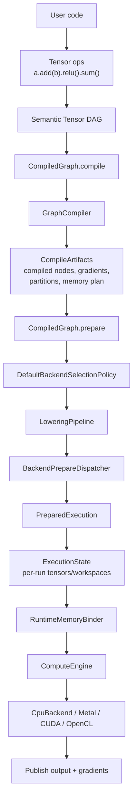
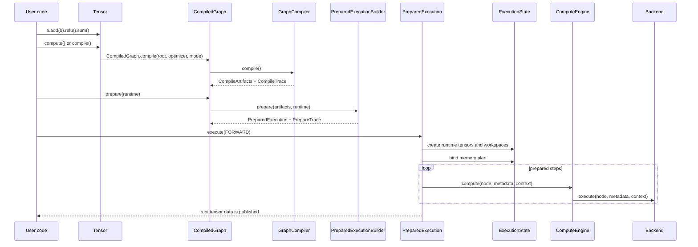
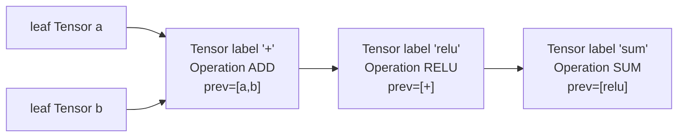
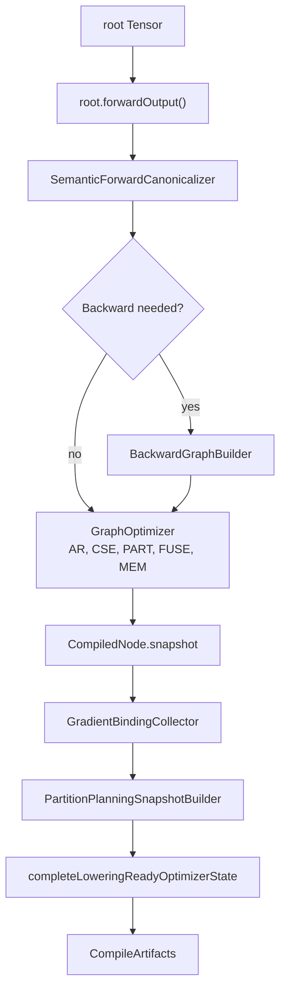
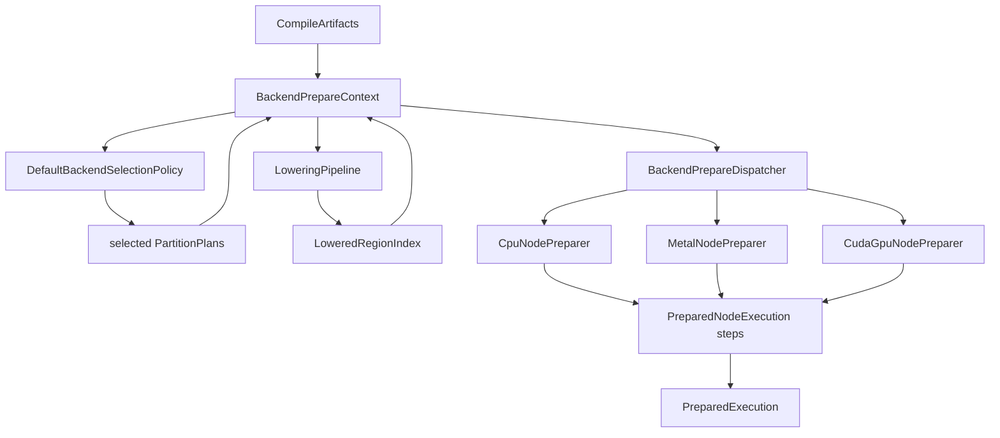
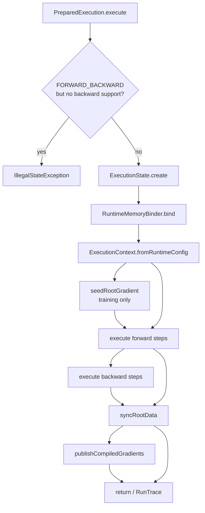

<!-- generated-by: gsd-doc-writer -->
# Compute Flow

Navigation: [Index](index.md) | [Architecture](architecture.md) | [Tensor API](tensor-api.md) | [Graph Optimizer](graph-optimizer.md) | [Mechanisms](mechanisms.md) | [Troubleshooting](troubleshooting.md)

This guide follows a tensor graph from user code through graph construction, compilation, backend preparation, execution, memory binding, and traces.

## Table Of Contents

- [Lifecycle Map](#lifecycle-map)
- [Primary Artifacts](#primary-artifacts)
- [Graph Building](#graph-building)
- [Compile](#compile)
- [Prepare](#prepare)
- [Execution](#execution)
- [Worked Example](#worked-example)
- [Reuse Rules](#reuse-rules)
- [Traces](#traces)
- [Failure Modes](#failure-modes)
- [Source Map](#source-map)

## Lifecycle Map

The compute path is staged. `Tensor` builds a semantic graph, `CompiledGraph` freezes and optimizes it, `PreparedExecution` attaches runtime/backend metadata, and `ComputeEngine` dispatches prepared steps against per-run state.





## Primary Artifacts

| Artifact | Created by | Main files | Owns | Reusable? |
|---|---|---|---|---|
| Semantic tensor graph | `Tensor` constructors and `tensor.ops.*` builders | [`Tensor.java`](../src/main/java/tensor/Tensor.java), [`TensorPrimitiveBuilder.java`](../src/main/java/tensor/TensorPrimitiveBuilder.java) | Shape, dtype, storage/layout, operation descriptor, predecessor tensors, backward lambda | User-owned mutable graph |
| Compile artifact | `CompiledGraph.compile(...)` and `GraphCompiler.compile()` | [`CompiledGraph.java`](../src/main/java/graph/CompiledGraph.java), [`GraphCompiler.java`](../src/main/java/graph/compile/GraphCompiler.java), [`CompileArtifacts.java`](../src/main/java/graph/compile/CompileArtifacts.java) | Immutable `CompiledNode` snapshots, final graph order, gradient bindings, partition plans, optimizer state, memory plan | Reusable for prepares with compatible runtime configs |
| Prepared artifact | `CompiledGraph.prepare(...)` | [`PreparedExecutionBuilder.java`](../src/main/java/backend/prepare/PreparedExecutionBuilder.java), [`PreparedExecution.java`](../src/main/java/graph/execution/PreparedExecution.java) | Ordered executable steps, backend metadata, CPU plans, fused/accelerator executables, prepare trace | Reusable for repeated runs with the same graph contract |
| Per-run state | `PreparedExecution.execute(...)` | [`ExecutionState.java`](../src/main/java/graph/execution/ExecutionState.java), [`ExecutionContext.java`](../src/main/java/backend/runtime/ExecutionContext.java) | Runtime tensors, runtime input links, forked workspaces, prepared input tensors, runtime trace side channels | New for each execute call |
| Backend dispatch | `ComputeEngine.compute(...)` | [`ComputeEngine.java`](../src/main/java/backend/ComputeEngine.java), [`CpuBackend.java`](../src/main/java/backend/cpu/CpuBackend.java) | Backend selection at execution time from prepared metadata | Stateless dispatcher |

## Graph Building

`Tensor` is both the user-visible value object and the semantic graph node. Leaf tensors have `operation == null`; derived tensors have an `operations.Operation` descriptor and a `prevTensors` list. `Tensor.topologicalSort()` delegates to `TensorGraphTraversal.topologicalSort(...)`, producing predecessors before consumers.

Public operation methods on `Tensor` delegate into `TensorOps`, then into family-specific builders:

- `Tensor.add(...)` -> `TensorOps.add(...)` -> `TensorBinaryOps.add(...)`
- `Tensor.relu()` -> `TensorOps.relu(...)` -> `TensorUnaryOps.relu(...)`
- `Tensor.sum()` -> `TensorOps.sumAll(...)` -> `TensorReduceOps.sumAll(...)`

The operation builders validate shape/dtype rules, derive output metadata, build an `Operation`, and use `TensorPrimitiveBuilder` to create the output node. They do not run kernels during graph construction.



`Tensor.forwardOutput()` wraps the requested root in a system `NOOP` node labeled `System_Forward_Output`. `GraphCompiler` compiles from that wrapper so publishing the semantic root is consistent even after rewrites.

## Compile

`Tensor.compile()` and `Tensor.compile(CompileMode)` are convenience wrappers around `CompiledGraph.compile(...)`. `Tensor.compute(...)` also compiles internally after resolving an `ExecutionProfile`.

Compile does the structural work:

1. Resolve the semantic forward root with `rootTensor.forwardOutput()`.
2. Optionally canonicalize the forward graph with `SemanticForwardCanonicalizer`.
3. Decide whether backward should be compiled. `CompileMode.INFERENCE_ONLY` never compiles backward; `CompileMode.TRAINING` and `CompileMode.AUTO` compile backward only when a trainable leaf input exists.
4. Run the configured optimizer stages through `GraphOptimizer`.
5. Snapshot the final graph as `CompiledNode` objects.
6. Collect gradient bindings when backward is supported.
7. Build partition planning metadata and compile-time backend plans.
8. Complete lowering-ready optimizer state and memory planning when partitions require it.
9. Publish a `CompileTrace`.

Default optimizer stage order for both inference and training is:

```text
AR -> CSE -> PART -> FUSE -> MEM
```

`OptimizerConfig.noOptimization()` uses an empty stage list. That means no memory plan is produced in the simple no-optimization path verified below.



`CompiledNode` snapshots the fields prepare/run must not read from mutable graph topology: node id, semantic/source tensors, operation, backend, input ids, shape, strides, storage offset, dtype, backward flag, leaf flag, contiguity, flat data size, and label.

## Prepare

`CompiledGraph.prepare(RuntimeConfig)` converts compile artifacts into executable steps. If no runtime config is supplied, `CompiledGraph.prepare()` chooses training defaults when `supportsBackward()` is true and inference defaults otherwise.

Prepare performs runtime-dependent work:

1. Build a consumer map for compiled nodes.
2. Create a `BackendPrepareContext` with runtime config, backward support, compiled nodes, and consumers.
3. Select non-CPU backend candidates with `DefaultBackendSelectionPolicy`.
4. Publish selected backend plans into the prepare context.
5. Run `LoweringPipeline` when optimized regions and a memory plan exist.
6. Create a `BackendPrepareDispatcher` from the runtime config.
7. Prepare each non-leaf operation node.
8. Skip nodes marked `PartitionExecutionRole.INTERIOR`.
9. Split prepared steps into forward and backward step lists by `forwardBoundaryNodeId`.
10. Return `PreparedExecution` with a `PrepareTrace`.



### Backend Selection

Compile can attach backend plans to partitions. Prepare decides which non-CPU plans are active for this runtime:

- Rejects missing plans as `missing-backend-plan`.
- Rejects incompatible plans as `backend-not-compatible`.
- Rejects disabled accelerators as `backend-disabled`.
- Rejects unavailable required runtimes as `runtime-unavailable`.
- Applies `AcceleratorPlanCostModel` and can reject small regions as `estimated-work-below-minimum`.
- CPU plans are not added to `backendSelectionCandidates`; CPU execution is the fallback path.

### Lowering

`LoweringPipeline` takes optimized regions, the memory plan, backend capabilities, and selected partition plans. It tries registered `RegionLowerer` implementations until one returns a `LoweredRegion`.

Current lowerer roles:

- `CpuRegionLowerer` lowers CPU regions to `DIRECT_KERNEL`, `BLAS`, or `FUSED_NATIVE` units.
- `MetalRegionLowerer` lowers selected Metal regions to `METAL_GRAPH_REGION` or `METAL_FUSED_ELEMENTWISE_GRAPH`.
- `CudaRegionLowerer` lowers selected CUDA regions to `CUDA_GRAPH_REGION` or `CUDA_FUSED_ELEMENTWISE_GRAPH`.

Prepared GPU anchors require both a selected partition plan and a lowered region. Metal and CUDA preparers also prepare CPU fallback steps for the partition.

### BackendPrepareDispatcher

`BackendPrepareDispatcher.prepare(node, context)` switches on the compiled node backend:

- `CPU` -> `CpuNodePreparer.prepare(...)`
- `GPU_METAL` -> `MetalNodePreparer.prepare(...)`
- `GPU_CUDA` -> `CudaGpuNodePreparer.prepare(...)`
- `GPU_OPENCL` -> metadata with no prepared kernel/plan

For CPU nodes, `CpuNodePreparer` resolves the kernel, CPU execution plan, fused executable when applicable, and any workspace. For Metal/CUDA anchors, the preparer builds a `PreparedMetalExecutable` or `PreparedCudaExecutable`; non-anchor GPU nodes fall back to CPU preparation unless they are partition interiors.

## Execution

`PreparedExecution.execute(mode)` and `PreparedExecution.executeTraced(mode)` share the same run path. `executeTraced` also records per-step trace entries.



`ExecutionState.create(...)` allocates one runtime tensor per compiled node, then rewires runtime predecessor links by compiled input ids. Forward leaf nodes alias current source storage; backward-side leaf nodes copy source data. CPU workspaces are forked from prepared workspace templates so repeated runs do not share mutable workspace state.

`RuntimeMemoryBinder.bind(...)` applies the compile-time `MemoryPlan` to per-run tensors. It:

- Skips when no memory plan exists.
- Skips leaves.
- Respects `runtimeBindingPolicyOf(...).regionBindingAllowed()`.
- Preserves alias-view ops such as `NOOP`, `EXPAND`, `SELECT`, `PERMUTE`, `EXPAND_DIMS`, `SQUEEZE`, and contiguous `RESHAPE`.
- Reuses typed storage slots only when the region slot is used at least twice and the slot size matches the runtime tensor flat size.
- Currently binds reusable slots for `FLOAT64` and `FLOAT32`; `BFLOAT16`, `INT32`, and `BOOL` are no-ops in the binder.

`ComputeEngine.compute(...)` is the final dispatcher. It ignores partition-interior metadata and otherwise calls:

- `CpuBackend.execute(...)`
- `MetalBackend.execute(...)`
- `CudaGpuBackend.execute(...)` when a prepared accelerator executable exists
- legacy `CudaBackend.execute(...)` when no CUDA accelerator executable is present
- `OpenClBackend.execute(...)`

`CpuBackend.execute(...)` resolves runtime inputs by node id, applies the prepared CPU layout plan, chooses strided elementwise execution when planned, and dispatches to dtype-specific kernel methods.

## Worked Example

Example graph:

```java
Tensor a = new Tensor(new double[]{1.0, -2.0, 3.0}, new int[]{3}, null, "a", DataType.FLOAT64);
Tensor b = new Tensor(new double[]{0.5, 4.0, -5.0}, new int[]{3}, null, "b", DataType.FLOAT64);

Tensor out = a.add(b).relu().sum();
```

Value flow:

| Step | Shape | Value |
|---|---:|---:|
| `a` | `[3]` | `[1.0, -2.0, 3.0]` |
| `b` | `[3]` | `[0.5, 4.0, -5.0]` |
| `a.add(b)` | `[3]` | `[1.5, 2.0, -2.0]` |
| `.relu()` | `[3]` | `[1.5, 2.0, 0.0]` |
| `.sum()` | `[1]` | `[3.5]` |

### No-Optimization Compile Artifact

Using `CompiledGraph.compile(out, OptimizerConfig.noOptimization())` produced this verified artifact:

| Node id | Label | Op | Inputs | Shape | Dtype | Backend |
|---:|---|---|---|---|---|---|
| 0 | `a` | `LEAF` | `[]` | `[3]` | `FLOAT64` | `CPU` |
| 1 | `b` | `LEAF` | `[]` | `[3]` | `FLOAT64` | `CPU` |
| 2 | `+` | `ADD` | `[0, 1]` | `[3]` | `FLOAT64` | `CPU` |
| 3 | `relu` | `RELU` | `[2]` | `[3]` | `FLOAT64` | `CPU` |
| 4 | `sum` | `SUM` | `[3]` | `[1]` | `FLOAT64` | `CPU` |
| 5 | `System_Forward_Output` | `NOOP` | `[4]` | `[1]` | `FLOAT64` | `CPU` |

Compile trace facts:

| Field | Value |
|---|---:|
| `supportsBackward` | `false` |
| `totalNodeCount` | `6` |
| `forwardNodeCount` | `6` |
| `forwardBoundaryNodeId` | `5` |
| `memoryPlan != null` | `false` |

Prepared execution with `RuntimeConfig.inferenceDefaults()` produced four forward steps and no backward steps:

| Step node | Operation | Kernel | CPU plan backend | Compute | Storage |
|---:|---|---|---|---|---|
| 2 | `ADD` | `CpuAddKernel` | `CPU_ELEMENTWISE` | `F64` | `FLOAT64` |
| 3 | `RELU` | `CpuReluKernel` | `CPU_ELEMENTWISE` | `F64` | `FLOAT64` |
| 4 | `SUM` | `CpuSumKernel` | `CPU_REDUCTION` | `F64` | `FLOAT64` |
| 5 | `NOOP` | `CpuNoopKernel` | `CPU_GENERIC` | `F64` | `FLOAT64` |

Run result:

```text
out.toDoubleArrayCopy() = [3.5]
out.scalarAsDouble() = 3.5
runTrace.steps().size() = 4
```

### Default Inference Optimizer Effect

Using `CompiledGraph.compile(out, OptimizerConfig.inferenceDefaults())` kept the same six compiled nodes but added optimizer products:

| Field | Value |
|---|---:|
| `supportsBackward` | `false` |
| `totalNodeCount` | `6` |
| `forwardNodeCount` | `6` |
| `forwardBoundaryNodeId` | `5` |
| `memoryPlan != null` | `true` |
| optimized regions | `1` |
| partitions | `1` |
| non-CPU backend selection candidates | `0` |

Prepare then collapsed the elementwise `ADD -> RELU` hot path into a fused CPU anchor. The prepared forward steps were:

| Step node | Label | Execution op | Partition role | Fused executable | Execution inputs | Plan backend |
|---:|---|---|---|---:|---|---|
| 3 | `relu` | `FUSED` | `ANCHOR` | `true` | `[0, 1]` | `CPU_FUSED` |
| 4 | `sum` | `SUM` | `NONE` | `false` | `[]` | `CPU_REDUCTION` |
| 5 | `System_Forward_Output` | `NOOP` | `NONE` | `false` | `[]` | `CPU_GENERIC` |

The key point is that compile preserved compiled node identity while prepare changed the executable schedule. Node `2` still exists in the compiled graph, but it is not a standalone prepared step in the optimized schedule because the fused anchor at node `3` executes the elementwise region.

## Reuse Rules

Compile and prepare are separate because they depend on different inputs.

| Stage | Depends on | Produces | Reuse boundary |
|---|---|---|---|
| Graph construction | User tensor calls and current tensor metadata | Semantic DAG | Rebuild when graph structure changes |
| Compile | Semantic graph, compile mode, optimizer config, partition config | `CompileArtifacts` and `CompileTrace` | Reuse to prepare multiple runtime configs when the graph contract is unchanged |
| Prepare | Compile artifacts and runtime config | `PreparedExecution`, backend metadata, prepared kernels/executables | Reuse for repeated runs with same compiled graph assumptions |
| Execute | Prepared execution and current leaf storage | Per-run runtime tensors, outputs, gradients, run trace | Every execute call creates fresh `ExecutionState` |

Safe reuse patterns:

- Reuse one `CompiledGraph` to call `prepare(...)` more than once. Tests cover independent prepared executions built from the same compiled graph.
- Reuse one `PreparedExecution` for repeated runs when shapes, dtypes, graph topology, operation descriptors, and backend/runtime assumptions remain valid.
- Mutating leaf values without changing shape/dtype is the intended repeated-run path: forward leaf runtime tensors alias source storage at run creation.
- Prepare again when runtime config changes in ways that affect kernels, accelerator availability, fused execution policy, BLAS settings, or CPU dispatch planning.
- Compile again when graph topology, operation descriptors, shapes, dtypes, layouts, backend intents, or trainable-leaf requirements change.

Needs verification: the source does not expose a single global version check that rejects a stale `PreparedExecution` after arbitrary semantic graph mutation. Treat a prepared artifact as bound to the compile-time graph contract.

## Traces

There are three trace layers:

| Trace | Source | Fields |
|---|---|---|
| `CompileTrace` | `GraphCompiler.compile()` | `measured`, `durationNs`, `totalNodeCount`, `forwardNodeCount`, `supportsBackward`, `partitionPlanning` |
| `PrepareTrace` | `PreparedExecutionBuilder.prepare(...)` | `measured`, `durationNs`, `forwardStepCount`, `backwardStepCount`, `backendSelection` |
| `RunTrace` | `PreparedExecution.executeTraced(...)` | `mode`, `durationNs`, `ExecutionStepTrace` list |

Each `ExecutionStepTrace` includes step index, label, op type, shape, dtype, selected backend, kernel class name, duration, and `StepExecutionMetadata`. Step metadata can include compute mode, layout path, dispatch hints, reduction hints, matmul hints, convolution hints, fused metadata, and accelerator attributes.

Trace tests verify that:

- A compiled graph exposes compile, prepare, and run traces.
- Fused hot paths publish prepare/run metadata, including fused node count, execution backend, and scheduler signature.
- BF16 elementwise and reduction traces report `F32` compute over `BFLOAT16` storage with CPU backend families such as `CPU_ELEMENTWISE` and `CPU_REDUCTION`.
- Partition planning traces record CPU or accelerator targets and candidate decisions.

## Failure Modes

| Failure mode | Where it appears | Typical symptom | Response |
|---|---|---|---|
| Shape mismatch | Operation builders, `copyDataFrom`, layout planners | `IllegalArgumentException`, for example `copyDataFrom requires matching shapes.` | Fix the graph construction inputs and recompile. |
| Dtype mismatch | Operation builders, CPU type contract resolver, tensor copy/conversion | `IllegalArgumentException` or `UnsupportedOperationException`, especially for unsupported implicit `INT32`/`BOOL` conversions | Use compatible dtypes or explicit tensor construction. Recompile after dtype changes. |
| Backward requested for forward-only prepared execution | `PreparedExecution.executeInternal(...)` | `IllegalStateException: Prepared execution does not support backward execution.` | Compile with `CompileMode.TRAINING` or `CompileMode.AUTO` and ensure trainable leaf inputs exist. |
| Unsupported training root dtype | `GraphCompiler.Session.compile()` | `UnsupportedOperationException: BOOL/INT32 root tensors do not support backward execution.` | Use floating root tensors for backward execution. |
| Stale prepared assumptions | No single public stale-check guard found | Wrong schedule or metadata if graph contract changes after prepare | Needs verification: compile/prepare again after topology, shape, dtype, layout, backend intent, or runtime-policy changes. |
| Backend disabled at runtime | `DefaultBackendSelectionPolicy` | Prepare trace decision reason `backend-disabled`; GPU steps absent | Enable the accelerator in `RuntimeConfig` or accept CPU fallback. |
| Required accelerator runtime unavailable | `DefaultBackendSelectionPolicy` | Prepare trace decision reason `runtime-unavailable` | Install/configure the runtime or disable the requirement. |
| Accelerator region too small | `AcceleratorPlanCostModel` through backend selection | Prepare trace decision reason `estimated-work-below-minimum` | Lower the minimum-work threshold or accept CPU execution. |
| Missing accelerator lowering/plan for selected anchor | Metal/CUDA preparers | `IllegalStateException` such as missing lowered region or partition plan | Recompile with compatible partition/lowering settings; inspect compile and prepare traces. |
| Missing CPU kernel | `CpuNodePreparer` or `CpuBackend` | `IllegalStateException` during prepare or `UnsupportedOperationException` during execute | Add/register the CPU kernel or avoid that operation/backend combination. |
| Missing prepared fused executable | Fused CPU execution | `IllegalStateException: Missing prepared fused executable in prepared metadata` | Prepare with a runtime config that supports the fused path, or disable/adjust fusion. |
| Memory binding mistake | `RuntimeMemoryBinder` and `MemoryPlan` | Incorrect output if live ranges alias incorrectly | Inspect memory plan and binding policy. Binder intentionally refuses many unsafe bindings, including mismatched slot sizes and unsupported dtypes. |
| OpenCL preparation gap | `BackendPrepareDispatcher` and `OpenClBackend` | Prepared metadata has no CPU plan; execute relies on OpenCL registry | Needs verification: OpenCL appears to be a minimal registry-backed path, not a full prepare/lowering path. |
| Native bridge availability | `PreparedMetalExecutable` / `PreparedCudaExecutable` | Accelerator executable falls back to CPU when bridge/context/executable is unavailable | Check runtime config, bridge availability, and trace attributes. |

## Source Map

- [`Tensor.java`](../src/main/java/tensor/Tensor.java): public compute/compile/prepare entry points, graph node fields, operation methods, `forwardOutput()`.
- [`TensorExecutionSupport.java`](../src/main/java/tensor/TensorExecutionSupport.java): default compile/runtime/profile selection for `Tensor.compute(...)`.
- [`CompiledGraph.java`](../src/main/java/graph/CompiledGraph.java): compile facade, prepare facade, trace access, execute convenience methods.
- [`GraphCompiler.java`](../src/main/java/graph/compile/GraphCompiler.java): compile session, backward decision, optimizer invocation, snapshots, partition planning, memory planning.
- [`CompileArtifacts.java`](../src/main/java/graph/compile/CompileArtifacts.java): immutable compile output record.
- [`CompiledNode.java`](../src/main/java/graph/CompiledNode.java): compile-time node snapshot.
- [`PreparedExecutionBuilder.java`](../src/main/java/backend/prepare/PreparedExecutionBuilder.java): prepare orchestration, backend selection, lowering, step construction.
- [`BackendPrepareDispatcher.java`](../src/main/java/backend/prepare/BackendPrepareDispatcher.java): backend-specific prepare switch.
- [`DefaultBackendSelectionPolicy.java`](../src/main/java/backend/select/DefaultBackendSelectionPolicy.java): runtime accelerator selection and rejection reasons.
- [`LoweringPipeline.java`](../src/main/java/backend/lowering/LoweringPipeline.java): optimized region lowering.
- [`CpuNodePreparer.java`](../src/main/java/backend/cpu/prepare/CpuNodePreparer.java): CPU kernel/plan/workspace/fused metadata preparation.
- [`PreparedExecution.java`](../src/main/java/graph/execution/PreparedExecution.java): run loop, tracing, root publishing, gradient publishing.
- [`ExecutionState.java`](../src/main/java/graph/execution/ExecutionState.java): per-run tensors, runtime inputs, workspaces, prepared input tensors.
- [`RuntimeMemoryBinder.java`](../src/main/java/graph/execution/RuntimeMemoryBinder.java): runtime storage aliasing from memory plan.
- [`ComputeEngine.java`](../src/main/java/backend/ComputeEngine.java): execution-time backend dispatcher.
- [`CpuBackend.java`](../src/main/java/backend/cpu/CpuBackend.java): CPU runtime input resolution, layout plan application, dtype kernel dispatch.
- [`PreparedExecutionBuildTest.java`](../src/test/java/PreparedExecutionBuildTest.java): prepared execution, backend selection, accelerator lowering, fused metadata coverage.
- [`CompiledGraphTraceTest.java`](../src/test/java/CompiledGraphTraceTest.java): compile/prepare/run trace coverage.
- [`ComputeModeTraceTest.java`](../src/test/java/ComputeModeTraceTest.java): BF16 compute-mode trace coverage.
