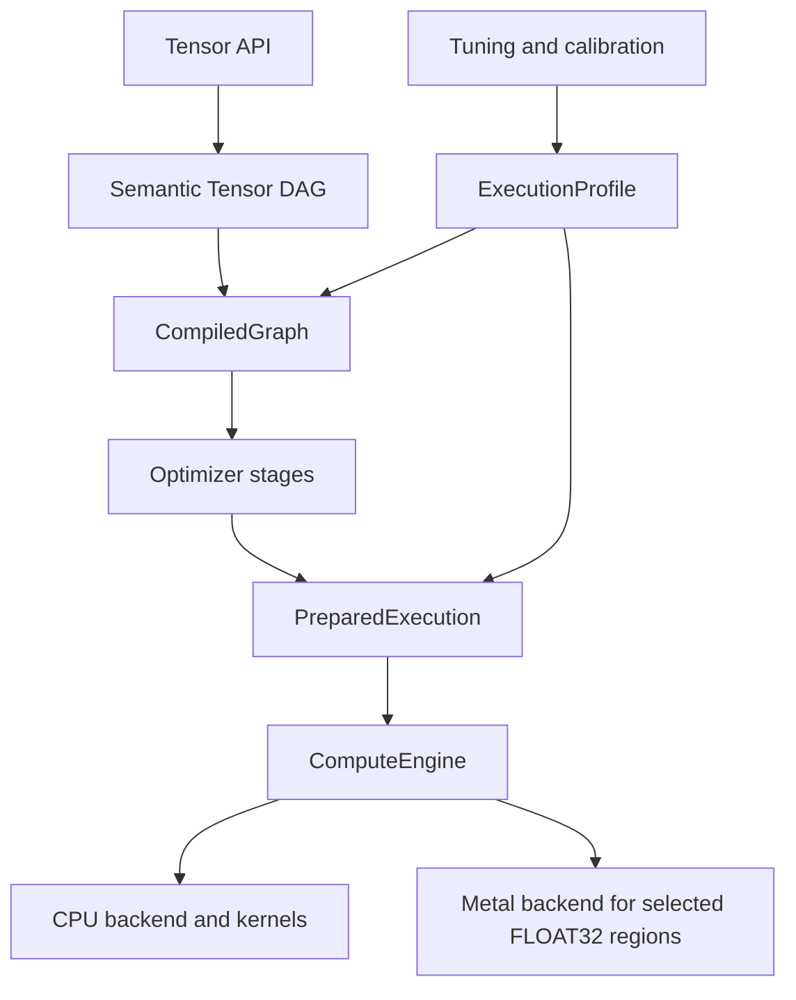
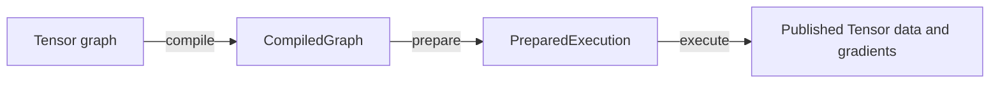

<!-- generated-by: gsd-doc-writer -->
# Framework Concepts

Navigation: [Index](index.md#recommended-reading-paths) | [Architecture](architecture.md#system-overview) | [Compute Flow](compute-flow.md#lifecycle-map) | [Tensor API](tensor-api.md#api-surface-and-conventions) | [Graph Optimizer](graph-optimizer.md#graph-optimizer) | [Metal Backend](metal-backend.md#mental-model) | [Glossary](glossary.md#a)

Chapters: [Tensors As Graph Nodes](#tensors-as-graph-nodes) | [Operation Descriptors](#operation-descriptors) | [Storage And Layout](#storage-and-layout) | [Broadcasting](#broadcasting) | [Compile, Prepare, Execute](#compile-prepare-execute) | [Autodiff](#autodiff) | [Semantic Canonicalization And Optimizer Stages](#semantic-canonicalization-and-optimizer-stages) | [Profiles](#profiles) | [Tuning, Calibration, And Persistence](#tuning-calibration-and-persistence) | [Common Mental Pitfalls](#common-mental-pitfalls)

Synaptik is a Java tensor, autodiff, and compiled-graph framework. The main mental model is: user code builds a semantic tensor graph, compile snapshots and rewrites that graph, prepare binds runtime/backend policy, and execute runs prepared node steps against per-run runtime tensors.



## Table Of Contents

- [Tensors As Graph Nodes](#tensors-as-graph-nodes)
- [Operation Descriptors](#operation-descriptors)
- [Storage And Layout](#storage-and-layout)
- [Broadcasting](#broadcasting)
- [Compile, Prepare, Execute](#compile-prepare-execute)
- [Autodiff](#autodiff)
- [Semantic Canonicalization And Optimizer Stages](#semantic-canonicalization-and-optimizer-stages)
- [Profiles](#profiles)
- [Tuning, Calibration, And Persistence](#tuning-calibration-and-persistence)
- [Common Mental Pitfalls](#common-mental-pitfalls)

## Tensors As Graph Nodes

`tensor.Tensor` is both the public value object and the graph node type. A tensor carries shape, strides, storage offset, dtype, label, backing storage, predecessor tensors, an optional `Operation` descriptor, gradient state, backward builder state, and optional backend override. Source: [`Tensor.java`](../src/main/java/tensor/Tensor.java), [`TensorMetadata.java`](../src/main/java/tensor/TensorMetadata.java), [`TensorPrimitiveBuilder.java`](../src/main/java/tensor/TensorPrimitiveBuilder.java).

Leaf tensors have no operation descriptor. Derived tensors are built by `tensor.ops.*` helpers through `TensorPrimitiveBuilder`, which creates a new `Tensor` with inputs and an immutable operation descriptor. For example, `TensorBinaryOps.add(first, second)` plans broadcasting, creates an `operations.elementwise.binary.add` descriptor, builds a binary tensor node, and attaches backward logic that reduces broadcast gradients back to each input shape. Source: [`TensorBinaryOps.java`](../src/main/java/tensor/ops/binary/TensorBinaryOps.java), [`add.java`](../src/main/java/operations/elementwise/binary/add.java).

The graph is a DAG over object references, not a separate IR object during construction. `Tensor.topologicalSort()` delegates to graph traversal and gives compile a stable node order rooted at the requested output. Source: [`Tensor.java`](../src/main/java/tensor/Tensor.java), [`TensorGraphTraversal.java`](../src/main/java/tensor/TensorGraphTraversal.java).

## Operation Descriptors

`operations.Operation` describes what a node means, not how to execute it. Its core fields are `opType()`, `getExpression()`, and the optional `isCheap()` hint. `Operation.OpType` also classifies primitives by arity family and marks elementwise primitives as fusable. Source: [`Operation.java`](../src/main/java/operations/Operation.java), [`operations/README.md`](../src/main/java/operations/README.md#core-contract).

Examples:

- `ADD`, `SUB`, `MUL`, `DIV`, `WHERE`, `RELU`, `SIGMOID` are elementwise and fusable.
- `SUM`, `MEAN`, `REDUCE_MAX`, `SOFTMAX` are reductions or special reductions.
- `RESHAPE`, `EXPAND`, `PERMUTE`, `SELECT` are layout/view-style operations.
- `LINEAR`, `CONV2D_GEMM`, `CROSS_ENTROPY_LOSS_INDICES`, `SCALED_DOT_PRODUCT_ATTENTION` are higher-level special primitives produced directly or by lowering.
- `FUSED` is a backend-owned fused descriptor created after graph optimization.

This split is deliberate: public graph construction belongs to `tensor`, primitive meaning belongs to `operations`, graph rewrites belong to `graph`, and concrete execution belongs to `backend`.

## Storage And Layout

Tensor layout is explicit. `TensorMetadata` stores normalized shape, dense or custom strides, storage offset, dtype, and a computed `contiguous` flag. Dense strides are computed from the last dimension backward. Zero strides represent broadcast views, and nonzero storage offsets represent views into existing storage. Source: [`TensorMetadata.java`](../src/main/java/tensor/TensorMetadata.java).

Storage is dtype-specific through `TensorStorage` implementations such as `Float64Storage`, `Float32Storage`, `BFloat16Storage`, `Int32Storage`, and `BoolStorage`. The storage interface exposes dtype, size, version, and mutation marking. Source: [`TensorStorage.java`](../src/main/java/tensor/TensorStorage.java), [`Float64Storage.java`](../src/main/java/tensor/Float64Storage.java), [`BoolStorage.java`](../src/main/java/tensor/BoolStorage.java).

Layout operations are explicit API calls rather than one generic view call:

- `reshape` changes logical shape and may alias when the input is contiguous.
- `expand` creates broadcast-style zero-stride views.
- `permute`, `transpose`, `select`, `expandDims`, and `squeeze` remap layout.
- `contiguous` materializes dense storage when needed.

At runtime, alias-like nodes are repaired after execution so semantic view tensors still reflect the source storage chain. Source: [`PreparedExecution.java`](../src/main/java/graph/execution/PreparedExecution.java), [`RuntimeMemoryBinder.java`](../src/main/java/graph/execution/RuntimeMemoryBinder.java).

## Broadcasting

Broadcasting follows right-aligned trailing-axis rules. `BroadcastPlanner.plan(...)` aligns shapes to the same rank, accepts dimensions when equal or when one side is `1`, sets effective stride `0` for broadcast axes, and records reduction axes for backward. Source: [`BroadcastPlanner.java`](../src/main/java/tensor/BroadcastPlanner.java), [`BroadcastPlan.java`](../src/main/java/tensor/BroadcastPlan.java), [`TensorBroadcastOps.java`](../src/main/java/tensor/TensorBroadcastOps.java).

Concrete example:

```text
left shape  = [2, 1, 4]
right shape = [3, 4]
aligned     = [2, 1, 4] and [1, 3, 4]
out shape   = [2, 3, 4]
```

For gradients, a broadcast operand receives a gradient reduced with `sumToShape(...)`. Tests cover forward and backward broadcasting for `FLOAT64`, `FLOAT32`, and `BFLOAT16`. Source: [`BroadcastContractMatrixTest.java`](../src/test/java/BroadcastContractMatrixTest.java).

## Compile, Prepare, Execute

Keep these three artifacts separate:



### Compile

`CompiledGraph.compile(rootTensor, optimizerConfig, compileMode)` snapshots graph structure and runs compile-time transformations. It does not execute kernels. `GraphCompiler` normalizes the semantic root through `forwardOutput()`, optionally runs semantic forward canonicalization, decides whether backward is needed from `CompileMode` and trainable leaves, builds backward graph when needed, optimizes a snapshot, captures `CompiledNode` metadata, collects gradient bindings, and creates partition/memory planning artifacts. Source: [`CompiledGraph.java`](../src/main/java/graph/CompiledGraph.java), [`GraphCompiler.java`](../src/main/java/graph/compile/GraphCompiler.java), [`CompiledNode.java`](../src/main/java/graph/CompiledNode.java).

`CompileMode` means:

- `INFERENCE_ONLY`: forward graph only.
- `TRAINING`: backward graph only when there are trainable leaf inputs.
- `AUTO`: same practical backward decision as training, based on graph structure.

### Prepare

`CompiledGraph.prepare(runtimeConfig)` turns compile-time structure into executable metadata. It selects backend plans, lowers optimized regions, dispatches backend-specific preparers, resolves CPU kernels, creates CPU execution plans, prepares fused executables, assigns workspaces, and splits prepared steps into forward and backward lists. Source: [`PreparedExecutionBuilder.java`](../src/main/java/backend/prepare/PreparedExecutionBuilder.java), [`BackendPrepareDispatcher.java`](../src/main/java/backend/prepare/BackendPrepareDispatcher.java), [`CpuNodePreparer.java`](../src/main/java/backend/cpu/prepare/CpuNodePreparer.java), [`CompiledNodeExecutionMetadata.java`](../src/main/java/graph/execution/CompiledNodeExecutionMetadata.java).

Prepare is the stage to reuse in hot loops when graph structure and runtime policy stay stable. Tests verify repeated prepare creates independent prepared executions with independent step views and detached gradient publication. Source: [`PreparedExecutionBuildTest.java`](../src/test/java/PreparedExecutionBuildTest.java).

### Execute

`PreparedExecution.execute(mode)` creates a per-run `ExecutionState`, binds memory reuse slots, builds an `ExecutionContext`, runs prepared forward and optional backward steps through `ComputeEngine`, publishes forward data back to the semantic root, and publishes detached gradient tensors back to trainable semantic tensors. Source: [`PreparedExecution.java`](../src/main/java/graph/execution/PreparedExecution.java), [`ExecutionState.java`](../src/main/java/graph/execution/ExecutionState.java), [`ExecutionContext.java`](../src/main/java/backend/runtime/ExecutionContext.java), [`ComputeEngine.java`](../src/main/java/backend/ComputeEngine.java).

## Autodiff

Autodiff is reverse-mode over the semantic tensor graph. Operation builders attach backward lambdas when the operation is differentiable. During training compile, `BackwardGraphBuilder` seeds the forward root gradient with ones, walks the forward graph in reverse order, invokes each node's backward builder, collects gradients for trainable leaves, and marks backward-only nodes. Source: [`BackwardGraphBuilder.java`](../src/main/java/graph/compile/BackwardGraphBuilder.java), [`TensorBinaryOps.java`](../src/main/java/tensor/ops/binary/TensorBinaryOps.java).

Worked example:

```java
Tensor x = new Tensor(new double[]{1.0, -2.0, 3.0}, new int[]{3}, null, "x", DataType.FLOAT64);
x.setRequiresGrad(true);

Tensor loss = x.mul(x).sum();
loss.compute(CompileMode.TRAINING);
```

The forward value is `1 + 4 + 9 = 14`. The gradient is `2x`, so `x.getGradient()` contains `[2.0, -4.0, 6.0]`. Regression tests compare optimized and unoptimized gradients for scalar and vector graphs. Source: [`GradientEngineRegressionTest.java`](../src/test/java/GradientEngineRegressionTest.java).

## Semantic Canonicalization, Graph Optimization, And Planning

Synaptik has two related but distinct compile-time rewrite layers.

Semantic forward canonicalization happens before autograd construction. It rebuilds forward-safe canonical forms without mutating the original user graph, so backward lambdas are still valid. It can canonicalize patterns such as decomposed sigmoid, relu-like `where`, `matmul + bias` into `linear`, log-softmax plus indexed NLL into indexed cross-entropy, and attention-style score/softmax/value patterns into scaled-dot-product attention. Source: [`SemanticForwardCanonicalizer.java`](../src/main/java/graph/SemanticForwardCanonicalizer.java), [`SemanticForwardCanonicalizationCompileTest.java`](../src/test/java/graph/SemanticForwardCanonicalizationCompileTest.java).

Graph optimization is backend-neutral. `OptimizerFactory.create(GraphOptimizationConfig)` builds:

```text
CLEANUP_FIXPOINT(AR -> CF -> CSE -> DCE) -> optional LOWER
```

Stage ownership:

- `AR`: algebraic rewrites and semantic lowerings.
- `CF`: conservative constant folding.
- `CSE`: structural common subexpression elimination.
- `DCE`: removes nodes that are not reachable from observable roots.
- `LOWER`: optional backend-neutral operation lowering.

Backend planning, region optimization, and memory planning are later compile phases, not graph optimizer stages. Source: [`GraphOptimizationConfig.java`](../src/main/java/config/compile/GraphOptimizationConfig.java), [`CompileConfig.java`](../src/main/java/config/compile/CompileConfig.java), [`BackendPlanningConfig.java`](../src/main/java/config/compile/BackendPlanningConfig.java), [`OptimizerFactory.java`](../src/main/java/graph/optimizer/OptimizerFactory.java).

## Profiles

`ExecutionProfile` is the runnable profile object. It combines profile names, dtype, execution mode, compile config, runtime config, and workload metadata. Source: [`ExecutionProfile.java`](../src/main/java/config/profile/ExecutionProfile.java).

`GraphExecutionPolicy` is the graph-side policy wrapper around `CompileConfig`. `PlatformRuntimeProfile` is the machine-oriented runtime-default artifact produced by calibration. `ExecutionProfileAssembler` combines graph policy and runtime profile into a concrete `ExecutionProfile`. Source: [`GraphExecutionPolicy.java`](../src/main/java/config/profile/GraphExecutionPolicy.java), [`PlatformRuntimeProfile.java`](../src/main/java/config/profile/PlatformRuntimeProfile.java), [`ExecutionProfileAssembler.java`](../src/main/java/config/profile/ExecutionProfileAssembler.java).

`RuntimeConfig` owns runtime/backend policy such as CPU kernel thresholds, approximation policy, BLAS settings, conv2d routing, fused execution policy, and accelerator config. Source: [`RuntimeConfig.java`](../src/main/java/config/runtime/RuntimeConfig.java).

## Tuning, Calibration, And Persistence

The tuning package measures and persists executable profiles; it does not define tensor semantics. There are three main workflows:

- Benchmark: measure explicit candidates.
- Per-graph autotune: search candidate `ExecutionProfile` objects for one workload.
- Platform calibration: search runtime defaults for one hardware/JDK platform and persist a `PlatformRuntimeProfile`.

Source: [`tuning/README.md`](../src/main/java/tuning/README.md#three-distinct-workflows), [`AutotuneSession.java`](../src/main/java/tuning/autotune/AutotuneSession.java), [`DefaultAutotuneSession.java`](../src/main/java/tuning/autotune/DefaultAutotuneSession.java), [`DefaultPlatformCalibrationSession.java`](../src/main/java/tuning/calibration/DefaultPlatformCalibrationSession.java).

Persistence is explicit. Autotune can persist best profiles and history through `PersistencePolicy`, `JsonFileBestProfileStore`, and `JsonFileTuningHistoryStore`. CLI platform calibration uses the schema-v2 layout rooted at `profiles/platform/<platform-id>/calibration/schema-v2`, with latest profiles under `latest/<dtype>/<mode>/profile.json`, per-family history under `history/<dtype>/<mode>/<family-id>.jsonl`, and run artifacts under `runs/<run-id>/<dtype>/<mode>/<family-id>/`. Source: [`PersistencePolicy.java`](../src/main/java/tuning/store/PersistencePolicy.java), [`JsonFileBestProfileStore.java`](../src/main/java/tuning/store/JsonFileBestProfileStore.java), [`CalibrationArtifactLayout.java`](../src/main/java/tuning/calibration/store/CalibrationArtifactLayout.java).

## Common Mental Pitfalls

- A `Tensor` is not just data. It is also a graph node.
- Compile does not execute kernels.
- Prepare does not rewrite graph semantics.
- Execute should consume prepared metadata, not rediscover planner decisions.
- Broadcast gradients must reduce back to original operand shapes.
- Fused execution is not selected by the CPU executor directly; it is prepared earlier as metadata.
- Tuning searches measured profiles; it should not introduce a hidden execution model.
