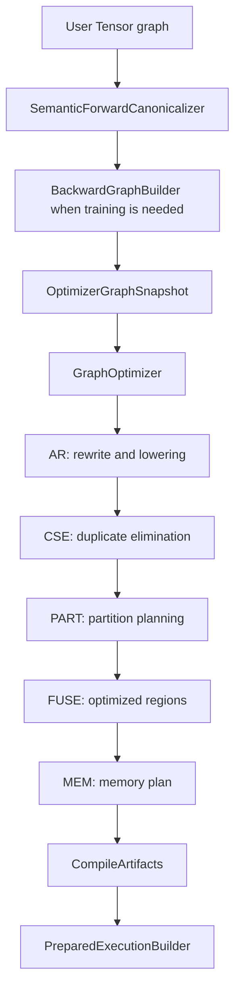
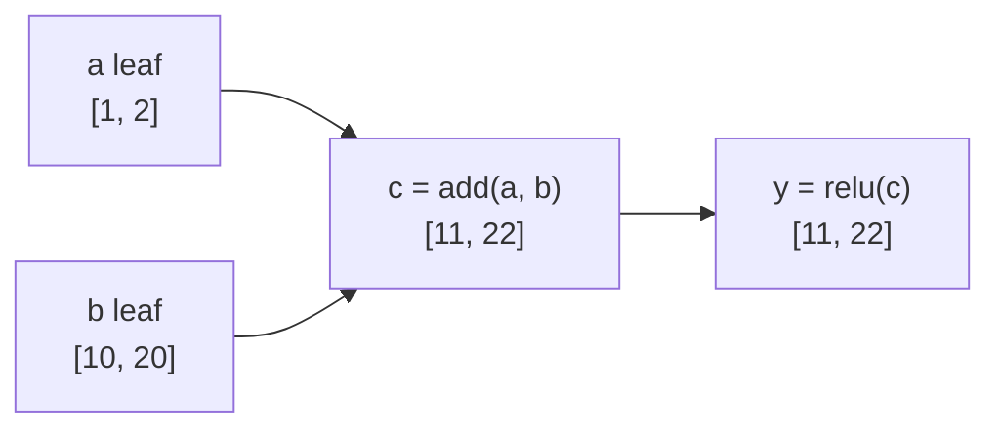
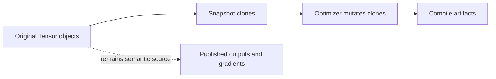
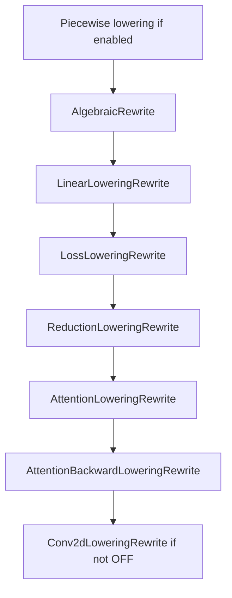
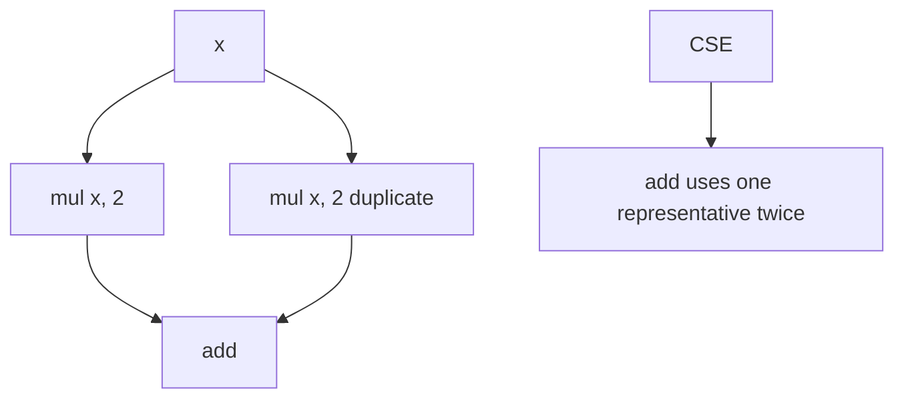
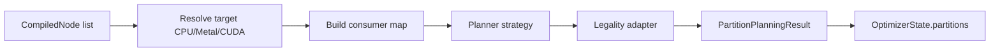
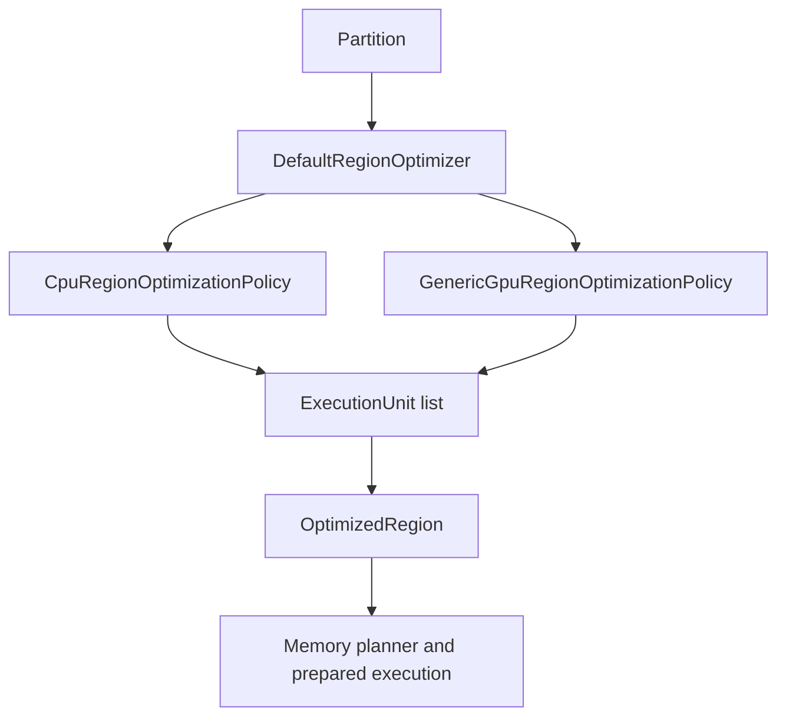
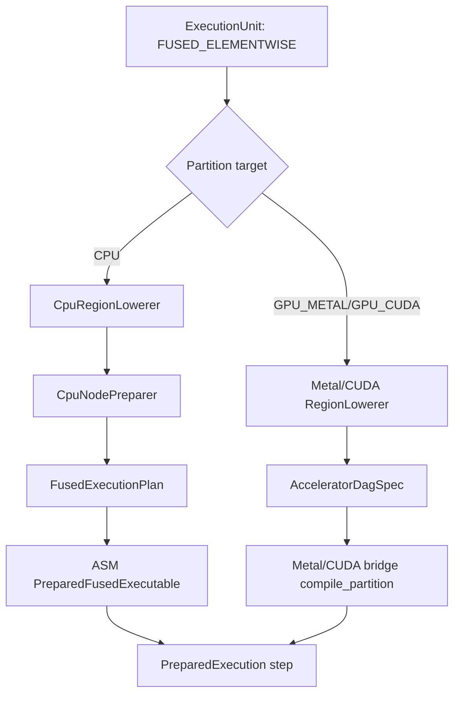
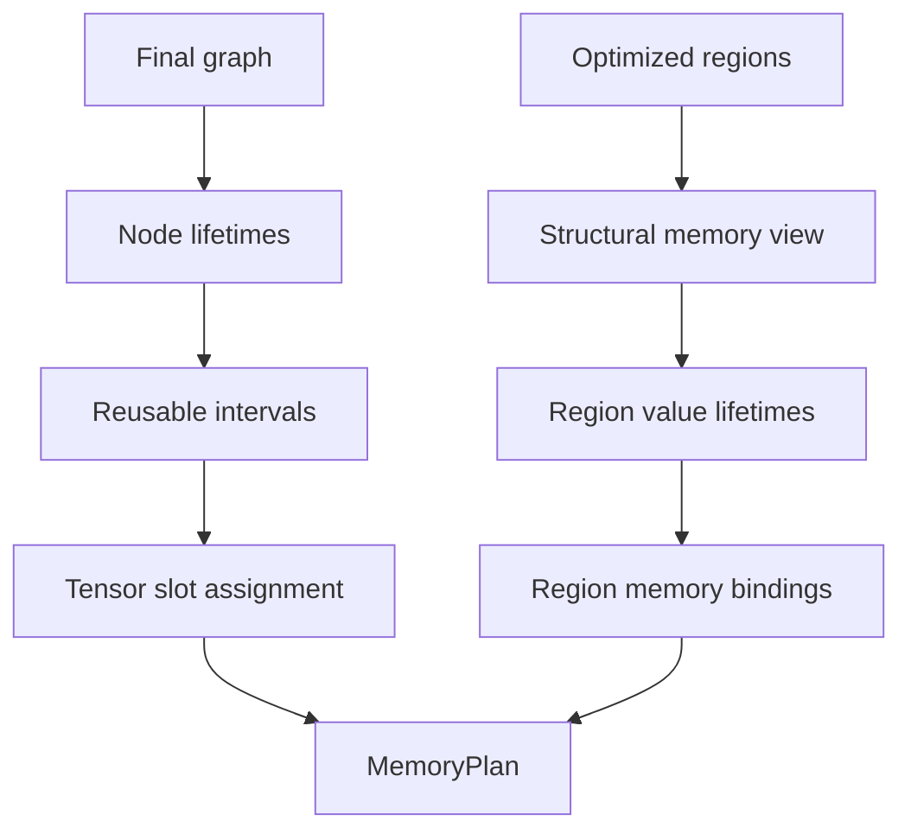
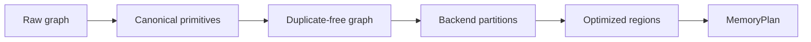

<!-- generated-by: gsd-doc-writer -->
# Graph Optimizer Guide

Navigation: [Index](index.md) | [Architecture](architecture.md) | [Compute Flow](compute-flow.md) | [Mechanisms](mechanisms.md) | [Configuration](configuration.md) | [Testing](testing.md)

Chapters: [Mental Model](#mental-model) | [DAG And Graph Vocabulary](#dag-and-graph-vocabulary) | [Global Versus Partition-Scoped Work](#global-versus-partition-scoped-work) | [Compiler Boundary](#compiler-boundary) | [OptimizerConfig](#optimizerconfig) | [Stage Ordering](#stage-ordering) | [OptimizerState](#optimizerstate) | [OptimizerTrace](#optimizertrace) | [Stage AR: Rewrite and Lowering](#stage-ar-rewrite-and-lowering) | [Stage CSE: Common Subexpression Elimination](#stage-cse-common-subexpression-elimination) | [Stage PART: Partition Planning](#stage-part-partition-planning) | [Stage FUSE: Region Optimization and Fusion](#stage-fuse-region-optimization-and-fusion) | [Stage MEM: Memory and Lifetime Planning](#stage-mem-memory-and-lifetime-planning) | [How the Stages Work Together](#how-the-stages-work-together) | [Adding or Changing Optimizer Behavior](#adding-or-changing-optimizer-behavior)

This guide explains the graph optimizer as a compile-time transformation pipeline over a cloned tensor DAG. It is written for contributors who need to reason about optimizer behavior, add rules, debug stage interactions, or understand why the default stage order is `AR -> CSE -> PART -> FUSE -> MEM`.

## Table Of Contents

- [Mental Model](#mental-model)
- [DAG And Graph Vocabulary](#dag-and-graph-vocabulary)
- [Global Versus Partition-Scoped Work](#global-versus-partition-scoped-work)
- [Compiler Boundary](#compiler-boundary)
- [OptimizerConfig](#optimizerconfig)
- [Stage Ordering](#stage-ordering)
- [OptimizerState](#optimizerstate)
- [OptimizerTrace](#optimizertrace)
- [Stage AR: Rewrite and Lowering](#stage-ar-rewrite-and-lowering)
- [Stage CSE: Common Subexpression Elimination](#stage-cse-common-subexpression-elimination)
- [Stage PART: Partition Planning](#stage-part-partition-planning)
- [Stage FUSE: Region Optimization and Fusion](#stage-fuse-region-optimization-and-fusion)
- [Stage MEM: Memory and Lifetime Planning](#stage-mem-memory-and-lifetime-planning)
- [How the Stages Work Together](#how-the-stages-work-together)
- [Adding or Changing Optimizer Behavior](#adding-or-changing-optimizer-behavior)

## Mental Model

The optimizer is not a runtime executor. It is an ordered list of `OptimizationRule` instances that transforms a topologically sorted compile-time graph snapshot and publishes analysis artifacts for later lowering and prepared execution.



The optimizer owns graph structure and compile-time planning artifacts:

- replacing an algebraic expression with an equivalent simpler expression
- lowering a recognizable pattern into a specialized operation
- merging duplicate subgraphs
- identifying backend partitions
- creating optimized region execution units
- planning storage reuse and region handoff memory

It does not choose CPU vector width, worker count, BLAS thresholds, approximation mode, or machine code layout. Those choices belong to backend preparation and runtime configuration.

Compared with naive execution, the naive path executes each graph node independently and allocates outputs according to the raw graph. The optimized path tries to reduce the number of semantic operations that survive, reduce repeated computation, group backend-friendly regions, and reuse storage where lifetimes permit.

## DAG And Graph Vocabulary

`DAG` means **directed acyclic graph**.

In this project:

- **Directed** means edges have a direction from producer to consumer. If `z = x.add(y)`, then `x -> z` and `y -> z`.
- **Acyclic** means following producer/consumer edges cannot lead back to the same tensor. A tensor can depend on earlier tensors, but it cannot depend on itself through a cycle.
- **Graph** means the set of tensor nodes reachable from the compiled output and, in training mode, from backward/gradient publication targets.

A small expression:

```java
Tensor a = new Tensor(new double[]{1, 2}, new int[]{2}, null, "a", DataType.FLOAT64);
Tensor b = new Tensor(new double[]{10, 20}, new int[]{2}, null, "b", DataType.FLOAT64);
Tensor c = a.add(b);
Tensor y = c.relu();
```

becomes this DAG:



The topological order is a legal execution/planning order where producers appear before consumers:

```text
node 0: a
node 1: b
node 2: c = add(a, b)
node 3: y = relu(c)
```

Optimizer stages consume this topological order. A rewrite may remove `node 2`, replace `node 3`, or attach planning metadata, but it must preserve the acyclic producer-before-consumer invariant.

Important vocabulary:

| Term | Meaning in this codebase |
| --- | --- |
| Tensor node | A `Tensor` object in the compile-time snapshot. It may be a leaf or an operation result. |
| Leaf | A tensor with `operation == null`, usually data, parameter, scalar, or target input. |
| Operation node | A tensor with an `Operation`, such as `ADD`, `MATMUL`, `RESHAPE`, `SOFTMAX`, or `CONV2D`. |
| Edge | A dependency from `prevTensors` input to the consumer tensor. |
| Root / sink | A tensor that must remain observable, such as the forward output, a graph sink, or a gradient target. |
| Topological closure | The reachable graph rebuilt from roots after rewrites remove dead nodes. |
| Partition | A backend-targeted connected subset of compiled nodes created by `PART`. |
| Optimized region | A `FUSE` artifact built from one partition, containing execution units and region values. |
| Region value | A value produced inside an optimized region, classified as materialized, continuation, or virtual. |

## Global Versus Partition-Scoped Work

The most important architectural distinction is that optimizer stages do not all work at the same scope.

| Stage / phase | Scope | What it reads | What it writes | Does it operate inside partitions? |
| --- | --- | --- | --- | --- |
| Semantic forward canonicalizer | Global forward graph before backward construction | User forward DAG | Canonicalized forward DAG | No. Partitions do not exist yet. |
| `AR` | Global optimizer snapshot | Entire current tensor DAG | Rewritten graph | No. It rewrites graph nodes before partitioning. |
| `CSE` | Global optimizer snapshot | Entire current tensor DAG | Duplicate-free graph | No. It merges duplicate expressions before partitioning. |
| `PART` | Global planning pass | Final structural graph plus backend intents | `Partition` and `PartitionPlan` artifacts | It creates partitions; it does not execute inside them. |
| `FUSE` | Per partition | `OptimizerState.partitions()` plus compiled node snapshot | `OptimizedRegion` artifacts | Yes. Each partition is optimized independently into execution units. |
| `MEM` | Hybrid | Final graph plus optimized regions | `MemoryPlan`, region bindings, handoff requirements | Both. Tensor lifetimes are global; region value bindings are planned from optimized regions. |
| Backend lowering / prepare | Per partition / per optimized region / per node | compile artifacts and runtime config | prepared execution steps | Yes. This is where backend-specific lowerers and fused plans become executable recipes. |
| Execution | Prepared step order | prepared execution recipe | tensor storage values | It follows the prepared plan, not the raw optimizer stages. |

Concrete implication:

```text
AR and CSE can see duplicates across the whole graph.
FUSE cannot arbitrarily fuse across partition boundaries.
MEM can see that a value produced in one region is consumed by another and creates a handoff requirement.
```

Example:

```text
node 0: x leaf
node 1: w leaf
node 2: b leaf
node 3: matmul(x, w)
node 4: add(node3, b)
node 5: relu(node4)
node 6: sum(node5)
```

A typical default pipeline can behave like this:

```text
AR    global:  matmul + bias -> linear(x, w, b)
CSE   global:  remove duplicate global subexpressions if present
PART  global:  create one CPU partition for [linear, relu, sum] or smaller legal regions
FUSE  per partition: fuse relu with neighboring fusable elementwise nodes, but not through sum if it is a barrier
MEM   hybrid:  plan tensor lifetimes globally and classify region values as materialized/continuation/virtual
```

## Compiler Boundary

The optimizer is reached through `CompiledGraph.compile(...)` in [`CompiledGraph.java`](../src/main/java/graph/CompiledGraph.java). When an `OptimizerConfig` is supplied, `CompiledGraph` creates both:

- a `SemanticForwardCanonicalizer` via `OptimizerFactory.createSemanticForwardCanonicalizer(config)`
- a `GraphOptimizer` via `OptimizerFactory.create(config)`

`GraphCompiler` then decides whether it is compiling forward-only inference or a joint forward/backward graph. It canonicalizes the forward graph, optionally builds backward graph targets, captures an optimizer snapshot, runs the optimizer, and stores the final graph plus optimizer artifacts in `CompileArtifacts`.

The snapshot boundary is important. [`OptimizerGraphSnapshot`](../src/main/java/graph/compile/OptimizerGraphSnapshot.java) clones topology, backward markers, gradients, backend hints, backward functions, and leaf values before rules run. Optimizer rules may rewire the cloned graph without mutating the user's original semantic graph. Tests in [`CompiledGraphIdempotencyTest.java`](../src/test/java/CompiledGraphIdempotencyTest.java) verify that repeated compiles do not grow the original graph and that optimizer mutation does not change the original inference graph topology.



## OptimizerConfig

[`OptimizerConfig`](../src/main/java/config/optimizer/OptimizerConfig.java) is the public switchboard for the optimizer. It contains:

| Field | Purpose |
| --- | --- |
| `stageOrder` | Ordered list of `OptimizerStage` values to run once. |
| `rewrite` | AR-stage rewrite and lowering options. |
| `cse` | CSE safety mode. |
| `fuse` | Region optimization and fusion policy. |
| `memory` | Memory reuse policy. |
| `partition` | Partition planner search, scoring, strategy, and target settings. |

Current presets:

| Preset | Stage order | Notable settings |
| --- | --- | --- |
| `OptimizerConfig.noOptimization()` | empty | Strict CSE, training fuse defaults, memory defaults, but no stages run. |
| `OptimizerConfig.trainingDefaults()` | `AR, CSE, PART, FUSE, MEM` | Strict CSE, training fuse defaults. |
| `OptimizerConfig.inferenceDefaults()` | `AR, CSE, PART, FUSE, MEM` | Aggressive CSE, inference fuse defaults. |

The factory mapping lives in [`OptimizerFactory.java`](../src/main/java/graph/optimizer/OptimizerFactory.java):

| Stage | Rule |
| --- | --- |
| `AR` | `RewriteRule(config.rewrite())` |
| `CSE` | `CommonSubexpressionEliminationRule(config.cse())` |
| `PART` | `PartitionIntentRule(config.partition())` |
| `FUSE` | `RegionOptimizationRule(config.fuse())` |
| `MEM` | `MemoryOptimizerRule(MemoryPlannerPolicy.fromConfig(config.memory()))` |

`GraphOptimizer` is single-pass. [`GraphOptimizerSinglePassTest.java`](../src/test/java/graph/optimizer/GraphOptimizerSinglePassTest.java) verifies that configured rules are applied exactly once in list order.

## Stage Ordering

The default order is:

```text
AR -> CSE -> PART -> FUSE -> MEM
```

That order is not arbitrary.

| Order | Why it runs here |
| --- | --- |
| `AR` first | Rewrites and lowerings create cleaner, more canonical graph shapes. Later stages should see `LINEAR`, `CROSS_ENTROPY_LOSS_INDICES`, attention primitives, simplified arithmetic, and optional conv GEMM forms rather than ad hoc decompositions. |
| `CSE` second | Duplicate elimination is more effective after AR has removed algebraic noise and canonicalized patterns. It also reduces the graph before partition search. |
| `PART` third | Partition planning needs the finalized structural graph and backend intents, but must run before region optimization because FUSE consumes `Partition` artifacts. |
| `FUSE` fourth | Region optimization uses partitions to build `OptimizedRegion` and `ExecutionUnit` artifacts. It is not a general graph rewrite pass and currently does not operate without partition state. |
| `MEM` last | Memory planning must see the final graph, partitions, and optimized regions so lifetimes, materialization decisions, region values, and handoff requirements are consistent with what prepared execution will lower. |

The constructor enforces only the hard dependencies:

- `FUSE` requires `PART`.
- `PART` must run before `FUSE` when both are present.
- `MEM` requires `FUSE`.
- Duplicate stages and `null` stages are rejected.

`AR` and `CSE` are not hard-constrained relative to each other. [`AbcStageOrderCompileRegressionTest.java`](../src/test/java/AbcStageOrderCompileRegressionTest.java) exercises a custom order with `CSE` before `AR`. That compile path is legal, but it is not the default mental model because CSE-before-AR can miss duplicates that only become identical after rewriting.

## OptimizerState

[`OptimizerState`](../src/main/java/graph/optimizer/state/OptimizerState.java) is the data contract between stages. It carries both the current graph and accumulated downstream artifacts:

| Field | Meaning |
| --- | --- |
| `graph` | Current topologically sorted tensor graph snapshot. |
| `forwardOutput` | Tensor that represents the compiled forward output inside the current graph. |
| `executionMode` | `FORWARD` or `FORWARD_BACKWARD` metadata for planning. |
| `supportsBackward` | Whether the compiled graph includes backward execution. |
| `forwardBoundaryNodeId` | Index of the forward output boundary in the graph. |
| `partitions` | `PART` output. |
| `partitionPlansById` | Backend-attached plans keyed by partition id. |
| `optimizedRegions` | `FUSE` output. |
| `memoryPlan` | `MEM` output. |
| `trace` | Generic optimizer trace object. |

The `with...` methods intentionally clear later-stage artifacts when an earlier artifact changes:

- `withGraph(...)` clears partitions, optimized regions, and memory plan.
- `withPartitions(...)` clears optimized regions and memory plan.
- `withOptimizedRegions(...)` clears memory plan.
- `withMemoryPlan(...)` preserves everything before it.

This reset behavior protects the pipeline from stale artifacts. For example, if a graph rewrite changes inputs, any partition or memory plan from the old graph is no longer valid.

## OptimizerTrace

[`OptimizerTrace`](../src/main/java/graph/optimizer/state/OptimizerTrace.java) is currently a small record containing `List<String> events`. `OptimizerState` preserves it by default, but the optimizer rules in the source focus do not currently append stage-level events to this generic trace.

Do not confuse it with more specific trace models:

- `PartitionCompileTrace` and `PartitionDecisionTrace` are produced by partition planners.
- `RegionOptimizationTrace` is attached to optimized regions and execution units.
- `MemoryPlan.explain()` renders memory planning details and summaries.

If future rules start appending to `OptimizerTrace`, update this guide with the event schema and expected stage ownership. As of the current implementation, specific stage diagnostics live in partition, region, and memory artifacts rather than in the generic `OptimizerTrace` record.

## Stage AR: Rewrite and Lowering

### Problem Solved

Naive graph construction often produces locally correct but mechanically noisy graphs:

- algebraic identities such as `x + 0`
- decomposed expressions such as `1 / x`
- imported piecewise patterns such as `where(gt(x, 0), x, zeros_like(x))`
- composite operations such as `matmul(input, weight) + bias`
- backward patterns for softmax, log-softmax, attention, and indexed cross entropy

`AR` turns those into cleaner and often more specialized graph forms before any structural planning happens.

### Mental Model

Think of `AR` as semantic cleanup plus primitive recognition. It walks a topologically sorted graph, rewires inputs that were already replaced, and replaces the current tensor when it recognizes an equivalent representation.

It is not an outer fixpoint. The public `AR` stage runs once, but `RewriteRule` is itself a sequence of delegates.



### Key Concepts

- `RewriteRule`: composite AR stage wrapper in [`RewriteRule.java`](../src/main/java/graph/optimizer/rewrite/RewriteRule.java).
- `AbstractRewriteRule`: common local rewrite template in [`AbstractRewriteRule.java`](../src/main/java/graph/optimizer/rewrite/AbstractRewriteRule.java).
- Observable roots: consumer-free sinks and gradient roots that must remain reachable.
- Replacement map: maps old tensors to replacement tensors during a pass.
- Closure rebuild: recreates a clean topological list from observable roots after rewrites.
- Semantic forward canonicalization: a pre-optimizer forward-only rebuild in [`SemanticForwardCanonicalizer.java`](../src/main/java/graph/SemanticForwardCanonicalizer.java) that can canonicalize selected forward patterns before backward graph construction.

### Where It Lives

- [`config/optimizer/RewriteConfig.java`](../src/main/java/config/optimizer/RewriteConfig.java)
- [`config/optimizer/AlgebraicRewriteConfig.java`](../src/main/java/config/optimizer/AlgebraicRewriteConfig.java)
- [`config/optimizer/LinearLoweringConfig.java`](../src/main/java/config/optimizer/LinearLoweringConfig.java)
- [`config/optimizer/Conv2dLoweringConfig.java`](../src/main/java/config/optimizer/Conv2dLoweringConfig.java)
- [`config/optimizer/PiecewiseLoweringConfig.java`](../src/main/java/config/optimizer/PiecewiseLoweringConfig.java)
- [`graph/optimizer/rewrite`](../src/main/java/graph/optimizer/rewrite)
- Tests such as [`AlgebraicRewritingPowTest.java`](../src/test/java/AlgebraicRewritingPowTest.java), [`AlgebraicRewritingDivInvTest.java`](../src/test/java/AlgebraicRewritingDivInvTest.java), [`LinearLoweringRuleTest.java`](../src/test/java/LinearLoweringRuleTest.java), [`AttentionLoweringTest.java`](../src/test/java/AttentionLoweringTest.java), [`CrossEntropyLossFromIndicesLoweringTest.java`](../src/test/java/CrossEntropyLossFromIndicesLoweringTest.java), and [`Conv2dLoweringRuleTest.java`](../src/test/java/Conv2dLoweringRuleTest.java).

### Step-by-Step Walkthrough

1. `OptimizerFactory` creates `new RewriteRule(config.rewrite())`.
2. `RewriteRule` builds delegates in this order:
   - optional `PiecewiseLoweringRewrite`
   - `AlgebraicRewrite`
   - `LinearLoweringRewrite`
   - `LossLoweringRewrite`
   - `ReductionLoweringRewrite`
   - `AttentionLoweringRewrite`
   - `AttentionBackwardLoweringRewrite`
   - optional `Conv2dLoweringRewrite`
3. Each delegate receives an `OptimizerState`.
4. Most delegates use `AbstractRewriteRule.apply(...)`.
5. The pass records observable roots before editing.
6. It walks graph nodes in topological order.
7. Before visiting a node, it rewrites that node's inputs through prior replacements.
8. It calls `rewriteTensor(tensor)`.
9. If a replacement is returned, the pass preserves backward markers where needed, records the replacement, and adds the replacement to the temporary output list.
10. After the walk, gradient references are resolved through the replacement map.
11. If closure rebuild is enabled, the pass rebuilds a reachable topological closure from resolved roots.
12. The pass returns `state.withGraph(...)`, which also clears downstream artifacts.

### Worked Example With Concrete Values

Source expression:

```java
Tensor x = new Tensor(new double[]{2.0, 4.0}, new int[]{2}, null, "x", DataType.FLOAT64);
Tensor y = x.pow(2.0).add(Tensor.scalar(0.0, DataType.FLOAT64));
```

Naive graph:

```text
node 0: x              value [2, 4]
node 1: pow(x, 2)      value [4, 16]
node 2: scalar 0       value [0]
node 3: add(node1, 0)  value [4, 16]
```

AR can rewrite:

```text
pow(x, 2) -> mul(x, x)
add(mul(x, x), 0) -> mul(x, x)
```

Optimized graph:

```text
node 0: x              value [2, 4]
node 1: mul(x, x)      value [4, 16]
```

The numerical result is unchanged, but later CSE and fusion see a simpler expression.

### Implementation Details

Algebraic rewrites in [`AlgebraicRewrite.java`](../src/main/java/graph/optimizer/rewrite/AlgebraicRewrite.java) include identities for `ADD`, `SUB`, `MUL`, `MUL_SCALAR`, `DIV`, `POW`, `NEG`, `LOG`, `EXP`, `INV`, `SQRT`, `CLAMP_MIN`, and `CLAMP_MAX`. Many individual transforms are guarded by system properties such as `cg.optimizer.ar.disablePow2ToMul` and `cg.optimizer.ar.disableDivInvToMul`, which makes targeted experiments possible.

Piecewise lowering is disabled by default because `PiecewiseLoweringConfig.defaults()` sets all branches to `false`. When enabled, [`PiecewiseLoweringRewrite.java`](../src/main/java/graph/optimizer/rewrite/PiecewiseLoweringRewrite.java) can lower:

- `inv(add(1, exp(neg(x))))` or `inv(add(1, exp(mulScalar(x, -1))))` to `sigmoid(x)`
- `where(gt(x, 0), x, zeros_like(x))` to `relu(x)`
- `where(lt(x, t), t, x)` to `clampMin(x, t)`
- `where(gt(x, t), t, x)` to `clampMax(x, t)`

Linear lowering in [`LinearLoweringRewrite.java`](../src/main/java/graph/optimizer/rewrite/LinearLoweringRewrite.java) recognizes `add(matmul(input, weight), bias)` or the commuted add form. Requirements include rank-2 `weight`, rank-1 `bias`, matching output feature size, and matching leading batch dimensions.

Loss lowering includes forward and backward forms:

- [`LossForwardLoweringRewrite.java`](../src/main/java/graph/optimizer/rewrite/LossForwardLoweringRewrite.java) recognizes `logSoftmax -> gather -> neg` and optional outer `sum` or `mean`, lowering to `crossEntropyLossFromIndices`.
- [`LossBackwardLoweringRewrite.java`](../src/main/java/graph/optimizer/rewrite/LossBackwardLoweringRewrite.java) recognizes the indexed cross-entropy gradient pattern and lowers to `crossEntropyLossIndicesGrad`.

Reduction lowering in [`ReductionLoweringRewrite.java`](../src/main/java/graph/optimizer/rewrite/ReductionLoweringRewrite.java) recognizes backward-only softmax and log-softmax gradient expressions and lowers them to `softmaxGrad` or `logSoftmaxGrad`.

Attention lowering in [`AttentionLoweringRewrite.java`](../src/main/java/graph/optimizer/rewrite/AttentionLoweringRewrite.java) recognizes:

```text
softmax((q.matmul(k.permute(...)) * positiveScale)).matmul(v)
```

and the masked variant using `where(mask, scores, maskFillScalar)`, then lowers to `scaledDotProductAttention`. [`AttentionBackwardLoweringRewrite.java`](../src/main/java/graph/optimizer/rewrite/AttentionBackwardLoweringRewrite.java) recognizes backward graph fragments and lowers query, key, and value gradients to `scaledDotProductAttentionBackward`.

Conv2d lowering in [`Conv2dLoweringRewrite.java`](../src/main/java/graph/optimizer/rewrite/Conv2dLoweringRewrite.java) maps supported conv ops to explicit GEMM variants. `Conv2dLoweringMode.OFF` disables the pass, `ALWAYS` lowers every matched conv op, and `HEURISTIC` uses [`Conv2dLoweringHeuristics.java`](../src/main/java/graph/optimizer/rewrite/Conv2dLoweringHeuristics.java). Current heuristic requirements include rank-4 shapes, `groups == 1`, dilation of `1`, and either large pointwise projection or large standard 3x3 convolution shapes.

### AR Lowering Catalog

`AR` owns two related but distinct families:

- **algebraic rewrites**, which simplify or canonicalize local expressions
- **lowerings**, which recognize a larger graph shape and replace it with a more backend-friendly primitive

The current lowering-oriented catalog is:

| Delegate | Input pattern | Output representation | Why it matters |
| --- | --- | --- | --- |
| `PiecewiseLoweringRewrite` | `inv(add(1, exp(neg(x))))` or `inv(add(1, exp(mulScalar(x, -1))))` | `sigmoid(x)` | Turns imported decomposed sigmoid into a single semantic op. |
| `PiecewiseLoweringRewrite` | `where(gt(x, 0), x, zeros_like(x))` | `relu(x)` | Converts common ReLU expansion into the optimized ReLU op. |
| `PiecewiseLoweringRewrite` | `where(lt(x, t), t, x)` | `clampMin(x, t)` | Converts lower-bound clamp expressed as a branch. |
| `PiecewiseLoweringRewrite` | `where(gt(x, t), t, x)` | `clampMax(x, t)` | Converts upper-bound clamp expressed as a branch. |
| `LinearLoweringRewrite` | `add(matmul(input, weight), bias)` and commuted add form | `linear(input, weight, bias)` | Gives backends a dense linear primitive with explicit bias instead of separate matmul and broadcast add. |
| `LossForwardLoweringRewrite` | `logSoftmax(logits).gather(target).neg()` plus optional `sum`/`mean` | `crossEntropyLossFromIndices(logits, target, classDim, reduction)` | Replaces a multi-node index cross-entropy expression with one loss primitive. |
| `LossBackwardLoweringRewrite` | indexed cross-entropy gradient expression | `crossEntropyLossIndicesGrad` | Replaces a decomposed backward gradient with a dedicated primitive. |
| `ReductionLoweringRewrite` | backward softmax gradient expression | `softmaxGrad` | Makes softmax backward explicit for backend lowering. |
| `ReductionLoweringRewrite` | backward log-softmax gradient expression | `logSoftmaxGrad` | Makes log-softmax backward explicit for backend lowering. |
| `AttentionLoweringRewrite` | `softmax((q.matmul(k.permute(...)) * scale)).matmul(v)` | `scaledDotProductAttention(q, k, v, options)` | Collapses attention score, softmax, and value projection into one attention primitive. |
| `AttentionLoweringRewrite` | masked score expression using `where(mask, scores, maskFillScalar)` before softmax | masked `scaledDotProductAttention(...)` | Preserves mask semantics while giving the backend a single attention op. |
| `AttentionBackwardLoweringRewrite` | query/key/value gradient fragments for lowered attention | `scaledDotProductAttentionBackward` variants | Gives backward preparation dedicated attention-gradient operations. |
| `Conv2dLoweringRewrite` | supported `conv2d` forward op | `conv2dGemm` | Uses explicit GEMM-style conv lowering when policy allows it. |
| `Conv2dLoweringRewrite` | supported conv2d input-gradient op | `conv2dBackwardInputGemm` | Uses GEMM-style backward-input lowering. |
| `Conv2dLoweringRewrite` | supported conv2d weight-gradient op | `conv2dBackwardWeightGemm` | Uses GEMM-style backward-weight lowering. |

Worked lowering example, linear:

```java
Tensor input = new Tensor(new double[]{
        1, 2,
        3, 4
}, new int[]{2, 2}, null, "input", DataType.FLOAT64);
// input = [
//   [1, 2],
//   [3, 4]
// ]

Tensor weight = new Tensor(new double[]{
        10, 20,
        30, 40
}, new int[]{2, 2}, null, "weight", DataType.FLOAT64);
// weight = [
//   [10, 20],
//   [30, 40]
// ]

Tensor bias = new Tensor(new double[]{1, 2}, new int[]{2}, null, "bias", DataType.FLOAT64);
// bias = [1, 2]

Tensor y = input.matmul(weight).add(bias);
// before AR:
// node A = matmul(input, weight)
// node B = add(node A, bias)
// A = [
//   [70, 100],
//   [150, 220]
// ]
// y = [
//   [71, 102],
//   [151, 222]
// ]
//
// after AR:
// node B = linear(input, weight, bias)
// y = [
//   [71, 102],
//   [151, 222]
// ]
```

Worked lowering example, indexed cross entropy:

```java
Tensor logits = new Tensor(new double[]{2, 0, 0}, new int[]{1, 3}, null, "logits", DataType.FLOAT64);
// logits = [[2, 0, 0]]

Tensor target = new Tensor(new int[]{0}, new int[]{1}, null, "target", DataType.INT32);
// target = [0]

Tensor loss = logits.logSoftmax(1).nllLossFromIndices(target, 1);
// before AR:
// node A = logSoftmax(logits, classDimension=1)
// node B = gather(A, target, classDimension=1)
// node C = neg(B)
// node D = mean/sum depending on reduction shape
//
// after AR, when the pattern matches:
// node D = crossEntropyLossFromIndices(logits, target, classDimension=1, reduction=MEAN)
// softmax(logits) approximately = [[0.786986, 0.106507, 0.106507]]
// loss approximately = [0.239545]
```

Worked lowering example, attention:

```text
Before AR:
scores  = q.matmul(k.permute(...)).mul(scale)
masked  = where(mask, scores, veryNegativeScalar)   // masked variant only
weights = softmax(masked or scores, keyAxis)
out     = weights.matmul(v)

After AR:
out = scaledDotProductAttention(q, k, v, mask, AttentionOptions)
```

The numerical equation is the same, but later stages see one attention semantic primitive rather than a chain of matmul, permute, multiply, optional where, softmax, and matmul.

### Edge Cases

- `AlgebraicRewrite` skips tensors with `null` operation and tensors whose operation type is `FUSED`.
- Constant matching generally requires a non-trainable scalar leaf with compatible numeric value.
- Some mathematically valid identities may not be safe for all floating-point edge cases. Existing rules are implementation choices, not a symbolic algebra system.
- `SemanticForwardCanonicalizer` has a limited rebuild set. If it cannot rebuild a touched forward subgraph, it returns the original forward graph.
- `Conv2dLoweringMode.HEURISTIC` intentionally does not lower depthwise/grouped convs because `groups != 1` fails the heuristic.
- Backward lowerings check `tensor.isBackward()` before rewriting gradient-only patterns.

### Common Misconceptions

- `AR` is not only algebraic simplification; it is also the home for many structural lowerings.
- `AR` does not execute any tensor values. It rewrites graph nodes.
- A lowering is not always "lower level" in the user API sense. For example, `matmul + bias` lowers to a higher-level `LINEAR` primitive because that is the backend-friendly representation.
- The semantic forward canonicalizer is not the same object as the AR stage, even though both use `RewriteConfig` and recognize some similar patterns.

### Related Mechanisms

- CSE benefits from canonical graph shapes produced by AR.
- PART should see lowered backend-friendly primitives.
- FUSE can make better region decisions after algebraic noise is removed.
- MEM must run after AR because rewrites change tensor ownership and lifetimes.

## Stage CSE: Common Subexpression Elimination

### Problem Solved

Naive graph construction can produce duplicate computations. If two graph nodes compute the same expression from the same inputs and parameters, executing both wastes work and can also enlarge later partitions and memory plans.

`CSE` keeps one representative node and rewires duplicate nodes to use that representative.

### Mental Model

`CSE` is structural, not numerical. It does not compare full tensor values, run kernels, or prove arbitrary algebraic equivalence. It builds structural signatures for operation nodes while walking the graph in topological order.



### Key Concepts

- Structural signature: operation type, backward flag, operation parameters, and input signatures.
- Strict safety: includes `requiresGrad`, resolved backend, and output shape in signatures.
- Aggressive safety: omits those strict fields but still includes operation parameters, inputs, and backward flag.
- Leaf signature: trainable leaves and most leaves are identity-based; scalar non-grad leaves can be signatured by scalar bits and shape.
- Commutative input sorting: currently only `ADD` and `MUL` sort input signatures.

### Where It Lives

- [`config/optimizer/CseConfig.java`](../src/main/java/config/optimizer/CseConfig.java)
- [`graph/optimizer/cse/CommonSubexpressionEliminationRule.java`](../src/main/java/graph/optimizer/cse/CommonSubexpressionEliminationRule.java)
- [`CommonSubexpressionEliminationRuleTest.java`](../src/test/java/CommonSubexpressionEliminationRuleTest.java)

### Step-by-Step Walkthrough

1. Record observable roots from the current graph.
2. Walk nodes in topological order.
3. Rewrite the node's inputs through prior CSE replacements.
4. Generate a structural signature for operation nodes.
5. If the signature is `null`, keep the node.
6. If the signature already exists, mark the current tensor as replaced by the existing representative.
7. If the signature is new, remember the current tensor as the representative.
8. Preserve backward markers when a backward node is merged into an existing representative.
9. Resolve gradient references through the replacement map.
10. Rebuild a clean topological closure from observable roots.
11. Return `state.withGraph(...)`.

### Worked Example With Concrete Values

Expression:

```java
Tensor a = new Tensor(new double[]{1, 2}, new int[]{2}, null, "a");
Tensor b = new Tensor(new double[]{3, 4}, new int[]{2}, null, "b");
Tensor left = a.add(b);
Tensor right = b.add(a);
Tensor out = left.mul(right);
```

Naive values:

```text
left  = [4, 6]
right = [4, 6]
out   = [16, 36]
```

Because `ADD` is commutative, CSE can treat `add(a, b)` and `add(b, a)` as the same structural expression:

```text
left = add(a, b)
out  = mul(left, left)
```

The output remains `[16, 36]`, and one add is removed.

### Implementation Details

[`CommonSubexpressionEliminationRule.generateSignature(...)`](../src/main/java/graph/optimizer/cse/CommonSubexpressionEliminationRule.java) refuses to signature:

- leaves
- `noop`
- `FusedOperation`
- operations whose op type is `FUSED`
- operation classes whose lowercase simple class name contains `random` or `dropout`
- nodes without inputs

The operation parameter key covers many operation-specific fields, including reduction axes and `keepDims`, softmax/log-softmax dimensions, norm epsilon, loss class dimensions and reductions, layout targets, gather/scatter axes, attention scale and mask presence, linear bias presence, conv options, and pool options.

Strict versus aggressive behavior is controlled by `CseConfig.strictSafety()`:

| Mode | Preset | Signature includes |
| --- | --- | --- |
| Strict | training defaults | `opType`, backward flag, `requiresGrad`, backend, output shape, op parameters, input signatures |
| Aggressive | inference defaults | `opType`, backward flag, op parameters, input signatures |

Important detail: dtype is not an explicit top-level field in the current CSE signature. If a future change depends on dtype-sensitive CSE separation, add tests before changing safety mode assumptions.

### Signature Construction Deep Dive

CSE works because a node can be represented as a stable structural key. The key is recursive: the signature of a node contains the signatures of its inputs.

For this graph:

```java
Tensor a = new Tensor(new double[]{1, 2}, new int[]{2}, null, "a", DataType.FLOAT64);
Tensor b = new Tensor(new double[]{10, 20}, new int[]{2}, null, "b", DataType.FLOAT64);
Tensor y1 = a.add(b).relu();
Tensor y2 = b.add(a).relu();
Tensor out = y1.add(y2);
```

CSE sees something conceptually like:

```text
a leaf signature  = identity(a)
b leaf signature  = identity(b)

add(a, b):
  opType      = ADD
  parameters  = none
  inputs      = sort([identity(a), identity(b)]) because ADD is commutative

add(b, a):
  opType      = ADD
  parameters  = none
  inputs      = sort([identity(b), identity(a)]) -> same ordered list

relu(add(a,b)):
  opType      = RELU
  parameters  = none
  inputs      = [signature(add(a,b))]

relu(add(b,a)):
  opType      = RELU
  parameters  = none
  inputs      = [signature(add(b,a))] -> same as relu(add(a,b))
```

After CSE, a possible graph is:

```text
node 0: a
node 1: b
node 2: add(a, b)
node 3: relu(node 2)
node 4: add(node 3, node 3)
```

The values stay the same:

```text
add(a, b) = [11, 22]
relu(...) = [11, 22]
out       = [22, 44]
```

The rule is deliberately not a mathematical theorem prover. For example:

```text
x.add(x)
x.mul(2)
```

are numerically equal for normal floating values, but CSE will not merge them unless AR first rewrites one form into the other. CSE only sees structural equality of the current graph.

### Parameter Keys

Two operation nodes with the same op type can still be different if their parameters differ.

Examples:

| Expression A | Expression B | Same CSE signature? | Reason |
| --- | --- | --- | --- |
| `sum(x, 1, false)` | `sum(x, 1, true)` | No | `keepDims` is part of the reduction signature. |
| `softmax(x, 1)` | `softmax(x, 0)` | No | Axis is part of the parameter key. |
| `reshape(x, [2, 3])` | `reshape(x, [3, 2])` | No | Target shape is part of the key. |
| `permute(x, [1, 0])` | `permute(x, [0, 1])` | No | Axis order is part of the key. |
| `conv2d(... stride=1)` | `conv2d(... stride=2)` | No | Conv options are part of the key. |
| `avgPool2d(... countIncludePad=false)` | `avgPool2d(... countIncludePad=true)` | No | Pool options are part of the key. |
| `attention(scale=0.125, hasMask=false)` | `attention(scale=0.125, hasMask=true)` | No | Mask presence is part of the key. |

This is why CSE can be global without being reckless: it only merges nodes when the current signature says the operation, parameters, phase/backward status, and inputs match under the selected safety mode.

### Strict Versus Aggressive Example

Strict CSE is used by training defaults because autograd and publication semantics are more sensitive.

```text
strict signature =
  opType
  backward flag
  requiresGrad
  resolved backend
  output shape
  operation parameters
  input signatures
```

Aggressive CSE is used by inference defaults:

```text
aggressive signature =
  opType
  backward flag
  operation parameters
  input signatures
```

The aggressive mode can merge more expressions in inference because there are no gradient publication requirements. It still does not merge leaves by value except scalar non-grad constants.

### Edge Cases

- Separate trainable leaves with identical values are not merged because trainable leaves are identity-based.
- Scalar non-grad leaves can be structurally signatured, but non-scalar leaves remain identity-based.
- `SUM` variants with different `keepDims` are distinct; [`CommonSubexpressionEliminationRuleTest.java`](../src/test/java/CommonSubexpressionEliminationRuleTest.java) covers this.
- `PERMUTE` variants with different axes are distinct, including in aggressive mode.
- CSE does not currently treat `SUB`, `DIV`, `MIN`, or `MAX` as commutative.

### Common Misconceptions

- CSE does not simplify `x + 0`; that is AR.
- CSE does not fold constants.
- CSE does not know that `x * 2` and `x + x` are equivalent unless AR has already rewritten one form into the other.
- Aggressive CSE is still structural. It is not a numerical equivalence engine.

### Related Mechanisms

- AR should usually run before CSE so equivalent forms are easier to recognize.
- PART benefits from a smaller graph after CSE.
- MEM sees fewer temporary lifetimes when duplicate computations are removed.

## Stage PART: Partition Planning

### Problem Solved

Backends need contiguous, legal regions of the graph to lower as a unit. Naive execution treats every node as a separate prepared step. Partition planning identifies backend-targeted regions, records boundaries, and attaches backend plans when a legality adapter can lower the candidate.

### Mental Model

`PART` asks: "Which connected runs of nodes can this target backend own, and where must values cross region boundaries?"

It does not fuse elementwise code itself. It creates `Partition` artifacts for FUSE and backend selection.

Scope: `PART` is a **global planning pass**. It scans the whole compiled graph and creates zero or more partitions. It does not run inside an existing partition because partitions are its output.



### Key Concepts

- `PartitionTarget`: backend target such as `CPU`, `GPU_METAL`, `GPU_CUDA`, `AUTO`, or `NONE`.
- `PartitionPlanningContext`: runtime config, backward support flag, compiled nodes, and consumer map.
- `PartitionPlanningRequest`: target, strategy, score policy, legality adapter, and required materialized values.
- `Partition`: accepted region with ordered node ids, values, internal edges, boundary edges, external inputs, output refs, and debug trace.
- `PartitionPlan`: backend-specific attached plan with backend, anchor node, node ids, external inputs, produced outputs, and estimated work.
- Required materialized values: forward output and gradient publication targets that must remain materialized at region boundaries.

### Partition Anatomy

A partition is not just a list of node ids. It records enough boundary information for later stages to reason about data movement and materialization.

For this graph:

```text
node 0: x leaf
node 1: w leaf
node 2: b leaf
node 3: matmul(x, w)
node 4: add(node3, b)
node 5: relu(node4)
node 6: sum(node5)
```

A partition for nodes `[3, 4, 5]` has:

```text
orderedNodeIds:
  [3, 4, 5]

internalEdges:
  3 -> 4
  4 -> 5

externalInputNodeIds:
  [0, 1, 2]

boundaryEdges:
  0 -> 3   // x enters the partition
  1 -> 3   // w enters the partition
  2 -> 4   // b enters the partition
  5 -> 6   // relu result leaves the partition

outputValueRefs:
  [node-5]
```

This distinction is what lets `FUSE` optimize only partition-owned nodes while `MEM` can still see values entering and leaving the region.

### Where It Lives

- [`config/optimizer/PartitionConfig.java`](../src/main/java/config/optimizer/PartitionConfig.java)
- [`graph/optimizer/partition/PartitionIntentRule.java`](../src/main/java/graph/optimizer/partition/PartitionIntentRule.java)
- [`graph/optimizer/partition/GreedyMaxRegionPartitionPlanner.java`](../src/main/java/graph/optimizer/partition/GreedyMaxRegionPartitionPlanner.java)
- [`graph/optimizer/partition/ScoredCandidatePartitionPlanner.java`](../src/main/java/graph/optimizer/partition/ScoredCandidatePartitionPlanner.java)
- [`graph/compile/PartitionPlanningSnapshotBuilder.java`](../src/main/java/graph/compile/PartitionPlanningSnapshotBuilder.java)

### Step-by-Step Walkthrough

1. `PartitionIntentRule.apply(...)` receives the current optimizer state.
2. It propagates backend intent through `BackendIntentPropagator.propagateBackwardClosure(...)`.
3. It snapshots the current graph into `CompiledNode` records.
4. It resolves the target:
   - configured non-`AUTO` target wins
   - otherwise the first GPU Metal or CUDA backend node wins
   - otherwise CPU wins if any CPU node appears
   - otherwise target is `NONE`
5. If target is `NONE`, the state is returned with no partitions.
6. It builds a consumer map from compiled node input ids.
7. It builds a `PartitionPlanningContext`.
8. It selects the planner strategy:
   - `GREEDY_MAX_REGION`
   - `SCORED_CANDIDATE_SEARCH`
9. It asks the target legality adapter to seed, expand, create structural candidates, and attach plans.
10. It returns `state.withPartitions(planning.partitions(), planning.plansByPartitionId())`.

### Worked Example With Concrete Values

Graph:

```java
Tensor a = new Tensor(new float[]{1, 2, 3, 4}, new int[]{4}, null, "a", DataType.FLOAT32);
Tensor b = new Tensor(new float[]{5, 6, 7, 8}, new int[]{4}, null, "b", DataType.FLOAT32);
Tensor out = a.add(b).relu();
```

Topological graph:

```text
node 0: a leaf        [1, 2, 3, 4]
node 1: b leaf        [5, 6, 7, 8]
node 2: add(0, 1)     [6, 8, 10, 12]
node 3: relu(2)       [6, 8, 10, 12]
```

With a CPU target, a legal partition can be:

```text
partitionId: cpu-2
target: CPU
orderedNodeIds: [2, 3]
externalInputNodeIds: [0, 1]
outputValueRefs: [node-3]
internalEdges: 2 -> 3
boundaryEdges: 0 -> 2, 1 -> 2
```

Naive execution prepares separate add and relu steps. Partitioned execution gives later stages one region they can optimize as a unit.

### Implementation Details

`PartitionConfig.defaults()` uses:

```text
maxSearchNodes = 16
maxVisitedCandidates = 512
nodeWeight = 1000.0
internalEdgeWeight = 120.0
mergeNodeBonus = 450.0
tailDepthWeight = 80.0
externalInputPenalty = 60.0
workWeight = 1.0
plannerStrategy = GREEDY_MAX_REGION
target = AUTO
```

`GreedyMaxRegionPartitionPlanner` walks compiled nodes in order. For each uncovered target-backend node, it tries to seed a region, absorbs supported producer closure, validates a structural candidate, attaches a backend plan, then expands through consumers until the frontier is exhausted or a budget stops the search. It records decision reasons such as `unsupported-start-node`, `lowerer-rejected`, `covered-by-earlier-partition`, `external-input-not-allowed`, `max-search-nodes`, and `budget-stop`.

`ScoredCandidatePartitionPlanner` explores candidate sets up to `maxVisitedCandidates`, keeps the best structural and best accepted candidates by score, and accepts only candidates for which the backend adapter can create a plan.

`PartitionPlanningSnapshotBuilder` repeats similar planning after `CompiledNode` snapshots are rebuilt in `GraphCompiler`. It stores compile artifacts such as partitions, attached backend plans, backend selection candidates, and `PartitionCompileTrace`.

### Greedy Planner Deep Dive

`GreedyMaxRegionPartitionPlanner` is the default planner. It is designed to build large legal regions without exploring an unbounded search space.

For each compiled node in topological order:

1. Skip the node if its backend does not match the target.
2. Skip the node if it was already covered by an earlier accepted partition.
3. Ask the target legality adapter whether this node can seed a partition.
4. Absorb supported producer closure:
   - If a producer is same-target and supported, pull it into the candidate.
   - If a producer is not owned by the target, ask whether it can be used as an external input.
   - If neither is true, reject the candidate.
5. Ask the legality adapter to create a structural candidate.
6. Ask the legality adapter to attach a backend plan.
7. Expand through consumers:
   - prefer merge-completing consumers first
   - absorb producers needed by that consumer
   - try to attach a backend plan again
   - keep the larger accepted candidate when it remains legal
8. Stop when the frontier is exhausted or a budget is reached.
9. Emit the partition with decision trace metadata.

The accepted partition is therefore the largest greedy legal region found from the start node, not necessarily the mathematically global optimum.

### Scored Candidate Planner Deep Dive

`ScoredCandidatePartitionPlanner` explores a candidate search space up to `maxVisitedCandidates`. It tracks:

- best structural candidate
- best accepted candidate
- score from `AcceleratorPartitionScoreModel`
- backend plan attachment result

The score uses signals such as node count, internal edges, merge-node bonus, tail depth, external input penalty, and estimated work. A candidate still needs backend legality: a high score is not enough if the adapter cannot produce a valid `PartitionPlan`.

### What Runs Inside A Partition Later

`PART` itself does not execute anything inside the partition. It only records the region.

Later phases use the partition like this:

```text
FUSE:
  reads partition.orderedNodeIds
  groups partition nodes into execution units
  classifies partition values as materialized/continuation/virtual

MEM:
  reads optimized region values derived from partition values
  plans storage/bindings/handoffs

prepare/lowering:
  consumes attached PartitionPlan and OptimizedRegion execution units
  builds backend-specific prepared execution steps
```

So when debugging partition behavior, ask two separate questions:

1. Did `PART` select the expected nodes and boundaries?
2. Did later `FUSE`/backend preparation lower that partition into the expected executable shape?

### Edge Cases

- A configured target of `NONE` or an auto-resolved target of `NONE` produces no partitions.
- Nodes already covered by an earlier partition are not reused by later partitions.
- The legality adapter can reject a structurally plausible candidate.
- Required forward outputs and gradient bindings are carried into planning so they are not accidentally virtualized away.
- `PartitionPlanningSnapshotBuilder.backendSelectionCandidates(...)` filters backend selection candidates to non-CPU plans. CPU partitions can still exist, but backend selection candidates are currently for accelerator plans.

### Common Misconceptions

- PART does not mean every node is placed into a partition.
- PART does not perform elementwise fusion.
- A `Partition` is not the same as a backend executable. It is a planning artifact that may carry an attached backend plan.
- `PartitionConfig` scoring weights guide candidate selection; they do not guarantee a backend can lower the selected structure.

### Related Mechanisms

- FUSE consumes `OptimizerState.partitions()`.
- MEM uses partitions and optimized regions to build structural memory views.
- Backend legality adapters and lowerers determine what a target can actually accept.

## Stage FUSE: Region Optimization and Fusion

### Problem Solved

Naive partitioned execution can still run each operation in a partition independently. Elementwise chains such as `add -> relu -> tanh` are often better represented as one execution unit with virtual intermediate values.

`FUSE` converts partitions into optimized regions and execution units.

The practical reason is loop fusion. Without fusion, a chain of elementwise operations usually means several full passes over the same logical output shape:

```text
tmp0 = a + b       // loop over N elements, write tmp0[N]
tmp1 = relu(tmp0) // loop over N elements, read tmp0[N], write tmp1[N]
out  = tanh(tmp1) // loop over N elements, read tmp1[N], write out[N]
```

After fusion, the backend can often express the same computation as one loop:

```text
for i in 0..N:
    out[i] = tanh(relu(a[i] + b[i]))
```

This removes intermediate materialization, reduces memory bandwidth, improves cache locality, and reduces launch/scheduling overhead. On CPU it also gives the runtime one larger unit to dispatch as scalar, vector, parallel, or parallel-vector work. On GPU it gives the accelerator bridge one subgraph/DAG to compile and submit instead of forcing every small elementwise operation through a separate boundary.

### Mental Model

`FUSE` is region optimization, not direct tensor mutation. In the current implementation, [`RegionOptimizationRule`](../src/main/java/graph/optimizer/region/RegionOptimizationRule.java) does not replace graph nodes with `FUSED` tensor operations. It publishes `OptimizedRegion` artifacts that later preparation can lower into fused backend execution.

Scope: `FUSE` is **partition-scoped**. `RegionOptimizationRule` loops over `OptimizerState.partitions()` and optimizes each partition independently. It can fuse a whole partition or a linear subchain inside a CPU partition, but it does not fuse across partition boundaries.

There are two separate fusion layers:

| Layer | What it produces | Where it runs | Why it exists |
|---|---|---|---|
| Graph optimizer `FUSE` stage | `OptimizedRegion` and `ExecutionUnit` metadata | Compile-time optimizer pipeline | Decides which partition-local nodes are one fused unit and which values are virtual/materialized/continuations. |
| Backend preparation/runtime | Prepared CPU fused executable or prepared accelerator executable | `CompiledGraph.prepare(...)` and execution | Turns the optimizer artifact into real executable loops or accelerator graph work. |

This separation is intentional. The optimizer should not know the current calibrated CPU vector width or whether a local Metal/CUDA bridge is available. It only describes legal region structure. The backend then uses the runtime profile and platform availability to decide how to execute that structure.



### Key Concepts

- `OptimizedRegion`: region id, source partition, target, execution units, region values, materialized outputs, and trace.
- `ExecutionUnit`: either `FUSED_ELEMENTWISE` or `SINGLE_OP`.
- `RegionValue`: value produced in a region with transport kind and type contract.
- `ValueTransportKind.MATERIALIZED`: value must have materialized storage.
- `ValueTransportKind.CONTINUATION`: value can continue across units or regions without becoming a normal graph materialization point.
- `ValueTransportKind.VIRTUAL`: value is internal and does not need storage.
- `opType().isFusable()`: operation metadata used to decide fusable elementwise candidates.

### Execution Unit Anatomy

An `ExecutionUnit` is the bridge between partition planning and backend preparation.

For a fused chain:

```text
node 3: mul(x, scale)
node 4: add(node3, bias)
node 5: relu(node4)
```

FUSE can publish:

```text
ExecutionUnit:
  kind: FUSED_ELEMENTWISE
  target: CPU
  inputValueRefs:
    [node-x, node-scale, node-bias]
  outputValueRefs:
    [node-5]
  virtualOutputs:
    [node-3, node-4]
  materializedOutputs:
    [node-5] if node-5 is required materialized
  orderedNodeIds:
    [3, 4, 5]
```

The important point is that node 3 and node 4 still exist in the semantic graph, but their region values may be virtual inside the fused unit. The backend can compute them as intermediate expression values instead of allocating normal tensor buffers for each.

### Where It Lives

- [`config/optimizer/FuseConfig.java`](../src/main/java/config/optimizer/FuseConfig.java)
- [`graph/optimizer/region/RegionOptimizationRule.java`](../src/main/java/graph/optimizer/region/RegionOptimizationRule.java)
- [`graph/optimizer/region/DefaultRegionOptimizer.java`](../src/main/java/graph/optimizer/region/DefaultRegionOptimizer.java)
- [`graph/optimizer/region/CpuRegionOptimizationPolicy.java`](../src/main/java/graph/optimizer/region/CpuRegionOptimizationPolicy.java)
- [`graph/optimizer/region/GenericGpuRegionOptimizationPolicy.java`](../src/main/java/graph/optimizer/region/GenericGpuRegionOptimizationPolicy.java)
- [`graph/optimizer/region/RegionOptimizationUnitSupport.java`](../src/main/java/graph/optimizer/region/RegionOptimizationUnitSupport.java)
- CPU lowering and preparation:
  - [`backend/cpu/lowering/CpuRegionLowerer.java`](../src/main/java/backend/cpu/lowering/CpuRegionLowerer.java)
  - [`backend/cpu/prepare/CpuNodePreparer.java`](../src/main/java/backend/cpu/prepare/CpuNodePreparer.java)
  - [`backend/cpu/fused/plan/LoweredFusedOperationBuilder.java`](../src/main/java/backend/cpu/fused/plan/LoweredFusedOperationBuilder.java)
  - [`backend/cpu/fused/plan/FusedExecutionPlan.java`](../src/main/java/backend/cpu/fused/plan/FusedExecutionPlan.java)
  - [`backend/cpu/fused/asm/AsmPreparedFusedExecutableFactory.java`](../src/main/java/backend/cpu/fused/asm/AsmPreparedFusedExecutableFactory.java)
  - [`backend/cpu/kernels/fused/plan/FusedDispatchPlanner.java`](../src/main/java/backend/cpu/kernels/fused/plan/FusedDispatchPlanner.java)
  - [`backend/cpu/kernels/fused/FusedExecutor.java`](../src/main/java/backend/cpu/kernels/fused/FusedExecutor.java)
- Accelerator lowering and preparation:
  - [`backend/metal/lowering/MetalRegionLowerer.java`](../src/main/java/backend/metal/lowering/MetalRegionLowerer.java)
  - [`backend/cuda/lowering/CudaRegionLowerer.java`](../src/main/java/backend/cuda/lowering/CudaRegionLowerer.java)
  - [`backend/accelerator/lowering/AcceleratorSubgraphLowerer.java`](../src/main/java/backend/accelerator/lowering/AcceleratorSubgraphLowerer.java)
  - [`backend/metal/prepare/MetalNodePreparer.java`](../src/main/java/backend/metal/prepare/MetalNodePreparer.java)
  - [`backend/cuda/prepare/CudaGpuNodePreparer.java`](../src/main/java/backend/cuda/prepare/CudaGpuNodePreparer.java)
- [`DefaultRegionOptimizerTest.java`](../src/test/java/graph/optimizer/region/DefaultRegionOptimizerTest.java)
- [`OptimizerFuseTest.java`](../src/test/java/OptimizerFuseTest.java)

### Step-by-Step Walkthrough

1. `RegionOptimizationRule.apply(...)` checks `state.partitions()`.
2. If no partitions exist, it returns the state with an empty optimized region list.
3. It snapshots the current graph into `CompiledNode` records.
4. It creates a `RegionOptimizationContext` with compiled nodes and `FuseConfig`.
5. It optimizes every partition through `DefaultRegionOptimizer`.
6. `DefaultRegionOptimizer` chooses policy by target:
   - CPU target uses `CpuRegionOptimizationPolicy`.
   - non-CPU targets use `GenericGpuRegionOptimizationPolicy`.
7. The policy builds execution units.
8. The optimizer maps each partition value into a `RegionValue` with a transport kind.
9. It returns `state.withOptimizedRegions(regions)`.

### Worked Example With Concrete Values

Graph:

```java
Tensor a = new Tensor(new float[]{1, -2, 3, -4}, new int[]{4}, null, "a", DataType.FLOAT32);
Tensor b = new Tensor(new float[]{10, 20, 30, 40}, new int[]{4}, null, "b", DataType.FLOAT32);
Tensor out = a.add(b).relu().tanh();
```

Values:

```text
add  = [11, 18, 33, 36]
relu = [11, 18, 33, 36]
tanh = [~1, ~1, ~1, ~1]
```

Possible CPU partition:

```text
orderedNodeIds: [2, 3, 4]
externalInputNodeIds: [0, 1]
outputValueRefs: [node-4]
requiredMaterializedValueRefs: [node-4]
```

Because all three operations are fusable and the partition has one output, CPU region optimization can produce:

```text
ExecutionUnit kind: FUSED_ELEMENTWISE
inputValueRefs: [node-0, node-1]
outputValueRefs: [node-4]
virtualOutputs: [node-2, node-3]
materializedOutputs: [node-4]
orderedNodeIds: [2, 3, 4]
```

Naive execution materializes `add`, then `relu`, then `tanh`. The optimized region can keep `add` and `relu` as virtual intermediate values inside the fused unit and materialize only the region output.

### Why Fusion Helps

Consider an output length of `N = 1_000_000` for:

```text
out = tanh(relu((a + b) * scale))
```

Without fusion, the backend may need four separate elementwise passes:

```text
tmp0[i] = a[i] + b[i]
tmp1[i] = tmp0[i] * scale[i]
tmp2[i] = relu(tmp1[i])
out[i]  = tanh(tmp2[i])
```

That means:

- four loop bodies
- three intermediate tensors
- repeated reads and writes of full-size arrays
- multiple dispatch decisions
- worse locality because values are stored to memory and loaded again instead of staying in registers

With fusion, the execution unit can become one logical loop:

```text
out[i] = tanh(relu((a[i] + b[i]) * scale[i]))
```

The semantics are the same, but intermediate values can be stack/register temporaries. For CPU, this makes a single dispatch decision for the whole expression. For GPU, it lets a lowered accelerator DAG represent the chain as one compiled graph region, reducing the overhead of separate tiny accelerator submissions.

Fusion is not universally profitable. It can be blocked or avoided when:

- the chain contains non-fusable operations such as reductions, matmul, indexing, pooling, or layout transforms
- there are multiple region outputs that must escape independently
- an intermediate value must be materialized for another consumer
- the expression contains strided/broadcast-heavy access where vectorization or accelerator lowering may be less attractive
- backend/runtime capability checks reject the prepared fused path and fall back to safer execution

### Implementation Details

`FuseConfig.trainingDefaults()`:

```text
maxClusterNodes = 64
scoreThreshold = 0.55
internalEdgeBonus = 0.30
externalInputPenalty = 0.20
sharedExpensivePenalty = 1.00
nonCheapBonus = 0.35
preserveSharedExpensiveNodes = true
```

`FuseConfig.inferenceDefaults()`:

```text
maxClusterNodes = 96
scoreThreshold = 0.00
internalEdgeBonus = 0.50
externalInputPenalty = 0.10
sharedExpensivePenalty = 0.50
nonCheapBonus = 0.35
preserveSharedExpensiveNodes = false
```

The current region implementation uses `FuseConfig` mainly as context for policies and future scoring; the concrete whole-partition/subchain decisions are driven by partition shape and `opType().isFusable()`.

`RegionOptimizationUnitSupport.shouldFuseWholePartition(...)` returns true only when:

- the partition has at least two nodes
- the partition has exactly one output value
- the target is not `NONE`
- every node has an operation
- every operation type is fusable

CPU policy has an extra mixed-unit path. If the whole partition cannot fuse, it scans ordered nodes and fuses linear subchains of fusable operations when the chain has one published output. Otherwise it emits single-op units.

Generic GPU policy is simpler: fuse the whole partition if possible, otherwise emit single-op units.

### Backend Lowering: From FUSE Metadata To Real Execution

The optimizer's `ExecutionUnitKind.FUSED_ELEMENTWISE` is not yet executable code. It becomes executable during backend lowering and preparation.



For CPU, a fused unit is lowered to `LoweringFamily.FUSED_NATIVE`, then `LoweredFusedOperationBuilder` reconstructs the fused tensor cluster and creates a `FusedOperationPreparation`. `CpuNodePreparer` then builds a `FusedExecutionPlan` and asks `FusedExecutionBackendResolver` for a prepared executable. The current resolver uses the ASM backend.

For Metal and CUDA, region lowerers classify a one-unit fused elementwise region as `METAL_FUSED_ELEMENTWISE_GRAPH` or `CUDA_FUSED_ELEMENTWISE_GRAPH`. The accelerator path uses `AcceleratorDagSpec` and the backend bridge to compile a graph-style executable for the whole lowered region. If the bridge is unavailable or input/output requirements are not met, prepared accelerator execution falls back to CPU fallback steps.

### CPU Fused Execution: ASM Loop Generation

CPU fused execution is where the loop-fusion benefit becomes concrete. The flow is:

1. `CpuRegionLowerer` sees a `FUSED_ELEMENTWISE` execution unit and emits a lowered fused unit.
2. `LoweredFusedOperationBuilder` collects the ordered cluster tensors and external inputs.
3. `FusedOperationFactory` builds a `FusedExpressionPlan` describing nodes, input refs, output ref, precision mode, dispatch family, and scheduler signature.
4. `FusedDispatchPlanner` resolves scalar/vector/parallel mode using calibrated runtime parameters from `CpuPlanningPolicy`.
5. `CpuNodePreparer` creates a `FusedExecutionPlan` with compute contract, output length, vector min size, and ASM vector width.
6. `AsmPreparedFusedExecutableFactory` generates bytecode for a class implementing `PreparedFusedExecutable`.
7. `FusedExecutor` executes the generated scalar or vector range method, optionally split into parallel chunks.

Important calibrated CPU parameters consumed here:

| Runtime parameter | Used for | Meaning |
|---|---|---|
| `cpu.fusedCheapVectorMinSize` | `FusedDispatchPlanner` via `CpuPlanningPolicy.fusedDirectVectorMinSize(...)` | Minimum length before vector execution is allowed for cheap fused expressions. |
| `cpu.fusedTranscendentalVectorMinSize` | Same path | Minimum length before vector execution is allowed for non-cheap/transcendental fused expressions. |
| `cpu.fusedCheapParallelMinSize` | `FusedDispatchPlanner` | Minimum length before cheap fused expressions can run in parallel. |
| `cpu.fusedTranscendentalParallelMinSize` | `FusedDispatchPlanner` | Minimum length before non-cheap/transcendental fused expressions can run in parallel. |
| `cpu.fusedCheapContiguousAsmVectorWidth` | `CpuPlanningPolicy.resolvedFusedAsmVectorWidth(...)` | ASM vector width for cheap contiguous fused plans. |
| `cpu.fusedCheapStridedAsmVectorWidth` | Same path | ASM vector width for cheap strided fused plans. |
| `cpu.fusedNonCheapContiguousAsmVectorWidth` | Same path | ASM vector width for non-cheap contiguous fused plans. |
| `cpu.fusedNonCheapStridedAsmVectorWidth` | Same path | ASM vector width for non-cheap strided fused plans. |
| Scheduler chunk parameters | `FusedDispatchPlanner` and `ResolvedDispatchHints` | Chunk size, worker count, and common-pool preference for parallel fused execution. |

The dispatch decision is value-level and runtime-profile-driven. Example:

```text
FusedOperation:
  dispatchFamily = CHEAP_CONTIGUOUS
  dispatchScale = 1
  outputLength = 1_000_000

Calibrated runtime:
  cpu.fusedCheapVectorMinSize = 128
  cpu.fusedCheapParallelMinSize = 4096
  cpu.fusedCheapContiguousAsmVectorWidth = 8

FusedDispatchPlanner:
  asmVectorWidth = 8
  vectorAllowed = 8 > 1 && 1_000_000 >= 128 = true
  parallelAllowed = 1_000_000 >= 4096 = true
  mode = PARALLEL_VECTOR
```

That means the generated executable can run a vector method over chunks. `FusedExecutor` computes chunk ranges and calls:

```text
executable.applyRangeVector(inputs, out, context, start, end, options)
```

For a small output:

```text
outputLength = 64
vectorAllowed = 64 >= 128 = false
parallelAllowed = 64 >= 4096 = false
mode = SCALAR
```

The same fused expression still avoids intermediate tensors, but it executes with scalar range code because the calibrated thresholds say vector/parallel overhead is not worth it.

The ASM generator emits two range entry points:

| Method | Purpose |
|---|---|
| `applyRangeScalar(...)` | One scalar loop from `startInclusive` to `endExclusive`; evaluates every fused node in order and writes the final output. |
| `applyRangeVector(...)` | Vector-width loop for the same fused expression; tail elements delegate back to scalar execution. |

The generated class is cached by scheduler signature, precision mode, ASM vector width, and specialization kind. That prevents recompiling the same fused expression shape repeatedly.

### CPU Fused Plan Families

`FusedCostModel.resolveDispatchFamily(...)` classifies a fused expression into four families:

| Family | Inputs/ops shape | Why it matters |
|---|---|---|
| `CHEAP_CONTIGUOUS` | Direct or offset-contiguous inputs and only cheap numeric ops. | Usually the best case for wide vector loops. |
| `CHEAP_STRIDED` | Cheap numeric ops with strided or broadcasted access. | Addressing/broadcast overhead can dominate, so calibrated strided width may differ. |
| `NON_CHEAP_CONTIGUOUS` | Contiguous access with expensive ops such as transcendental/math-heavy nodes. | Vectorization can still help, but operation cost changes thresholds. |
| `NON_CHEAP_STRIDED` | Expensive or boolean/where-heavy expressions with strided/broadcasted access. | Highest-risk family; calibration can choose smaller widths or higher thresholds. |

Example:

```text
cheap contiguous:
  out = relu((a + b) * scale)
  inputs = direct contiguous f32 arrays
  ops = ADD, MUL, RELU
  family = CHEAP_CONTIGUOUS

non-cheap strided:
  out = where(mask, tanh(view), fill)
  inputs = bool mask, strided view, broadcast fill
  ops = TANH, WHERE
  family = NON_CHEAP_STRIDED
```

This is why calibration has separate fused-width families. A vector width that is good for `CHEAP_CONTIGUOUS` can be too aggressive for `NON_CHEAP_STRIDED`.

### GPU Fused Execution: Accelerator DAG Lowering

GPU fusion has a different goal from CPU ASM fusion. CPU fusion creates one generated Java bytecode loop. GPU fusion creates a lowered accelerator graph/DAG so the native accelerator bridge can compile and execute a region as one submitted graph.

The graph optimizer marks a whole GPU partition as `FUSED_ELEMENTWISE` only when the entire partition is fusable. If not, `GenericGpuRegionOptimizationPolicy` emits single-op units. The GPU region lowerers then classify the region:

| Target | Fused family | Non-fused family |
|---|---|---|
| Metal | `METAL_FUSED_ELEMENTWISE_GRAPH` | `METAL_GRAPH_REGION` |
| CUDA | `CUDA_FUSED_ELEMENTWISE_GRAPH` | `CUDA_GRAPH_REGION` |

The actual DAG is built earlier by `AcceleratorSubgraphLowerer`. It converts supported graph nodes into `AcceleratorDagNode` records with typed references to external inputs or prior node outputs.

Example accelerator DAG for:

```text
out = tanh(relu(a + b))
```

```text
externalInputs:
  input 0 -> node a, shape [1024], dtype FLOAT32
  input 1 -> node b, shape [1024], dtype FLOAT32

nodes:
  dag node 0: ADD  input0=external(0), input1=external(1)
  dag node 1: RELU input0=nodeOutput(0)
  dag node 2: TANH input0=nodeOutput(1)

outputs:
  node 2
```

The Metal/CUDA bridge receives arrays describing node types, input reference kinds and indices, scalar values, output ranks/shapes, and output node indices. The native side can compile that DAG into one accelerator executable for the region. From the Java side, execution is through `PreparedMetalExecutable` or `PreparedCudaExecutable`.

GPU-specific constraints:

- Current FFM bridge paths support `FLOAT32` and `BOOL` tensors for external inputs; outputs are `FLOAT32` in the bridge execution paths.
- Inputs and outputs must satisfy backend-specific runtime requirements. Metal checks for contiguous tensors without storage offsets before using the bridge.
- Metal avoids forward attention DAG bridge execution during backward-pass contexts in `PreparedMetalExecutable.shouldUseMetalBridge(...)`.
- If the bridge, context, compiled executable, dtype, layout, or output requirements are not available, the prepared accelerator executable runs CPU fallback steps.
- The optimizer does not choose GPU fusion in isolation. `PART` and accelerator planning determine whether a partition target is `GPU_METAL` or `GPU_CUDA`; `FUSE` only optimizes inside that selected partition boundary.

Why this is still loop/submission fusion:

```text
naive accelerator execution:
  submit ADD kernel/graph
  materialize tmp0
  submit RELU kernel/graph
  materialize tmp1
  submit TANH kernel/graph
  materialize out

fused accelerator DAG:
  submit one compiled graph with ADD -> RELU -> TANH
  materialize out
```

The CPU and GPU fused paths share the same optimizer concept, but the runtime realization is different: CPU emits Java bytecode loops; GPU compiles a backend graph region through the bridge.

### Whole-Partition Fusion Versus CPU Mixed Units

`RegionOptimizationUnitSupport.shouldFuseWholePartition(...)` is the common fast path. It requires:

```text
partition node count >= 2
partition output count == 1
target != NONE
every node has an operation
every opType().isFusable() == true
```

If that succeeds, the entire partition becomes one `FUSED_ELEMENTWISE` unit.

If that fails:

- `GenericGpuRegionOptimizationPolicy` emits one `SINGLE_OP` unit per node.
- `CpuRegionOptimizationPolicy` tries a mixed strategy:
  - scan nodes in partition order
  - start a subchain at a fusable node
  - extend while the next node is fusable and consumes the previous chain output
  - fuse the subchain only when it has more than one node and exactly one published output
  - otherwise emit a `SINGLE_OP` unit

Concrete mixed example:

```text
node 0: x
node 1: y
node 2: add(x, y)        fusable
node 3: relu(node2)      fusable
node 4: sum(node3)       not fusable
node 5: tanh(node4)      fusable, but single node after barrier
```

Possible CPU units:

```text
unit A: FUSED_ELEMENTWISE [2, 3]
unit B: SINGLE_OP         [4]
unit C: SINGLE_OP         [5]
```

The reduction is a fusion barrier because `SUM` is not marked fusable in `Operation.OpType`.

### Fusable Operation Set

FUSE relies on `Operation.OpType.isFusable()`. Current fusable op types include:

```text
ADD, SUB, MUL, DIV, MIN, MAX
GT, GE, LT, LE, EQ, NE
LOGICAL_AND, LOGICAL_OR, LOGICAL_NOT
WHERE
NEG, INV, LOG, EXP, FAST_EXP, TANH, FAST_TANH
POW, SQRT, ABS, MUL_SCALAR
RELU, CLAMP_MIN, CLAMP_MAX, SIGMOID
```

Current non-fusable examples include:

```text
SUM, MEAN, REDUCE_MIN, REDUCE_MAX
SOFTMAX, LOG_SOFTMAX
MATMUL, LINEAR
GATHER, SCATTER_ADD, TAKE_ALONG_AXIS
SCALED_DOT_PRODUCT_ATTENTION
CONV2D, POOL2D
LAYOUT ops such as RESHAPE, PERMUTE, EXPAND, SELECT
```

This explains why `FUSE` can fuse a long elementwise activation chain but stops at reductions, indexing ops, matrix multiplication, convolution, pooling, and layout transforms.

### Region Value Classification

After execution units are built, `DefaultRegionOptimizer.toRegionValue(...)` classifies each partition value:

| Transport kind | Meaning | Typical case |
| --- | --- | --- |
| `MATERIALIZED` | Must become normal storage. | Required forward output or gradient target. |
| `CONTINUATION` | Produced by a unit and consumed later, or partition output not forced materialized. | Value passed from one unit to another or leaving a region. |
| `VIRTUAL` | Internal to a fused unit; no normal storage required. | Intermediate `mul` inside `mul -> add -> relu`. |

Example:

```text
partition nodes: [mul, add, relu]
partition output: relu
required materialized: relu

mul  -> VIRTUAL
add  -> VIRTUAL
relu -> MATERIALIZED
```

If `relu` is not required materialized and is handed to another region, it can be `CONTINUATION` instead.

### Edge Cases

- A partition with one node cannot become a whole-partition fused unit.
- A partition with multiple output values cannot become a whole-partition fused unit.
- Any non-fusable operation in the partition blocks whole-partition fusion.
- CPU mixed partitions can still contain fused subchains, but they fall back to `SINGLE_OP` units where the chain shape is not suitable.
- Region values that are required materialized become `MATERIALIZED`.
- Partition outputs not required materialized can become `CONTINUATION`.
- Intermediate values with no unit boundary need can become `VIRTUAL`.
- Tests in [`OptimizerFuseTest.java`](../src/test/java/OptimizerFuseTest.java) show that gather, take-along-axis, scatter-add, reduction, and matmul act as fusion barriers for elementwise chains; the fused step uses those barrier outputs as runtime inputs.

### Common Misconceptions

- FUSE does not always create a `FUSED` operation in the tensor graph. In the current optimizer path, it creates optimized region metadata.
- FUSE depends on PART. Without partitions, it publishes no optimized regions.
- FUSE does not decide scalar versus vector CPU execution mode. Backend preparation handles that later.
- FUSE does not read calibrated fused thresholds directly. CPU preparation reads those thresholds through `CpuPlanningPolicy` when it prepares `FusedExecutionPlan`.
- GPU fused execution is not the same mechanism as CPU ASM generation. GPU lowering builds an accelerator DAG and the Metal/CUDA bridge compiles that graph region; CPU lowering generates JVM bytecode for scalar/vector range loops.
- FUSE is not just for inference; current training defaults include FUSE, with more conservative training `FuseConfig`.

### Related Mechanisms

- PART defines the region boundaries that FUSE optimizes.
- MEM consumes region values and materialization decisions.
- Backend CPU fused planning and code generation consume optimized execution units during preparation.
- Metal/CUDA accelerator lowering consumes fused GPU regions and produces graph-region lowering families such as `METAL_FUSED_ELEMENTWISE_GRAPH` and `CUDA_FUSED_ELEMENTWISE_GRAPH`.

## Stage MEM: Memory and Lifetime Planning

### Problem Solved

Naive execution can allocate a fresh buffer for every tensor output and every region value. Many temporaries are dead before later temporaries are born. View operations also do not need separate storage. `MEM` plans storage ownership, lifetimes, reusable slots, region value bindings, and handoff requirements.

### Mental Model

`MEM` is a liveness and storage planner over the final optimized graph plus region artifacts. It asks:

- Which tensors own storage?
- Which tensors alias another tensor at runtime?
- When is each storage owner born and last read?
- Which temporaries are eligible for slot reuse?
- Which region values are materialized, continued, or virtual?
- Which values must cross region boundaries?

Scope: `MEM` is **hybrid**. Tensor storage-owner and lifetime analysis is global over the final topological graph. Region value planning is derived from `OptimizedRegion` artifacts, so it is partition/region-aware. This is the stage where global graph liveness and partition-local virtual/continuation values meet.



### Key Concepts

- `NodeLifetime`: birth index, last read index, memory role, and storage owner.
- `MemoryRole`: `LEAF`, `FORWARD_TEMP`, `SAVED_FORWARD`, `GRADIENT_TARGET`, `BACKWARD_TEMP`, or `VIEW_ALIAS`.
- `ReusableInterval`: storage owner interval eligible for reuse.
- `MemoryPlannerPolicy`: controls forward/backward pool separation, cross-phase reuse, larger-buffer reuse, and minimum reusable size.
- `MemoryPlanSummary`: metrics for interval count, slot count, reuse count, peak live bytes, saved forward values, and related planner outcomes.
- `StructuralMemoryView`: optimized region ids, materialized/continuation/virtual values, and cross-region flows.
- `RegionMemoryBinding`: region value binding to a materialized or continuation slot, or no binding for virtual values.
- `RuntimeMemoryBindingPolicy`: per-tensor policy that can skip region binding for workspace-sensitive operations.

### Tensor-Level Versus Region-Level Memory

MEM has two memory models that are connected but not identical.

| Layer | Unit of planning | Examples | Why it exists |
| --- | --- | --- | --- |
| Tensor-level memory | Tensor storage owners in the final DAG | leaf buffers, temporary tensors, saved forward values, gradient targets | Needed for ordinary graph execution and global lifetimes. |
| Region-level memory | `RegionValueRef` values inside optimized regions | virtual fused intermediates, continuation values, materialized region outputs | Needed because FUSE can make values that do not correspond to ordinary standalone tensor allocations. |

Tensor-level example:

```text
t1 = add(a, b)
t2 = relu(t1)
t3 = mul(t2, c)
```

If `t1` dies before `t2` needs a buffer and sizes/dtypes match, MEM may reuse one slot for both.

Region-level example:

```text
FUSED_ELEMENTWISE unit: add -> relu -> mul
```

The `add` and `relu` values may be `VIRTUAL`, which means no tensor slot is needed at all. Only the final region output may be materialized or continued.

### Where It Lives

- [`config/optimizer/MemoryConfig.java`](../src/main/java/config/optimizer/MemoryConfig.java)
- [`graph/optimizer/memory/MemoryOptimizerRule.java`](../src/main/java/graph/optimizer/memory/MemoryOptimizerRule.java)
- [`graph/optimizer/memory/MemoryPlanner.java`](../src/main/java/graph/optimizer/memory/MemoryPlanner.java)
- [`graph/optimizer/memory/MemoryPlan.java`](../src/main/java/graph/optimizer/memory/MemoryPlan.java)
- [`graph/optimizer/memory/MemoryPlanSummary.java`](../src/main/java/graph/optimizer/memory/MemoryPlanSummary.java)
- [`MemoryPlannerSummaryTest.java`](../src/test/java/MemoryPlannerSummaryTest.java)
- [`MemoryPlannerRegionViewTest.java`](../src/test/java/graph/optimizer/memory/MemoryPlannerRegionViewTest.java)
- [`MemoryOptimizerRuleDataTypeTest.java`](../src/test/java/MemoryOptimizerRuleDataTypeTest.java)

### Step-by-Step Walkthrough

1. `MemoryOptimizerRule.apply(...)` checks `cg.optimizer.enableMemoryReuse` and graph emptiness.
2. It calls `MemoryPlanner.plan(state, policy)`.
3. `MemoryPlanner` builds region planning artifacts from optimized regions, if any.
4. It indexes graph tensors by topological position.
5. It resolves the forward boundary by searching for the system forward output `NOOP`; if none is found, the final graph index is used.
6. It resolves storage owners, treating view-like operations as aliases.
7. It counts consumers and last reads by storage owner.
8. It detects forward owners read after the forward boundary and marks them as saved forward owners.
9. It assigns each tensor a `MemoryRole`.
10. It builds reusable intervals for eligible owners.
11. It greedily assigns compatible intervals to slots.
12. It builds memory summary metrics.
13. It builds runtime binding policies.
14. It returns a `MemoryPlan`.
15. `MemoryOptimizerRule` stores the plan on `OptimizerState` and in static last-plan debug hooks.

### Worked Example With Concrete Values

Graph:

```java
Tensor a = new Tensor(new double[]{1, 2}, new int[]{2}, null, "a");
Tensor b = new Tensor(new double[]{3, 4}, new int[]{2}, null, "b");
Tensor c = new Tensor(new double[]{10, 10}, new int[]{2}, null, "c");
Tensor t1 = a.add(b);      // [4, 6]
Tensor t2 = t1.relu();     // [4, 6]
Tensor out = t2.mul(c);    // [40, 60]
```

Naive storage:

```text
t1 buffer: [4, 6]
t2 buffer: [4, 6]
out buffer: [40, 60]
```

Possible lifetime picture:

```text
index 0: a
index 1: b
index 2: c
index 3: t1 born, read by t2 at index 4, dead after 4
index 4: t2 born, read by out at index 5, dead after 5
index 5: out born, kept as output
```

If sizes, dtype, and phase compatibility match, `t1` and `t2` can share one reusable slot because their live intervals do not overlap after expiration rules release `t1` before `t2` needs a buffer. `out` is kept alive because graph outputs without consumers get `lastReadIndex = Integer.MAX_VALUE`.

### Implementation Details

`MemoryConfig.defaults()` and `MemoryPlannerPolicy.defaults()` are conservative:

```text
separateForwardBackwardPools = true
allowCrossPhaseReuse = false
allowLargerBufferReuse = false
minReusableBufferSize = 1
```

The constructor rejects `allowCrossPhaseReuse == true` when `separateForwardBackwardPools == true`.

Runtime aliasing is recognized for:

- `NOOP`
- `EXPAND`
- `SELECT`
- `PERMUTE`
- `EXPAND_DIMS`
- `SQUEEZE`
- `RESHAPE` when the input is contiguous

Reusable interval eligibility requires:

- the tensor is its own storage owner
- role is `FORWARD_TEMP`, `BACKWARD_TEMP`, or `SAVED_FORWARD`
- flat size is at least `minReusableBufferSize`

Slot compatibility requires:

- dtype match
- phase compatibility when forward/backward pools are separated
- exact size match unless `allowLargerBufferReuse` is enabled

Region planning is integrated with optimized regions:

- `MATERIALIZED` values get materialized bindings.
- `CONTINUATION` values get continuation bindings.
- `VIRTUAL` values get no allocation.
- Cross-region consumers create `RegionHandoffRequirement` entries.
- Published forward outputs and gradients extend lifetimes to the terminal publish step.

`MemoryPlannerSummaryTest` verifies summary metrics and policy effects such as larger-buffer reuse and minimum reusable buffer size. `MemoryPlannerRegionViewTest` verifies structural region memory view, continuation values, cross-region flows, terminal gradient target lifetimes, BFLOAT16 structural plans, and virtual value allocation behavior.

### Storage Owner Resolution

MEM does not assume every tensor owns storage. It first resolves a storage owner for every tensor:

```text
NOOP       -> aliases input 0
EXPAND     -> aliases input 0
SELECT     -> aliases input 0
PERMUTE    -> aliases input 0
EXPAND_DIMS-> aliases input 0
SQUEEZE    -> aliases input 0
RESHAPE    -> aliases input 0 only when input is contiguous
other ops  -> own storage
```

Example:

```text
node 0: x, shape [2, 3], strides [3, 1]
node 1: p = x.permute(1, 0), shape [3, 2], strides [1, 3]
node 2: c = p.contiguous(), shape [3, 2], strides [2, 1]
```

Memory ownership:

```text
x owns storage
p aliases x because PERMUTE aliases input 0
c owns storage because CONTIGUOUS materializes
```

This prevents the planner from allocating a useless buffer for `p`.

### Lifetime And Slot Assignment Example

Suppose the final graph order is:

```text
0: a leaf
1: b leaf
2: c leaf
3: t1 = add(a, b)      flatSize=4, FLOAT32
4: t2 = relu(t1)       flatSize=4, FLOAT32
5: t3 = mul(t2, c)     flatSize=4, FLOAT32
6: out = sum(t3)       flatSize=1, FLOAT32
```

Consumer/last-read analysis:

```text
t1 born at 3, last read at 4
t2 born at 4, last read at 5
t3 born at 5, last read at 6
out has no consumers, lastRead = Integer.MAX_VALUE
```

Reusable intervals:

```text
t1: [3, 4], size 4, FLOAT32
t2: [4, 5], size 4, FLOAT32
t3: [5, 6], size 4, FLOAT32
```

The release rule frees a slot only when `lastReadIndex < nextBirthIndex`. Because `t1.lastReadIndex == t2.birthIndex`, `t1` and `t2` overlap at step `4` and cannot share the same slot under the current interval convention. `t1` can be reused by `t3` because `4 < 5`.

Possible assignment:

```text
slot 0: t1, then t3
slot 1: t2
out: kept alive as terminal output, not reused as a temporary
```

This detail matters when interpreting reuse metrics: two values that look sequential in source code may still overlap at the exact graph index where one is consumed and the other is born.

### Region Value Planning Example

Given an optimized region:

```text
region cpu-2
unit cpu-2-unit-0:
  kind = FUSED_ELEMENTWISE
  nodes = [2, 3, 4]
  outputs = [node-4]
  virtualOutputs = [node-2, node-3]
  materializedOutputs = [node-4]
```

MEM builds a structural memory view:

```text
virtual:
  node-2
  node-3

materialized:
  node-4

continuation:
  none in this example
```

Bindings:

```text
node-2 -> RegionMemoryBindingKind.NONE
node-3 -> RegionMemoryBindingKind.NONE
node-4 -> RegionMemoryBindingKind.MATERIALIZED, bindingId = 0
```

If `node-4` is consumed by a later region and does not need immediate materialization, FUSE can classify it as `CONTINUATION`; MEM then creates a continuation binding and, if the consumer region differs from the producer region, a `RegionHandoffRequirement`.

### Handoff Requirements

Handoff requirements are generated when a region value produced in one optimized region is consumed in another optimized region.

Conceptually:

```text
region A produces node-10 as CONTINUATION
region B consumes node-10 as input
```

MEM records:

```text
RegionHandoffRequirement:
  valueRef = node-10
  producerRegionId = region A
  producerUnitId = unit that produced node-10
  consumerRegionId = region B
  consumerUnitId = unit that consumes node-10
  transportType = value type contract transport dtype
  decision = CONTINUE or MATERIALIZE
```

This is what keeps partition-local optimization honest: FUSE may avoid ordinary materialization inside a region, but MEM still records what must be transported when values cross region boundaries.

### Edge Cases

- If `cg.optimizer.enableMemoryReuse=false`, `MemoryOptimizerRule` returns `state.withMemoryPlan(null)`.
- Mixed dtype graphs still receive a plan; `validateUniformGraphType(...)` returns `null`, but the current `apply(...)` path still stores the plan.
- `MAX_POOL2D` and `MAX_POOL2D_BACKWARD_INPUT` receive a runtime binding policy skip reason of `workspace-sensitive-storage`.
- Outputs with no consumers are kept alive with `lastReadIndex = Integer.MAX_VALUE`.
- Saved forward values are treated as `"shared"` for phase compatibility.
- Region virtual values intentionally remain unallocated.

### Common Misconceptions

- MEM does not mutate graph formulas.
- MEM is not only tensor-level slot reuse; it also plans region values and handoffs.
- View aliases are not reusable intervals because they do not own storage.
- A lower `slotCount` is not the only metric that matters; saved-forward and gradient-target peaks can dominate training memory behavior.

### Related Mechanisms

- FUSE supplies optimized regions and region values.
- PART supplies required materialized value refs.
- Prepared execution uses memory plans for runtime buffer binding.
- Compile trace and memory plan explanation are complementary: one explains compile path, the other explains storage planning.

## How the Stages Work Together

Consider a training graph:

```java
Tensor logits = input.matmul(weight).add(bias);
Tensor loss = logits.logSoftmax(1).nllLossFromIndices(targets, 1).mean();
```

Naive structure:

```text
matmul -> add -> logSoftmax -> gather -> neg -> mean
```

Optimized pipeline:

1. `AR` can lower `matmul + bias` to `LINEAR`.
2. `AR` can lower `logSoftmax + gather + neg + mean` to `CROSS_ENTROPY_LOSS_INDICES` with mean reduction.
3. `CSE` removes repeated structural duplicates left in the joint forward/backward graph.
4. `PART` plans backend regions over the lowered graph.
5. `FUSE` converts elementwise partition fragments into optimized execution units.
6. `MEM` plans storage using final graph lifetimes and optimized region values.



This ordering keeps every stage's input contract simple:

- AR needs only graph semantics.
- CSE needs stable structural signatures.
- PART needs final graph topology.
- FUSE needs partitions.
- MEM needs all previous artifacts.

## Adding or Changing Optimizer Behavior

Use the stage ownership boundaries:

| Change type | Likely home |
| --- | --- |
| Algebraic identity | `AlgebraicRewrite` under AR |
| Imported/decomposed pattern canonicalization | `PiecewiseLoweringRewrite` or `SemanticForwardCanonicalizer` |
| Composite primitive lowering | AR delegate such as linear, loss, reduction, attention, or conv lowering |
| Duplicate expression merge | CSE |
| Backend region legality or target planning | PART planner or backend legality adapter |
| Fused execution unit formation | FUSE region policy |
| Runtime buffer reuse or region value storage | MEM |

When adding a rule:

1. Add the smallest local matcher that owns the behavior.
2. Preserve backward markers and gradient references if replacing tensors.
3. Rebuild topological closure when replacements can make old nodes unreachable.
4. Add a focused test showing both graph shape and numerical equivalence.
5. Add a training/backward test when the rule can affect gradient paths.
6. Check stage-order effects if the new rule creates or removes duplicate subgraphs.

Useful existing tests by concern:

- Stage construction and ordering: [`OptimizerConfigTest.java`](../src/test/java/config/optimizer/OptimizerConfigTest.java), [`GraphOptimizerSinglePassTest.java`](../src/test/java/graph/optimizer/GraphOptimizerSinglePassTest.java)
- Compile snapshot/idempotency: [`CompiledGraphIdempotencyTest.java`](../src/test/java/CompiledGraphIdempotencyTest.java)
- AR rewrites and lowerings: `*Rewriting*Test.java`, `*Lowering*Test.java`
- CSE: [`CommonSubexpressionEliminationRuleTest.java`](../src/test/java/CommonSubexpressionEliminationRuleTest.java)
- Fusion and prepared fused execution: [`OptimizerFuseTest.java`](../src/test/java/OptimizerFuseTest.java), [`FusedExecutionModesTest.java`](../src/test/java/FusedExecutionModesTest.java)
- Region optimization: [`DefaultRegionOptimizerTest.java`](../src/test/java/graph/optimizer/region/DefaultRegionOptimizerTest.java), [`RegionOptimizationRuleTest.java`](../src/test/java/graph/optimizer/region/RegionOptimizationRuleTest.java)
- Memory planning: [`MemoryPlannerSummaryTest.java`](../src/test/java/MemoryPlannerSummaryTest.java), [`MemoryPlannerRegionViewTest.java`](../src/test/java/graph/optimizer/memory/MemoryPlannerRegionViewTest.java), [`MemoryOptimizerRuleDataTypeTest.java`](../src/test/java/MemoryOptimizerRuleDataTypeTest.java)

The most common failure mode is treating a later artifact as still valid after an earlier stage changed the graph. Preserve the `OptimizerState` reset pattern: graph changes invalidate partitions, partitions invalidate optimized regions, and optimized regions invalidate memory plans.
