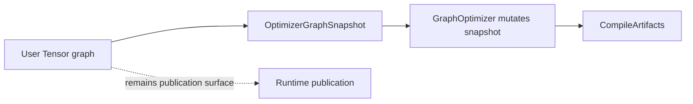

<!-- generated-by: gsd-doc-writer -->
# Graph Optimizer

Navigation: [Index](index.md#recommended-reading-paths) | [Architecture](architecture.md#optimizer-and-backend-planning) | [Backend Planning](backend-planning-and-regions.md#backend-planning-and-regions) | [Compute Flow](compute-flow.md#compile) | [Configuration](configuration.md#compileconfig) | [Testing](testing.md#targeted-test-patterns)

This document describes the current graph optimizer as implemented in `graph.optimizer`.
It intentionally does not describe backend ownership planning, region fusion, or memory planning as optimizer stages.
Those are compile-flow phases covered in [Backend Planning And Regions](backend-planning-and-regions.md#backend-planning-and-regions).

## The Boundary

The graph optimizer is a backend-neutral transformation pass over a compile-time snapshot of the tensor graph.

Backend-neutral means the rule is valid before the compiler knows whether a node will execute on CPU, Metal, CUDA, or another backend. For example, replacing `x + 0` with `x` is backend-neutral because the result is the same on every backend. Choosing a Metal ownership region is not backend-neutral because it depends on target legality, transfer cost, runtime availability, and accelerator policy.

The source of truth is:

- `src/main/java/config/compile/GraphOptimizationConfig.java`
- `src/main/java/graph/optimizer/OptimizerFactory.java`
- `src/main/java/graph/optimizer/GraphOptimizer.java`
- `src/main/java/graph/optimizer/state/OptimizerState.java`

The optimizer owns:

- algebraic rewrite, abbreviated `AR`
- constant folding, abbreviated `CF`
- common subexpression elimination, abbreviated `CSE`
- dead-code elimination, abbreviated `DCE`
- optional backend-neutral lowering, called `LOWER`

It does not own:

- backend target selection
- accelerator region discovery
- CPU natural region grouping
- region-internal fusion
- memory-slot reuse planning
- CPU vector thresholds
- BLAS provider selection
- Metal/CUDA runtime availability checks
- publication of values back to user-visible tensors

## Current Pipeline

`OptimizerFactory.create(GraphOptimizationConfig)` builds this pipeline:

```text
CLEANUP_FIXPOINT(AR -> CF -> CSE -> DCE) -> optional LOWER
```

The cleanup fixpoint is important. `AR`, `CF`, `CSE`, and `DCE` are not simply run once as separate public stages. They are placed into a `CleanupFixpointRule`, which repeats them until the graph fingerprint is stable, the structural score no longer improves, or the configured iteration limit is reached.

Example:

```text
input graph:
  y = exp(log(x)).add(0)

cleanup iteration 1:
  AR  rewrites exp(log(x)) -> x
  AR  rewrites x.add(0) -> x
  DCE removes now-unreachable exp/log/add nodes

cleanup iteration 2:
  fingerprint is stable, so the fixpoint stops
```

`LOWER` then runs once if `GraphOptimizationConfig.optionalLowering()` is enabled. In current code this is for backend-neutral operation surfaces, not backend executable lowering. A useful distinction:

- backend-neutral lowering changes graph semantics into another graph-level primitive, such as recognizing a safe `matmul + bias` form as `LINEAR`
- backend-specific lowering turns an already planned region into a target-specific executable representation, such as a Metal MPSGraph DAG or a CPU fused executable

### Canonical DAG Versus Specialization Ops

The public Tensor API owns semantic graph construction. When a differentiable operation can be expressed with existing primitives, the backward graph should stay visible as a canonical DAG. Examples:

```text
softmax backward      -> MUL, SUB, SUM over the softmax output and output gradient
logSoftmax backward   -> EXP, MUL, SUM, SUB
min/max backward      -> compare masks plus WHERE
gather backward       -> SCATTER_ADD
gatherAxis backward   -> SCATTER_AXIS_ADD
gatherNd backward     -> SCATTER_ND with ADD and batch_dims
takeAlongAxis backward -> SCATTER_ELEMENTS with ADD
slice backward        -> PAD for unit steps, SLICE_SCATTER_ADD for stepped slices
```

Legacy descriptors such as `SOFTMAX_GRAD`, `LOG_SOFTMAX_GRAD`, `GATHER_GRAD`, `TAKE_ALONG_AXIS_GRAD`, `SLICE_GRAD`, and `CROSS_ENTROPY_LOSS_INDICES_GRAD` still exist because backend coverage tests and future CPU/backend specialization experiments may instantiate them directly. Their existence does not make them the canonical semantic form. A default graph-optimizer rule must not take a public Tensor API primitive DAG and silently replace it with a legacy gradient descriptor.

If a future CPU path wants those descriptors for performance, it should be an explicit specialization decision with three properties:

- it runs after the canonical graph exists,
- it is scoped to a selected backend or runtime policy,
- the trace can report that specialization happened and can fall back to the canonical DAG.

## Compile Flow Around The Optimizer

The optimizer is one middle phase of compile, not the whole compiler.

```text
Tensor API
  -> semantic forward canonicalization
  -> backward graph build when training is needed
  -> graph optimization
       CLEANUP_FIXPOINT(AR -> CF -> CSE -> DCE)
       optional LOWER
  -> backend planning / ownership regions
  -> region optimization inside owned regions
  -> memory planning
  -> prepare-time backend lowering
  -> runtime execution
  -> publication policy
```

Terms used here:

- Semantic forward canonicalization: a pre-autograd graph rebuild that recognizes higher-level forward forms while preserving source mappings back to the user-visible tensors.
- Backward graph build: reverse-mode autodiff graph construction for trainable leaves.
- Backend planning: compile-time assignment of graph regions to CPU, Metal, CUDA, or future backends.
- Region optimization: transformation inside an already owned region, for example splitting a CPU region into fused and unit execution units.
- Memory planning: compile-time lifetime and reusable-slot analysis.
- Publication policy: runtime policy deciding which run-scoped values are copied back to public `Tensor` objects after execution.

## Configuration

`GraphOptimizationConfig` contains only graph rewrite and cleanup switches:

```java
GraphOptimizationConfig config = GraphOptimizationConfig.trainingDefaults();
```

Presets:

| Preset | Meaning |
|---|---|
| `trainingDefaults()` | Enables `AR`, `CF`, `CSE`, `DCE`, and `LOWER` with strict CSE defaults. |
| `inferenceDefaults()` | Enables the same graph stages with more aggressive CSE defaults. |
| `noGraphOptimization()` | Disables graph optimization only. Backend planning, runtime preparation, and publication policy remain separate. |
| `stages(...)` | Explicit booleans for `AR`, `CF`, `CSE`, `DCE`, and `LOWER`. |

`CompileConfig` composes this graph policy with other compile policies:

```java
CompileConfig compile = CompileConfig.training()
        .withGraphOptimization(GraphOptimizationConfig.trainingDefaults())
        .withBackendPlanning(BackendPlanningConfig.explicitOnly());
```

For a strict CPU baseline:

```java
CompileConfig baseline = CompileConfig.cpuOnlyBaseline();
```

For a no-graph-optimization benchmark that still honors explicit backend intent:

```java
CompileConfig baseline = CompileConfig.noGraphOptimizationBaseline();
```

The word "baseline" matters. `noGraphOptimizationBaseline()` is useful when comparing graph cleanup against optimized paths, but it is not a promise to disable every runtime optimization. Runtime vectorization, parallelism, BLAS, and accelerators are governed by `RuntimeConfig`.

## Rule Responsibilities

### AR

`AR` means algebraic rewrite. It applies local graph identities that preserve tensor semantics.

Examples:

```text
x + 0       -> x
x * 1       -> x
x - 0       -> x
neg(neg(x)) -> x
```

This is safe before backend planning because the identity is mathematical and backend-neutral.

Source area:

- `src/main/java/graph/optimizer/rewrite/RewriteRule.java`
- `src/main/java/graph/optimizer/rewrite/AlgebraicRewrite.java`

### CF

`CF` means constant folding. It evaluates small pure constant subgraphs during compile.

Example:

```text
Tensor.scalar(2).add(Tensor.scalar(3)) -> Tensor.scalar(5)
```

The result becomes a leaf constant in the compile snapshot. Folding is deliberately conservative because compile should not become a large eager executor.

Source area:

- `src/main/java/graph/optimizer/cf/ConstantFoldingRule.java`

### CSE

`CSE` means common subexpression elimination. It finds structurally identical subgraphs and keeps one representative.

Example:

```java
Tensor a = x.mul(w);
Tensor b = x.mul(w);
Tensor y = a.add(b);
```

If the two `mul` nodes have the same operation, inputs, dtype, shape, layout-relevant metadata, and parameters, CSE can reuse one compiled node. That reduces repeated compute and often exposes simpler downstream region planning.

Structural identity is stricter than "same Java method was called." Operations with parameters must include those parameters in the signature. For example, `sum(axis=0)` and `sum(axis=1)` are not the same expression.

Source area:

- `src/main/java/graph/optimizer/cse/CommonSubexpressionEliminationRule.java`

### DCE

`DCE` means dead-code elimination. It removes nodes that are no longer reachable from observable roots.

Observable roots include:

- the compiled forward output
- forward publication roots
- gradient publication roots in training compile

Example:

```text
before rewrite:
  y = (x + 0)

after AR:
  y maps to x
  the old ADD node has no observable path

after DCE:
  old ADD is removed from the optimized snapshot
```

Source area:

- `src/main/java/graph/optimizer/dce/DeadCodeEliminationRule.java`

### LOWER

`LOWER` means optional backend-neutral lowering. It builds a cleaner graph-level operation when the pattern is semantically known and still backend independent.

Examples:

- `matmul(input, weight) + bias` can become `linear(input, weight, bias)`
- selected loss, reduction, and attention forms can become specialized operation surfaces
- conv2d lowering follows the configured `Conv2dLoweringConfig`

Important current detail: `SCALED_DOT_PRODUCT_ATTENTION` is increasingly represented as a DAG of primitives for backend coverage. Lowering should not be used as a blanket reason to hide primitive structure when the backend planners and lowerers need to see the DAG. In other words, lowering is optional graph shaping, not a mandatory route to make attention executable.

Source area:

- `src/main/java/graph/optimizer/rewrite/LoweringRule.java`
- `src/main/java/graph/optimizer/rewrite/*LoweringRewrite.java`

## Snapshot Safety

Optimization runs on `OptimizerGraphSnapshot`, not directly on the live semantic graph. That boundary prevents repeated compiles from accumulating mutations on user-owned `Tensor` objects.



Concrete implication:

```java
Tensor y = x.add(0.0);
CompiledGraph a = y.compile();
CompiledGraph b = y.compile();
```

The second compile must not see an already-mutated original graph. Tests cover this idempotency boundary.

## What Moved Out Of The Optimizer

The old mental model treated backend partitioning, fusion, and memory planning as optimizer stages. The current code has a cleaner split:

| Concern | Current owner |
|---|---|
| Backend-neutral graph cleanup | `GraphOptimizationConfig` + `GraphOptimizer` |
| Backend ownership planning | `BackendPlanningConfig` + `BackendPlanningService` |
| CPU and accelerator region optimization | `RegionOptimizationConfig` + `RegionOptimizer` |
| Memory reuse and handoff planning | `MemoryPlanningConfig` + `MemoryPlanner` |
| Runtime backend and hardware policy | `RuntimeConfig` |
| Value publication after execution | `PublicationPolicy` |

This split is not only naming. It changes benchmark semantics. Disabling graph optimization must not silently disable explicit backend planning, backend intent normalization, prepare invariants, or runtime backend selection.

## Diagnostics

The compile trace separates optimizer and backend planning evidence:

- `CompileTrace.optimizerTrace()` explains graph optimizer rule behavior.
- `CompileTrace.partitionPlanning()` explains backend planning decisions and rejected candidates.
- `PrepareTrace.backendSelection()` explains prepare-time backend selection among compiled candidates.
- `RunTrace.steps()` explains what actually executed.

Use the smallest diagnostic surface that matches the question:

| Question | Better evidence |
|---|---|
| Did AR or CSE change graph shape? | Optimizer trace and compiled node list |
| Why did a Metal region not appear? | Backend planning trace |
| Why did a planned Metal region execute on CPU? | Prepare trace and run step fallback metadata |
| Why did a tensor value get copied back to CPU? | Publication policy, run trace, materialization metadata |

## Adding A Graph Optimization Change

When adding or changing a graph optimization:

1. Confirm the transformation is backend-neutral.
2. Add the rule in the graph optimizer package that owns the concern.
3. Preserve source mappings and observable roots.
4. Add a focused unit test for graph shape.
5. Add a value-level regression test when the rewrite changes numerical structure.
6. If the change affects backend planning visibility, also test compile traces or backend planning jobs.

Focused tests commonly used for this layer:

```bash
./gradlew test --tests graph.optimizer.*
./gradlew test --tests CommonSubexpressionEliminationRuleTest
./gradlew test --tests AlgebraicRewritingPowTest
./gradlew test --tests graph.SemanticForwardCanonicalizationCompileTest
```

## See Also

- [Backend Planning And Regions](backend-planning-and-regions.md#backend-planning-and-regions)
- [Configuration](configuration.md#compileconfig)
- [Compute Flow](compute-flow.md#compile)
- [Metal Backend](metal-backend.md#end-to-end-flow)
