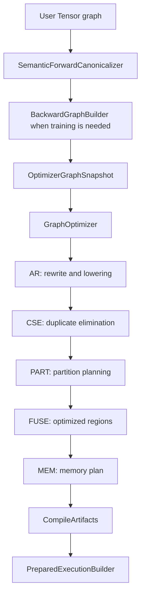
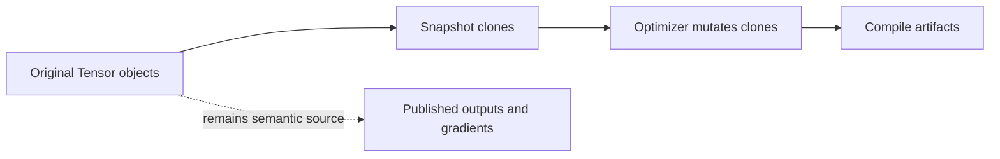
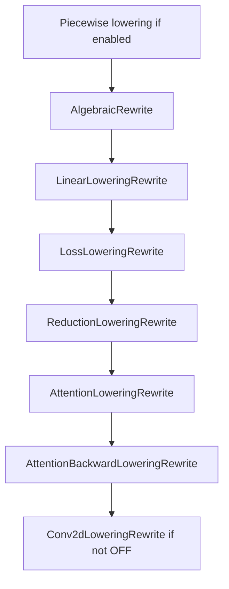
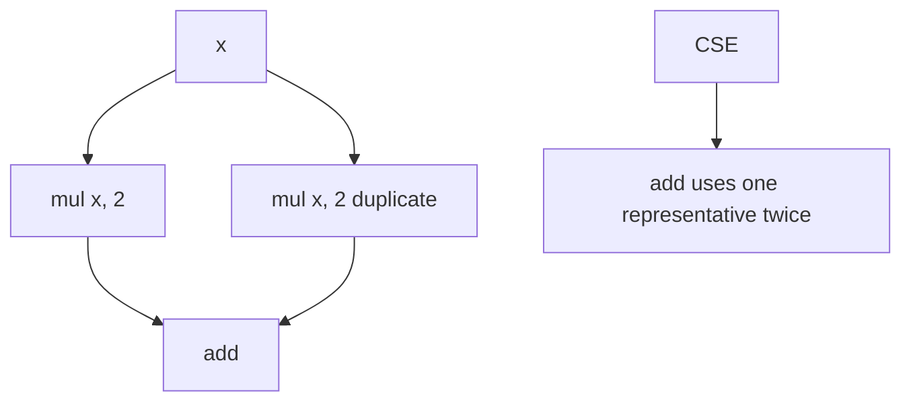
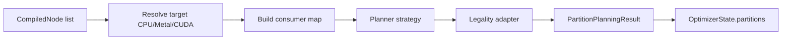
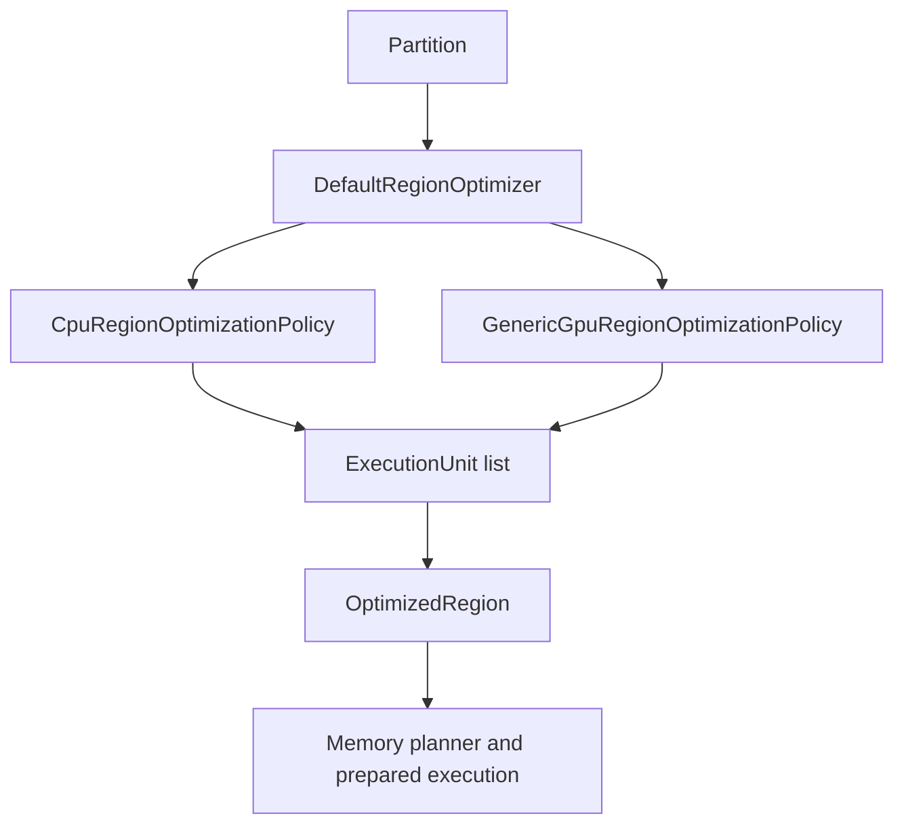
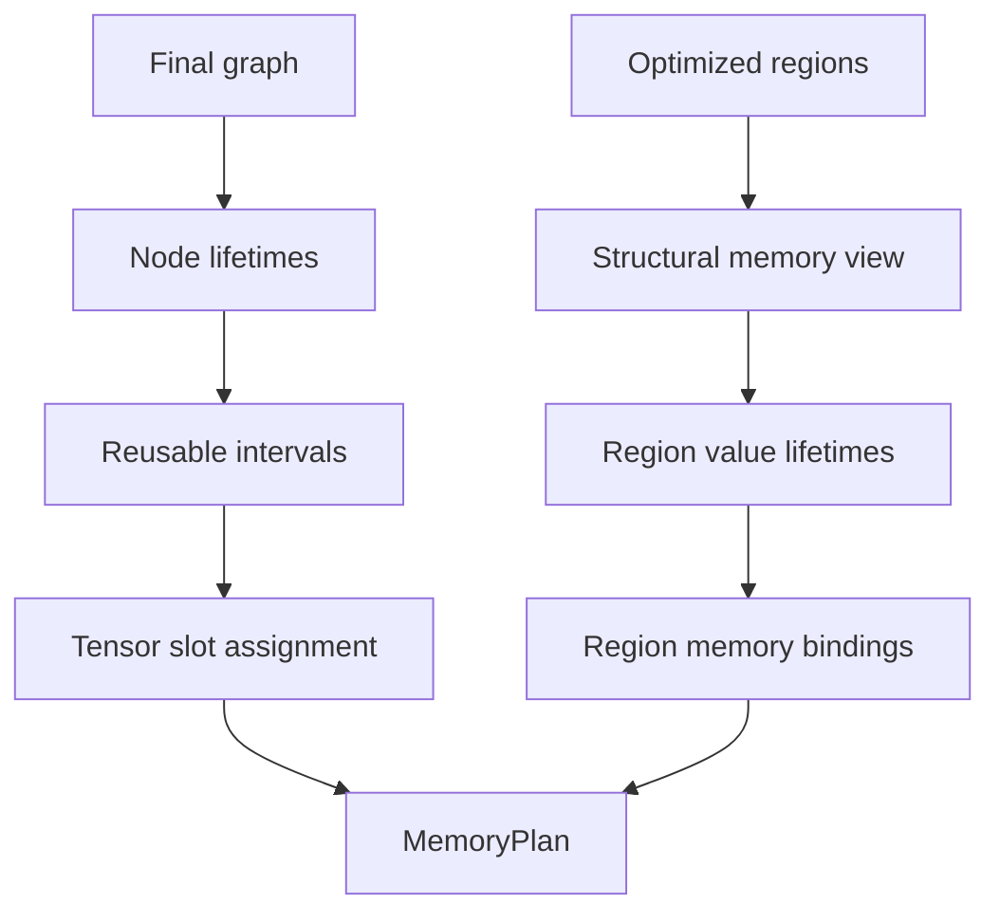
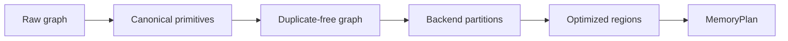

<!-- generated-by: gsd-doc-writer -->
# Graph Optimizer Guide

Navigation: [Index](index.md) | [Architecture](architecture.md) | [Compute Flow](compute-flow.md) | [Mechanisms](mechanisms.md) | [Configuration](configuration.md) | [Testing](testing.md)

This guide explains the graph optimizer as a compile-time transformation pipeline over a cloned tensor DAG. It is written for contributors who need to reason about optimizer behavior, add rules, debug stage interactions, or understand why the default stage order is `AR -> CSE -> PART -> FUSE -> MEM`.

## Table of Contents

- [Mental Model](#mental-model)
- [Compiler Boundary](#compiler-boundary)
- [OptimizerConfig](#optimizerconfig)
- [Stage Ordering](#stage-ordering)
- [OptimizerState](#optimizerstate)
- [OptimizerTrace](#optimizertrace)
- [Stage AR: Rewrite and Lowering](#stage-ar-rewrite-and-lowering)
- [Stage CSE: Common Subexpression Elimination](#stage-cse-common-subexpression-elimination)
- [Stage PART: Partition Planning](#stage-part-partition-planning)
- [Stage FUSE: Region Optimization and Fusion](#stage-fuse-region-optimization-and-fusion)
- [Stage MEM: Memory and Lifetime Planning](#stage-mem-memory-and-lifetime-planning)
- [How the Stages Work Together](#how-the-stages-work-together)
- [Adding or Changing Optimizer Behavior](#adding-or-changing-optimizer-behavior)

## Mental Model

The optimizer is not a runtime executor. It is an ordered list of `OptimizationRule` instances that transforms a topologically sorted compile-time graph snapshot and publishes analysis artifacts for later lowering and prepared execution.



The optimizer owns graph structure and compile-time planning artifacts:

- replacing an algebraic expression with an equivalent simpler expression
- lowering a recognizable pattern into a specialized operation
- merging duplicate subgraphs
- identifying backend partitions
- creating optimized region execution units
- planning storage reuse and region handoff memory

It does not choose CPU vector width, worker count, BLAS thresholds, approximation mode, or machine code layout. Those choices belong to backend preparation and runtime configuration.

Compared with naive execution, the naive path executes each graph node independently and allocates outputs according to the raw graph. The optimized path tries to reduce the number of semantic operations that survive, reduce repeated computation, group backend-friendly regions, and reuse storage where lifetimes permit.

## Compiler Boundary

The optimizer is reached through `CompiledGraph.compile(...)` in [`CompiledGraph.java`](../src/main/java/graph/CompiledGraph.java). When an `OptimizerConfig` is supplied, `CompiledGraph` creates both:

- a `SemanticForwardCanonicalizer` via `OptimizerFactory.createSemanticForwardCanonicalizer(config)`
- a `GraphOptimizer` via `OptimizerFactory.create(config)`

`GraphCompiler` then decides whether it is compiling forward-only inference or a joint forward/backward graph. It canonicalizes the forward graph, optionally builds backward graph targets, captures an optimizer snapshot, runs the optimizer, and stores the final graph plus optimizer artifacts in `CompileArtifacts`.

The snapshot boundary is important. [`OptimizerGraphSnapshot`](../src/main/java/graph/compile/OptimizerGraphSnapshot.java) clones topology, backward markers, gradients, backend hints, backward functions, and leaf values before rules run. Optimizer rules may rewire the cloned graph without mutating the user's original semantic graph. Tests in [`CompiledGraphIdempotencyTest.java`](../src/test/java/CompiledGraphIdempotencyTest.java) verify that repeated compiles do not grow the original graph and that optimizer mutation does not change the original inference graph topology.



## OptimizerConfig

[`OptimizerConfig`](../src/main/java/config/optimizer/OptimizerConfig.java) is the public switchboard for the optimizer. It contains:

| Field | Purpose |
| --- | --- |
| `stageOrder` | Ordered list of `OptimizerStage` values to run once. |
| `rewrite` | AR-stage rewrite and lowering options. |
| `cse` | CSE safety mode. |
| `fuse` | Region optimization and fusion policy. |
| `memory` | Memory reuse policy. |
| `partition` | Partition planner search, scoring, strategy, and target settings. |

Current presets:

| Preset | Stage order | Notable settings |
| --- | --- | --- |
| `OptimizerConfig.noOptimization()` | empty | Strict CSE, training fuse defaults, memory defaults, but no stages run. |
| `OptimizerConfig.trainingDefaults()` | `AR, CSE, PART, FUSE, MEM` | Strict CSE, training fuse defaults. |
| `OptimizerConfig.inferenceDefaults()` | `AR, CSE, PART, FUSE, MEM` | Aggressive CSE, inference fuse defaults. |

The factory mapping lives in [`OptimizerFactory.java`](../src/main/java/graph/optimizer/OptimizerFactory.java):

| Stage | Rule |
| --- | --- |
| `AR` | `RewriteRule(config.rewrite())` |
| `CSE` | `CommonSubexpressionEliminationRule(config.cse())` |
| `PART` | `PartitionIntentRule(config.partition())` |
| `FUSE` | `RegionOptimizationRule(config.fuse())` |
| `MEM` | `MemoryOptimizerRule(MemoryPlannerPolicy.fromConfig(config.memory()))` |

`GraphOptimizer` is single-pass. [`GraphOptimizerSinglePassTest.java`](../src/test/java/graph/optimizer/GraphOptimizerSinglePassTest.java) verifies that configured rules are applied exactly once in list order.

## Stage Ordering

The default order is:

```text
AR -> CSE -> PART -> FUSE -> MEM
```

That order is not arbitrary.

| Order | Why it runs here |
| --- | --- |
| `AR` first | Rewrites and lowerings create cleaner, more canonical graph shapes. Later stages should see `LINEAR`, `CROSS_ENTROPY_LOSS_INDICES`, attention primitives, simplified arithmetic, and optional conv GEMM forms rather than ad hoc decompositions. |
| `CSE` second | Duplicate elimination is more effective after AR has removed algebraic noise and canonicalized patterns. It also reduces the graph before partition search. |
| `PART` third | Partition planning needs the finalized structural graph and backend intents, but must run before region optimization because FUSE consumes `Partition` artifacts. |
| `FUSE` fourth | Region optimization uses partitions to build `OptimizedRegion` and `ExecutionUnit` artifacts. It is not a general graph rewrite pass and currently does not operate without partition state. |
| `MEM` last | Memory planning must see the final graph, partitions, and optimized regions so lifetimes, materialization decisions, region values, and handoff requirements are consistent with what prepared execution will lower. |

The constructor enforces only the hard dependencies:

- `FUSE` requires `PART`.
- `PART` must run before `FUSE` when both are present.
- `MEM` requires `FUSE`.
- Duplicate stages and `null` stages are rejected.

`AR` and `CSE` are not hard-constrained relative to each other. [`AbcStageOrderCompileRegressionTest.java`](../src/test/java/AbcStageOrderCompileRegressionTest.java) exercises a custom order with `CSE` before `AR`. That compile path is legal, but it is not the default mental model because CSE-before-AR can miss duplicates that only become identical after rewriting.

## OptimizerState

[`OptimizerState`](../src/main/java/graph/optimizer/state/OptimizerState.java) is the data contract between stages. It carries both the current graph and accumulated downstream artifacts:

| Field | Meaning |
| --- | --- |
| `graph` | Current topologically sorted tensor graph snapshot. |
| `forwardOutput` | Tensor that represents the compiled forward output inside the current graph. |
| `executionMode` | `FORWARD` or `FORWARD_BACKWARD` metadata for planning. |
| `supportsBackward` | Whether the compiled graph includes backward execution. |
| `forwardBoundaryNodeId` | Index of the forward output boundary in the graph. |
| `partitions` | `PART` output. |
| `partitionPlansById` | Backend-attached plans keyed by partition id. |
| `optimizedRegions` | `FUSE` output. |
| `memoryPlan` | `MEM` output. |
| `trace` | Generic optimizer trace object. |

The `with...` methods intentionally clear later-stage artifacts when an earlier artifact changes:

- `withGraph(...)` clears partitions, optimized regions, and memory plan.
- `withPartitions(...)` clears optimized regions and memory plan.
- `withOptimizedRegions(...)` clears memory plan.
- `withMemoryPlan(...)` preserves everything before it.

This reset behavior protects the pipeline from stale artifacts. For example, if a graph rewrite changes inputs, any partition or memory plan from the old graph is no longer valid.

## OptimizerTrace

[`OptimizerTrace`](../src/main/java/graph/optimizer/state/OptimizerTrace.java) is currently a small record containing `List<String> events`. `OptimizerState` preserves it by default, but the optimizer rules in the source focus do not currently append stage-level events to this generic trace.

Do not confuse it with more specific trace models:

- `PartitionCompileTrace` and `PartitionDecisionTrace` are produced by partition planners.
- `RegionOptimizationTrace` is attached to optimized regions and execution units.
- `MemoryPlan.explain()` renders memory planning details and summaries.

Needs verification: if future rules start appending to `OptimizerTrace`, this guide should be updated with the event schema and expected stage ownership.

## Stage AR: Rewrite and Lowering

### Problem Solved

Naive graph construction often produces locally correct but mechanically noisy graphs:

- algebraic identities such as `x + 0`
- decomposed expressions such as `1 / x`
- imported piecewise patterns such as `where(gt(x, 0), x, zeros_like(x))`
- composite operations such as `matmul(input, weight) + bias`
- backward patterns for softmax, log-softmax, attention, and indexed cross entropy

`AR` turns those into cleaner and often more specialized graph forms before any structural planning happens.

### Mental Model

Think of `AR` as semantic cleanup plus primitive recognition. It walks a topologically sorted graph, rewires inputs that were already replaced, and replaces the current tensor when it recognizes an equivalent representation.

It is not an outer fixpoint. The public `AR` stage runs once, but `RewriteRule` is itself a sequence of delegates.



### Key Concepts

- `RewriteRule`: composite AR stage wrapper in [`RewriteRule.java`](../src/main/java/graph/optimizer/rewrite/RewriteRule.java).
- `AbstractRewriteRule`: common local rewrite template in [`AbstractRewriteRule.java`](../src/main/java/graph/optimizer/rewrite/AbstractRewriteRule.java).
- Observable roots: consumer-free sinks and gradient roots that must remain reachable.
- Replacement map: maps old tensors to replacement tensors during a pass.
- Closure rebuild: recreates a clean topological list from observable roots after rewrites.
- Semantic forward canonicalization: a pre-optimizer forward-only rebuild in [`SemanticForwardCanonicalizer.java`](../src/main/java/graph/SemanticForwardCanonicalizer.java) that can canonicalize selected forward patterns before backward graph construction.

### Where It Lives

- [`config/optimizer/RewriteConfig.java`](../src/main/java/config/optimizer/RewriteConfig.java)
- [`config/optimizer/AlgebraicRewriteConfig.java`](../src/main/java/config/optimizer/AlgebraicRewriteConfig.java)
- [`config/optimizer/LinearLoweringConfig.java`](../src/main/java/config/optimizer/LinearLoweringConfig.java)
- [`config/optimizer/Conv2dLoweringConfig.java`](../src/main/java/config/optimizer/Conv2dLoweringConfig.java)
- [`config/optimizer/PiecewiseLoweringConfig.java`](../src/main/java/config/optimizer/PiecewiseLoweringConfig.java)
- [`graph/optimizer/rewrite`](../src/main/java/graph/optimizer/rewrite)
- Tests such as [`AlgebraicRewritingPowTest.java`](../src/test/java/AlgebraicRewritingPowTest.java), [`AlgebraicRewritingDivInvTest.java`](../src/test/java/AlgebraicRewritingDivInvTest.java), [`LinearLoweringRuleTest.java`](../src/test/java/LinearLoweringRuleTest.java), [`AttentionLoweringTest.java`](../src/test/java/AttentionLoweringTest.java), [`CrossEntropyLossFromIndicesLoweringTest.java`](../src/test/java/CrossEntropyLossFromIndicesLoweringTest.java), and [`Conv2dLoweringRuleTest.java`](../src/test/java/Conv2dLoweringRuleTest.java).

### Step-by-Step Walkthrough

1. `OptimizerFactory` creates `new RewriteRule(config.rewrite())`.
2. `RewriteRule` builds delegates in this order:
   - optional `PiecewiseLoweringRewrite`
   - `AlgebraicRewrite`
   - `LinearLoweringRewrite`
   - `LossLoweringRewrite`
   - `ReductionLoweringRewrite`
   - `AttentionLoweringRewrite`
   - `AttentionBackwardLoweringRewrite`
   - optional `Conv2dLoweringRewrite`
3. Each delegate receives an `OptimizerState`.
4. Most delegates use `AbstractRewriteRule.apply(...)`.
5. The pass records observable roots before editing.
6. It walks graph nodes in topological order.
7. Before visiting a node, it rewrites that node's inputs through prior replacements.
8. It calls `rewriteTensor(tensor)`.
9. If a replacement is returned, the pass preserves backward markers where needed, records the replacement, and adds the replacement to the temporary output list.
10. After the walk, gradient references are resolved through the replacement map.
11. If closure rebuild is enabled, the pass rebuilds a reachable topological closure from resolved roots.
12. The pass returns `state.withGraph(...)`, which also clears downstream artifacts.

### Worked Example With Concrete Values

Source expression:

```java
Tensor x = new Tensor(new double[]{2.0, 4.0}, new int[]{2}, null, "x", DataType.FLOAT64);
Tensor y = x.pow(2.0).add(Tensor.scalar(0.0, DataType.FLOAT64));
```

Naive graph:

```text
node 0: x              value [2, 4]
node 1: pow(x, 2)      value [4, 16]
node 2: scalar 0       value [0]
node 3: add(node1, 0)  value [4, 16]
```

AR can rewrite:

```text
pow(x, 2) -> mul(x, x)
add(mul(x, x), 0) -> mul(x, x)
```

Optimized graph:

```text
node 0: x              value [2, 4]
node 1: mul(x, x)      value [4, 16]
```

The numerical result is unchanged, but later CSE and fusion see a simpler expression.

### Implementation Details

Algebraic rewrites in [`AlgebraicRewrite.java`](../src/main/java/graph/optimizer/rewrite/AlgebraicRewrite.java) include identities for `ADD`, `SUB`, `MUL`, `MUL_SCALAR`, `DIV`, `POW`, `NEG`, `LOG`, `EXP`, `INV`, `SQRT`, `CLAMP_MIN`, and `CLAMP_MAX`. Many individual transforms are guarded by system properties such as `cg.optimizer.ar.disablePow2ToMul` and `cg.optimizer.ar.disableDivInvToMul`, which makes targeted experiments possible.

Piecewise lowering is disabled by default because `PiecewiseLoweringConfig.defaults()` sets all branches to `false`. When enabled, [`PiecewiseLoweringRewrite.java`](../src/main/java/graph/optimizer/rewrite/PiecewiseLoweringRewrite.java) can lower:

- `inv(add(1, exp(neg(x))))` or `inv(add(1, exp(mulScalar(x, -1))))` to `sigmoid(x)`
- `where(gt(x, 0), x, zeros_like(x))` to `relu(x)`
- `where(lt(x, t), t, x)` to `clampMin(x, t)`
- `where(gt(x, t), t, x)` to `clampMax(x, t)`

Linear lowering in [`LinearLoweringRewrite.java`](../src/main/java/graph/optimizer/rewrite/LinearLoweringRewrite.java) recognizes `add(matmul(input, weight), bias)` or the commuted add form. Requirements include rank-2 `weight`, rank-1 `bias`, matching output feature size, and matching leading batch dimensions.

Loss lowering includes forward and backward forms:

- [`LossForwardLoweringRewrite.java`](../src/main/java/graph/optimizer/rewrite/LossForwardLoweringRewrite.java) recognizes `logSoftmax -> gather -> neg` and optional outer `sum` or `mean`, lowering to `crossEntropyLossFromIndices`.
- [`LossBackwardLoweringRewrite.java`](../src/main/java/graph/optimizer/rewrite/LossBackwardLoweringRewrite.java) recognizes the indexed cross-entropy gradient pattern and lowers to `crossEntropyLossIndicesGrad`.

Reduction lowering in [`ReductionLoweringRewrite.java`](../src/main/java/graph/optimizer/rewrite/ReductionLoweringRewrite.java) recognizes backward-only softmax and log-softmax gradient expressions and lowers them to `softmaxGrad` or `logSoftmaxGrad`.

Attention lowering in [`AttentionLoweringRewrite.java`](../src/main/java/graph/optimizer/rewrite/AttentionLoweringRewrite.java) recognizes:

```text
softmax((q.matmul(k.permute(...)) * positiveScale)).matmul(v)
```

and the masked variant using `where(mask, scores, maskFillScalar)`, then lowers to `scaledDotProductAttention`. [`AttentionBackwardLoweringRewrite.java`](../src/main/java/graph/optimizer/rewrite/AttentionBackwardLoweringRewrite.java) recognizes backward graph fragments and lowers query, key, and value gradients to `scaledDotProductAttentionBackward`.

Conv2d lowering in [`Conv2dLoweringRewrite.java`](../src/main/java/graph/optimizer/rewrite/Conv2dLoweringRewrite.java) maps supported conv ops to explicit GEMM variants. `Conv2dLoweringMode.OFF` disables the pass, `ALWAYS` lowers every matched conv op, and `HEURISTIC` uses [`Conv2dLoweringHeuristics.java`](../src/main/java/graph/optimizer/rewrite/Conv2dLoweringHeuristics.java). Current heuristic requirements include rank-4 shapes, `groups == 1`, dilation of `1`, and either large pointwise projection or large standard 3x3 convolution shapes.

### Edge Cases

- `AlgebraicRewrite` skips tensors with `null` operation and tensors whose operation type is `FUSED`.
- Constant matching generally requires a non-trainable scalar leaf with compatible numeric value.
- Some mathematically valid identities may not be safe for all floating-point edge cases. Existing rules are implementation choices, not a symbolic algebra system.
- `SemanticForwardCanonicalizer` has a limited rebuild set. If it cannot rebuild a touched forward subgraph, it returns the original forward graph.
- `Conv2dLoweringMode.HEURISTIC` intentionally does not lower depthwise/grouped convs because `groups != 1` fails the heuristic.
- Backward lowerings check `tensor.isBackward()` before rewriting gradient-only patterns.

### Common Misconceptions

- `AR` is not only algebraic simplification; it is also the home for many structural lowerings.
- `AR` does not execute any tensor values. It rewrites graph nodes.
- A lowering is not always "lower level" in the user API sense. For example, `matmul + bias` lowers to a higher-level `LINEAR` primitive because that is the backend-friendly representation.
- The semantic forward canonicalizer is not the same object as the AR stage, even though both use `RewriteConfig` and recognize some similar patterns.

### Related Mechanisms

- CSE benefits from canonical graph shapes produced by AR.
- PART should see lowered backend-friendly primitives.
- FUSE can make better region decisions after algebraic noise is removed.
- MEM must run after AR because rewrites change tensor ownership and lifetimes.

## Stage CSE: Common Subexpression Elimination

### Problem Solved

Naive graph construction can produce duplicate computations. If two graph nodes compute the same expression from the same inputs and parameters, executing both wastes work and can also enlarge later partitions and memory plans.

`CSE` keeps one representative node and rewires duplicate nodes to use that representative.

### Mental Model

`CSE` is structural, not numerical. It does not compare full tensor values, run kernels, or prove arbitrary algebraic equivalence. It builds structural signatures for operation nodes while walking the graph in topological order.



### Key Concepts

- Structural signature: operation type, backward flag, operation parameters, and input signatures.
- Strict safety: includes `requiresGrad`, resolved backend, and output shape in signatures.
- Aggressive safety: omits those strict fields but still includes operation parameters, inputs, and backward flag.
- Leaf signature: trainable leaves and most leaves are identity-based; scalar non-grad leaves can be signatured by scalar bits and shape.
- Commutative input sorting: currently only `ADD` and `MUL` sort input signatures.

### Where It Lives

- [`config/optimizer/CseConfig.java`](../src/main/java/config/optimizer/CseConfig.java)
- [`graph/optimizer/cse/CommonSubexpressionEliminationRule.java`](../src/main/java/graph/optimizer/cse/CommonSubexpressionEliminationRule.java)
- [`CommonSubexpressionEliminationRuleTest.java`](../src/test/java/CommonSubexpressionEliminationRuleTest.java)

### Step-by-Step Walkthrough

1. Record observable roots from the current graph.
2. Walk nodes in topological order.
3. Rewrite the node's inputs through prior CSE replacements.
4. Generate a structural signature for operation nodes.
5. If the signature is `null`, keep the node.
6. If the signature already exists, mark the current tensor as replaced by the existing representative.
7. If the signature is new, remember the current tensor as the representative.
8. Preserve backward markers when a backward node is merged into an existing representative.
9. Resolve gradient references through the replacement map.
10. Rebuild a clean topological closure from observable roots.
11. Return `state.withGraph(...)`.

### Worked Example With Concrete Values

Expression:

```java
Tensor a = new Tensor(new double[]{1, 2}, new int[]{2}, null, "a");
Tensor b = new Tensor(new double[]{3, 4}, new int[]{2}, null, "b");
Tensor left = a.add(b);
Tensor right = b.add(a);
Tensor out = left.mul(right);
```

Naive values:

```text
left  = [4, 6]
right = [4, 6]
out   = [16, 36]
```

Because `ADD` is commutative, CSE can treat `add(a, b)` and `add(b, a)` as the same structural expression:

```text
left = add(a, b)
out  = mul(left, left)
```

The output remains `[16, 36]`, and one add is removed.

### Implementation Details

[`CommonSubexpressionEliminationRule.generateSignature(...)`](../src/main/java/graph/optimizer/cse/CommonSubexpressionEliminationRule.java) refuses to signature:

- leaves
- `noop`
- `FusedOperation`
- operations whose op type is `FUSED`
- operation classes whose lowercase simple class name contains `random` or `dropout`
- nodes without inputs

The operation parameter key covers many operation-specific fields, including reduction axes and `keepDims`, softmax/log-softmax dimensions, norm epsilon, loss class dimensions and reductions, layout targets, gather/scatter axes, attention scale and mask presence, linear bias presence, conv options, and pool options.

Strict versus aggressive behavior is controlled by `CseConfig.strictSafety()`:

| Mode | Preset | Signature includes |
| --- | --- | --- |
| Strict | training defaults | `opType`, backward flag, `requiresGrad`, backend, output shape, op parameters, input signatures |
| Aggressive | inference defaults | `opType`, backward flag, op parameters, input signatures |

Important detail: dtype is not an explicit top-level field in the current CSE signature. If a future change depends on dtype-sensitive CSE separation, add tests before changing safety mode assumptions.

### Edge Cases

- Separate trainable leaves with identical values are not merged because trainable leaves are identity-based.
- Scalar non-grad leaves can be structurally signatured, but non-scalar leaves remain identity-based.
- `SUM` variants with different `keepDims` are distinct; [`CommonSubexpressionEliminationRuleTest.java`](../src/test/java/CommonSubexpressionEliminationRuleTest.java) covers this.
- `PERMUTE` variants with different axes are distinct, including in aggressive mode.
- CSE does not currently treat `SUB`, `DIV`, `MIN`, or `MAX` as commutative.

### Common Misconceptions

- CSE does not simplify `x + 0`; that is AR.
- CSE does not fold constants.
- CSE does not know that `x * 2` and `x + x` are equivalent unless AR has already rewritten one form into the other.
- Aggressive CSE is still structural. It is not a numerical equivalence engine.

### Related Mechanisms

- AR should usually run before CSE so equivalent forms are easier to recognize.
- PART benefits from a smaller graph after CSE.
- MEM sees fewer temporary lifetimes when duplicate computations are removed.

## Stage PART: Partition Planning

### Problem Solved

Backends need contiguous, legal regions of the graph to lower as a unit. Naive execution treats every node as a separate prepared step. Partition planning identifies backend-targeted regions, records boundaries, and attaches backend plans when a legality adapter can lower the candidate.

### Mental Model

`PART` asks: "Which connected runs of nodes can this target backend own, and where must values cross region boundaries?"

It does not fuse elementwise code itself. It creates `Partition` artifacts for FUSE and backend selection.



### Key Concepts

- `PartitionTarget`: backend target such as `CPU`, `GPU_METAL`, `GPU_CUDA`, `AUTO`, or `NONE`.
- `PartitionPlanningContext`: runtime config, backward support flag, compiled nodes, and consumer map.
- `PartitionPlanningRequest`: target, strategy, score policy, legality adapter, and required materialized values.
- `Partition`: accepted region with ordered node ids, values, internal edges, boundary edges, external inputs, output refs, and debug trace.
- `PartitionPlan`: backend-specific attached plan with backend, anchor node, node ids, external inputs, produced outputs, and estimated work.
- Required materialized values: forward output and gradient publication targets that must remain materialized at region boundaries.

### Where It Lives

- [`config/optimizer/PartitionConfig.java`](../src/main/java/config/optimizer/PartitionConfig.java)
- [`graph/optimizer/partition/PartitionIntentRule.java`](../src/main/java/graph/optimizer/partition/PartitionIntentRule.java)
- [`graph/optimizer/partition/GreedyMaxRegionPartitionPlanner.java`](../src/main/java/graph/optimizer/partition/GreedyMaxRegionPartitionPlanner.java)
- [`graph/optimizer/partition/ScoredCandidatePartitionPlanner.java`](../src/main/java/graph/optimizer/partition/ScoredCandidatePartitionPlanner.java)
- [`graph/compile/PartitionPlanningSnapshotBuilder.java`](../src/main/java/graph/compile/PartitionPlanningSnapshotBuilder.java)

### Step-by-Step Walkthrough

1. `PartitionIntentRule.apply(...)` receives the current optimizer state.
2. It propagates backend intent through `BackendIntentPropagator.propagateBackwardClosure(...)`.
3. It snapshots the current graph into `CompiledNode` records.
4. It resolves the target:
   - configured non-`AUTO` target wins
   - otherwise the first GPU Metal or CUDA backend node wins
   - otherwise CPU wins if any CPU node appears
   - otherwise target is `NONE`
5. If target is `NONE`, the state is returned with no partitions.
6. It builds a consumer map from compiled node input ids.
7. It builds a `PartitionPlanningContext`.
8. It selects the planner strategy:
   - `GREEDY_MAX_REGION`
   - `SCORED_CANDIDATE_SEARCH`
9. It asks the target legality adapter to seed, expand, create structural candidates, and attach plans.
10. It returns `state.withPartitions(planning.partitions(), planning.plansByPartitionId())`.

### Worked Example With Concrete Values

Graph:

```java
Tensor a = new Tensor(new float[]{1, 2, 3, 4}, new int[]{4}, null, "a", DataType.FLOAT32);
Tensor b = new Tensor(new float[]{5, 6, 7, 8}, new int[]{4}, null, "b", DataType.FLOAT32);
Tensor out = a.add(b).relu();
```

Topological graph:

```text
node 0: a leaf        [1, 2, 3, 4]
node 1: b leaf        [5, 6, 7, 8]
node 2: add(0, 1)     [6, 8, 10, 12]
node 3: relu(2)       [6, 8, 10, 12]
```

With a CPU target, a legal partition can be:

```text
partitionId: cpu-2
target: CPU
orderedNodeIds: [2, 3]
externalInputNodeIds: [0, 1]
outputValueRefs: [node-3]
internalEdges: 2 -> 3
boundaryEdges: 0 -> 2, 1 -> 2
```

Naive execution prepares separate add and relu steps. Partitioned execution gives later stages one region they can optimize as a unit.

### Implementation Details

`PartitionConfig.defaults()` uses:

```text
maxSearchNodes = 16
maxVisitedCandidates = 512
nodeWeight = 1000.0
internalEdgeWeight = 120.0
mergeNodeBonus = 450.0
tailDepthWeight = 80.0
externalInputPenalty = 60.0
workWeight = 1.0
plannerStrategy = GREEDY_MAX_REGION
target = AUTO
```

`GreedyMaxRegionPartitionPlanner` walks compiled nodes in order. For each uncovered target-backend node, it tries to seed a region, absorbs supported producer closure, validates a structural candidate, attaches a backend plan, then expands through consumers until the frontier is exhausted or a budget stops the search. It records decision reasons such as `unsupported-start-node`, `lowerer-rejected`, `covered-by-earlier-partition`, `external-input-not-allowed`, `max-search-nodes`, and `budget-stop`.

`ScoredCandidatePartitionPlanner` explores candidate sets up to `maxVisitedCandidates`, keeps the best structural and best accepted candidates by score, and accepts only candidates for which the backend adapter can create a plan.

`PartitionPlanningSnapshotBuilder` repeats similar planning after `CompiledNode` snapshots are rebuilt in `GraphCompiler`. It stores compile artifacts such as partitions, attached backend plans, backend selection candidates, and `PartitionCompileTrace`.

### Edge Cases

- A configured target of `NONE` or an auto-resolved target of `NONE` produces no partitions.
- Nodes already covered by an earlier partition are not reused by later partitions.
- The legality adapter can reject a structurally plausible candidate.
- Required forward outputs and gradient bindings are carried into planning so they are not accidentally virtualized away.
- `PartitionPlanningSnapshotBuilder.backendSelectionCandidates(...)` filters backend selection candidates to non-CPU plans. CPU partitions can still exist, but backend selection candidates are currently for accelerator plans.

### Common Misconceptions

- PART does not mean every node is placed into a partition.
- PART does not perform elementwise fusion.
- A `Partition` is not the same as a backend executable. It is a planning artifact that may carry an attached backend plan.
- `PartitionConfig` scoring weights guide candidate selection; they do not guarantee a backend can lower the selected structure.

### Related Mechanisms

- FUSE consumes `OptimizerState.partitions()`.
- MEM uses partitions and optimized regions to build structural memory views.
- Backend legality adapters and lowerers determine what a target can actually accept.

## Stage FUSE: Region Optimization and Fusion

### Problem Solved

Naive partitioned execution can still run each operation in a partition independently. Elementwise chains such as `add -> relu -> tanh` are often better represented as one execution unit with virtual intermediate values.

`FUSE` converts partitions into optimized regions and execution units.

### Mental Model

`FUSE` is region optimization, not direct tensor mutation. In the current implementation, [`RegionOptimizationRule`](../src/main/java/graph/optimizer/region/RegionOptimizationRule.java) does not replace graph nodes with `FUSED` tensor operations. It publishes `OptimizedRegion` artifacts that later preparation can lower into fused backend execution.



### Key Concepts

- `OptimizedRegion`: region id, source partition, target, execution units, region values, materialized outputs, and trace.
- `ExecutionUnit`: either `FUSED_ELEMENTWISE` or `SINGLE_OP`.
- `RegionValue`: value produced in a region with transport kind and type contract.
- `ValueTransportKind.MATERIALIZED`: value must have materialized storage.
- `ValueTransportKind.CONTINUATION`: value can continue across units or regions without becoming a normal graph materialization point.
- `ValueTransportKind.VIRTUAL`: value is internal and does not need storage.
- `opType().isFusable()`: operation metadata used to decide fusable elementwise candidates.

### Where It Lives

- [`config/optimizer/FuseConfig.java`](../src/main/java/config/optimizer/FuseConfig.java)
- [`graph/optimizer/region/RegionOptimizationRule.java`](../src/main/java/graph/optimizer/region/RegionOptimizationRule.java)
- [`graph/optimizer/region/DefaultRegionOptimizer.java`](../src/main/java/graph/optimizer/region/DefaultRegionOptimizer.java)
- [`graph/optimizer/region/CpuRegionOptimizationPolicy.java`](../src/main/java/graph/optimizer/region/CpuRegionOptimizationPolicy.java)
- [`graph/optimizer/region/GenericGpuRegionOptimizationPolicy.java`](../src/main/java/graph/optimizer/region/GenericGpuRegionOptimizationPolicy.java)
- [`graph/optimizer/region/RegionOptimizationUnitSupport.java`](../src/main/java/graph/optimizer/region/RegionOptimizationUnitSupport.java)
- [`DefaultRegionOptimizerTest.java`](../src/test/java/graph/optimizer/region/DefaultRegionOptimizerTest.java)
- [`OptimizerFuseTest.java`](../src/test/java/OptimizerFuseTest.java)

### Step-by-Step Walkthrough

1. `RegionOptimizationRule.apply(...)` checks `state.partitions()`.
2. If no partitions exist, it returns the state with an empty optimized region list.
3. It snapshots the current graph into `CompiledNode` records.
4. It creates a `RegionOptimizationContext` with compiled nodes and `FuseConfig`.
5. It optimizes every partition through `DefaultRegionOptimizer`.
6. `DefaultRegionOptimizer` chooses policy by target:
   - CPU target uses `CpuRegionOptimizationPolicy`.
   - non-CPU targets use `GenericGpuRegionOptimizationPolicy`.
7. The policy builds execution units.
8. The optimizer maps each partition value into a `RegionValue` with a transport kind.
9. It returns `state.withOptimizedRegions(regions)`.

### Worked Example With Concrete Values

Graph:

```java
Tensor a = new Tensor(new float[]{1, -2, 3, -4}, new int[]{4}, null, "a", DataType.FLOAT32);
Tensor b = new Tensor(new float[]{10, 20, 30, 40}, new int[]{4}, null, "b", DataType.FLOAT32);
Tensor out = a.add(b).relu().tanh();
```

Values:

```text
add  = [11, 18, 33, 36]
relu = [11, 18, 33, 36]
tanh = [~1, ~1, ~1, ~1]
```

Possible CPU partition:

```text
orderedNodeIds: [2, 3, 4]
externalInputNodeIds: [0, 1]
outputValueRefs: [node-4]
requiredMaterializedValueRefs: [node-4]
```

Because all three operations are fusable and the partition has one output, CPU region optimization can produce:

```text
ExecutionUnit kind: FUSED_ELEMENTWISE
inputValueRefs: [node-0, node-1]
outputValueRefs: [node-4]
virtualOutputs: [node-2, node-3]
materializedOutputs: [node-4]
orderedNodeIds: [2, 3, 4]
```

Naive execution materializes `add`, then `relu`, then `tanh`. The optimized region can keep `add` and `relu` as virtual intermediate values inside the fused unit and materialize only the region output.

### Implementation Details

`FuseConfig.trainingDefaults()`:

```text
maxClusterNodes = 64
scoreThreshold = 0.55
internalEdgeBonus = 0.30
externalInputPenalty = 0.20
sharedExpensivePenalty = 1.00
nonCheapBonus = 0.35
preserveSharedExpensiveNodes = true
```

`FuseConfig.inferenceDefaults()`:

```text
maxClusterNodes = 96
scoreThreshold = 0.00
internalEdgeBonus = 0.50
externalInputPenalty = 0.10
sharedExpensivePenalty = 0.50
nonCheapBonus = 0.35
preserveSharedExpensiveNodes = false
```

The current region implementation uses `FuseConfig` mainly as context for policies and future scoring; the concrete whole-partition/subchain decisions are driven by partition shape and `opType().isFusable()`.

`RegionOptimizationUnitSupport.shouldFuseWholePartition(...)` returns true only when:

- the partition has at least two nodes
- the partition has exactly one output value
- the target is not `NONE`
- every node has an operation
- every operation type is fusable

CPU policy has an extra mixed-unit path. If the whole partition cannot fuse, it scans ordered nodes and fuses linear subchains of fusable operations when the chain has one published output. Otherwise it emits single-op units.

Generic GPU policy is simpler: fuse the whole partition if possible, otherwise emit single-op units.

### Edge Cases

- A partition with one node cannot become a whole-partition fused unit.
- A partition with multiple output values cannot become a whole-partition fused unit.
- Any non-fusable operation in the partition blocks whole-partition fusion.
- CPU mixed partitions can still contain fused subchains, but they fall back to `SINGLE_OP` units where the chain shape is not suitable.
- Region values that are required materialized become `MATERIALIZED`.
- Partition outputs not required materialized can become `CONTINUATION`.
- Intermediate values with no unit boundary need can become `VIRTUAL`.
- Tests in [`OptimizerFuseTest.java`](../src/test/java/OptimizerFuseTest.java) show that gather, take-along-axis, scatter-add, reduction, and matmul act as fusion barriers for elementwise chains; the fused step uses those barrier outputs as runtime inputs.

### Common Misconceptions

- FUSE does not always create a `FUSED` operation in the tensor graph. In the current optimizer path, it creates optimized region metadata.
- FUSE depends on PART. Without partitions, it publishes no optimized regions.
- FUSE does not decide scalar versus vector CPU execution mode. Backend preparation handles that later.
- FUSE is not just for inference; current training defaults include FUSE, with more conservative training `FuseConfig`.

### Related Mechanisms

- PART defines the region boundaries that FUSE optimizes.
- MEM consumes region values and materialization decisions.
- Backend CPU fused planning and code generation consume optimized execution units during preparation.

## Stage MEM: Memory and Lifetime Planning

### Problem Solved

Naive execution can allocate a fresh buffer for every tensor output and every region value. Many temporaries are dead before later temporaries are born. View operations also do not need separate storage. `MEM` plans storage ownership, lifetimes, reusable slots, region value bindings, and handoff requirements.

### Mental Model

`MEM` is a liveness and storage planner over the final optimized graph plus region artifacts. It asks:

- Which tensors own storage?
- Which tensors alias another tensor at runtime?
- When is each storage owner born and last read?
- Which temporaries are eligible for slot reuse?
- Which region values are materialized, continued, or virtual?
- Which values must cross region boundaries?



### Key Concepts

- `NodeLifetime`: birth index, last read index, memory role, and storage owner.
- `MemoryRole`: `LEAF`, `FORWARD_TEMP`, `SAVED_FORWARD`, `GRADIENT_TARGET`, `BACKWARD_TEMP`, or `VIEW_ALIAS`.
- `ReusableInterval`: storage owner interval eligible for reuse.
- `MemoryPlannerPolicy`: controls forward/backward pool separation, cross-phase reuse, larger-buffer reuse, and minimum reusable size.
- `MemoryPlanSummary`: metrics for interval count, slot count, reuse count, peak live bytes, saved forward values, and related planner outcomes.
- `StructuralMemoryView`: optimized region ids, materialized/continuation/virtual values, and cross-region flows.
- `RegionMemoryBinding`: region value binding to a materialized or continuation slot, or no binding for virtual values.
- `RuntimeMemoryBindingPolicy`: per-tensor policy that can skip region binding for workspace-sensitive operations.

### Where It Lives

- [`config/optimizer/MemoryConfig.java`](../src/main/java/config/optimizer/MemoryConfig.java)
- [`graph/optimizer/memory/MemoryOptimizerRule.java`](../src/main/java/graph/optimizer/memory/MemoryOptimizerRule.java)
- [`graph/optimizer/memory/MemoryPlanner.java`](../src/main/java/graph/optimizer/memory/MemoryPlanner.java)
- [`graph/optimizer/memory/MemoryPlan.java`](../src/main/java/graph/optimizer/memory/MemoryPlan.java)
- [`graph/optimizer/memory/MemoryPlanSummary.java`](../src/main/java/graph/optimizer/memory/MemoryPlanSummary.java)
- [`MemoryPlannerSummaryTest.java`](../src/test/java/MemoryPlannerSummaryTest.java)
- [`MemoryPlannerRegionViewTest.java`](../src/test/java/graph/optimizer/memory/MemoryPlannerRegionViewTest.java)
- [`MemoryOptimizerRuleDataTypeTest.java`](../src/test/java/MemoryOptimizerRuleDataTypeTest.java)

### Step-by-Step Walkthrough

1. `MemoryOptimizerRule.apply(...)` checks `cg.optimizer.enableMemoryReuse` and graph emptiness.
2. It calls `MemoryPlanner.plan(state, policy)`.
3. `MemoryPlanner` builds region planning artifacts from optimized regions, if any.
4. It indexes graph tensors by topological position.
5. It resolves the forward boundary by searching for the system forward output `NOOP`; if none is found, the final graph index is used.
6. It resolves storage owners, treating view-like operations as aliases.
7. It counts consumers and last reads by storage owner.
8. It detects forward owners read after the forward boundary and marks them as saved forward owners.
9. It assigns each tensor a `MemoryRole`.
10. It builds reusable intervals for eligible owners.
11. It greedily assigns compatible intervals to slots.
12. It builds memory summary metrics.
13. It builds runtime binding policies.
14. It returns a `MemoryPlan`.
15. `MemoryOptimizerRule` stores the plan on `OptimizerState` and in static last-plan debug hooks.

### Worked Example With Concrete Values

Graph:

```java
Tensor a = new Tensor(new double[]{1, 2}, new int[]{2}, null, "a");
Tensor b = new Tensor(new double[]{3, 4}, new int[]{2}, null, "b");
Tensor c = new Tensor(new double[]{10, 10}, new int[]{2}, null, "c");
Tensor t1 = a.add(b);      // [4, 6]
Tensor t2 = t1.relu();     // [4, 6]
Tensor out = t2.mul(c);    // [40, 60]
```

Naive storage:

```text
t1 buffer: [4, 6]
t2 buffer: [4, 6]
out buffer: [40, 60]
```

Possible lifetime picture:

```text
index 0: a
index 1: b
index 2: c
index 3: t1 born, read by t2 at index 4, dead after 4
index 4: t2 born, read by out at index 5, dead after 5
index 5: out born, kept as output
```

If sizes, dtype, and phase compatibility match, `t1` and `t2` can share one reusable slot because their live intervals do not overlap after expiration rules release `t1` before `t2` needs a buffer. `out` is kept alive because graph outputs without consumers get `lastReadIndex = Integer.MAX_VALUE`.

### Implementation Details

`MemoryConfig.defaults()` and `MemoryPlannerPolicy.defaults()` are conservative:

```text
separateForwardBackwardPools = true
allowCrossPhaseReuse = false
allowLargerBufferReuse = false
minReusableBufferSize = 1
```

The constructor rejects `allowCrossPhaseReuse == true` when `separateForwardBackwardPools == true`.

Runtime aliasing is recognized for:

- `NOOP`
- `EXPAND`
- `SELECT`
- `PERMUTE`
- `EXPAND_DIMS`
- `SQUEEZE`
- `RESHAPE` when the input is contiguous

Reusable interval eligibility requires:

- the tensor is its own storage owner
- role is `FORWARD_TEMP`, `BACKWARD_TEMP`, or `SAVED_FORWARD`
- flat size is at least `minReusableBufferSize`

Slot compatibility requires:

- dtype match
- phase compatibility when forward/backward pools are separated
- exact size match unless `allowLargerBufferReuse` is enabled

Region planning is integrated with optimized regions:

- `MATERIALIZED` values get materialized bindings.
- `CONTINUATION` values get continuation bindings.
- `VIRTUAL` values get no allocation.
- Cross-region consumers create `RegionHandoffRequirement` entries.
- Published forward outputs and gradients extend lifetimes to the terminal publish step.

`MemoryPlannerSummaryTest` verifies summary metrics and policy effects such as larger-buffer reuse and minimum reusable buffer size. `MemoryPlannerRegionViewTest` verifies structural region memory view, continuation values, cross-region flows, terminal gradient target lifetimes, BFLOAT16 structural plans, and virtual value allocation behavior.

### Edge Cases

- If `cg.optimizer.enableMemoryReuse=false`, `MemoryOptimizerRule` returns `state.withMemoryPlan(null)`.
- Mixed dtype graphs still receive a plan; `validateUniformGraphType(...)` returns `null`, but the current `apply(...)` path still stores the plan.
- `MAX_POOL2D` and `MAX_POOL2D_BACKWARD_INPUT` receive a runtime binding policy skip reason of `workspace-sensitive-storage`.
- Outputs with no consumers are kept alive with `lastReadIndex = Integer.MAX_VALUE`.
- Saved forward values are treated as `"shared"` for phase compatibility.
- Region virtual values intentionally remain unallocated.

### Common Misconceptions

- MEM does not mutate graph formulas.
- MEM is not only tensor-level slot reuse; it also plans region values and handoffs.
- View aliases are not reusable intervals because they do not own storage.
- A lower `slotCount` is not the only metric that matters; saved-forward and gradient-target peaks can dominate training memory behavior.

### Related Mechanisms

- FUSE supplies optimized regions and region values.
- PART supplies required materialized value refs.
- Prepared execution uses memory plans for runtime buffer binding.
- Compile trace and memory plan explanation are complementary: one explains compile path, the other explains storage planning.

## How the Stages Work Together

Consider a training graph:

```java
Tensor logits = input.matmul(weight).add(bias);
Tensor loss = logits.logSoftmax(1).nllLossFromIndices(targets, 1).mean();
```

Naive structure:

```text
matmul -> add -> logSoftmax -> gather -> neg -> mean
```

Optimized pipeline:

1. `AR` can lower `matmul + bias` to `LINEAR`.
2. `AR` can lower `logSoftmax + gather + neg + mean` to `CROSS_ENTROPY_LOSS_INDICES` with mean reduction.
3. `CSE` removes repeated structural duplicates left in the joint forward/backward graph.
4. `PART` plans backend regions over the lowered graph.
5. `FUSE` converts elementwise partition fragments into optimized execution units.
6. `MEM` plans storage using final graph lifetimes and optimized region values.



This ordering keeps every stage's input contract simple:

- AR needs only graph semantics.
- CSE needs stable structural signatures.
- PART needs final graph topology.
- FUSE needs partitions.
- MEM needs all previous artifacts.

## Adding or Changing Optimizer Behavior

Use the stage ownership boundaries:

| Change type | Likely home |
| --- | --- |
| Algebraic identity | `AlgebraicRewrite` under AR |
| Imported/decomposed pattern canonicalization | `PiecewiseLoweringRewrite` or `SemanticForwardCanonicalizer` |
| Composite primitive lowering | AR delegate such as linear, loss, reduction, attention, or conv lowering |
| Duplicate expression merge | CSE |
| Backend region legality or target planning | PART planner or backend legality adapter |
| Fused execution unit formation | FUSE region policy |
| Runtime buffer reuse or region value storage | MEM |

When adding a rule:

1. Add the smallest local matcher that owns the behavior.
2. Preserve backward markers and gradient references if replacing tensors.
3. Rebuild topological closure when replacements can make old nodes unreachable.
4. Add a focused test showing both graph shape and numerical equivalence.
5. Add a training/backward test when the rule can affect gradient paths.
6. Check stage-order effects if the new rule creates or removes duplicate subgraphs.

Useful existing tests by concern:

- Stage construction and ordering: [`OptimizerConfigTest.java`](../src/test/java/config/optimizer/OptimizerConfigTest.java), [`GraphOptimizerSinglePassTest.java`](../src/test/java/graph/optimizer/GraphOptimizerSinglePassTest.java)
- Compile snapshot/idempotency: [`CompiledGraphIdempotencyTest.java`](../src/test/java/CompiledGraphIdempotencyTest.java)
- AR rewrites and lowerings: `*Rewriting*Test.java`, `*Lowering*Test.java`
- CSE: [`CommonSubexpressionEliminationRuleTest.java`](../src/test/java/CommonSubexpressionEliminationRuleTest.java)
- Fusion and prepared fused execution: [`OptimizerFuseTest.java`](../src/test/java/OptimizerFuseTest.java), [`FusedExecutionModesTest.java`](../src/test/java/FusedExecutionModesTest.java)
- Region optimization: [`DefaultRegionOptimizerTest.java`](../src/test/java/graph/optimizer/region/DefaultRegionOptimizerTest.java), [`RegionOptimizationRuleTest.java`](../src/test/java/graph/optimizer/region/RegionOptimizationRuleTest.java)
- Memory planning: [`MemoryPlannerSummaryTest.java`](../src/test/java/MemoryPlannerSummaryTest.java), [`MemoryPlannerRegionViewTest.java`](../src/test/java/graph/optimizer/memory/MemoryPlannerRegionViewTest.java), [`MemoryOptimizerRuleDataTypeTest.java`](../src/test/java/MemoryOptimizerRuleDataTypeTest.java)

The most common failure mode is treating a later artifact as still valid after an earlier stage changed the graph. Preserve the `OptimizerState` reset pattern: graph changes invalidate partitions, partitions invalidate optimized regions, and optimized regions invalidate memory plans.
