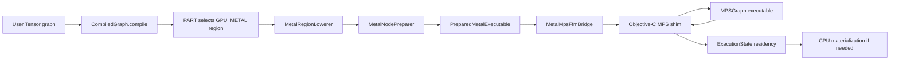
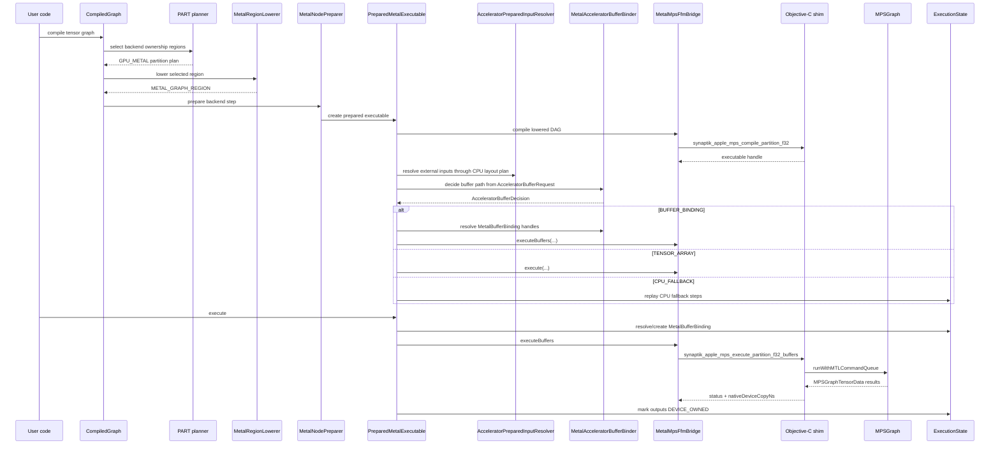

<!-- generated-by: gsd-doc-writer -->
# Metal Backend

Navigation: [Index](index.md#recommended-reading-paths) | [Architecture](architecture.md#metal-mps-buffer-execution-and-copy-chain) | [Compute Flow](compute-flow.md#native-buffer-binding-metal-path) | [Graph Optimizer](graph-optimizer.md#scored-candidate-planner-deep-dive) | [Native Bridges & BLAS](native-bridges-and-blas.md#how-this-differs-from-metal-ffm) | [Modules](modules.md#accelerator-scaffolding-backendaccelerator-backendmetal-backendcuda-backendopencl) | [Troubleshooting](troubleshooting.md#metal-mps-shim-missing)

Chapters: [Purpose And Current Status](#purpose-and-current-status) | [Mental Model](#mental-model) | [Source Map](#source-map) | [End-To-End Flow](#end-to-end-flow) | [Partition Legality And Lowering](#partition-legality-and-lowering) | [Java FFM Bridge](#java-ffm-bridge) | [Objective-C Native Shim](#objective-c-native-shim) | [Native Buffer ABI](#native-buffer-abi) | [Buffer Residency And Materialization](#buffer-residency-and-materialization) | [Worked Example](#worked-example) | [Trace Reading](#trace-reading) | [Supported Operations And DTypes](#supported-operations-and-dtypes) | [Fallbacks And Failure Modes](#fallbacks-and-failure-modes) | [Performance Model](#performance-model) | [Tests](#tests) | [Implementation Checklist](#implementation-checklist)

This document explains the current Metal MPS backend in Synaptik, including the Java-side planner/prepare path, the Java FFM bridge, the Objective-C native shim, the native buffer ABI, and the runtime residency rules. It is intentionally concrete: the goal is to make it clear what actually executes on Metal today, what still falls back, and where copies still happen.

## Table Of Contents

- [Purpose And Current Status](#purpose-and-current-status)
- [Mental Model](#mental-model)
- [Source Map](#source-map)
- [End-To-End Flow](#end-to-end-flow)
- [Partition Legality And Lowering](#partition-legality-and-lowering)
- [Java FFM Bridge](#java-ffm-bridge)
- [Objective-C Native Shim](#objective-c-native-shim)
- [Native Buffer ABI](#native-buffer-abi)
- [Buffer Residency And Materialization](#buffer-residency-and-materialization)
- [Worked Example](#worked-example)
- [Trace Reading](#trace-reading)
- [Supported Operations And DTypes](#supported-operations-and-dtypes)
- [Fallbacks And Failure Modes](#fallbacks-and-failure-modes)
- [Performance Model](#performance-model)
- [Tests](#tests)
- [Implementation Checklist](#implementation-checklist)

## Purpose And Current Status

The Metal backend exists to execute selected `FLOAT32` graph regions, scoped `BFLOAT16` operation families, scoped BOOL-producing mask operations, and scoped forward `INT32` index gather/take paths through Apple's MPSGraph runtime instead of replaying every primitive through Java CPU kernels. It is not a separate eager tensor device API. User code still builds normal `Tensor` graphs; graph optimization and preparation decide whether a region can be owned by `GPU_METAL`.

The current implementation has a real native buffer execution path:

- Java discovers the Objective-C symbols in [`MetalMpsFfmBridge.java`](../src/main/java/backend/metal/bridge/MetalMpsFfmBridge.java).
- The native shim is built from [`synaptik_apple_mps_stub.m`](../src/main/native/apple/synaptik_apple_mps_stub.m).
- `MetalMpsFfmBridge.supportsBufferBindings()` returns `true` only when all buffer ABI symbols are present.
- `PreparedMetalExecutable` tries `executeBuffers(...)` before the legacy tensor-array copy path.
- Adjacent Metal regions can pass intermediate values through `MetalBufferBinding` without first copying them into Java tensor arrays.
- A CPU boundary still materializes data back into Java storage through `MetalDeviceToCpuMaterializer`.

The important limitation is that this is not long-lived public GPU tensor storage. Public `Tensor` results are CPU-readable after `compute()` or `PreparedExecution.execute(...)` returns. The current buffer path avoids Java-array round trips between adjacent Metal regions, but the Objective-C shim still conservatively copies MPSGraph result storage into caller-provided `MTLBuffer` contents with `readBytes:strideBytes:`. That native copy is measured as `metalNativeDeviceCopyNs`.

## Mental Model

Think of Metal execution as a compiled subgraph call with two possible transport layers.

Legacy tensor-array transport:

```text
Java float[] / byte[]
  -> Java FFM temporary native memory
  -> Objective-C creates MTLBuffer inputs for one call
  -> MPSGraph executes
  -> Objective-C reads MPSGraph results into native output memory
  -> Java copies native output memory into Java float[]
```

Buffer-binding transport:

```text
ExecutionState has or creates MetalBufferBinding handles
  -> Java passes opaque native MTLBuffer handles to Objective-C
  -> Objective-C wraps those handles as MPSGraphTensorData
  -> MPSGraph executes
  -> Objective-C copies returned MPSGraph result storage into caller output buffers
  -> Java marks output node DEVICE_OWNED
  -> a later CPU boundary materializes only if needed
```

The second path is the important architectural improvement. It does not yet make public tensors GPU-owned across calls, but it lets one prepared execution keep intermediate Metal values out of Java arrays until the value is actually needed by CPU code or output publication.



## Source Map

| Area | Source |
|---|---|
| Metal capability and dtype boundary | [`MetalMpsCapabilities.java`](../src/main/java/backend/metal/MetalMpsCapabilities.java) |
| Planner allowlist and unsupported reasons | [`MetalPartitionSupport.java`](../src/main/java/backend/metal/lowering/MetalPartitionSupport.java) |
| Region legality | [`MetalRegionLegalityAdapter.java`](../src/main/java/backend/metal/lowering/MetalRegionLegalityAdapter.java) |
| Region lowering | [`MetalRegionLowerer.java`](../src/main/java/backend/metal/lowering/MetalRegionLowerer.java) |
| Prepare step | [`MetalNodePreparer.java`](../src/main/java/backend/metal/prepare/MetalNodePreparer.java) |
| Runtime executable and fallback policy | [`PreparedMetalExecutable.java`](../src/main/java/backend/metal/exec/PreparedMetalExecutable.java) |
| Java FFM bridge | [`MetalMpsFfmBridge.java`](../src/main/java/backend/metal/bridge/MetalMpsFfmBridge.java) |
| Bridge stats | [`MetalMpsBridgeExecutionStats.java`](../src/main/java/backend/metal/bridge/MetalMpsBridgeExecutionStats.java), [`MetalMpsBridgeExecutionPath.java`](../src/main/java/backend/metal/bridge/MetalMpsBridgeExecutionPath.java) |
| Java buffer contract | [`MetalBufferBinding.java`](../src/main/java/backend/metal/buffer/MetalBufferBinding.java), [`MetalBufferHandle.java`](../src/main/java/backend/metal/buffer/MetalBufferHandle.java), [`MetalBufferAccess.java`](../src/main/java/backend/metal/buffer/MetalBufferAccess.java) |
| Buffer allocation and CPU readback | [`MetalBufferAllocator.java`](../src/main/java/backend/metal/buffer/MetalBufferAllocator.java), [`MetalDeviceToCpuMaterializer.java`](../src/main/java/backend/metal/buffer/MetalDeviceToCpuMaterializer.java) |
| Resource lifetime | [`MetalBufferResource.java`](../src/main/java/backend/metal/buffer/MetalBufferResource.java), [`ExecutionState.java`](../src/main/java/graph/execution/ExecutionState.java) |
| Native shim | [`synaptik_apple_mps_stub.m`](../src/main/native/apple/synaptik_apple_mps_stub.m) |
| Build task | [`build.gradle`](../build.gradle), [`scripts/build-metal-mps-shim.sh`](../scripts/build-metal-mps-shim.sh) |

Related higher-level docs:

- [Architecture: Metal MPS Buffer Execution And Copy Chain](architecture.md#metal-mps-buffer-execution-and-copy-chain)
- [Compute Flow: Native buffer-binding Metal path](compute-flow.md#native-buffer-binding-metal-path)
- [Graph Optimizer: Scored Candidate Planner Deep Dive](graph-optimizer.md#scored-candidate-planner-deep-dive)
- [Troubleshooting: Metal MPS Shim Missing](troubleshooting.md#metal-mps-shim-missing)

## End-To-End Flow

### What problem this solves

Without a backend-owned graph region, a workload such as:

```java
Tensor y = x.matmul(w).add(b).tanh();
```

would run as separate CPU operations unless the CPU fusion path could fuse the elementwise tail. Metal wants a larger unit: one backend-owned region that can be lowered to an accelerator DAG and compiled into one MPSGraph executable. That reduces Java dispatch overhead and gives MPSGraph a chance to schedule the region as a native graph.

### Step-by-step walkthrough

1. User code builds a semantic graph with `Tensor` operations.
2. `CompiledGraph.compile(...)` snapshots the graph and runs optimizer stages.
3. `PART` may select a `GPU_METAL` ownership region if the graph policy allows accelerator ownership and the Metal planner says the nodes are legal.
4. `FUSE` may annotate fusable structure inside the region. For Metal this affects the lowering family name, but execution still goes through an accelerator DAG.
5. `MetalRegionLowerer` converts the selected region into a lowered Metal unit:
   - `METAL_FUSED_ELEMENTWISE_GRAPH` when the region is a single fused elementwise unit
   - `METAL_GRAPH_REGION` otherwise
6. `MetalNodePreparer` creates a `PreparedMetalExecutable`.
7. The executable compiles the lowered DAG through `MetalMpsFfmBridge.compile(...)`.
8. At execution time, `PreparedMetalExecutable.execute(...)` checks bridge availability and resolves external inputs
   through `AcceleratorPreparedInputResolver`, so tensor-array and buffer paths see the same prepared contiguous inputs.
9. `MetalAcceleratorBufferBinder` evaluates the common `RuntimeConfig.accelerator().metal().buffer()` policy:
   `OFF`, `AUTO`, or `REQUIRE`.
10. If the common decision is `BUFFER_BINDING`, the binder creates or reuses `MetalBufferBinding` handles and
    `PreparedMetalExecutable` calls `MetalMpsFfmBridge.executeBuffers(...)`.
11. If the buffer path is unavailable in `AUTO`, it tries the legacy tensor-array bridge. In `REQUIRE`, it throws with
    a stable `AcceleratorBufferReasonCode`.
12. If both Metal paths are unavailable or fail, CPU fallback steps replay the region through CPU kernels.



## Partition Legality And Lowering

Metal partition legality is intentionally separate from runtime availability. A graph can be legal for Metal at compile time and still fall back at runtime if the native shim is missing, an output layout is not materializable, or the bridge throws.

`MetalPartitionSupport.plannerUnsupportedReason(...)` is the main source-level allowlist:

| Category | Current behavior |
|---|---|
| Leaves | Rejected as compute nodes. Leaves become external inputs to a Metal region. |
| DType | Compute and output nodes must be `FLOAT32`, `BFLOAT16` for the scoped operation families listed in [Supported Operations And DTypes](#supported-operations-and-dtypes), or `BOOL` for the scoped compare/logical/reduction mask families. |
| Forward ops | Allows `MATMUL`, `LINEAR`, arithmetic elementwise ops, common activations, `WHERE`, `SOFTMAX`, shape/layout ops such as `RESHAPE`, `CONTIGUOUS`, `PERMUTE`, `EXPAND_DIMS`, and `SQUEEZE`. |
| Backward ops | Allows `MATMUL`, `LINEAR`, softmax/log-softmax gradients, min/max reduction gradients, min/max gradients, and `SCALED_DOT_PRODUCT_ATTENTION_BACKWARD`; this allowlist is independent from forward-family support. |
| Direct forward SDPA | Supported for legal dense FLOAT32 rank-3/4 inputs after native MPSGraph primitive DAG scale parity verification. |
| Direct masked/causal forward SDPA | Supported when the effective mask is a dense BOOL tensor: external mask, causal-only mask, and external+causal logical-AND mask all feed SDPA input 3. Unsupported mask dtype/layout/rank cases reject explicitly. |
| Conv/pool | Not in the current tested Metal planner allowlist. |

External input legality is role-sensitive. `MetalMpsCapabilities.supportsExternalInputRole(...)` allows:

- `FLOAT32` for normal data inputs
- `BFLOAT16` for scoped BF16 operation-family data inputs
- `BOOL` for `WHERE` input 0 and direct SDPA input 3
- internal `BOOL` mask values produced by supported Metal compare/logical/reduction ops feeding legal GPU consumers

Lowering itself is deliberately thin. `MetalRegionLowerer.lower(...)` does not emit Objective-C code. It marks the region with a `LoweringFamily` and leaves the accelerator DAG to the shared `AcceleratorSubgraphLowerer` and bridge compile step.

## Java FFM Bridge

[`MetalMpsFfmBridge.java`](../src/main/java/backend/metal/bridge/MetalMpsFfmBridge.java) is the Java side of the native boundary. It has four jobs:

1. Load the native library.
2. Discover required and optional symbols.
3. Convert lowered accelerator DAG metadata into primitive FFM arrays.
4. Execute either tensor-array calls or buffer-binding calls and return `MetalMpsBridgeExecutionStats`.

For the general explanation of Java FFM concepts (`Arena`, `SymbolLookup`, `Linker`, `FunctionDescriptor`,
`MemorySegment`, downcall `MethodHandle`s, and ABI discipline), see
[Native Bridges & BLAS: What Java FFM Is](native-bridges-and-blas.md#what-java-ffm-is). This document focuses on the
Metal-specific Objective-C shim, MPSGraph objects, and `MTLBuffer` lifetime rules.

### Library lookup

The bridge checks the configured Metal MPS library path/name in this order:

1. JVM property `synaptik.metal.mps.lib`
2. environment variable `SYNAPTIK_METAL_MPS_LIB`
3. default library name `synaptik_apple_mps`

The standard macOS build path is:

```bash
./gradlew buildMetalMpsShim
./gradlew metalTest
```

`metalTest` builds the shim and injects `-Dsynaptik.metal.mps.lib=build/native/apple/libsynaptik_apple_mps.dylib` for the Metal test slice.

### Symbol discovery

The FFM bridge treats core availability symbols as required and buffer symbols as optional capability gates. `supportsBufferBindings()` returns true only when all buffer symbols were found:

```java
return STATE.available
        && STATE.createBufferFn != null
        && STATE.writeBufferFn != null
        && STATE.readBufferFn != null
        && STATE.destroyBufferFn != null
        && STATE.executePartitionBuffersFn != null;
```

This is why an older `.dylib` can still run the legacy tensor-array path but must not claim `BUFFER_BINDING` support.

### Compilation cache

`MetalMpsFfmBridge` caches compiled native executables by `AcceleratorSubgraphSignature`. The Java cache value is the native executable handle returned by `synaptik_apple_mps_compile_partition_f32(...)`. `destroyExecutable(...)` intentionally does not release individual handles because cached executables are reused within the shared bridge context.

## Objective-C Native Shim

The native shim in [`synaptik_apple_mps_stub.m`](../src/main/native/apple/synaptik_apple_mps_stub.m) is not just a placeholder. It owns the Objective-C object model that Java cannot directly express through FFM.

### Native boxes

The shim uses retained Objective-C boxes and exposes them to Java as opaque `void *` handles:

| Native box | Purpose |
|---|---|
| `SynaptikAppleMpsContextBox` | Owns the Metal device, command queue, and `MPSGraphDevice`. |
| `SynaptikAppleMpsExecutableBox` | Owns the compiled `MPSGraph`, `MPSGraphExecutable`, input shape/dtype metadata, and output shape/count metadata. |
| `SynaptikAppleMpsBufferBox` | Owns one `id<MTLBuffer>`, its byte length, storage mode, and ownership flag. |

Java never dereferences those handles. It only passes them back to ABI functions. Native lifetime is handled by `CFBridgingRetain(...)` on creation and `CFBridgingRelease(...)` in destroy functions.

### Context creation

`synaptik_apple_mps_create_context(...)` selects a Metal device and creates:

- `id<MTLDevice>`
- `id<MTLCommandQueue>`
- `MPSGraphDevice`

If any of these are missing, it returns `NULL`, and Java records an unavailable bridge context.

### Compilation

`synaptik_apple_mps_compile_partition_f32(...)` receives primitive arrays describing the lowered accelerator DAG:

- external input ranks, dtypes, and up to four dimensions
- node type codes
- for each node, up to four input references
- per-node scalar bits
- per-node output rank and shape
- output node indices

The shim creates one `MPSGraph`, then builds placeholders and operations in DAG order. For example:

```text
external input 0 -> placeholder input_0
external input 1 -> placeholder input_1
node 0 MATMUL(input_0, input_1) -> nodeOutputs[0]
node 1 ADD(nodeOutputs[0], external input 2) -> nodeOutputs[1]
node 2 TANH(nodeOutputs[1]) -> nodeOutputs[2]
output node index = 2
```

The native code then calls:

```objective-c
[graph compileWithDevice:contextBox.graphDevice
                   feeds:feeds
           targetTensors:[targetTensors copy]
        targetOperations:nil
   compilationDescriptor:nil]
```

and stores the resulting `MPSGraphExecutable` in `SynaptikAppleMpsExecutableBox`.

### Operation lowering in the shim

The Objective-C switch over node type codes maps the accelerator DAG to MPSGraph operations. The supported set includes matrix multiply, linear-style graph fragments, arithmetic elementwise ops, activations, `where`, softmax-related ops, shape ops, scoped BOOL compare/logical/reduction ops, and selected attention nodes present in the native code. Planner legality is stricter than the native switch: direct FLOAT32 rank-3/4 SDPA is admitted only after parity evidence, and the native shim expands it to `Q * K^T`, scale, optional BOOL mask select with CPU-compatible polarity, softmax, and `* V` MPSGraph primitives.

This split is intentional. Native source coverage is not enough to make an op legal. The planner allowlist documents what has been tested against Synaptik semantics.

## Native Buffer ABI

ABI means application binary interface: the binary contract between Java FFM and the `.dylib`. It is stricter than a Java API because both sides must agree on symbol names, primitive layouts, pointer meaning, ownership, and return status.

### Symbols

| Symbol | Java caller | Purpose |
|---|---|---|
| `synaptik_apple_mps_available` | `MetalMpsFfmBridge.init()` | Reports whether the native shim can use Metal/MPS on this process. |
| `synaptik_apple_mps_unavailable_reason` | `MetalMpsFfmBridge.init()` | Returns a native diagnostic string when unavailable. |
| `synaptik_apple_mps_create_context` | `createContext()` | Creates the retained context box. |
| `synaptik_apple_mps_destroy_context` | available but shared context is cached | Releases a context box. |
| `synaptik_apple_mps_compile_partition_f32` | `compile(...)` | Legacy wrapper for compiling a `FLOAT32` accelerator DAG into an executable box. |
| `synaptik_apple_mps_compile_partition_dtype_v3` | `compile(...)` | Compiles a dtype-annotated accelerator DAG when widened output dtype metadata is required. |
| `synaptik_apple_mps_execute_partition_f32` | `execute(...)` | Legacy tensor-array copy execution path. |
| `synaptik_apple_mps_create_buffer` | `MetalBufferAllocator.create*Binding(...)` | Allocates a shared `MTLBuffer` and optionally initializes it from CPU bytes. |
| `synaptik_apple_mps_write_buffer` | currently exposed through native access but not used by the main allocation path | Writes bytes into an existing buffer. |
| `synaptik_apple_mps_read_buffer` | `MetalBufferAllocator.readToCpu(...)` | Reads a shared buffer into CPU-visible memory. |
| `synaptik_apple_mps_destroy_buffer` | `MetalBufferResource.close()` | Releases a buffer box. |
| `synaptik_apple_mps_execute_partition_f32_buffers` | `executeBuffers(...)` | Executes over explicit input/output buffer handles. |
| `synaptik_apple_mps_destroy_executable` | discovered, but cached executables are retained for reuse | Releases an executable box. |
| `synaptik_apple_mps_layout_abi_version` | `MetalMpsFfmBridge.capabilities()` | Optional layout ABI v2 version probe. |
| `synaptik_apple_mps_validate_layout_abi_v2` | layout ABI v2 capability checks | Optional metadata-only layout descriptor validation. |
| `synaptik_apple_mps_dtype_abi_version` | `MetalMpsFfmBridge.capabilities()` | Optional dtype ABI v3 version probe. |
| `synaptik_apple_mps_validate_dtype_abi_v3` | dtype ABI v3 capability checks | Optional role-specific dtype descriptor validation. |

Layout ABI v2 symbols are optional-symbol gated. Missing layout ABI v2 symbols disable only layout ABI v2 capability;
they do not disable the existing dense v1 buffer execution path.

DType ABI v3 symbols are also optional-symbol gated. Missing dtype ABI v3 symbols do not disable the legacy
`FLOAT32` `_f32` execution path, but they do prevent widened dtype execution from being claimed. The v3 descriptor
can name storage, external input, predicate input, compute, and output roles for all public Synaptik dtypes. The
current widened native contract admits `BFLOAT16` only for scoped operation families, admits `BOOL` only for scoped
compare/logical/reduction output and mask-chain consumers, and keeps `FLOAT64` and `INT32` compute/output rejected.

Layout ABI v2 rejection uses stable accelerator buffer reason codes:

- `NATIVE_LAYOUT_ABI_UNAVAILABLE`
- `NATIVE_LAYOUT_ABI_VERSION_MISMATCH`
- `NATIVE_LAYOUT_METADATA_UNSUPPORTED`
- `NATIVE_LAYOUT_RANK_UNSUPPORTED`
- `NATIVE_LAYOUT_DTYPE_UNSUPPORTED`
- `NATIVE_LAYOUT_PHYSICAL_SPAN_OVERFLOW`

AUTO mode records the reason code in trace metadata and falls back visibly. REQUIRE mode fails before tensor-array or
CPU fallback. GPU-side layout transform execution remains Phase 10 scope.

### `execute_partition_f32_buffers(...)`

The buffer execution ABI is:

```c
int32_t synaptik_apple_mps_execute_partition_f32_buffers(
        void *context,
        void *executable,
        const void * const *external_input_buffers,
        int32_t external_input_count,
        void * const *output_buffers,
        int32_t output_count,
        int64_t *native_device_copy_ns
);
```

The Java caller passes arrays of opaque buffer handles, not Java arrays and not semantic tensor objects. The native shim:

1. Validates the context and executable handles.
2. Validates the input and output counts against metadata stored at compile time.
3. Unboxes each input handle to `SynaptikAppleMpsBufferBox`.
4. Wraps each input `id<MTLBuffer>` as `MPSGraphTensorData` with the stored shape and dtype.
5. Unboxes each output handle and creates matching output `MPSGraphTensorData`.
6. Runs the compiled executable with `resultsArray:[outputs copy]`.
7. Reads each returned `MPSNDArray` into the caller-provided output buffer contents.
8. Accumulates the native result-copy time into `native_device_copy_ns`.

Status codes are simple integer failure classes. For example, `2` means input count or pointer mismatch, `3` means output count or pointer mismatch, `5` means input shape/size mismatch, `8` means output shape/size mismatch, and `10-12` cover result/copy failures. Java turns any non-zero status into an `UnsupportedOperationException`, and `PreparedMetalExecutable` converts that to CPU fallback with an explicit reason.

### Why the native result copy still exists

`MPSGraphExecutable.runWithMTLCommandQueue(... resultsArray:[outputs copy] ...)` receives output `MPSGraphTensorData`, but the shim still treats the returned result storage as authoritative and copies it into the caller output buffer:

```objective-c
MPSNDArray *resultArray = resultData.mpsndarray;
void *contents = box.buffer.contents;
[resultArray readBytes:contents strideBytes:NULL];
```

This is conservative. It avoids claiming that MPSGraph wrote directly into the exact supplied `MTLBuffer` unless tests and runtime behavior prove that contract for all supported operations. The trace field `metalNativeDeviceCopyNs` exists specifically so this remaining native copy is visible.

## Buffer Residency And Materialization

### Java-side buffer objects

`MetalBufferBinding` ties one compiled node id to one native buffer:

```text
MetalBufferBinding(
  nodeId = 42,
  dataType = FLOAT32,
  shape = [128, 128],
  elementCount = 16384,
  handle.byteLength = 65536,
  access = READ_WRITE
)
```

The binding is not public tensor storage. It is per-run execution metadata. The public `Tensor` still owns Java-side storage; that storage may be stale while the latest value is device-owned.

### Input binding

When a Metal executable needs an external input:

1. `PreparedMetalExecutable` first looks for an existing active `DeviceBufferBinding`.
2. If no binding exists, it checks that CPU storage is current.
3. `MetalBufferAllocator.createInputBinding(...)` copies `FLOAT32` or scoped `BFLOAT16` Java data into a shared `MTLBuffer`.
4. For `WHERE` predicate input 0, `createPredicateInputBinding(...)` copies `BOOL` bytes.
5. `ExecutionState.attachDeviceBufferBinding(...)` marks the value as `HOST_SHARED_DEVICE_BUFFER`.

### Output binding

When a Metal executable needs an output:

1. `PreparedMetalExecutable` first looks for an existing writable binding.
2. If none exists, `MetalLayoutPolicy.output(...)` classifies the destination layout.
3. `DENSE_CONTIGUOUS` uses direct dense buffer binding.
4. `ZERO_OFFSET_VIEW`, `NON_ZERO_OFFSET_VIEW`, and `PERMUTED_OR_STRIDED_VIEW` use dense physical Metal buffers with logical layout metadata when policy and materializer support allow it.
5. `BROADCAST_ZERO_STRIDE_VIEW` and `UNSUPPORTED` remain rejected with `OUTPUT_LAYOUT_UNSUPPORTED`.
6. `MetalBufferAllocator.createOutputBinding(...)` allocates an unwritten shared `FLOAT32`, scoped `BFLOAT16`, or scoped `BOOL` output buffer sized to the logical byte length.
7. `ExecutionState.reserveDeviceBufferBinding(...)` records it as writable but not current.
8. After native execution succeeds, `markBufferOutputsCurrent(...)` promotes the binding to active `READ_WRITE`.
9. The output residency becomes `DEVICE_OWNED`, even though the underlying `MTLBuffer` uses shared storage, because the Java `float[]` has not been updated.

No native layout ABI was added for this flow. Java passes dense physical buffers to the existing buffer ABI and owns
logical view materialization. Future native layout ABI additions must be optional-symbol, version, or capability
checked before execution so an older `.dylib` cannot silently claim layout-aware native behavior.

### Materialization

CPU publication uses `ExecutionState.requireCpuReadable(...)`. If a value is `DEVICE_OWNED`, CPU-stale, and has an active Metal binding, the registered `MetalDeviceToCpuMaterializer` calls `MetalBufferAllocator.readToCpu(...)`, which calls native `synaptik_apple_mps_read_buffer(...)` and copies the result into the destination Java `float[]`.

Materialization reasons are explained in [Compute Flow: Device-owned materialization path](compute-flow.md#device-owned-materialization-path). For Metal, the common reasons are:

- `GRAPH_OUTPUT`: final root data is being published to the semantic output tensor
- `GRADIENT_PUBLICATION`: gradients are being copied into public `.grad()` tensors
- `CPU_CONSUMER`: a later CPU step needs an accelerator-produced value
- `PUBLIC_DATA_ACCESS`: a public read needs current CPU bytes

### GPU layout transform and view path

The GPU layout transform and view path lets Metal preserve device bindings through metadata-only views before a CPU
materialization boundary is reached. `PERMUTE`, `EXPAND`, `EXPAND_DIMS`, `SQUEEZE`, `SELECT`, `NOOP`, and
contiguous-source `RESHAPE` can reuse the same `MetalBufferBinding` handle with updated shape, stride, storage-offset,
and rank metadata. These metadata-only views do not allocate a Java array and do not copy bytes back to CPU storage.

Dense GPU materialization covers `contiguous()` and non-contiguous-source `reshape` only when the Metal bridge exposes
the optional layout materialization capability and the prepared run registers the backend-owned materializer service.
Without that service, AUTO mode falls back visibly and REQUIRE mode fails with `GPU_LAYOUT_TRANSFORM_UNSUPPORTED`.

Phase 33 splits layout repair into explicit router routes. `METADATA_ONLY_VIEW` keeps borrowed device handles for view
metadata. `DENSE_GPU_MATERIALIZATION` and `BROADCAST_GPU_MATERIALIZATION` allocate dense Metal destination buffers and
run the native layout materializer. Broadcast repair is scoped to zero-stride `FLOAT32` views that can be proven safe by
physical-span validation. `STRIDED_NATIVE_COMPUTE` is a named route class, but remains unsupported until a consumer
operation explicitly proves direct strided execution.

For Phase 10, the accepted CPU materialization boundaries are graph output publication, a real CPU consumer, and
gradient publication. A supported Metal layout chain should not produce a `CPU_CONSUMER` materialization between
metadata-only view nodes.

## Worked Example

Consider two adjacent Metal regions inside one prepared execution:

```text
Region A:
  x -> relu(x)

Region B:
  relu(x) -> neg(relu(x))
```

With concrete values:

```java
Tensor x = new Tensor(
        new float[]{-2.0f, 3.0f},
        new int[]{2},
        null,
        "x",
        DataType.FLOAT32
);
// x = [-2, 3]

Tensor y = x.relu().neg();
// region A computes mid = relu(x)
// mid = [0, 3]
// region B computes y = -mid
// y = [0, -3]
```

Runtime flow with buffer bindings:

1. Region A sees `x` as CPU-current and creates an input binding:

```text
nodeId=1, dtype=FLOAT32, shape=[2], bytes=8, access=READ
```

2. Region A reserves an output buffer for `mid`:

```text
nodeId=2, dtype=FLOAT32, shape=[2], bytes=8, access=READ_WRITE
```

3. Native Metal execution writes `mid` into the output buffer. Java marks:

```text
nodeId=2
  residency=DEVICE_OWNED
  cpuCurrent=false
  deviceCurrent=true
  binding=MetalBufferBinding(nodeId=2, access=READ_WRITE)
```

4. Region B uses node `2` as an external input. Because a readable Metal binding already exists, it does not materialize `mid` to Java.
5. Region B reserves and writes an output buffer for `y`.
6. At graph output publication, `y` is `DEVICE_OWNED`, so `MetalDeviceToCpuMaterializer` reads it into the public output tensor's `float[]`.

The key point is that `mid = [0, 3]` never has to pass through a Java array between Region A and Region B.

## Trace Reading

Metal trace fields are emitted through `PreparedExecution` run traces. The most important fields are:

| Trace attribute | Meaning |
|---|---|
| `acceleratorBufferExecutionPath` | Backend-neutral path selected by the accelerator buffer decision: `BUFFER_BINDING`, `TENSOR_ARRAY`, `CPU_FALLBACK`, or `UNAVAILABLE`. |
| `acceleratorBufferReasonCode` | Stable backend-neutral reason code for the selected path or fallback. |
| `acceleratorBufferPreparedInputUsed` | Whether a prepared contiguous input was used before native buffer execution. |
| `metalBridgeAvailable` | Whether the bridge reported native availability. |
| `metalBridgeExecutableAvailable` | Whether compile produced a native executable handle. |
| `metalSupportsBufferBindings` | Whether all buffer ABI symbols were discovered. |
| `metalBufferBindingDecision` | Why the buffer path was used or why it fell back to tensor arrays. |
| `metalExecutionPath` | `BUFFER_BINDING`, `TENSOR_ARRAY_COPY`, or `CPU_FALLBACK`. |
| `metalInputBytes`, `metalOutputBytes` | Logical payload byte counts for external inputs and outputs. |
| `metalJavaToNativeCopyNs` | Java-side copy time into FFM memory; should be `0` for `BUFFER_BINDING`. |
| `metalNativeToJavaCopyNs` | Java-side copy time from native output memory into Java arrays; should be `0` for `BUFFER_BINDING`. |
| `metalNativeDeviceCopyNs` | Native shim copy time from returned MPSGraph result storage into caller-provided output buffers. May be non-zero for the current buffer path. |
| `storageResidency` | Final residency state for the step output, often `DEVICE_OWNED` for successful buffer execution. |

### Device-owned flow and materialization boundaries

Successful buffer execution leaves the step output `device-owned` in `ExecutionState`: the newest value is in a backend buffer, `storageResidency=DEVICE_OWNED`, and the Java tensor array is not current until a CPU materialization boundary is reached. A CPU materialization boundary is a graph output publication, CPU consumer, or gradient publication site that asks the materializer to synchronize the buffer back to CPU storage.

Use `acceleratorBufferExecutionPath`, `acceleratorBufferReasonCode`, `storageResidency`, and `nativeDeviceCopyNs` together when diagnosing a run. `nativeDeviceCopyNs` measures the native MPSGraph-result-to-output-buffer copy inside the current Metal ABI; it is not the same as a Java array copy-back. `metalNativeToJavaCopyNs=0` plus a later CPU materialization trace is the expected device-owned path.

CUDA remains capability-gated until a native shim exists. `CudaBridgeCapabilities` reports native library, CUDA runtime, context, graph ABI, and `bufferExecutionSupported` state. CUDA tests may assert shared policy and `REQUIRED_BUFFER_EXECUTION_UNAVAILABLE`, but this documentation does not claim production CUDA native buffer execution.

Healthy buffer-path trace shape:

```text
backend = GPU_METAL
acceleratorBufferExecutionPath = BUFFER_BINDING
acceleratorBufferReasonCode = BUFFER_BINDING_AVAILABLE
metalSupportsBufferBindings = true
metalExecutionPath = BUFFER_BINDING
metalJavaToNativeCopyNs = 0
metalNativeToJavaCopyNs = 0
metalNativeDeviceCopyNs = <measured native copy time, may be > 0>
storageResidency = DEVICE_OWNED
```

Healthy legacy fallback shape:

```text
backend = GPU_METAL
metalSupportsBufferBindings = false
metalExecutionPath = TENSOR_ARRAY_COPY
metalJavaToNativeCopyNs = <input upload time>
metalNativeToJavaCopyNs = <Java output copy time>
storageResidency = CPU_ARRAY
```

CPU fallback shape:

```text
backend = GPU_METAL
metalExecutionPath = CPU_FALLBACK
metalFallbackReason = bridge unavailable: ...
```

Do not infer execution path from `backend=GPU_METAL` alone. A prepared step can have a Metal backend label and still use CPU fallback if the native runtime or storage contract fails.

## Supported Operations And DTypes

### DTypes

| Role | Supported today |
|---|---|
| Storage metadata/residency | `FLOAT32`, `BFLOAT16`, `INT32`, `BOOL`, `FLOAT64` are representable as dtype metadata; this is not native compute support. |
| Compute node dtype | `FLOAT32`; `BFLOAT16` for scoped operation families only; `BOOL` for scoped compare/logical/reduction mask families |
| Output dtype | `FLOAT32`; `BFLOAT16` for scoped operation families only; `BOOL` for scoped compare/logical/reduction mask families |
| Normal external data input | `FLOAT32`; `BFLOAT16` only when the consuming operation family is BF16-supported |
| Index external input | `INT32` only for supported forward `GATHER` / `TAKE_ALONG_AXIS` input 1 |
| Predicate external input | `BOOL` only for `WHERE` input 0 |
| Descriptor ABI coverage | dtype ABI v3 can describe `FLOAT32`, `BFLOAT16`, `INT32`, `BOOL`, and `FLOAT64` roles. |
| Unsupported compute/output dtypes | `FLOAT64`, `INT32`; `BFLOAT16` and `BOOL` outside their scoped operation families |

BF16 support is real but deliberately narrow. It requires the dtype ABI v3 compile path and currently covers `MATMUL`, `LINEAR`, arithmetic elementwise and activation ops, scalar multiply/clamp, `SOFTMAX`, `LOG_SOFTMAX`, `SUM`, `MEAN`, `REDUCE_MIN`, `REDUCE_MAX`, `LAYER_NORM`, and `RMS_NORM`. It does not make every Metal row BF16-capable.

BOOL support is also real but deliberately narrow. Metal can produce and consume device-resident BOOL outputs for dense scoped compare ops (`GT`, `GE`, `LT`, `LE`, `EQ`, `NE`), logical ops (`LOGICAL_AND`, `LOGICAL_OR`, `LOGICAL_NOT`), and BOOL reductions (`REDUCE_ALL`, `REDUCE_ANY`). A supported `compare -> WHERE -> elementwise` chain should remain a single Metal-owned lowered region with `dtypeResidency` evidence for `dtype=BOOL` and no CPU materialization between the mask producer and `WHERE`.

Forward `GATHER` and `TAKE_ALONG_AXIS` support is deliberately scoped: dense `FLOAT32` value/output tensors, dense static leaf `INT32` indices, proven in-bounds index values, and native buffer execution through MPSGraph `gatherAlongAxis`. This is not generic INT32 arithmetic or INT32 output support. `gather_take_small` is the native forward-index hot-path target; `scatter_index_gradient_small` is a separate visible-blocker target for `SCATTER_ADD`, `GATHER_GRAD`, and `TAKE_ALONG_AXIS_GRAD`.

Unsupported BF16 and BOOL families still reject with stable dtype or operation-family diagnostics. Dense loss-adjacent ops now support a scoped Phase 37 path: `NLL_LOSS` and dense `CROSS_ENTROPY_LOSS` are limited to `FLOAT32` dense rank 1..4 inputs, dense same-shape targets, a valid class axis, and public mean-reduced output shape `[1]`. `dense_loss_small` is the positive coverage target for this path; it requires native buffer-binding evidence and no CPU or tensor-array fallback. `cross_entropy_small` is intentionally separate and remains the index-target visible-blocker target with `UNSUPPORTED_INDEX_SEMANTICS`. Conv/pool variants outside the scoped forward `FLOAT32` dense subset, gather/take gradients, scatter, index-target loss ops, generic INT32 compute/output, arbitrary BOOL consumers, and non-dense/unsupported SDPA mask layouts remain separate future phases.

### Planner allowlist

Forward Metal planner support currently includes:

```text
MATMUL, LINEAR,
ADD, SUB, MUL, DIV,
RELU, TANH, FAST_TANH, SIGMOID,
ABS, EXP, FAST_EXP, LOG, NEG, SQRT, INV,
MUL_SCALAR, WHERE, SOFTMAX, LOG_SOFTMAX,
CLAMP_MIN, CLAMP_MAX,
SUM, MEAN, REDUCE_MIN, REDUCE_MAX,
GT, GE, LT, LE, EQ, NE,
LOGICAL_AND, LOGICAL_OR, LOGICAL_NOT,
REDUCE_ALL, REDUCE_ANY,
LAYER_NORM, RMS_NORM,
SCALED_DOT_PRODUCT_ATTENTION,
NLL_LOSS, CROSS_ENTROPY_LOSS,
GATHER, TAKE_ALONG_AXIS,
CONV2D, CONV2D_GEMM,
MAX_POOL2D, AVG_POOL2D,
RESHAPE, CONTIGUOUS, NOOP, PERMUTE, EXPAND_DIMS, SQUEEZE
```

Backward Metal planner support currently includes:

```text
MATMUL, LINEAR,
SOFTMAX_GRAD, LOG_SOFTMAX_GRAD,
REDUCE_MIN_GRAD, REDUCE_MAX_GRAD,
MIN_GRAD, MAX_GRAD,
SCALED_DOT_PRODUCT_ATTENTION_BACKWARD
```

Notable current exclusions:

- grouped/dilated/unsupported-dtype Conv2D variants and conv backward ops
- pooling backward ops and unsupported pooling variants such as `AVG_POOL2D countIncludePad=true`
- `GATHER_GRAD`, `TAKE_ALONG_AXIS_GRAD`, `SCATTER_ADD`, and index-target loss ops
- `FLOAT64`, `INT32`, unsupported `BFLOAT16`, and unsupported `BOOL` compute/output graphs
- forward support does not imply backward support; backward target truth is tracked per op in `GpuTargetCoverageTruth`

## Fallbacks And Failure Modes

| Failure mode | Where detected | Behavior |
|---|---|---|
| Native library missing | `MetalMpsFfmBridge.init()` | Bridge unavailable; selected Metal region falls back to CPU. |
| Older `.dylib` without buffer symbols | `supportsBufferBindings()` | Legacy tensor-array path may still run; no `BUFFER_BINDING` claim. |
| Illegal dtype | `MetalPartitionSupport`, `MetalMpsCapabilities`, runtime checks | Planner rejects or runtime falls back with unsupported dtype reason. BF16 and BOOL outside the scoped operation families remain illegal. |
| Illegal external `BOOL` role | `MetalMpsCapabilities.supportsExternalInputRole(...)` | Planner rejects candidate. |
| Missing BOOL residency evidence | Coverage regression gate | Supported `bool_compare_where_small` fails if traces do not show native buffer execution and non-rejected `dtype=BOOL` residency evidence. |
| Illegal or unproven index input | `MetalPartitionSupport`, `MetalMpsCapabilities.supportsExternalInputRole(...)` | Forward gather/take rejects non-`INT32`, non-dense, non-static, or out-of-bounds indices with stable `UNSUPPORTED_DTYPE`, `UNSUPPORTED_LAYOUT`, or `UNSUPPORTED_BOUNDS_CHECK` details. |
| Index write/gradient duplicate accumulation unproven | `GpuLoweringCoverageMatrix`, `MetalPartitionSupport`, `MetalIndexWriteSemantics` | `GATHER_GRAD`, `TAKE_ALONG_AXIS_GRAD`, and `SCATTER_ADD` first validate dtype, dense layout, rank/shape, axis, static `INT32` bounds, then reject with `UNSUPPORTED_DUPLICATE_INDEX` until native execution proves CPU-compatible accumulation semantics. |
| Dense loss unsupported variant | `GpuLoweringCoverageMatrix`, `MetalPartitionSupport`, `MetalLossSemantics` | `NLL_LOSS` and dense `CROSS_ENTROPY_LOSS` reject non-`FLOAT32`, non-dense, rank > 4, mismatched dense-target shape, invalid class-axis, or non-`[1]` output cases before native admission. |
| Missing dense loss native evidence | Coverage regression gate | `dense_loss_small` fails if traces do not show native buffer execution, lowered dense-loss primitives, and no CPU/tensor-array fallback. |
| Index-target loss counted as dense loss support | Coverage regression gate | `cross_entropy_small` is separate from `dense_loss_small` and must expose `UNSUPPORTED_INDEX_SEMANTICS`, `INT32`, or `CROSS_ENTROPY_LOSS_INDICES` as visible blocker evidence. |
| Missing INT32 index residency evidence | Coverage regression gate | Supported `gather_take_small` fails if traces do not show native buffer execution and non-rejected `dtype=INT32` residency evidence. |
| Forward index coverage counted as scatter/index-gradient support | Coverage regression gate | `scatter_index_gradient_small` is separate from `gather_take_small` and must expose `UNSUPPORTED_DUPLICATE_INDEX`, `SCATTER_ADD`, `GATHER_GRAD`, or `TAKE_ALONG_AXIS_GRAD` as a visible blocker. |
| Missing layout materialization evidence | Coverage regression gate | Supported `layout_broadcast_repair_small` fails if traces do not show `BROADCAST_GPU_MATERIALIZATION`, native buffer execution, and no `CPU_CONSUMER` materialization. |
| Broadcast zero-stride output layout | `MetalLayoutPolicy.output(...)` | Direct broadcast output buffers remain unsupported with `OUTPUT_LAYOUT_UNSUPPORTED`; explicit `expand -> contiguous` repair can use `BROADCAST_GPU_MATERIALIZATION`. |
| Non-contiguous legal view output | `MetalLayoutPolicy.output(...)`, `MetalBufferAllocator.createOutputBinding(...)`, `MetalDeviceToCpuMaterializer` | `ZERO_OFFSET_VIEW`, `NON_ZERO_OFFSET_VIEW`, and `PERMUTED_OR_STRIDED_VIEW` use dense physical logical-view buffers when the bridge and materializer support the path. |
| CPU storage stale and no Metal input binding exists | `resolveOrCreateMetalBufferBindings(...)` | Buffer path unavailable because Java cannot safely upload stale CPU data. |
| Native buffer execution non-zero status | `MetalMpsFfmBridge.executeBuffers(...)` | Throws; `PreparedMetalExecutable` runs CPU fallback. |
| Device-owned value requested by CPU without materializer | `ExecutionState.requireCpuReadable(...)` | Fails loudly instead of reading stale Java storage. |

## Performance Model

Metal performance depends on three separate things:

1. Region shape: larger regions amortize bridge overhead better than tiny regions.
2. Transfer behavior: buffer bindings avoid Java-array copy-back between adjacent Metal regions, but CPU boundaries still require materialization.
3. Native MPSGraph execution quality: MPSGraph may or may not outperform the CPU path for a given operation size and shape.

The current buffer path removes these costs between adjacent Metal regions:

- Java `float[]` output copy after Region A
- Java `float[]` input upload before Region B
- accidental CPU materialization of intermediate values

It does not remove:

- initial upload when the first Metal input is CPU-current only
- final readback when the graph result must be published to CPU
- the conservative native `MPSNDArray.readBytes(...)` copy into caller output buffers
- MPSGraph launch/compile/runtime overhead

This is why graph autotune and benchmarks must look at trace fields, not just wall time. A workload can correctly use `BUFFER_BINDING` and still fail to beat CPU if the region is too small, if it materializes after every region, or if MPSGraph overhead dominates.

## Tests

Relevant tests include:

| Test | What it proves |
|---|---|
| [`MetalMpsFfmBridgeTest`](../src/test/java/backend/metal/bridge/MetalMpsFfmBridgeTest.java) | Native bridge discovery, buffer ABI calls, sentinel buffer execution, adjacent native executable buffer handoff, BF16 raw storage roundtrip, BF16 RELU/MATMUL/SUM/LayerNorm/softmax parity, and BOOL compare/logical/reduction raw byte parity when the shim is available. |
| [`PreparedMetalExecutableBufferBindingTest`](../src/test/java/backend/metal/exec/PreparedMetalExecutableBufferBindingTest.java) | Java-side selection of buffer path, fallback reasons, output residency promotion, and binding validation. |
| [`MetalBufferAllocatorTest`](../src/test/java/backend/metal/buffer/MetalBufferAllocatorTest.java) | Buffer allocation, dtype checks, shape checks, and CPU readback behavior through fake native access. |
| [`MetalBufferResourceTest`](../src/test/java/backend/metal/buffer/MetalBufferResourceTest.java) | Run-scoped native resource cleanup. |
| [`MetalLayoutAwareDeviceFlowTest`](../src/test/java/backend/metal/MetalLayoutAwareDeviceFlowTest.java) | End-to-end `LINEAR -> RESHAPE -> PERMUTE` CPU parity, visible broadcast-layout fallback, and forward-backward gradient publication behavior. |
| [`MetalBufferTraceSmokeTest`](../src/test/java/backend/metal/MetalBufferTraceSmokeTest.java) | Trace attributes for buffer-backed Metal execution, logical materialization, CPU consumer materialization, and unsupported layout fallback. |
| [`PreparedExecutionBuildTest`](../src/test/java/PreparedExecutionBuildTest.java) | Region selection evidence for multi-op Metal regions, including `compare -> WHERE -> elementwise` mask chains with internal BOOL residency evidence. |
| [`MetalRegionLowererTest`](../src/test/java/backend/metal/lowering/MetalRegionLowererTest.java) | Lowering family selection for Metal regions. |

Run the native slice on macOS:

```bash
./gradlew metalTest
```

Run full Java tests:

```bash
./gradlew test
```

Needs verification: full-suite runtime behavior depends on local native libraries and performance test settings. The Metal-specific contract is best checked with `metalTest`.

## Implementation Checklist

When changing the Metal backend, keep these invariants intact:

- Planner legality must not advertise dtypes or operation semantics that the bridge cannot execute.
- `supportsBufferBindings()` must stay false unless all buffer ABI symbols are loaded.
- A reserved output binding must not be treated as current data before native execution succeeds.
- Metal buffer outputs should be marked `DEVICE_OWNED` until a materializer makes CPU storage current.
- CPU fallback must leave tensors CPU-current and must explain why Metal was not used.
- Trace fields must distinguish `BUFFER_BINDING`, `TENSOR_ARRAY_COPY`, and `CPU_FALLBACK`.
- Native handles must be registered as run-scoped resources and released exactly once.
- New native ABI symbols require both Java FFM descriptors and native tests.
