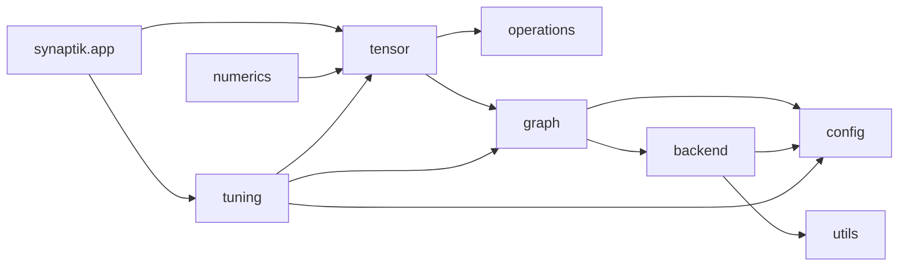

<!-- generated-by: gsd-doc-writer -->
# Synaptik Module Guide

Navigation: [Index](index.md#recommended-reading-paths) | [Architecture](architecture.md#core-artifact-boundaries) | [Compute Flow](compute-flow.md#primary-artifacts) | [Graph Optimizer](graph-optimizer.md#graph-optimizer) | [Backend Planning](backend-planning-and-regions.md#backend-planning-and-regions) | [Native Bridges & BLAS](native-bridges-and-blas.md#openblas-in-synaptik) | [Metal Backend](metal-backend.md#source-map) | [Tensor API](tensor-api.md#api-surface-and-conventions) | [Adding Tensor Operation](adding-tensor-operation.md#source-map) | [Development](development.md#repository-structure)

Chapters: [Package Map](#package-map) | [`tensor`: Public Graph-Building Surface](#tensor-public-graph-building-surface) | [`operations`: Primitive Semantic Descriptors](#operations-primitive-semantic-descriptors) | [`graph`: Compile Artifacts, Preparation Facade, And Execution Types](#graph-compile-artifacts-preparation-facade-and-execution-types) | [`graph.optimizer`: Rewrite, Partition, Fusion, And Memory Planning](#graphoptimizer-rewrite-partition-fusion-and-memory-planning) | [`backend`: Backend Contracts, Selection, Lowering, And Runtime Context](#backend-backend-contracts-selection-lowering-and-runtime-context) | [`backend.cpu`: CPU Backend Implementation](#backendcpu-cpu-backend-implementation) | [`backend.cpu.kernels`: CPU Kernel Families](#backendcpukernels-cpu-kernel-families) | [`backend.cpu.fused`: Fused Planning And Generated Execution Support](#backendcpufused-fused-planning-and-generated-execution-support) | [Accelerator Scaffolding: `backend.accelerator`, `backend.metal`, `backend.cuda`, `backend.opencl`](#accelerator-scaffolding-backendaccelerator-backendmetal-backendcuda-backendopencl) | [`config`: Optimizer, Runtime, And Profile Records](#config-optimizer-runtime-and-profile-records) | [`tuning`: Measurement, Search, Validation, Reporting, Persistence](#tuning-measurement-search-validation-reporting-persistence) | [`synaptik.app`: CLI Entry Point](#synaptikapp-cli-entry-point) | [`numerics`: Numerical Drift Harness](#numerics-numerical-drift-harness) | [`utils`: Support Classes](#utils-support-classes) | [Test Coverage Landmarks](#test-coverage-landmarks)

This guide explains the important source packages in Synaptik and how they relate to the compile/prepare/execute lifecycle. For deeper package-specific docs, also read the existing package READMEs in `src/main/java/tensor`, `src/main/java/operations`, `src/main/java/graph`, `src/main/java/backend`, and `src/main/java/tuning`.

## Table Of Contents

- [Package Map](#package-map)
- [`tensor`: Public Graph-Building Surface](#tensor-public-graph-building-surface)
- [`operations`: Primitive Semantic Descriptors](#operations-primitive-semantic-descriptors)
- [`graph`: Compile Artifacts, Preparation Facade, And Execution Types](#graph-compile-artifacts-preparation-facade-and-execution-types)
- [`graph.optimizer`: Rewrite, Partition, Fusion, And Memory Planning](#graphoptimizer-rewrite-partition-fusion-and-memory-planning)
- [`backend`: Backend Contracts, Selection, Lowering, And Runtime Context](#backend-backend-contracts-selection-lowering-and-runtime-context)
- [`backend.cpu`: CPU Backend Implementation](#backendcpu-cpu-backend-implementation)
- [`backend.cpu.kernels`: CPU Kernel Families](#backendcpukernels-cpu-kernel-families)
- [`backend.cpu.fused`: Fused Planning And Generated Execution Support](#backendcpufused-fused-planning-and-generated-execution-support)
- [Accelerator Scaffolding: `backend.accelerator`, `backend.metal`, `backend.cuda`, `backend.opencl`](#accelerator-scaffolding-backendaccelerator-backendmetal-backendcuda-backendopencl)
- [`config`: Optimizer, Runtime, And Profile Records](#config-optimizer-runtime-and-profile-records)
- [`tuning`: Measurement, Search, Validation, Reporting, Persistence](#tuning-measurement-search-validation-reporting-persistence)
- [`synaptik.app`: CLI Entry Point](#synaptikapp-cli-entry-point)
- [`numerics`: Numerical Drift Harness](#numerics-numerical-drift-harness)
- [`utils`: Support Classes](#utils-support-classes)
- [Test Coverage Landmarks](#test-coverage-landmarks)

## Package Map

```text
src/main/java/
  tensor/        public tensor API, storage, graph-building helpers
  operations/    immutable primitive descriptors
  graph/         compile artifacts, graph compiler, execution facade, optimizer
  backend/       backend contracts, prepare/lowering/select/runtime, CPU and accelerator implementations
  config/        compile/runtime/profile configuration records
  tuning/        benchmark, autotune, calibration, validation, reports, persistence
  synaptik/app/  CLI entry point
  numerics/      numerical drift harness
  utils/         small support classes used by generated/specialized execution paths
```



## `tensor`: Public Graph-Building Surface

Main paths:

- `src/main/java/tensor/Tensor.java`
- `src/main/java/tensor/TensorOps.java`
- `src/main/java/tensor/internal/TensorExecutionSupport.java`
- `src/main/java/tensor/ops/**`
- `src/main/java/tensor/options/**`
- `src/main/java/tensor/loss/LossReduction.java`
- `src/main/java/tensor/API.md`
- `src/main/java/tensor/README.md`

`tensor` is the user-facing layer. `Tensor` is both a logical tensor value and a semantic graph node. It stores dtype, shape, strides, storage offset, backing storage, predecessor edges, an optional `Operation`, a gradient reference, backward builder logic, and an optional forced backend.

The package intentionally delegates operation-family logic out of `Tensor.java`:

| Family | Builder path | Examples |
|---|---|---|
| unary | `tensor/ops/unary/*Op.java` | `relu`, `exp`, `log`, `tanh`, `sqrt`, `abs` |
| binary | `tensor/ops/binary/*Op.java` | `add`, `sub`, `mul`, `div`, `min`, `max` |
| compare/bool/select | `tensor/ops/compare`, `tensor/ops/bool`, `tensor/ops/select` | comparison masks, logical ops, `where` |
| layout/index | `tensor/ops/layout`, `tensor/ops/index` | reshape, permute, expand, `sliceAxis`, `stack`, `unstack`, `take`, gather, gatherNd, scatter-add, scatterElements, scatterNd |
| reduction | `tensor/ops/reduction/*Op.java` | sum, masked sum, mean, masked mean, reduce min/max, softmax, log-softmax |
| linalg | `tensor/ops/linalg/*` | matmul, N-D last-dimension linear, scaled dot-product attention |
| neural-network families | `tensor/ops/conv`, `tensor/ops/pool`, `tensor/ops/normalization`, `tensor/ops/loss` | conv2d, pool2d, layer norm, RMS norm, cross entropy |

Storage is dtype-specific. `DataType.java` defines `FLOAT64`, `FLOAT32`, `BFLOAT16`, `INT32`, `INT64`, and `BOOL`; storage implementations include `Float64Storage`, `Float32Storage`, `BFloat16Storage`, `Int32Storage`, `Int64Storage`, and `BoolStorage`.

Example:

```java
Tensor a = new Tensor(new double[]{1.0, 2.0, 3.0, 4.0}, new int[]{2, 2}, null, "a", DataType.FLOAT64);
Tensor b = new Tensor(new double[]{10.0, 20.0}, new int[]{2}, null, "b", DataType.FLOAT64);
Tensor y = a.add(b).relu();

y.compute();
```

`TensorExecutionSupport` is the bridge from public convenience calls to compile/prepare/execute. It chooses default compile and runtime configs from `CompileMode`, and it can run generic tensor autotune when `ComputeOptions.autotune(AutotunePolicy.IF_MISSING)` is used.

Sequence-shaped workloads remain ordinary tensor workloads in this package. The public helpers `Tensor.stack`, `Tensor.unstack`, `Tensor.sliceAxis`, `Tensor.take`, masked `sum`/`mean`, masked cross entropy, and N-D `linear` are implemented through `tensor.ops.*` families rather than through a separate `sequence` module. That keeps Synaptik as the primitive tensor/autograd engine and leaves high-level concepts such as layers, recurrent cells, models, and dataloaders to consumer frameworks.

When adding a new public operation, follow [Adding A Tensor Operation: Implementation Checklist](adding-tensor-operation.md#implementation-checklist). A complete operation
normally crosses `operations.*`, `tensor.ops.*`, public facades, CPU kernels, optimizer signatures, documentation, and
tests; adding only a method to `Tensor.java` is not enough.

## `operations`: Primitive Semantic Descriptors

Main paths:

- `src/main/java/operations/Operation.java`
- `src/main/java/operations/elementwise/**`
- `src/main/java/operations/reduction/**`
- `src/main/java/operations/layout/**`
- `src/main/java/operations/index/**`
- `src/main/java/operations/linalg/**`
- `src/main/java/operations/loss/**`
- `src/main/java/operations/nn/**`
- `src/main/java/operations/normalization/**`
- `src/main/java/operations/README.md`

`operations` describes what a node means. It does not build user-facing APIs, run kernels, own backward lambdas, or choose backend dispatch policy.

Every descriptor implements `Operation`:

```java
Operation.OpType opType();
String getExpression();
default boolean isCheap() { return false; }
```

`Operation.OpArityClass` defines broad primitive categories, and each concrete `Operation.OpType` carries one of those categories plus a fusable flag:

- `ELEMENT_WISE`
- `REDUCTION`
- `LAYOUT`
- `LINEAR_ALGEBRA`
- `SPECIAL`
- `FUSED`

That taxonomy is consumed by optimizer and backend code. For example, fusable elementwise descriptors can be grouped into `FUSED` nodes by region optimization, while special descriptors such as `LINEAR`, `CONV2D_GEMM`, `SCALED_DOT_PRODUCT_ATTENTION`, and index-target cross entropy route to dedicated CPU kernels.

## `graph`: Compile Artifacts, Preparation Facade, And Execution Types

Main paths:

- `src/main/java/graph/CompiledGraph.java`
- `src/main/java/graph/CompiledNode.java`
- `src/main/java/graph/CompiledGradientBinding.java`
- `src/main/java/graph/SemanticForwardCanonicalizer.java`
- `src/main/java/graph/compile/**`
- `src/main/java/graph/execution/**`
- `src/main/java/graph/README.md`

`graph` is the lifecycle layer between semantic tensors and backend execution.

Key compile classes:

- `graph.compile.GraphCompiler` is the public compile boundary.
- `graph.compile.CompileArtifacts` is the immutable compile output.
- `graph.compile.session.CompileSession` owns the mutable compile run.
- `graph.compile.session.BackwardGraphBuilder` builds backward graph nodes when training mode requires them.
- `graph.compile.session.GradientBindingCollector` captures semantic-to-compiled gradient bindings.
- `graph.compile.session.OptimizerGraphSnapshot` creates snapshot graphs for optimizer passes.
- `graph.compile.planning.BackendPlanningService` derives partition and backend candidate artifacts.
- `graph.compile.planning.BackendPlanningJobResolver` is the single backend planning job resolver.

Key execution classes:

- `graph.execution.PreparedExecution` owns prepared forward/backward steps and run execution.
- `graph.execution.PreparedExecutionStep` pairs a compiled node with prepared metadata.
- `graph.execution.plan.CompiledNodeExecutionMetadata` carries backend, kernel, CPU plan, fused executable, workspace, accelerator executable, execution operation, execution inputs, and partition role.
- `graph.execution.state.ExecutionState` is the public per-run runtime state entrypoint; concrete runtime tensors, workspaces, materialization, resources, residency, and storage bindings are split across run-scoped state/residency helpers.
- `graph.execution.residency.RuntimeMemoryBinder` binds compile-time memory-plan decisions onto per-run runtime tensors.

The package also owns trace records under `graph/execution/trace`, including `CompileTrace`, `PrepareTrace`, and `RunTrace`.

## `graph.optimizer`: Backend-Neutral Graph Optimization

Main paths:

- `src/main/java/graph/optimizer/GraphOptimizer.java`
- `src/main/java/graph/optimizer/OptimizerFactory.java`
- `src/main/java/graph/optimizer/rewrite/**`
- `src/main/java/graph/optimizer/simplify/ConstantFoldingRule.java`
- `src/main/java/graph/optimizer/simplify/CommonSubexpressionEliminationRule.java`
- `src/main/java/graph/optimizer/simplify/DeadCodeEliminationRule.java`
- `src/main/java/graph/optimizer/README.md`

`GraphOptimizer` runs backend-neutral graph simplification and lowering. `OptimizerFactory` maps `GraphOptimizationConfig` to:

| Stage | Package | Role |
|---|---|---|
| `AR` | `graph.optimizer.rewrite` | Algebraic simplification and semantic lowerings |
| `CF` | `graph.optimizer.simplify` | Constant folding |
| `CSE` | `graph.optimizer.simplify` | Structural duplicate elimination |
| `DCE` | `graph.optimizer.simplify` | Dead-code elimination |
| `LOWER` | `graph.optimizer.rewrite` | Optional backend-neutral operation lowering |

Backend planning, region optimization, and memory planning use implementation packages under `graph.compile.planning.partition`, `graph.compile.planning.region`, `graph.compile.planning.memory`, and `graph.compile.planning.value`, but they are compile-flow phases controlled by `CompileConfig`, not graph optimizer stages. See [Backend Planning And Regions](backend-planning-and-regions.md#backend-planning-and-regions).

The optimizer receives an `OptimizerState`, not a live semantic graph. That state carries graph nodes, the semantic forward output, execution metadata, and optimizer trace data. It deliberately does not carry partition plans, optimized regions, or memory plans, so graph rewrites cannot retain stale compile-planning artifacts.

## `backend`: Backend Contracts, Selection, Lowering, And Runtime Context

Main paths:

- `src/main/java/backend/ComputeBackend.java`
- `src/main/java/backend/ComputeEngine.java`
- `src/main/java/backend/ApproxMode.java`
- `src/main/java/backend/prepare/**`
- `src/main/java/backend/lowering/**`
- `src/main/java/backend/partition/**`
- `src/main/java/backend/select/**`
- `src/main/java/backend/runtime/**`
- `src/main/java/backend/memory/**`
- `src/main/java/backend/blas/**`
- `src/main/java/backend/README.md`

The root `backend` package is the backend-neutral boundary. It defines backend identity, dispatch, runtime context, selection/lowering infrastructure, and shared contracts.

`ComputeEngine` is the final backend dispatcher. It receives a `CompiledNode`, `CompiledNodeExecutionMetadata`, and `ExecutionContext`; then it switches on prepared backend metadata. Backend code should consume prepared metadata rather than re-running optimizer decisions.

Important support packages:

- `backend.prepare` builds `PreparedExecution` metadata and dispatches to backend-specific preparers.
- `backend.lowering` defines lowering contracts and `LoweringPipeline`.
- `backend.partition` registers partition descriptors and lowerers.
- `backend.select` selects backend plans from candidates.
- `backend.runtime` carries `ExecutionMode`, `ExecutionContext`, and run-scoped state access.
- `backend.memory` carries backend-neutral runtime residency records such as `StorageResidency`,
  `TensorResidencyState`, `CpuMaterializationReason`, and `DeviceBufferBinding`. These records describe whether a
  run's newest value is CPU-current, device-current, or backed by a shared/device buffer without changing the semantic
  `Tensor` API.
- `backend.blas` contains BLAS provider/runtime bridge abstractions. The OpenBLAS FFM implementation is split into
  `OpenBlasRuntime`, `OpenBlasArrayGemm`, `OpenBlasSegmentGemm`, and package-private symbol/layout classes. It loads OpenBLAS through Java FFM and exposes only the row-major no-transpose GEMM subset
  used by CPU matmul and GEMM-lowered conv2d, including array-copy and `MemorySegment` native segment routes where
  supported. See [Native Bridges & BLAS: OpenBLAS In Synaptik](native-bridges-and-blas.md#openblas-in-synaptik) for the detailed
  BLAS/GEMM/FFM model.

## `backend.cpu`: CPU Backend Implementation

Main paths:

- `src/main/java/backend/cpu/CpuBackend.java`
- `src/main/java/backend/cpu/prepare/CpuNodePreparer.java`
- `src/main/java/backend/cpu/registry/CpuKernelResolver.java`
- `src/main/java/backend/cpu/kernels/plan/**`
- `src/main/java/backend/cpu/kernels/**`
- `src/main/java/backend/cpu/fused/**`
- `src/main/java/backend/cpu/README.md`

`backend.cpu` is the complete concrete backend. CPU preparation resolves a kernel and a `CpuNodeExecutionPlan`; CPU execution consumes that plan and calls dtype-specific kernel methods.

Preparation responsibilities include:

- resolving `ResolvedCpuComputeContract`
- choosing scalar/vector/parallel dispatch hints
- planning broadcast and prepared input policy
- resolving reduction hints
- resolving matmul and BLAS-vs-Java choices
- resolving conv2d direct/GEMM policy
- preparing fused dispatch and generated fused executables
- allocating node workspaces where needed

Execution responsibilities are narrower:

- fetch runtime tensors from `ExecutionContext`
- apply the prepared CPU plan
- run the prepared kernel or strided path
- mark non-FLOAT64 data views stale after mutation

This division is intentional: expensive policy interpretation belongs in prepare, not hot-loop execution.

## `backend.cpu.kernels`: CPU Kernel Families

Main paths:

- `src/main/java/backend/cpu/kernels/CpuKernel.java`
- `src/main/java/backend/cpu/kernels/CpuKernelContext.java`
- `src/main/java/backend/cpu/kernels/CpuNodeExecutionPlan.java`
- `src/main/java/backend/cpu/kernels/elementwise/**`
- `src/main/java/backend/cpu/kernels/reduction/**`
- `src/main/java/backend/cpu/kernels/linalg/**`
- `src/main/java/backend/cpu/kernels/nn/**`
- `src/main/java/backend/cpu/kernels/layout/**`
- `src/main/java/backend/cpu/kernels/index/**`
- `src/main/java/backend/cpu/kernels/grad/**`
- `src/main/java/backend/cpu/kernels/fused/**`

The CPU kernel tree is organized by operation family:

| Package | Purpose |
|---|---|
| `elementwise` | unary, binary, compare, logical, where, contiguous/strided dispatch |
| `reduction` | sum, mean, min/max, all/any, softmax, log-softmax and gradients |
| `linalg` | matmul, linear, scaled dot-product attention |
| `nn` | conv2d, pool2d, layer norm, RMS norm |
| `layout` | alias/view, contiguous, expand, permute, reshape-like, noop |
| `index` | gather, gather-grad, take-along-axis, scatter-add |
| `grad` | specialized min/max and index-target loss gradients |
| `fused` | direct runtime execution for `FUSED` operations |
| `plan` | assembly of CPU node execution plans |

`backend.cpu.registry.CpuKernelResolver` is the central mapping from `Operation.OpType` to concrete kernel singleton. If a new operation descriptor is added, the CPU resolver is one of the places that must be updated for CPU execution.

The `linalg.matmul` subtree has both Java and BLAS execution paths. BLAS eligibility is prepared by
`MatMulPlanner`, while `MatMulBlasBackend` calls `OpenBlasRuntime` plus `OpenBlasArrayGemm` or `OpenBlasSegmentGemm` for `sgemm`, `dgemm`, optional `sbgemm`
for BF16-to-F32 continuation, or optional `bgemm` for BF16-output GEMM.
If the bridge is unavailable or a matmul BLAS call fails, matmul falls back to the Java CPU path. The same native
bridge can also be used by `nn.Conv2dGemmBackend` after convolution is lowered to im2col + GEMM. The concepts and
worked examples are in [Native Bridges & BLAS](native-bridges-and-blas.md#openblas-in-synaptik).

## `backend.cpu.fused`: Fused Planning And Generated Execution Support

Main paths:

- `src/main/java/backend/cpu/fused/plan/**`
- `src/main/java/backend/cpu/fused/optimize/**`
- `src/main/java/backend/cpu/fused/codegen/**`
- `src/main/java/backend/cpu/fused/exec/**`
- `src/main/java/backend/cpu/fused/asm/**`

This package prepares fused execution artifacts. It is deliberately separate from `backend.cpu.kernels.fused`, which executes direct runtime fused kernels.

Important classes:

- `FusedOperation` and `FusedExecutionPlan` describe the fused operation and planned execution shape.
- `LoweredFusedOperationBuilder` builds fused operations from optimized regions.
- `FusedExecutionBackendResolver` selects the fused execution backend.
- `PreparedFusedExecutable` is the prepared executable contract.
- `AsmPreparedFusedExecutableFactory` and `AsmFusedExecutionBackend` support generated ASM-specialized execution.

## Accelerator Scaffolding: `backend.accelerator`, `backend.metal`, `backend.cuda`, `backend.opencl`

Main paths:

- `src/main/java/backend/accelerator/**`
- `src/main/java/backend/metal/**`
- `src/main/java/backend/cuda/**`
- `src/main/java/backend/opencl/**`

Shared accelerator code includes:

- DAG specs under `backend.accelerator.dag`
- buffer policy records under `backend.accelerator.buffer`, including `AcceleratorBufferRequest`,
  `AcceleratorBufferDecision`, stable `AcceleratorBufferReasonCode` values, and typed
  `AcceleratorBufferBindings`
- lowering contracts under `backend.accelerator.lowering`
- prepared executable contracts under `backend.accelerator.exec`, including
  `AcceleratorPreparedInputResolver`, which reuses CPU prepared-input planning before accelerator tensor-array or
  buffer execution
- availability and cost helpers under `backend.accelerator.select`
- shared prepare support under `backend.accelerator.prepare`

Metal and CUDA have more complete source-level scaffolding than OpenCL:

- Metal: partition capability, partition plan, region lowerer, node preparer, prepared executable, MPS FFM bridge wrappers,
  bridge execution stats, and Java-side buffer binding contracts under `backend.metal.buffer`.
- CUDA: partition capability, partition plan, region lowerer, node preparer, prepared executable, CUDA FFM bridge wrappers.
- OpenCL: backend and kernel registry classes exist, but `OpenClKernelRegistry` currently registers only `NOOP`.

Needs verification: whether Metal or CUDA execution is available on a specific machine depends on native bridge availability and external runtime libraries. Source-level availability checks live in `backend.accelerator.select.AcceleratorRuntimeAvailability`.

The common accelerator buffer package decides path and diagnostics; the Metal buffer package owns concrete native
handles. `MetalBufferBinding`, `MetalBufferHandle`, and `MetalBufferAccess` describe explicit run-scoped `MTLBuffer`
handles. `MetalAcceleratorBufferBinder` maps a common `AcceleratorBufferDecision` to concrete Metal input/output
bindings. When the native shim exports the complete buffer ABI, `MetalMpsFfmBridge.supportsBufferBindings()` reports
true, `PreparedMetalExecutable` can pass adjacent Metal-region values through `MetalBufferBinding`, and CPU
materialization is delayed until a real CPU boundary. The legacy tensor-array path remains as fallback when policy is
`OFF`, the bridge does not support buffers, dtypes/layouts are illegal, or native execution fails. CUDA consumes the
same `AcceleratorBackendConfig.buffer()` policy today, but `CudaGraphBridge.supportsBufferBindings()` still defaults
to false until a concrete CUDA buffer lifetime/ABI exists.
For the native Objective-C implementation and buffer ABI details, see [Metal Backend: Objective-C Native Shim](metal-backend.md#objective-c-native-shim) and [Metal Backend: Native Buffer ABI](metal-backend.md#native-buffer-abi).

## `config`: Compile, Runtime, And Profile Records

Main paths:

- `src/main/java/config/compile/**`
- `src/main/java/config/optimizer/**`
- `src/main/java/config/runtime/**`
- `src/main/java/config/backend/**`
- `src/main/java/config/profile/**`

`config` is where policy becomes explicit data.

`config.compile` contains the public compile-policy composition records:

- `CompileConfig`
- `GraphOptimizationConfig`
- `BackendPlanningConfig`
- `RegionOptimizationConfig`
- `MemoryPlanningConfig`
- backend target, discovery, requirement, search, and cost records

`config.optimizer` contains lower-level helper configs consumed by compile policies:

- rewrite and CSE configs
- CPU region and CPU fusion configs
- fuse and memory helper configs
- linear, piecewise, conv2d, and Metal transfer cost configs

`config.runtime` contains:

- `RuntimeConfig`
- `AcceleratorConfig`
- `ApproximationConfig`
- `BlasConfig`
- `Conv2dConfig`
- `FusedExecutionPolicy`

`config.backend` contains lower-level backend tuning records such as CPU kernel tuning, vector policy, sum accuracy mode, and matmul microkernel choices.

`config.profile` contains persisted/runnable profile records:

- `ExecutionProfile`
- `GraphExecutionPolicy`
- `PlatformRuntimeProfile`
- `ExecutionProfileAssembler`
- profile IO classes
- per-family platform profiles for matmul, fused, reduction, scheduler, materialization, numerics, conv2d, elementwise dispatch, and accelerators

## `tuning`: Measurement, Search, Validation, Reporting, Persistence

Main paths:

- `src/main/java/tuning/README.md`
- `src/main/java/tuning/autotune/**`
- `src/main/java/tuning/benchmark/**`
- `src/main/java/tuning/calibration/**`
- `src/main/java/tuning/candidate/**`
- `src/main/java/tuning/measure/**`
- `src/main/java/tuning/search/**`
- `src/main/java/tuning/store/**`
- `src/main/java/tuning/validate/**`
- `src/main/java/tuning/workload/**`

`tuning` measures real `ExecutionProfile` objects. It does not define a second execution model.

Important workflows:

- `tuning.benchmark` compares explicit candidates.
- `tuning.autotune` evaluates candidate profiles for a concrete workload.
- `tuning.calibration` searches platform runtime defaults.
- `tuning.candidate` defines candidate spaces and mutators.
- `tuning.measure` handles timing policy and statistics.
- `tuning.search` implements search strategies and bound models.
- `tuning.validate` checks candidate correctness before measurement.
- `tuning.store` persists best profiles, histories, reports, and platform profiles.
- `tuning.workload` defines standard workloads such as ABC sequence matmul, matmul, conv2d, loss, normalization, pool2d, MLP classification, transformer hot path, and generic tensor-root workloads.

Current tuning docs under `src/main/java/tuning` provide deeper detail:

- `ARCHITECTURE.md`
- `KNOBS.md`
- `PERSISTENCE.md`
- `REPORTING.md`
- `SEARCH.md`
- `WORKLOADS.md`

## `synaptik.app`: CLI Entry Point

Main path:

- `src/main/java/synaptik/app/TuningCli.java`
- `src/main/java/synaptik/app/Main.java`

`TuningCli` exposes the command-line tuning workflow. `Main` shows the same calibration,
execution-profile, benchmark, and report components configured directly from Java through
`tuning.api.Synaptik`:

```bash
./gradlew run --args="full f64"
./gradlew run --args="calibrate --dtype f64 --families all"
./gradlew run --args="autotune f64"
./gradlew run --args="benchmark-winner f64"
./gradlew run --args="benchmark-graph-space f64"
```

Programmatic equivalent:

```java
List<PlatformCalibrationResult> results = Synaptik.tuning()
        .calibration()
        .dtypes().single(DataType.FLOAT64)
        .families().all()
        .quick()
        .run();

PlatformRuntimeProfile calibratedRuntime = results.getLast().finalRuntimeProfile();

ExecutionProfile calibratedProfile = Synaptik.tuning()
        .profile()
        .name("main-calibrated-runtime-f64")
        .candidate("calibrated-runtime")
        .dtype(DataType.FLOAT64)
        .mode().training()
        .compile().trainingDefaults()
        .runtime().fromPlatformProfile(calibratedRuntime)
        .build();
```

Supported dtype tokens in `TuningCli.DTypeTarget` are:

- `f64`
- `f32`
- `bf16`

No arguments defaults to the convenience flow `full f64`. `full` runs calibration, autotune, and winner benchmark in one JVM process, and `Main` warns that separate phases produce cleaner performance measurements.

## `numerics`: Numerical Drift Harness

Main paths:

- `src/main/java/numerics/NumericsCli.java`
- `src/main/java/numerics/NumericsHarness.java`
- `src/main/java/numerics/NumericsGraphFactory.java`
- `src/main/java/numerics/NumericsMetrics.java`
- `src/main/java/numerics/NumericsPolicy.java`
- `src/main/java/numerics/NumericsReport.java`
- `src/main/java/numerics/README.md`

`numerics` compares deterministic executions across profile variants. It reports drift metrics such as `maxAbs`, `avgAbs`, `maxRel`, `maxUlp`, percentile ULPs, invalid counts, and verdicts. It is useful when changing optimizer or runtime policy and checking whether outputs or gradients drift beyond dtype-specific tolerances.

Example from the package README:

```bash
java --add-modules jdk.incubator.vector \
  -Dnumerics.dtype=FLOAT32 \
  -Dnumerics.stageA=NONE \
  -Dnumerics.stageB=AR,CF,CSE,DCE,LOWER \
  -cp build/classes/java/main \
  numerics.NumericsCli
```

Note: the example above is a graph-policy comparison harness, not a performance benchmark.

## `utils`: Support Classes

Main paths:

- `src/main/java/utils/CustomClassLoader.java`
- `src/main/java/utils/FastTranscendentals.java`
- `src/main/java/utils/InputType.java`
- `src/main/java/utils/NodeInfo.java`
- `src/main/java/utils/OperatorInfo.java`
- `src/main/java/utils/SlotInfo.java`
- `src/main/java/utils/SlotKey.java`
- `src/main/java/utils/SlotManager.java`
- `src/main/java/utils/StackManager.java`

`utils` contains small support classes rather than lifecycle ownership. The most visible roles are:

- `FastTranscendentals` supports approximate transcendental implementations.
- `CustomClassLoader` supports generated/specialized execution code loading.
- `NodeInfo`, `OperatorInfo`, `InputType`, `SlotInfo`, `SlotKey`, `SlotManager`, and `StackManager` support slot/operator metadata and stack/slot management used by generated execution paths.

Needs verification: these utility classes are lightly documented in source, so their long-term ownership boundary should be confirmed before expanding them into new architectural responsibilities.

## Test Coverage Landmarks

Useful tests for understanding module behavior:

- Tensor API and dtype/storage: `TensorAddTest`, `TensorConstructorDataTypeTest`, `TensorStorageDataTypeTest`, `TensorComputeConvenienceApiTest`
- Graph compile/prepare: `CompiledGraphIdempotencyTest`, `CompiledGraphTraceTest`, `PreparedExecutionBuildTest`, `PreparedExecutionTrainingCapabilityTest`
- Optimizer and compile planning: `AlgebraicRewriting*Test`, `CommonSubexpressionEliminationRuleTest`, `graph.optimizer.GraphOptimizerSinglePassTest`, `MemoryPlanningDataTypeTest`, `MemoryPlannerSummaryTest`, `graph.compile.planning.memory.MemoryPlannerRegionViewTest`
- CPU kernels and execution: `DataTypeExecutionCoverageTest`, `CpuExecutionPlannerDispatchHeuristicsTest`, `CpuKernelFamilyArchitectureTest`, operation-specific execution tests
- Tuning/calibration: `AutotuneSessionTest`, `GraphAutotuneCandidateSpaceTest`, `BenchmarkSessionTest`, `PlatformCalibrationSessionTest`, `TuningStoreTest`
- Source/package hygiene: `LowercasePackageNamingTest`, `SourceTreeHygieneTest`
