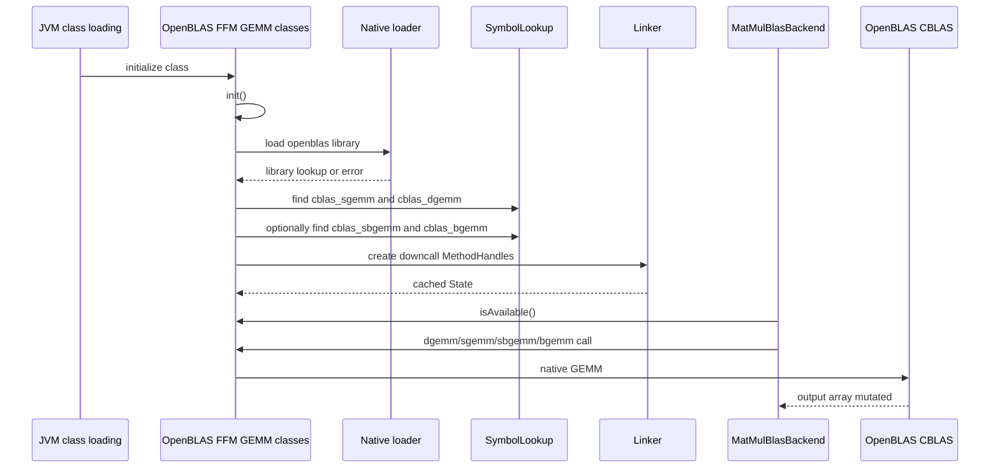
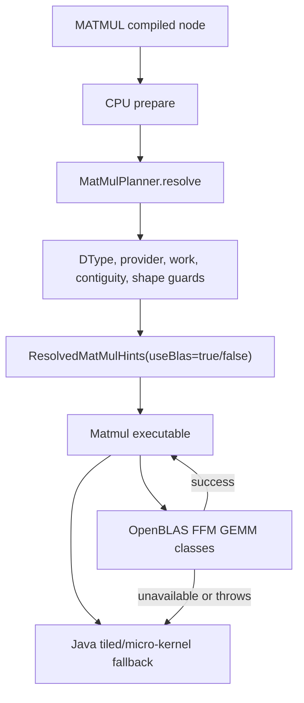

<!-- generated-by: gsd-doc-writer -->
# Native Bridges And BLAS

Navigation: [Index](index.md#recommended-reading-paths) | [Architecture](architecture.md#cpu-backend) | [Configuration](configuration.md#blasconfig) | [Modules](modules.md#backend-backend-contracts-selection-lowering-and-runtime-context) | [Compute Flow](compute-flow.md#lowering) | [Metal Backend](metal-backend.md#java-ffm-bridge) | [Testing](testing.md#native-and-optional-backend-tests) | [Troubleshooting](troubleshooting.md#openblas-missing-or-unavailable)

Chapters: [Why Native Bridges Exist](#why-native-bridges-exist) | [Term Map At A Glance](#term-map-at-a-glance) | [What BLAS Is](#what-blas-is) | [BLAS Naming And Levels](#blas-naming-and-levels) | [GEMM Mental Model](#gemm-mental-model) | [Matrix Storage Terms](#matrix-storage-terms) | [What Java FFM Is](#what-java-ffm-is) | [Java FFM Step-By-Step](#java-ffm-step-by-step) | [OpenBLAS In Synaptik](#openblas-in-synaptik) | [OpenBLAS Bridge Lifecycle](#openblas-bridge-lifecycle) | [Matmul Dispatch Flow](#matmul-dispatch-flow) | [Dispatch Terms](#dispatch-terms) | [Worked GEMM Example](#worked-gemm-example) | [BF16 And Batched BLAS](#bf16-and-batched-blas) | [Conv2d GEMM And BLAS](#conv2d-gemm-and-blas) | [Configuration And Library Lookup](#configuration-and-library-lookup) | [Trace And Debug Terms](#trace-and-debug-terms) | [Failure And Fallback Behavior](#failure-and-fallback-behavior) | [Performance Model](#performance-model) | [How This Differs From Metal FFM](#how-this-differs-from-metal-ffm) | [Common Misconceptions](#common-misconceptions) | [Source Map](#source-map)

This document explains two related but distinct concepts used by Synaptik's runtime: BLAS as an optimized native math library for matrix multiplication, and Java FFM as the Java-to-native bridge used to call libraries such as OpenBLAS, Metal, and CUDA shims.

## GPU Lowering Coverage Matrix

The checked-in [GPU Lowering Coverage Matrix](gpu-lowering-coverage.md) records Metal and CUDA operation-family support for `GPULOWER-01` through `GPULOWER-03`. Unsupported paths must stay trace-visible: planner rejection, fallback, native ABI mismatch, and CPU materialization boundaries are diagnostics, not hidden behavior.

## Table Of Contents

- [Why Native Bridges Exist](#why-native-bridges-exist)
- [Term Map At A Glance](#term-map-at-a-glance)
- [What BLAS Is](#what-blas-is)
- [BLAS Naming And Levels](#blas-naming-and-levels)
- [GEMM Mental Model](#gemm-mental-model)
- [Matrix Storage Terms](#matrix-storage-terms)
- [What Java FFM Is](#what-java-ffm-is)
- [Java FFM Step-By-Step](#java-ffm-step-by-step)
- [OpenBLAS In Synaptik](#openblas-in-synaptik)
- [OpenBLAS Bridge Lifecycle](#openblas-bridge-lifecycle)
- [Matmul Dispatch Flow](#matmul-dispatch-flow)
- [Dispatch Terms](#dispatch-terms)
- [Worked GEMM Example](#worked-gemm-example)
- [BF16 And Batched BLAS](#bf16-and-batched-blas)
- [Conv2d GEMM And BLAS](#conv2d-gemm-and-blas)
- [Configuration And Library Lookup](#configuration-and-library-lookup)
- [Trace And Debug Terms](#trace-and-debug-terms)
- [Failure And Fallback Behavior](#failure-and-fallback-behavior)
- [Performance Model](#performance-model)
- [How This Differs From Metal FFM](#how-this-differs-from-metal-ffm)
- [Common Misconceptions](#common-misconceptions)
- [Source Map](#source-map)

## Why Native Bridges Exist

Synaptik is written in Java, but some numerical kernels are better delegated to native libraries:

- matrix multiplication is a classic case where decades of CPU-specific work already exist in BLAS implementations;
- accelerator runtimes such as Metal and CUDA expose native APIs that Java cannot call directly as ordinary Java methods;
- a framework can keep the public `Tensor` API stable while swapping the physical execution path underneath a prepared graph.

The bridge is therefore not a second user-facing tensor API. User code still says:

```java
Tensor y = x.matmul(w);
y.compute();
```

The runtime decides during prepare whether that `MATMUL` node will use:

- a Java CPU kernel;
- a Java CPU kernel with vector/parallel policy;
- an OpenBLAS FFM call;
- an accelerator region such as Metal, when the graph and dtype are legal.

The important design boundary is: graph semantics stay in Java descriptors, while native bridges implement selected hot execution paths.

## Term Map At A Glance

This section defines the terms used in the rest of the document. The same word can mean subtly different things in
Java, C, BLAS, and accelerator code, so the table is intentionally concrete.

| Term | Plain meaning | Synaptik meaning |
|---|---|---|
| Native code | Code compiled outside the JVM, usually C, C++, Objective-C, CUDA, or system libraries. | OpenBLAS is native code; the Metal shim in `src/main/native/apple` is native Objective-C code. |
| Native library | A loadable binary such as `.dylib`, `.so`, or `.dll`. | OpenBLAS is loaded by `OpenBlasSymbols` and exposed through `OpenBlasRuntime`; Metal is loaded through `synaptik.metal.mps.lib`. |
| Bridge | Java code that adapts Java objects and memory into a native call contract. | OpenBLAS uses split FFM classes: `OpenBlasArrayGemm` for Java arrays and `OpenBlasSegmentGemm` for native CPU storage. Metal and CUDA still use `MetalMpsFfmBridge` and `CudaFfmBridge`. |
| API | Source-level interface used by code. | `Tensor.matmul(...)`, `BlasConfig`, `OpenBlasArrayGemm.sgemmRowMajorNoTrans(...)`. |
| ABI | Binary/runtime contract: symbol name, argument order, primitive sizes, pointer meaning, ownership, and lifetime. | `cblas_dgemm` must receive exactly the argument layout described by the FFM `FunctionDescriptor`. |
| Symbol | Exported native function or data name found in a native library. | `cblas_sgemm`, `cblas_dgemm`, `cblas_sbgemm`, `cblas_bgemm`. |
| Downcall | Java calling into native code. | `MethodHandle.invokeExact(...)` calls the CBLAS function. |
| Upcall | Native code calling back into Java. | Not used by the OpenBLAS bridge documented here. |
| Memory segment | Java FFM view of a memory region. | Array-copy BLAS calls allocate temporary native segments; native CPU storage calls pass `MemorySegment` slices directly. |
| Arena | Lifetime scope for FFM allocations and symbol lookup resources. | `Arena.ofShared()` keeps the library lookup state alive for the OpenBLAS bridge. |
| Provider | Runtime choice of implementation family. | `BlasProvider.NONE` or `BlasProvider.OPENBLAS_FFM`. |
| Fallback | Alternative execution path when a faster/specialized path is unavailable or illegal. | Matmul can fall back from OpenBLAS to Java CPU kernels. Metal can fall back to CPU replay. |
| Contiguous | Tensor storage has logical elements laid out in dense row-major order with no gaps or unusual strides. | BLAS matmul requires contiguous `A`, `B`, and output in the current planner. |
| Work estimate | Cheap arithmetic proxy for cost. | Matmul uses `M * N * K`; BLAS is considered only when that is at least `matmulMinWork`. |
| DType | Tensor element type. | BLAS path supports `FLOAT64`, `FLOAT32`, and `BFLOAT16` with different native routines. |
| GEMM | General Matrix Multiply. | The BLAS operation behind large matmul, linear, attention matmul fragments, and GEMM-lowered conv2d. |
| CBLAS | C interface to BLAS. | The bridge calls `cblas_sgemm`, `cblas_dgemm`, optional `cblas_sbgemm`, and optional `cblas_bgemm`. |

The most important separation is:

```text
Public tensor API:
  "What does the graph mean?"

Runtime config and planner:
  "Which execution path is legal and likely profitable?"

FFM bridge and native ABI:
  "How do Java arrays and primitive values cross into native code?"
```

## What BLAS Is

BLAS means Basic Linear Algebra Subprograms. It is a family of standard numerical routines for vector and matrix operations. BLAS is an interface convention, not one single implementation. OpenBLAS is one implementation of that convention.

The operation Synaptik primarily uses is GEMM:

```text
C = alpha * A @ B + beta * C
```

GEMM stands for General Matrix Multiply. It is the workhorse behind:

- direct `Tensor.matmul(...)`;
- `linear(x, weight, bias)` after shape normalization;
- attention projections and attention score/value products;
- convolution lowered to im2col + matrix multiplication.

Why call BLAS instead of always using Java loops?

1. BLAS libraries contain CPU-specific kernels tuned for cache hierarchy, SIMD width, instruction scheduling, and sometimes threading.
2. Large matrix multiplication is expensive enough that native-call overhead is small compared with the arithmetic work.
3. A framework can keep its own Java fallback for portability while using BLAS when the shape and dtype match a good native path.

Synaptik does not expose BLAS directly to user tensor code. BLAS is a runtime provider selected by `BlasConfig` and consumed by CPU matmul/conv planning.

## BLAS Naming And Levels

BLAS routines are traditionally grouped by the shape of the operation:

| BLAS level | Typical input | Example routine kind | Why it matters |
|---|---|---|---|
| Level 1 | vector + vector | dot product, vector scale, vector add | Too small/granular for the current Synaptik BLAS bridge. Java vectorized kernels cover many elementwise cases. |
| Level 2 | matrix + vector | matrix-vector multiply | Useful in some libraries, but not the primary hot path in this repository. |
| Level 3 | matrix + matrix | GEMM | High arithmetic intensity; this is the main reason to call OpenBLAS from Synaptik. |

"Arithmetic intensity" means how much computation happens per byte of memory moved. GEMM has high arithmetic intensity
because each loaded block of `A` and `B` can be reused for many multiply-adds. Elementwise add has low arithmetic
intensity because each input value is usually read once and used for one cheap operation. That is why a native BLAS call
is most attractive for large matrix multiplication, not for every small tensor operation.

BLAS routine names encode dtype and operation:

| Routine | Prefix | Operation | Input/output family |
|---|---|---|---|
| `sgemm` | `s` = single precision | GEMM | `float` / `FLOAT32` |
| `dgemm` | `d` = double precision | GEMM | `double` / `FLOAT64` |
| `sbgemm` | `s` output/accumulation with `b` BF16 inputs | GEMM | `short` BF16 inputs, `float` output buffer |
| `bgemm` | `b` BF16 output with BF16 inputs | GEMM | `short` BF16 inputs, `short` BF16 output buffer |

Synaptik calls the CBLAS entry points, so the actual symbols include the `cblas_` prefix:

```text
cblas_sgemm
cblas_dgemm
cblas_sbgemm
cblas_bgemm
```

The `cblas_` prefix matters because a BLAS library may expose Fortran-style symbols, CBLAS symbols, or both. This
bridge is written against the C interface because its argument order and row-major layout enum are explicit from Java.

## GEMM Mental Model

For row-major matrices:

```text
A shape = [M, K]
B shape = [K, N]
C shape = [M, N]
```

Each output element is one dot product:

```text
C[row, col] = sum over i from 0 to K-1 of A[row, i] * B[i, col]
```

The BLAS call adds two scalar parameters:

```text
C = alpha * (A @ B) + beta * C
```

Synaptik's matmul path uses `alpha = 1` and `beta = 0`, so the destination is overwritten with the matrix product.

The CBLAS row-major no-transpose call receives:

| Parameter | Meaning in Synaptik's normal matmul call |
|---|---|
| `layout` | `CBLAS_ROW_MAJOR` (`101`) |
| `transA`, `transB` | `CBLAS_NO_TRANS` (`111`) |
| `m` | output rows |
| `n` | output columns |
| `k` | shared inner dimension |
| `alpha` | `1.0` |
| `a` | typed array segment for left input |
| `lda` | leading dimension of `A`; for contiguous row-major `[M,K]`, this is `K` |
| `b` | typed array segment for right input |
| `ldb` | leading dimension of `B`; for contiguous row-major `[K,N]`, this is `N` |
| `beta` | `0.0` |
| `c` | typed array segment for output |
| `ldc` | leading dimension of `C`; for contiguous row-major `[M,N]`, this is `N` |

## Matrix Storage Terms

BLAS APIs talk about memory layout, not only mathematical shapes. These terms are the difference between "the math is
valid" and "the native function will read the right bytes."

### Row-major

Row-major means consecutive elements of a row sit next to each other in memory.

For this matrix:

```text
A = [
  [1, 2, 3],
  [4, 5, 6]
]
```

row-major storage is:

```text
flat A = [1, 2, 3, 4, 5, 6]
          row 0       row 1
```

The element address formula is:

```text
A[row, col] lives at flatA[row * lda + col]
```

For a dense `[2,3]` row-major matrix, `lda = 3`:

```text
A[0,0] = flatA[0 * 3 + 0] = flatA[0] = 1
A[0,2] = flatA[0 * 3 + 2] = flatA[2] = 3
A[1,0] = flatA[1 * 3 + 0] = flatA[3] = 4
A[1,2] = flatA[1 * 3 + 2] = flatA[5] = 6
```

### Leading dimension

The leading dimension is the stride between adjacent logical rows for row-major CBLAS. In dense row-major storage it is
the number of columns. It is named "leading dimension" because old BLAS APIs needed one general term for both
row-major and column-major conventions.

Dense row-major example:

```text
shape = [2, 3]
lda = 3
flat = [
  1, 2, 3,   // row 0
  4, 5, 6    // row 1
]
```

Padded row-major example:

```text
logical shape = [2, 3]
lda = 5
flat = [
  1, 2, 3, pad, pad,
  4, 5, 6, pad, pad
]
```

Synaptik's current BLAS matmul planner requires contiguous inputs and outputs, so the normal BLAS path uses the dense
case: `lda = K`, `ldb = N`, `ldc = N`.

### Transpose flags

`CBLAS_NO_TRANS` means "read this input exactly as stored." The current bridge methods are named
`RowMajorNoTrans` because Synaptik routes the common contiguous tensor case into:

```text
C = A @ B
```

not:

```text
C = transpose(A) @ B
C = A @ transpose(B)
```

If a future path wants BLAS to consume transposed views without materializing them, it would need planner support,
correct leading-dimension handling, and new bridge entry points or parameters.

### Contiguous versus merely valid tensor layout

A tensor can be logically valid but still not contiguous. For example, a transposed view of a `[2,3]` matrix can be a
valid `[3,2]` tensor whose strides point through the original storage in a different order. That is fine for many Java
strided kernels, but the current BLAS dispatch intentionally rejects it because the bridge methods assume dense
row-major buffers.

```text
Dense contiguous [2,3]:
  shape   = [2, 3]
  strides = [3, 1]
  storage = [1, 2, 3, 4, 5, 6]

Transposed view [3,2]:
  shape   = [3, 2]
  strides = [1, 3]
  storage = [1, 2, 3, 4, 5, 6]
```

The transposed view is not "wrong"; it just is not the contract accepted by `OpenBlasArrayGemm.sgemmRowMajorNoTrans(...)`.

## What Java FFM Is

Java FFM means Java Foreign Function and Memory API. In this repository it is the standard Java mechanism used to:

1. load a native library;
2. find exported native symbols;
3. describe the native function signature;
4. turn a symbol into a `MethodHandle`;
5. pass Java-managed or native memory segments to that function.

The core Java types used in the bridge code are:

| Java FFM type | Role in Synaptik |
|---|---|
| `Arena` | Lifetime owner for native allocations and library lookup handles. |
| `SymbolLookup` | Finds native functions such as `cblas_sgemm` or `synaptik_apple_mps_execute_partition_f32_buffers`. |
| `Linker.nativeLinker()` | Creates Java downcall handles into native code. |
| `FunctionDescriptor` | Describes native argument and return layouts. |
| `MemorySegment` | Represents memory passed across the native boundary. |
| `MethodHandle` | Callable Java object for the native function. |

The simplified pattern looks like this:

```java
Arena arena = Arena.ofShared();
SymbolLookup lookup = SymbolLookup.libraryLookup("openblas", arena);
Linker linker = Linker.nativeLinker();

MethodHandle dgemm = linker.downcallHandle(
        lookup.find("cblas_dgemm").orElseThrow(),
        FunctionDescriptor.ofVoid(
                JAVA_INT, JAVA_INT, JAVA_INT,
                JAVA_INT, JAVA_INT, JAVA_INT,
                JAVA_DOUBLE,
                ADDRESS, JAVA_INT,
                ADDRESS, JAVA_INT,
                JAVA_DOUBLE,
                ADDRESS, JAVA_INT
        )
);
```

Then Java array contents are copied into a native memory segment before being passed to the native function:

```java
double[] a = {1.0, 2.0, 3.0, 4.0};
try (Arena callArena = Arena.ofConfined()) {
    MemorySegment aSegment = callArena.allocateFrom(JAVA_DOUBLE, a);
}
```

For OpenBLAS, the source code creates short-lived native `MemorySegment` buffers for each CBLAS call, copies Java tensor
array contents into those buffers, invokes the native function, and copies the output buffer back to the Java tensor
array. That is still different from long-lived device-owned tensor storage: the values remain ordinary Java tensor
arrays between calls, and the native buffer exists only for the duration of that CPU kernel.

## Java FFM Step-By-Step

The OpenBLAS implementation follows a repeatable FFM pattern. Library lookup and downcall binding map directly to
[`OpenBlasSymbols.java`](../src/main/java/backend/blas/OpenBlasSymbols.java); availability queries are exposed through
[`OpenBlasRuntime.java`](../src/main/java/backend/blas/OpenBlasRuntime.java).

### 1. Choose a library lookup

`SymbolLookup.libraryLookup(...)` opens a native library and makes its exported symbols searchable.

```java
String explicit = System.getProperty("openblas.lib");
if (explicit != null && !explicit.isBlank()) {
    return SymbolLookup.libraryLookup(explicit.trim(), arena);
}
String envLib = System.getenv("OPENBLAS_LIB");
if (envLib != null && !envLib.isBlank()) {
    return SymbolLookup.libraryLookup(envLib.trim(), arena);
}
try {
    return SymbolLookup.libraryLookup(Loader.load(openblas.class), arena);
} catch (Throwable bundledFailure) {
    // fall through to the platform loader name
}
return SymbolLookup.libraryLookup("openblas", arena);
```

Term explanations:

| Term | Meaning |
|---|---|
| System property | JVM-level key/value passed with `-Dkey=value`, for example `-Dopenblas.lib=/opt/lib/libopenblas.dylib`. |
| Environment variable | Process environment key/value, for example `OPENBLAS_LIB=/opt/lib/libopenblas.dylib`. |
| Bundled JavaCPP preset | The transitive `org.bytedeco:openblas-platform` dependency packaged with Synaptik. This lets consumer projects use OpenBLAS without setting a native library path. |
| Library name | Platform loader name. `"openblas"` lets the operating system search configured library paths. |
| Lookup order | Priority rule. Explicit JVM property wins over environment variable; environment variable wins over bundled JavaCPP; bundled JavaCPP wins over the platform loader name. |

### 2. Find native symbols

A symbol is the native function name. The bridge requires `cblas_sgemm` and `cblas_dgemm`; it treats `cblas_sbgemm`
and `cblas_bgemm` as optional.

```java
lookup.find("cblas_dgemm").orElseThrow()
```

If the symbol is missing, Java cannot call that function even if the library itself loaded. That is why "OpenBLAS
library found", "BF16 `sbgemm` is available", and "BF16 `bgemm` is available" are separate facts.

### 3. Describe the native function signature

FFM needs the native ABI layout. For `dgemm`, the bridge declares a `void` function receiving integers, doubles, and
addresses:

```java
FunctionDescriptor.ofVoid(
        JAVA_INT, JAVA_INT, JAVA_INT,
        JAVA_INT, JAVA_INT, JAVA_INT,
        JAVA_DOUBLE,
        ADDRESS, JAVA_INT,
        ADDRESS, JAVA_INT,
        JAVA_DOUBLE,
        ADDRESS, JAVA_INT
)
```

This maps to:

```text
void cblas_dgemm(
  int layout,
  int transA,
  int transB,
  int m,
  int n,
  int k,
  double alpha,
  double* A,
  int lda,
  double* B,
  int ldb,
  double beta,
  double* C,
  int ldc
)
```

The descriptor is an ABI promise. If Java says `JAVA_DOUBLE` where native code expects a pointer, or swaps `m` and
`alpha`, the JVM can pass invalid bits to native code. That is why the bridge centralizes this code instead of building
native signatures ad hoc inside kernels.

### 4. Create a downcall method handle

The linker turns the symbol and descriptor into something Java can call:

```java
MethodHandle dgemm = linker.downcallHandle(symbol, descriptor);
```

"Downcall" means Java calling down into native code. The returned `MethodHandle` is strongly tied to the declared
descriptor. `invokeExact(...)` must use the exact Java argument types expected by that method handle.

### 5. Copy Java arrays into call-local native segments

The bridge uses call-local native segments because CBLAS receives raw address parameters. Java heap segments are not
passed directly as `ADDRESS` downcall arguments.

```java
try (Arena callArena = Arena.ofConfined()) {
    MemorySegment aSeg = callArena.allocateFrom(JAVA_FLOAT, aSlice);
    MemorySegment cSeg = callArena.allocateFrom(JAVA_FLOAT, cSlice);
}
```

For an offset call:

```text
float[] src length = 1000
offset elements = 200
length elements = 128
byteOffset = 200 * 4 = 800
byteLength = 128 * 4 = 512
```

The native routine receives the call-local segment as an address. After the call, Synaptik copies the destination
segment back into the Java tensor array at the requested offset.

### 6. Invoke the native routine

The final call passes CBLAS enum values, dimensions, scalars, memory segments, and leading dimensions:

```java
STATE.dgemm.invokeExact(
        CBLAS_ROW_MAJOR,
        CBLAS_NO_TRANS,
        CBLAS_NO_TRANS,
        m,
        n,
        k,
        alpha,
        aSeg,
        lda,
        bSeg,
        ldb,
        beta,
        cSeg,
        ldc
);
```

After the native call returns, Synaptik copies the destination native segment back into the destination Java array.
This keeps the public tensor storage model Java-owned while still allowing the native GEMM implementation to run.

## OpenBLAS In Synaptik

The OpenBLAS FFM implementation is split by responsibility:

- [`OpenBlasSymbols.java`](../src/main/java/backend/blas/OpenBlasSymbols.java) owns native library lookup and downcall handles.
- [`OpenBlasRuntime.java`](../src/main/java/backend/blas/OpenBlasRuntime.java) exposes availability, capability, lookup-source, and thread-policy queries.
- [`OpenBlasArrayGemm.java`](../src/main/java/backend/blas/OpenBlasArrayGemm.java) owns Java primitive-array GEMM calls and their temporary native call buffers.
- [`OpenBlasSegmentGemm.java`](../src/main/java/backend/blas/OpenBlasSegmentGemm.java) owns no-copy `MemorySegment` GEMM calls for native CPU storage.

It discovers these symbols:

| Symbol | Required | Used for |
|---|---:|---|
| `cblas_sgemm` | Yes | `FLOAT32` matrix multiplication |
| `cblas_dgemm` | Yes | `FLOAT64` matrix multiplication |
| `cblas_sbgemm` | Optional | `BFLOAT16` inputs with `FLOAT32` output/continuation |
| `cblas_bgemm` | Optional | `BFLOAT16` inputs with `BFLOAT16` output |

The bridge exposes Java methods that intentionally constrain the ABI to the subset Synaptik actually uses:

| Java method | DType | Shape style | Native routine |
|---|---|---|---|
| `sgemmRowMajorNoTrans(...)` | `FLOAT32` | rank-2 contiguous matrix | `cblas_sgemm` |
| `sgemmRowMajorNoTransOffsets(...)` | `FLOAT32` | batched/offset call loop | `cblas_sgemm` |
| `dgemmRowMajorNoTrans(...)` | `FLOAT64` | rank-2 contiguous matrix | `cblas_dgemm` |
| `dgemmRowMajorNoTransOffsets(...)` | `FLOAT64` | batched/offset call loop | `cblas_dgemm` |
| `sbgemmRowMajorNoTrans(...)` | `BFLOAT16` input, `FLOAT32` output | rank-2 contiguous matrix | `cblas_sbgemm` |
| `sbgemmRowMajorNoTransOffsets(...)` | `BFLOAT16` input, `FLOAT32` output | batched/offset call loop | `cblas_sbgemm` |
| `bgemmRowMajorNoTrans(...)` | `BFLOAT16` input, `BFLOAT16` output | rank-2 contiguous matrix | `cblas_bgemm` |
| `bgemmRowMajorNoTransOffsets(...)` | `BFLOAT16` input, `BFLOAT16` output | batched/offset call loop | `cblas_bgemm` |
| `sgemmRowMajorNoTransSegment(...)` | `FLOAT32` native storage | rank-2 contiguous native segment | `cblas_sgemm` |
| `dgemmRowMajorNoTransSegment(...)` | `FLOAT64` native storage | rank-2 contiguous native segment | `cblas_dgemm` |
| `sbgemmRowMajorNoTransSegment(...)` | `BFLOAT16` native input, `FLOAT32` native output | rank-2 contiguous native segment | `cblas_sbgemm` |
| `bgemmRowMajorNoTransSegment(...)` | `BFLOAT16` native input, `BFLOAT16` native output | rank-2 contiguous native segment | `cblas_bgemm` |

Availability is discovered once at class initialization:

```java
private static final OpenBlasSymbols INSTANCE = init();
```

`OpenBlasRuntime.isAvailable()` means the library was loadable and the required `sgemm`/`dgemm` symbols were found. Optional BF16 support is reported separately:

- `isBFloat16ToFloatGemmAvailable()` checks `cblas_sbgemm`.
- `isBFloat16OutputGemmAvailable()` checks `cblas_bgemm`.
- `isBFloat16GemmAvailable()` is a broad convenience check meaning at least one optional BF16 GEMM symbol exists.

The distinction matters. `cblas_sbgemm` is useful for BF16 inputs feeding a `FLOAT32` continuation. It is not a BF16-output GEMM. A public BF16 matmul/linear output can be reported as OpenBLAS BF16-output only when `cblas_bgemm` is available and selected.

## OpenBLAS Bridge Lifecycle

The bridge lifecycle is intentionally front-loaded. It discovers the native library and function symbols once, then
kernel execution only checks the cached state.



### `State`

`State` is the bridge's immutable cached discovery result. It contains:

| Field | Meaning |
|---|---|
| `available` | Whether required symbols were found and handles were created. |
| `reason` | Failure reason when unavailable. |
| `source` | Which lookup source won: explicit property, environment variable, bundled JavaCPP preset, or system library name. |
| `arenaRef` | Shared arena kept alive so library lookup resources remain valid. |
| `sgemm` | Downcall handle for `cblas_sgemm`. |
| `dgemm` | Downcall handle for `cblas_dgemm`. |
| `sbgemm` | Optional downcall handle for `cblas_sbgemm`, BF16 inputs to F32 output. |
| `bgemm` | Optional downcall handle for `cblas_bgemm`, BF16 inputs to BF16 output. |

The field is static:

```java
private static final State STATE = init();
```

That means discovery happens once when the class is initialized. Runtime kernels do not repeatedly search the file
system or recreate method handles for every matmul.

### `isAvailable()` versus provider selection

There are two separate questions:

```text
Question 1: Did the runtime profile select OPENBLAS_FFM?
  Source: BlasConfig.provider()

Question 2: Can this JVM actually call the native symbols right now?
  Source: OpenBlasRuntime.isAvailable()
```

Both must be true for a BLAS call to happen. A persisted calibration profile can say `OPENBLAS_FFM`, but a different
machine or shell can still lack `libopenblas`, in which case the bridge is unavailable.

### Required versus optional symbols

`cblas_sgemm` and `cblas_dgemm` are required because the bridge reports global OpenBLAS availability only when the main
`FLOAT32` and `FLOAT64` GEMM paths exist. `cblas_sbgemm` and `cblas_bgemm` are optional because not every OpenBLAS build exports BF16 GEMM symbols, and some builds expose one but not the other.

Practical effect:

```text
OpenBLAS library has sgemm and dgemm:
  OpenBlasRuntime.isAvailable() == true

OpenBLAS library also has sbgemm:
  BF16 -> F32 continuation path can try native sbgemm

OpenBLAS library also has bgemm:
  BF16 -> BF16 output path can try native bgemm

OpenBLAS library lacks bgemm:
  BF16-output matmul planning must not claim native OpenBLAS BF16-output
```

Bundled JavaCPP OpenBLAS enables the symbols that its packaged native build actually exports. On a given machine that may include `cblas_sbgemm` but not `cblas_bgemm`. Tests therefore gate BF16 continuation and BF16-output coverage separately.

## Matmul Dispatch Flow

Matmul does not call OpenBLAS just because `OPENBLAS_FFM` is selected. The planner must decide that the operation is legal and likely worth the native call.

The decision starts in [`MatMulPlanner.java`](../src/main/java/backend/cpu/kernels/linalg/matmul/plan/MatMulPlanner.java). For ordinary rank-2 BLAS, the current source checks:

1. Output dtype is `FLOAT32`, `FLOAT64`, or `BFLOAT16`.
2. `blasConfig.provider() == BlasProvider.OPENBLAS_FFM`.
3. Estimated work `M * N * K` is at least `blasConfig.matmulMinWork()`.
4. `A`, `B`, and output are contiguous.
5. For `FLOAT32` and `BFLOAT16`, shape guards pass:
   - optionally require `M >= K`;
   - require `N / K <= maxNOverK`;
   - use the separate wide-shape guard when `N / K > 4.0`.
6. For `BFLOAT16`, the required symbol matches the requested output contract:
   - float continuation requires `cblas_sbgemm`;
   - BF16 output requires `cblas_bgemm`;
   - native segment BF16-output route is not selected when `cblas_bgemm` is missing.

`RuntimeConfig.cpuStorageProfile()` is the high-level runtime policy for CPU storage. It answers the question "should this prepared execution stay on Java arrays, prefer native CPU storage, or let the planner decide?" The current values are:

| CPU storage profile | Meaning |
|---|---|
| `CPU_ARRAY` | Keep CPU compute on Java arrays. |
| `CPU_NATIVE` | Prefer `MemorySegment`-backed native CPU storage for supported operations. |
| `AUTO` | Let the planner choose between array and native storage. |

`RuntimeConfig.nativeCpuFailurePolicy()` is the companion diagnostic policy. `FALLBACK_TO_ARRAY` permits unsupported native CPU matmul segment routes to use the Java-array path; `REQUIRE_NATIVE` turns those selected-route fallbacks into errors. Broader chain-aware native planner enforcement remains future scope.

`BlasConfig.storageMode()` is narrower. It determines whether an eligible dense rank-2 GEMM stays on the existing array-copy bridge or may use `MemorySegment`-backed native CPU storage:

| Storage mode | Meaning |
|---|---|
| `CPU_ARRAY` | Existing Java-array BLAS route. The bridge allocates native call buffers and copies arrays in/out. |
| `CPU_NATIVE` | Prefer the native segment route for legal dense rank-2 F32/F64 and legal BF16-output when `cblas_bgemm` exists. |
| `AUTO` | Let the planner choose native segment route for supported large dense GEMM shapes. |

The execution call then goes through [`MatMulBlasBackend.java`](../src/main/java/backend/cpu/kernels/linalg/matmul/blas/MatMulBlasBackend.java):

```text
Prepared matmul metadata says "use BLAS"
  -> dtype-specific executable calls MatMulBlasBackend.tryBlasF32/F64/BF16
  -> OpenBlasRuntime.isAvailable() is checked
  -> cblas_*gemm is invoked through FFM
  -> true means BLAS filled the output array
  -> false means the Java fallback kernel should run
```

For the native segment route, the execution flow is different:

```text
Prepared matmul metadata says route=OPENBLAS_NATIVE_SEGMENT
  -> dtype-specific native executable requests native-readable inputs
  -> ExecutionState materializes CPU_NATIVE only if needed
  -> OpenBlasSegmentGemm.*Segment(...) receives MemorySegment slices
  -> output is attached as CPU_NATIVE current
  -> CPU array publication is delayed until PublicationPolicy or a CPU-array consumer requires it
```

This is the route that removes the Java array copy at the BLAS boundary. It is still a CPU backend route, not a Metal/CUDA accelerator route.



## Dispatch Terms

Dispatch is the act of choosing an implementation for a node. For BLAS matmul, dispatch is split across prepare time
and execution time.

### Prepare-time terms

| Term | Meaning | Concrete source |
|---|---|---|
| Planner | Code that turns runtime config and tensor metadata into execution hints. | `MatMulPlanner` |
| Hint | Prepared decision consumed by execution. | `ResolvedMatMulHints` |
| Work | Arithmetic proxy `batchCount * M * N * K`. | Computed in `MatMulPlanner.resolve(...)` |
| Threshold | Minimum value that must be reached before a path is eligible. | `BlasConfig.matmulMinWork()` |
| Shape guard | Rule that rejects shapes previously measured or assumed to be bad for BLAS. | `f32RequireMgeK`, `f32MaxNOverK`, wide-shape variants |
| Contiguity guard | Rule that rejects strided/view layouts for the current BLAS path. | `aContiguous`, `bContiguous`, `outContiguous` |
| Batched BLAS hint | Prepared decision that loops over batch offsets and calls GEMM per batch. | `useBatchedBlas` in `ResolvedMatMulHints` |

Example prepare-time reasoning:

```text
A shape = [2048, 256]
B shape = [256, 256]
C shape = [2048, 256]
dtype = FLOAT32
provider = OPENBLAS_FFM
matmulMinWork = 4,000,000

M = 2048
K = 256
N = 256
work = 2048 * 256 * 256 = 134,217,728
N / K = 1.0

If A/B/C are contiguous and f32RequireMgeK is true:
  M >= K is true
  N / K <= f32MaxNOverK is likely true
  work >= matmulMinWork is true
  useBlas = true
```

Counterexample:

```text
A shape = [32, 64]
B shape = [64, 32]
work = 65,536
matmulMinWork = 4,000,000

Even with OPENBLAS_FFM selected:
  useBlas = false
  reason = too small to justify BLAS dispatch threshold
```

### Execution-time terms

| Term | Meaning | Concrete source |
|---|---|---|
| Executable | Dtype-specific matmul implementation object selected/prepared for execution. | `F64BlasMatMulExecutable`, `F32BlasMatMulExecutable`, `BF16BlasMatMulExecutable` |
| Try method | Wrapper that attempts BLAS and returns success/failure. | `MatMulBlasBackend.tryBlasF32/F64/BF16` |
| Bridge availability | Whether native symbols are available in this JVM. | `OpenBlasRuntime.isAvailable()` |
| Java fallback | Built-in CPU implementation used when BLAS is unavailable or fails. | Dtype-specific Java matmul executable path |
| Debug log | Optional stderr message explaining BLAS unavailability/failure. | `BlasRuntime.debug()` |

This split avoids putting native availability checks into graph optimization. The optimizer should not need to know
whether a developer's shell happens to have OpenBLAS installed today. The runtime profile and prepare stage decide the
execution path close to where it will be used.

## Worked GEMM Example

User-level operation:

```java
Tensor a = new Tensor(
        new double[]{
                1.0, 2.0, 3.0,
                4.0, 5.0, 6.0
        },
        new int[]{2, 3},
        null,
        "a",
        DataType.FLOAT64
);
// a = [
//   [1, 2, 3],
//   [4, 5, 6]
// ]

Tensor b = new Tensor(
        new double[]{
                7.0,  8.0,
                9.0, 10.0,
                11.0, 12.0
        },
        new int[]{3, 2},
        null,
        "b",
        DataType.FLOAT64
);
// b = [
//   [ 7,  8],
//   [ 9, 10],
//   [11, 12]
// ]

Tensor c = a.matmul(b);
// c = [
//   [ 58,  64],
//   [139, 154]
// ]
```

The arithmetic is:

```text
C[0,0] = 1*7 + 2*9 + 3*11 = 58
C[0,1] = 1*8 + 2*10 + 3*12 = 64
C[1,0] = 4*7 + 5*9 + 6*11 = 139
C[1,1] = 4*8 + 5*10 + 6*12 = 154
```

For this exact shape, the OpenBLAS call would be:

```text
cblas_dgemm(
  layout = CBLAS_ROW_MAJOR,
  transA = CBLAS_NO_TRANS,
  transB = CBLAS_NO_TRANS,
  m = 2,
  n = 2,
  k = 3,
  alpha = 1.0,
  A = pointer/segment to a double array,
  lda = 3,
  B = pointer/segment to b double array,
  ldb = 2,
  beta = 0.0,
  C = pointer/segment to c double array,
  ldc = 2
)
```

In the default runtime this tiny example usually should not use BLAS because `M * N * K = 12`, far below the default `matmulMinWork = 2_000_000`. The example is still useful because it shows the exact parameter mapping. A realistic BLAS candidate might be:

```text
A = [1024, 1024]
B = [1024, 1024]
C = [1024, 1024]
work = 1024 * 1024 * 1024 = 1,073,741,824
```

That work value passes the default work threshold, assuming provider, dtype, contiguity, and shape guards also pass.

## BF16 And Batched BLAS

`BFLOAT16` uses a different shape from `FLOAT32` and `FLOAT64`:

1. Synaptik stores BF16 values as `short[]`.
2. The OpenBLAS bridge optionally looks for two BF16 symbols, `cblas_sbgemm` and `cblas_bgemm`.
3. `sbgemm` consumes BF16 inputs and writes a `float[]` or F32 native output buffer.
4. `bgemm` consumes BF16 inputs and writes a BF16 `short[]` or BF16 native output buffer.

That means there are two different BF16 BLAS contracts:

```text
cblas_sbgemm:
  BF16 A, BF16 B -> F32 C
  good for float continuation and promoted compute
  not a BF16-output route

cblas_bgemm:
  BF16 A, BF16 B -> BF16 C
  required for true OpenBLAS BF16-output matmul/linear
```

If only `sbgemm` is available, Synaptik can accelerate BF16-to-F32 continuation paths, but it must not report a public BF16-output matmul as native OpenBLAS BF16-output. If `bgemm` is unavailable, BF16-output execution must stay on Java/native promoted fallback or another backend, with the route and fallback visible in trace.

Batched BLAS in the current matmul backend is not a single strided-batched CBLAS call. `MatMulBlasBackend.tryBatchedBlasF32/F64/BF16(...)` computes per-batch offsets and calls the same row-major no-transpose GEMM in a Java loop:

```text
for each batch:
  call cblas_sgemm/cblas_dgemm/cblas_sbgemm/cblas_bgemm with an input/output offset
```

This is still useful for attention-like batched shapes, but it is not the same ABI as a vendor-provided `gemm_strided_batched` routine.

## Conv2d GEMM And BLAS

Convolution can be lowered to matrix multiplication. The usual pattern is:

```text
input image patches -> im2col matrix
weights             -> packed weight matrix
matmul              -> output matrix
output matrix       -> convolution output tensor layout
```

Synaptik's GEMM convolution path lives in [`Conv2dGemmBackend.java`](../src/main/java/backend/cpu/kernels/nn/Conv2dGemmBackend.java). It can use the same OpenBLAS bridge after the convolution has been transformed into GEMM-shaped buffers.

Important difference from ordinary matmul fallback:

- matmul BLAS helpers usually return `false` when OpenBLAS is unavailable, and the Java matmul fallback can run;
- a prepared conv2d GEMM plan that explicitly requires `OPENBLAS_FFM` checks bridge availability and throws if the required bridge is unavailable.

The conv trace can expose whether BLAS or Java was used for GEMM-lowered convolution. See [Compute Flow: Traces](compute-flow.md#traces) for trace fields.

## Configuration And Library Lookup

Runtime BLAS policy is stored in [`BlasConfig.java`](../src/main/java/config/runtime/BlasConfig.java):

| Field | Meaning |
|---|---|
| `provider` | `NONE` or `OPENBLAS_FFM`. |
| `matmulMinWork` | Minimum `M * N * K` work before matmul BLAS is eligible. |
| `f32RequireMgeK` | Whether normal `FLOAT32`/`BFLOAT16` BLAS candidates require `M >= K`. |
| `f32MaxNOverK` | Maximum normal-shape `N / K` ratio. |
| `f32WideRequireMgeK` | Separate `M >= K` rule for wide shapes where `N / K > 4.0`. |
| `f32WideMaxNOverK` | Separate max `N / K` rule for wide shapes. |
| `storageMode` | BLAS storage route policy: `CPU_ARRAY`, `CPU_NATIVE`, or `AUTO`. |
| `debug` | Enables BLAS fallback diagnostics. |
| `threads` | Normalized to `0` in the current implementation; calibration should not treat it as an active thread-count knob. |

The available providers are:

```java
BlasProvider.NONE
BlasProvider.OPENBLAS_FFM
```

OpenBLAS library lookup order:

```text
1. JVM property: -Dopenblas.lib=/absolute/path/to/libopenblas.dylib
2. Environment variable: OPENBLAS_LIB=/absolute/path/to/libopenblas.dylib
3. Bundled JavaCPP OpenBLAS from the Synaptik runtime classpath
4. Library name: openblas
```

Example explicit runtime config:

```java
RuntimeConfig runtime = new RuntimeConfig(
        KernelTuningConfig.trainingDefaults(),
        ApproximationConfig.defaults(),
        new BlasConfig(
                BlasProvider.OPENBLAS_FFM,
                4_000_000L, // matmulMinWork
                true,       // f32RequireMgeK
                1.5d,       // f32MaxNOverK
                true,       // f32WideRequireMgeK
                12.0d,      // f32WideMaxNOverK
                BlasStorageMode.CPU_NATIVE,
                true        // debug
        )
);
```

## Trace And Debug Terms

The runtime can expose BLAS decisions in two places: prepared metadata traces and optional debug logging.

### Matmul trace fields

When a run is traced, `metadata.matMul` records the prepared matmul decision. The exact structure is represented by
trace metadata classes under `graph.execution.trace`, but conceptually you should read it as:

```text
matMul:
  useBlas = true/false
  useBatchedBlas = true/false
  blasProvider = OPENBLAS_FFM/NONE
  blasSymbol = cblas_sgemm/cblas_dgemm/cblas_sbgemm/cblas_bgemm
  blasRoute = JAVA_DIRECT/OPENBLAS_ARRAY_COPYING/OPENBLAS_NATIVE_SEGMENT
  route = concrete runtime route selected for this execution
  copyInBytes = estimated native-boundary input copy bytes
  copyOutBytes = estimated native-boundary output copy bytes
  nativeTempBytes = estimated temporary native bytes
  threadPolicy = AUTO_UNCONTROLLED for current OpenBLAS integration
  fallbackReason = dynamic fallback reason, when present
  parallel = true/false
  tileM/tileN/tileK = Java fallback tiling hints
  workers = planned worker count
  work = M * N * K * batchCount
  microKernel = Java fallback micro-kernel choice
```

Important interpretation:

```text
useBlas=true
  Prepare believed BLAS was eligible for this node.

OpenBLAS bridge unavailable during execution
  MatMulBlasBackend can still fall back to Java for ordinary matmul.

Trace says provider=OPENBLAS_FFM elsewhere
  The runtime profile selected the provider; it does not prove every node used native BLAS.

Trace says openblasSbgemmAvailable=true
  cblas_sbgemm was discovered. BF16 -> F32 continuation can use it.

Trace says openblasBgemmAvailable=false
  cblas_bgemm was not discovered. BF16-output matmul must not be reported as native OpenBLAS BF16-output.
```

### Conv trace fields

Conv2d GEMM execution publishes a conv trace side channel. Useful terms:

| Term | Meaning |
|---|---|
| `executionKind` | Whether conv ran direct or through GEMM/im2col-style lowering. |
| `blasProvider` | Provider configured for the conv GEMM path, such as `NONE` or `OPENBLAS_FFM`. |
| `blasUsed` | Whether BLAS calls were actually used. |
| `blasCalls` | Number of native BLAS GEMM calls made by the conv path. |
| `javaCalls` | Number of Java GEMM fallback calls made by the conv path. |
| GEMM dimensions | Matrix dimensions produced by conv lowering, not the original image tensor shape. |

This distinction matters because one high-level conv operation can execute many GEMM calls: for batches, groups,
forward, backward-input, or backward-weight loops.

### Debug logging

`BlasRuntime.debug()` reads `cg.cpu.blas.debug`. When enabled, failed or unavailable BLAS attempts can print messages
such as:

```text
[BLAS] OpenBLAS FFM unavailable, using Java matmul fallback. Reason: ...
[BLAS] SGEMM failed, fallback to Java kernel: ...
```

Debug logs are a diagnostic aid, not a stable API. For automated checks, prefer trace metadata and tests.

## Failure And Fallback Behavior

OpenBLAS is optional. Java-only execution must remain valid for normal CPU workloads.

Expected fallback behavior:

- If the provider is `NONE`, the planner does not select BLAS.
- If the provider is `OPENBLAS_FFM` but work/shape/contiguity gates fail, the planner chooses Java execution.
- If a matmul BLAS call throws or the bridge is unavailable at execution time, `MatMulBlasBackend` returns `false` and the Java matmul fallback runs.
- If `BlasRuntime.debug()` is true, unavailable/failed BLAS calls emit diagnostic messages.
- If a prepared conv2d GEMM plan requires OpenBLAS and the bridge is not available, `Conv2dGemmBackend` throws.

This distinction matters for debugging: "BLAS provider selected" does not mean "this node ran through BLAS." The trace and prepared metadata are the source of truth.

## Performance Model

BLAS is not automatically faster for every matrix. The native path has fixed costs:

- planner and prepare metadata;
- Java-to-native downcall overhead;
- possible array pinning or memory access coordination inside the JVM/FFM runtime;
- extra BF16 materialization when output storage is BF16;
- possible native library internal threading overhead.

The native path pays off when the arithmetic dominates those costs. That is why Synaptik has:

- `matmulMinWork`;
- shape gates for `FLOAT32`/`BFLOAT16`;
- calibration profiles that can choose `NONE` or `OPENBLAS_FFM` per platform and dtype;
- graph autotune that should tune graph policy separately from platform calibration.

A practical rule of thumb for reading a benchmark:

```text
Small matmul:
  Java tiled/vector path may be better because native-call overhead is visible.

Large square-ish matmul:
  OpenBLAS is often a good candidate because GEMM dominates runtime.

Wide skinny or unusual shapes:
  Shape guards may keep execution on Java if measured profiles show OpenBLAS is not profitable.
```

## How This Differs From Metal FFM

OpenBLAS FFM and Metal FFM use the same Java mechanism, but the execution model is different.

| Aspect | OpenBLAS FFM | Metal FFM |
|---|---|---|
| Native library | OpenBLAS CBLAS implementation | Synaptik Objective-C shim over MPSGraph |
| Unit of execution | One GEMM call | Lowered accelerator graph/region |
| Main data location | Java CPU tensor arrays | Java arrays for legacy path, explicit `MTLBuffer` handles for buffer-binding path |
| Output ownership | Java array is current after call | Buffer path can mark output `DEVICE_OWNED` until CPU materialization |
| Capability gate | Library and `cblas_*gemm` symbols | Library, MPS context, compile/execute symbols, dtype/layout/region legality |
| Fallback | Java CPU matmul/conv path | CPU replay of selected Metal region |

The shared concept is the ABI: Java and native code must agree exactly on symbol names, primitive argument layout, pointer meaning, ownership, and lifetime. For the Metal-specific ABI, see [Metal Backend: Native Buffer ABI](metal-backend.md#native-buffer-abi).

## Layout ABI v2 Metadata

Layout ABI v2 is additive beside the existing dense native buffer execution path. A backend can continue to execute
the v1 dense Metal or CUDA buffer ABI when layout ABI v2 symbols are absent. The v2 contract exists so later GPU layout
and view work can reason about non-contiguous buffers without changing the public `Tensor` API.

The shared Java metadata includes rank, shape, strides, storage offset, logical element count, logical byte length,
physical byte span, access mode, backend id, dtype, layout class, and native handle identity. Physical byte span is
distinct from logical byte length: logical bytes describe the tensor payload, while physical byte span describes the
backing storage extent implied by strides and storage offset.

Common records do not expose `MemorySegment`, `MTLBuffer`, CUDA pointers, or any public device tensor object. Metal and
CUDA remain responsible for native handle ownership and lifetime; shared code only sees an opaque native handle identity
string suitable for diagnostics.

Phase 9 establishes metadata, capability checks, and explicit fallback reasons. Phase 10 owns GPU-side layout/view
execution and any native transform path that consumes this metadata for actual non-contiguous execution.

## GPU Layout Transform Contract

The GPU layout transform and view path is the shared contract that keeps view-like layout operations on an accelerator
when the backend can describe or materialize the layout safely.

Phase 10 separates metadata-only views from dense GPU materialization so common layout nodes can stay device-owned
without turning the public `Tensor` API into a device residency API. Public `Tensor` stays logical; execution residency
continues to live in `ExecutionState` and backend-neutral `DeviceBufferBinding` records.

Metadata-only views cover `NOOP`, `SELECT`, `PERMUTE`, `EXPAND`, `EXPAND_DIMS`, `SQUEEZE`, and contiguous-source
`RESHAPE`. These paths reuse an existing backend buffer binding with new logical layout metadata when a compatible
source device binding is available. Dense GPU materialization covers `CONTIGUOUS` and non-contiguous-source `RESHAPE`;
those paths require the backend to produce a dense destination buffer before a later dense GPU consumer can rely on it.

The common request and decision records carry backend id, source and target node ids, operation type, source and target
layouts, source binding availability, and stable reason codes. The shared reason codes include
`GPU_LAYOUT_VIEW_BINDING_AVAILABLE`, `GPU_LAYOUT_DENSE_MATERIALIZATION_AVAILABLE`,
`GPU_LAYOUT_SOURCE_BINDING_UNAVAILABLE`, `GPU_LAYOUT_BACKEND_MISMATCH`, and
`GPU_LAYOUT_TRANSFORM_UNSUPPORTED`.

Metal and CUDA own their native handles, layout kernels, allocator details, and capability checks. Metadata-only views
can preserve device bindings without Java array materialization. Dense GPU materialization covers `contiguous()` and
non-contiguous-source `reshape` when a backend capability and run-scoped materialization service exist. Direct
non-dense CUDA compute remains conservative until Phase 11 lowering coverage; CUDA should either preserve a
metadata-only view, materialize a dense GPU buffer through an explicit capability, or fall back with a visible reason.
Shared layout transform decisions only classify whether a path is metadata-only, dense materialization, or unsupported.
AUTO mode must report unsupported paths visibly; REQUIRE mode must fail before a hidden tensor-array or CPU fallback can
satisfy the operation.

The valid CPU materialization boundaries are graph output publication, an explicit CPU consumer, and gradient
publication. Any earlier device-to-CPU copy in a supported layout chain is a regression and should show up in
`CpuMaterializationTrace`.

Layout ABI v2 fallback reasons are stable trace/report values:

- `NATIVE_LAYOUT_ABI_UNAVAILABLE`
- `NATIVE_LAYOUT_ABI_VERSION_MISMATCH`
- `NATIVE_LAYOUT_METADATA_UNSUPPORTED`
- `NATIVE_LAYOUT_RANK_UNSUPPORTED`
- `NATIVE_LAYOUT_DTYPE_UNSUPPORTED`
- `NATIVE_LAYOUT_PHYSICAL_SPAN_OVERFLOW`

AUTO mode falls back visibly with the reason code in accelerator buffer decision metadata. REQUIRE mode fails before
tensor-array or CPU fallback can satisfy the operation. Missing layout ABI v2 symbols do not block dense v1 buffer
execution; they only reject layout metadata that needs v2 semantics.

Focused verification commands:

```bash
./gradlew classes
./gradlew test --tests backend.accelerator.buffer.AcceleratorLayoutTransformPlannerTest --tests graph.execution.DeviceLayoutViewPropagationTest
./gradlew test --tests backend.metal.exec.PreparedMetalExecutableBufferBindingTest --tests backend.cuda.exec.PreparedCudaExecutableBufferPolicyTest
./gradlew test --tests backend.metal.MetalLayoutAwareDeviceFlowTest --tests backend.cuda.exec.CudaLayoutTransformDeviceFlowTest
./gradlew metalTest
./gradlew buildCudaGraphShim cudaTest
```

## Common Misconceptions

### "If `OPENBLAS_FFM` is configured, every matmul uses OpenBLAS"

No. `OPENBLAS_FFM` makes OpenBLAS eligible. A node still needs the right dtype, enough work, contiguous inputs/output,
and acceptable shape ratios. Then the bridge still needs to be available at execution time.

### "FFM means zero-copy GPU execution"

No. FFM only means Java can call native functions and pass memory through FFM contracts. OpenBLAS FFM calls operate on
Java CPU arrays wrapped as `MemorySegment`s. Metal buffer binding is a separate mechanism where execution state can hold
opaque `MTLBuffer` handles and delay CPU materialization.

### "BLAS is a backend like Metal"

No. In this repository BLAS is an optional CPU implementation path for GEMM. The prepared node is still CPU-owned.
Metal is an accelerator backend that can own whole graph regions and use device residency.

### "A tensor being mathematically compatible is enough for BLAS"

No. Mathematical compatibility means shapes line up, for example `[M,K] @ [K,N]`. BLAS compatibility additionally needs
the memory layout expected by the bridge. The current bridge wants dense row-major no-transpose arrays.

### "`BFLOAT16` BLAS is just the same as `FLOAT32` BLAS"

No. BF16 is stored in `short[]`. OpenBLAS exposes distinct BF16 contracts when the build supports them:

- `cblas_sbgemm`: BF16 inputs and F32 output. This is a continuation/promoted-compute route, not BF16-output GEMM.
- `cblas_bgemm`: BF16 inputs and BF16 output. This is the route needed for true OpenBLAS BF16-output matmul/linear.

If the bundled or configured OpenBLAS has `sbgemm` but not `bgemm`, Synaptik can still use BF16-to-F32 continuation where legal, but it must not claim a BF16-output native BLAS route.

### "A native bridge failure means the graph is invalid"

Usually no. For ordinary matmul, bridge failure means Synaptik should use the Java fallback path. A hard failure is more
likely when a prepared profile explicitly requires a native path that is unavailable, such as a conv2d GEMM plan that
requires `OPENBLAS_FFM`.

## Source Map

| Topic | Source |
|---|---|
| BLAS provider enum | [`BlasProvider.java`](../src/main/java/backend/blas/BlasProvider.java) |
| Runtime BLAS system properties | [`BlasRuntime.java`](../src/main/java/backend/blas/BlasRuntime.java) |
| OpenBLAS symbol lookup | [`OpenBlasSymbols.java`](../src/main/java/backend/blas/OpenBlasSymbols.java) |
| OpenBLAS runtime capabilities | [`OpenBlasRuntime.java`](../src/main/java/backend/blas/OpenBlasRuntime.java) |
| OpenBLAS Java array GEMM | [`OpenBlasArrayGemm.java`](../src/main/java/backend/blas/OpenBlasArrayGemm.java) |
| OpenBLAS native segment GEMM | [`OpenBlasSegmentGemm.java`](../src/main/java/backend/blas/OpenBlasSegmentGemm.java) |
| Runtime BLAS config record | [`BlasConfig.java`](../src/main/java/config/runtime/BlasConfig.java) |
| Matmul BLAS planner gates | [`MatMulPlanner.java`](../src/main/java/backend/cpu/kernels/linalg/matmul/plan/MatMulPlanner.java) |
| Matmul BLAS execution wrapper | [`MatMulBlasBackend.java`](../src/main/java/backend/cpu/kernels/linalg/matmul/blas/MatMulBlasBackend.java) |
| Conv2d GEMM BLAS path | [`Conv2dGemmBackend.java`](../src/main/java/backend/cpu/kernels/nn/Conv2dGemmBackend.java) |
| Matmul execution trace metadata | [`MatMulTraceMetadata.java`](../src/main/java/graph/execution/trace/MatMulTraceMetadata.java) |
| Conv execution trace metadata | [`ConvTraceMetadata.java`](../src/main/java/graph/execution/trace/ConvTraceMetadata.java) |
| Metal FFM bridge | [`MetalMpsFfmBridge.java`](../src/main/java/backend/metal/bridge/MetalMpsFfmBridge.java) |
| CUDA FFM bridge | [`CudaFfmBridge.java`](../src/main/java/backend/cuda/bridge/CudaFfmBridge.java) |
| Native access JVM flags | [`build.gradle`](../build.gradle) |
| OpenBLAS tests | [`MatMulTest.java`](../src/test/java/MatMulTest.java), [`LinearExecutionTest.java`](../src/test/java/LinearExecutionTest.java), [`BFloat16BlasDispatchTest.java`](../src/test/java/BFloat16BlasDispatchTest.java), [`ComputeModeTraceTest.java`](../src/test/java/ComputeModeTraceTest.java) |
